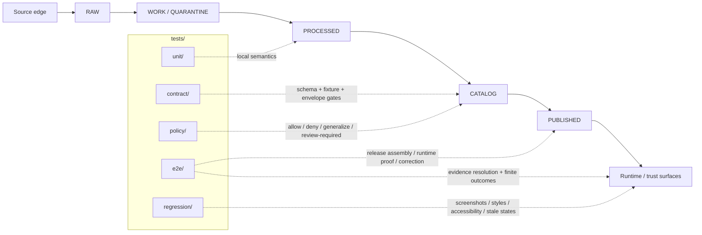

<!-- [KFM_META_BLOCK_V2]
doc_id: kfm://doc/<TODO-tests-readme-uuid>
title: tests
type: standard
version: v1
status: published
owners: @bartytime4life
created: <TODO: verify YYYY-MM-DD>
updated: 2026-03-21
policy_label: public
related: [../README.md, ../CONTRIBUTING.md, ../.github/README.md, ../.github/CODEOWNERS, ../contracts/README.md, ../docs/README.md]
tags: [kfm, tests, verification, readme]
notes: [doc_id, created date, owner, and related paths still need live-repo verification; the March 20–21 2026 PDF corpus confirms doctrine and proposed test families, but not the mounted tests tree]
[/KFM_META_BLOCK_V2] -->

# tests

Governed verification surface for KFM proof objects, trust cues, negative paths, and release/correction drills.

> [!NOTE]
> The meta-block value `status: published` is preserved from the supplied baseline as the document record. The impact block below describes the current maturity of the `tests/` surface itself.

> **Status:** experimental  
> **Owners:** `@bartytime4life` *(carried forward from the supplied baseline; recheck against `../.github/CODEOWNERS` before merge)*  
> **Path:** `tests/README.md`  
> **Repo fit:** directory index for trust-bearing verification families, fixtures, regression views, and drill expectations  
> **Quick jump:** [Scope](#scope) · [Repo fit](#repo-fit) · [Accepted inputs](#accepted-inputs) · [Exclusions](#exclusions) · [Directory tree](#directory-tree) · [Quickstart](#quickstart) · [Usage](#usage) · [Diagram](#diagram) · [Operating tables](#operating-tables) · [Task list](#task-list--definition-of-done) · [FAQ](#faq) · [Appendix](#appendix)


> [!IMPORTANT]
> `tests/` is not a generic QA bucket. In KFM, verification is part of the governed truth path, the trust membrane, release law, runtime accountability, and visible correction. A green build that cannot prove why a release is trustworthy is still incomplete.

---

## Scope

`tests/` is the repo-facing verification surface for Kansas Frontier Matrix.

In KFM terms, verification attaches to transitions across the governed path — `Source edge -> RAW -> WORK / QUARANTINE -> PROCESSED -> CATALOG -> PUBLISHED` — and then returns at runtime trust surfaces, rollback paths, and correction propagation. This directory exists to make those proof burdens reviewable instead of merely implied.

That makes the scope broader than “does the code run?” The stronger questions are:

- can intake prove admissibility, replayability, and quarantine behavior?
- can publication prove why a release was promotable?
- can runtime prove why a response resolved to `ANSWER`, `ABSTAIN`, `DENY`, or `ERROR`?
- can correction and rollback stay visible after something changes?

> [!CAUTION]
> This README is grounded in the March 2026 KFM PDF corpus **plus the supplied `tests/README.md` baseline**. No mounted repo tree, workflow YAML, deployment manifests, dashboards, or runtime logs were directly visible in this session. Folder names, merge-blocking jobs, and fixture locations below therefore distinguish **confirmed proof burdens** from **proposed physical layout**.

### Status markers used here

| Marker | Meaning in this README |
|---|---|
| **CONFIRMED** | Directly supported by the attached March 2026 KFM corpus or the supplied baseline text |
| **INFERRED** | Strongly implied by repeated doctrine, but not directly rechecked in a mounted repo tree |
| **PROPOSED** | Recommended path, layout, or starter pattern that fits KFM doctrine |
| **UNKNOWN** | Not established strongly enough in this session to present as settled repo reality |
| **NEEDS VERIFICATION** | Recheck directly in the working tree, CI inventory, or emitted proof objects before merge |

## Repo fit

**Path:** `tests/README.md`  
**Role:** directory-level guide for governed verification families, proof burdens, and maintenance rules.

> [!NOTE]
> Relative links are preserved where the supplied baseline already used them. Their presence in the live tree still needs direct verification before merge.

### Upstream anchors

| Surface | Why it matters | Status in this README |
|---|---|---|
| [`../README.md`](../README.md) | Root project contract and top-level navigation | **NEEDS VERIFICATION** in live tree |
| [`../CONTRIBUTING.md`](../CONTRIBUTING.md) | Change discipline, review flow, and contribution gates | **NEEDS VERIFICATION** in live tree |
| [`../.github/README.md`](../.github/README.md) | Collaboration / workflow context for merge-blocking checks | **NEEDS VERIFICATION** in live tree |
| [`../.github/CODEOWNERS`](../.github/CODEOWNERS) | Review and ownership boundary for `/tests/` | **NEEDS VERIFICATION** in live tree |
| [`../contracts/README.md`](../contracts/README.md) | Canonical contract layer that tests must not silently outrun | **NEEDS VERIFICATION** in live tree |
| [`../docs/README.md`](../docs/README.md) | Documentation index and runbook surface | **NEEDS VERIFICATION** in live tree |

### Adjacent and downstream surfaces

| Surface | Intended relationship | Current status |
|---|---|---|
| [`./unit/`](./unit/) | Deterministic local semantics and helper behavior | **PROPOSED** starter family |
| [`./contract/`](./contract/) | Schema, envelope, valid/invalid fixtures, and route contract checks | **PROPOSED** starter family |
| [`./policy/`](./policy/) | Allow / deny / generalize / review-required behavior and rule fixtures | **PROPOSED** starter family |
| [`./e2e/`](./e2e/) | End-to-end governed proof across release, runtime, and correction | **PROPOSED** starter family |
| [`./regression/`](./regression/) | Screenshot/view/style/asset/tile/trust-state regression | **PROPOSED** starter family |
| [`../fixtures/hydrology/`](../fixtures/hydrology/) | Public-safe first-slice fixtures used by multiple verification families | **PROPOSED** adjacent surface |
| [`../docs/verification/`](../docs/verification/) | Verification matrices, doctrine notes, and checklists | **PROPOSED** adjacent surface |
| [`../runbooks/restore-drill.md`](../runbooks/restore-drill.md) | Restore drill runbook referenced by e2e or release verification | **PROPOSED** adjacent surface |

## Accepted inputs

Content that belongs in or directly around `tests/` includes:

- unit suites for deterministic local behavior
- schema and contract fixtures, including valid and invalid examples
- policy outcome tests for `allow`, `deny`, `generalize`, and `review-required`
- end-to-end flows for release assembly, runtime evidence resolution, and correction behavior
- screenshot and saved-view baselines for trust cues, stale states, and cartographic regression
- keyboard, reduced-motion, and trust-visible accessibility checks
- public-safe hydrology fixtures or query packs used to exercise the first thin slice
- thin helper code that exists to execute or fail a governed test or drill

## Exclusions

The following do **not** belong here as authoritative source-of-truth content:

- canonical contracts, schemas, and vocabularies  
  → keep those under `../contracts/` and related schema surfaces

- primary policy bundles, reason registries, and stewardship rule sets  
  → keep those under `../policy/`

- runtime application code, map components, API handlers, workers, or connectors  
  → keep those in app / package / service directories

- release manifests, proof packs, correction notices, and audit records as the **primary** record  
  → emit them from their governed lanes and let tests consume or verify them

- raw, work, quarantine, processed, catalog, or published data as storage truth  
  → keep those in their truth-path zones

- long-form runbooks or architecture rationale  
  → keep those under `../docs/` or `../runbooks/`

## Directory tree

> [!NOTE]
> The tree below is the **strongest currently visible proposed shape** from the March 20–21 manuals. It is more defensible than asserting older path names as if mounted, but it still needs direct repo inspection before merge.

```text
tests/
├── README.md
├── unit/
├── contract/
├── policy/
├── e2e/
│   ├── release_assembly/
│   ├── runtime_proof/
│   └── correction/
└── regression/
```

The `e2e/` subgroup names above are **PROPOSED scenario groupings**, not confirmed on-disk folders. A mounted repo may express them as subdirectories, tags, suites, or named drill packs.

### Path variants to verify before merge

| Carried-forward name from older baseline | Current evidence status | Recommended disposition |
|---|---|---|
| `tests/contracts/` | **NEEDS VERIFICATION** | Prefer `tests/contract/` unless the live tree proves plural naming |
| `tests/integration/` | **NEEDS VERIFICATION** | Keep only if the live repo has a distinct boundary-slice family; otherwise absorb into `e2e/` or service-local suites |
| `tests/accessibility/` | **NEEDS VERIFICATION** | Accessibility is a **CONFIRMED proof burden**, but current March 20 docs do not prove a dedicated top-level folder |
| `tests/reproducibility/` | **NEEDS VERIFICATION** | Reproducibility and release-linkage are **CONFIRMED burdens**, but current March 20 docs do not prove a dedicated top-level folder |

[Back to top](#tests)

## Quickstart

### Inspection-first inventory

Use read-only commands first. They reveal what exists without assuming a specific runner or CI shape.

```bash
# inventory the visible tests surface
find tests -maxdepth 3 \( -type d -o -type f \) | sort

# inspect adjacent governed surfaces that often co-change with tests
find fixtures/hydrology docs/verification runbooks .github/workflows -maxdepth 3 -type f 2>/dev/null | sort

# recheck ownership and workflow boundaries
sed -n '1,220p' .github/CODEOWNERS 2>/dev/null
find .github/workflows -maxdepth 2 -type f 2>/dev/null | sort

# locate trust-bearing object vocabulary across likely verification surfaces
grep -RIn "SourceDescriptor\|IngestReceipt\|ValidationReport\|DatasetVersion\|CatalogClosure\|DecisionEnvelope\|ReviewRecord\|ReleaseManifest\|EvidenceBundle\|RuntimeResponseEnvelope\|CorrectionNotice" \
  tests fixtures docs runbooks 2>/dev/null || true

# locate negative-state language and runtime outcomes
grep -RIn "ABSTAIN\|DENY\|ERROR\|stale-visible\|withdrawn\|superseded\|correction-pending\|generalize\|review-required" \
  tests docs apps 2>/dev/null || true
```

### First verification pass

1. Confirm the actual `tests/` tree and whether it matches the proposed `unit / contract / policy / e2e / regression` skeleton.
2. Confirm whether `release_assembly`, `runtime_proof`, and `correction` exist as folders, scenario tags, or named drill packs.
3. Confirm where screenshot baselines, public-safe hydrology fixtures, and restore/correction runbooks actually live.
4. Confirm which checks are merge-blocking versus advisory only.
5. Confirm whether accessibility, cartographic regression, and reduced-motion checks live under `tests/regression/`, `tests/ui/`, or another mounted location.
6. Confirm whether any restore or correction drills have ever been exercised and archived.

> [!TIP]
> In KFM, repo-native evidence outranks README prose. If the mounted tree disagrees with this file, keep the proof burdens and update the paths.

## Usage

### What `tests/` is

`tests/` is:

- the repo-facing proof surface for governed behavior
- one of the places where KFM turns doctrine into executable evidence
- the seam where contracts, policy, cartography, runtime outcomes, and correction behavior become reviewable
- a place where negative outcomes are first-class and testable instead of embarrassing edge cases

### What `tests/` is not

`tests/` is **not**:

- a substitute for authoritative schemas or policy bundles
- a generic “quality” folder detached from publication and correction law
- a place to hide uncertain implementation state behind broad coverage language
- a dump site for artifacts that should be owned by truth-path, release, or documentation surfaces

### Place new work by burden, not habit

| Proof burden | Likely home | What it must prove |
|---|---|---|
| Deterministic local semantics | [`./unit/`](./unit/) | Pure transforms, helpers, selection logic, small adapters |
| Schema / envelope / invalid-fixture gates | [`./contract/`](./contract/) | Object shape, valid vs invalid examples, contract drift, reason/obligation expectations |
| Policy outcomes | [`./policy/`](./policy/) | `allow`, `deny`, `generalize`, `review-required`, role and sensitivity boundaries |
| Release assembly | `./e2e/release_assembly/` or tagged `./e2e/` scenarios | Release manifest completeness, proof-pack linkage, post-deploy verify before trust |
| Runtime proof | `./e2e/runtime_proof/` or tagged `./e2e/` scenarios | EvidenceBundle drill-through, citation-negative behavior, finite runtime outcomes |
| Correction / rollback | `./e2e/correction/` or drill harnesses tied to `../runbooks/` | Visible stale / superseded / withdrawn / correction-pending propagation and recovery |
| Trust-state, cartographic, and accessibility regression | [`./regression/`](./regression/) | Screenshots, saved views, style/assets, keyboard paths, reduced-motion behavior, trust cues |

> [!TIP]
> If the live repo already has a dedicated `tests/integration/` family, keep it. The rule is not “force one tree”; the rule is “make each proof burden explicit and reviewable.”

### Fixtures, baselines, and drill artifacts

Keep fixtures realistic enough to catch the failures KFM actually cares about:

- public-safe hydrology examples are preferred for first-slice regression and runtime packs
- screenshot baselines should capture trust cues and failure states, not only attractive map views
- invalid fixtures should be named by *why* they fail, not only by format
- drill artifacts should preserve release context, decision IDs, and correction lineage rather than only pass/fail output

### Working rule for scaffolded families

A present directory is not the same thing as earned coverage. Treat scaffolded folders, placeholder READMEs, and draft harnesses as contracts waiting for proof, not as maturity already achieved.

## Diagram


```mermaid
flowchart LR
    SE["Source edge"] --> RAW["RAW"]
    RAW --> WQ["WORK / QUARANTINE"]
    WQ --> PROC["PROCESSED"]
    PROC --> CAT["CATALOG"]
    CAT --> PUB["PUBLISHED"]
    PUB --> RT["Runtime / trust surfaces"]

    subgraph T["tests/"]
      U["unit/"]
      C["contract/"]
      P["policy/"]
      E["e2e/"]
      R["regression/"]
    end

    U -. local semantics .-> PROC
    C -. schema + fixture + envelope gates .-> CAT
    P -. allow / deny / generalize / review-required .-> CAT
    E -. release assembly / runtime proof / correction .-> PUB
    E -. evidence resolution + finite outcomes .-> RT
    R -. screenshots / styles / accessibility / stale states .-> RT
```

## Operating tables

### Verification family matrix

| Family or lens | Minimum proof burden | Typical artifacts or fixtures |
|---|---|---|
| `unit/` | Deterministic local behavior | focused fixtures, helper assertions, edge-case inputs |
| `contract/` | Schema validity and route semantics | schemas, valid fixtures, invalid fixtures, payload traces |
| `policy/` | Fail-closed outcome grammar | reason codes, obligation codes, allow/deny/generalize fixtures |
| `e2e/` | Governed end-to-end trust loop | release manifest refs, evidence traces, correction notices, rollback records |
| `regression/` | Trust-visible continuity under change | screenshots, saved views, style packs, reduced-motion and keyboard runs |

### Change-trigger matrix

| If a change touches… | Minimum verification expectation |
|---|---|
| contracts or schemas | schema validation, valid/invalid fixtures, route contract tests, no silent envelope drift |
| policy bundles or review rules | allow/deny/generalize/review-required cases, role-boundary checks, fail-closed defaults |
| map style or delivery assets | screenshot/view regression, asset reachability, legend/trust-cue continuity, stale/generalized states |
| runtime synthesis or Evidence Drawer behavior | citation-negative tests, EvidenceBundle drill-through, visible finite outcomes |
| release / promotion logic | proof-pack completeness, post-deploy verify, rollback and correction readiness |
| docs that change trust-bearing behavior | docs gate plus agreement across contracts, examples, and verification expectations |

### Negative-path checks worth protecting early

| Negative path | Why it matters |
|---|---|
| broken EvidenceBundle resolution | prevents plausible but unsupported public claims |
| citation-negative runtime response | ensures the system abstains, denies, or errors instead of bluffing |
| policy denial or generalization | proves fail-closed behavior under rights or sensitivity pressure |
| stale / superseded / withdrawn state | keeps derived surfaces from silently outranking release truth |
| correction drill | proves that historical integrity remains visible after change |
| style / asset failure | avoids a blank or misleading map that hides trust context |

## Task list / Definition of done

A healthy `tests/README.md` should make the directory more truthful, not more theatrical.

- [ ] Recheck the live `tests/` tree, sibling README files, and owner metadata before merge
- [ ] Confirm whether `contract/`, `policy/`, `e2e/`, and `regression/` are the mounted names or only proposed names
- [ ] Keep proof burdens explicit even if the live tree uses different folder names
- [ ] Keep contracts, policy, fixtures, docs, and tests aligned for behavior-significant change
- [ ] Prefer negative-path proof for trust-bearing work, not only happy-path confirmation
- [ ] Keep screenshot baselines focused on trust cues and failure states
- [ ] Maintain at least one rollback drill and one correction drill for any public-safe thin slice
- [ ] Update this README whenever a verification family is added, renamed, removed, or materially repurposed

## FAQ

### Why does `tests/` talk about governed verification instead of generic QA?

Because KFM treats verification as part of truth-state transition, publication, runtime trust, rollback, and correction. A passing build that cannot prove those behaviors is still incomplete.

### Why are some folder names marked **PROPOSED** or **NEEDS VERIFICATION**?

Because the current session exposed PDFs only. The March 20–21 manuals strongly confirm the *burdens* that must be tested, but they do not directly prove the mounted repo tree.

### Where do accessibility and reduced-motion checks live?

They are a **CONFIRMED** proof burden. The strongest visible March 20 docs do not prove a dedicated top-level `tests/accessibility/` folder, so this README routes them through `regression/` unless the mounted repo proves another location.

### Why is hydrology still the preferred first thin slice?

Because it is comparatively public-safe while still exercising source descriptors, validation, release evidence, Evidence Drawer drill-through, runtime outcomes, and correction/rollback behavior.

### Do rollback and correction drills really belong in a tests README?

Yes. In KFM they are not only ops runbooks; they are executable proof that the system can recover or correct without losing lineage or hiding state from users.

### What if the live repo already uses different names than this README?

Prefer mounted repo truth. Keep the proof burdens intact, update the tree and links, and downgrade any stale path claim that the live repo does not support.

[Back to top](#tests)

## Appendix

<details>
<summary><strong>Appendix A — Evidence basis used for this README</strong></summary>

This README was revised against the strongest currently visible March 20–21, 2026 KFM layer:

- the replacement-grade master design manual for proposed repo skeleton, release law, verification model, and thin-slice sequencing
- the expanded working manual for truth posture, proof-object gates, correction/rollback drills, and hydrology-first rationale
- the unified geospatial architecture manual for map-specific verification, regression expectations, visible negative states, and the hydrology thin-slice blueprint
- the MapLibre UI architecture report for trust-visible shell behavior, Evidence Drawer centrality, and accessibility/reduced-motion obligations
- the Pass 5 atlas for project-wide doctrine, artifactization pressure, and the importance of keeping correction and negative states visible

The supplied baseline `tests/README.md` was preserved as the redesign starting point, but unsupported older folder claims were downgraded where stronger March 20 evidence pointed to a different proposed tree.

</details>

<details>
<summary><strong>Appendix B — Direct verification still needed before merge</strong></summary>

Before treating this README as fully settled repo documentation, verify:

- the mounted `tests/` directory tree and any sibling READMEs
- whether `.github/README.md` and `.github/CODEOWNERS` exist at the preserved relative paths
- which checks are actually merge-blocking
- where screenshot baselines, hydrology fixtures, and drill runbooks live
- whether accessibility, cartographic regression, and reduced-motion checks have a dedicated path
- whether any rollback or correction drill has already been exercised and archived

</details>

<details>
<summary><strong>Appendix C — Reconciliation rule if the mounted repo differs</strong></summary>

If live repo inspection later proves a different layout:

1. keep the doctrinal distinctions between contract, policy, end-to-end governed proof, regression, and correction
2. replace guessed paths with mounted paths immediately
3. preserve the burden-first language even if folder names change
4. downgrade any unsupported maturity claim to **UNKNOWN** until the repo proves otherwise

The goal is not to preserve a guessed tree. The goal is to preserve truthful verification law.

</details>
