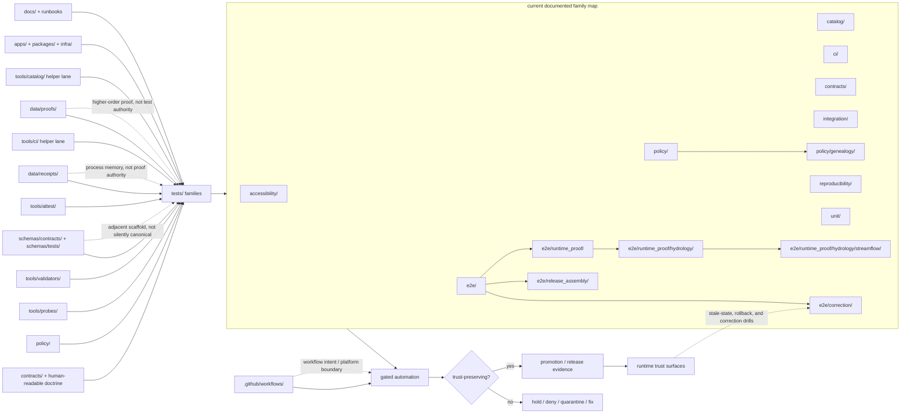

<!-- [KFM_META_BLOCK_V2]
doc_id: kfm://doc/tests-readme
title: tests
type: standard
version: v1
status: published
owners: [@bartytime4life]
created: NEEDS_VERIFICATION__YYYY-MM-DD
updated: 2026-04-18
policy_label: public
related: [../README.md, ../CONTRIBUTING.md, ../.github/README.md, ../.github/CODEOWNERS, ../.github/workflows/README.md, ../.github/watchers/README.md, ../contracts/README.md, ../policy/README.md, ../schemas/README.md, ../schemas/contracts/README.md, ../schemas/tests/README.md, ../data/receipts/README.md, ../data/proofs/README.md, ../docs/README.md, ../tools/probes/README.md, ../tools/validators/README.md, ../tools/validators/promotion_gate/README.md, ../tools/attest/README.md, ./accessibility/README.md, ./catalog/README.md, ./ci/README.md, ./contracts/README.md, ./e2e/README.md, ./e2e/runtime_proof/README.md, ./e2e/runtime_proof/hydrology/README.md, ./e2e/runtime_proof/hydrology/streamflow/README.md, ./e2e/runtime_proof/air/pm25/README.md, ./integration/README.md, ./policy/README.md, ./policy/genealogy/README.md, ./reproducibility/README.md, ./unit/README.md]
tags: [kfm, tests, verification, readme, ci, catalog, contracts, receipts, proofs]
notes: [Updated to align the top-level tests family map with the stronger runtime_proof and e2e lane distinctions, including the hydrology runtime-proof subtree. doc_id and created date still need live-repo verification. Owner remains confirmed by current CODEOWNERS coverage for /tests/. This revision preserves governed-verification framing while making runtime response, review record, receipt, and proof separation more explicit. This revision also keeps the probe -> receipt -> validator -> policy -> workflow chain visible without overclaiming runner or merge-gate maturity.]
[/KFM_META_BLOCK_V2] -->

<a id="top"></a>

# `tests/`

Governed verification surface for KFM proof objects, trust cues, negative paths, release and correction drills, helper-proof boundaries, and receipt-aware validation pressure.

> [!NOTE]
> The meta-block value `status: published` preserves the current document-record baseline.  
> The impact block below describes the current maturity of the `tests/` surface itself.

<div align="left">


</div>

| Field | Value |
|---|---|
| **Status** | experimental |
| **Owners** | `@bartytime4life` |
| **Path** | `tests/README.md` |
| **Repo fit** | top-level index for governed verification families, fixtures, drill expectations, helper-proof lanes, and review-facing proof boundaries |
| **Quick jump** | [Scope](#scope) · [Repo fit](#repo-fit) · [Accepted inputs](#accepted-inputs) · [Exclusions](#exclusions) · [Current verified snapshot](#current-verified-snapshot) · [Directory tree](#directory-tree) · [Quickstart](#quickstart) · [Usage](#usage) · [Diagram](#diagram) · [Operating tables](#operating-tables) · [Task list](#task-list--definition-of-done) · [FAQ](#faq) · [Appendix](#appendix) |

> [!IMPORTANT]
> `tests/` is not a generic QA bucket.
>
> In KFM, verification is part of governed publication, runtime trust, correction discipline, helper accountability, receipt/proof separation, and fail-closed review.
> A green check that cannot explain **why** a release, renderer, validator, runtime response, review record, receipt, or proof object is trustworthy is still incomplete.

> [!TIP]
> Keep the verification split explicit:
>
> - **probes observe**
> - **receipts record process memory**
> - **validators verify**
> - **policy decides**
> - **workflows orchestrate**
> - **tests prove those boundaries hold under pressure**
>
> The top-level `tests/` lane is where those burdens become inspectable rather than assumed.

---

## Scope

`tests/` is the repo-facing governed verification surface for Kansas Frontier Matrix.

In KFM terms, this directory gathers the proof burdens that sit closest to day-to-day engineering work: deterministic local behavior, governed boundary checks, contract and schema validation, policy enforcement, accessibility-critical trust surfaces, reproducibility expectations, CI-helper proof, catalog-helper proof, validator-facing contract proof, probe-receipt proof, and end-to-end proof of release, runtime, rollback, and correction behavior.

That is broader than “do the tests pass?” The stronger questions are:

- can the repo prove that contracts fail loudly instead of drifting silently?
- can policy prove `allow`, `deny`, `abstain`, `hold`, or other guarded outcomes under realistic pressure?
- can runtime behavior stay inspectable when evidence fails, citations fail, or trust state changes?
- can rollback and correction remain visible instead of being polished away?
- can reviewer-facing CI helpers prove that they render governed artifacts faithfully without quietly redefining law?
- can catalog crosslink helpers prove closure consistency without becoming metadata truth?
- can validators and attestation helpers rely on valid and invalid object proof instead of wishful object shapes?
- can probe-emitted receipts be validated as process memory without collapsing into proofs?
- can reviewer-facing runtime context remain distinct from outward runtime responses?
- can composed reviewer handoff artifacts stay faithful to the underlying bundle, diff, policy, receipt, and proof records without replacing them?

### Evidence boundary used here

| Evidence layer | What this README treats as settled |
|---|---|
| **CONFIRMED — current repo / current lane docs** | The repo exposes `tests/` as a real top-level directory; adjacent lane docs explicitly document `tests/ci/` as a helper-proof lane, `tests/catalog/` as a catalog-helper proof lane, and `tests/contracts/` as a contract-facing proof lane; the visible family layout includes `tests/e2e/` leaf directories and the `tests/policy/genealogy/` child lane; adjacent docs such as `README.md`, `CONTRIBUTING.md`, `.github/README.md`, `contracts/README.md`, `policy/README.md`, `schemas/README.md`, `docs/README.md`, `tools/probes/README.md`, `tools/validators/README.md`, and `tools/attest/README.md` are all part of the current documentation surface; `/tests/` ownership remains covered in `.github/CODEOWNERS`. |
| **CONFIRMED — current workflow / probe lane posture** | `.github/workflows/README.md` and `.github/watchers/README.md` are present as documentation boundaries. Checked-in merge-blocking workflow depth, active probe orchestration, and watcher orchestration still need branch and platform verification where not directly proven. |
| **CONFIRMED — current schema adjacency** | `schemas/` is no longer effectively README-only; visible adjacent lanes include `schemas/contracts/`, `schemas/contracts/v1/`, and `schemas/tests/`, which materially affect how contract-facing verification and nested fixture scaffolds should be described. |
| **CONFIRMED — current governed data adjacency** | `data/receipts/` and `data/proofs/` are explicit adjacent surfaces in the documentation lattice. Tests should reflect their distinct roles rather than flatten them. |
| **CONFIRMED — KFM doctrine** | Verification is trust-bearing, not ornamental; negative tests matter; release proof, rollback, correction, stale visibility, evidence drill-through, helper-proof surfaces, receipt and process-memory boundaries, runtime response vs review record vs receipt vs proof separation, and hydrology-first thin-slice proof remain part of the KFM verification model. |
| **CONFIRMED — current e2e runtime subtree** | `tests/e2e/runtime_proof/README.md`, `tests/e2e/runtime_proof/hydrology/README.md`, and `tests/e2e/runtime_proof/hydrology/streamflow/README.md` are now active adjacent family docs that should be reflected in the top-level test map. |
| **INFERRED / PROPOSED overlay** | Some manuals use shorthand starter families such as `tests/contract/` or `tests/regression/`; the current repo realizes those burdens with different documented names and now does so alongside explicitly documented `tests/ci/`, `tests/catalog/`, and `tests/contracts/` lanes. |
| **NEEDS VERIFICATION** | Exact executable suite depth, actual runner and toolchain, required checks, rulesets, screenshot baseline inventory, fixture density, whether schema-side fixtures feed blocking runners, whether rollback and correction drills have been exercised on the checked-out branch, and how probe- or watcher-receipt cases are wired in local or CI runners. |

> [!CAUTION]
> Directory presence is **not** the same thing as mature coverage.  
> This README distinguishes **what is documented and visible now** from **what KFM doctrine says the verification system must eventually prove**.

### Status markers used here

| Marker | Meaning in this README |
|---|---|
| **CONFIRMED** | Visible in the current documentation and repo-facing surface or directly grounded in stable KFM doctrine |
| **INFERRED** | Strongly supported by adjacent repo docs or repeated doctrine, but not re-proven from a mounted checkout in this session |
| **PROPOSED** | Buildable structure, practice, or future consolidation that fits KFM doctrine but is not asserted as current repo fact |
| **UNKNOWN** | Not verified strongly enough in this session to state as current repo reality |
| **NEEDS VERIFICATION** | A path, command, workflow, or implementation detail that should be checked against the checked-out branch before merge |

[Back to top](#top)

---

## Repo fit

**Path:** `tests/README.md`  
**Role in repo:** directory-level guide for governed verification families, test-placement boundaries, and helper-proof surfaces.

### Upstream anchors

| Surface | Why it matters | Status here |
|---|---|---|
| [`../README.md`](../README.md) | root project identity and operating posture | **CONFIRMED** |
| [`../CONTRIBUTING.md`](../CONTRIBUTING.md) | contributor workflow, review discipline, and documentation expectations | **CONFIRMED** |
| [`../.github/README.md`](../.github/README.md) | repo gatehouse for CI, review boundaries, and governance automation | **CONFIRMED** |
| [`../.github/CODEOWNERS`](../.github/CODEOWNERS) | ownership and review boundary for `/tests/` | **CONFIRMED** |
| [`../.github/workflows/README.md`](../.github/workflows/README.md) | workflow-lane surface and documented automation boundary | **CONFIRMED** |
| [`../.github/watchers/README.md`](../.github/watchers/README.md) | watcher-lane doctrine and orchestration boundary | **CONFIRMED** |
| [`../contracts/README.md`](../contracts/README.md) | authoritative contract-source layer that tests should consume, not replace | **CONFIRMED** |
| [`../policy/README.md`](../policy/README.md) | policy and governance posture that tests should exercise rather than restate | **CONFIRMED** |
| [`../schemas/README.md`](../schemas/README.md) | parent schema boundary, subtree index, and schema-home caution | **CONFIRMED** |
| [`../schemas/contracts/README.md`](../schemas/contracts/README.md) | live schema-side contract scaffold lane adjacent to contract-facing verification | **CONFIRMED** |
| [`../schemas/contracts/v1/README.md`](../schemas/contracts/v1/README.md) | visible first-wave machine-contract family split that tests may pressure-test without silently canonizing it | **CONFIRMED** |
| [`../schemas/tests/README.md`](../schemas/tests/README.md) | nested schema-side fixture scaffold that must stay distinct from repo-wide governed verification | **CONFIRMED** |
| [`../data/receipts/README.md`](../data/receipts/README.md) | broader process-memory lane that tests may reference without becoming receipt storage | **CONFIRMED** |
| [`../data/proofs/README.md`](../data/proofs/README.md) | proof lane that stays distinct from tests and receipts | **CONFIRMED** |
| [`../tools/probes/README.md`](../tools/probes/README.md) | probe lane that emits process memory and materiality signals | **CONFIRMED** |
| [`../tools/validators/README.md`](../tools/validators/README.md) | validator lane that consumes tested shapes without replacing them | **CONFIRMED** |
| [`../tools/validators/promotion_gate/README.md`](../tools/validators/promotion_gate/README.md) | promotion validator lane that depends on governed decision objects, receipt linkage, and fail-closed examples | **CONFIRMED** |
| [`../tools/attest/README.md`](../tools/attest/README.md) | attestation lane that consumes validated higher-order trust objects | **CONFIRMED** |
| [`../docs/README.md`](../docs/README.md) | governed documentation index and runbook surface | **CONFIRMED** |
| [`./ci/README.md`](./ci/README.md) | helper-proof lane for CI-facing renderer behavior | **CONFIRMED via adjacent documentation** |
| [`./catalog/README.md`](./catalog/README.md) | helper-proof lane for catalog crosslink and closure behavior | **CONFIRMED via adjacent documentation** |
| [`./contracts/README.md`](./contracts/README.md) | contract-facing proof lane for valid and invalid object behavior | **CONFIRMED via adjacent documentation** |
| [`./e2e/README.md`](./e2e/README.md) | whole-path proof family for runtime, release, and correction burdens | **CONFIRMED via adjacent documentation** |

### Confirmed downstream surfaces

| Surface | Current meaning |
|---|---|
| [`./accessibility/`](./accessibility/) | accessibility-focused verification family |
| [`./catalog/`](./catalog/README.md) | catalog-helper proof family |
| [`./ci/`](./ci/) | CI renderer and helper-proof family |
| [`./contracts/`](./contracts/) | contract-facing test family |
| [`./e2e/`](./e2e/) | end-to-end verification family |
| [`./integration/`](./integration/) | integration-slice verification family |
| [`./policy/`](./policy/) | policy and governance behavior family with a visible child lane |
| [`./reproducibility/`](./reproducibility/) | reproducibility and bounded-regression family |
| [`./unit/`](./unit/) | deterministic local-behavior family |
| [`./e2e/correction/`](./e2e/correction/) | correction and supersession drill family |
| [`./e2e/release_assembly/`](./e2e/release_assembly/) | release, promotion, and publish-path proof family |
| [`./e2e/runtime_proof/`](./e2e/runtime_proof/) | request-time runtime and outcome-proof family |
| [`./e2e/runtime_proof/hydrology/`](./e2e/runtime_proof/hydrology/) | hydrology runtime-proof domain index |
| [`./e2e/runtime_proof/hydrology/streamflow/`](./e2e/runtime_proof/hydrology/streamflow/) | streamflow runtime-proof leaf for baseline support and finite outcomes |
| [`./e2e/runtime_proof/air/pm25/`](./e2e/runtime_proof/air/pm25/README.md) | domain-specific runtime-proof leaf for PM2.5 trust and receipt-aware outward behavior |
| [`./policy/genealogy/`](./policy/genealogy/README.md) | genealogy-specific policy-behavior child lane for consent, living-person, DNA, provenance, and publication-control negative tests |

> [!NOTE]
> The workflow lane still matters to `tests/` even when the public automation surface is documentation-led.  
> That sharpens the README’s stance: **test families and helper-proof lanes are visible, but merge-blocking automation still needs platform-level or branch-local verification**.

### Current adjacent schema-side signals

| Surface | Current reading | Why `tests/` has to care |
|---|---|---|
| [`../schemas/`](../schemas/README.md) | no longer a one-file warning surface; now a real parent subtree | top-level verification language must stop pretending adjacent schema lanes are absent |
| [`../schemas/contracts/`](../schemas/contracts/README.md) | visible machine-file-bearing scaffold with `v1/` and `vocab/` | contract-facing verification now has visible machine-file adjacency |
| [`../schemas/contracts/v1/`](../schemas/contracts/v1/README.md) | visible first-wave machine-contract families such as `common/`, `correction/`, `data/`, `evidence/`, `policy/`, `release/`, `runtime/`, and `source/` | tests can now refer to visible first-wave family names without inventing them |
| [`../schemas/tests/`](../schemas/tests/README.md) | visible nested fixture scaffold with `fixtures/` | top-level `tests/` should distinguish repo-wide governed verification from schema-side scaffold mirrors or nested fixture experiments |

### Path reconciliation note

The repo-facing docs and the manuals are directionally aligned, but not identical in naming.

| Verification burden | Current documented repo path | Manual shorthand seen in doctrine | Working rule |
|---|---|---|---|
| catalog closure and crosslink proof | `tests/catalog/` | often implicit under catalog helper or promotion validation language | keep the explicit helper-proof lane now that it is documented |
| CI helper rendering proof | `tests/ci/` | often implicit under workflow or summary language | keep the explicit helper-proof lane now that it is documented |
| contract validation | `tests/contracts/` | `tests/contract/` | keep the current repo’s plural path until the repo itself changes |
| accessibility trust checks | `tests/accessibility/` | often grouped under broader UI or regression language | keep the explicit top-level accessibility family |
| integration slices | `tests/integration/` | sometimes absorbed into general verification and e2e doctrine | keep the explicit integration family |
| reproducibility and bounded regression | `tests/reproducibility/` | often described as `regression` or reproducibility burden | keep current repo naming and describe the doctrinal burden clearly |
| release proof and runtime proof and correction | `tests/e2e/...` | `tests/e2e/` plus doctrinal drill language | current repo and doctrine are closely aligned here |
| probe receipt validation | `tests/contracts/`, `tests/integration/`, or `tests/e2e/...` depending on burden | often implicit under validator or watcher language | keep burden-first placement: shape in contracts, cross-boundary flow in integration or e2e |
| review-record-aware runtime proof | `tests/e2e/runtime_proof/...` when outward runtime trust is the burden | often implicit under runtime or audit language | keep runtime response, review record, receipt, and proof split explicit |

A second reconciliation tension still matters:

| Verification or fixture pressure | Current documented repo path | Why it is not the same thing as settled authority | Working rule |
|---|---|---|---|
| schema-side machine contracts | `schemas/contracts/**` | visible files exist, but current repo docs still keep canonical schema-home authority unresolved | acknowledge the live lane without silently moving authority |
| nested schema-side fixture scaffolds | `schemas/tests/**` | visible fixture scaffolds exist, but top-level `tests/` remains the stronger repo-wide governed verification index | keep nested scaffold language explicit and do not flatten it into repo-wide test truth |
| receipt process memory | `data/receipts/**` | visible receipt surfaces exist, but they are process memory rather than proof or test authority | test them without relocating them |
| higher-order proofs | `data/proofs/**` and attest-related surfaces | proof objects are distinct from receipt storage and from test ownership | validate their shapes without storing them here |
| reviewer-facing runtime context | runtime helper surfaces + receipt-oriented lanes | review records are distinct from outward runtime responses and from higher-order proof objects | test them without collapsing them into generic runtime artifacts |

> [!TIP]
> Prefer **current repo names** over manual shorthand when writing commit-ready README text.  
> Prefer **manual burden language** over folder aesthetics when deciding what a family must prove.

[Back to top](#top)

---

## Accepted inputs

Content that belongs in `tests/` includes:

- unit tests for deterministic local behavior
- integration tests for governed slices across real boundaries
- CI-helper tests for reviewer-facing summaries, diff rendering, policy-summary rendering, and composed review handoff rendering
- catalog-helper tests for triplet crosslink proof, aligned and misaligned closure fixtures, and stable machine-readable reports
- contract-validation tests for envelopes, examples, receipt and proof linkage shapes, and schema drift
- policy tests for allow, deny, abstain, and hold behavior
- child-family indexes and narrowly scoped leaf READMEs for currently visible sublanes such as `tests/policy/genealogy/`
- negative-path tests for evidence failure, citation failure, rights failure, stale-state handling, helper malformed-input behavior, catalog drift, receipt and proof mismatch, and correction visibility
- tests for bounded receipts and receipt-gating behavior where the main burden is proof rather than contract ownership
- review-record-aware runtime tests where reviewer-facing request-time context is part of the trust path
- end-to-end release-assembly tests
- runtime-proof suites for `ANSWER`, `ABSTAIN`, `DENY`, and `ERROR`
- hydrology runtime-proof suites where approved baseline support, source-role visibility, and fail-closed outward behavior matter
- correction, supersession, withdrawal, and stale-visibility drills
- accessibility-critical trust-surface checks
- reproducibility and bounded-regression checks where digests, counts, or stable metrics matter
- thin fixtures that are execution-oriented rather than canonical source examples
- tests that prove validators and attestation helpers are consuming well-shaped inputs rather than wishful objects
- tests that prove probe outputs remain process memory and do not silently become proof objects

[Back to top](#top)

---

## Exclusions

The following do **not** belong here as authoritative sources of truth:

- canonical schemas, OpenAPI files, vocabularies, or standards profiles  
  → keep them under `../contracts/` and related schema surfaces

- policy bundle source files, reviewer-role maps, obligation registries, or checked-in classification data  
  → keep them under `../policy/`

- runtime application code, ingestion workers, evidence resolvers, UI components, catalog helpers, validator helpers, or CI helper implementations  
  → keep them under `../apps/`, `../packages/`, `../infra/`, or `../tools/`

- release manifests, receipts, SBOMs, runtime receipts, or promoted artifacts as the **primary** record  
  → keep them in their designated governed artifact and release paths

- long-form narrative guidance, incident playbooks, or architecture rationale  
  → keep them under `../docs/`

- nested schema-lane fixture scaffolds as the implied singular repo-wide verification home  
  → keep `../schemas/tests/` explicit as a nested scaffold unless repo law changes

- large raw datasets or branch-local scratch dumps  
  → keep them out of `tests/`; use governed data zones or local ignored paths instead

- receipt archives or proof-pack archives  
  → keep them under `../data/receipts/` and `../data/proofs/`

[Back to top](#top)

---

## Current verified snapshot

The current repo-facing surface proves the following:

- `tests/` exists as a real top-level repo surface
- `tests/README.md` exists
- the documented top-level family set includes `accessibility/`, `catalog/`, `ci/`, `contracts/`, `e2e/`, `integration/`, `policy/`, `reproducibility/`, and `unit/`
- `tests/ci/README.md` exists as a documented helper-proof lane for CI renderers
- `tests/catalog/README.md` exists as a documented helper-proof lane for catalog crosslink behavior
- `tests/ci/` currently documents thin-slice proof centered on `test_render_diff_summary.py`, `test_render_bundle_diff_policy_summary.py`, and `test_render_promotion_review_handoff.py`
- `tests/catalog/` currently documents thin-slice proof centered on `test_catalog_crosslink.py` and mismatch fixtures
- `tests/contracts/` is not treated here as README-only; current docs already acknowledge executable contract-facing proof there
- `tests/policy/` is not treated here as README-only; it exposes `README.md` plus `genealogy/`
- `tests/policy/genealogy/README.md` is documented as a real child README
- `tests/e2e/` exposes `README.md`, `correction/`, `release_assembly/`, and `runtime_proof/`
- `tests/e2e/runtime_proof/` is documented as the request-time outward proof family
- `tests/e2e/runtime_proof/hydrology/README.md` is documented as the hydrology domain index under runtime proof
- `tests/e2e/runtime_proof/hydrology/streamflow/README.md` is documented as the streamflow finite-outcome leaf
- `schemas/` is no longer effectively README-only; it currently exposes `contracts/`, `schemas/`, `standards/`, `tests/`, `workflows/`, and `README.md`
- `schemas/contracts/` currently exposes `README.md`, `v1/`, and `vocab/`
- `schemas/contracts/v1/` currently exposes `common/`, `correction/`, `data/`, `evidence/`, `policy/`, `release/`, `runtime/`, `source/`, and `README.md`
- `schemas/tests/` currently exposes `README.md` and `fixtures/`
- updated adjacent docs explicitly distinguish receipts from proofs, probes from validators, validators from attestation helpers, and runtime responses from review records
- `/tests/` is assigned to `@bartytime4life` in `.github/CODEOWNERS`
- `.github/workflows/README.md` is present as the workflow-lane documentation boundary
- current workflow documentation explicitly models a receipts-first probe chain and a runtime-proof chain

> [!WARNING]
> What is still **not** proven here:
> exact test runner selection, actual executable case depth inside each family, required checks and branch-protection settings, screenshot baseline coverage, fixture density, whether nested schema-side fixtures feed blocking runners, whether restore, rollback, or correction drills have archived evidence on a checked-out branch, and how probe-oriented receipt cases are integrated into real suites.

[Back to top](#top)

---

## Directory tree

### Current documented lane map

```text
tests/
├── README.md
├── accessibility/
│   └── README.md
├── catalog/
│   ├── README.md
│   ├── test_catalog_crosslink.py
│   └── fixtures/
│       ├── promotion-record-mismatch.json
│       └── prov-mismatch.json
├── ci/
│   ├── README.md
│   ├── test_render_bundle_diff_policy_summary.py
│   ├── test_render_diff_summary.py
│   └── test_render_promotion_review_handoff.py
├── contracts/
│   ├── README.md
│   └── test_correction_notice_contract.py
├── e2e/
│   ├── README.md
│   ├── correction/
│   │   └── README.md
│   ├── release_assembly/
│   │   └── README.md
│   └── runtime_proof/
│       ├── README.md
│       └── hydrology/
│           ├── README.md
│           └── streamflow/
│               └── README.md
├── integration/
│   └── README.md
├── policy/
│   ├── genealogy/
│   │   └── README.md
│   └── README.md
├── reproducibility/
│   └── README.md
└── unit/
    └── README.md
```

### Current adjacent schema-side signal that affects test-placement language

```text
schemas/
├── README.md
├── contracts/
│   ├── README.md
│   ├── v1/
│   │   ├── README.md
│   │   ├── common/
│   │   ├── correction/
│   │   ├── data/
│   │   ├── evidence/
│   │   ├── policy/
│   │   ├── release/
│   │   ├── runtime/
│   │   └── source/
│   └── vocab/
├── tests/
│   ├── fixtures/
│   └── README.md
├── schemas/
├── standards/
└── workflows/
```

### Reading rule

Use the trees above for **current documented truth**.

Do **not** silently convert visible family presence into claims of mature, merge-blocking, or end-to-end verified coverage.

Do **not** let adjacent schema-side scaffold presence settle canonical schema-home or fixture-home authority by inertia.

Do **not** let receipt, review-record, or proof path presence settle test ownership by inertia either.

### What deeper maturity would look like (`PROPOSED` / `NEEDS VERIFICATION`)

As this surface matures, family directories should accumulate executable cases, valid and invalid fixtures, golden examples, screenshot baselines, query packs, runner-specific configuration, receipt and proof linkage cases, probe-receipt cases, review-record-aware runtime cases, and archived drill evidence that map directly to repo contracts, policy bundles, runtime boundaries, correction paths, CI-helper proof burdens, catalog-helper proof burdens, validator preconditions, attestation preconditions, and any explicitly sanctioned schema-side mirrors.

[Back to top](#top)

---

## Quickstart

### Safe inspection commands

These commands are inspection-first because they verify what is present without overcommitting to a guessed toolchain.

```bash
# inspect the visible tests surface
find tests -maxdepth 6 -type d | sort
find tests -maxdepth 6 -type f | sort

# inspect adjacent contract, schema, policy, workflow, receipt, proof, validator, attest, and probe-facing surfaces
find .github contracts data docs policy schemas tests tools -maxdepth 6 -type f 2>/dev/null | sort | sed -n '1,360p'

# inspect ownership and governance boundaries
sed -n '1,200p' .github/CODEOWNERS 2>/dev/null || true
sed -n '1,220p' .github/README.md 2>/dev/null || true
sed -n '1,220p' .github/workflows/README.md 2>/dev/null || true
sed -n '1,220p' .github/watchers/README.md 2>/dev/null || true
sed -n '1,220p' CONTRIBUTING.md 2>/dev/null || true

# inspect the current CI helper proof lane
find tests/ci -maxdepth 3 -type f 2>/dev/null | sort
sed -n '1,260p' tests/ci/README.md 2>/dev/null || true
sed -n '1,260p' tools/ci/README.md 2>/dev/null || true

# inspect the current catalog helper proof lane
find tests/catalog -maxdepth 4 -type f 2>/dev/null | sort
sed -n '1,260p' tests/catalog/README.md 2>/dev/null || true
sed -n '1,260p' tools/catalog/README.md 2>/dev/null || true

# inspect the current contracts / validators / attest adjacency
find tests/contracts -maxdepth 4 -type f 2>/dev/null | sort
sed -n '1,260p' tests/contracts/README.md 2>/dev/null || true
sed -n '1,260p' tools/probes/README.md 2>/dev/null || true
sed -n '1,260p' tools/validators/README.md 2>/dev/null || true
sed -n '1,260p' tools/validators/promotion_gate/README.md 2>/dev/null || true
sed -n '1,260p' tools/attest/README.md 2>/dev/null || true

# inspect the current e2e leaf family placement
find tests/e2e -maxdepth 6 -type f 2>/dev/null | sort
sed -n '1,240p' tests/e2e/README.md 2>/dev/null || true
sed -n '1,240p' tests/e2e/runtime_proof/README.md 2>/dev/null || true
sed -n '1,240p' tests/e2e/runtime_proof/hydrology/README.md 2>/dev/null || true
sed -n '1,240p' tests/e2e/runtime_proof/hydrology/streamflow/README.md 2>/dev/null || true
sed -n '1,240p' tests/e2e/runtime_proof/air/pm25/README.md 2>/dev/null || true

# inspect the visible policy child-lane placement
find tests/policy -maxdepth 4 -type f 2>/dev/null | sort

# inspect adjacent schema-side contract and fixture scaffolds
find schemas/contracts -maxdepth 5 -type f 2>/dev/null | sort | sed -n '1,280p'
find schemas/tests -maxdepth 5 -type f 2>/dev/null | sort | sed -n '1,280p'

# inspect likely KFM verification vocabulary without assuming a runner
grep -RIn "EvidenceRef\|EvidenceBundle\|RuntimeResponseEnvelope\|ReviewRecord\|runtime_receipt\|CorrectionNotice\|run_receipt\|ai_receipt\|attestation\|render_diff_summary\|render_bundle_diff_policy_summary\|render_promotion_review_handoff\|catalog_crosslink\|stac_change_runner\|run_receipt_validator\|hydrology\|streamflow\|baseline_support" \
  tests contracts policy schemas data tools docs scripts 2>/dev/null || true
```

### First local review pass

1. Verify which family directories contain executable suites rather than scaffold README placeholders.
2. Verify whether `tests/ci/` on the checked-out branch matches the documented thin slice.
3. Verify whether `tests/catalog/` on the checked-out branch matches the documented crosslink thin slice.
4. Verify whether `tests/contracts/` on the checked-out branch matches the documented contract-facing proof burden.
5. Verify whether receipt-oriented tests already exist for probe-generated process memory or still need to be added.
6. Verify whether review-record-aware runtime tests already exist or still need to be added.
7. Verify whether hydrology runtime-proof tests already exist beneath `tests/e2e/runtime_proof/hydrology/streamflow/` or remain documentation-only.
8. Verify whether `tests/policy/genealogy/` on the checked-out branch is still a README-only child lane or has accumulated executable cases.
9. Verify whether the checked-out branch still matches the current documented tree for `tests/`, `schemas/`, `data/`, and `.github/workflows/`.
10. Verify which checks actually block merges on the active branch.
11. Verify whether `contracts/`, `policy/`, `docs/`, `schemas/`, `data/`, `tools/`, and `tests/` move together in the same change stream.
12. Verify whether negative paths exist, not only happy-path confirmation.

> [!TIP]
> Prefer repo-native commands discovered from the checked-out branch over README-invented runner commands.  
> Inspection-first is safer than guessing a toolchain.

[Back to top](#top)

---

## Usage

### What `tests/` is

`tests/` is:

- the repo-facing proof surface for governed behavior
- the place where branch-level confidence work becomes explicit instead of implied
- the home for suites that protect KFM’s truth path, trust membrane, and fail-closed posture
- the directory that should make negative outcomes as inspectable as happy-path success
- the umbrella under which helper-proof lanes like `tests/ci/` and `tests/catalog/` stay visible instead of being hidden in workflow YAML
- the surface where receipt-, review-record-, proof-, validator-, and attestation-facing object burdens should be tested without moving authority out of their home lanes

### What `tests/` is not

`tests/` is **not**:

- a substitute for authoritative schemas or policy bundles
- a place to hide implementation drift behind broad “coverage” language
- a scratch area for one-off local experiments
- a badge generator for CI theater
- a dumping ground for artifacts better owned by `contracts/`, `policy/`, `docs/`, `tools/`, `data/`, or governed release paths

### Where a new test should live

Use the smallest fitting existing family before inventing a new top-level folder.

| Family | Place work here when… | Current documented signal |
|---|---|---|
| [`./unit/`](./unit/) | behavior is local, deterministic, and cheap to isolate | visible as a README-bearing family |
| [`./integration/`](./integration/) | a real boundary matters: ingest, resolver, store, API, probe-to-validator handoff, or projection | visible as a README-bearing family |
| [`./ci/`](./ci/README.md) | the main job is proving `tools/ci/` helper output over declared artifacts | documented helper-proof lane with thin-slice renderer tests, including composed review handoff proof |
| [`./catalog/`](./catalog/README.md) | the main job is proving `tools/catalog/` helper output over declared STAC, DCAT, PROV, and promotion refs | documented helper-proof lane with aligned and misaligned crosslink cases |
| [`./contracts/`](./contracts/) | the main risk is schema, envelope, receipt and proof linkage shape, or example drift | visible as a family with `README.md` plus contract-facing proof |
| [`./policy/`](./policy/) | the change affects allow / deny logic, reason codes, rights, or sensitivity behavior across the broader policy family | visible as a README-bearing family with a visible child lane |
| [`./policy/genealogy/`](./policy/genealogy/README.md) | the change is genealogy-specific consent, living-person, DNA, provenance, or publication-control policy behavior | visible as a README-bearing child lane under `./policy/` |
| [`./accessibility/`](./accessibility/) | trust-visible interaction, keyboard flow, reduced-friction inspection, or calm failure is the main risk | visible as a README-bearing family |
| [`./reproducibility/`](./reproducibility/) | stable digests, counts, receipts, and bounded regression matter most | visible as a README-bearing family |
| [`./e2e/release_assembly/`](./e2e/release_assembly/) | promotion, release evidence, or publish-path integrity is the question | visible as a README-bearing leaf family |
| [`./e2e/runtime_proof/`](./e2e/runtime_proof/) | request-time evidence, citations, finite answer outcomes, or review-record-aware outward trust is the question | visible as a README-bearing leaf family |
| [`./e2e/runtime_proof/hydrology/`](./e2e/runtime_proof/hydrology/) | the change is a hydrology-domain runtime-proof burden | visible as a README-bearing domain leaf |
| [`./e2e/runtime_proof/hydrology/streamflow/`](./e2e/runtime_proof/hydrology/streamflow/) | the change is a streamflow runtime-proof burden with baseline support, freshness, and finite outcome pressure | visible as a README-bearing subject leaf |
| [`./e2e/runtime_proof/air/pm25/`](./e2e/runtime_proof/air/pm25/README.md) | the change is a domain-specific request-time runtime proof burden with source-role and receipt-aware semantics | documented domain leaf beneath runtime_proof |
| [`./e2e/correction/`](./e2e/correction/) | supersession, rollback, stale visibility, withdrawal, or correction propagation must be exercised | visible as a README-bearing leaf family |

### Working rule for scaffolded families

A present directory is **not** the same thing as an active suite.

If a family currently contains only a placeholder README or thin scaffold, treat it as a documented contract boundary waiting for executable proof, not as coverage already earned.

Today, the documented visible exceptions to a pure README-only reading are:

- `tests/ci/`, which now has a documented thin-slice helper-proof surface
- `tests/catalog/`, which now has a documented thin-slice catalog-crosslink proof surface
- `tests/contracts/`, which already exposes executable contract-facing proof
- `tests/policy/`, which already exposes a visible child lane
- `tests/e2e/runtime_proof/hydrology/` and `tests/e2e/runtime_proof/hydrology/streamflow/`, which now expose deeper documentation structure under runtime proof without yet proving executable maturity

If a schema-side scaffold exists nearby under `schemas/`, treat that as **adjacent signal** until repo law explicitly says it is canonical for the same burden.

### Working rule for receipt / proof pressure

Where a test burden touches receipts, proofs, validators, review records, or attestation:

- test the object shape and failure behavior at the smallest credible family
- keep receipts as **process memory**
- keep review records as **reviewer-facing runtime context**
- keep proofs as **higher-order trust objects**
- keep validators as **fail-closed consumers**
- keep attestation helpers as **adjacent helper lanes**
- do not flatten all of them into one generic “artifact” bucket

### Working rule for the current starter chain

For the current thin slice, tests should help prove this sequence stays honest:

1. **probe observes**
2. **receipt is emitted**
3. **validator fails closed on malformed input**
4. **policy decides**
5. **workflow continues or blocks**

That burden may land across more than one test family:

- object-shape cases in `tests/contracts/`
- cross-boundary flow in `tests/integration/`
- workflow-facing reviewer summary proof in `tests/ci/`
- request-time outcome, review-record, and receipt linkage in `tests/e2e/runtime_proof/`
- hydrology streamflow baseline-support and abstention behavior in `tests/e2e/runtime_proof/hydrology/streamflow/`
- release, runtime, and correction consequences in `tests/e2e/`

[Back to top](#top)

---

## Diagram


```mermaid
flowchart LR
    C["contracts/ + human-readable doctrine"] --> T["tests/ families"]
    SC["schemas/contracts/ + schemas/tests/"] --> T
    P["policy/"] --> T
    DR["data/receipts/"] --> T
    DP["data/proofs/"] --> T
    PR["tools/probes/"] --> T
    V["tools/validators/"] --> T
    AT["tools/attest/"] --> T
    H["tools/ci/ helper lane"] --> T
    HC["tools/catalog/ helper lane"] --> T
    A["apps/ + packages/ + infra/"] --> T
    D["docs/ + runbooks"] --> T
    W[".github/workflows/"] --> G["gated automation"]

    subgraph F["current documented family map"]
      AX["accessibility/"]
      CA["catalog/"]
      CI["ci/"]
      K["contracts/"]
      E["e2e/"]
      I["integration/"]
      PO["policy/"]
      PG["policy/genealogy/"]
      R["reproducibility/"]
      U["unit/"]
      EC["e2e/correction/"]
      ER["e2e/release_assembly/"]
      EP["e2e/runtime_proof/"]
      EH["e2e/runtime_proof/hydrology/"]
      ES["e2e/runtime_proof/hydrology/streamflow/"]
    end

    T --> F
    PO --> PG
    E --> EC
    E --> ER
    E --> EP
    EP --> EH
    EH --> ES
    F --> G
    G --> Q{"trust-preserving?"}

    Q -->|no| H2["hold / deny / quarantine / fix"]
    Q -->|yes| PRM["promotion / release evidence"]
    PRM --> RT["runtime trust surfaces"]

    RT -. stale-state, rollback, and correction drills .-> EC
    W -. workflow intent / platform boundary .-> G
    SC -. adjacent scaffold, not silently canonical .-> T
    DR -. process memory, not proof authority .-> T
    DP -. higher-order proof, not test authority .-> T
```

[Back to top](#top)

---

## Operating tables

### Family map

| Family | Documented now | Current visible contents | Primary burden | Doctrinal note |
|---|---|---|---|---|
| `accessibility/` | Yes | `README.md` | trust-visible accessibility and keyboard-critical flows | repo keeps this burden explicit instead of hiding it under generic regression language |
| `catalog/` | Yes | `README.md`, thin-slice crosslink proof, mismatch fixtures | catalog-helper proof for STAC, DCAT, and PROV closure | keeps closure proof separate from helper code and metadata truth |
| `ci/` | Yes | `README.md` plus renderer-proof tests | helper-proof surface for reviewer-facing CI renderers | keeps rendering proof separate from workflow YAML and promotion law |
| `contracts/` | Yes | `README.md` plus contract-facing proof | envelope, schema, example, and receipt / proof linkage validation | current repo uses plural path; some manuals use singular shorthand |
| `e2e/` | Yes | `README.md` plus three leaf families | end-to-end verification umbrella | current repo and doctrine are closely aligned here |
| `integration/` | Yes | `README.md` | governed slices across real boundaries | current repo keeps this family explicit |
| `policy/` | Yes | `README.md` plus visible `genealogy/` child lane | allow, deny, abstain, and hold behavior | parent family is no longer README-only in practice |
| `policy/genealogy/` | Yes | `README.md` | consent, living-person, DNA, provenance, and publication-control negative tests | visible child lane should be indexed honestly without inflating executable depth |
| `reproducibility/` | Yes | `README.md` | stable digests, counts, receipts, and bounded regression | overlaps with what some manuals describe as regression and rebuild burden |
| `unit/` | Yes | `README.md` | deterministic local behavior | directly matches manual doctrine |
| `e2e/correction/` | Yes | `README.md` | supersession, stale-state, rollback, and correction drills | strongly aligned with correction lineage doctrine |
| `e2e/release_assembly/` | Yes | `README.md` | promotion and publish-path proof | strongly aligned with release-proof doctrine |
| `e2e/runtime_proof/` | Yes | `README.md` | `ANSWER / ABSTAIN / DENY / ERROR` proof | strongly aligned with runtime outcome doctrine |
| `e2e/runtime_proof/hydrology/` | Yes | `README.md` | hydrology-domain runtime proof index | domain-level routing for water-related runtime-proof burdens |
| `e2e/runtime_proof/hydrology/streamflow/` | Yes | `README.md` | streamflow runtime proof with baseline support and finite outcomes | current thin-slice subject leaf beneath hydrology runtime proof |
| `e2e/runtime_proof/air/pm25/` | Yes | `README.md` | PM2.5 request-time runtime proof with source-role and receipt-aware trust cues | domain-specific runtime-proof leaf |
| `regression/` | No documented current path | — | doctrinal shorthand for some UI, map, or rebuild burdens | keep this as doctrine, not current path claim |

### Adjacent schema-side signals that now influence test-language accuracy

| Surface | Current documented evidence | Why it matters to `tests/` |
|---|---|---|
| `schemas/` | real parent subtree, not just `README.md` | top-level test docs should stop describing adjacent schema lanes as absent |
| `schemas/contracts/` | `README.md` plus `v1/` and `vocab/` | contract-facing verification now has visible machine-file adjacency |
| `schemas/contracts/v1/` | eight family subdirectories plus `README.md` | tests can now refer to visible first-wave family names without inventing them |
| `schemas/tests/` | `README.md` plus `fixtures/` | nested schema-side fixture scaffolds exist, but still should not silently replace repo-wide governed verification |
| `schemas/contracts/*` bodies | still scaffold-heavy and authority-sensitive | file presence should not be confused with enforcement-grade maturity |

### Workflow, probe, validator, and helper-proof adjacency

| Surface | Current documented evidence | Why it matters to `tests/` |
|---|---|---|
| `.github/workflows/README.md` | present as workflow-lane boundary doc | checked-in test families exist, but enforcement still needs platform or branch-local verification |
| `.github/watchers/README.md` | present as watcher-boundary doc | upstream watcher receipts and process-memory expectations now influence test-placement language |
| `tools/probes/README.md` | present and documents bounded source observation plus receipts | top-level `tests/` should acknowledge the probe-to-receipt handoff burden |
| `tools/ci/README.md` | present and documents diff, policy-summary, and review-handoff renderers | top-level `tests/` should acknowledge the helper-proof lane that serves it |
| `tests/ci/README.md` | present and documents renderer thin-slice proof | makes CI helper verification a first-class family rather than an implicit afterthought |
| `tools/catalog/README.md` | present and documents catalog crosslink helper behavior | top-level `tests/` should acknowledge the catalog-helper proof lane that serves it |
| `tests/catalog/README.md` | present and documents crosslink thin-slice proof | makes catalog closure verification a first-class family rather than an implicit validator side effect |
| `tools/validators/README.md` | present and documents receipt-consuming, fail-closed validators | tests should make valid and invalid fixture burden explicit for those consumers |
| `tools/validators/promotion_gate/README.md` | present and documents governed decision, receipt, proof, and attestation sequencing | promotion-facing contract and linkage cases now deserve clearer visibility in the family map |
| `tools/attest/README.md` | present and documents sign and verify helpers as a separate lane | tests should validate consumed object shapes without moving helper ownership here |

### Change-trigger matrix

| If a PR changes… | Minimum verification expectation |
|---|---|
| contracts / schemas | valid examples, invalid fixtures, version note, and no silent envelope drift |
| policy / governance | allow and deny cases, negative fixtures, rationale alignment, and default-deny still intact |
| tools/probes | proof that emitted receipts are shaped, deterministic enough, and bounded as process memory |
| tools/ci renderers | helper-proof tests in `tests/ci/`, deterministic output checks, and failure-path coverage where relevant |
| tools/catalog helpers | helper-proof tests in `tests/catalog/`, aligned and misaligned fixture pairs, and stable JSON output checks |
| validators / promotion validators | valid and invalid fixture burden for the objects they consume, plus fail-closed negative cases |
| attestation helpers | object-shape and linkage cases where attestation-sensitive inputs are contract-relevant |
| runtime helper surfaces | keep outward runtime response, review record, and runtime receipt distinctions explicit in proof cases |
| schema-side scaffolds / fixture mirrors | keep authority wording explicit, avoid quiet duplicate truth, and update both schema-side and test-side indexes if placement language changes |
| source onboarding or transforms | deterministic manifest and checksum behavior, validation checks, and at least one representative integration slice |
| evidence behavior | `EvidenceRef` or bundle resolution path, negative tests, and policy-safe denials |
| story / Focus / evidence surfaces | citation visibility, abstention-safe behavior, and audit-path confidence |
| hydrology runtime-proof surfaces | baseline support, freshness, source-role visibility, and `ABSTAIN` vs `ANSWER` pressure under approved seasonal context |
| docs describing behavior | linked updates, no contradiction with tests, contracts, policy, schemas, tools, data, and no overclaiming branch reality |
| release / promotion / correction | end-to-end release assembly, rollback or supersession drill, and stale-state handling |
| workflow / required-check posture | confirm checked-in automation docs, platform rules, and whether repo-visible signals still match effective merge gates |

### Negative paths worth proving early

| Negative path | Why it matters |
|---|---|
| citation verification failure | prevents plausible but unsupported output |
| evidence-bundle resolution failure | proves trust is operational, not decorative |
| policy denial for restricted material | enforces fail-closed behavior under ambiguity |
| rights or consent denial on sensitive content | proves domain-specific child lanes do not quietly widen publication |
| stale projection warning | prevents quietly outdated derived layers |
| correction or supersession drill | prefers visible correction to confident confusion |
| accessibility failure on trust surface | prevents “verified” behavior that users cannot actually inspect |
| malformed helper input for CI renderers | proves reviewer-facing surfaces fail clearly instead of inventing output |
| malformed helper input for catalog crosslink checks | proves closure helpers fail clearly instead of inventing consistency |
| malformed composed handoff input | proves convenience review documents do not quietly replace underlying machine artifacts |
| malformed receipt or proof linkage input | proves later promotion and attestation lanes are not built on wishful object joins |
| malformed review-record or runtime-receipt input | proves request-time audit context fails closed rather than drifting downstream |
| malformed receipt | proves probe-to-validator handoff fails closed rather than drifting downstream |
| disallowed receipt transport state | proves policy-facing receipt gates do not silently allow ambiguous observation state |
| missing or weak approved baseline support | proves hydrology runtime leaves abstain instead of inventing seasonal certainty |

[Back to top](#top)

---

## Task list / Definition of done

Treat this README as healthy only when the directory contract stays both readable and truthful.

- [ ] Keep current documented structure separate from assumptions about suite depth.
- [ ] Keep owners aligned with `../.github/CODEOWNERS`.
- [ ] Update this README whenever a test family is added, renamed, removed, or materially repurposed.
- [ ] Update this README whenever a visible child lane such as `tests/policy/genealogy/`, `tests/e2e/runtime_proof/hydrology/`, `tests/e2e/runtime_proof/hydrology/streamflow/`, or `tests/e2e/runtime_proof/air/pm25/` is added, removed, or materially repurposed.
- [ ] Update this README whenever a helper-proof lane such as `tests/ci/` or `tests/catalog/` changes its documented thin slice materially.
- [ ] Update this README whenever `tests/contracts/` changes its documented contract-facing burden materially.
- [ ] Update this README whenever `tests/e2e/` changes its burden map materially.
- [ ] Update cross-lane notes here whenever adjacent schema-side scaffolds change in a way that affects contract-facing verification placement language.
- [ ] Keep receipt, review-record, and proof separation visible whenever new test burdens touch those objects.
- [ ] Keep probe, validator, policy, and workflow separation visible whenever new test burdens touch those lanes.
- [ ] Do not describe a family as active coverage unless the repo and docs actually prove executable cases.
- [ ] Prefer negative-path proof for trust-sensitive changes, not just happy-path confirmation.
- [ ] Keep `contracts/`, `schemas/`, `policy/`, `data/`, `docs/`, `tools/`, and `tests/` coherent in the same PR when behavior changes.
- [ ] Keep quickstart commands branch-safe; avoid inventing runner commands without checkout proof.
- [ ] Preserve calm failure: visible incompleteness is better than theatrical confidence.

[Back to top](#top)

---

## FAQ

### Why does `tests/` talk about governed verification instead of generic QA?

Because KFM treats verification as part of publication, runtime trust, correction discipline, helper accountability, receipt/proof separation, and fail-closed review. A suite here matters only if it helps prove that the system behaves safely, inspectably, and reversibly under both success and failure.

### Why keep the current repo names instead of renaming everything to match the manuals?

Because repo-native truth outranks cleaner theory. The manuals are valuable for burden language, but current documented paths such as `tests/catalog/`, `tests/ci/`, `tests/contracts/`, `tests/accessibility/`, `tests/integration/`, and `tests/reproducibility/` should not be silently rewritten into something the repo and docs do not use.

### Why does this README mention `tests/ci/`, `tests/catalog/`, `tests/contracts/`, `tests/e2e/`, the hydrology runtime-proof subtree, and the PM2.5 leaf explicitly?

Because the current lane docs expose them as real helper-proof, contract-proof, whole-path, and domain-leaf surfaces. A top-level index that ignores documented child verification lanes is less truthful than one that records them conservatively.

### Why does this README still mention `tests/policy/genealogy/`?

Because the documented surface still exposes it. A top-level index that ignores a visible child lane is less truthful than one that records it conservatively.

### Why mention schema-side scaffolds in a `tests/` README?

Because the current repo-facing surface exposes adjacent machine-file and fixture scaffolds under `schemas/`. That changes how contract-facing verification should be explained, even though it does **not** settle canonical schema-home or fixture-home authority.

### Does the current surface prove merge-blocking coverage?

No. The docs prove directory presence, README-bearing family placement, helper-proof lane presence, contract-proof lane presence, ownership boundaries, visible child lanes, adjacent schema-side scaffolds, receipt/proof-adjacent surfaces, probe/validator/policy boundaries, and documented workflow boundaries. They do **not** by themselves prove required checks, protected-branch rules, external CI integrations, runner choice, suite depth, or exercised rollback and correction history.

### Where should accessibility and reproducibility work live right now?

Under the current explicit families: `tests/accessibility/` and `tests/reproducibility/`. Those names already exist in the documented lane map and cleanly express two burdens that KFM doctrine cares about.

### Why is hydrology still the preferred first thin slice?

Because KFM doctrine repeatedly treats hydrology as comparatively public-safe while still exercising source descriptors, validation, release evidence, receipt and process-memory handling, map-first delivery, evidence drill-through, runtime outcomes, helper-proof boundaries, catalog closure, and correction and rollback behavior.

[Back to top](#top)

---

## Appendix

<details>
<summary><strong>Appendix A — Evidence basis used for this README</strong></summary>

This revision is grounded in three evidence layers:

1. **Current repo and documentation evidence**, including:
   - top-level repo presence of `tests/`, `contracts/`, `docs/`, `.github/`, `data/`, and contributor-facing root docs
   - the current documented `tests/` family map
   - the documented `tests/ci/` lane and its thin-slice proof surface
   - the documented `tests/catalog/` lane and its thin-slice proof surface
   - the documented `tests/contracts/` lane and its contract-facing proof surface
   - the documented `tests/e2e/` leaf family tree
   - the documented `tests/e2e/runtime_proof/` family
   - the documented hydrology runtime-proof domain and streamflow leaf
   - the documented PM2.5 runtime-proof leaf
   - the documented `tests/policy/genealogy/` child lane
   - current ownership mapping from `.github/CODEOWNERS`
   - the current workflow- and watcher-lane documentation boundaries

2. **Current adjacent repo documentation**, including:
   - `README.md`
   - `CONTRIBUTING.md`
   - `.github/README.md`
   - `.github/workflows/README.md`
   - `.github/watchers/README.md`
   - `contracts/README.md`
   - `policy/README.md`
   - `schemas/README.md`
   - `schemas/contracts/README.md`
   - `schemas/contracts/v1/README.md`
   - `schemas/tests/README.md`
   - `data/receipts/README.md`
   - `data/proofs/README.md`
   - `docs/README.md`
   - `tools/probes/README.md`
   - `tools/ci/README.md`
   - `tools/catalog/README.md`
   - `tools/validators/README.md`
   - `tools/validators/promotion_gate/README.md`
   - `tools/attest/README.md`
   - `tests/ci/README.md`
   - `tests/catalog/README.md`
   - `tests/contracts/README.md`
   - `tests/e2e/README.md`
   - `tests/e2e/runtime_proof/README.md`
   - `tests/e2e/runtime_proof/hydrology/README.md`
   - `tests/e2e/runtime_proof/hydrology/streamflow/README.md`

3. **KFM doctrinal manuals**, especially the layers that sharpen:
   - verification as trust-bearing governance
   - negative-path and fail-closed behavior
   - release proof, rollback, and correction discipline
   - helper-proof surfaces for reviewer-facing CI rendering
   - helper-proof surfaces for catalog closure
   - receipt and proof separation
   - runtime response vs review record vs receipt vs proof distinction
   - the probe → receipt → validator → policy → workflow chain
   - the difference between repo reality and target-state manuals

</details>

<details>
<summary><strong>Appendix B — Direct verification still needed before merge</strong></summary>

Before treating this README as fully settled local-checkout documentation, verify:

- the exact contents of each current family directory
- whether the checked-out branch still matches the documented tree summarized here
- the test runner(s), config files, and invocation surface
- the actual required checks and GitHub rulesets or branch protection
- screenshot baseline presence, if any
- fixture placement and density
- whether nested schema-side fixtures are mirror-only or active runner inputs
- whether rollback, restore, or correction drills have archived evidence
- whether runtime review-record and runtime-receipt cases already exist
- whether hydrology runtime-proof executable cases already exist under `tests/e2e/runtime_proof/hydrology/streamflow/`
- whether any future refactor intends to consolidate split families or settle schema-home or fixture-home authority
- how receipt, review-record, and proof linkage cases are actually wired in local and CI runners

</details>

<details>
<summary><strong>Appendix C — Reconciliation rule if the checked-out branch differs</strong></summary>

If the checked-out branch later differs from the documented tree used here:

1. keep **burden-first** language intact
2. replace path claims with branch-visible paths immediately
3. preserve the distinction between **current repo truth** and **manual shorthand**
4. preserve the distinction between **adjacent schema-side scaffold reality** and **settled canonical authority**
5. preserve the distinction between **process memory**, **reviewer-facing runtime context**, **proof objects**, **validator consumers**, and **attestation helpers**
6. downgrade anything unsupported by the checked-out branch to **UNKNOWN** or **NEEDS VERIFICATION**

The goal is not to preserve a guessed tree.  
The goal is to preserve truthful verification law.

</details>

<details>
<summary><strong>Appendix D — Why this README keeps repo reality, child-lane visibility, helper-proof lanes, receipt boundaries, and schema-side adjacency all in view</strong></summary>

The repo and the manuals are aligned on principle:

- verification is cross-cutting
- negative outcomes are first-class
- release, runtime, correction, and helper accountability are one governance story
- proof objects matter

What changed in the documented shape is that multiple adjacent signals now matter at once:

- `tests/ci/` is a documented helper-proof lane
- `tests/ci/` documents renderer proof for diff summaries, policy summaries, and composed promotion review handoff rendering
- `tests/catalog/` is a documented helper-proof lane
- `tests/catalog/` documents thin-slice proof for catalog crosslink alignment and mismatch fixtures
- `tests/contracts/` is no longer treated as purely README-only and shows contract-facing proof
- `tests/policy/` has a visible `genealogy/` child lane
- `tests/e2e/` has a stronger family boundary
- `tests/e2e/runtime_proof/` now has a clearer runtime trust split
- `tests/e2e/runtime_proof/hydrology/` and `.../streamflow/` now extend that subtree visibly
- `schemas/` has visible contract and fixture scaffolds
- `data/receipts/` and `data/proofs/` matter more explicitly to test-language accuracy
- `tools/probes/`, `tools/validators/`, and `policy/` sharpen the starter governed chain
- `.github/workflows/` and `.github/watchers/` remain documentation boundaries rather than fully proven merge-gate inventories in this README

This README keeps all of those visible so contributors do not have to choose between repo truth, doctrinal clarity, helper-proof boundaries, receipt/proof boundaries, current scaffold reality, and domain-specific runtime-proof growth.

</details>

[Back to top](#top)
