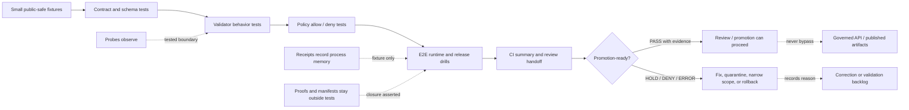

<!-- [KFM_META_BLOCK_V2]
doc_id: kfm://doc/<TODO-tests-readme-uuid>
title: tests
type: standard
version: v1
status: published
owners: @bartytime4life
created: <TODO: verify YYYY-MM-DD>
updated: 2026-04-22
policy_label: public
related: [
  ../README.md,
  ../CONTRIBUTING.md,
  ../.github/README.md,
  ../.github/CODEOWNERS,
  ../.github/workflows/README.md,
  ../.github/watchers/README.md,
  ../contracts/README.md,
  ../schemas/README.md,
  ../schemas/contracts/README.md,
  ../schemas/tests/README.md,
  ../policy/README.md,
  ../data/README.md,
  ../data/receipts/README.md,
  ../data/proofs/README.md,
  ../docs/README.md,
  ../tools/README.md,
  ../tools/probes/README.md,
  ../tools/validators/README.md,
  ../tools/validators/promotion_gate/README.md,
  ./accessibility/README.md,
  ./catalog/README.md,
  ./ci/README.md,
  ./contracts/README.md,
  ./e2e/README.md,
  ./fixtures/README.md,
  ./policy/README.md,
  ./reproducibility/README.md,
  ./unit/README.md,
  ./validators/README.md
]
tags: [kfm, tests, verification, readme, ci, catalog, contracts, receipts, proofs, policy, fixtures]
notes: [
  "doc_id and created date still need live-repo verification.",
  "Owner is retained from surfaced repo-facing tests documentation; confirm active-branch CODEOWNERS before treating ownership as enforcement.",
  "This revision preserves the governed-verification framing while making receipt/proof separation, finite outcomes, policy gates, no-network fixtures, and no-public-raw-path checks more explicit.",
  "Current checked-out repository inventory, runner wiring, workflow YAML, branch protections, and merge-blocking status remain NEEDS VERIFICATION."
]
[/KFM_META_BLOCK_V2] -->

<a id="top"></a>

# `tests/`

Governed verification surface for KFM proof objects, trust cues, negative paths, release/correction drills, helper-proof boundaries, and receipt-aware validation pressure.

> [!NOTE]
> The meta-block value `status: published` preserves the documented file-status baseline.  
> The impact block below describes the current maturity of the `tests/` surface itself.

<div align="left">


</div>

| Field | Value |
|---|---|
| **Status** | `experimental` |
| **Owners** | `@bartytime4life` *(NEEDS VERIFICATION against active-branch CODEOWNERS)* |
| **Path** | `tests/README.md` |
| **Repo fit** | directory index for governed verification families, fixtures, drill expectations, helper-proof lanes, and review-facing proof boundaries |
| **Quick jumps** | [Scope](#scope) · [Repo fit](#repo-fit) · [Accepted inputs](#accepted-inputs) · [Exclusions](#exclusions) · [Current verified snapshot](#current-verified-snapshot) · [Directory tree](#directory-tree) · [Quickstart](#quickstart) · [Usage](#usage) · [Diagram](#diagram) · [Operating tables](#operating-tables) · [Task list / definition of done](#task-list--definition-of-done) · [FAQ](#faq) · [Appendix](#appendix) |

> [!IMPORTANT]
> `tests/` is not a generic QA bucket.
>
> In KFM, verification is part of governed publication, runtime trust, correction discipline, helper accountability, receipt/proof separation, and fail-closed review. A green check that cannot explain **why** a release, renderer, validator, runtime response, review record, receipt, or proof object is trustworthy is still incomplete.

> [!TIP]
> Keep the verification split explicit:
>
> - **probes observe**
> - **receipts record process memory**
> - **validators verify**
> - **policy decides**
> - **workflows orchestrate**
> - **tests prove those boundaries hold under pressure**
>
> The top-level `tests/` lane is where those burdens become inspectable rather than assumed.

---

## Scope

`tests/` is the repo-facing governed verification surface for Kansas Frontier Matrix.

It gathers the proof burdens closest to day-to-day engineering work: deterministic local behavior, contract and schema validation, policy enforcement, accessibility-critical trust surfaces, reproducibility checks, CI-helper proof, catalog-helper proof, validator-facing contract proof, and end-to-end proof of release, runtime, rollback, and correction behavior.

The strongest tests here should prove that KFM preserves its governing shape:

```text
RAW -> WORK / QUARANTINE -> PROCESSED -> CATALOG / TRIPLET -> PUBLISHED
```

That means tests should prefer **small, deterministic, no-network fixtures** before live connectors, broad public artifacts, model integrations, or publication automation.

[Back to top](#top)

---

## Repo fit

`tests/` sits beside the KFM control surfaces that define what must be proven.

| Neighbor | Relationship to `tests/` | Boundary rule |
|---|---|---|
| [`../schemas/`](../schemas/) and [`../contracts/`](../contracts/) | define machine-readable shapes and interface expectations | tests validate examples against contracts; tests do not become schema authority |
| [`../policy/`](../policy/) | holds publication, rights, sensitivity, runtime, and correction decision rules | tests cover allow/deny fixtures and reason codes; tests do not replace policy |
| [`../tools/probes/`](../tools/probes/) | observes external or internal state | tests may replay probe outputs; probes should not silently mutate proof state |
| [`../tools/validators/`](../tools/validators/) | performs validation and emits reports | tests verify validator behavior, finite exit codes, and fail-closed results |
| [`../data/receipts/`](../data/receipts/) | records process memory | tests may use tiny receipt fixtures; receipts are not runtime proofs |
| [`../data/proofs/`](../data/proofs/) | holds proof-bearing release or review artifacts | tests may assert proof closure; tests should not store canonical release proofs |
| [`../.github/workflows/`](../.github/workflows/) | orchestrates CI and review handoff | tests supply runnable checks; workflows decide when checks block or summarize |
| [`../apps/`](../apps/) and [`../packages/`](../packages/) | implement runtime and shared behavior | tests exercise behavior through public/internal seams; tests do not create hidden truth paths |

### Upstream

Tests consume schemas, contracts, source descriptors, policy bundles, fixtures, validator reports, small released-artifact examples, and documented expected outcomes.

### Downstream

Tests support pull-request review, CI summaries, promotion readiness, release drill confidence, correction drills, and maintainer trust in the evidence path.

[Back to top](#top)

---

## Accepted inputs

Material belongs in `tests/` when it is small, reviewable, deterministic, and clearly tied to a proof burden.

| Accepted input | Why it belongs | Typical owner lane |
|---|---|---|
| Valid and invalid fixtures | prove shape, boundary, and fail-closed behavior | `tests/fixtures/`, `tests/contracts/`, `tests/policy/` |
| Contract/schema examples | prove `SourceDescriptor`, `EvidenceBundle`, `PolicyDecision`, `RuntimeResponseEnvelope`, `LayerManifest`, and related object families | `tests/contracts/` |
| Policy allow/deny cases | prove reason codes, obligations, rights/sensitivity handling, and deny-by-default behavior | `tests/policy/` |
| Validator input/output pairs | prove validator reports, finite exit codes, and negative fixture handling | `tests/validators/` |
| Accessibility scenarios | prove trust-visible UI remains operable without color-only, pointer-only, motion-only, or hidden-state assumptions | `tests/accessibility/` |
| Reproducibility checks | prove deterministic hashing, fixture replay, and stable emitted summaries | `tests/reproducibility/` |
| E2E proof drills | prove release, runtime, rollback, correction, and evidence-resolution paths without bypassing governed APIs | `tests/e2e/` |
| CI helper snapshots | prove reviewer summaries are accurate reflections of validation output | `tests/ci/` |

[Back to top](#top)

---

## Exclusions

These do **not** belong in `tests/`.

| Excluded material | Send it instead to | Reason |
|---|---|---|
| RAW, WORK, QUARANTINE, or unpublished candidate data | [`../data/`](../data/) lifecycle lanes | tests must not create a public shortcut around canonical lifecycle state |
| Secrets, API keys, tokens, `.env` files, credentials | secret manager / local host configuration | tests must be safe to inspect and review |
| Full provider mirrors or scraping caches | source-specific ingest/work lanes | fixtures should prove behavior, not become shadow datasets |
| Production release proofs | [`../data/proofs/`](../data/proofs/) | tests may assert proof closure but should not be the canonical proof store |
| Process receipts from real runs | [`../data/receipts/`](../data/receipts/) | tests may keep tiny examples only |
| Policy definitions | [`../policy/`](../policy/) | tests verify policy; they do not govern |
| Canonical schema files | [`../schemas/`](../schemas/) or [`../contracts/`](../contracts/) after schema-home ADR | tests contain examples and assertions only |
| Direct model prompts or unbounded LLM outputs | governed AI/runtime contract lanes | model-assisted behavior must be evidence-bounded and finite |
| UI-only screenshots with hidden trust assumptions | `tests/accessibility/`, `tests/e2e/`, or UI fixtures with explicit trust state | visual evidence must preserve policy, review, freshness, and correction meaning |

[Back to top](#top)

---

## Current verified snapshot

> [!WARNING]
> The active checkout, test runner, workflow YAML, package manager, branch protections, and exact child-directory inventory are **NEEDS VERIFICATION** before this README is used as implementation proof.

| Claim | Label | Basis |
|---|---:|---|
| `tests/README.md` is treated as a governed directory README with KFM Meta Block V2, owner, status, path, quick jumps, and boundary sections. | **CONFIRMED from surfaced repo-facing docs** | existing tests README material |
| The `tests/` lane maturity is described as `experimental`, even while the document-record status is retained as `published`. | **CONFIRMED from surfaced repo-facing docs** | existing impact block pattern |
| `@bartytime4life` is the surfaced owner for the tests lane. | **INFERRED / NEEDS VERIFICATION** | surfaced README notes reference CODEOWNERS coverage; active branch must be checked |
| Contract, policy, accessibility, CI, E2E, catalog, fixture, unit, validator, and reproducibility child lanes are documented or expected verification families. | **INFERRED / NEEDS VERIFICATION** | adjacent README patterns and KFM pipeline doctrine |
| No-network fixture tests, valid/invalid examples, policy deny tests, and no public RAW/WORK/QUARANTINE path checks are first-wave expectations. | **PROPOSED / doctrine-aligned** | pipeline manual and domain-lane plans |
| Merge-blocking enforcement is active in CI. | **UNKNOWN** | requires active workflow and branch-protection evidence |

[Back to top](#top)

---

## Directory tree

This tree is a navigation and verification map. It is not proof that every child exists in the active branch.

```text
tests/
├── README.md                         # this directory guide
├── accessibility/                    # trust-visible UI and assistive-use checks
│   └── README.md
├── catalog/                          # catalog-helper proof and closure checks
│   └── README.md
├── ci/                               # reviewer-summary and CI-helper proof
│   └── README.md
├── contracts/                        # schema/contract fixture validation
│   └── README.md
├── e2e/                              # governed end-to-end proof drills
│   ├── README.md
│   ├── release_assembly/             # release/correction assembly drills
│   └── runtime_proof/                # request-time evidence and outcome proof
├── fixtures/                         # tiny valid/invalid public-safe fixtures
│   ├── README.md
│   ├── source/
│   │   ├── kansas_mesonet_source_descriptor/
│   │   └── maplibre_source_meta/
│   └── soil_moisture/
├── policy/                           # allow/deny policy tests and reason codes
│   └── README.md
├── reproducibility/                  # deterministic replay and hash stability
│   └── README.md
├── unit/                             # local deterministic behavior
│   └── README.md
└── validators/                       # validator report and fail-closed behavior
    └── README.md
```

> [!NOTE]
> Child paths should be linked only when confirmed in the active branch. Until then, keep labels such as `NEEDS VERIFICATION` in child READMEs rather than presenting lane depth as earned coverage.

[Back to top](#top)

---

## Quickstart

Use the repo-native runner when verified. Until then, start with inventory and non-destructive discovery.

```bash
# 1. Confirm where you are.
git status --short
git branch --show-current

# 2. Inspect the tests lane without assuming suite depth.
find tests -maxdepth 3 -type f | sort

# 3. Inspect adjacent authority surfaces.
find schemas contracts policy tools data .github -maxdepth 3 -type f 2>/dev/null | sort

# 4. Discover available task entrypoints.
find . -maxdepth 2 \( -name Makefile -o -name package.json -o -name pyproject.toml -o -name go.mod -o -name Cargo.toml \) -print
```

When the active branch confirms Python/pytest:

```bash
python -m pytest tests
```

When the active branch confirms Node/Vitest or package scripts:

```bash
npm test
```

When the active branch confirms Make targets:

```bash
make test
make validate
```

> [!CAUTION]
> Do not add network access to first-wave tests unless the test is explicitly marked integration-only, isolated from default CI, and backed by source terms, credentials handling, and fixture replay.

[Back to top](#top)

---

## Usage

Use `tests/` to make KFM claims harder to overstate.

### Preferred test shape

```text
fixture -> schema/contract check -> validator report -> policy decision -> runtime/release assertion
```

### Minimum useful assertion pattern

```python
# pseudocode: adapt to the repo-native runner after verification

def test_public_payload_never_references_raw_work_or_quarantine():
    payload = load_fixture("runtime_response.valid.json")

    forbidden = ["RAW", "WORK", "QUARANTINE", "/data/raw/", "/data/work/", "/data/quarantine/"]

    assert not contains_any(payload, forbidden)
    assert payload["outcome"] in {"ANSWER", "ABSTAIN", "DENY", "ERROR"}
    assert payload["evidence_bundle_ref"].startswith("kfm://")
```

### Good tests should answer

| Test question | Why it matters |
|---|---|
| Does every consequential claim resolve to an `EvidenceBundle` or abstain? | protects cite-or-abstain behavior |
| Does invalid source, rights, sensitivity, freshness, or review state fail closed? | prevents unsafe publication |
| Are receipts, proofs, manifests, and runtime envelopes kept separate? | prevents proof-object flattening |
| Is exact sensitive geometry denied or generalized before public use? | protects sensitive locations and communities |
| Can the Evidence Drawer show support, rights, freshness, review, and correction state? | keeps trust visible at point of use |
| Can Focus Mode emit `ANSWER`, `ABSTAIN`, `DENY`, or `ERROR` without becoming a free-form chatbot? | keeps AI subordinate to evidence and policy |

[Back to top](#top)

---

## Diagram


```mermaid
flowchart LR
    A[Small public-safe fixtures] --> B[Contract and schema tests]
    B --> C[Validator behavior tests]
    C --> D[Policy allow / deny tests]
    D --> E[E2E runtime and release drills]
    E --> F[CI summary and review handoff]

    P[Probes observe] -. tested boundary .-> C
    R[Receipts record process memory] -. fixture only .-> E
    Q[Proofs and manifests stay outside tests] -. closure asserted .-> E

    F --> G{Promotion-ready?}
    G -->|PASS with evidence| H[Review / promotion can proceed]
    G -->|HOLD / DENY / ERROR| I[Fix, quarantine, narrow scope, or rollback]

    H -. never bypass .-> J[Governed API / published artifacts]
    I -. records reason .-> K[Correction or validation backlog]
```

[Back to top](#top)

---

## Operating tables

### Test family map

| Family | Primary burden | Typical positive case | Typical negative case |
|---|---|---|---|
| `unit/` | local determinism | stable hash, finite enum, pure helper behavior | nondeterministic order, ambiguous enum, hidden clock dependency |
| `contracts/` | schema/interface validity | valid `EvidenceBundle`, `SourceDescriptor`, `PolicyDecision` | missing evidence ref, invalid outcome, unknown source role |
| `policy/` | fail-closed decision grammar | explicit allow with evidence, rights, review, freshness | missing rights, sensitive exact geometry, unresolved review |
| `validators/` | report and exit semantics | valid fixture emits `PASS` report | invalid fixture emits reasoned failure |
| `fixtures/` | tiny reviewable examples | minimal public-safe valid/invalid pairs | provider mirrors, secrets, full raw source payloads |
| `accessibility/` | trust cues remain usable | keyboard opens Evidence Drawer and reads policy state | color-only or pointer-only trust cue |
| `reproducibility/` | replay and identity stability | same fixture yields same hash/report | unstable sort, hidden network call, timestamp drift |
| `catalog/` | catalog/proof closure | manifest references resolve to known artifacts | dangling proof, receipt/proof collapse |
| `ci/` | reviewer-summary fidelity | summary reflects validator/policy outputs | summary invents or hides status |
| `e2e/` | governed path behavior | published-safe runtime response with evidence | direct RAW path, unreviewed release, unsupported answer |

### Outcome grammar by surface

| Surface | Expected finite outcomes | Notes |
|---|---|---|
| Runtime/public response | `ANSWER`, `ABSTAIN`, `DENY`, `ERROR` | what a user-facing or Focus response may emit |
| Gate/review evaluation | `PASS`, `HOLD`, `DENY`, `ERROR` | what a checker or reviewer-facing gate may decide |
| Release/correction receipt | `PROMOTED`, `BLOCKED`, `REVERTED`, `WITHDRAWN`, `CORRECTED` | what happened to a candidate or published artifact |
| Validator report | `PASS`, `FAIL`, `ERROR`, `SKIP` | tool-level result; must include reason codes for failure |

### Boundary matrix

| Boundary | Test should prove | Must not imply |
|---|---|---|
| Evidence | claim resolves to `EvidenceBundle` or abstains | generated language is evidence |
| Policy | deny-by-default and reasoned obligations | human review is replaced by code |
| Lifecycle | no public path reads RAW/WORK/QUARANTINE | test fixtures are canonical stores |
| Receipts | process facts are recorded and replayable | receipts are release proofs |
| Proofs | catalog/proof/release closure can be checked | tests own production proof custody |
| UI trust | Evidence Drawer, Focus, badges, and chips preserve meaning | renderer state is truth state |
| AI | model output is bounded, cited, and finite | model provider is a truth source |

[Back to top](#top)

---

## Task list / definition of done

A change touching `tests/` is not done until the relevant boxes are true.

- [ ] The test target has an explicit proof burden: contract, policy, validator, accessibility, reproducibility, CI summary, runtime, release, rollback, or correction.
- [ ] Fixtures are tiny, public-safe, rights-conscious, and deterministic.
- [ ] Negative fixtures are present for consequential checks.
- [ ] The test fails closed when evidence, rights, sensitivity, review, freshness, or catalog closure is missing.
- [ ] No test requires live network access in the default suite unless explicitly documented as integration-only.
- [ ] No fixture contains secrets, raw source mirrors, live credentials, or sensitive exact locations.
- [ ] Runtime tests use finite outcomes and reason/obligation codes.
- [ ] Evidence-facing tests verify `EvidenceRef -> EvidenceBundle` resolution or intentional abstention.
- [ ] Release-facing tests keep receipts, proofs, manifests, review records, and correction notices separate.
- [ ] CI-facing tests or summaries do not invent enforcement depth that workflows do not actually provide.
- [ ] Documentation changed with behavior when a test creates a new boundary or expectation.
- [ ] Rollback is straightforward: remove the test/fixture without migrating canonical data.

[Back to top](#top)

---

## FAQ

### Why is `tests/` described as experimental if the README metadata says `published`?

The metadata status describes the document-record baseline. The impact block describes suite maturity. A published README can still document an experimental verification surface.

### Can tests include real source samples?

Only when the samples are tiny, rights-conscious, public-safe, and explicitly fixture-scoped. Do not mirror providers, scrape caches, or checked-in RAW data under `tests/`.

### Are receipts test artifacts?

Usually no. Receipts are process memory and should live under receipt lanes such as `data/receipts/`. Tests may include tiny synthetic receipt fixtures to prove parser, summary, and closure behavior.

### Should CI failures block promotion?

That depends on the active branch workflow and branch protection settings. Tests should emit clear, deterministic results. Workflow and branch-protection enforcement must be verified separately.

### Can a passing test publish data?

No. Promotion is a governed state transition. Tests can prove readiness, gate behavior, or closure; they do not publish.

[Back to top](#top)

---

## Appendix

<details>
<summary><strong>Truth labels used in this README</strong></summary>

| Label | Meaning |
|---|---|
| **CONFIRMED** | verified from surfaced repo-facing documentation, current branch evidence, command output, or generated artifacts |
| **INFERRED** | strongly supported by adjacent evidence but not directly proven for this exact path |
| **PROPOSED** | recommended design or next step, not current implementation proof |
| **UNKNOWN** | not verified strongly enough to claim |
| **NEEDS VERIFICATION** | check active repo, CI, branch protection, ownership, source rights, runtime, or emitted artifacts before stronger claims |

</details>

<details>
<summary><strong>Reviewer checklist for new child lanes</strong></summary>

A new `tests/<family>/README.md` should include:

- KFM Meta Block V2.
- One H1.
- Status, owners, path, repo fit, badges, and quick jumps.
- Accepted inputs and exclusions.
- Directory tree or explicit “README-only” note.
- Runner guidance that does not overclaim package manager or CI wiring.
- A table of proof burdens.
- Definition of done.
- A warning when suite depth, ownership, or enforcement is still unverified.

</details>

<details>
<summary><strong>Suggested first-wave test backlog</strong></summary>

| Priority | Test | Why |
|---:|---|---|
| P0 | `EvidenceBundle` valid/invalid fixtures | makes cite-or-abstain testable |
| P0 | no public RAW/WORK/QUARANTINE path check | protects lifecycle membrane |
| P0 | `PolicyDecision` allow/deny fixtures | makes fail-closed posture executable |
| P0 | `RuntimeResponseEnvelope` finite outcome tests | prevents free-form runtime drift |
| P1 | `SourceDescriptor` inactive-by-default fixtures | prevents live connector overreach |
| P1 | `LayerManifest` evidence-route tests | keeps MapLibre layer display subordinate to evidence |
| P1 | Evidence Drawer payload contract tests | keeps trust visible at point of use |
| P1 | reviewer-summary fidelity tests | prevents CI summaries from laundering unknowns |
| P2 | rollback and correction drill | proves reversibility after publication |
| P2 | accessibility trust-cue checks | proves evidence, policy, freshness, and correction remain usable |

</details>

[Back to top](#top)
