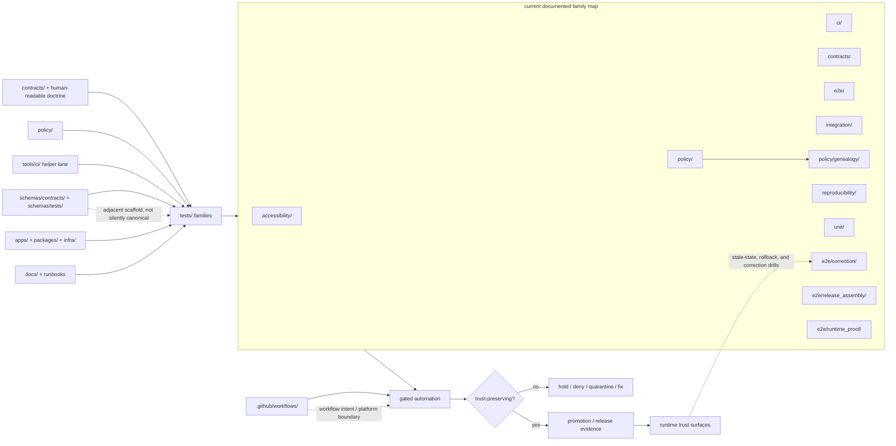

<!-- [KFM_META_BLOCK_V2]
doc_id: kfm://doc/<TODO-tests-readme-uuid>
title: tests
type: standard
version: v1
status: published
owners: @bartytime4life
created: <TODO: verify YYYY-MM-DD>
updated: 2026-04-13
policy_label: public
related: [../README.md, ../CONTRIBUTING.md, ../.github/README.md, ../.github/CODEOWNERS, ../.github/workflows/README.md, ../contracts/README.md, ../policy/README.md, ../schemas/README.md, ../schemas/contracts/README.md, ../schemas/tests/README.md, ../docs/README.md, ./ci/README.md, ./e2e/README.md, ./policy/README.md]
tags: [kfm, tests, verification, readme, ci]
notes: [Updated to explicitly include the tests/ci proof lane alongside existing validator, e2e, policy, and schema-adjacent verification families. doc_id and created date still need live-repo verification; owner remains confirmed by current CODEOWNERS coverage for /tests/; this revision preserves the strong existing tests README structure while widening the top-level index for the now-documented CI renderer proof surface without overstating suite depth or merge-gate enforcement.]
[/KFM_META_BLOCK_V2] -->

# tests

Governed verification surface for KFM proof objects, trust cues, negative paths, release/correction drills, and helper-proof boundaries.

> [!NOTE]
> The meta-block value `status: published` preserves the current document-record baseline.
> The impact block below describes the current maturity of the `tests/` surface itself.

> **Status:** experimental  
> **Owners:** `@bartytime4life`  
> **Path:** `tests/README.md`  
> **Repo fit:** directory index for governed verification families, fixtures, drill expectations, helper-proof lanes, and review-facing proof boundaries  
> **Quick jump:** [Scope](#scope) · [Repo fit](#repo-fit) · [Accepted inputs](#accepted-inputs) · [Exclusions](#exclusions) · [Current verified snapshot](#current-verified-snapshot) · [Directory tree](#directory-tree) · [Quickstart](#quickstart) · [Usage](#usage) · [Diagram](#diagram) · [Operating tables](#operating-tables) · [Task list](#task-list--definition-of-done) · [FAQ](#faq) · [Appendix](#appendix)


> [!IMPORTANT]
> `tests/` is not a generic QA bucket.
> In KFM, verification is part of governed publication, runtime trust, correction discipline, and helper accountability.
> A green check that cannot explain **why** a release, renderer, or runtime outcome is trustworthy is still incomplete.

---

## Scope

`tests/` is the repo-facing governed verification surface for Kansas Frontier Matrix.

In KFM terms, this directory gathers the proof burdens that sit closest to day-to-day engineering work: deterministic local behavior, governed boundary checks, contract and schema validation, policy enforcement, accessibility-critical trust surfaces, reproducibility expectations, CI-helper proof, and end-to-end proof of release, runtime, rollback, and correction behavior.

That is broader than “do the tests pass?” The stronger questions are:

- can the repo prove that contracts fail loudly instead of drifting silently?
- can policy prove `allow`, `deny`, `abstain`, `hold`, or other guarded outcomes under realistic pressure?
- can runtime behavior stay inspectable when evidence fails, citations fail, or trust state changes?
- can rollback and correction remain visible instead of being polished away?
- can reviewer-facing CI helpers prove that they render governed artifacts faithfully without quietly redefining law?

### Evidence boundary used here

| Evidence layer | What this README treats as settled |
|---|---|
| **CONFIRMED — current repo / current lane docs** | The repo exposes `tests/` as a real top-level directory; adjacent lane docs now explicitly document `tests/ci/` as a helper-proof lane; the visible family layout includes `tests/e2e/` leaf directories and the `tests/policy/genealogy/` child lane; adjacent docs such as `README.md`, `CONTRIBUTING.md`, `.github/README.md`, `contracts/README.md`, `policy/README.md`, `schemas/README.md`, `docs/README.md`, and `tools/ci/README.md` are all part of the current documentation surface; `/tests/` ownership remains covered in `.github/CODEOWNERS`. |
| **CONFIRMED — current workflow lane posture** | `.github/workflows/README.md` is present as the visible workflow-lane documentation boundary. Checked-in merge-blocking workflow depth still needs branch/platform verification where not directly proven. |
| **CONFIRMED — current schema adjacency** | `schemas/` is no longer effectively README-only; visible adjacent lanes include `schemas/contracts/`, `schemas/contracts/v1/`, and `schemas/tests/`, which materially affect how contract-facing verification and nested fixture scaffolds should be described. |
| **CONFIRMED — KFM doctrine** | Verification is trust-bearing, not ornamental; negative tests matter; release proof, rollback, correction, stale visibility, evidence drill-through, helper-proof surfaces, and hydrology-first thin-slice proof remain part of the KFM verification model. |
| **INFERRED / PROPOSED overlay** | Some manuals use shorthand starter families such as `tests/contract/` or `tests/regression/`; the current repo realizes those burdens with different documented names and now does so alongside an explicitly documented `tests/ci/` lane. |
| **NEEDS VERIFICATION** | Exact executable suite depth, actual runner/toolchain, required checks, rulesets, screenshot baseline inventory, fixture density, whether schema-side fixtures feed blocking runners, and whether rollback/correction drills have been exercised on the checked-out branch. |

> [!CAUTION]
> Directory presence is **not** the same thing as mature coverage.
> This README distinguishes **what is documented and visible now** from **what KFM doctrine says the verification system must eventually prove**.

### Status markers used here

| Marker | Meaning in this README |
|---|---|
| **CONFIRMED** | Visible in the current documentation / repo-facing surface or directly grounded in stable KFM doctrine |
| **INFERRED** | Strongly supported by adjacent repo docs or repeated doctrine, but not re-proven from a mounted checkout in this session |
| **PROPOSED** | Buildable structure, practice, or future consolidation that fits KFM doctrine but is not asserted as current repo fact |
| **UNKNOWN** | Not verified strongly enough in this session to state as current repo reality |
| **NEEDS VERIFICATION** | A path, command, workflow, or implementation detail that should be checked against the checked-out branch before merge |

## Repo fit

**Path:** `tests/README.md`  
**Role in repo:** directory-level guide for governed verification families, test-placement boundaries, and helper-proof surfaces.

### Upstream anchors

| Surface | Why it matters | Status here |
|---|---|---|
| [`../README.md`](../README.md) | root project identity and operating posture | **CONFIRMED** |
| [`../CONTRIBUTING.md`](../CONTRIBUTING.md) | contributor workflow, review discipline, and documentation expectations | **CONFIRMED** |
| [`../.github/README.md`](../.github/README.md) | repo gatehouse for CI/CD, review boundaries, and governance automation | **CONFIRMED** |
| [`../.github/CODEOWNERS`](../.github/CODEOWNERS) | ownership and review boundary for `/tests/` | **CONFIRMED** |
| [`../.github/workflows/README.md`](../.github/workflows/README.md) | workflow-lane surface and documented automation boundary | **CONFIRMED** |
| [`../contracts/README.md`](../contracts/README.md) | authoritative contract-source layer that tests should consume, not replace | **CONFIRMED** |
| [`../policy/README.md`](../policy/README.md) | policy and governance posture that tests should exercise rather than restate | **CONFIRMED** |
| [`../schemas/README.md`](../schemas/README.md) | parent schema boundary, subtree index, and schema-home caution | **CONFIRMED** |
| [`../schemas/contracts/README.md`](../schemas/contracts/README.md) | live schema-side contract scaffold lane adjacent to contract-facing verification | **CONFIRMED** |
| [`../schemas/contracts/v1/README.md`](../schemas/contracts/v1/README.md) | visible first-wave machine-contract family split that tests may pressure-test without silently canonizing it | **CONFIRMED** |
| [`../schemas/tests/README.md`](../schemas/tests/README.md) | nested schema-side fixture scaffold that must stay distinct from repo-wide governed verification | **CONFIRMED** |
| [`../docs/README.md`](../docs/README.md) | governed documentation index and runbook surface | **CONFIRMED** |
| [`./ci/README.md`](./ci/README.md) | helper-proof lane for CI-facing renderer behavior | **CONFIRMED via adjacent documentation** |

### Confirmed downstream surfaces

| Surface | Current meaning |
|---|---|
| [`./accessibility/`](./accessibility/) | accessibility-focused verification family |
| [`./ci/`](./ci/) | CI renderer/helper proof family |
| [`./contracts/`](./contracts/) | contract-facing test family |
| [`./e2e/`](./e2e/) | end-to-end verification family |
| [`./integration/`](./integration/) | integration-slice verification family |
| [`./policy/`](./policy/) | policy and governance behavior family with a visible child lane |
| [`./reproducibility/`](./reproducibility/) | reproducibility and bounded-regression family |
| [`./unit/`](./unit/) | deterministic local-behavior family |
| [`./e2e/correction/`](./e2e/correction/) | correction and supersession drill family |
| [`./e2e/release_assembly/`](./e2e/release_assembly/) | release / promotion / publish-path proof family |
| [`./e2e/runtime_proof/`](./e2e/runtime_proof/) | request-time runtime and outcome-proof family |
| [`./policy/genealogy/`](./policy/genealogy/README.md) | genealogy-specific policy-behavior child lane for consent, living-person, DNA, provenance, and publication-control negative tests |

> [!NOTE]
> The workflow lane still matters to `tests/` even when the public automation surface is documentation-led.
> That sharpens the README’s stance: **test families and helper-proof lanes are visible, but merge-blocking automation still needs platform-level or branch-local verification**.

### Current adjacent schema-side signals

| Surface | Current reading | Why `tests/` has to care |
|---|---|---|
| [`../schemas/`](../schemas/README.md) | no longer a one-file warning surface; now a real parent subtree | top-level verification language must stop pretending adjacent schema lanes are absent |
| [`../schemas/contracts/`](../schemas/contracts/README.md) | visible machine-file-bearing scaffold with `v1/` and `vocab/` | `tests/contracts/` now sits next to a real schema-side lane and should describe that tension honestly |
| [`../schemas/contracts/v1/`](../schemas/contracts/v1/README.md) | visible first-wave machine-contract families such as `common/`, `correction/`, `data/`, `evidence/`, `policy/`, `release/`, `runtime/`, and `source/` | contract-facing tests now have adjacent family names and placeholder schema files to pressure-test |
| [`../schemas/tests/`](../schemas/tests/README.md) | visible nested fixture scaffold with `fixtures/` | top-level `tests/` should distinguish repo-wide governed verification from schema-side scaffold mirrors or nested fixture experiments |

### Path reconciliation note

The repo-facing docs and the manuals are directionally aligned, but not identical in naming.

| Verification burden | Current documented repo path | Manual shorthand seen in doctrine | Working rule |
|---|---|---|---|
| CI helper rendering proof | `tests/ci/` | often implicit under workflow or summary language | keep the explicit helper-proof lane now that it is documented |
| contract validation | `tests/contracts/` | `tests/contract/` | keep the current repo’s plural path until the repo itself changes |
| accessibility trust checks | `tests/accessibility/` | often grouped under broader UI/regression language | keep the explicit top-level accessibility family |
| integration slices | `tests/integration/` | sometimes absorbed into general verification/e2e doctrine | keep the explicit integration family |
| reproducibility / bounded regression | `tests/reproducibility/` | often described as `regression` or reproducibility burden | keep current repo naming and describe the doctrinal burden clearly |
| release proof / runtime proof / correction | `tests/e2e/...` | `tests/e2e/` plus doctrinal drill language | current repo and doctrine are closely aligned here |

A second reconciliation tension still matters:

| Verification / fixture pressure | Current documented repo path | Why it is not the same thing as settled authority | Working rule |
|---|---|---|---|
| schema-side machine contracts | `schemas/contracts/**` | visible files exist, but current repo docs still keep canonical schema-home authority unresolved | acknowledge the live lane without silently moving authority |
| nested schema-side fixture scaffolds | `schemas/tests/**` | visible fixture scaffolds exist, but top-level `tests/` remains the stronger repo-wide governed verification index | keep nested scaffold language explicit and do not flatten it into repo-wide test truth |

> [!TIP]
> Prefer **current repo names** over manual shorthand when writing commit-ready README text.
> Prefer **manual burden language** over folder aesthetics when deciding what a family must prove.

[Back to top](#tests)

## Accepted inputs

Content that belongs in `tests/` includes:

- unit tests for deterministic local behavior
- integration tests for governed slices across real boundaries
- CI-helper tests for reviewer-facing summaries, diff rendering, and policy-summary rendering
- contract-validation tests for envelopes, examples, and schema drift
- policy tests for allow / deny / abstain / hold behavior
- child-family indexes and narrowly scoped leaf readmes for currently visible sublanes such as `tests/policy/genealogy/`
- negative-path tests for evidence failure, citation failure, rights failure, stale-state handling, helper malformed-input behavior, and correction visibility
- end-to-end release-assembly tests
- runtime-proof suites for `ANSWER`, `ABSTAIN`, `DENY`, and `ERROR`
- correction, supersession, withdrawal, and stale-visibility drills
- accessibility-critical trust-surface checks
- reproducibility and bounded-regression checks where digests, counts, or stable metrics matter
- thin fixtures that are execution-oriented rather than canonical source examples

## Exclusions

The following do **not** belong here as authoritative source of truth:

- canonical schemas, OpenAPI files, vocabularies, or standards profiles  
  → keep them under `../contracts/` and related schema surfaces

- policy bundle source files, reviewer-role maps, obligation registries, or checked-in classification data  
  → keep them under `../policy/`

- runtime application code, ingestion workers, evidence resolvers, UI components, or CI helper implementations  
  → keep them under `../apps/`, `../packages/`, `../infra/`, or `../tools/`

- release manifests, receipts, SBOMs, or promoted artifacts as the **primary** record  
  → keep them in their designated governed artifact and release paths

- long-form narrative guidance, incident playbooks, or architecture rationale  
  → keep them under `../docs/`

- nested schema-lane fixture scaffolds as the implied singular repo-wide verification home  
  → keep `../schemas/tests/` explicit as a nested scaffold unless repo law changes

- large raw datasets or branch-local scratch dumps  
  → keep them out of `tests/`; use governed data zones or local ignored paths instead

## Current verified snapshot

The current repo-facing surface proves the following:

- `tests/` exists as a real top-level repo surface.
- `tests/README.md` exists.
- The documented top-level family set includes `accessibility/`, `ci/`, `contracts/`, `e2e/`, `integration/`, `policy/`, `reproducibility/`, and `unit/`.
- `tests/ci/README.md` now exists as a documented helper-proof lane for CI renderers.
- `tests/ci/` currently documents thin-slice proof centered on `test_render_diff_summary.py` and `test_render_bundle_diff_policy_summary.py`.
- `tests/contracts/` is not treated here as README-only; current docs already acknowledge executable contract-facing proof there.
- `tests/policy/` is not treated here as README-only; it exposes `README.md` plus `genealogy/`.
- `tests/policy/genealogy/README.md` is documented as a real child README.
- `tests/e2e/` exposes `README.md`, `correction/`, `release_assembly/`, and `runtime_proof/`.
- `schemas/` is no longer effectively README-only; it currently exposes `contracts/`, `schemas/`, `standards/`, `tests/`, `workflows/`, and `README.md`.
- `schemas/contracts/` currently exposes `README.md`, `v1/`, and `vocab/`.
- `schemas/contracts/v1/` currently exposes `common/`, `correction/`, `data/`, `evidence/`, `policy/`, `release/`, `runtime/`, `source/`, and `README.md`.
- `schemas/tests/` currently exposes `README.md` and `fixtures/`.
- `/tests/` is assigned to `@bartytime4life` in `.github/CODEOWNERS`.
- `.github/workflows/README.md` is present as the workflow-lane documentation boundary.

> [!WARNING]
> What is still **not** proven here:
> exact test runner(s), actual executable case depth inside each family, required checks and branch-protection settings, screenshot baseline coverage, fixture density, whether nested schema-side fixtures feed blocking runners, and whether restore / rollback / correction drills have archived evidence on a checked-out branch.

## Directory tree

### Current documented lane map

```text
tests/
├── README.md
├── accessibility/
│   └── README.md
├── ci/
│   ├── README.md
│   ├── test_render_bundle_diff_policy_summary.py
│   └── test_render_diff_summary.py
├── contracts/
│   ├── README.md
│   └── test_correction_notice_contract.py
├── e2e/
│   ├── README.md
│   ├── correction/
│   │   └── README.md
│   ├── release_assembly/
│   │   └── README.md
│   └── runtime_proof/
│       └── README.md
├── integration/
│   └── README.md
├── policy/
│   ├── genealogy/
│   │   └── README.md
│   └── README.md
├── reproducibility/
│   └── README.md
└── unit/
    └── README.md
```

### Current adjacent schema-side signal that affects test placement language

```text
schemas/
├── README.md
├── contracts/
│   ├── README.md
│   ├── v1/
│   │   ├── README.md
│   │   ├── common/
│   │   ├── correction/
│   │   ├── data/
│   │   ├── evidence/
│   │   ├── policy/
│   │   ├── release/
│   │   ├── runtime/
│   │   └── source/
│   └── vocab/
├── tests/
│   ├── fixtures/
│   └── README.md
├── schemas/
├── standards/
└── workflows/
```

### Reading rule

Use the trees above for **current documented truth**.

Do **not** silently convert visible family presence into claims of mature, merge-blocking, or end-to-end verified coverage.

Do **not** let adjacent schema-side scaffold presence settle canonical schema-home or fixture-home authority by inertia.

### What deeper maturity would look like (`PROPOSED` / `NEEDS VERIFICATION`)

As this surface matures, family directories should accumulate executable cases, valid and invalid fixtures, golden examples, screenshot baselines, query packs, runner-specific configuration, and archived drill evidence that map directly to repo contracts, policy bundles, runtime boundaries, correction paths, CI-helper proof burdens, and any explicitly sanctioned schema-side mirrors.

[Back to top](#tests)

## Quickstart

### Safe inspection commands

These commands are inspection-first because they verify what is present without overcommitting to a guessed toolchain.

```bash
# inspect the visible tests surface
find tests -maxdepth 4 -type d | sort
find tests -maxdepth 4 -type f | sort

# inspect adjacent contract, schema, policy, and workflow-facing surfaces
find .github contracts docs policy schemas tests -maxdepth 4 -type f 2>/dev/null | sort | sed -n '1,260p'

# inspect ownership and governance boundaries
sed -n '1,200p' .github/CODEOWNERS 2>/dev/null || true
sed -n '1,220p' .github/README.md 2>/dev/null || true
sed -n '1,220p' .github/workflows/README.md 2>/dev/null || true
sed -n '1,220p' CONTRIBUTING.md 2>/dev/null || true

# inspect the current CI helper proof lane
find tests/ci -maxdepth 3 -type f 2>/dev/null | sort
sed -n '1,260p' tests/ci/README.md 2>/dev/null || true
sed -n '1,260p' tools/ci/README.md 2>/dev/null || true

# inspect the current e2e leaf family placement
find tests/e2e -maxdepth 3 -type f 2>/dev/null | sort

# inspect the visible policy child-lane placement
find tests/policy -maxdepth 3 -type f 2>/dev/null | sort

# inspect adjacent schema-side contract and fixture scaffolds
find schemas/contracts -maxdepth 4 -type f 2>/dev/null | sort | sed -n '1,240p'
find schemas/tests -maxdepth 5 -type f 2>/dev/null | sort | sed -n '1,240p'

# inspect likely KFM verification vocabulary without assuming a runner
grep -RIn "EvidenceRef\|EvidenceBundle\|RuntimeResponseEnvelope\|CorrectionNotice\|ABSTAIN\|DENY\|ERROR\|render_diff_summary\|render_bundle_diff_policy_summary" \
  tests contracts policy schemas docs tools 2>/dev/null || true
```

### First local review pass

1. Verify which family directories contain executable suites rather than scaffold README placeholders.
2. Verify whether `tests/ci/` on the checked-out branch matches the documented thin slice.
3. Verify whether `tests/policy/genealogy/` on the checked-out branch is still a README-only child lane or has accumulated executable cases.
4. Verify whether the checked-out branch still matches the current documented tree for `tests/`, `schemas/`, and `.github/workflows/`.
5. Verify which checks actually block merges on the active branch.
6. Verify whether contract, policy, docs, schemas, tools, and tests move together in the same change stream.
7. Verify whether negative paths exist, not only happy-path confirmation.
8. Verify whether runtime evidence, abstention, denial, stale visibility, correction behavior, and CI helper rendering are exercised at the right lane boundaries.

> [!TIP]
> Prefer repo-native commands discovered from the checked-out branch over README-invented runner commands.
> Inspection-first is safer than guessing a toolchain.

## Usage

### What `tests/` is

`tests/` is:

- the repo-facing proof surface for governed behavior
- the place where branch-level confidence work becomes explicit instead of implied
- the home for suites that protect KFM’s truth path, trust membrane, and fail-closed posture
- the directory that should make negative outcomes as inspectable as happy-path success
- the umbrella under which helper-proof lanes like `tests/ci/` stay visible instead of being hidden in workflow YAML

### What `tests/` is not

`tests/` is **not**:

- a substitute for authoritative schemas or policy bundles
- a place to hide implementation drift behind broad “coverage” language
- a scratch area for one-off local experiments
- a badge generator for CI theater
- a dumping ground for artifacts better owned by `contracts/`, `policy/`, `docs/`, `tools/`, or governed data / release paths

### Where a new test should live

Use the smallest fitting existing family before inventing a new top-level folder.

| Family | Place work here when… | Current documented signal |
|---|---|---|
| [`./unit/`](./unit/) | behavior is local, deterministic, and cheap to isolate | visible as a README-bearing family |
| [`./integration/`](./integration/) | a real boundary matters: ingest, resolver, store, API, or projection | visible as a README-bearing family |
| [`./ci/`](./ci/README.md) | the main job is proving `tools/ci/` helper output over declared artifacts | documented helper-proof lane with thin-slice renderer tests |
| [`./contracts/`](./contracts/) | the main risk is schema, envelope, or example drift | visible as a family with `README.md` plus contract-facing proof |
| [`./policy/`](./policy/) | the change affects allow/deny logic, reason codes, rights, or sensitivity behavior across the broader policy family | visible as a README-bearing family with a visible child lane |
| [`./policy/genealogy/`](./policy/genealogy/README.md) | the change is genealogy-specific consent, living-person, DNA, provenance, or publication-control policy behavior | visible as a README-bearing child lane under `./policy/` |
| [`./accessibility/`](./accessibility/) | trust-visible interaction, keyboard flow, reduced-friction inspection, or calm failure is the main risk | visible as a README-bearing family |
| [`./reproducibility/`](./reproducibility/) | stable digests, counts, or bounded metrics matter most | visible as a README-bearing family |
| [`./e2e/release_assembly/`](./e2e/release_assembly/) | promotion, release evidence, or publish-path integrity is the question | visible as a README-bearing leaf family |
| [`./e2e/runtime_proof/`](./e2e/runtime_proof/) | request-time evidence, citations, or finite answer outcomes are the question | visible as a README-bearing leaf family |
| [`./e2e/correction/`](./e2e/correction/) | supersession, rollback, stale visibility, withdrawal, or correction propagation must be exercised | visible as a README-bearing leaf family |

### Working rule for scaffolded families

A present directory is **not** the same thing as an active suite.

If a family currently contains only a placeholder README or thin scaffold, treat it as a documented contract boundary waiting for executable proof, not as coverage already earned.

Today, the documented visible exceptions to a pure README-only reading are:

- `tests/ci/`, which now has a documented thin-slice helper-proof surface
- `tests/contracts/`, which already exposes executable contract-facing proof
- `tests/policy/`, which already exposes a visible child lane

If a schema-side scaffold exists nearby under `schemas/`, treat that as **adjacent signal** until repo law explicitly says it is canonical for the same burden.

## Diagram


```mermaid
flowchart LR
    C["contracts/ + human-readable doctrine"] --> T["tests/ families"]
    SC["schemas/contracts/ + schemas/tests/"] --> T
    P["policy/"] --> T
    H["tools/ci/ helper lane"] --> T
    A["apps/ + packages/ + infra/"] --> T
    D["docs/ + runbooks"] --> T
    W[".github/workflows/"] --> G["gated automation"]

    subgraph F["current documented family map"]
      AX["accessibility/"]
      CI["ci/"]
      K["contracts/"]
      E["e2e/"]
      I["integration/"]
      PO["policy/"]
      PG["policy/genealogy/"]
      R["reproducibility/"]
      U["unit/"]
      EC["e2e/correction/"]
      ER["e2e/release_assembly/"]
      EP["e2e/runtime_proof/"]
    end

    T --> F
    PO --> PG
    F --> G
    G --> Q{"trust-preserving?"}

    Q -->|no| H2["hold / deny / quarantine / fix"]
    Q -->|yes| PR["promotion / release evidence"]
    PR --> RT["runtime trust surfaces"]

    RT -. stale-state, rollback, and correction drills .-> EC
    W -. workflow intent / platform boundary .-> G
    SC -. adjacent scaffold, not silently canonical .-> T
```

## Operating tables

### Family map

| Family | Documented now | Current visible contents | Primary burden | Doctrinal note |
|---|---|---|---|---|
| `accessibility/` | Yes | `README.md` | trust-visible accessibility and keyboard-critical flows | repo keeps this burden explicit instead of hiding it under generic regression language |
| `ci/` | Yes | `README.md` plus renderer-proof tests | helper-proof surface for reviewer-facing CI renderers | keeps rendering proof separate from workflow YAML and promotion law |
| `contracts/` | Yes | `README.md` plus contract-facing proof | envelope, schema, and example validation | current repo uses plural path; some manuals use singular shorthand |
| `e2e/` | Yes | `README.md` plus three leaf families | end-to-end verification umbrella | current repo and doctrine are closely aligned here |
| `integration/` | Yes | `README.md` | governed slices across real boundaries | current repo keeps this family explicit |
| `policy/` | Yes | `README.md` plus visible `genealogy/` child lane | allow / deny / abstain / hold behavior | parent family is no longer README-only in practice |
| `policy/genealogy/` | Yes | `README.md` | consent, living-person, DNA, provenance, and publication-control negative tests | visible child lane should be indexed honestly without inflating executable depth |
| `reproducibility/` | Yes | `README.md` | stable digests, counts, and bounded regression | overlaps with what some manuals describe as regression / rebuild burden |
| `unit/` | Yes | `README.md` | deterministic local behavior | directly matches manual doctrine |
| `e2e/correction/` | Yes | `README.md` | supersession, stale-state, rollback, and correction drills | strongly aligned with correction lineage doctrine |
| `e2e/release_assembly/` | Yes | `README.md` | promotion and publish-path proof | strongly aligned with release-proof doctrine |
| `e2e/runtime_proof/` | Yes | `README.md` | `ANSWER / ABSTAIN / DENY / ERROR` proof | strongly aligned with runtime outcome doctrine |
| `regression/` | No documented current path | — | doctrinal shorthand for some UI / map / rebuild burdens | keep this as doctrine, not current path claim |

### Adjacent schema-side signals that now influence test-language accuracy

| Surface | Current documented evidence | Why it matters to `tests/` |
|---|---|---|
| `schemas/` | real parent subtree, not just `README.md` | top-level test docs should stop describing adjacent schema lanes as absent |
| `schemas/contracts/` | `README.md` plus `v1/` and `vocab/` | contract-facing verification now has visible machine-file adjacency |
| `schemas/contracts/v1/` | eight family subdirectories plus `README.md` | tests can now refer to visible first-wave family names without inventing them |
| `schemas/tests/` | `README.md` plus `fixtures/` | nested schema-side fixture scaffolds exist, but still should not silently replace repo-wide governed verification |
| `schemas/contracts/*` bodies | still scaffold-heavy and authority-sensitive | file presence should not be confused with enforcement-grade maturity |

### Workflow and helper-proof adjacency

| Surface | Current documented evidence | Why it matters to `tests/` |
|---|---|---|
| `.github/workflows/README.md` | present as workflow-lane boundary doc | checked-in test families exist, but enforcement still needs platform or branch-local verification |
| `tools/ci/README.md` | present and now documents diff and policy-summary renderers | top-level `tests/` should acknowledge the helper-proof lane that serves it |
| `tests/ci/README.md` | present and documents renderer thin-slice proof | makes CI helper verification a first-class family rather than an implicit afterthought |

### Change-trigger matrix

| If a PR changes… | Minimum verification expectation |
|---|---|
| contracts / schemas | valid examples, invalid fixtures, version note, and no silent envelope drift |
| policy / governance | allow + deny cases, negative fixtures, rationale alignment, and default-deny still intact |
| tools/ci renderers | helper-proof tests in `tests/ci/`, deterministic output checks, and failure-path coverage where relevant |
| schema-side scaffolds / fixture mirrors | keep authority wording explicit, avoid quiet duplicate truth, and update both schema-side and test-side indexes if placement language changes |
| source onboarding or transforms | deterministic manifest/checksum behavior, validation checks, and at least one representative integration slice |
| evidence behavior | `EvidenceRef` / bundle resolution path, negative tests, and policy-safe denials |
| story / Focus / evidence surfaces | citation visibility, abstention-safe behavior, and audit-path confidence |
| docs describing behavior | linked updates, no contradiction with tests / contracts / policy / schemas / tools, and no overclaiming branch reality |
| release / promotion / correction | end-to-end release assembly, rollback or supersession drill, and stale-state handling |
| workflow / required-check posture | confirm checked-in automation docs, platform rules, and whether repo-visible signals still match effective merge gates |

### Negative paths worth proving early

| Negative path | Why it matters |
|---|---|
| citation verification failure | prevents plausible but unsupported output |
| evidence-bundle resolution failure | proves trust is operational, not decorative |
| policy denial for restricted material | enforces fail-closed behavior under ambiguity |
| rights / consent denial on sensitive content | proves domain-specific child lanes do not quietly widen publication |
| stale projection warning | prevents quietly outdated derived layers |
| correction / supersession drill | prefers visible correction to confident confusion |
| accessibility failure on trust surface | prevents “verified” behavior that users cannot actually inspect |
| malformed helper input for CI renderers | proves reviewer-facing surfaces fail clearly instead of inventing output |

## Task list / Definition of done

Treat this README as healthy only when the directory contract stays both readable and truthful.

- [ ] Keep current documented structure separate from assumptions about suite depth
- [ ] Keep owners aligned with `../.github/CODEOWNERS`
- [ ] Update this README whenever a test family is added, renamed, removed, or materially repurposed
- [ ] Update this README whenever a visible child lane such as `tests/policy/genealogy/` is added, removed, or materially repurposed
- [ ] Update this README whenever a helper-proof lane such as `tests/ci/` changes its documented thin slice materially
- [ ] Update this README whenever current workflow-lane evidence changes in a way that affects test-gate expectations
- [ ] Update cross-lane notes here whenever adjacent schema-side scaffolds change in a way that affects contract-facing verification placement language
- [ ] Do not describe a family as active coverage unless the repo/docs actually prove executable cases
- [ ] Prefer negative-path proof for trust-sensitive changes, not just happy-path confirmation
- [ ] Keep `contracts/`, `schemas/`, `policy/`, `docs/`, `tools/`, and `tests/` coherent in the same PR when behavior changes
- [ ] Keep quickstart commands branch-safe; avoid inventing runner commands without checkout proof
- [ ] Preserve calm failure: visible incompleteness is better than theatrical confidence

## FAQ

### Why does `tests/` talk about governed verification instead of generic QA?

Because KFM treats verification as part of publication, runtime trust, correction discipline, and helper accountability. A suite here matters only if it helps prove that the system behaves safely, inspectably, and reversibly under both success and failure.

### Why keep the current repo names instead of renaming everything to match the manuals?

Because repo-native truth outranks cleaner theory. The manuals are valuable for burden language, but current documented paths such as `tests/ci/`, `tests/contracts/`, `tests/accessibility/`, `tests/integration/`, and `tests/reproducibility/` should not be silently rewritten into something the repo/docs do not use.

### Why does this README now mention `tests/ci/` explicitly?

Because the current lane docs now expose it as a real helper-proof family. A top-level index that ignores a documented child verification lane is less truthful than one that records it conservatively.

### Why does this README still mention `tests/policy/genealogy/`?

Because the documented surface still exposes it. A top-level index that ignores a visible child lane is less truthful than one that records it conservatively.

### Why mention schema-side scaffolds in a `tests/` README?

Because the current repo-facing surface now exposes adjacent machine-file and fixture scaffolds under `schemas/`. That changes how contract-facing verification should be explained, even though it does **not** settle canonical schema-home or fixture-home authority.

### Does the current surface prove merge-blocking coverage?

No. The docs prove directory presence, README-bearing family placement, helper-proof lane presence, ownership boundaries, visible child lanes, adjacent schema-side scaffolds, and documented workflow boundaries. They do **not** by themselves prove required checks, protected-branch rules, external CI integrations, runner choice, suite depth, or exercised rollback/correction history.

### Where should accessibility and reproducibility work live right now?

Under the current explicit families: `tests/accessibility/` and `tests/reproducibility/`. Those names already exist in the documented lane map and cleanly express two burdens that KFM doctrine cares about.

### Why is hydrology still the preferred first thin slice?

Because KFM doctrine repeatedly treats hydrology as comparatively public-safe while still exercising source descriptors, validation, release evidence, map-first delivery, evidence drill-through, runtime outcomes, helper-proof boundaries, and correction/rollback behavior.

[Back to top](#tests)

## Appendix

<details>
<summary><strong>Appendix A — Evidence basis used for this README</strong></summary>

This revision is grounded in three evidence layers:

1. **Current repo/documentation evidence**, including:
   - top-level repo presence of `tests/`, `contracts/`, `docs/`, `.github/`, and contributor-facing root docs
   - the current documented `tests/` family map
   - the documented `tests/ci/` lane and its thin-slice proof surface
   - the documented `tests/e2e/` leaf family tree
   - the documented `tests/policy/genealogy/` child lane
   - current ownership mapping from `.github/CODEOWNERS`
   - the current workflow-lane documentation boundary

2. **Current adjacent repo documentation**, including:
   - `README.md`
   - `CONTRIBUTING.md`
   - `.github/README.md`
   - `.github/workflows/README.md`
   - `contracts/README.md`
   - `policy/README.md`
   - `schemas/README.md`
   - `schemas/contracts/README.md`
   - `schemas/contracts/v1/README.md`
   - `schemas/tests/README.md`
   - `docs/README.md`
   - `tools/ci/README.md`
   - `tests/ci/README.md`

3. **KFM doctrinal manuals**, especially the layers that sharpen:
   - verification as trust-bearing governance
   - negative-path and fail-closed behavior
   - release proof, rollback, and correction discipline
   - helper-proof surfaces for reviewer-facing CI rendering
   - the difference between repo reality and target-state manuals

</details>

<details>
<summary><strong>Appendix B — Direct verification still needed before merge</strong></summary>

Before treating this README as fully settled local-checkout documentation, verify:

- the exact contents of each current family directory
- whether the checked-out branch still matches the documented tree summarized here
- the test runner(s), config files, and invocation surface
- the actual required checks and GitHub rulesets / branch protection
- screenshot baseline presence, if any
- fixture placement and density
- whether nested schema-side fixtures are mirror-only or active runner inputs
- whether rollback, restore, or correction drills have archived evidence
- whether any future refactor intends to consolidate split families or settle schema-home / fixture-home authority

</details>

<details>
<summary><strong>Appendix C — Reconciliation rule if the checked-out branch differs</strong></summary>

If the checked-out branch later differs from the documented tree used here:

1. keep **burden-first** language intact
2. replace path claims with branch-visible paths immediately
3. preserve the distinction between **current repo truth** and **manual shorthand**
4. preserve the distinction between **adjacent schema-side scaffold reality** and **settled canonical authority**
5. downgrade anything unsupported by the checked-out branch to **UNKNOWN** or **NEEDS VERIFICATION**

The goal is not to preserve a guessed tree.  
The goal is to preserve truthful verification law.

</details>

<details>
<summary><strong>Appendix D — Why this README keeps repo reality, child-lane visibility, helper-proof lanes, and schema-side adjacency all in view</strong></summary>

The repo and the manuals are aligned on principle:

- verification is cross-cutting
- negative outcomes are first-class
- release, runtime, correction, and helper accountability are one governance story
- proof objects matter

What changed in the documented shape is that multiple adjacent signals now matter at once:

- `tests/ci/` is now a documented helper-proof lane
- `tests/contracts/` is no longer treated as purely README-only and shows contract-facing proof
- `tests/policy/` now has a visible `genealogy/` child lane
- `schemas/` now has visible contract and fixture scaffolds
- `.github/workflows/` remains a documentation boundary rather than a fully proven merge-gate inventory in this README

This README keeps all of those visible so contributors do not have to choose between repo truth, doctrinal clarity, helper-proof boundaries, and current scaffold reality.

</details>
