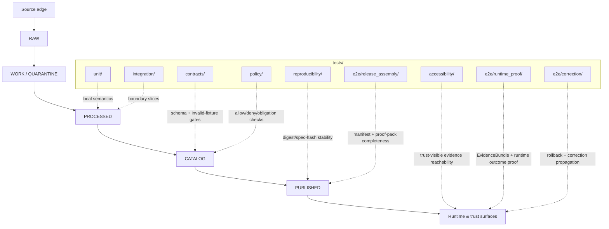

<!-- [KFM_META_BLOCK_V2]
doc_id: kfm://doc/<TODO-tests-readme-uuid>
title: tests
type: standard
version: v1
status: published
owners: @bartytime4life
created: <TODO: verify YYYY-MM-DD>
updated: 2026-03-18
policy_label: public
related: [../README.md, ../CONTRIBUTING.md, ../.github/README.md, ../.github/CODEOWNERS, ../contracts/README.md, ../docs/README.md]
tags: [kfm, tests, verification, readme]
notes: [doc_id and created date still need verification; owner and related paths were carried forward from the supplied baseline and should be rechecked in the live repo, especially ../.github/CODEOWNERS]
[/KFM_META_BLOCK_V2] -->

# tests

Governed verification surface for KFM proofs, gates, negative paths, and trust-preserving delivery.

> [!NOTE]
> In this README, the meta-block value `status: published` is preserved from the supplied baseline as the document record, while the impact block below describes the current maturity of the `tests/` surface itself.

> **Status:** experimental  
> **Owners:** `@bartytime4life` *(carried forward from the supplied baseline; recheck against `../.github/CODEOWNERS` before merge)*  
> **Path:** `tests/README.md`  
> **Repo fit:** directory index for governed verification families across contracts, policy, release, runtime trust, and correction  
> **Quick jump:** [Scope](#scope) · [Repo fit](#repo-fit) · [Accepted inputs](#accepted-inputs) · [Exclusions](#exclusions) · [Directory tree](#directory-tree) · [Quickstart](#quickstart) · [Usage](#usage) · [Diagram](#diagram) · [Operating tables](#operating-tables) · [Task list](#task-list--definition-of-done) · [FAQ](#faq) · [Appendix](#appendix)


> [!IMPORTANT]
> `tests/` is not a generic QA bucket. In KFM, verification is part of governed publication, runtime trust, rollback, and correction discipline. This directory exists to make trust-preserving behavior explicit, inspectable, and hard to bluff.

---

## Scope

`tests/` is the repo-facing verification surface for Kansas Frontier Matrix.

In KFM terms, verification attaches to transitions across the governed path — `Source edge -> RAW -> WORK / QUARANTINE -> PROCESSED -> CATALOG -> PUBLISHED` — and then returns at runtime trust surfaces, rollback paths, supersession, and correction. This directory should therefore gather the suites, fixtures, and proof-oriented checks that make those transitions reviewable instead of merely implied.

That is a wider burden than “does the code run?” The stronger question is: can the system prove why a source was admitted, why a dataset was promoted, why a runtime answer resolved to `ANSWER / ABSTAIN / DENY / ERROR`, and how a stale, withdrawn, generalized, or corrected state propagates visibly?

> [!CAUTION]
> This README is grounded in the mounted March 2026 KFM corpus **plus the supplied `tests/README.md` baseline**. The current session did **not** expose a live repo checkout, test tree, workflow YAML, manifests, or runtime logs. Exact on-disk paths, sibling READMEs, and merge-blocking enforcement therefore still need direct repo verification before merge.

### Status markers used here

| Marker | Meaning in this README |
|---|---|
| **CONFIRMED** | Grounded in the mounted March 2026 KFM corpus or the supplied baseline text |
| **INFERRED** | Strongly implied by the supplied baseline plus current KFM doctrine, but not directly rechecked in a mounted repo tree |
| **PROPOSED** | Recommended structure, rule, or workflow that fits KFM doctrine but is not proven as mounted implementation |
| **UNKNOWN** | Not established strongly enough in the current session to present as settled repo reality |
| **NEEDS VERIFICATION** | Recheck directly in the working tree, workflow inventory, or emitted proof objects before merge |

## Repo fit

**Path:** `tests/README.md`  
**Role:** directory-level guide for governed verification families, proof burdens, and maintenance rules.

> [!NOTE]
> Relative links below are preserved from the supplied baseline because they match the intended repo fit, but their live-tree presence still needs direct verification before merge.

### Upstream anchors

| Surface | Why it matters |
|---|---|
| [`../README.md`](../README.md) | Root project contract, top-level navigation, and repo-wide posture |
| [`../CONTRIBUTING.md`](../CONTRIBUTING.md) | Change discipline, review expectations, and contribution flow |
| [`../.github/README.md`](../.github/README.md) | CI/CD and collaboration context for merge-blocking verification |
| [`../.github/CODEOWNERS`](../.github/CODEOWNERS) | Ownership and review boundary for `/tests/` |
| [`../contracts/README.md`](../contracts/README.md) | Contract and schema-adjacent source layer that tests must not silently drift away from |
| [`../docs/README.md`](../docs/README.md) | Canonical documentation index and runbook surface |

### Downstream surfaces

| Surface | Intended responsibility | Status in this rewrite |
|---|---|---|
| [`./unit/`](./unit/) | Deterministic local behavior and helper semantics | **INFERRED** from supplied baseline |
| [`./integration/`](./integration/) | Cross-boundary verification slices | **INFERRED** from supplied baseline |
| [`./contracts/`](./contracts/) | Contract schemas, examples, and invalid-fixture checks | **INFERRED** from supplied baseline; doctrine-backed |
| [`./policy/`](./policy/) | Policy bundle, reason/obligation, and role-boundary tests | **INFERRED** from supplied baseline; doctrine-backed |
| [`./accessibility/`](./accessibility/) | Trust-visible accessibility and reduced-motion checks | **INFERRED** from supplied baseline; doctrine-backed |
| [`./reproducibility/`](./reproducibility/) | Deterministic rebuilds, bounded replay, and spec/digest stability | **INFERRED** from supplied baseline; doctrine-backed |
| [`./e2e/`](./e2e/) | End-to-end governed proof across release, runtime, and correction | **INFERRED** from supplied baseline |
| [`./e2e/release_assembly/`](./e2e/release_assembly/) | Promotion, manifest, and proof-pack completeness | **INFERRED** from March 2026 artifact plans; **NEEDS VERIFICATION** in live tree |
| [`./e2e/runtime_proof/`](./e2e/runtime_proof/) | Evidence drill-through, citation-negative behavior, and runtime outcome proof | **INFERRED** from March 2026 artifact plans; **NEEDS VERIFICATION** in live tree |
| [`./e2e/correction/`](./e2e/correction/) | Supersession, withdrawal, rollback, and stale-visible propagation | **INFERRED** from March 2026 artifact plans; **NEEDS VERIFICATION** in live tree |

## Accepted inputs

Content that belongs in `tests/` includes:

- unit tests for deterministic local behavior
- integration tests for governed slices across real boundaries
- contract-validation tests for envelopes, examples, and invalid fixtures
- policy tests for allow, deny, abstain, hold, generalize, and role-boundary behavior
- accessibility-critical trust-surface checks
- reproducibility and bounded-regression checks where spec hashes, digests, counts, or release linkages matter
- end-to-end proof suites for release assembly, runtime trust, and correction behavior
- thin fixtures that exist to execute or fail a gate
- smoke, canary, stale-state, rollback, and correction drills tied to trust-bearing behavior
- test-side notes, golden outputs, and harness artifacts that make governed expectations executable

## Exclusions

The following do **not** belong here as authoritative source-of-truth content:

- canonical contract or schema definitions  
  → keep those under `../contracts/` and related schema surfaces

- primary policy bundle sources, reason registries, reviewer-role maps, or governance registries  
  → keep those under `../policy/`

- runtime application code, workers, resolvers, connectors, or UI components  
  → keep those under app, package, runtime, or surface-specific directories

- release artifacts, proof packs, manifests, SBOMs, and attestation bundles as the *primary* record  
  → emit them from their governed lanes and let tests consume or verify them

- long-form architecture rationale, ADRs, or operator runbooks  
  → keep those under `../docs/`

- scratch files, one-off experiments, or unreviewed data dumps  
  → keep them out of the governed verification surface

## Directory tree

> [!NOTE]
> The tree below is the working contract carried forward from the supplied baseline and aligned to the March 2026 proof-family model. It is useful as repo-ready structure, but it still needs direct working-tree confirmation before merge.

```text
tests/
├── README.md
├── accessibility/
│   └── README.md
├── contracts/
│   └── README.md
├── e2e/
│   ├── README.md
│   ├── correction/
│   ├── release_assembly/
│   └── runtime_proof/
├── integration/
│   └── README.md
├── policy/
│   └── README.md
├── reproducibility/
│   └── README.md
└── unit/
    └── README.md
```

This split is not decorative. It separates proof burdens that KFM treats differently: local semantics, boundary slices, contract drift, policy failure, trust-visible accessibility, reproducibility, release assembly, runtime proof, and correction behavior should not collapse into one undifferentiated test bucket.

[Back to top](#tests)

## Quickstart

### Safe inventory commands

Use inspection-first commands that reveal what is present without assuming a specific test runner:

```bash
# inventory the visible tests surface
find tests -maxdepth 4 \( -type f -o -type d \) | sort

# inspect adjacent governed surfaces that usually co-change with tests
find tests contracts policy docs .github -maxdepth 4 -type f 2>/dev/null | sort | sed -n '1,240p'

# recheck declared ownership and workflow surfaces
sed -n '1,220p' .github/CODEOWNERS 2>/dev/null
find .github/workflows -maxdepth 2 -type f 2>/dev/null | sort

# locate core proof-object vocabulary across likely verification surfaces
grep -RIn "source_descriptor\|ingest_receipt\|validation_report\|dataset_version\|catalog_closure\|decision_envelope\|review_record\|release_manifest\|EvidenceBundle\|runtime_response_envelope\|correction_notice" \
  tests contracts policy docs .github 2>/dev/null || true

# locate trust-visible negative states and runtime outcomes
grep -RIn "ABSTAIN\|DENY\|ERROR\|stale-visible\|withdrawn\|superseded\|generalized\|review-required" \
  tests policy docs ui 2>/dev/null || true
```

### First verification pass

1. Confirm the actual `tests/` tree and sibling READMEs in the checked-out repo.
2. Confirm which verification jobs are really merge-blocking.
3. Confirm which families contain executable cases versus placeholder README contracts.
4. Confirm whether contracts, policy bundles, examples, and tests move together in the same governed stream.
5. Confirm whether at least one thin slice exercises release, runtime, and correction behavior end to end.
6. Confirm whether the live repo already prefers another naming shape such as `tests/ui/`, shared fixture roots, or another layout that should replace inferred folder names here.

> [!TIP]
> Prefer repo-native evidence over README prose. In KFM, a documented gate that has no mounted fixture, workflow, or proof object should still be treated as **PROPOSED** until the repo proves otherwise.

## Usage

### What `tests/` is

`tests/` is:

- the repo-facing proof surface for governed behavior
- the place where negative outcomes become first-class and testable
- the seam where contracts, policy, release evidence, runtime trust, and correction expectations become executable
- one of the places where KFM prevents derived convenience layers from silently outranking authoritative truth
- part of the same trust system that includes release manifests, Evidence Bundles, runtime envelopes, correction notices, and documentation gates

### What `tests/` is not

`tests/` is **not**:

- a substitute for authoritative schemas or policy bundles
- a place to hide implementation uncertainty behind broad “coverage” language
- a detached QA corner whose results do not affect promotion, publication, rollback, or correction
- a dumping ground for artifacts better owned elsewhere
- a place where public-safe behavior may be implied without proof objects

### Where a new test should land

Choose the smallest truthful family before inventing a new top-level folder:

- use [`./unit/`](./unit/) for local, deterministic behavior and pure helper logic
- use [`./integration/`](./integration/) when a real boundary matters: connector, store, resolver, API, or projection build
- use [`./contracts/`](./contracts/) when the core risk is envelope, schema, example, or invalid-fixture drift
- use [`./policy/`](./policy/) when the change affects rights, sensitivity, roles, denials, or reason/obligation grammar
- use [`./accessibility/`](./accessibility/) when evidence reachability, keyboard flow, reduced-motion safety, or trust-visible state signaling is the main burden
- use [`./reproducibility/`](./reproducibility/) when the burden is stable spec hashes, digests, counts, bounded replay, or rebuildability
- use [`./e2e/release_assembly/`](./e2e/release_assembly/) when the question is promotion, manifest completeness, or proof-pack completeness
- use [`./e2e/runtime_proof/`](./e2e/runtime_proof/) when the question is Evidence Bundle resolution, citation-negative behavior, or `ANSWER / ABSTAIN / DENY / ERROR`
- use [`./e2e/correction/`](./e2e/correction/) when supersession, withdrawal, rollback, or stale-visible propagation must be exercised

> [!TIP]
> If the live repo already uses `tests/ui/`, shared `fixtures/`, or another established naming scheme, keep the repo’s proven structure and update this README to match it. Preserve the **proof burden**, not a guessed folder name.

### Working rule for scaffolded families

A present directory or placeholder README is not the same thing as active coverage. Treat scaffolded families as documented contract boundaries waiting for executable proof, not as coverage already earned.

## Diagram


```mermaid
flowchart TB
    SE["Source edge"] --> RAW["RAW"]
    RAW --> WQ["WORK / QUARANTINE"]
    WQ --> PROC["PROCESSED"]
    PROC --> CAT["CATALOG"]
    CAT --> PUB["PUBLISHED"]
    PUB --> RT["Runtime & trust surfaces"]

    subgraph T["tests/"]
      U["unit/"]
      I["integration/"]
      C["contracts/"]
      P["policy/"]
      AX["accessibility/"]
      R["reproducibility/"]
      RA["e2e/release_assembly/"]
      RP["e2e/runtime_proof/"]
      CR["e2e/correction/"]
    end

    U -. local semantics .-> PROC
    I -. boundary slices .-> PROC
    C -. schema + invalid-fixture gates .-> CAT
    P -. allow/deny/obligation checks .-> CAT
    AX -. trust-visible evidence reachability .-> RT
    R -. digest/spec-hash stability .-> PUB
    RA -. manifest + proof-pack completeness .-> PUB
    RP -. EvidenceBundle + runtime outcome proof .-> RT
    CR -. rollback + correction propagation .-> RT
```

## Operating tables

### Family map

| Family | Primary burden | First-class proof burden | Current posture in this rewrite |
|---|---|---|---|
| `unit/` | Deterministic local behavior | Local semantics, helper correctness, pure transforms | **INFERRED** from supplied baseline |
| `integration/` | Governed boundary slices | Connector, resolver, API, storage, and projection seams | **INFERRED** from supplied baseline |
| `contracts/` | Schema, example, and invalid-fixture drift | `source_descriptor`, `ingest_receipt`, `validation_report`, envelope validity | **INFERRED** path, doctrine-backed |
| `policy/` | Deny-by-default and decision grammar | reason codes, obligation codes, allow/deny/generalize/review-required outcomes | **INFERRED** path, doctrine-backed |
| `accessibility/` | Trust-visible UX obligations | evidence reachability, non-color-only cues, keyboard flow, reduced motion | **INFERRED** path, doctrine-backed |
| `reproducibility/` | Stable rebuilds and bounded replay | spec hash, digest stability, bounded rerun behavior | **INFERRED** path, doctrine-backed |
| `e2e/release_assembly/` | Release evidence and promotion readiness | `run_manifest`, `run_receipt`, `release_manifest`, proof-pack completeness | **INFERRED** path, March 2026 artifact-plan backed |
| `e2e/runtime_proof/` | Runtime answer accountability | `EvidenceBundle`, `runtime_response_envelope`, citation-negative handling | **INFERRED** path, March 2026 artifact-plan backed |
| `e2e/correction/` | Correction, supersession, rollback | `correction_notice`, stale-visible propagation, rollback evidence | **INFERRED** path, March 2026 artifact-plan backed |

### Proof-object pressure by family

| Proof object or behavior | First place to exercise it | Why it matters |
|---|---|---|
| `source_descriptor`, `ingest_receipt`, `validation_report` | `contracts/`, `integration/`, `e2e/release_assembly/` | Intake must prove admissibility, replayability, and quarantine behavior before publication is even possible |
| `dataset_version`, `catalog_closure`, `decision_envelope`, `review_record` | `contracts/`, `policy/`, `e2e/release_assembly/` | Promotion depends on deterministic identity, metadata closure, policy posture, and review evidence |
| `EvidenceBundle`, `runtime_response_envelope` | `e2e/runtime_proof/`, `accessibility/` | KFM’s public trust boundary depends on evidence drill-through and accountable runtime outcomes |
| `correction_notice`, rollback evidence, stale-visible propagation | `e2e/correction/`, `e2e/release_assembly/` | A system that proves only happy-path release is not yet trust-preserving |

### Change-trigger matrix

| If a PR changes… | Minimum verification expectation |
|---|---|
| contracts or schemas | schema gate, valid and invalid fixtures, representative contract tests, and no silent envelope drift |
| policy bundles or registries | allow and deny cases, reason/obligation grammar checks, role-boundary cases, and fail-closed defaults |
| source onboarding or connector logic | unit + integration coverage, replay checks, deterministic manifests/checksums, and representative policy labeling |
| release or promotion logic | release assembly proof, documentation/runbook alignment, and correction/rollback readiness |
| runtime answering, Focus, or Evidence Drawer behavior | runtime-proof coverage, citation-negative tests, Evidence Bundle drill-through, and visible negative-state handling |
| trust-visible UI behavior | accessibility gate, keyboard path coverage, reduced-motion-safe trust cues, and no hidden bypass around evidence or policy |
| docs that change governed behavior | documentation gate plus agreement across contracts, examples, runbooks, and test expectations |

### Negative-path proofs worth protecting early

| Negative path | Why it matters |
|---|---|
| broken evidence resolution | prevents plausible but unsupported public claims |
| citation-negative runtime response | ensures the system abstains, denies, or errors instead of bluffing support |
| policy denial for restricted or sensitive material | proves fail-closed behavior under ambiguity |
| stale projection visibility | prevents derived layers from silently outranking release truth |
| correction / supersession drill | keeps rollback and correction visible instead of silently overwritten |
| inaccessible trust cue | prevents “verified” behavior that users cannot actually inspect |

## Task list / Definition of done

A healthy `tests/README.md` should make the directory more truthful, not more theatrical.

- [ ] Recheck the live `tests/` tree, sibling README files, and owner metadata in the working repo before merge
- [ ] Keep directory structure claims separate from unverified implementation maturity
- [ ] Do not describe a family as active coverage unless executable cases exist in-tree
- [ ] Keep contracts, policy bundles, fixtures, docs, and tests aligned for behavior-significant change
- [ ] Prefer negative-path proof for trust-sensitive changes, not just happy-path confirmation
- [ ] Preserve trust-visible accessibility under keyboard and reduced-motion paths
- [ ] Maintain at least one correction or rollback drill for any trust-bearing thin slice
- [ ] Update this README when a family is added, renamed, removed, or materially repurposed

## FAQ

### Why does `tests/` talk about governed verification instead of generic QA?

Because KFM treats verification as part of publication, runtime trust, and correction discipline. A suite here matters only if it helps prove that the system behaves safely, inspectably, and reversibly under both success and failure.

### Why are some statements marked **INFERRED** or **NEEDS VERIFICATION**?

Because the current session exposed PDFs only. The March 2026 manuals strongly confirm the doctrine, but they do not by themselves prove the current mounted repo tree, workflow inventory, or runtime coverage.

### Why keep `release_assembly`, `runtime_proof`, and `correction` separate?

Because they carry different burdens. Release assembly proves why a candidate was promotable, runtime proof proves why a response or surface state resolved the way it did, and correction proves that rollback, supersession, stale-visible behavior, and public-facing repair are real rather than rhetorical.

### Why do docs and accessibility appear in a tests README?

Because KFM explicitly treats documentation and accessibility as production verification surfaces whenever behavior-significant change affects trust-visible flows, Evidence Drawer reachability, or release/correction expectations.

### Should canonical examples live in `tests/`?

Usually not. Canonical schema and policy sources should live with their own authoritative layers. `tests/` should consume them, execute them, or fail them.

### Why is hydrology the preferred first thin slice?

Because the mounted KFM manuals repeatedly treat hydrology as a public-safe, place/time-rich lane that can prove evidence drill-through, runtime accountability, and correction behavior without immediately front-loading the hardest stewardship and location-exposure burdens.

### What if the live repo already uses different names than this README?

Prefer mounted repo truth. Replace inferred path names with the real layout, keep the proof burdens intact, and preserve the KFM distinction between doctrine, realization, and directly verified implementation.

[Back to top](#tests)

## Appendix

<details>
<summary><strong>Appendix A — Evidence basis used for this README</strong></summary>

This README was shaped primarily by the March 2026 KFM testing, verification, governed-delivery, master-manual, tooling, security, schema/contract, app-surface, and configuration layers.

The strongest pressure came from the materials that do all of the following at once:

- treat verification as a cross-plane governance system rather than a narrow test suite
- keep negative outcomes first-class
- insist on evidence drill-through, runtime accountability, and visible correction lineage
- prefer one public-safe hydrology slice over premature breadth
- keep repo reality separate from doctrinal ambition when direct implementation evidence is absent

Older continuity material was used only as corroboration for proposed path shapes and artifact plans, not as stronger authority than the March 16–19 mounted reference layer.

</details>

<details>
<summary><strong>Appendix B — Direct verification still needed before merge</strong></summary>

Before treating this README as fully settled repo documentation, verify:

- the live `tests/` tree and sibling README files
- `../.github/CODEOWNERS` ownership for `/tests/`
- which families contain executable suites versus placeholder docs
- actual workflow YAML and required checks that block merge or promotion
- contract and fixture inventory for valid and invalid examples
- sample proof objects, if any, for release, runtime, and correction lanes
- whether accessibility tests live in `tests/accessibility/`, `tests/ui/`, or another mounted location
- whether the hydrology-first thin slice already exists in part or at all

</details>

<details>
<summary><strong>Appendix C — How to revise this README if the mounted repo differs</strong></summary>

If direct repo inspection later shows a different file layout:

1. Keep the doctrinal distinctions: release assembly, runtime proof, correction, policy, accessibility, and reproducibility remain different proof burdens even if the directories are renamed.
2. Downgrade any conflicting file-level proposal from **INFERRED** or **PROPOSED** to **UNKNOWN** until the live tree proves otherwise.
3. Update relative links, tree examples, and family names to the mounted repo rather than forcing code to mimic placeholder documentation.

The goal is not to preserve guessed paths. The goal is to preserve truthful governance language.

</details>