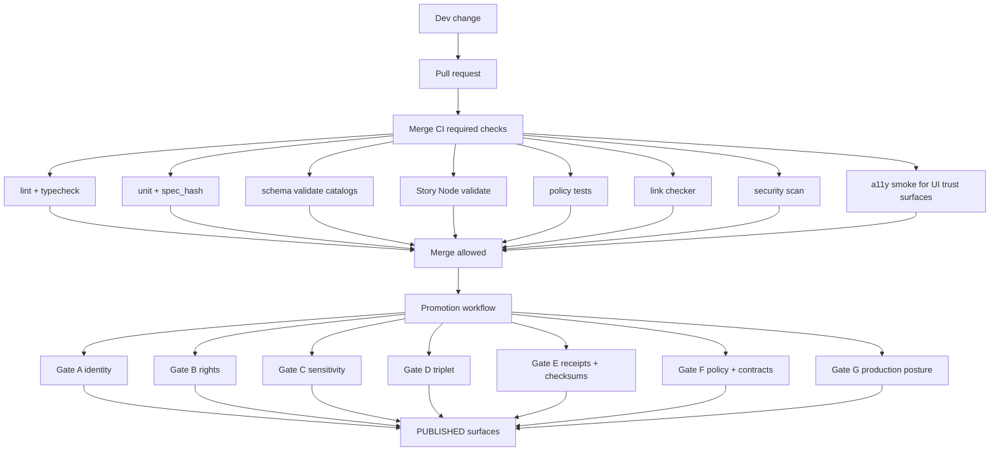

<!-- [KFM_META_BLOCK_V2]
doc_id: kfm://doc/7f06c93b-7c88-4f2b-bba2-4f3d935d3f89
title: tests — Test Strategy, QA, and CI Gates
type: standard
version: v3
status: draft
owners: TODO
created: 2026-02-26
updated: 2026-03-02
policy_label: restricted
related:
  - docs/MASTER_GUIDE_v13.md
  - docs/architecture/
  - .github/workflows/
tags: [kfm, tests, ci, governance]
notes:
  - This README is a governed artifact. Keep it aligned with merge gates and the Promotion Contract.
  - Do not include secrets, restricted datasets, or sensitive location details in this doc or fixtures.
[/KFM_META_BLOCK_V2] -->

<a id="top"></a>

# `tests/` — Test Strategy, QA, and CI Gates

**Purpose:** Make governance enforceable. Tests are not “nice to have”; they are the mechanism that keeps the **trust membrane** intact and prevents unsafe or untraceable outputs from shipping.

**Status:** DRAFT • **Owners:** `TODO` • **Last updated:** `2026-03-02` • **Policy label:** `restricted`


> [!WARNING]
> This directory is part of the **trust membrane**. If a test is flaky, non-deterministic, bypassable, or silently skipped, it is a governance risk.

> [!IMPORTANT]
> **Truth discipline (non‑negotiable)**
> - **Confirmed (design intent):** Promotion Contract v1, merge-gate posture, and “fail closed” behavior must be enforced by CI.
> - **Repo-specific (Unknown until verified):** exact job names, test runner commands, suite locations, and folder layout must match *this repo’s* implementation.
> - **Proposed:** where the repo lacks enforcement, this README proposes a safe default that is small, testable, and reversible.

---

## Quick navigation

- [Repo reality check](#repo-reality-check)
- [Where `tests/` fits](#where-tests-fits)
- [What tests must enforce](#what-tests-must-enforce)
- [Two lanes: merge gates vs promotion gates](#two-lanes-merge-gates-vs-promotion-gates)
- [Non-negotiable invariants](#non-negotiable-invariants)
- [Test taxonomy](#test-taxonomy)
- [CI: required merge gates](#ci-required-merge-gates)
- [Promotion Contract v1 mapping](#promotion-contract-v1-mapping)
- [Operational requirements: QA thresholds + promotion manifests](#operational-requirements-qa-thresholds--promotion-manifests)
- [Folder layout](#folder-layout)
- [Running tests](#running-tests)
- [Fixtures and data safety](#fixtures-and-data-safety)
- [Writing and adding tests](#writing-and-adding-tests)
- [Governance quality metrics](#governance-quality-metrics)
- [Release definition of done](#release-definition-of-done)
- [Troubleshooting](#troubleshooting)
- [Appendices](#appendices)

---

## Repo reality check

This README describes the **required posture**. Before treating it as “Confirmed (repo)”, verify the repo actually wires these checks into CI and branch protections.

Minimum verification steps (copy/paste):

```bash
# 0) Capture repo identity (so this doc revision is traceable)
git rev-parse HEAD || true
git status --porcelain || true

# 1) Inspect tests tree (and confirm suite categories exist)
find tests -maxdepth 3 -type d -print

# 2) Find CI workflows that reference tests and promotion gates
ls -la .github/workflows 2>/dev/null || true
grep -R "tests/" -n .github/workflows 2>/dev/null || true
grep -R "promotion\|manifest\|receipt\|spec_hash" -n .github/workflows 2>/dev/null || true

# 3) Identify the canonical test entrypoint (prefer exactly one merge-blocking command)
# Examples: make test, task test, ./scripts/ci.sh, pnpm -r test, pytest, go test, dotnet test
ls -la Makefile Taskfile.yml scripts tools 2>/dev/null || true

# 4) If policy exists, confirm policy tests are merge-blocking
ls -la policy 2>/dev/null || true
grep -R "opa\|rego\|conftest" -n .github/workflows 2>/dev/null || true

# 5) Confirm publish surfaces have schema + link checks (Story Node, EvidenceRef resolution)
grep -R "story" -n .github/workflows 2>/dev/null || true
grep -R "evidence" -n .github/workflows 2>/dev/null || true
grep -R "linkcheck\|link_check" -n .github/workflows 2>/dev/null || true
```

> [!NOTE]
> **Do not claim** repo sub-packages or module paths exist until verified. Prefer “documented target modules + verification steps” over guessy path assertions.

[Back to top](#top)

---

## Where `tests/` fits

**Design intent:** Keep the repo legible by separating “validation tools” from “tests that enforce validation.”

Typical placement (adapt to the actual repo):

- `docs/` — architecture docs, runbooks, ADRs, templates
- `tools/` — validators, link checkers, CLI utilities
- `tests/` — unit/integration/e2e tests + fixtures
- `configs/`, `scripts/`, `migrations/`, `examples/` — configuration, automation, migrations, examples

[Back to top](#top)

---

## What tests must enforce

Tests in this directory exist to enforce:

1. **Correctness** of domain logic (including deterministic identity/hashing).
2. **Governance invariants** (default-deny, fail closed, no bypass).
3. **Truth path lifecycle** (zones + artifacts are real and validated).
4. **Evidence-first UX contract** (every claim opens to resolvable evidence).
5. **Cite-or-abstain** (no verified citations ⇒ abstain / safe reduction in scope).
6. **Contract stability** (catalog schemas, API contracts, error envelopes).
7. **Safety** for sensitive locations & restricted data (no leakage; no restricted existence inference).
8. **Provenance artifacts** (run receipts, promotion manifests; verifiable and policy-safe).
9. **Security as governance** (supply-chain checks; audit log protections).

[Back to top](#top)

---

## Two lanes: merge gates vs promotion gates

KFM has **two kinds of “blocking checks”**:

- **Merge gates (PR lane):** protect mainline code + governed schemas/templates from regressions.
- **Promotion gates (Promotion lane):** protect *published runtime surfaces* (API/UI/Story/Focus) from ungoverned artifacts.


```mermaid
flowchart TD
  Dev[Dev change] --> PR[Pull request]
  PR --> MergeCI[Merge CI required checks]

  MergeCI --> Lint[lint + typecheck]
  MergeCI --> Unit[unit + spec_hash]
  MergeCI --> Schema[schema validate catalogs]
  MergeCI --> Story[Story Node validate]
  MergeCI --> Policy[policy tests]
  MergeCI --> Link[link checker]
  MergeCI --> Sec[security scan]
  MergeCI --> A11y[a11y smoke for UI trust surfaces]

  Lint --> MergeOK[Merge allowed]
  Unit --> MergeOK
  Schema --> MergeOK
  Story --> MergeOK
  Policy --> MergeOK
  Link --> MergeOK
  Sec --> MergeOK
  A11y --> MergeOK

  MergeOK --> Promote[Promotion workflow]
  Promote --> GateA[Gate A identity]
  Promote --> GateB[Gate B rights]
  Promote --> GateC[Gate C sensitivity]
  Promote --> GateD[Gate D triplet]
  Promote --> GateE[Gate E receipts + checksums]
  Promote --> GateF[Gate F policy + contracts]
  Promote --> GateG[Gate G production posture]

  GateA --> Publish[PUBLISHED surfaces]
  GateB --> Publish
  GateC --> Publish
  GateD --> Publish
  GateE --> Publish
  GateF --> Publish
  GateG --> Publish
```

> [!IMPORTANT]
> If a “gate” is not enforced in CI, it is not governance.

[Back to top](#top)

---

## Non-negotiable invariants

### 1) Truth path lifecycle zones are real (not metaphor)

A promoted dataset version must move through zones with the right artifacts and validations.

| Zone | Rule (fail closed) | Typical artifacts | Tests that enforce |
|---|---|---|---|
| RAW | Append-only; never edit—supersede with new acquisition | upstream payloads, checksums, license snapshot, fetch logs | schema for RAW manifests; integrity checks; no mutation tests |
| WORK / QUARANTINE | Transform + QA; failures isolated; unclear license/sensitivity ⇒ quarantine | normalization outputs, QA reports, candidate redactions | QA threshold tests; quarantine reason-code tests |
| PROCESSED | Publishable standardized artifacts w/ stable IDs + checksums | GeoParquet, PMTiles, COG, derived metadata | artifact digest tests; format/schema checks |
| CATALOG / TRIPLET | DCAT + STAC + PROV validate + cross-link | catalog JSON(-LD), PROV bundles, link maps | triplet schema tests + link checker |
| PUBLISHED | Only serve promoted versions via governed API/PEP + UI | API responses, tiles, story pages, Focus answers | contract tests; e2e trust flows; policy-safe errors |

### 2) Trust membrane boundaries are enforced

- Frontend must **never** fetch directly from object storage or databases.
- Core logic must not bypass repository/policy enforcement boundaries.

**Enforcement pattern:** static boundary tests + integration tests.

### 3) Evidence resolver is a contract surface

Evidence resolution must be policy-aware and deterministic:

- Accept EvidenceRef (scheme-based) or structured reference.
- Apply policy and return allow/deny + obligations.
- Return an EvidenceBundle that includes human view + machine metadata + digests + audit refs.

**Enforcement pattern:** integration tests + contract tests + UI smoke tests.

### 4) Cite-or-abstain is a hard gate for Focus / story publishing

If citations cannot be verified or are denied:

- The system must abstain or safely reduce scope.
- The UI must use policy-safe denial patterns (no existence inference).

**Enforcement pattern:** golden tests + e2e + link checker.

### 5) Deterministic identity and hashing

- `spec_hash` must be computed from canonicalized content.
- Identical inputs should yield identical outputs (or the run receipt records why).

**Enforcement pattern:** golden vectors + drift tests.

### 6) Policy-safe errors: no restricted existence inference

Public users must not infer restricted existence by:

- error message shape/content
- status codes (where policy requires indistinguishability)
- timing differences (where feasible)

**Enforcement pattern:** contract tests + e2e denial UX tests + runtime behavior tests.

### 7) Receipts + audit logs are governance artifacts

- Every governed run emits a typed `run_receipt`.
- Promotion emits a typed `promotion_manifest`.
- Logs must be redacted; no secrets.

**Enforcement pattern:** schema tests + redaction tests.

### 8) Security and supply chain integrity are merge-blocking (when enabled)

- Dependency scanning blocks known critical issues.
- SBOM/attestations (if enabled) verified server-side; never fetched directly by browser.

**Enforcement pattern:** security scans + policy tests + UI guardrail tests.

[Back to top](#top)

---

## Test taxonomy

Minimum categories expected for KFM:

| Category | Purpose | Typical failures caught | Must be deterministic? | Merge gate? |
|---|---|---|---:|---:|
| Unit | Domain logic, hashing, vocab, time logic | hash drift, time bugs, invariant regressions | ✅ | ✅ |
| Schema | DCAT/STAC/PROV + receipts/manifests + Story Node templates | invalid JSON, missing fields, broken links | ✅ | ✅ |
| Policy | allow/deny + obligations + rights | leakage regressions, wrong obligations, default-deny broken | ✅ | ✅ |
| Contract | API specs + DTOs + error envelopes | breaking changes, unsafe errors, incompatible DTOs | ✅ | ✅ |
| Integration | Evidence resolver + governed API | policy bypass, EvidenceRef breakage, audit_ref missing | ✅ | ✅ |
| E2E (smoke) | UI trust flows | missing evidence drawer, citations not resolvable, denial UX regressions | ✅ (as much as possible) | ✅ (smoke) |
| Security | dependency + supply-chain checks | vulnerable deps, leaked secrets, missing SBOM rules | ✅ | ✅ |

> [!NOTE]
> If a test cannot be made deterministic, it must be isolated and treated as **non-blocking** until fixed.

[Back to top](#top)

---

## CI: required merge gates

This repo should enforce (at minimum) the following merge gates as required checks.

### Baseline merge gates (minimum)

- `lint + typecheck` (frontend + backend)
- `spec_hash` (deterministic identity) tests
- `schema validation` for any changed catalog artifacts (DCAT/STAC/PROV) and run receipts/manifests
- `Story Node template validation` (publish gate: citations must resolve)
- `policy tests` (fixtures-driven; default deny)
- `link checker` (no broken citations / EvidenceRefs)
- `security scanning` (dependency vulnerabilities) and optional SBOM generation
- `accessibility smoke checks` for UI changes (at least keyboard nav for evidence drawer)

> [!IMPORTANT]
> If your workflow uses different names, keep the **mapping 1:1** with `.github/workflows/`.

### Recommended job naming (rename to match your workflows)

- `lint_typecheck`
- `unit_spec_hash`
- `schema_catalog`
- `story_validate`
- `policy`
- `link_check`
- `contract_api`
- `integration_evidence`
- `e2e_ui_smoke`
- `a11y_smoke`
- `security_scan`
- `sbom_attest` (only if enabled)
- `focus_eval` (only if Focus exists in the repo)

[Back to top](#top)

---

## Promotion Contract v1 mapping

Promotion to **PUBLISHED** is blocked unless minimum gates are met.

> [!IMPORTANT]
> “Documentation == enforcement.” Update this table to match `.github/workflows/` exactly once verified.

### Gate ↔ required artifacts ↔ test suite ↔ CI check mapping

| Gate | Blocks promotion unless… | Primary test coverage | Suggested CI check (recommended names) |
|---|---|---|---|
| **A — Identity & versioning** | `dataset_id`, `dataset_version_id`, deterministic `spec_hash`, content digests exist and match | `unit/hashing` + `schema/receipts` | `unit_spec_hash` + `schema_catalog` |
| **B — Licensing & rights metadata** | License/rights present; unknown license ⇒ QUARANTINE (fail closed) | `policy/rights` + `schema/dcat` | `policy` + `schema_catalog` |
| **C — Sensitivity classification & redaction plan** | `policy_label` assigned; redaction/generalization recorded; obligations computed | `policy/*` + `integration/*` + `e2e` smoke | `policy` + `integration_evidence` + `e2e_ui_smoke` |
| **D — Catalog triplet validation** | DCAT/STAC/PROV validate and cross-link; EvidenceRefs resolve without guessing | `schema/triplet` + `schema/linkcheck` | `schema_catalog` + `link_check` |
| **E — Run receipt & checksums** | `run_receipt` exists; inputs/outputs enumerated w/ checksums; environment captured | `schema/receipts` + `integration/audit` | `schema_catalog` + `integration_evidence` |
| **F — Policy tests & contract tests** | OPA policy tests pass; evidence resolve works in CI; API contracts/schemas validate | `policy/*` + `contract/*` + `integration/*` | `policy` + `contract_api` + `integration_evidence` |
| **G — Optional but recommended (production posture)** | SBOM/build provenance; perf smoke; a11y smoke | `security/*` + perf/a11y suites | `security_scan` + `sbom_attest` + `a11y_smoke` |

[Back to top](#top)

---

## Operational requirements: QA thresholds + promotion manifests

Some documents treat these as separate “gates,” others treat them as zone-exit invariants and release artifacts. Either way, **treat them as blocking for dataset promotions**.

### QA thresholds (WORK/QUARANTINE exit)

- Dataset-specific quality checks must exist and be evaluated.
- Failures must quarantine the dataset version (no promotion).

**Where to enforce:** `tests/schema/` or `tests/integration/` for dataset-specific suites; results recorded in receipts/manifests.

### Promotion manifests (release artifact)

- Every newly promoted dataset version should produce a typed `promotion_manifest`.
- Promotion manifests support reproducibility and steward sign-off.

**Where to enforce:** `tests/schema/receipts` (or `tests/schema/manifests`) + promotion workflow validation.

[Back to top](#top)

---

## Folder layout

This is the **recommended** layout. If the repo differs, update this section to match reality.

### Minimum required structure

```text
tests/
├─ README.md
├─ unit/
├─ schema/
├─ policy/
├─ contract/
├─ integration/
├─ e2e/
├─ fixtures/
└─ utils/
```

### Extended recommended structure (reference)

<details>
<summary><strong>Show full recommended tree</strong></summary>

```text
tests/
├─ README.md
│
├─ registry/                          # Machine-readable suite registry + schemas (optional but recommended)
│  ├─ tests.v1.json                   # Suites, owners, required gates, commands, timeouts, flake policy
│  └─ schemas/                        # JSON Schemas for registry + receipts/manifests (or link to contracts/)
│
├─ unit/                              # Deterministic pure tests: hashing, vocab, time logic, invariants
├─ schema/                            # Catalog/receipt/story schemas + triplet cross-link + linkcheck
├─ policy/                            # Fixture-driven allow/deny/obligation tests
├─ contract/                          # API/DTO/error envelopes + compatibility
├─ integration/                       # Evidence resolver + governed API harness tests
├─ e2e/                               # UI smoke + a11y for trust surfaces (evidence drawer, denial UX)
├─ fixtures/                          # Synthetic/sanitized fixtures ONLY
└─ utils/                             # Shared helpers: fake clock, canonical JSON, assertions
```

</details>

> [!TIP]
> Keep top-level categories **few and obvious**. If you add a new category, update this README and wire it into CI.

[Back to top](#top)

---

## Running tests

> [!IMPORTANT]
> The repo should expose **one** canonical “run everything that’s merge-blocking” entrypoint.
> If it doesn’t exist, add it (Makefile/Taskfile/script) and wire CI to use it.

### Canonical entrypoint (choose one per repo)

Examples (pick the one your repo uses, then delete the rest):

```bash
# Option A
make test

# Option B
task test

# Option C
./scripts/ci/required_checks.sh

# Option D (JS monorepo)
pnpm -r test

# Option E (Python)
pytest -q

# Option F (Go)
go test ./...

# Option G (.NET)
dotnet test
```

### Run by category (examples; adjust to reality)

```bash
# Unit
pytest -q tests/unit

# Schema
pytest -q tests/schema

# Policy
pytest -q tests/policy

# Contract
pytest -q tests/contract

# Integration
pytest -q tests/integration

# E2E UI smoke (example)
npx playwright test --project=chromium --grep @smoke
```

### Suggested local workflow

1. Run `unit + schema + policy` before pushing.
2. Run `integration` before requesting review on governance-impacting work.
3. Run `e2e` smoke suite before merging UI trust-surface changes.

[Back to top](#top)

---

## Fixtures and data safety

Fixtures are governed artifacts. Treat them like publishable documentation.

### Fixture requirements

- **Synthetic by default** (preferred).
- **Small** (reviewable; diff-friendly).
- **Licensed / attributable** (even for synthetic, note generator and intent).
- **Sanitized** (no sensitive coordinates; no re-identification risk).
- **Deterministic** (no timestamps/randomness unless seeded and explained).

### Prohibited fixture content

- Secrets, tokens, credentials, private keys.
- Real restricted geometries or precise sensitive locations.
- PII or re-identifiable records.
- Anything that would be unsafe to paste into a public issue.

### Fixture documentation standard

Each fixture directory must include `FIXTURE_NOTES.md` documenting:

- Source or generator
- License (or “synthetic”)
- Sensitivity classification
- Redactions/generalizations applied
- Which tests depend on it (paths)

[Back to top](#top)

---

## Writing and adding tests

### Golden rules

- **Fail closed:** missing citation, policy label, rights metadata, receipt fields, or schema links must fail the test.
- **No hidden dependencies:** tests must not require internet access or external credentials.
- **Stable, policy-safe outputs:** avoid logging secrets; avoid printing restricted content.

### Adding a new feature test checklist

- [ ] Unit test covers domain logic changes (including hashing/identity if affected).
- [ ] Schema tests cover any catalog/receipt/manifest changes.
- [ ] Policy fixtures + tests updated for any new access pattern.
- [ ] Contract tests updated for any OpenAPI/DTO/error model change.
- [ ] Integration tests cover at least one representative EvidenceRef flow.
- [ ] E2E smoke test covers evidence drawer / denial UX if UI is affected.
- [ ] “No leakage” tests added if sensitive locations or restricted data touched.
- [ ] Link checking passes (no broken citations).
- [ ] Accessibility smoke checks pass for UI changes.
- [ ] If SBOM/attestations are enabled: verification tests updated (no browser fetch).

### Flakiness policy (governance incident posture)

- A flaky merge-blocking test is a governance incident.
- Quarantine a flaky test **only** with:
  - an issue + owner + fix plan
  - a time-bounded follow-up
  - an explicit downgrade to non-blocking in CI
- Restore it to blocking once stabilized.

### Determinism tools (recommended)

- Seeded randomness (document seed).
- Time-freezing utilities (fake clock).
- Snapshot normalization (canonical JSON; stable ordering).
- Explicit readiness checks (avoid sleeps).

[Back to top](#top)

---

## Governance quality metrics

Track governance and reliability metrics so drift is visible (without incentivizing unsafe behavior).

| Metric | Why it matters | Where to compute |
|---|---|---|
| % promoted artifacts with explicit license metadata | Detect rights/attribution drift | receipts + catalog triplet |
| % Story Nodes with 100% resolvable citations | Enforces evidence-first narratives | story publish gate + linkcheck |
| Evidence resolver latency (P95) | UX integrity; bottleneck signal | integration harness + runtime telemetry |
| Tile serving latency (P95) for public layers | Map-first performance | e2e + runtime telemetry |
| Reindex time from processed artifacts | Rebuildability & recovery | indexer job receipts |
| # quarantined datasets by reason code | QA + governance health | promotion manifests + policy denials |
| # policy denials by reason code | Detect leakage attempts + regressions | policy logs (redacted) |

> [!NOTE]
> Metrics must not encourage perverse incentives. Use them to detect drift and risk.

[Back to top](#top)

---

## Release definition of done

A release is “done” only when:

- All merge gates pass on the release branch/tag.
- Promotion manifests exist for any new dataset versions.
- Evidence resolver contract tests pass for:
  - allowed scenarios (resolvable citations)
  - denied scenarios (policy-safe denial; no existence inference)
- Focus Mode evaluation harness passes golden queries (if Focus exists).
- UI regression smoke tests pass and accessibility checks show no major regressions.
- Release notes include policy/contract/data changes and rollback notes.
- Audit ledger retention and monitoring are configured (no silent “best effort” logging).

[Back to top](#top)

---

## Troubleshooting

### Spec hash mismatch

Likely causes:
- canonicalization rules changed (ordering/normalization)
- a new field entered the identity inputs without being versioned

Fix:
- update canonicalization code and golden vectors intentionally
- version bump or migration notes if behavior is breaking

### Broken citations or unresolved EvidenceRefs

Fix:
- update evidence resolver mappings or fixtures
- ensure catalog triplet links exist and validate
- do not “skip” citation verification

### Policy tests failing unexpectedly

Treat as potential leakage first:
- confirm default-deny posture remains intact
- verify obligations are applied and logged
- only relax policy with explicit governance decision + fixtures proving intent

### Schema tests failing

Fix artifact generation to meet the profile:
- don’t weaken schemas to “fit the bug” unless it’s an intentional contract change

### Receipt / attestation verification failing

Likely causes:
- receipt schema drift (missing required fields, wrong timestamp format)
- digests changed without version bump
- signatures/attestations produced by unapproved workflow identity
- CI attempted network verification (should be fixture-based where possible)

Fix:
- validate receipt/manifest schemas locally on fixtures first
- ensure “subject” is a digest, not a mutable tag, in verification paths
- pin tool versions used to generate/verify attestations and treat updates as governed changes

### E2E flakiness

Stabilize by:
- removing timing assumptions
- using seeded deterministic data
- using explicit readiness checks (not sleeps)

[Back to top](#top)

---

## Appendices

<details>
<summary><strong>Appendix A — Fixture governance template</strong></summary>

Create `FIXTURE_NOTES.md` in every fixture directory:

```md
# Fixture Notes

- Fixture name:
- Source / generator:
- License:
- Policy label / sensitivity:
- Redactions / generalizations applied:
- Intended coverage (tests that depend on it):
- Safety notes (why it is safe to include in repo):
```
</details>

<details>
<summary><strong>Appendix B — Minimal run_receipt invariants (template)</strong></summary>

> This is a minimal shape; the repo’s canonical schema may live elsewhere.
> Core idea: spec_hash computed from canonicalized inputs; subject is a digest; checks fail-closed.

```json
{
  "$schema": "TODO:link-to-run_receipt-schema",
  "kfm_run_receipt_version": "v1",
  "kfm_run_id": "2026-03-02T00:00Z-abc123",
  "dataset": "TODO:dataset_slug_or_id",
  "dataset_version_id": "TODO:immutable-version-id",
  "subject": "sha256:TODO",
  "spec_hash": "sha256:TODO",
  "pipeline": "raw->processed->catalog->prov",
  "runner": "TODO:workflow-or-image-digest",
  "inputs": ["uri://..."],
  "outputs": ["stac://...", "prov://..."],
  "checks": { "stac": "ok", "prov": "ok", "policy": "ok" },
  "timestamps": { "start": "2026-03-02T00:00:00Z", "end": "2026-03-02T00:10:00Z" }
}
```
</details>

<details>
<summary><strong>Appendix C — Minimal promotion manifest (template)</strong></summary>

```json
{
  "$schema": "TODO:link-to-promotion_manifest-schema",
  "kfm_promotion_manifest_version": "v1",
  "dataset_slug": "TODO",
  "dataset_version_id": "TODO",
  "spec_hash": "sha256:TODO",
  "released_at": "2026-03-02T00:00:00Z",
  "artifacts": [
    { "path": "TODO", "digest": "sha256:TODO", "media_type": "TODO" }
  ],
  "catalogs": [
    { "path": "dcat.jsonld", "digest": "sha256:TODO" },
    { "path": "stac/collection.json", "digest": "sha256:TODO" },
    { "path": "prov/bundle.jsonld", "digest": "sha256:TODO" }
  ],
  "qa": { "status": "pass|fail", "report_digest": "sha256:TODO" },
  "policy": { "policy_label": "public|restricted", "decision_id": "kfm://policy_decision/TODO" },
  "approvals": [
    { "role": "steward", "principal": "TODO", "approved_at": "2026-03-02T00:00:00Z" }
  ]
}
```
</details>

<details>
<summary><strong>Appendix D — Minimal “policy-safe error” assertions</strong></summary>

Recommended assertions for public-role tests:

- Error envelope shape is stable (same fields regardless of restricted existence).
- Message does not confirm existence of restricted resources.
- Status codes do not create inference (use repo’s policy-safe standard).
- Response times are within a narrow band for deny vs not-found paths (where feasible).
</details>

---

<p align="right"><a href="#top">Back to top ↑</a></p>
