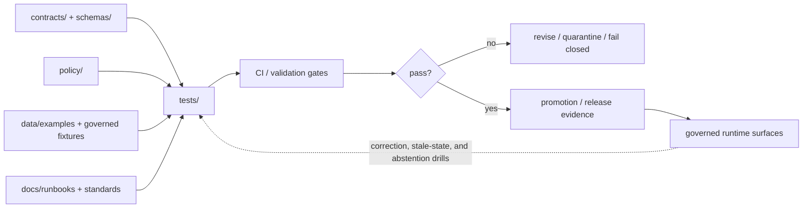

# tests

Governed verification surface for KFM unit, integration, contract, policy, reproducibility, and end-to-end confidence work.

> **Status:** experimental  
> **Owners:** `@bartytime4life`  
> **Path:** `tests/README.md`  
> **Repo evidence:** current visible branch confirms `tests/` exists and currently contains `README.md`; broader test substructure remains target-state until added  
> **Quick jump:** [Scope](#scope) · [Repo fit](#repo-fit) · [Accepted inputs](#accepted-inputs) · [Exclusions](#exclusions) · [Directory tree](#directory-tree) · [Quickstart](#quickstart) · [Usage](#usage) · [Diagram](#diagram) · [Operating tables](#operating-tables) · [Task list](#task-list--definition-of-done) · [FAQ](#faq) · [Appendix](#appendix)


> [!IMPORTANT]
> `tests/` is not just a generic QA bucket. In KFM, verification is part of the governed publication system. Test assets here should prove that contracts validate, policies fail closed, evidence resolves, runtime outcomes stay inspectable, and correction paths remain safer than persuasive overclaiming.

---

## Scope

`tests/` is the repository’s governed verification surface.

In KFM terms, this directory should be where branch-visible test assets gather around the repo’s real confidence obligations: unit behavior, integration slices, contract and schema validation, policy checks, reproducibility checks, accessibility-critical flows, and end-to-end proof of release, runtime, and correction behavior.

This directory is intentionally worth keeping even when small. A minimal `tests/` is better than an implied one, because KFM treats verification as a first-class operating boundary rather than an afterthought.

[Back to top](#tests)

## Repo fit

**Path:** `tests/README.md`  
**Directory role:** directory-level guide for governed verification and test-family boundaries

### Upstream anchors

- `../README.md`
- `../CONTRIBUTING.md`
- `../.github/README.md`
- `../contracts/README.md`
- `../docs/README.md`
- `../.github/CODEOWNERS`

### Confirmed downstream contents

- `./README.md`

### Expected downstream anchors (`PROPOSED` / `NEEDS VERIFICATION`)

- `./unit/`
- `./integration/`
- `./contracts/`
- `./policy/`
- `./e2e/release_assembly/`
- `./e2e/runtime_proof/`
- `./e2e/correction/`
- `./accessibility/`
- `./reproducibility/`

### Adjacent responsibility zones

- `../contracts/` and `../schemas/` hold authoritative contract and schema sources
- `../policy/` holds rule bundles, reason codes, obligation logic, and policy fixtures
- `../apps/`, `../packages/`, and `../infra/` hold runtime code and operational implementations
- `../docs/` holds runbooks, standards, ADRs, and explanatory doctrine
- `../tools/` holds validators, CLIs, link checkers, and support tooling

> [!NOTE]
> The strongest KFM pattern is: **authoritative source of truth stays in its home; `tests/` proves the home behaves correctly.**  
> This README therefore distinguishes between **what is verified on the branch today** and **what is the right target shape as test coverage grows**.

## Accepted inputs

Content that belongs in `tests/` includes:

- unit tests for deterministic local behavior
- integration tests for small governed slices across real boundaries
- contract-validation tests for request/response envelopes and example payloads
- policy tests for allow / deny / abstain / hold behavior
- negative-path tests for evidence failure, citation failure, rights failure, and stale-state handling
- end-to-end release-assembly tests
- runtime-proof suites for `ANSWER`, `ABSTAIN`, `DENY`, and `ERROR` behavior
- correction and supersession drills
- accessibility-critical flow tests for trust-visible surfaces
- reproducibility and regression checks where artifacts, digests, or stable metrics matter
- thin test fixtures that are execution-oriented rather than canonical source examples

## Exclusions

The following do **not** belong here as authoritative source of truth:

- canonical schemas, OpenAPI files, vocabularies, or standards profiles  
  → keep them under `../contracts/` and `../schemas/`

- policy bundle source files, reviewer-role maps, or obligation registries  
  → keep them under `../policy/`

- runtime application code, ingestion workers, evidence resolvers, or UI components  
  → keep them under `../apps/`, `../packages/`, or `../infra/`

- release manifests, receipts, SBOMs, or promoted artifacts  
  → keep them in their designated governed artifact and release paths

- long-form narrative guidance, incident playbooks, or architecture rationale  
  → keep them under `../docs/`

- large raw datasets or branch-local scratch dumps  
  → keep them out of `tests/`; use governed data zones or local ignored paths instead

## Status markers used in this README

| Marker | Meaning here |
|---|---|
| **CONFIRMED** | Visible on the current branch or directly grounded in stable KFM doctrine |
| **PROPOSED** | Buildable test structure or rule that fits KFM doctrine but is not yet present as branch-visible reality |
| **UNKNOWN** | Not verified strongly enough to state as current repo fact |
| **NEEDS VERIFICATION** | A path, command, workflow, or implementation detail that should be checked against the checked-out branch before merge |

## Directory tree

### Current confirmed snapshot

```text
tests/
└── README.md
```

### Target growth shape (`PROPOSED`)

```text
tests/
├── README.md
├── unit/                       # deterministic local behavior
├── integration/                # small governed slices across boundaries
├── contracts/                  # envelope / schema / example validation wrappers
├── policy/                     # allow / deny / abstain / hold test suites
├── accessibility/              # trust-visible and keyboard-critical flows
├── reproducibility/            # stable digest / bounded-regression checks
└── e2e/
    ├── release_assembly/       # promotion and publish-path proof
    ├── runtime_proof/          # ANSWER / ABSTAIN / DENY / ERROR suites
    └── correction/             # supersede / withdraw / stale / rollback drills
```

### Interpretation rule

Use the confirmed snapshot when documenting current branch truth.  
Use the target shape when planning or reviewing new governed verification work.

[Back to top](#tests)

## Quickstart

### Safe inspection commands

These commands are branch-safe because they inspect what is present without assuming more than the checkout proves.

```bash
# inspect the current tests surface
find tests -maxdepth 4 -type f | sort

# inspect adjacent contract, schema, and policy surfaces
find contracts policy schemas -maxdepth 4 -type f 2>/dev/null | sort | sed -n '1,200p'

# inspect likely KFM verification vocabulary
grep -RIn "EvidenceRef\|EvidenceBundle\|runtime_response_envelope\|policy_label\|spec_hash" \
  tests contracts policy schemas 2>/dev/null || true
```

### Illustrative validation block

Use this only if the checked-out branch actually exposes analogous commands.

```bash
# illustrative only — verify the command surface first
make test
make validate-schemas
make catalog-validate
```

### Before you document new behavior as `CONFIRMED`

1. Verify which test families actually exist on the active branch.
2. Verify which checks really block merges.
3. Verify whether contracts, policies, and docs are enforced together or only described together.
4. Verify whether negative paths are covered, not only happy-path behavior.
5. Verify whether runtime evidence, abstention, and correction behavior are exercised end to end.

## Usage

### What `tests/` is

`tests/` is:

- the repo-facing proof surface for governed behavior
- the place where branch-level confidence work becomes explicit instead of implied
- the home for test suites that protect KFM’s trust membrane, truth path, and fail-closed posture
- the directory that should make negative outcomes as inspectable as happy-path success

### What `tests/` is not

`tests/` is **not**:

- a substitute for authoritative schemas or policy bundles
- a place to hide implementation drift behind broad “coverage” language
- a scratch area for one-off local experiments
- a generic badge-generator for CI theater
- a dumping ground for artifacts better owned by `contracts/`, `policy/`, `docs/`, or governed data/release paths

### Where a new test should live

Use the smallest fitting family:

- choose `unit/` when the behavior is local, deterministic, and cheap to isolate
- choose `integration/` when a real boundary matters: ingest, resolver, store, API, or projection
- choose `contracts/` when the main risk is schema or envelope drift
- choose `policy/` when the change affects allow/deny logic, reason codes, rights, or sensitivity behavior
- choose `e2e/release_assembly/` when promotion or publication state is the question
- choose `e2e/runtime_proof/` when request-time evidence, citations, or answer outcomes are the question
- choose `e2e/correction/` when supersession, rollback, stale visibility, or withdrawal must be exercised

## Diagram


```mermaid
flowchart LR
    C["contracts/ + schemas/"] --> T["tests/"]
    P["policy/"] --> T
    D["data/examples + governed fixtures"] --> T
    DOC["docs/runbooks + standards"] --> T

    T --> CI["CI / validation gates"]
    CI --> G{"pass?"}

    G -->|no| Q["revise / quarantine / fail closed"]
    G -->|yes| R["promotion / release evidence"]

    R --> S["governed runtime surfaces"]
    S -. correction, stale-state, and abstention drills .-> T
```

## Operating tables

### Recommended family map

| Test family | Primary question | Typical adjacent inputs | Current posture |
|---|---|---|---|
| `unit/` | Does a local rule or transform behave deterministically? | packages, helpers, adapters, validation utilities | **PROPOSED** |
| `integration/` | Does one small governed slice behave consistently across boundaries? | connectors, API slices, evidence resolution paths, thin fixtures | **PROPOSED** |
| `contracts/` | Do envelopes and examples validate, stay stable, and fail loudly on drift? | `contracts/`, `schemas/`, valid/invalid examples | **PROPOSED** |
| `policy/` | Do allow/deny/abstain/hold rules default closed and explain themselves? | `policy/`, reason codes, obligation logic, reviewer roles | **PROPOSED** |
| `accessibility/` | Are trust-visible surfaces keyboard-safe, navigable, and calm under failure? | UI flows, evidence drawer, story and Focus surfaces | **PROPOSED** |
| `reproducibility/` | Do stable inputs produce expected hashes, counts, or bounded metrics? | transform specs, receipts, fixture slices | **PROPOSED** |
| `e2e/release_assembly/` | Can promotion assemble a publishable, reviewable release lane? | manifests, validation outputs, policy state, docs/runbooks | **PROPOSED** |
| `e2e/runtime_proof/` | Can runtime show inspectable `ANSWER / ABSTAIN / DENY / ERROR` behavior? | evidence bundle resolution, citations, audit refs, policy outcomes | **PROPOSED** |
| `e2e/correction/` | Can the system supersede, withdraw, generalize, or warn without narrative confusion? | correction notices, release lineage, stale-state cues | **PROPOSED** |

### Change-trigger matrix

| If a PR changes… | Minimum verification expectation |
|---|---|
| contracts / schemas | valid examples, invalid fixtures, version note, no silent envelope drift |
| policy / governance | allow + deny cases, negative fixtures, rationale alignment, default-deny still intact |
| dataset onboarding | deterministic manifest/checksum behavior, QA checks, contract validation, representative integration slice |
| evidence behavior | `EvidenceRef` / bundle resolution path, negative tests, policy-safe denials |
| Story / Focus / evidence surfaces | citation visibility, abstention-safe behavior, audit-path confidence |
| docs describing behavior | linked updates, no contradiction with tests/contracts/policy, no overclaiming branch reality |
| release / promotion / correction | end-to-end release assembly, rollback or supersession drill, stale-state handling |

### KFM-specific negative paths that matter early

| Negative path | Why it matters |
|---|---|
| citation verification failure | prevents plausible but unsupported output |
| evidence-bundle resolution failure | proves trust is operational, not decorative |
| policy denial for restricted material | enforces fail-closed behavior under ambiguity |
| stale projection warning | prevents quietly outdated derived layers |
| correction / supersession drill | prefers visible correction to confident confusion |
| accessibility failure on trust surface | prevents “verified” behavior that users cannot actually inspect |

## Task list / Definition of done

Treat this README as complete only when the directory contract is both readable and governable.

- [ ] Keep current branch-visible structure separate from target-state layout
- [ ] Keep owners aligned with `../.github/CODEOWNERS`
- [ ] Update this README whenever a new test family is added, renamed, or removed
- [ ] Do not describe a suite as active unless the branch actually contains it
- [ ] Prefer negative-path coverage for trust-sensitive changes, not just happy-path confirmation
- [ ] Keep `contracts/`, `schemas/`, `policy/`, and `tests/` coherent in the same PR when behavior changes
- [ ] Add or update runbooks when tests imply operational drills such as rollback, stale-state, or correction handling
- [ ] Keep quickstart commands branch-safe; label illustrative commands as illustrative
- [ ] Preserve calm failure: avoid language that implies exhaustive coverage when only thin-slice proof exists

## FAQ

### Why is `tests/` still so small?

Because the visible branch currently confirms the directory exists but does not yet expose a larger test tree here. KFM’s doctrine still benefits from keeping the boundary explicit instead of pretending the surface is absent.

### Should contract examples live in `tests/`?

Usually no. Canonical valid/invalid contract examples belong with the contract layer. `tests/` should consume or wrap them, not quietly replace them.

### Do policy tests belong only under `policy/`?

No. The policy source of truth belongs under `policy/`, but executable verification that exercises governed allow/deny/abstain behavior can and should live under `tests/policy/` or end-to-end suites as coverage grows.

### Why emphasize negative paths so much?

Because KFM treats hold, quarantine, deny, abstain, stale-visible, generalized, superseded, and withdrawn outcomes as first-class governed states. A convincing happy path without credible failure behavior is not enough.

### Can I add a local one-off test script here?

Prefer not. Add repeatable, reviewable tests that map to a stable family. Keep branch-local scratch work outside the governed test surface.

[Back to top](#tests)

## Appendix

<details>
<summary><strong>Branch-visible inputs and doctrinal overlays used to shape this README</strong></summary>

### Branch-visible repo inputs

- `../README.md`
- `../CONTRIBUTING.md`
- `../.github/README.md`
- `../contracts/README.md`
- `../docs/README.md`
- `../.github/CODEOWNERS`
- current `tests/` directory snapshot (`README.md` only)

### Doctrinal overlays carried into the target shape

- verification is cross-cutting, not a late QA appendix
- contracts, examples, policy bundles, proof objects, and runtime envelopes should stay typed and reviewable
- negative outcomes are first-class governed states
- thin-slice end-to-end proof is more valuable than broad speculative coverage
- release, runtime, stale-state, and correction drills matter early for a fail-closed system

</details># tests

This directory is intentionally kept in the repository, even when empty.
