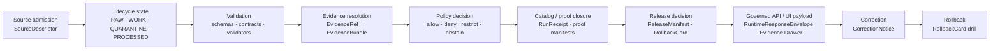

<!-- [KFM_META_BLOCK_V2]
doc_id: kfm://doc/tests-readme
title: tests/
type: standard
version: v1.1
status: draft; canonical-test-root; refreshed-from-uploaded-markdown; PROPOSED / NEEDS VERIFICATION for runners and CI
owners: KFM QA stewards · CODEOWNERS (TBD)
created: 2026-05-11
updated: 2026-07-07
policy_label: public
related:
  - directory-rules.md
  - KFM_Unified_Implementation_Architecture_Build_Manual.pdf
  - KFM_Whole_UI_Governed_AI_Expansion_Report.pdf
  - kfm_encyclopedia.pdf
  - fixtures/README.md
  - tests/fixtures/README.md
  - tests/invalid/README.md
  - tests/runtime_proof/README.md
  - tests/source/README.md
  - tests/valid/README.md
  - tests/validators/README.md
tags: [kfm, tests, governance, trust-spine, fixtures, validators, runtime-proof, release-gates, fail-closed]
notes:
  - "v1.1 refresh uses the uploaded tests/ markdown as the baseline and updates it for repo-visible README lanes created or verified through 2026-07-07."
  - "Doctrine remains CONFIRMED at the level stated in KFM operating documents; executable test inventory, runner, CI workflows, coverage, and pass rates remain NEEDS VERIFICATION."
  - "Authority class: canonical. Tests prove enforceability and feed gates; they do not become schemas, contracts, policies, registries, receipts, proofs, release decisions, fixtures, or production code."
[/KFM_META_BLOCK_V2] -->

<a id="tests"></a>

# `tests/`

> Enforceability proof for the KFM trust spine — from source admission through release, correction, and rollback.

<p>
  
  
  
  
  
  
</p>

| Status | Owners | Last reviewed |
|---|---|---|
| Draft · doctrine CONFIRMED · runner/CI/pass rates NEEDS VERIFICATION | KFM QA stewards · `CODEOWNERS` *(TBD)* | 2026-07-07 |

---

## Mini-TOC

- [1. Purpose](#1-purpose)
- [2. Authority level](#2-authority-level)
- [3. Status](#3-status)
- [4. Scope and repo fit](#4-scope-and-repo-fit)
- [5. What belongs here](#5-what-belongs-here)
- [6. What does not belong here](#6-what-does-not-belong-here)
- [7. Directory tree and lane posture](#7-directory-tree-and-lane-posture)
- [8. The trust-spine test flow](#8-the-trust-spine-test-flow)
- [9. Test pyramid and required classes](#9-test-pyramid-and-required-classes)
- [10. Fixture rule and fixture homes](#10-fixture-rule-and-fixture-homes)
- [11. Quickstart and usage](#11-quickstart-and-usage)
- [12. Validation posture](#12-validation-posture)
- [13. Review burden](#13-review-burden)
- [14. Related folders](#14-related-folders)
- [15. ADRs and open verification](#15-adrs-and-open-verification)
- [16. FAQ](#16-faq)
- [17. Last reviewed](#17-last-reviewed)

---

## 1. Purpose

`tests/` exists to **prove the doctrine is enforceable** — not merely to prove code runs. A passing suite must demonstrate that controlled inputs move through source admission, lifecycle state, validation, evidence resolution, policy decision, catalog/proof closure, release decision, governed API/UI payload, correction, and rollback **without crossing forbidden boundaries**.

This is the canonical home for KFM enforceability evidence. A green test run is the operational form of the project invariants, but only when it exercises the trust spine rather than isolated local behavior.

> [!IMPORTANT]
> A passing suite that does **not** exercise the trust spine is not sufficient. Tests here must demonstrate boundary discipline — not just functional correctness.

---

## 2. Authority level

**Canonical.** `tests/` is a top-level responsibility root under the KFM directory contract.

| Property | Value |
|---|---|
| Class | Canonical |
| Pairs with | `fixtures/` and/or `tests/fixtures/` with the split documented in §10 |
| Proves authority of | `contracts/`, `schemas/`, `policy/`, `release/`, governed API/UI, pipelines, validators, runtime proof, and selected domain lanes |
| Generated content allowed? | No — tests are authored, not emitted |
| Trust-bearing? | Yes — failure should block promotion |

---

## 3. Status

- **Doctrine — CONFIRMED.** The KFM testing strategy, trust-spine posture, and fixture rules are stated in governing doctrine and the uploaded baseline Markdown.
- **Repo documentation — PARTLY CONFIRMED.** Several child README lanes are now visible in the repository, including `tests/fixtures/`, `tests/invalid/`, `tests/pipelines/`, `tests/policy/`, `tests/release/`, `tests/runtime_proof/`, `tests/schemas/`, `tests/source/`, `tests/ui/`, `tests/valid/`, and `tests/validators/`.
- **Executable implementation — NEEDS VERIFICATION.** Test files, runners, framework choices, CI workflows, coverage, and pass rates are not proven by README presence.

> [!NOTE]
> Statements about what tests **must prove** are doctrine. Statements about which tests currently execute remain NEEDS VERIFICATION until inspected through actual files, manifests, commands, CI runs, and logs.

---

## 4. Scope and repo fit

`tests/` sits at the repo root alongside the canonical roots it validates. Its job is exclusively enforceability.

**Upstream of `tests/`** — what tests validate:

- `contracts/` — object meaning.
- `schemas/` — machine-checkable shape.
- `policy/` — admissibility, sensitivity, rights, access, and release policy.
- `apps/governed-api/` — finite-outcome envelopes and trust-membrane routes.
- `apps/explorer-web/` and UI packages — UI trust state and boundary discipline.
- `pipelines/` and `pipeline_specs/` — pipeline behavior and declarative specs.
- `tools/validators/` or accepted validator roots — validator behavior.
- `release/` — release manifests, corrections, withdrawals, supersessions, rollback cards, and gate records.
- `data/receipts/` and `data/proofs/` — auditable proof/receipt families, when tests assert them.

**Downstream of `tests/`** — where test outcomes may matter:

- CI workflows under `.github/workflows/` after workflow names and pass rates are verified.
- Promotion and release gates under `release/`.
- QA artifacts or report lanes when a test run emits governed reports.

> Reviewer's one-line check: **Does this test exercise the trust spine, or only a unit's local behavior?**

---

## 5. What belongs here

Accepted content under `tests/`:

- **Schema tests** — required fields, versions, refs, enums, and shape conformance for governed object families.
- **Contract tests** — object meaning matches the vocabulary in `contracts/` and the lifecycle role it plays.
- **Validator unit tests** — validators and validation helpers reject unsupported cases and accept supported cases.
- **Policy tests** — including negative cases such as unknown rights, unverified sensitivity, missing review, stale source, and denied access.
- **Source tests** — source admission, source-role anti-collapse, rights, sensitivity, cadence, citation, and source authority checks when this lane is accepted.
- **Evidence-resolution tests** — `EvidenceRef` resolves to a complete `EvidenceBundle` or the result is `ABSTAIN`.
- **Lifecycle-state tests** — `RAW -> WORK/QUARANTINE -> PROCESSED -> CATALOG/TRIPLET -> PUBLISHED` transitions are governed and no phase is skipped.
- **Receipt and proof tests** — `RunReceipt`, proof closure, integrity manifests, and receipt/proof separation.
- **Release tests** — `ReleaseManifest`, correction, rollback, withdrawal, supersession, and promotion-decision gate checks.
- **Governed API envelope tests** — finite `RuntimeResponseEnvelope` values: `ANSWER`, `ABSTAIN`, `DENY`, `ERROR`.
- **UI trust-state tests** — Evidence Drawer, Focus Mode, layer catalog, caveats, policy denial, accessibility, correction, and rollback visibility.
- **End-to-end tests** — smoke, navigation, negative behavior, trust-state, and accessibility paths.
- **Runtime-proof tests** — finite outcome and abstain proof under `tests/runtime_proof/`.
- **Domain-specific tests** — under `tests/domains/<domain>/`; the domain is a segment, not a root.
- **Invalid and valid compatibility tests** — only if retained as cross-cutting lanes; prefer specific homes when ownership is clear.

---

## 6. What does not belong here

> [!WARNING]
> The wrong-place list is as important as the right-place list. Misplacement here causes silent authority drift.

- Production code or implementation shortcuts.
- Real sensitive source material or exact protected locations; sensitive lanes use public-safe transformed fixtures only.
- Live network calls or live source credentials in the default suite.
- A second schema, policy, contract, source-registry, proof, receipt, fixture, release, or data home.
- Trust-bearing receipts, proofs, release decisions, or publication records.
- Generated build artifacts, screenshots, public exports, tiles, or dashboards unless a governed artifact lane explicitly owns them.
- Domain folders as root-level test peers. Domain test ownership is `tests/domains/<domain>/`.
- Direct model output treated as test truth.

---

## 7. Directory tree and lane posture

> **Mixed status.** Some child README lanes have been created or verified, but executable test depth remains NEEDS VERIFICATION unless backed by actual test files and runs.

```text
tests/
|-- README.md                  # this file
|-- contracts/                 # object-meaning tests
|-- schemas/                   # machine-shape tests
|-- policy/                    # admissibility / release policy tests
|-- validators/                # validator unit tests
|-- pipelines/                 # executable pipeline behavior tests
|-- api/                       # governed-API envelope and route tests
|-- ui/                        # UI trust-state component tests
|-- e2e/                       # end-to-end shell, navigation, negative behavior, a11y
|-- release/                   # release, correction, rollback, and promotion-gate tests
|-- runtime_proof/             # finite-outcome and abstain proof
|-- fixtures/                  # optional unit-test-scoped fixtures
|-- invalid/                   # cross-cutting fail-closed tests, if retained
|-- valid/                     # cross-cutting positive-path tests, if retained
|-- source/                    # source-admission/source-role tests, if retained
`-- domains/                   # domain-specific tests
    |-- hydrology/
    |-- people/
    |-- fauna/
    `-- ...
```

### 7.1 Lane posture index

| Lane | Intended role | Placement posture |
|---|---|---|
| `tests/contracts/` | Object meaning tests | CONFIRMED by root doctrine; executable depth NEEDS VERIFICATION. |
| `tests/schemas/` | Machine-shape tests | CONFIRMED by root doctrine; executable depth NEEDS VERIFICATION. |
| `tests/policy/` | Policy and fail-closed gate tests | CONFIRMED by root doctrine; executable depth NEEDS VERIFICATION. |
| `tests/validators/` | Validator unit tests | CONFIRMED by root doctrine; executable depth NEEDS VERIFICATION. |
| `tests/pipelines/` | Pipeline behavior tests | CONFIRMED by root doctrine; executable depth NEEDS VERIFICATION. |
| `tests/api/` | Governed API envelope tests | CONFIRMED by root doctrine; executable depth NEEDS VERIFICATION. |
| `tests/ui/` | UI trust-state component tests | CONFIRMED by root doctrine; executable depth NEEDS VERIFICATION. |
| `tests/e2e/` | End-to-end smoke, negative behavior, and accessibility | CONFIRMED by root doctrine; executable depth NEEDS VERIFICATION. |
| `tests/release/` | Release, correction, rollback, and promotion-gate tests | Added to align tree with accepted release-test class; executable depth NEEDS VERIFICATION. |
| `tests/runtime_proof/` | Finite outcome and abstain proof | CONFIRMED by root doctrine; executable depth NEEDS VERIFICATION. |
| `tests/fixtures/` | Unit-test-scoped fixtures | Optional by doctrine; README lane exists; payload inventory NEEDS VERIFICATION. |
| `tests/invalid/` | Cross-cutting fail-closed tests | Compatibility/utility lane; executable depth NEEDS VERIFICATION. |
| `tests/valid/` | Cross-cutting positive-path tests | Compatibility lane; not in original proposed tree; placement NEEDS VERIFICATION. |
| `tests/source/` | Source-admission/source-role tests | Compatibility lane; not in original proposed tree; placement NEEDS VERIFICATION. |
| `tests/domains/<domain>/` | Domain-owned tests | CONFIRMED by root doctrine; child depth varies by domain. |

---

## 8. The trust-spine test flow

A passing run should walk this spine. Each gate should have positive, invalid, denied, abstain/error, correction, and rollback coverage where material.


```mermaid
flowchart LR
    A["Source admission<br/>SourceDescriptor"] --> B["Lifecycle state<br/>RAW · WORK · QUARANTINE · PROCESSED"]
    B --> C["Validation<br/>schemas · contracts · validators"]
    C --> D["Evidence resolution<br/>EvidenceRef → EvidenceBundle"]
    D --> E["Policy decision<br/>allow · deny · restrict · abstain"]
    E --> F["Catalog / proof closure<br/>RunReceipt · proof manifests"]
    F --> G["Release decision<br/>ReleaseManifest · RollbackCard"]
    G --> H["Governed API / UI payload<br/>RuntimeResponseEnvelope · Evidence Drawer"]
    H --> I["Correction<br/>CorrectionNotice"]
    I --> J["Rollback<br/>RollbackCard drill"]
```

> [!IMPORTANT]
> No test path may bypass these gates by reading directly from RAW, WORK, QUARANTINE, candidate, canonical, or internal stores; calling model runtime directly; or short-circuiting policy. Boundary crossings are failures, not warnings.

[Back to top](#tests)

---

## 9. Test pyramid and required classes

### 9.1 Pyramid

Start at the base. Higher layers depend on lower layers being green.

1. Deterministic, no-network fixture tests.
2. Schema and contract tests.
3. Validator unit tests.
4. Policy negative tests.
5. Evidence-resolution tests.
6. Lifecycle-state tests.
7. Receipt and proof tests.
8. Release-manifest and rollback tests.
9. Governed API envelope tests.
10. UI trust-state tests.
11. End-to-end smoke and accessibility.
12. Live-source or runtime tests — gated, never default.

### 9.2 Required test classes

| # | Class | Example assertion | Default status |
|---|---|---|---|
| 1 | Schema test | Required fields and versions are present. | PROPOSED |
| 2 | Contract test | Object meaning matches vocabulary and lifecycle role. | PROPOSED |
| 3 | Source-role test | A source is not used outside its authority. | PROPOSED |
| 4 | Evidence test | `EvidenceRef` resolves or the answer abstains. | PROPOSED |
| 5 | Policy test | Unknown rights or sensitivity denies release. | PROPOSED |
| 6 | Lifecycle test | No phase is skipped; no public read of pre-PUBLISHED state. | PROPOSED |
| 7 | Receipt/proof test | `RunReceipt` and proof closure match what ran. | PROPOSED |
| 8 | Release test | Manifest carries proof, correction path, rollback target. | PROPOSED |
| 9 | Governed API envelope test | Outcomes are finite: `ANSWER`, `ABSTAIN`, `DENY`, `ERROR`. | PROPOSED |
| 10 | UI trust test | Evidence Drawer renders state and negative outcomes. | PROPOSED |
| 11 | AI boundary test | MockAdapter cannot answer without admissible evidence. | PROPOSED |
| 12 | Rollback drill | A dry-run release can be reversed via `RollbackCard`. | PROPOSED |
| 13 | Non-regression test | Prior lineage and aliases are preserved across rewrites. | PROPOSED |

### 9.3 Forbidden-boundary assertions

These are not optional:

- No browser fetch of RAW, WORK, QUARANTINE, candidate, or canonical internal stores.
- No direct model-client call from the frontend.
- No tile, style, sprite, or glyph load that is not listed in a release manifest.
- Exact sensitive geometry fixtures deny before tile build or public release.
- No public path through admin-only surfaces.

[Back to top](#tests)

---

## 10. Fixture rule and fixture homes

### 10.1 Fixture rule

Every major object family should have coverage for:

| Fixture / case family | Purpose |
|---|---|
| Valid | Proves the positive path for a specific gate. |
| Invalid | Proves malformed or unsupported shape/meaning fails. |
| Denied | Proves policy refusal is visible and fail-closed. |
| Abstention / error | Proves unsupported evidence or runtime failure does not invent truth. |
| Rollback / correction | Proves correction and rollback posture remains auditable. |

Sensitive lanes use public-safe transformed fixtures only.

### 10.2 Two homes — disambiguated

| Home | Purpose | Status |
|---|---|---|
| `tests/fixtures/` | Unit-test-scoped fixtures owned by a particular test directory. | CONFIRMED README lane; payload inventory NEEDS VERIFICATION. |
| `fixtures/` | Cross-cutting golden, valid, invalid, and synthetic fixtures shared across test areas and pipelines. | CONFIRMED root exists from prior work; full inventory NEEDS VERIFICATION. |

These homes are allowed only when their READMEs keep the split clear. Do not create competing fixture authorities.

### 10.3 Sensitive-fixture safeguards

- No real exact protected locations, living-person identifiers, genetic material, infrastructure-sensitive detail, or archaeology-sensitive geometry.
- Sensitive examples carry a public-safe transform or deny/withhold posture.
- Negative fixtures that must deny should make the expected denial explicit.

[Back to top](#tests)

---

## 11. Quickstart and usage

> [!CAUTION]
> Commands below are placeholders until the actual runner, package manager, and CI conventions are verified.

```bash
: "PROPOSED / NEEDS VERIFICATION"
pytest tests

: "Examples once lanes are verified"
pytest tests/schemas
pytest tests/contracts
pytest tests/policy
pytest tests/validators
pytest tests/pipelines
pytest tests/api
pytest tests/ui
pytest tests/release
pytest tests/runtime_proof
```

Default execution must be deterministic and offline. Any tier that requires network access must be gated by an explicit flag and excluded from default test targets.

---

## 12. Validation posture

Items below remain NEEDS VERIFICATION until backed by repo files, CI runs, logs, or release gate evidence.

- CI workflows and job names.
- Test runner and package manager.
- Fixture discovery convention.
- Schema and contract validator invocation.
- Policy runtime invocation.
- Release dry-run and rollback-drill receipt generation.
- Static boundary scan for forbidden imports or direct store reads.
- Coverage thresholds and pass rates.

> [!WARNING]
> Validation that runs only in CI is not enough. The same checks should be runnable locally with comparable outcomes. Reproducibility is part of the trust spine.

---

## 13. Review burden

| Change type | Required reviewers | Notes |
|---|---|---|
| New test directory | QA steward · directory steward · CODEOWNERS *(TBD)* | Apply directory placement review. |
| New fixture under `tests/fixtures/` or `fixtures/` | QA steward · subsystem owner | Include expected outcome where applicable. |
| Sensitive-lane fixture | QA steward · security/sensitivity steward · domain steward | Must be public-safe transformed, generalized, denied, or withheld. |
| Policy negative test | QA steward · policy steward | Must demonstrate fail-closed behavior. |
| Release / rollback test | QA steward · release steward | Must reference release and rollback posture. |
| Removing a test | QA steward · subsystem owner · directory steward | Removing trust-spine coverage requires explicit review. |

---

## 14. Related folders

| Folder | Relationship to `tests/` |
|---|---|
| `contracts/` | Object meaning that contract tests assert against. |
| `schemas/` | Machine shape that schema tests assert against. |
| `policy/` | Admissibility policy exercised by policy tests. |
| `fixtures/` | Cross-cutting fixtures; separated from `tests/fixtures/`. |
| `tools/validators/` | Validators whose units are tested here, when present. |
| `pipelines/` and `pipeline_specs/` | Pipeline behavior and specs tested by pipeline lanes. |
| `apps/governed-api/` | Trust membrane exercised by API and runtime-proof tests. |
| `apps/explorer-web/` | UI surface exercised by UI and e2e tests. |
| `release/` | Release decisions, manifests, corrections, and rollback cards exercised by release tests. |
| `data/receipts/` and `data/proofs/` | Receipts and proofs whose closure may be asserted by tests. |
| `docs/` | Doctrine, ADRs, runbooks, and source standards that govern this folder. |

---

## 15. ADRs and open verification

| Item | Topic | Status |
|---|---|---|
| ADR-0001 or successor | Default schema home: `schemas/contracts/v1/...` | NEEDS VERIFICATION by path. |
| Fixture-home ADR | Resolves `tests/fixtures/` vs `fixtures/` as permanent split or migration. | NEEDS VERIFICATION. |
| Runtime-proof scope ADR | Defines what `tests/runtime_proof/` must cover. | NEEDS VERIFICATION. |
| Source/valid compatibility lanes | Decides whether `tests/source/` and `tests/valid/` remain or redirect to specific lanes. | NEEDS VERIFICATION. |
| CI owner | Defines required workflows and local parity commands. | NEEDS VERIFICATION. |

---

## 16. FAQ

<details>
<summary><strong>Do unit tests that pass count as proof?</strong></summary>

Not by themselves. A green unit suite is necessary but not sufficient. The trust spine must be exercised by the broader suite for a release gate to rely on it.

</details>

<details>
<summary><strong>Can a test read directly from RAW or WORK?</strong></summary>

No for normal public/trust-spine tests. Tests should consume governed fixtures, governed APIs, or explicit test harness payloads. Direct reads of internal lifecycle stores as a public path are boundary failures.

</details>

<details>
<summary><strong>Where do fixtures for sensitive domains live?</strong></summary>

Under `tests/fixtures/<area>/` or `fixtures/domains/<domain>/`, always as public-safe transformed fixtures or deny/withhold examples.

</details>

<details>
<summary><strong>What does a finite-outcome test prove?</strong></summary>

It proves the governed runtime returns one of `ANSWER`, `ABSTAIN`, `DENY`, or `ERROR` with visible reason posture. It does not prove truth or release unless evidence, policy, review, release, correction, and rollback gates are also modeled.

</details>

<details>
<summary><strong>Is live network access ever allowed in tests?</strong></summary>

Only behind explicit flags and only in designated live-source/runtime tiers. The default target must be deterministic and offline.

</details>

---

## 17. Last reviewed

**2026-07-07.** Re-review triggers:

- the mounted repo enables verification of test files, runners, or CI pass rates;
- an ADR resolves fixture-home, runtime-proof, source-test, or valid-test placement;
- test-class lists or forbidden-boundary assertions change;
- release gates start consuming test receipts or QA reports;
- any sensitive fixture handling rule changes.

Older than 6 months -> flag for review.

---

*Last updated: 2026-07-07 · Status: draft · Authority: canonical · [Back to top](#tests)*
