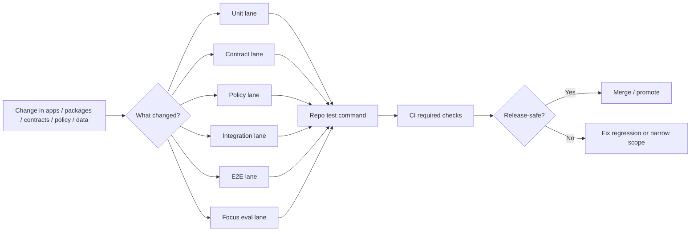

<!-- [KFM_META_BLOCK_V2]
doc_id: kfm://doc/1b0a7d08-150f-4fe9-8cf2-e18a3b1af22d
title: tests/README.md
type: standard
version: v1
status: draft
owners: @bartytime4life
created: 2026-03-07
updated: 2026-03-07
policy_label: public
related: [../README.md, ../.github/CODEOWNERS, ../policy/, ../contracts/, ../apps/, ../data/]
tags: [kfm, tests, ci, governance]
notes: [Directory README for the governed testing surface.]
[/KFM_META_BLOCK_V2] -->

# tests
Governed verification surface for KFM contracts, policy, evidence resolution, data flows, and user-facing behavior.


## Quick jump
[Impact](#impact) · [Scope](#scope) · [Repo fit](#repo-fit) · [Accepted inputs](#accepted-inputs) · [Exclusions](#exclusions) · [Directory tree](#directory-tree) · [Quickstart](#quickstart) · [Usage](#usage) · [Diagram](#diagram) · [Test lanes](#test-lanes) · [Definition of done](#definition-of-done) · [Task list](#task-list) · [FAQ](#faq) · [Appendix](#appendix)

## Impact

| Field | Value |
|---|---|
| Status | draft |
| Owners | `@bartytime4life` via `../.github/CODEOWNERS`; replace with team handles if ownership changes |
| Policy label | public |
| Repo path | `tests/README.md` |
| Quick links | [Root README](../README.md) · [CODEOWNERS](../.github/CODEOWNERS) · [Policy](../policy/) · [Contracts](../contracts/) |
| Current public-branch snapshot | `tests/` exists and currently contains this README only |

## Scope

| Status | Statement |
|---|---|
| CONFIRMED | `tests/` is the repo-level home for verification work. |
| CONFIRMED | KFM expects test coverage for unit, integration, end-to-end, policy, and data-pipeline behavior. |
| CONFIRMED | KFM work-package acceptance explicitly depends on golden tests, fixture tests, integration tests, contract tests, UI e2e tests, and Focus evaluation-harness tests. |
| PROPOSED | This directory should be organized by verification lane rather than by individual app ownership so policy-significant coverage remains discoverable. |
| PROPOSED | Tests here should prefer deterministic fixtures, inspectable failures, and CI-safe execution over cleverness or hidden environment coupling. |
| UNKNOWN | Exact merge-blocking workflow names, runner commands, and lane-specific tooling on the target branch must be verified before they are documented here as branch fact. |

## Repo fit
- **Path:** `tests/README.md`
- **Upstream:** [root repo posture](../README.md), `../.github/workflows/`, `../.github/CODEOWNERS`, public contracts in `../contracts/`, policy packs in `../policy/`, and runnable surfaces in `../apps/` and `../packages/`.
- **Downstream:** future suite directories such as `tests/unit/`, `tests/integration/`, `tests/contract/`, `tests/policy/`, `tests/e2e/`, `tests/eval/`, `tests/fixtures/`, and test helper packages if and when they are created.
- **Use this file for:** explaining what belongs in the testing surface, how to choose the right verification lane, how to keep fixtures deterministic, and what minimum gates a policy-significant change must satisfy.
- **Do not use this file for:** authoritative workflow configuration, runner implementation details that belong in scripts or CI configs, generated receipts, large fixture payloads, or app-specific testing instructions that belong beside the implementation they exercise.

## Accepted inputs

This directory and README may contain or describe:

- unit tests for shared functions, validators, adapters, and deterministic transforms
- integration tests for governed API boundaries, evidence resolution, catalog reads, and store interactions
- contract tests for schemas, routes, and output guarantees
- policy fixture tests proving default-deny, redaction, and role-based access behavior
- end-to-end tests for public trust surfaces such as Map Explorer, Evidence Drawer, and Story publication
- evaluation harness assets for Focus Mode golden queries and cite-or-abstain regression checks
- small deterministic fixtures, mocks, factories, and helper utilities that are safe for CI and code review

## Exclusions

This directory must not become a dumping ground for:

- production data extracts, restricted datasets, or anything that crosses policy boundaries without explicit approval
- large generated artifacts, screenshots, videos, or binary blobs that belong in release artifacts or external test fixtures storage
- authoritative schemas that belong in `../contracts/` or `../schemas/`
- policy bundles that belong in `../policy/`
- application-specific runbooks that belong in `../docs/` or the owning app/package directory
- secrets, tokens, credentials, or environment-specific values
- flaky network-dependent tests without an explicit quarantine strategy and rationale

## Directory tree

### Current public `main` snapshot

```text
tests/
└── README.md
```

### Target layout (proposed)

```text
tests/
├── README.md
├── unit/          # deterministic function- and module-level tests
├── integration/   # cross-boundary tests for services, stores, and resolvers
├── contract/      # schema and API/output guarantees
├── policy/        # Rego/fixture/default-deny/redaction tests
├── e2e/           # browser and journey tests for trust surfaces
├── eval/          # Focus Mode golden queries and regression harnesses
├── fixtures/      # minimal reviewable test data
└── helpers/       # shared test factories, matchers, and harness utilities
```

> Keep the current tree honest. Create proposed subdirectories only when they first receive real reviewed content.

[Back to top](#tests)

## Quickstart

### Verification-first snapshot

Use this when you first clone the repo or when you need to re-ground assumptions in the current branch.

```bash
git clone https://github.com/bartytime4life/Kansas-Frontier-Matrix.git
cd Kansas-Frontier-Matrix
git rev-parse HEAD
find tests -maxdepth 4 | sort
grep -RIn "temporal_window\|scenario_id\|EvidenceRef\|EvidenceBundle\|policy_label" tests apps packages contracts docs || true
grep -RIn "^name:" .github/workflows || true
grep -RIn "concurrency:\|timeout-minutes:\|workflow_call:" .github/workflows || true
```

### Minimal contributor path

These commands are intentionally illustrative until the target branch test runners are verified.

```bash
make bootstrap
make validate-schemas
make test
```

### First-pass contribution workflow

```bash
# 1) identify the smallest affected lane
# 2) add or update deterministic fixtures
# 3) write the failing test first where practical
# 4) run the narrowest lane locally
# 5) run the repo-level test command
# 6) document any new lane, helper, or fixture rule in this README
```

## Usage

### Choose the smallest lane that proves the claim

When you change code, do not start by asking “what can I test?” Start by asking “what contract or trust property changed?” Then pick the narrowest lane that proves it.

| Change type | Preferred lane | Add another lane when… |
|---|---|---|
| Pure transform or validator change | `unit/` | the change crosses a contract or storage boundary |
| Schema, route, or serialized output change | `contract/` | the change is policy-significant or user-visible |
| Evidence resolver, catalog, or store interaction | `integration/` | the failure mode would be visible in UI or Focus Mode |
| Authorization, redaction, or rights behavior | `policy/` | the behavior is also surfaced to users and needs e2e proof |
| Map Explorer / Story / Evidence Drawer behavior | `e2e/` | citations, policy, or backend orchestration changed materially |
| Focus Mode prompt-orchestration or retrieval behavior | `eval/` | cite-or-abstain, golden-query drift, or policy leakage is at stake |

### Naming conventions

- Prefer `*.spec.*` or `*.test.*` naming consistently within each lane.
- Name fixtures by domain and scenario, not by author initials.
- Encode policy significance in the test name when relevant, e.g. `denies_restricted_asset_without_role`.
- Golden-query files should encode the user intent and expected posture, e.g. `focus_counties_1854_cited.json`.

### Fixture rules

- Fixtures must be deterministic, minimal, and reviewable in plain text whenever possible.
- Prefer synthetic data over copied production data.
- Keep every fixture tied to one behavior or one small scenario.
- If a fixture requires redaction, say so in a nearby README or inline comment.

[Back to top](#tests)

## Diagram


```mermaid
flowchart LR
    A[Change in apps / packages / contracts / policy / data] --> B{What changed?}
    B --> U[Unit lane]
    B --> C[Contract lane]
    B --> P[Policy lane]
    B --> I[Integration lane]
    B --> E[E2E lane]
    B --> F[Focus eval lane]
    U --> G[Repo test command]
    C --> G
    P --> G
    I --> G
    E --> G
    F --> G
    G --> H[CI required checks]
    H --> R{Release-safe?}
    R -->|Yes| J[Merge / promote]
    R -->|No| K[Fix regression or narrow scope]
```

## Test lanes

| Lane | Purpose | Typical artifacts | Gate it protects |
|---|---|---|---|
| Unit | Local correctness of small deterministic behavior | functions, validators, adapters, hash stability checks | implementation correctness |
| Contract | Public shape stability | schema fixtures, route output snapshots, vocabulary checks | interface trust |
| Policy | Default-deny and redaction proof | policy fixtures, allow/deny cases, role matrices | trust membrane |
| Integration | Cross-component behavior | resolver tests, catalog reads, store adapters, pipeline joins | end-to-end correctness below UI |
| E2E | User-visible trust surfaces | browser journeys, Evidence Drawer checks, publish flow checks | UX trust promises |
| Eval | Focus Mode cite-or-abstain regression control | golden queries, expected citations, abstention cases | anti-hallucination posture |

### KFM-specific examples to anchor this directory

| KFM work package / surface | Expected lane |
|---|---|
| Spec hashing stability | golden tests |
| Catalog validators and link checking | contract tests |
| Policy pack default-deny and redaction | fixture tests |
| Evidence resolver service | integration tests |
| Dataset registry and discovery endpoints | contract + integration tests |
| Map Explorer baseline and Evidence Drawer | e2e tests |
| Story publish gate with citations | e2e + contract tests |
| Focus Mode golden queries | evaluation harness tests |

## Definition of done

A change touching this directory or depending on this directory is not done until:

- [ ] the affected contract, policy, or behavior has at least one direct test in the smallest credible lane
- [ ] fixtures are deterministic, minimal, and rights-safe
- [ ] failures name the broken trust surface or contract clearly enough for triage
- [ ] policy-significant behavior has explicit deny-path coverage, not only success-path coverage
- [ ] EvidenceRef / EvidenceBundle paths are tested when user-visible evidence behavior changes
- [ ] any new lane or helper is documented here and linked from the owning surface if needed
- [ ] the repo-level test command passes locally or the change documents why local parity is not possible

## Task list

- [ ] Verify the exact merge-blocking workflow names under `../.github/workflows/` and replace illustrative command language with branch truth.
- [ ] Add the first committed lane subdirectories only when reviewed content lands.
- [ ] Add at least one smoke e2e covering Evidence Drawer license/version visibility.
- [ ] Add Focus Mode golden-query fixtures for one cite success, one abstention, and one policy-denied case.
- [ ] Document quarantine rules for flaky or environment-coupled tests instead of silently disabling them.
- [ ] Keep this README aligned with `../README.md` if the repo-level test posture changes.

## FAQ

### Why keep tests at the repo root if apps also need local tests?
Use the repo-root `tests/` directory for cross-cutting, policy-significant, or governance-relevant verification. App-local tests that only exercise one component may still live beside that component when that improves maintainability.

### Should every UI change get an e2e test?
No. Reserve e2e tests for trust-significant user journeys, public regressions, and workflows that cannot be proven credibly below the UI layer.

### Are snapshots allowed?
Yes, if they protect a meaningful contract and remain easy to review. Avoid snapshots that merely freeze incidental formatting.

### What is the most important anti-pattern here?
Tests that pass while the trust promise is broken—for example, a successful answer without verified citations, or a green path that never exercises policy denial.

## Appendix

<details>
<summary>Suggested review checklist for pull requests that touch tests</summary>

- Does the test prove a user-visible or contract-visible claim?
- Is the fixture the smallest thing that could work?
- Could the same behavior be proven at a lower layer more cheaply?
- If the change is policy-significant, where is the deny-path assertion?
- If the change is Focus-related, where is the cite-or-abstain expectation?
- If a new helper was added, is it hiding complexity or clarifying it?

</details>

<details>
<summary>What belongs somewhere else</summary>

- Put reusable validators and production-side helpers in `../packages/` or `../tools/`, not here.
- Put public schemas in `../contracts/` or `../schemas/`, not here.
- Put long-form debugging or incident procedures in `../docs/`, not here.
- Put generated run receipts and release artifacts in their governed release locations, not here.

</details>

[Back to top](#tests)