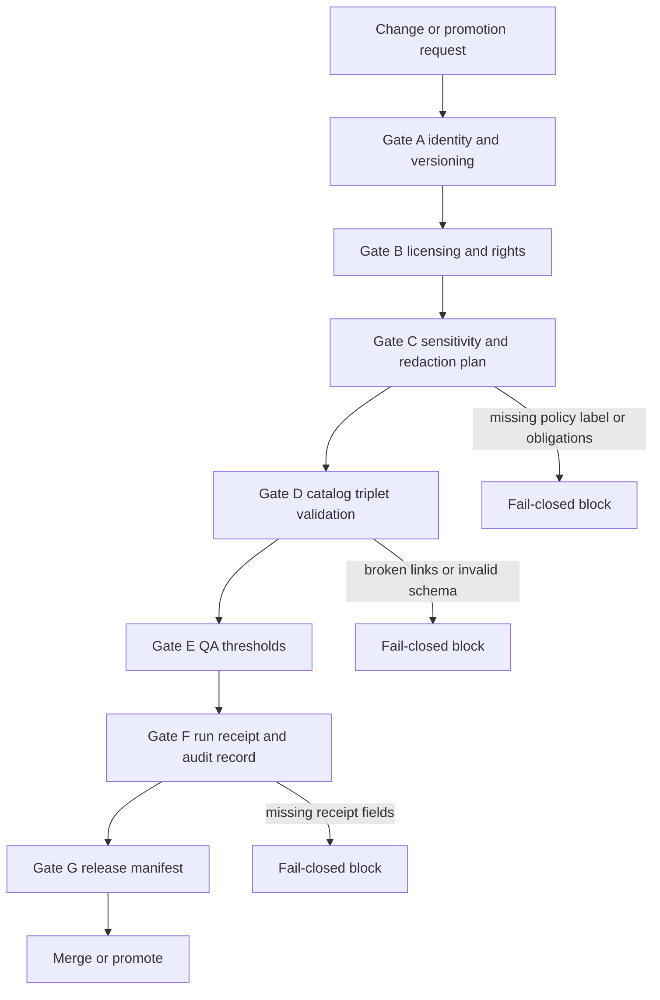

<!-- [KFM_META_BLOCK_V2]
doc_id: kfm://doc/209b3e45-0223-4c7c-a0ee-aff3a8482f2c
title: tests/README.md
type: standard
version: v1
status: draft
owners: kfm-platform
created: 2026-03-03
updated: 2026-03-03
policy_label: public
related:
  - ../README.md
  - ../docs/
  - ../policy/
  - ../contracts/
tags: [kfm, tests]
notes:
  - Defines the governed testing taxonomy and how test suites map to Promotion Contract gates.
  - Written to be fail-closed: unknown repo specifics are explicitly flagged as Unknown with verification steps.
[/KFM_META_BLOCK_V2] -->

# tests/ — governed test suites and fixtures

> **Purpose (Proposed):** Make KFM trust enforceable by automating **policy**, **contracts**, and **end-to-end evidence resolution** checks in CI and locally, so merges and promotions are blocked when governance invariants regress.


## Quick navigation

- [Evidence status legend](#evidence-status-legend)
- [Confirmed anchors from KFM design docs](#confirmed-anchors-from-kfm-design-docs)
- [Quickstart](#quickstart)
- [Test taxonomy](#test-taxonomy)
- [Promotion Contract mapping](#promotion-contract-mapping)
- [Directory layout](#directory-layout)
- [Fixtures and test data rules](#fixtures-and-test-data-rules)
- [Adding a new test](#adding-a-new-test)
- [Unknowns and smallest verification steps](#unknowns-and-smallest-verification-steps)

---

## Evidence status legend

- **Confirmed:** Supported by existing KFM design documentation (cited in the PR / change description when used).
- **Proposed:** Recommended convention for this repo; adopt or adjust via small PRs.
- **Unknown:** Not verified in the live repo; the smallest verification steps are listed.

> **Proposed:** If you add new behavior to tests or CI, update this README and mark new statements Confirmed/Proposed/Unknown.

[Back to top](#tests--governed-test-suites-and-fixtures)

---

## Confirmed anchors from KFM design docs

- **Confirmed (design intent):** `tests/` is the home for **unit**, **integration**, **e2e**, and **fixtures**.  
- **Confirmed (design intent):** Promotion to **PUBLISHED** is blocked unless **Promotion Contract gates A–G** are satisfied (identity/versioning, licensing, sensitivity/redaction, catalog triplet, QA thresholds, run receipt/audit record, release manifest).  
- **Confirmed (design intent):** “Citations” are **EvidenceRefs** that must resolve to an **EvidenceBundle** and be policy-allowed; otherwise the system narrows scope or abstains.  
- **Confirmed (design intent):** Policy-as-code must have **shared semantics** in CI and runtime (or at minimum shared fixtures and outcomes), otherwise CI guarantees are meaningless.  
- **Confirmed (design intent):** Focus Mode includes an **evaluation harness** with **golden queries** and should **block merges** on regressions.  
- **Confirmed (design intent):** Trust-membrane failures (policy bypass via direct DB/storage access) are mitigated via **network policies, reviews, and tests**.

[Back to top](#tests--governed-test-suites-and-fixtures)

---

## Quickstart

- **Unknown:** The repo’s actual test runner(s) and commands.
  - **Smallest verification steps (to make Confirmed):**
    1. Run `ls -la tests/` and `tree -L 3 tests/` to confirm structure.
    2. Inspect `.github/workflows/*` for required checks and exact commands.
    3. Inspect root build tooling (`Makefile`, `package.json`, `pyproject.toml`) to confirm runners.

- **Proposed:** Prefer a single “one-command” local entrypoint that matches CI.
  - Examples (pick what the repo actually uses):
    ```bash
    # Proposed: canonical local command
    make ci.test
    ```
    ```bash
    # Proposed: policy tests
    conftest test <some-json-or-yaml> -p policy/
    ```
    ```bash
    # Proposed: JS/TS tests
    pnpm test
    ```
    ```bash
    # Proposed: Python tests
    pytest
    ```

> **Proposed (fail-closed):** If local runs cannot faithfully reproduce CI (tooling drift), treat changes as **not promotable** until parity is restored.

[Back to top](#tests--governed-test-suites-and-fixtures)

---

## Test taxonomy

### 1) Unit tests

- **Proposed:** Fast, deterministic tests for pure functions, schema helpers, parsers, and “spec_hash” canonicalization.
- **Proposed:** No network. No filesystem writes outside temp dirs.

### 2) Contract tests

- **Confirmed (design intent):** Contracts include catalog surfaces (DCAT/STAC/PROV) and evidence resolution behaviors.  
- **Proposed:** Validate:
  - Schema conformance (DCAT, STAC, PROV, receipts).
  - Cross-link integrity (IDs, hrefs, EvidenceRefs resolvable).
  - Stable `spec_hash` behavior (golden tests).

### 3) Policy tests

- **Confirmed (design intent):** CI and runtime should share policy semantics (fixtures/outcomes).  
- **Proposed:** Use OPA/Rego policies with fixture-driven tests:
  - **allow/deny** outcomes
  - **obligations** (e.g., redaction required for non-public)
  - **default-deny** posture

### 4) Integration tests

- **Confirmed (design intent):** Evidence resolver requires integration tests (resolves refs; enforces policy; prevents restricted leakage).  
- **Proposed:** Spin minimal local services (or use in-process adapters) to validate:
  - EvidenceRef → EvidenceBundle resolution
  - Policy enforcement paths
  - “Fail-closed” behavior when citations cannot be verified

### 5) End-to-end (E2E) tests

- **Confirmed (design intent):** Map Explorer baseline includes E2E tests for UI behaviors around evidence and trust presentation.  
- **Proposed:** E2E scope:
  - Evidence Drawer opens from map interactions
  - License/version visibility
  - Keyboard navigation accessibility paths

### 6) Evaluation harness tests

- **Confirmed (design intent):** Focus Mode uses an evaluation harness with golden queries and blocks merge on regressions.  
- **Proposed:** Harness outputs should be treated as governed artifacts:
  - Store diffs and summaries in CI artifacts
  - Define regression budgets (string diff + citation resolution + policy outcomes)

[Back to top](#tests--governed-test-suites-and-fixtures)

---

## Promotion Contract mapping

> **Confirmed (design intent):** Promotion gates are automatable in CI and reviewed during steward sign-off; promotion is blocked unless minimum gates are met.


```mermaid
flowchart TB
  PR[Change or promotion request] --> A[Gate A identity and versioning]
  A --> B[Gate B licensing and rights]
  B --> C[Gate C sensitivity and redaction plan]
  C --> D[Gate D catalog triplet validation]
  D --> E[Gate E QA thresholds]
  E --> F[Gate F run receipt and audit record]
  F --> G[Gate G release manifest]
  G --> OK[Merge or promote]

  D -->|broken links or invalid schema| BLOCK1[Fail-closed block]
  C -->|missing policy label or obligations| BLOCK2[Fail-closed block]
  F -->|missing receipt fields| BLOCK3[Fail-closed block]
```

### Test matrix

| Status | Surface | What it proves | Typical location (Proposed) |
|---|---|---|---|
| **Confirmed** | Gate A — identity/versioning | `dataset_id`, `dataset_version_id`, deterministic `spec_hash`, artifact digests | `tests/contract/` |
| **Confirmed** | Gate D — catalogs | DCAT/STAC/PROV validate + cross-link; EvidenceRefs resolve | `tests/contract/` + `tests/integration/` |
| **Confirmed** | Gate C — sensitivity | Policy label present; redaction/generalization obligations enforced | `tests/policy/` + fixtures |
| **Confirmed** | Gate F — run receipts | Receipt completeness, hashes, and (if enabled) signature verification | `tests/contract/` + `tests/policy/` |
| **Proposed** | Gate E — QA thresholds | Domain-specific QA reports exist and thresholds met | `tests/integration/` |
| **Proposed** | Focus Mode eval harness | Golden queries stable; regressions block merge | `tests/eval/` |
| **Proposed** | Trust membrane invariant | UI cannot bypass PEP/API to DB/storage | `tests/integration/` + `tests/e2e/` |

[Back to top](#tests--governed-test-suites-and-fixtures)

---

## Directory layout

### Confirmed minimal intent

- **Confirmed (design intent):** `tests/` contains unit/integration/e2e tests and fixtures.

### Proposed concrete layout for this repo

```text
tests/
  README.md
  unit/                 # Proposed: pure unit tests
  contract/             # Proposed: schema + linkcheck + spec_hash golden tests
  policy/               # Proposed: Rego unit tests (Conftest) + fixtures
  integration/          # Proposed: evidence resolver + API integration tests
  e2e/                  # Proposed: UI E2E (Map Explorer, Story publish gate)
  eval/                 # Proposed: Focus Mode eval harness (golden queries)
  fixtures/             # Proposed: small synthetic inputs + golden outputs
```

> **Proposed:** Keep this layout stable so test paths become “retrieval anchors” for humans and automation.

[Back to top](#tests--governed-test-suites-and-fixtures)

---

## Fixtures and test data rules

- **Confirmed (design posture):** Default-deny and sensitive-data leakage prevention must be enforced.
- **Proposed (allowed in `tests/fixtures/`):**
  - Tiny, synthetic datasets
  - Redacted/generalized examples (where policy requires)
  - Golden JSON for schema validation (valid + invalid)
  - Golden EvidenceRefs and expected EvidenceBundle shapes (no restricted data)

- **Proposed (explicitly disallowed in `tests/`):**
  - Secrets, tokens, private keys
  - Large binaries or production datasets
  - Restricted/precise sensitive locations (unless explicitly approved and protected)
  - “Mystery fixtures” without provenance notes

- **Proposed:** Every fixture directory contains a small `README.md` describing:
  - what the fixture represents,
  - policy label expectations,
  - and the expected allow/deny outcome.

[Back to top](#tests--governed-test-suites-and-fixtures)

---

## Adding a new test

### Minimal, safe, additive workflow

1. **Proposed:** Add or update a fixture (smallest possible).
2. **Proposed:** Add the test alongside the fixture.
3. **Proposed:** Make the failure message actionable (what failed, where, how to reproduce).
4. **Proposed:** If a test encodes a governance rule, add/update the corresponding **policy fixture** so CI and runtime semantics stay aligned.

### Definition of done checklist

- [ ] **Proposed:** Test is deterministic (no network unless explicitly stubbed/recorded).
- [ ] **Proposed:** Test runs in CI and locally with the same command(s).
- [ ] **Proposed:** If policy-related, includes allow + deny fixtures.
- [ ] **Proposed:** No sensitive or restricted data added.
- [ ] **Proposed:** Update this README if it changes taxonomy, commands, or directory layout.

[Back to top](#tests--governed-test-suites-and-fixtures)

---

## Unknowns and smallest verification steps

- **Unknown:** Which runners exist (pytest, vitest/jest, playwright/cypress, etc.).
  - **Verify:** inspect root configs (`pyproject.toml`, `package.json`) and CI workflows.

- **Unknown:** Whether Conftest/OPA is already wired as a required status check.
  - **Verify:** search CI workflow definitions for `conftest` and policy directories.

- **Unknown:** The exact contract schemas present (run_receipt schema versions, DCAT/STAC profiles).
  - **Verify:** list `contracts/` and run schema validators against example fixtures.

- **Unknown:** Where Focus Mode harness lives in the repo.
  - **Verify:** search for `tests/eval/` and “golden queries” strings.

> **Proposed:** Once verified, convert Unknown → Confirmed and add exact commands/paths (small PR, no rewrites).

[Back to top](#tests--governed-test-suites-and-fixtures)
