<div align="center">

# 🧪 Kansas Frontier Matrix — Tools Test Index (`/tools/tests/`)

**Scope:** Unit + integration coverage for utility scripts in `/tools/`  
to guarantee **reproducibility, provenance, and correctness** under MCP.

[](../../.github/workflows/tests.yml)
[](https://codecov.io/gh/bartytime4life/Kansas-Frontier-Matrix)
[](https://pre-commit.com/)
[](../../docs/)

</div>

---

## 📦 What’s Covered

| Tool | Unit | Integration | I/O Schema | CLI | Notes |
|---|:--:|:--:|:--:|:--:|---|
| `fetch_data.py` | ✅ | ✅ | ✅ (manifests) | ✅ | Mocks network (HTTP/REST/ArcGIS), writes to `data/raw/` (tmp) |
| `convert_gis.py` | ✅ | ✅ | — | ✅ | Vector→GeoJSON, Raster→COG; reprojection EPSG:4326 |
| `validate_stac.py` | ✅ | ✅ | ✅ (STAC 1.0) | ✅ | JSON Schema + STAC validation; fails on non-compliance |
| `checksum.py` | ✅ | — | — | ✅ | SHA-256 create/verify; tamper detection |
| `migrate_graph.py` | ✅ | ✅ | — | ✅ | Batched Cypher tx; alias de-dup; mocks Neo4j driver |
| `build_config.py` | ✅ | ✅ | ✅ (layers/app config) | ✅ | STAC→`web/config/*.json`; UI sync sanity checks |

> All tests are **deterministic**, use **tiny fixtures**, and log provenance.

---

## 📂 Layout

```text
tools/tests/
├── test_fetch_data.py
├── test_convert_gis.py
├── test_validate_stac.py
├── test_checksum.py
├── test_migrate_graph.py
├── test_build_config.py
├── conftest.py              # shared fixtures (tmp dirs, monkeypatch, sample env)
└── fixtures/
    ├── sources_min.json     # minimal data/sources manifest
    ├── tiny.geojson         # 2 features, WGS84
    ├── tiny.shp/.dbf/.prj   # micro shapefile set
    ├── tiny_dem.tif         # 10x10 DEM (generated in setup if missing)
    ├── stac_item_min.json   # minimal STAC Item
    └── layers_min.json      # tiny layers config expected by UI
````

---

## 🔁 Test Flow (Tools)

```mermaid
flowchart TD
  A([Unit: parsers · CLI · io]) --> B([Integration: tmp project · ETL paths])
  B --> C([Schema checks: STAC · JSON Schema])
  C --> D([Graph mocks: Cypher batches · de-dup])
  D --> E([Config build: layers/app json])
  E --> F([Coverage & CI reporting])

  classDef s fill:#d7ebff,stroke:#0078d4,color:#111;
  classDef v fill:#eafaf1,stroke:#1a7f37,color:#111;
  class A,B s; class C v; class D,E,F s;
```



---

## ▶️ Running Locally

From repo root:

```bash
# only tools tests
pytest tools/tests -v --cov=tools --cov-report=term-missing

# run a single case
pytest tools/tests/test_convert_gis.py::test_vector_to_geojson -q
```

Optional env (tests auto-fallback if unset):

```bash
export KFM_DATA_DIR="$(pwd)/.tmp-data"   # isolated tmp data dir
export KFM_STAC_DIR="$(pwd)/.tmp-stac"   # isolated tmp stac dir
```

---

## 🧩 Key Techniques

* **Network mocking:** `responses` (HTTP) / monkeypatch for ArcGIS REST calls
* **File isolation:** `tmp_path` fixture for read/write; no pollution of real `data/`
* **COG safety:** tiny raster fixtures or on-the-fly generation via `rasterio`
* **Neo4j isolation:** patch the driver/session; assert Cypher batches & params only
* **Schema checks:** jsonschema + pystac for STAC & config files
* **CLI contracts:** `--help` smoke tests, exit codes, and minimal I/O roundtrips

---

## 🧪 Example Patterns

**Mock a network fetch**

```python
import responses, json
from pathlib import Path

@responses.activate
def test_fetch_manifest(tmp_path):
    url = "https://example.org/data.tif"
    responses.add(responses.GET, url, body=b"FAKE", status=200)
    out = tmp_path / "data" / "raw"
    # function under test writes to out
    saved = fetch_file(url, out)  # ← your tool function
    assert saved.exists() and saved.read_bytes() == b"FAKE"
```

**Check a COG output**

```python
import rasterio

def test_raster_to_cog(tmp_path):
    src = make_tiny_dem(tmp_path)             # helper creates 10x10 tif
    dst = tmp_path / "out.tif"
    convert_to_cog(src, dst)                  # ← your tool function
    with rasterio.open(dst) as ds:
        assert ds.crs.to_epsg() == 4326
        assert ds.overviews(1)  # has internal overviews
```

**Validate STAC item**

```python
from jsonschema import validate
from tools.utils.schemas import STAC_ITEM_SCHEMA

def test_stac_item_min(fixtures_dir):
    item = (fixtures_dir / "stac_item_min.json").read_text()
    validate(instance=json.loads(item), schema=STAC_ITEM_SCHEMA)
```

---

## 🧭 Tips for Contributors

* Keep fixtures **tiny** (≤ a few KB); generate procedurally where possible.
* Use **stable random seeds** for any stochastic steps.
* Mark slow tests: `@pytest.mark.slow` (CI can skip or run nightly).
* Log decisions/oddities to [`../../docs/experiment.md`](../../docs/experiment.md).
* Keep CLI UX consistent: `-h/--help`, clear errors, non-zero exit codes on failure.

---

## 🔄 CI Integration

* **Workflow:** `tests.yml` runs tools tests as part of the matrix.
* **Artifacts:** schema/validation logs uploaded on failure.
* **Coverage:** included in global Codecov report.
* **Security:** CodeQL / Trivy run in parallel (no flaky network allowed in tests).

> If a test needs live network/data, provide a **mocked path** and add a **nightly** variant instead of blocking PRs.

---

<div align="center">

**Tools tests protect the glue.**
*If a helper script breaks, reproducibility breaks — test the helpers like production code.*

</div>
```
