<div align="center">

# 🧪 Kansas Frontier Matrix — **Tools Test Index**  
`tools/tests/`

**Unit · Integration · Schema Validation · Provenance Coverage**

[](../../.github/workflows/tests.yml)  
[](https://codecov.io/gh/bartytime4life/Kansas-Frontier-Matrix)  
[](https://pre-commit.com/)  
[](../../docs/)  
[](../../LICENSE)

</div>

---

```yaml
---
title: "KFM • Tools Test Index (tools/tests/)"
version: "v1.3.0"
last_updated: "2025-10-17"
owners: ["@kfm-engineering", "@kfm-ci", "@kfm-data"]
tags: ["testing","pytest","integration","stac","schema","mcp","ci"]
license: "MIT"
semantic_alignment:
  - STAC 1.0.0
  - JSON Schema Validation
  - OWL-Time (Temporal Metadata in Fixtures)
  - MCP-DL v6.3 Provenance Compliance
---
```

---

## 🧭 Overview

The `tools/tests/` suite validates **functional accuracy**, **schema compliance**, and **reproducibility** across the KFM toolchain.  
It covers **ETL utilities**, **schema validators**, and **graph integrations**, ensuring every component of the `/tools/` layer behaves deterministically and adheres to **MCP-DL v6.3** documentation-first standards.

**Mission:** *Guard the infrastructure of reproducibility — because every helper script supports the frontier’s integrity.*

**Core MCP-DL Pillars**
- ✅ Deterministic I/O behavior  
- ✅ Portable fixtures and isolated execution  
- ✅ Validated schemas & STAC compliance  
- ✅ Provenance logs and reproducible hashes  

---

## 📦 Coverage Matrix

| Tool / Script        | Unit | Integration | Schema | CLI | Description |
| :------------------- | :--: | :---------: | :----: | :-: | :----------- |
| `fetch_data.py`      | ✅ | ✅ | ✅ (manifest) | ✅ | HTTP & ArcGIS mock fetch, `data/raw` downloads |
| `convert_gis.py`     | ✅ | ✅ | — | ✅ | GeoJSON/COG conversion; EPSG:4326 reprojection |
| `validate_stac.py`   | ✅ | ✅ | ✅ (STAC 1.0) | ✅ | JSONSchema + STAC validation |
| `checksum.py`        | ✅ | — | — | ✅ | SHA-256 checksum creation & verify |
| `migrate_graph.py`   | ✅ | ✅ | — | ✅ | Mocked Neo4j Cypher batch inserts |
| `build_config.py`    | ✅ | ✅ | ✅ (layers.json) | ✅ | STAC → Web UI config builder |

> All tests are **idempotent**, run with **minimal fixtures**, and log deterministic outputs.

---

## 🧱 Directory Layout

```
tools/tests/
├── test_fetch_data.py
├── test_convert_gis.py
├── test_validate_stac.py
├── test_checksum.py
├── test_migrate_graph.py
├── test_build_config.py
├── conftest.py              # Shared fixtures and mocks
└── fixtures/
    ├── sources_min.json
    ├── tiny.geojson
    ├── tiny_dem.tif
    ├── stac_item_min.json
    ├── layers_min.json
    └── hashes.log
```

---

## 🔁 Test Pipeline

```mermaid
flowchart TD
  A["🧩 Unit Tests<br/>Core I/O & CLI Validation"] --> B["🔗 Integration<br/>ETL Mocks & Temp Paths"]
  B --> C["🧾 Schema Validation<br/>STAC · JSON Schema"]
  C --> D["🕸 Graph Migration<br/>Cypher Mocks & Dedup Check"]
  D --> E["⚙ Config Build<br/>Layers/App JSON"]
  E --> F["📊 CI Reporting<br/>Coverage & Artifacts"]
  classDef step fill:#e6f2ff,stroke:#005cc5,color:#111;
  class A,B,C,D,E,F step;
```


<!-- END OF MERMAID -->

---

## ▶️ Running Tests

```
# Run all tests
pytest tools/tests -v --cov=tools --cov-report=term-missing

# Run specific file or function
pytest tools/tests/test_convert_gis.py::test_vector_to_geojson -q
```

Environment overrides:

```
export KFM_DATA_DIR="$(pwd)/.tmp-data"
export KFM_STAC_DIR="$(pwd)/.tmp-stac"
```

> Each test uses `tmp_path_factory` for sandboxed execution — nothing ever pollutes `/data`.

---

## 🧪 Techniques & Patterns

| Category | Libraries | Purpose |
| :-- | :-- | :-- |
| **Network Mocking** | `responses`, `monkeypatch` | Simulates HTTP/ArcGIS requests |
| **File Isolation** | `tmp_path`, `pytest` fixtures | Prevents persistent state |
| **COG Verification** | `rasterio` | Checks CRS + internal overviews |
| **Graph Simulation** | `pytest-mock`, `MagicMock` | Patches Neo4j driver/session |
| **Schema Validation** | `jsonschema`, `pystac` | Verifies JSON + STAC compliance |
| **CLI Contracts** | `subprocess`, `argparse` | Ensures CLI flags and exit codes |

---

### 🧰 Example — Mocking Fetch

```python
import responses
from tools.fetch_data import fetch_file

@responses.activate
def test_fetch_manifest(tmp_path):
    url = "https://example.org/data.tif"
    responses.add(responses.GET, url, body=b"FAKE", status=200)
    saved = fetch_file(url, tmp_path)
    assert saved.exists() and saved.read_bytes() == b"FAKE"
```

### 🗺️ Example — Raster COG Verification

```python
import rasterio
from tools.convert_gis import convert_to_cog

def test_raster_to_cog(tmp_path):
    src = tmp_path / "tiny.tif"
    dst = tmp_path / "out_cog.tif"
    convert_to_cog(src, dst)
    with rasterio.open(dst) as ds:
        assert ds.crs.to_epsg() == 4326
        assert ds.overviews(1)
```

### 📄 Example — Schema Validation

```python
import json
from jsonschema import validate
from tools.utils.schemas import STAC_ITEM_SCHEMA

def test_stac_item_min(fixtures_dir):
    item = json.loads((fixtures_dir / "stac_item_min.json").read_text())
    validate(instance=item, schema=STAC_ITEM_SCHEMA)
```

---

## 🧩 Contributor Guidelines

- Keep fixtures ≤ **10 KB**, generate dynamically when feasible.  
- Always **seed RNGs** → deterministic outputs.  
- Use marks:  
  - `@pytest.mark.slow` for nightly tests  
  - `@pytest.mark.integration` for CI jobs  
- Log anomalies to `../../docs/experiment.md`.  
- Maintain consistent CLI UX (`--help`, exit codes).  
- Follow **MCP-DL**: docs, code, and tests in the same commit.  

---

## 🧬 CI / CD Integration

- Workflow: `.github/workflows/tests.yml`  
- Code Coverage: via **Codecov**  
- Security: **CodeQL** + **Trivy** scans  
- Schema Enforcement: STAC & JSON validation required  
- Nightly Matrix: network-bound & slow tests  
- Artifacts: logs, hashes, coverage uploaded on failure  

> CI is reproducibility enforcement — every commit must pass tests before merge.

---

## 🧾 Provenance & Integrity

| Artifact | Description |
| :-- | :-- |
| **Inputs** | Fixtures, minimal manifests, rasters |
| **Outputs** | Logs, checksums, validation reports |
| **Dependencies** | `pytest`, `responses`, `rasterio`, `jsonschema`, `pystac` |
| **Integrity** | CI hash snapshots confirm determinism |
| **Traceability** | Each test links to schema + tool version |

---

## 🧠 MCP-DL v6.3 Compliance

| Principle | Implementation |
| :-- | :-- |
| Documentation-First | Each test documented + referenced |
| Reproducibility | Deterministic fixtures + seeded RNG |
| Provenance | Temp logs + checksum recording |
| Accessibility | Readable naming, structured CI logs |
| Open Standards | STAC 1.0, JSON Schema, OWL-Time |
| Auditability | Codecov + reproducibility metadata |

---

<div align="center">

**“When the helpers are flawless, the frontier stands unshakable.”**  
*The tools testbed anchors the reproducibility of the Kansas Frontier Matrix.*

</div>