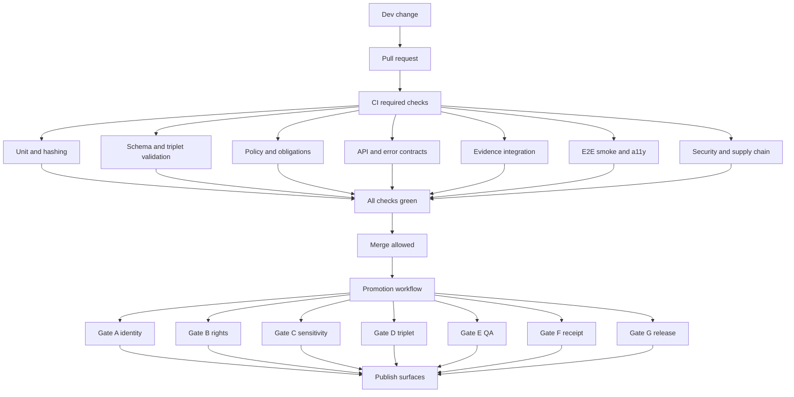

<!-- [KFM_META_BLOCK_V2]
doc_id: kfm://doc/7f06c93b-7c88-4f2b-bba2-4f3d935d3f89
title: tests — Test Strategy, QA, and CI Gates
type: standard
version: v2
status: draft
owners: TODO
created: 2026-02-26
updated: 2026-02-28
policy_label: restricted
related:
  - docs/MASTER_GUIDE_v13.md
  - docs/architecture/
  - .github/workflows/
tags: [kfm, tests, ci, governance]
notes:
  - This README is a governed artifact. Keep it aligned with merge gates and the Promotion Contract.
  - Do not include secrets, restricted datasets, or sensitive location details in this doc or fixtures.
[/KFM_META_BLOCK_V2] -->

<a id="top"></a>

# `tests/` — Test Strategy, QA, and CI Gates

**Purpose:** Make governance enforceable. Tests are not “nice to have”; they are the mechanism that keeps the **trust membrane** intact and prevents unsafe or untraceable outputs from shipping.

**Status:** DRAFT • **Owners:** `TODO` • **Last updated:** `2026-02-28` • **Policy label:** `restricted`


> [!WARNING]
> This directory is part of the **trust membrane**. If a test is flaky, non-deterministic, or bypassable, it is a governance risk.

---

## Quick navigation

- [Repo reality check](#repo-reality-check)
- [Purpose and scope](#purpose-and-scope)
- [Non-negotiable invariants enforced by tests](#non-negotiable-invariants-enforced-by-tests)
- [Test categories](#test-categories)
- [Folder layout](#folder-layout)
- [Running tests](#running-tests)
- [Fixtures and data safety](#fixtures-and-data-safety)
- [Writing and adding tests](#writing-and-adding-tests)
- [Promotion Contract v1 gate mapping](#promotion-contract-v1-gate-mapping)
- [CI gates](#ci-gates)
- [Governance quality metrics](#governance-quality-metrics)
- [Release definition of done](#release-definition-of-done)
- [Troubleshooting](#troubleshooting)
- [Appendices](#appendices)

---

## Repo reality check

This README describes the **required posture**. Before treating it as “Confirmed (repo)”, verify the repo actually wires these checks into CI and branch protections.

Minimum verification steps (copy/paste):

```bash
# 0) Capture repo identity (so this doc revision is traceable)
git rev-parse HEAD || true
git status --porcelain || true

# 1) Inspect tests tree
find tests -maxdepth 3 -type d -print

# 2) Find CI workflows that reference tests
ls -la .github/workflows 2>/dev/null || true
grep -R "tests/" -n .github/workflows 2>/dev/null || true

# 3) Identify the canonical test entrypoint (prefer exactly one)
# Examples: make test, task test, ./scripts/validate.sh, pnpm -r test, pytest, go test
ls -la Makefile Taskfile.yml scripts tools 2>/dev/null || true

# 4) If policy exists, confirm policy tests are merge-blocking
# (Adjust paths to match repo)
ls -la policy 2>/dev/null || true

# 5) Confirm contract validation exists for governed publishing surfaces
# Story Node publish gate, Focus eval harness, and receipt schema validation are expected.
grep -R "story" -n .github/workflows 2>/dev/null || true
grep -R "focus" -n .github/workflows 2>/dev/null || true
grep -R "run_receipt\|receipt" -n .github/workflows 2>/dev/null || true
```

If CI does not run the gates described here, treat that as a **release blocker** and update `.github/workflows/` to match this contract.

[Back to top](#top)

---

## Purpose and scope

This `tests/` directory holds automated tests that verify:

1. **Correctness** of domain logic (including deterministic identity/hashing).
2. **Governance invariants** (default-deny, fail closed).
3. **Evidence-first UX contract** (every claim can open to resolvable evidence).
4. **Cite-or-abstain** (Focus Mode or equivalent must not answer without verified citations).
5. **Contract stability** (catalog schemas, API contracts, error models).
6. **Safety** for sensitive locations and restricted data (no leakage; no restricted existence inference).
7. **Provenance artifacts** (run receipts/manifests and—if enabled—supply-chain attestations) remain verifiable and policy-safe.

### What belongs here

- Unit tests for domain logic and deterministic identity rules.
- Schema validation tests for catalog artifacts (DCAT/STAC/PROV profiles) **and run receipts/manifests**.
- Policy tests driven by fixtures (allow/deny/obligations).
- API contract tests (OpenAPI diffs, DTO validation, compatibility checks).
- Integration tests for evidence resolution (EvidenceRef → EvidenceBundle).
- E2E UI tests for evidence drawer / citations / policy-safe denial UX.
- Supply-chain integrity checks (dependency scanning; SBOM/attestation verification if enabled).
- Test fixtures that are **synthetic** or **sanitized**, **small**, and clearly documented.

### What must not go here

- Real secrets, tokens, credentials, private keys, kubeconfigs, `.env` with real values.
- Partner datasets, raw acquisitions, or anything with unclear licensing.
- Restricted or sensitive geometries (precise coordinates) or fixtures that could re-enable targeting.
- Large binaries unless explicitly approved, provenance-tracked, and size-controlled.
- Tests that require internet access to pass (unless explicitly marked as non-blocking and gated).

[Back to top](#top)

---

## Non-negotiable invariants enforced by tests

KFM governance is only real if it is testable. These invariants must be backed by merge-blocking checks.

### 1) Truth path lifecycle

- Runtime-visible outputs must trace to: RAW → WORK/QUARANTINE → PROCESSED → CATALOG/TRIPLET.
- Tests must prevent “floating latest” from replacing versioned IDs in share links, Story Nodes, exports, and receipts.

**Test expectations**
- Catalog triplet cross-link tests (DCAT↔STAC↔PROV) pass for promoted dataset versions.
- Promotion manifest / receipt tests confirm version pins and digests.

### 2) Trust membrane

- UI/clients must never reach directly into DB/object storage/indexes.
- Backend domain logic must never bypass repository interfaces to access storage.

**Test expectations**
- Static guardrails: dependency boundary checks (no DB clients in UI; no storage SDKs in browser bundles).
- Integration checks: data access routes through governed APIs and evidence resolver.

### 3) Evidence-first UX

Every user-facing claim must open to evidence (policy label, rights, provenance, digests).

**Test expectations**
- Evidence resolution integration tests: representative EvidenceRefs resolve to EvidenceBundles.
- UI E2E tests: evidence drawer exists and renders required fields for allowed users.

### 4) Cite-or-abstain

If citations cannot be verified (or are denied), the system must abstain or reduce scope.

**Test expectations**
- Focus Mode golden tests: answers include resolvable citations, or abstain with policy-safe reasons.
- “Citation verification is a hard gate” tests: any unresolvable/denied citation fails the run.

### 5) Canonical vs rebuildable stores

Canonical truth lives in catalogs/provenance/artifacts; projections are rebuildable.

**Test expectations**
- Tests assert that rebuildable indexes can be re-derived from canonical artifacts (at least in toy harnesses).
- No test relies on “projection-only” truth without a catalog/receipt anchor.

### 6) Deterministic identity and hashing

Dataset/DatasetVersion identity must be stable and reproducible.

**Test expectations**
- Spec-hash tests: canonicalization is deterministic; no hash drift on stable inputs.
- Fixtures include known-good hash vectors and known-bad counterexamples.

### 7) Policy-safe errors (no restricted existence inference)

Public users must not learn restricted existence via error shape, timing, or message differences.

**Test expectations**
- Contract tests enforce policy-safe error envelopes.
- E2E tests verify indistinguishable behaviors for “not found” vs “not allowed” where required.

### 8) Receipts, manifests, and attestations are verifiable (provenance-first)

Every governed run emits a receipt (and optionally a promotion-oriented manifest). If attestations/SBOMs exist,
they must be verifiable **server-side** and must never be fetched directly by the browser.

**Test expectations**
- Receipt/manifest schema validation: required fields present; timestamps bounded; checks interpreted fail-closed.
- If signatures/attestations are enabled, verification tests pass in CI for fixtures (no network required for verification).
- UI guardrail tests: the UI does not attempt to fetch attestation artifacts directly.

[Back to top](#top)

---

## Test categories

Minimum categories expected for KFM:

| Category | Purpose | Typical failures caught | Must be deterministic? | Merge gate? |
|---|---|---|---:|---:|
| Unit | Domain logic, hashing, vocab | hash drift, time logic bugs, invariant regressions | ✅ | ✅ |
| Schema | DCAT/STAC/PROV + receipts/manifests | invalid JSON, missing fields, broken links | ✅ | ✅ |
| Policy | allow/deny + obligations | leakage regressions, wrong obligations, default-deny broken | ✅ | ✅ |
| Contract | API specs + error model + DTOs | breaking OpenAPI diffs, incompatible DTOs, unsafe errors | ✅ | ✅ |
| Integration | Evidence resolver + governed API | EvidenceRef breakage, policy bypass, audit_ref missing | ✅ | ✅ |
| E2E | UI trust flows | missing evidence drawer, citations not resolvable, a11y regressions | ✅ (as much as possible) | ✅ (smoke) |
| Security | dependency + supply-chain checks | vulnerable deps, leaked secrets, missing SBOM/attestation rules | ✅ | ✅ |

> [!NOTE]
> If a test cannot be made deterministic, it must be isolated and treated as **non-blocking** until fixed.

[Back to top](#top)

---

## Folder layout

This is the **recommended** layout. If the repo differs, update this section to match reality.

```text
tests/                                               # KFM test entrypoint (unit → schema → policy → contract → integration → e2e)
├─ README.md                                         # Test strategy + how to run + CI gate mapping
│
├─ registry/                                         # Machine-readable registry + schemas + fixtures (small)
│  ├─ README.md                                      # How the registry is used + how to add suites
│  ├─ tests.v1.json                                  # Suites, owners, required gates, commands, timeouts, flake policy
│  │
│  ├─ schemas/                                       # Optional but recommended (or link to contracts/)
│  │  ├─ tests_registry.v1.schema.json               # Schema for tests.v1.json
│  │  ├─ test_suite_manifest.v1.schema.json          # Optional: per-suite manifest shape
│  │  ├─ run_receipt.v1.schema.json                  # Receipt schema (or link to contracts/)
│  │  ├─ run_manifest.v1.schema.json                 # Optional: promotion-oriented manifest (or link to contracts/)
│  │  ├─ promotion_manifest.v1.schema.json           # Optional: if promotion manifests are validated here
│  │  ├─ evidence_ref.v1.schema.json                 # Optional: EvidenceRef contract (or link to contracts/)
│  │  ├─ evidence_bundle.v1.schema.json              # Optional: EvidenceBundle contract (or link to contracts/)
│  │  ├─ policy_decision.v1.schema.json              # Optional: decision envelope (allow/deny/obligations)
│  │  └─ error_envelope.v1.schema.json               # Optional: policy-safe error model
│  │
│  └─ fixtures/                                      # Registry fixtures (valid/invalid) for CI schema validation
│     ├─ valid/
│     │  ├─ tests.v1.min.json                        # Minimal valid registry example
│     │  └─ tests.v1.full.json                       # Full-feature valid registry example
│     └─ invalid/
│        ├─ missing_owner.json
│        ├─ unknown_gate.json
│        └─ bad_command_shape.json
│
├─ unit/                                             # Pure tests (no I/O): hashing, vocab, invariants, time logic
│  ├─ README.md
│  │
│  ├─ hashing/                                       # Deterministic identity + canonicalization tests
│  │  ├─ test_spec_hash_vectors.*                    # Golden vectors for spec_hash / dataset_version_id inputs
│  │  ├─ test_canonical_json.*                       # Canonical JSON ordering/normalization rules
│  │  └─ fixtures/
│  │     ├─ vectors.v1.json
│  │     └─ FIXTURE_NOTES.md
│  │
│  ├─ vocab/                                         # Controlled vocabulary + enum drift tests
│  │  ├─ test_policy_labels_vocab.*
│  │  ├─ test_obligations_vocab.*
│  │  ├─ test_reason_codes_vocab.*
│  │  └─ fixtures/
│  │     ├─ vocab_inputs.json
│  │     └─ FIXTURE_NOTES.md
│  │
│  ├─ time/                                          # Time-aware logic tests (windows, sorting, freshness)
│  │  ├─ test_time_window_normalization.*
│  │  ├─ test_timeline_sorting.*
│  │  └─ fixtures/
│  │     └─ time_cases.v1.json
│  │
│  ├─ invariants/                                    # Trust membrane guardrails (static/unit-level)
│  │  ├─ test_no_direct_store_imports.*              # E.g., UI code must not import DB/object-store SDKs
│  │  ├─ test_repository_interface_only.*            # Core logic accesses storage only via repo interfaces
│  │  └─ test_fail_closed_defaults.*                 # Missing config/metadata ⇒ deny/abstain
│  │
│  └─ snapshots/                                     # Optional golden snapshots (diff-friendly)
│     └─ (golden outputs live here if your runner uses snapshot testing)
│
├─ schema/                                           # Schema/profile validation (DCAT/STAC/PROV + receipts/manifests)
│  ├─ README.md
│  │
│  ├─ dcat/
│  │  ├─ test_dcat_profile.*
│  │  ├─ fixtures/
│  │  │  ├─ valid/
│  │  │  └─ invalid/
│  │  └─ golden/                                     # Optional: canonicalized/normalized DCAT examples
│  │
│  ├─ stac/
│  │  ├─ test_stac_profile.*
│  │  ├─ fixtures/
│  │  │  ├─ valid/
│  │  │  └─ invalid/
│  │  └─ golden/
│  │
│  ├─ prov/
│  │  ├─ test_prov_profile.*
│  │  ├─ fixtures/
│  │  │  ├─ valid/
│  │  │  └─ invalid/
│  │  └─ golden/
│  │
│  ├─ triplet/                                       # Cross-link + integrity checks across DCAT/STAC/PROV
│  │  ├─ test_triplet_crosslinks.*
│  │  ├─ test_triplet_required_fields.*
│  │  └─ fixtures/
│  │     ├─ valid/
│  │     └─ invalid/
│  │
│  ├─ receipts/                                      # Run receipts + promotion manifests schema validation
│  │  ├─ test_run_receipt_schema.*
│  │  ├─ test_run_manifest_schema.*
│  │  ├─ test_promotion_manifest_schema.*
│  │  └─ fixtures/
│  │     ├─ valid/
│  │     └─ invalid/
│  │
│  └─ linkcheck/                                     # EvidenceRef resolvability + URL/URI lint rules (policy-safe)
│     ├─ test_evidence_ref_resolvability_rules.*
│     └─ fixtures/
│        ├─ valid/
│        └─ invalid/
│
├─ policy/                                           # Fixture-driven OPA/Rego tests (allow/deny/obligations)
│  ├─ README.md
│  │
│  ├─ fixtures/                                      # Deterministic policy fixtures used by tests
│  │  ├─ inputs/                                     # Inputs to policy evaluation (user/action/resource/context)
│  │  │  ├─ public_read_public_dataset.json
│  │  │  ├─ public_read_restricted_dataset.json
│  │  │  ├─ steward_read_restricted_dataset.json
│  │  │  ├─ public_export_public_dataset.json
│  │  │  └─ focus_public_query_restricted_context.json
│  │  └─ expected/                                   # Expected decision envelopes (allow/deny + obligations + reason_codes)
│  │     ├─ public_read_public_dataset.decision.json
│  │     ├─ public_read_restricted_dataset.decision.json
│  │     ├─ steward_read_restricted_dataset.decision.json
│  │     ├─ public_export_public_dataset.decision.json
│  │     └─ focus_public_query_restricted_context.decision.json
│  │
│  ├─ test_authz.*
│  ├─ test_obligations.*
│  ├─ test_rights.*
│  ├─ test_sensitivity.*
│  ├─ test_promotion_policy.*                        # Policy participation in promotion gates (deny if missing requirements)
│  └─ test_policy_safe_errors.*                      # No restricted-existence inference; stable envelopes
│
├─ contract/                                         # API + DTO contracts, compatibility, error envelopes
│  ├─ README.md
│  │
│  ├─ api/
│  │  ├─ test_openapi_diff.*                         # Prevent breaking changes without version bump/migration notes
│  │  ├─ test_openapi_lint.*                         # Required tags, responses, auth, pagination conventions
│  │  └─ fixtures/
│  │     ├─ baselines/                               # Last-known-good specs for diffing (if your approach uses baselines)
│  │     └─ samples/                                 # Minimal request/response examples (sanitized)
│  │
│  ├─ dto/
│  │  ├─ test_dto_validation.*                       # Request/response DTO schema validation (jsonschema/zod/etc.)
│  │  └─ fixtures/
│  │     ├─ valid/
│  │     └─ invalid/
│  │
│  ├─ errors/
│  │  ├─ test_error_model.*                          # Policy-safe error envelope invariants
│  │  └─ fixtures/
│  │     ├─ public_role/
│  │     └─ steward_role/
│  │
│  └─ compatibility/
│     ├─ test_backward_compat.*                      # Optional: backward compatibility matrix tests
│     └─ baselines/                                  # Optional: compatibility baseline snapshots
│
├─ integration/                                      # Evidence resolver + governed API integration harness
│  ├─ README.md
│  │
│  ├─ harness/                                       # Local harness (fake stores or seeded canonical artifacts)
│  │  ├─ README.md
│  │  ├─ config/
│  │  │  ├─ test.env.example                         # Keys only; NO secrets
│  │  │  └─ overrides.yaml                           # Harness knobs (ports, feature flags; safe defaults)
│  │  ├─ seed/                                       # Seeded canonical artifacts for deterministic runs
│  │  │  ├─ catalog_triplet/                         # Minimal DCAT/STAC/PROV set for tests
│  │  │  ├─ processed_artifacts/                     # Tiny synthetic artifacts (or pointers)
│  │  │  ├─ evidence/                                # Evidence bundles/refs used in integration tests
│  │  │  └─ receipts/                                # Run receipts/promotion manifests used for gating tests
│  │  ├─ scripts/
│  │  │  ├─ up.sh                                    # Start harness
│  │  │  ├─ down.sh                                  # Stop harness
│  │  │  ├─ seed.sh                                  # Load deterministic seed
│  │  │  └─ reset.sh                                 # Reset harness state
│  │  └─ docker-compose.yml                          # Optional: if used to stand up local services
│  │
│  ├─ test_evidence_resolution.*                     # EvidenceRef → EvidenceBundle end-to-end
│  ├─ test_audit_receipts.*                          # audit_ref present; receipts emitted; policy logged (no secrets)
│  ├─ test_no_policy_bypass.*                        # Requests must not bypass policy enforcement points
│  └─ test_policy_safe_errors_runtime.*              # Runtime error behavior matches policy-safe contract
│
├─ e2e/                                              # End-to-end tests (UI ↔ API) for trust flows
│  ├─ README.md
│  │
│  ├─ playwright/                                    # Or cypress/selenium/etc. (choose one)
│  │  ├─ playwright.config.*
│  │  ├─ global-setup.*
│  │  └─ global-teardown.*
│  │
│  ├─ specs/
│  │  ├─ evidence_drawer.spec.*                      # Evidence drawer exists + required fields render
│  │  ├─ citations_resolve.spec.*                    # UI citations resolve (or abstain) end-to-end
│  │  ├─ focus_cite_or_abstain.spec.*                # Hard-gate citation verification behavior
│  │  ├─ policy_safe_denial.spec.*                   # No restricted existence inference UX
│  │  ├─ exports_rights_enforced.spec.*              # Exports gated by rights + policy labels
│  │  └─ time_slider_version_pinning.spec.*          # Time-aware UI pins DatasetVersion IDs in view_state
│  │
│  ├─ a11y/
│  │  ├─ smoke.spec.*                                # Keyboard navigation + basic a11y checks for trust surfaces
│  │  └─ rules/                                      # Optional: custom rules or allowlists
│  │
│  ├─ fixtures/                                      # E2E-only fixtures (NO secrets)
│  │  ├─ users.json                                  # Synthetic users/roles/groups
│  │  ├─ sessions.json                               # Synthetic session data (no tokens)
│  │  └─ view_states/                                # Deterministic view_state objects used by tests
│  │
│  └─ artifacts/                                     # CI artifacts (should be gitignored)
│     ├─ screenshots/
│     ├─ traces/
│     └─ videos/
│
├─ fixtures/                                         # Shared test fixtures (synthetic/sanitized; small; documented)
│  ├─ public/                                        # Safe synthetic fixtures for public role
│  │  ├─ FIXTURE_NOTES.md
│  │  ├─ datasets/                                   # Tiny synthetic datasets (safe-by-default)
│  │  ├─ catalogs/                                   # Matching tiny DCAT/STAC/PROV
│  │  ├─ evidence/                                   # Evidence bundles/refs safe for public scenario tests
│  │  └─ view_states/                                # Share-link/view_state fixtures
│  │
│  └─ restricted_sanitized/                          # Sanitized fixtures (no precise coords, no identifiers)
│     ├─ FIXTURE_NOTES.md
│     ├─ datasets/                                   # Generalized/aggregated representations only
│     ├─ catalogs/
│     ├─ evidence/
│     └─ view_states/
│
└─ utils/                                            # Shared test helpers (builders, fake stores, snapshot utilities)
   ├─ README.md
   ├─ builders.*                                     # Builders for fixtures/inputs (policy-safe defaults)
   ├─ snapshots.*                                    # Snapshot helpers (stable normalization)
   ├─ tempdirs.*                                     # Tempdir management helpers
   ├─ http_client.*                                  # Optional: common client wrapper for integration/e2e
   ├─ fake_clock.*                                   # Time-freezing utilities for deterministic tests
   ├─ canonical_json.*                               # Canonical serialization helpers (hashing parity)
   └─ assertions/
      ├─ policy_safe_errors.*                        # Assertions for indistinguishable deny/not-found behavior
      ├─ evidence_bundle_assertions.*                # Assertions for EvidenceBundle required fields
      └─ catalog_link_assertions.*                   # Assertions for DCAT↔STAC↔PROV link integrity
```

> [!TIP]
> Keep the top-level categories **few and obvious**. If you add a new category, update this README and wire it into CI.

[Back to top](#top)

---

## Running tests

> [!IMPORTANT]
> The repo should expose **one** canonical “run everything that’s merge-blocking” entrypoint.
> If it doesn’t exist, add it (Makefile/Taskfile/script) and wire CI to use it.

### Canonical entrypoint (choose one per repo)

Examples (pick the one your repo uses, then delete the rest):

```bash
# Option A
make test

# Option B
task test

# Option C
./scripts/validate.sh

# Option D (JS monorepo)
pnpm -r test

# Option E (Python)
pytest -q

# Option F (Go)
go test ./...
```

### Run by category (examples; adjust to reality)

```bash
# Unit tests
pytest -q tests/unit

# Schema tests
pytest -q tests/schema

# Policy tests
pytest -q tests/policy

# Contract tests
pytest -q tests/contract

# Integration tests
pytest -q tests/integration

# E2E UI tests (example)
npx playwright test
```

### Suggested local workflow

1. Run `unit + schema + policy` before pushing.
2. Run `integration` before requesting review on governance-impacting work.
3. Run `e2e` smoke suite before merging UI changes.

[Back to top](#top)

---

## Fixtures and data safety

Fixtures are governed artifacts. Treat them like publishable documentation.

### Fixture requirements

- **Synthetic by default** (preferred).
- **Small** (reviewable; diff-friendly).
- **Licensed / attributable** (even for synthetic, note generator and intent).
- **Sanitized** (no sensitive coordinates; no re-identification risk).
- **Deterministic** (no timestamps/randomness unless seeded and explained).

### Prohibited fixture content

- Secrets, tokens, credentials, private keys.
- Real restricted geometries, precise sensitive locations.
- PII or re-identifiable records.
- Anything that would be unsafe to paste into a public issue.

### Fixture documentation standard

Each fixture directory must include `FIXTURE_NOTES.md`:

- Source or generator
- License (or “synthetic”)
- Sensitivity classification
- Redactions/generalizations applied
- Which tests depend on it (paths)

[Back to top](#top)

---

## Writing and adding tests

### Golden rules

- **Fail closed:** missing citation, policy label, rights metadata, receipt fields, or schema links must fail the test.
- **No hidden dependencies:** tests should not require internet access or external credentials.
- **Stable, policy-safe outputs:** avoid logging secrets; avoid printing restricted content.

### Adding a new feature test checklist

- [ ] Unit test covers domain logic changes (including hashing/identity if affected).
- [ ] Schema tests cover any catalog/receipt/manifest changes.
- [ ] Policy fixtures + tests updated for any new access pattern.
- [ ] Contract tests updated for any OpenAPI/DTO/error model change.
- [ ] Integration tests cover at least one representative EvidenceRef flow.
- [ ] E2E test covers evidence drawer / citation resolution if UI is affected.
- [ ] “No leakage” tests added if sensitive locations or restricted data touched.
- [ ] Link checking passes (no broken citations).
- [ ] Accessibility smoke checks pass for UI changes.
- [ ] If attestations/SBOMs are enabled: verification tests updated (no browser fetch).

### Flakiness policy

- A flaky merge-blocking test must be treated as a governance incident:
  - quarantine the test (move to non-blocking) **only** with an issue + owner + fix plan
  - restore it to blocking once stabilized
- Prefer deterministic seeds and time-freezing utilities.
- Avoid sleep-based tests; prefer explicit waits and stable readiness checks.

[Back to top](#top)

---

## Promotion Contract v1 gate mapping

Promotion to **PUBLISHED** is blocked unless the minimum gates are met. These gates are intentionally framed so they can be automated in CI and reviewed during steward sign‑off. (If a gate is not enforced, treat it as governance debt.)

### Gate ↔ test suite ↔ CI check mapping (recommended)

| Gate | Blocks promotion unless… | Primary test coverage | Suggested merge gate / lane (names are **recommended**) |
|---|---|---|---|
| A — Identity & versioning | `dataset_id`, `dataset_version_id`, deterministic `spec_hash`, and content digests exist and match | `tests/unit/hashing` + `tests/schema/receipts` | `unit` + `schema_catalog` |
| B — Licensing & rights metadata | License/rights fields are present + upstream terms snapshot exists | `tests/policy` + `tests/schema/*` | `policy` |
| C — Sensitivity & redaction plan | `policy_label` exists; obligations apply; defaults fail‑closed | `tests/policy` + `tests/integration` + `tests/e2e` smoke | `policy` + `integration_evidence` |
| D — Catalog triplet validation | DCAT/STAC/PROV validate and cross-link; EvidenceRefs resolve | `tests/schema/triplet` + `tests/schema/linkcheck` | `schema_catalog` + `link_check` |
| E — QA & thresholds | Dataset QA report exists and thresholds met, else quarantined | `tests/schema/receipts` + dataset QA suites | `schema_catalog` |
| F — Run receipt & audit record | Receipt is emitted + schema-valid + policy logged; (optional) attestation verified | `tests/schema/receipts` + `tests/integration/test_audit_receipts.*` | `integration_evidence` |
| G — Release manifest | Promotion recorded as a release manifest referencing digests | `tests/schema/receipts` | `release_manifest` (often required only for releases) |

> [!IMPORTANT]
> The exact job names and enforcement points must match `.github/workflows/`. If your workflow uses different names, update this table so “documentation == enforcement.”

### CI enforcement flow (conceptual)



[Back to top](#top)

---

## CI gates

CI gates make this README real. If a gate isn’t enforced in CI, it’s not governance.

### Required merge gates (baseline)

- Formatting + lint + typecheck
- Unit tests
- Schema/profile validation (DCAT/STAC/PROV + receipts/manifests)
- Policy tests (fixtures-driven; default deny)
- Contract tests (API/DTO/error envelope)
- Integration tests (evidence resolution; no policy bypass)
- Link checks (citations/evidence refs resolve deterministically)
- Secret scanning + dependency security scanning
- Story Node template/schema validation **and** publish-gate checks (citations resolvable)
- Focus Mode evaluation harness (golden queries) **if Focus exists in the repo**
- E2E UI smoke tests + accessibility smoke checks (for UI changes)
- (If enabled) SBOM + attestation verification gates

### Recommended job naming (CI)

- `lint_typecheck`
- `unit`
- `schema_catalog`
- `policy`
- `contract_api`
- `integration_evidence`
- `e2e_ui_smoke`
- `a11y_smoke`
- `link_check`
- `security_scan`
- `story_validate`
- `focus_eval` (only if Focus exists)
- `sbom_attest` (only if enabled)

### Gate selection by change area (recommended)

| Change touches… | Must run… | Why |
|---|---|---|
| `policy/` or `configs/policy/` | policy + integration_evidence | policy parity + prevent leakage |
| `contracts/` or `schemas/` | schema_catalog + contract_api | prevent contract drift |
| `data/catalog/` | schema_catalog + link_check | triplet must validate + cross-link |
| `apps/` UI | e2e_ui_smoke + a11y_smoke + integration_evidence | trust surfaces must work |
| `scripts/` pipelines | unit + schema_catalog + integration_evidence | receipts + catalogs must remain valid |
| `infra/` | (infra-specific checks) + security_scan | runtime safety and least privilege |

> [!NOTE]
> If the repo uses a merge queue/protected branches, ensure these jobs are **required**.

[Back to top](#top)

---

## Governance quality metrics

Track governance and reliability metrics so drift is visible (without incentivizing unsafe behavior).

| Metric | Why it matters | Where to compute (examples) |
|---|---|---|
| % promoted artifacts with explicit license metadata | Detect rights/attribution drift | receipts + catalog triplet |
| % Story Nodes with 100% resolvable citations | Enforces evidence-first narratives | story publish gate + linkcheck |
| Evidence resolver latency (P95) | UX integrity; bottleneck signal | integration harness + runtime telemetry |
| Tile serving latency (P95) for public layers | Map-first performance | e2e + runtime telemetry |
| Reindex time from processed artifacts | Rebuildability & recovery | indexer job receipts |
| # quarantined datasets by reason code | QA + governance health | promotion manifests + policy denials |
| # policy denials by reason code | Detect leakage attempts + policy regressions | policy logs (redacted) |

> [!NOTE]
> Metrics must not encourage perverse incentives. Use them to detect drift and risk.

[Back to top](#top)

---

## Release definition of done

A release is “done” only when:

- All merge gates pass on the release branch/tag.
- Promotion gates pass for any new dataset versions (manifests + receipts + catalogs).
- Evidence resolver contract tests pass for:
  - allowed scenarios (100% resolvable citations)
  - denied scenarios (policy-safe denial; no inference)
- Focus Mode evaluation harness passes golden queries (if Focus exists).
- UI regression smoke tests pass and accessibility checks show no major regressions.
- Release notes include policy/contract/data changes and rollback notes.
- Audit ledger retention and monitoring are configured (no silent “best effort” logging).

[Back to top](#top)

---

## Troubleshooting

### Spec hash mismatch

Likely causes:
- canonicalization rules changed (ordering/normalization)
- a new field entered the identity inputs without being versioned

Fix:
- update canonicalization code and golden vectors intentionally
- version bump or migration notes if behavior is breaking

### Broken citations or unresolved EvidenceRefs

Fix:
- update evidence resolver mappings or fixtures
- ensure catalog triplet links exist and validate
- do not “skip” citation verification

### Policy tests failing unexpectedly

Treat as potential leakage first:
- confirm default-deny posture remains intact
- verify obligations are applied and logged
- only relax policy with explicit governance decision + fixtures proving intent

### Schema tests failing

Fix artifact generation to meet the profile:
- don’t weaken schemas to “fit the bug” unless it’s an intentional contract change

### Receipt / attestation verification failing

Likely causes:
- receipt schema drift (missing required fields, wrong timestamp format)
- digests changed without version bump
- signatures/attestations produced by unapproved workflow identity
- CI attempted network verification (should be fixture-based where possible)

Fix:
- validate receipt/manifest schemas locally on fixtures first
- ensure “subject” is a digest, not a mutable tag, in verification code paths
- pin tool versions used to generate/verify attestations and treat updates as governed changes

### E2E flakiness

Stabilize by:
- removing timing assumptions
- using seeded deterministic data
- using explicit readiness checks (not sleeps)

[Back to top](#top)

---

## Appendices

<details>
<summary><strong>Appendix A — Fixture governance template</strong></summary>

Create `FIXTURE_NOTES.md` in every fixture directory:

```md
# Fixture Notes

- Fixture name:
- Source / generator:
- License:
- Policy label / sensitivity:
- Redactions / generalizations applied:
- Intended coverage (tests that depend on it):
- Safety notes (why it is safe to include in repo):
```
</details>

<details>
<summary><strong>Appendix B — Minimal “policy-safe error” assertions</strong></summary>

Recommended assertions for public-role tests:

- Error envelope shape is stable (same fields regardless of restricted existence).
- Message does not confirm existence of restricted resources.
- Status codes do not create inference (use repo’s policy-safe standard).
- Response times are within a narrow band for deny vs not-found paths (where feasible).
</details>

---

<p align="right"><a href="#top">Back to top ↑</a></p>
