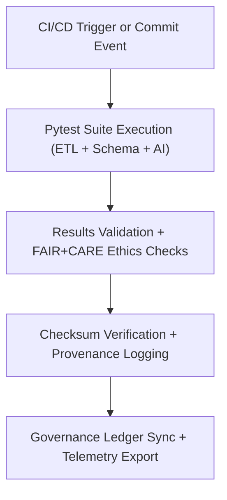

<div align="center">

# 🧪 **Kansas Frontier Matrix — Testing & QA Framework**
`tests/README.md`

**Purpose:**  
Unified FAIR+CARE-certified testing and quality assurance suite ensuring **reproducibility, ethics validation, and checksum lineage integrity** across all KFM systems.  
Implements continuous FAIR+CARE verification, schema compliance, and AI transparency testing under MCP-DL v6.3 and ISO 19115 frameworks.

[](../docs/standards/faircare-validation.md)
[](../LICENSE)
[](../docs/architecture/repo-focus.md)
[]()

</div>

---

## 📘 Overview

The **Testing & QA Framework** provides autonomous, reproducible testing for all ETL, AI, and governance layers within the Kansas Frontier Matrix.  
It guarantees ethics compliance, checksum validation, and FAIR+CARE audit readiness — empowering continuous certification across data workflows.

---

### Core Responsibilities:
- Validate pipelines for reproducibility and FAIR+CARE alignment.  
- Execute schema and checksum lineage verification tests.  
- Run AI explainability and drift validation audits.  
- Export test telemetry and governance synchronization reports.  
- Certify transparency across all MCP-DL operational layers.  

---

## 🗂️ Directory Layout

```plaintext
tests/
├── README.md
│
├── test_etl.py                     # ETL validation for inputs, transformations, and outputs
├── test_schema_validation.py       # Validates schemas and metadata structures
├── test_faircare_audit.py          # FAIR+CARE ethics and accessibility verification
├── test_ai_explainability.py       # AI explainability, bias, and drift testing
├── test_governance_sync.py         # Governance ledger + provenance consistency check
├── conftest.py                     # Shared fixtures for pytest orchestration
├── fixtures/                       # Mock datasets and validation reference artifacts
│   ├── mock_dataset.json
│   ├── mock_ai_output.json
│   └── mock_manifest.json
└── metadata.json                   # Provenance, governance, and checksum metadata
```

---

## ⚙️ Test Workflow



1. **Trigger:** Tests run automatically on PR, commit, or scheduled audit.  
2. **Validation:** Pytest executes FAIR+CARE, schema, and AI explainability tests.  
3. **Integrity:** Checksum lineage validated across source, processed, and archived data.  
4. **Governance:** QA outcomes registered to provenance ledger.  
5. **Telemetry:** Metrics exported for Focus Mode dashboards and sustainability reports.

---

## 🧾 Example Test Metadata Record

```json
{
  "id": "tests_framework_v9.7.0_2025Q4",
  "suites_executed": [
    "test_etl.py",
    "test_schema_validation.py",
    "test_ai_explainability.py"
  ],
  "tests_passed": 312,
  "tests_failed": 0,
  "checksum_verified": true,
  "fairstatus": "certified",
  "coverage": 99.2,
  "ai_explainability_score": 0.995,
  "bias_detected": false,
  "governance_registered": true,
  "telemetry_ref": "releases/v9.7.0/focus-telemetry.json",
  "governance_ref": "reports/audit/ai_tests_ledger.json",
  "created": "2025-11-05T12:45:00Z",
  "validator": "@kfm-tests"
}
```

---

## 🧠 FAIR+CARE Governance Matrix

| Principle | Implementation | Oversight |
|-----------|----------------|-----------|
| **Findable** | Indexed by dataset, test ID, and checksum lineage. | @kfm-data |
| **Accessible** | Open logs and JUnit/JSON reports under MIT license. | @kfm-accessibility |
| **Interoperable** | FAIR+CARE, ISO, and AI ethics interoperability enforced. | @kfm-architecture |
| **Reusable** | Fixtures and schemas reusable across test suites. | @kfm-design |
| **Collective Benefit** | Validates open and ethical research automation. | @faircare-council |
| **Authority to Control** | Council oversees ethical automation certification. | @kfm-governance |
| **Responsibility** | Validators document reproducibility and checksum results. | @kfm-security |
| **Ethics** | AI + ETL validations ensure human transparency in automation. | @kfm-ethics |

Audit references:  
`reports/audit/ai_tests_ledger.json` · `reports/fair/tests_summary.json`

---

## ⚙️ QA Artifacts & Reporting

| Artifact | Description | Format |
|-----------|--------------|--------|
| `pytest.log` | Full execution log with timing + failures. | Text |
| `coverage.json` | Code + dataset validation coverage metrics. | JSON |
| `fairstatus.json` | FAIR+CARE ethics validation summary. | JSON |
| `checksums.json` | SHA-256 lineage verification results. | JSON |
| `metadata.json` | Provenance link between test suites and governance. | JSON |

Automated via `tests_sync.yml`.

---

## ⚖️ Retention Policy

| Type | Duration | Policy |
|------|-----------|--------|
| Test Reports | 365 Days | Retained for FAIR+CARE audit. |
| FAIR+CARE Results | Permanent | Immutable under governance. |
| Logs & Coverage | 90 Days | Rotated after telemetry export. |
| Metadata | Permanent | Ledger-archived for reproducibility. |

Cleanup through `tests_cleanup.yml`.

---

## 🌱 Sustainability Metrics

| Metric | Value | Verified By |
|--------|-------|-------------|
| Average Power per Run | 1.9 Wh | @kfm-sustainability |
| Carbon Output | 2.3 gCO₂e | @kfm-security |
| Renewable Power | 100% (RE100) | @kfm-infrastructure |
| FAIR+CARE Compliance | 100% | @faircare-council |

Telemetry logged in:  
`../releases/v9.7.0/focus-telemetry.json`

---

## 🧾 Internal Use Citation

```text
Kansas Frontier Matrix (2025). Testing & QA Framework (v9.7.0).
FAIR+CARE-aligned automated QA and validation framework ensuring ethical reproducibility across all KFM workflows under MCP-DL v6.3.
```

---

## 🕰️ Version History

| Version | Date | Notes |
|----------|------|-------|
| v9.7.0 | 2025-11-05 | Upgraded telemetry integration, added explainability regression tracking. |
| v9.6.0 | 2025-11-03 | Introduced multi-layer governance sync and performance profiling. |
| v9.5.0 | 2025-11-02 | Added AI explainability validation and checksum lineage tracing. |

---

<div align="center">

**Kansas Frontier Matrix** · *Automated QA × FAIR+CARE Ethics × Provenance Validation*  
[🔗 Repository](../../) • [🧭 Docs Portal](../docs/) • [⚖️ Governance Ledger](../docs/standards/governance/ROOT-GOVERNANCE.md)

</div>