<!--
📌 This README defines the repo-wide testing & verification surface for KFM / Kansas‑Matrix‑System.
🗓️ Last updated: 2026-01-13
🔁 Review cycle: 90 days (or anytime pipeline order / catalogs / policy pack / CI lanes change)
-->

<div align="center">

# 🧪 Tests — Kansas Frontier Matrix (KFM) / Kansas‑Matrix‑System

**Trust-first testing for a contract‑first, catalog‑first geospatial + knowledge + modeling stack** 🧾🗺️🧬  
Determinism • Contracts • Governance • Evidence receipts • “Fail closed” gates ✅🔒


</div>

> KFM tests don’t just check “it runs.” 
> They prove that our **pipelines**, **catalogs**, **graph**, **APIs**, **docs/story nodes**, and **UI behaviors** are:
>
> ✅ **Correct** • ✅ **Reproducible** • ✅ **Governance‑compliant** • ✅ **Honest about uncertainty**  
>
> We test the **seams (boundaries + contracts)** and treat metadata/provenance as **first‑class artifacts** 🗂️🧬

> [!IMPORTANT]
> **tests/** is part of KFM’s *governed surface*.  
> If a change can affect what users see or what the system asserts as “truth”, it must be **testable**, **traceable**, and **fail‑closed** when requirements aren’t met.

---

<details>
<summary><b>🧭 Table of contents</b></summary>

- [🔗 Quick links](#-quick-links)
- [🚦 Non‑negotiables](#-non-negotiables)
- [🚀 Quickstart](#-quickstart)
- [🧩 KFM test matrix](#-kfm-test-matrix-subsystems--what-to-assert)
- [🧠 Core invariant: governed ordering](#-core-invariant-governed-ordering)
- [🧱 Architecture boundary tests](#-architecture-boundary-tests-clean-architecture)
- [🔺 Test pyramid](#-test-pyramid-how-we-keep-velocity--confidence)
- [🏷️ Test categories & markers](#️-test-categories--markers-suggested)
- [🧰 Tool & CLI contract tests](#-tool--cli-contract-tests)
- [📄 Docs, Story Nodes, & Focus Mode validation](#-docs-story-nodes--focus-mode-validation)
- [🧾 Contract & metadata tests](#-contract--metadata-tests)
- [🧷 Stable IDs & versioning tests](#-stable-ids--versioning-tests-dont-break-links)
- [📜 License, citation, & redistribution tests](#-license-citation--redistribution-tests)
- [✅ Data validation gates](#-data-validation-gates-fail-fast)
- [🗺️ Geospatial tests](#️-geospatial-tests-gis-correctness)
- [🛰️ Remote sensing tests](#️-remote-sensing-tests-earth-engine--imagery)
- [🧊 3D / WebGL / 3D GIS tests](#-3d--webgl--3d-gis-tests)
- [🧠 Scientific & simulation validation](#-scientific--simulation-validation)
- [📊 ML / stats tests](#-ml--stats-tests-dont-fool-yourself)
- [🕸️ Graph tests](#️-graph-tests-neo4j--algorithms)
- [🛡️ API tests](#️-api-tests-fastapi--graphql)
- [🌐 Web / frontend tests](#-web--frontend-test-guidance)
- [📈 Performance & capacity tests](#-performance--capacity-tests-latency-throughput-cost)
- [🔐 Security, governance, & ethics tests](#-security-governance--ethics-tests-defensive)
- [🧾 Test artifacts & receipts](#-test-artifacts--receipts)
- [🗂️ Suggested folder layout](#️-suggested-folder-layout)
- [✅ CI gates](#-ci-gates-non-negotiable)
- [✅ PR checklist](#-pr-checklist-copypaste)
- [🧯 Troubleshooting](#-troubleshooting)
- [📚 Reference pointers](#-reference-pointers-library-index)
- [🕰️ Version history](#️-version-history)

</details>

---

## 🔗 Quick links

> Paths are relative to `tests/`. If your repo differs, treat these as the **target map** and document any deltas.

- 🧭 Repo overview: `../README.md`
- 📚 Docs boundary (canonical): `../docs/README.md`
- 🧱 Master Guide (v13): `../docs/MASTER_GUIDE_v13.md` *(if present)*
- 📦 Data lifecycle + governance: `../data/README.md`
- 🧬 Schemas registry: `../schemas/` *(STAC/DCAT/PROV/Story/UI contracts)*
- 📓 MCP (methods + receipts + model cards): `../mcp/`
- 🧰 Tools/validators (governed command surface): `../tools/README.md` *(if present)*
- 🛡️ API boundary:
  - `../api/` *(if present — many KFM layouts put FastAPI here)*
  - `../src/server/` *(if present — some layouts put API here)*
- 🛡️ API contracts (OpenAPI/GraphQL): `../src/server/contracts/` *(if present)*
- 📚 Story Nodes (draft/published): `../docs/reports/story_nodes/`
- 🌐 Web UI boundary: `../web/` *(if present)*
- 🤝 CI/CD + policy pack: `../.github/` *(workflows, templates, CodeQL, SECURITY.md)*

---

## 🚦 Non‑negotiables

These are KFM’s “must not regress” invariants. If any of these become false, **CI must block merge** 🚫✅

1) **Contract‑first:** schemas + API contracts are first‑class repo artifacts 🧾  
   - Breaking changes must be explicit + versioned + tested.

2) **Catalog‑first:** nothing is “real” unless it’s cataloged (STAC/DCAT) and traceable (PROV) 🗂️🧬  
   - Catalogs are **boundary artifacts** that downstream stages consume.

3) **Governed ordering is enforced in tests** 🧱  
   **ETL → STAC/DCAT/PROV → Graph → API → UI → Story Nodes → Focus Mode**

4) **API boundary rule:** UI must never query Neo4j/DB directly 🔐 
   - Everything user-facing must flow through the API boundary for redaction + policy enforcement.

5) **Determinism by default:** reruns should match unless inputs/configs change 🔁 
   - Stochastic code must be seeded and tested by **properties** (not exact values).

6) **Sovereignty + classification propagation:** outputs can’t be *less restricted* than inputs 🏷️🛡️  
   - “No downgrade” is a gate, not a guideline.

7) **No network in unit tests** 🚫🌐 
   - Record/replay, mock adapters, or cached fixtures only.

8) **Evidence over vibes:** failures must produce inspectable artifacts (logs, diffs, screenshots) 📎

9) **Metadata must compile:** unsourced/ad‑hoc “mystery layers” are not allowed 🧬🚫  
   - If a dataset has no license/provenance/extent, it’s not publishable.

10) **Privacy by test:** location-aware UX must be opt‑in and minimization‑first 📍🫥  
   - If the UI can expose a sensitive location (even indirectly), tests must flag it.

> [!TIP]
> If your PR changes **spatial truth** or **what users can infer**, it must be **traceable + testable** 🧾✅

---

## 🚀 Quickstart

### 0) Preconditions (one‑time)
- 🐍 Python env ready (`venv`, `uv`, `conda`, etc.)
- 🌐 Node env ready (`npm`, `pnpm`, or `yarn`)
- 🐳 Docker installed *(recommended for integration parity)*

### 1) Fast checks (developer loop ⚡)
```bash
# Python (fast)
pytest -q -m "not integration and not e2e and not slow"

# Web (fast — adapt to your repo)
npm test
```

### 2) Full suite (recommended on feature branches ✅)
```bash
pytest -q
pytest -q -m integration
npm run test:e2e
```

### 3) Integration tests with containers (preferred 🐳)
```bash
docker compose up -d --build
pytest -q -m integration
docker compose down -v
```

<details>
<summary>🧾 Command cheat sheet (copy/paste)</summary>

```bash
# Contracts only (API + schemas + catalogs)
pytest -q -m contracts

# Docs/story lint + story-node schema checks
pytest -q -m docs

# Geo sanity
pytest -q -m geo

# Earth-observation sanity
pytest -q -m eo

# Scientific V&V
pytest -q -m validation

# Graph slice
pytest -q -m graph

# Performance/capacity (usually scheduled)
pytest -q -m perf

# Defensive security checks
pytest -q -m security

# Governance/policy pack
pytest -q -m governance
```
</details>

---

## 🧩 KFM test matrix (subsystems + what to assert)

KFM is layered (clean boundaries). Tests should **pin the seams** 🔩:

| 🧱 Subsystem | 🎯 What must never break | 🧪 Best test types | 🧰 Typical tools |
|---|---|---|---|
| 🧰 Tools/CLIs | governed command surface: `--help`, safe defaults, stable exit codes, structured logs | unit ✅ + smoke ✅ | pytest, subprocess, snapshot tests |
| 🧪 ETL / pipelines | deterministic outputs, idempotent reruns, schema+CRS correctness | unit ✅ + integration 🔌 + data QA gates ✅ | pytest, GDAL, GeoPandas, validators |
| 🗂️ Catalogs (STAC/DCAT/PROV) | boundary artifacts exist *before* graph/UI uses data; links resolve; provenance complete | contracts 🧾 + integration 🔌 | JSON Schema, jq, custom validators |
| 🕸️ Graph (Neo4j) | graph ingests **from catalogs**, not ad‑hoc; constraints hold | integration 🔌 + property tests 🧪 | Neo4j container, Cypher assertions |
| 🛡️ API (REST/GraphQL) | contract stability, authz, deterministic pagination | contracts 🧾 + integration 🔌 | OpenAPI/GraphQL validation, TestClient |
| 🌐 UI (SPA) | responsive + accessible, stable map behaviors, timeline correctness | unit 🧩 + component 🧱 + e2e 🧭 | Jest/Vitest, Playwright/Cypress |
| 🗺️ Maps / 3D | symbology & overlays don’t silently shift; perf budgets | visual 🖼️ + e2e 🧭 | screenshot diffs, WebGL harness |
| 📚 Story Nodes | citations resolve; narrative ordering consistent; no unsourced claims | docs ✅ + contracts 🧾 | markdown/link validators, schema checks |
| 🎯 Focus Mode (AI) | provenance-linked outputs; safe refusals; uncertainty honesty; no sensitive leakage | eval ✅ + contract-like 🧾 | golden prompts, retrieval tests |
| 🔐 Governance | licenses, access constraints, “no downgrade” classification | gates ✅ + integration 🔌 | OPA/Conftest policies, CI checks |
| 📈 Performance | latency/throughput/cost regressions are visible & explainable | perf ⏱️ + scheduled ✅ | pytest-benchmark, k6, Locust, DB EXPLAIN |

---

## 🧠 Core invariant: governed ordering

> [!IMPORTANT]
> KFM enforces a **non‑negotiable** pipeline order:
>
> **ETL → STAC/DCAT/PROV catalogs → Graph → APIs → UI → Story Nodes → Focus Mode**

```mermaid
flowchart LR
  A[🧪 ETL] --> B[🗂️ STAC/DCAT/PROV]
  B --> C[🕸️ Graph]
  C --> D[🛡️ API]
  D --> E[🌐 UI]
  E --> F[📚 Story Nodes]
  F --> G[🎯 Focus Mode]
```



### ✅ What tests should enforce (practically)
- 🧪 ETL determinism (stable IDs/hashes; idempotent reruns; explicit versions)
- 🗂️ Catalog records exist **before** graph/UI uses them
- 🕸️ Graph loads only from catalogs (no ad‑hoc inserts in prod paths)
- 🛡️ API is the only client boundary (UI never queries graph/DB directly)
- 🔐 Classification/sensitivity never downgrades silently (requires audited redaction)
- 🧾 Provenance is complete (inputs → activities → outputs with run IDs/configs)
- 🏷️ License is explicit before publish (block publish if missing/ambiguous)

---

## 🧱 Architecture boundary tests (clean architecture)

KFM’s modular structure only stays maintainable if boundaries are enforced 🧱✨

### ✅ What to test
- **Dependency direction rules** (e.g., domain → service → adapters; never reverse)
- **No cross-layer shortcuts** (UI never imports DB drivers; pipelines don’t import UI)
- **API boundary is the redaction/policy choke‑point** (everything public flows through it)
- **“Independently testable components” stays true** (isolated unit tests remain possible)

### 🔧 Suggested patterns
- 🧭 *Import-lints* that fail if forbidden imports appear (Python)  
- 🧱 *Module boundary tests* (TS/JS) so UI doesn’t reach server internals  
- 🔌 *Contract-only integration tests* so adapters can be swapped without rewriting logic  

> [!TIP]
> Boundary tests are cheap insurance. They prevent “just this once” coupling that becomes permanent. 🧯

---

## 🔺 Test pyramid (how we keep velocity + confidence)

Most tests should be cheap and deterministic, then fewer (higher‑value) integration + E2E:

```text
          🔺 E2E (few)          → critical user journeys (UI + API + DB)
        🔺🔺 Integration (some)  → services together (DB, API, pipelines)
      🔺🔺🔺 Unit (many)          → pure logic, transforms, validators
```

---

## 🏷️ Test categories & markers (suggested)

### Python (`pytest`) markers
Standardize markers so devs can run focused slices quickly:

```ini
# pytest.ini (example)
[pytest]
markers =
  unit: fast pure logic
  integration: hits db/services/filesystem
  e2e: end-to-end journeys (rare for python)
  slow: long-running tests (non-gating)
  perf: benchmarks/capacity (usually scheduled)
  contracts: schemas + catalogs + API contract validation
  docs: markdown/front-matter/story-node validation
  validation: scientific/V&V tests (tolerance-based)
  geo: GIS correctness checks
  eo: earth-observation / remote-sensing checks
  webgl: WebGL context + render sanity checks
  graph: graph (Neo4j + algorithms) checks
  api: API behavior checks (beyond schema)
  security: defensive security checks (no offensive testing)
  governance: license/classification/redaction/policy pack checks
  focus: Focus Mode contract tests (provenance + safety + uncertainty)
```

### Web tags (examples)
- Jest/Vitest: `test`, `test:unit`, `test:component`
- Playwright/Cypress: `test:e2e`
- Visual regression: `test:visual`

---

## 🧰 Tool & CLI contract tests

KFM’s **governed toolchain** (`tools/`) is part of the contract surface. Tools must behave predictably under automation.

### ✅ What to assert for every CLI tool
- `--help` exists + includes **≥2 examples**
- `--version` returns a stable value (semver or git SHA)
- safe-by-default (no writes unless `--apply`, or `--dry-run` default)
- stable exit codes (usage vs validation failure vs runtime failure)
- structured logs available (human + JSONL mode)

### 🔧 Suggested tests (patterns)
- `test_tools_help_smoke()` — exit 0 and non-empty help
- `test_tools_version_smoke()` — exit 0 and prints version
- `test_tools_dry_run_does_not_mutate()` — run against temp dirs; confirm no writes
- `test_tools_exit_codes_are_stable()` — validation failure → code `3` (or your chosen standard)
- `test_tools_json_logs_valid_jsonl()` — parse emitted JSONL lines

> [!TIP]
> If you implement core logic inside `tools/`, that’s a smell.  
> Put logic in `src/` (or `api/src/`) and keep `tools/` as a predictable CLI + validator layer 🛠️

---

## 📄 Docs, Story Nodes, & Focus Mode validation

KFM treats documentation + narrative as governed artifacts (not “freeform notes”).

### ✅ Docs validation should cover
- YAML front‑matter present + valid
- internal link checks (`docs/**`, `data/**`, `schemas/**`)
- image/assets exist (no broken embeds)
- required sections exist for governed doc types *(templates)*

### ✅ Story Nodes validation should cover
- lives under `docs/reports/story_nodes/{draft|published}/...`
- uses the Story Node template (v3) fields
- citations resolve to cataloged sources (STAC/DCAT/PROV)
- narrative claims do **not** introduce uncited “facts”
- published stories meet stricter gates than drafts

### ✅ Focus Mode contract tests should cover
- context bundles only contain provenance‑linked content
- AI‑generated text is **clearly labeled** (and includes model/version where permissible)
- refusal behavior works when evidence is missing
- uncertainty is surfaced (intervals, confidence notes, or “unknown”)
- AI stays **advisory**: it cannot take autonomous actions or bypass policy gates

> [!CAUTION]
> If a Story Node (or Focus Mode) could expose sensitive locations or culturally sensitive information:  
> **CI should flag it for governance review** and block publish until review completes 🔒

---

## 🧾 Contract & metadata tests

KFM is **contract‑first** and **catalog‑first**. Tests must protect:
- 🛡️ OpenAPI / GraphQL contracts (breaking changes are explicit + versioned)
- 🗂️ STAC (collections/items validity + required fields)
- 🏷️ DCAT (distributions point to real assets/endpoints)
- 🧬 PROV (inputs → activities → outputs; run IDs/configs recorded)
- 🧬 Cross‑layer linkage (Graph references catalogs; UI references API; Story references catalogs)
- 🧾 “Metadata like code”: validation is a compile step, not a best-effort lint

### ✅ What to validate
- JSON parses + schema passes
- links resolve (STAC assets exist; DCAT distributions point somewhere real)
- provenance completeness (raw → work → processed trace exists)
- stable IDs/hashes present where required
- time metadata makes sense (windows applied; plausible ranges)
- **required governance fields** present (license, sensitivity/classification, access constraints)

### Example checks (starter)
```bash
# JSON sanity
find data/stac data/catalog/dcat data/prov -name "*.json*" -print0 | xargs -0 -n 1 jq empty

# pytest contract suite
pytest -q -m contracts
```

> [!NOTE]
> Dataset PRs should run a **Catalog QA gate** (schema + links + license) before merge.  
> If metadata is incomplete (e.g., missing license, broken href), CI must fail. 🚫✅

---

## 🧷 Stable IDs & versioning tests (don’t break links)

Stable IDs are how KFM stays citable, reversible, and auditable 🧷🧾

### ✅ What to test
- IDs remain stable across refactors and non-semantic changes
- IDs do not depend on display names alone (renames must not create new identities)
- merges/dedup don’t silently rewrite public identifiers (requires migration record)
- “published” artifacts remain fetchable by prior IDs (redirect or alias map)

### 🔧 Suggested patterns
- **Golden ID fixtures**: small fixture catalogs with “expected IDs” that must not change
- **Migration tests**: schema bumps must include a migration + tests for backward compatibility (where required)
- **Round-trip tests**: catalog → graph → API → UI uses the same stable identifiers everywhere

> [!TIP]
> If an ID changes, you owe the repo an ADR + migration note + rollback plan. 🧾🔁

---

## 📜 License, citation, & redistribution tests

Licensing is not paperwork — it’s a publish gate 📜✅

### ✅ What to test (gating)
- every dataset/distribution has a **license** field before publish
- license terms are not contradictory across catalog layers (STAC/DCAT vs local metadata)
- restricted/non-commercial datasets trigger UI warnings (and/or access controls)
- attribution/citation generation works (e.g., story export includes sources list)
- presence of `CITATION.cff` for the software release (recommended)

### 🔧 Suggested patterns
- `test_license_required_before_publish()` — fail if missing/unknown license
- `test_noncommercial_blocks_public_download()` — ensure policy is enforced
- `test_story_export_includes_attributions()` — evidence pointers flow through

> [!IMPORTANT]
> If a license is unclear, treat it as **restricted** until governance resolves it. 🧯

---

## ✅ Data validation gates (fail fast)

These gates are your “no‑bad‑data firewall” 🧱🔥 — especially for GeoParquet + COG pipelines and publish flows.

### Ring model (recommended)
**Ring 0: Structure**
- parses (JSON/GeoJSON/Parquet/TIFF)
- schema validation (STAC/DCAT/PROV + local schemas)
- required files exist

**Ring 1: Integrity**
- checksums/manifest inventory (if used)
- deterministic IDs present where required
- atomic publish (no half-state)

**Ring 2: Semantics**
- CRS correctness + axis order
- geometry validity (and any allowed repair policy)
- raster sanity (nodata, overviews, alignment)
- time/bounds sanity (domain-specific checks)

**Ring 3: Governance & safety**
- license required before publish
- classification propagation (no downgrade)
- sensitive fields redaction rules
- policy tests (OPA/Conftest) where used
- secrets scans + dependency hygiene checks

---

## 🗺️ Geospatial tests (GIS correctness)

Geospatial pipelines fail in predictable ways—test them explicitly:

- 🌍 CRS sanity: EPSG correctness; meters vs degrees; axis order
- 🧱 topology: geometry validity; self‑intersections per policy
- 🧩 overlay correctness: clip/intersect/union behaviors
- 🧭 buffer correctness: distance units + projection correctness
- 🧊 raster alignment: resolution, nodata handling, resampling method
- 📦 format IO: GeoJSON/GeoPackage/GeoParquet/COG round-trips
- 🧭 coordinate range checks: latitude/longitude in valid ranges
- 🧮 area sanity (dataset‑specific): within tolerance of mask boundary

> [!TIP]
> Put CRS + units in the **fixture metadata** and test names.  
> It prevents “silent degrees vs meters” disasters. 🥲

---

## 🛰️ Remote sensing tests (Earth Engine & imagery)

Remote sensing workflows fail quietly unless assumptions are tested:
- band availability & naming
- scale / resolution
- cloud masking logic (QA bits)
- temporal compositing rules
- index calculations (NDVI) & expected ranges
- export formats & metadata consistency

Truthiness checks that catch many bugs:
- output range sanity (e.g., NDVI ∈ [-1, 1])
- masked pixel counts within expected bounds
- timestamps monotonic; windows applied correctly

> [!CAUTION]
> Unit tests should not call live services.  
> Prefer recorded fixtures, mock adapters, or small cached exports. ✅

---

## 🧊 3D / WebGL / 3D GIS tests

KFM supports meaning-making beyond flat maps: 3D scenes, meshes, archaeology-grade reconstructions 🧊🗺️

### ✅ What to test
- **WebGL context sanity** (creates reliably; fails gracefully; debug mode not shipped to prod)
- **Coordinate conventions** (ECEF vs local ENU vs EPSG; axis order; units)
- **LOD/tiling rules** (no “infinite detail” payloads; progressive loading works)
- **Georeferenced mesh validation** (mesh ↔ site CRS ↔ metadata alignment)
- **Visual regressions** (symbology + overlays + 3D render snapshots)

### 🔧 Suggested patterns
- screenshot diffs at canonical zoom/tilt angles
- tiny deterministic scenes in fixtures (`tests/fixtures/3d/`)
- tolerance-based image diffs (antialiasing-aware) rather than pixel-perfect

> [!TIP]
> 3D can leak sensitive locations faster than 2D. Treat 3D fixtures as high-risk and keep them coarse + safe. 🫥🔒

---

## 🧠 Scientific / simulation validation

Treat simulation/analysis code like a **scientific instrument** 🔬:
- **verification**: implementation matches intended math
- **validation**: model matches reality within uncertainty
- **regression baselines**: detect drift across refactors

### ✅ Recommended patterns
- analytical solution comparisons (tiny cases with known answers)
- convergence tests (refinement reduces error)
- invariant checks (symmetry, conservation, monotonicity)
- tolerance-based golden files (with metadata + tolerances)
- uncertainty reporting checks (intervals, credible bands, PPC)

> [!TIP]
> If results are stochastic, test **properties** (ranges, quantiles, calibration), not exact values. 🎲✅

---

## 📊 ML / stats tests (don’t fool yourself)

Data science code needs tests beyond “it runs”:
- split is leak‑free (train/val/test)
- metrics stable within tolerance
- baseline comparisons exist (simple model beats random)
- diagnostics exist (residuals, leverage/outliers, calibration)
- uncertainty reporting present when relevant
- multiple comparisons / p‑hacking risks handled (where applicable)

📎 On failure, attach plots as CI artifacts:
- confusion matrix
- residual plots
- calibration curve
- drift dashboards (if applicable)

> [!NOTE]
> ML tests should also protect **meaning**: avoid reporting a metric without context, uncertainty, and known failure modes. 🧠🧾

---

## 🕸️ Graph tests (Neo4j + algorithms)

KFM treats the graph as **derived truth** (built from catalogs + provenance), not a write‑anywhere scratchpad.

Test categories:
- 🧾 graph build contract: rebuild from catalogs is reproducible
- 🔒 constraints: uniqueness, required properties, relationship rules
- 🧭 query invariants: deterministic pagination; stable ordering; filters correct
- 🧠 algorithm sanity: tiny deterministic graphs for spectral/routing invariants
- 🧷 canonical nodes: glossary terms/entities resolve consistently (no duplicate “almost-same” nodes)

Example assertions:
- “Graph contains only entities referenced by STAC/DCAT/PROV”
- “Every published dataset node links to a PROV Activity with run_id + config hash”
- “No unbounded traversals in query layer (guardrails enforced)”
- “Spectral metrics (where used) stay within known bounds on toy graphs” 🧠⚡

---

## 🛡️ API tests (FastAPI + GraphQL)

What to test:
- 🧾 OpenAPI schema validation (breaking changes explicit)
- 🧾 GraphQL schema validation + query shapes
- 🔐 AuthN/AuthZ: role-based access, classification enforcement
- 🧭 Pagination determinism: stable ordering, cursor correctness
- 🌍 Geo correctness: GeoJSON validity; bbox correctness; CRS behavior
- 🌐 CORS headers correct (UI shouldn’t need workarounds)
- 🧾 “Fail closed” for missing provenance/license: endpoints should not serve ungoverned data

---

## 🌐 Web / frontend test guidance

### 🧱 Component tests (fast)
- render correctness given props/state
- event handling correctness
- accessibility checks (labels, keyboard nav, contrast)

### 📱 Responsive tests (mobile‑first)
- run tests across multiple viewport sizes
- verify map controls remain usable on small screens
- check touch targets + scroll locking behaviors

### 🧭 E2E tests (few but powerful)
Focus on “money paths” 💸:
- auth/login
- load a layer **from catalog**
- timeline navigation (time slider updates map + panels)
- select feature → details panel updates
- export/report flow (metadata/provenance attached)

### 🖼️ Visual regression (maps + WebGL)
Maps can regress visually while “logic tests” pass. Use screenshot diffs for:
- symbology stability
- overlay legibility at common zooms
- dark/light contrast
- WebGL rendering regressions (tolerance-based diffs)

> [!CAUTION]
> Mobile experiences can unintentionally enable tracking.  
> If you render live location or device IDs, add tests for opt‑in + minimization + clear user controls. 📍🫥

---

## 📈 Performance & capacity tests (latency, throughput, cost)

Performance tests are how we keep KFM usable as it scales 📈⚙️

### ✅ What to measure (min set)
- **Latency distributions** (p50/p95/p99), not just averages
- **Throughput** under realistic concurrency
- **Error rates** under load (including timeouts)
- **Resource cost** (CPU/RAM/IO) per request / per pipeline run
- **DB query stability** (query plans don’t regress silently)

### 🧪 What to test (examples)
- API list endpoints: stable pagination under load
- graph queries: bounded traversals with sane timeouts
- tile/layer loading: payload budgets respected (no “megatile” surprises)
- ETL steps: runtime bounds on representative fixtures
- DB: migration impacts + index effectiveness (EXPLAIN plan snapshots)

### 🕛 Where these run
- PRs: **tiny perf smoke** (fast + deterministic)
- Nightly: full benchmarks + trend checks (alert on regressions)
- Release: publish-grade load profile (documented + repeatable)

> [!TIP]
> Treat performance like correctness: if it regresses, you need a reason, a measurement, and a rollback path. 🧾🔁

---

## 🔐 Security, governance, & ethics tests (defensive)

KFM’s security stance is defensive: prevent leaks, enforce policy, keep audit trails.

### ✅ What to test (defensive)
- 🔐 classification boundaries & redaction rules enforced (end‑to‑end)
- 🕵️ secrets scanning (prevent committed tokens/keys)
- 📦 dependency scanning (vulnerable libs flagged)
- 🐳 container scanning (base image CVEs flagged)
- 🧾 FAIR/CARE gates (required metadata present; access constraints honored)
- 🧬 auditability (publish actions produce receipts: who/what/when)
- 🖼️ media hygiene: image metadata stripping; decoder safety checks for hostile inputs

### 🧑‍⚖️ Governance review triggers (manual review beyond CI)
Some changes should automatically require human review:
- adding sensitive/culturally protected datasets or layers
- new AI-driven narrative features
- new external data sources (license + provenance scrutiny)
- new public-facing endpoints or downloads that could expose sensitive info
- classification/sensitivity changes (especially “less restricted”)

> [!IMPORTANT]
> Do **not** add offensive security instructions here.  
> Security tests are for hardening, verification, and prevention. 🛡️✅

---

## 🧾 Test artifacts & receipts

KFM work is evidence‑driven. When tests fail, make failures inspectable:

### ✅ CI artifacts to upload on failure
- structured logs (`.jsonl` or `.txt`)
- diff outputs (schema diffs, snapshot diffs)
- screenshots (UI E2E + map diffs)
- “mini” STAC/DCAT/PROV bundles from fixtures
- performance traces (if relevant)

### 🧾 “Receipt mindset”
For integration tests that simulate real workflows (pipeline → catalogs → graph → API):
- record the run id / config used
- capture hashes of produced artifacts
- include a minimal PROV-like trace for the test run (even if toy)

> [!TIP]
> If a test failure can’t be diagnosed from artifacts alone, it’s a documentation bug. 📓🧯

---

## 🗂️ Suggested folder layout

Adapt as needed, but keep intent obvious:

```text
📦 repo-root/
├─ 🧪 tests/
│  ├─ 📄 README.md                      # you are here 👋
│  ├─ 🧷 fixtures/                      # tiny, deterministic test data only
│  │  ├─ 🗺️ geo/                        # small vectors/rasters (safe + tiny)
│  │  ├─ 🛰️ eo/                         # tiny EO chips / QA bit samples
│  │  ├─ 🧊 3d/                         # tiny meshes/scenes (coarse + safe)
│  │  ├─ 🖼️ media/                      # tiny images + metadata
│  │  ├─ 🧬 ml/                         # toy datasets / tiny model artifacts
│  │  ├─ 🧾 catalogs/                   # STAC/DCAT/PROV fixtures
│  │  └─ 📘 FIXTURES.md                 # fixture rules + provenance notes
│  ├─ 📄 docs/                          # markdown/front-matter/story-node checks
│  ├─ 🧱 architecture/                  # boundary tests (imports/dep rules)
│  ├─ 🧰 tools_contract/                # CLI contract tests for tools/
│  ├─ 🐍 python/
│  │  ├─ 🧩 unit/
│  │  ├─ 🔌 integration/
│  │  ├─ ✅ validation/                 # scientific V&V (tolerance-based)
│  │  ├─ ⏱️ perf/                       # benchmarks (scheduled)
│  │  ├─ 🔐 security/                   # defensive security checks
│  │  └─ 🧱 conftest.py
│  ├─ 🌐 web/
│  │  ├─ 🧩 unit/
│  │  ├─ 🧱 component/
│  │  ├─ 🧭 e2e/
│  │  └─ 🖼️ visual/
│  ├─ 🗄️ db/
│  │  ├─ 🧬 migrations/
│  │  └─ 🔌 integration/
│  ├─ 🕸️ graph/
│  │  ├─ 🔌 integration/
│  │  └─ 🧩 unit/
│  ├─ 📜 contracts/
│  │  ├─ 🛡️ api/                        # OpenAPI/GraphQL fixtures
│  │  ├─ 🗺️ stac/
│  │  ├─ 🏷️ dcat/
│  │  └─ 🧬 prov/
│  └─ 📘 TEST_POLICY.md                 # merge gates + definition of done
└─ 🧰 scripts/                          # CI glue & wrappers (optional; prefer tools/)
```

> [!NOTE]
> If you keep tests alongside code (e.g., `src/**/tests`), that’s fine—just keep naming + markers consistent.

---

## ✅ CI gates (non-negotiable)

**Policy:** the pipeline must be green before merge 🤖✅  
CI should mirror KFM’s “build → validate → publish” discipline and keep logs/artifacts for traceability.

### ✅ Minimum PR gates (recommended)
1) 🧹 format + lint (Python + JS/TS)
2) 🧱 build (frontend + backend; container build if applicable)
3) 🧪 unit tests
4) 🧾 docs protocol checks (front‑matter + link validation)
5) 🧾 schema validation (STAC/DCAT/PROV + story/node schemas)
6) ✅ data validation gates (CRS + geometry + raster sanity + license required)
7) 🔌 integration tests (ephemeral DB/services via Compose)
8) 🕸️ graph integrity tests (constraints + rebuild invariants)
9) 🛡️ API contract tests (OpenAPI/GraphQL + deterministic pagination)
10) 🔐 security & governance scans (secrets + PII + sensitive location + classification “no downgrade”)
11) 🧑‍⚖️ CodeQL/static analysis lane (recommended)
12) 📈 coverage thresholds (target, not a religion)

### 🕛 Nightly / scheduled checks (recommended)
Keep PR CI fast; push expensive checks to nightly:
- ⏱️ benchmarks (trend monitoring)
- 🧠 longer ML runs (PRs use toy models)
- 🗺️ large raster workloads (PRs use fixtures & sampling)
- 🕸️ deeper graph consistency (full rebuild + diff)
- 🔐 deeper security scanning (if it slows PR CI)

> [!TIP]
> If a gate is “important”, it must be **automatable** and **repeatable**.  
> If it’s not automatable, it must be a **documented manual review step** 🧾

---

## ✅ PR checklist (copy/paste)

- [ ] Unit tests added/updated
- [ ] Integration tests added (if behavior crosses boundaries)
- [ ] Boundary tests updated (if you touched architecture seams)
- [ ] Determinism confirmed (seeds + stable outputs) if ML/sim
- [ ] Tools/CLI contract checks updated (if adding/modifying tools/)
- [ ] Docs/story checks updated (front‑matter, links, story templates) if docs changed
- [ ] Contracts updated + verified (OpenAPI/GraphQL) if API changed
- [ ] Catalog/metadata tests updated (STAC/DCAT/PROV) if outputs changed
- [ ] Stable IDs preserved (or migration + ADR added) if identifiers changed
- [ ] Data validation gates updated (schema/CRS/geometry) if ETL changed
- [ ] License + governance checks pass (block publish if missing license)
- [ ] Sensitive location / “no downgrade” checks pass (or governance review requested)
- [ ] UI changes include component tests + (if visual) snapshot updates
- [ ] CI is green (required)

---

## 🧯 Troubleshooting

### ❌ Tests fail only in CI?
- check lockfiles & pinned versions
- confirm containers match local versions
- eliminate reliance on local paths, locale, timezone, GPU availability

### 🎲 Flaky tests?
- remove sleeps; wait on conditions
- fix randomness (seed)
- mock/record external services

### 🐳 Docker stack won’t start?
```bash
docker compose logs -f
docker compose config
docker compose up -d --build
```

---

## 📚 Reference pointers (library index)

These repo library files inform KFM’s test posture (V&V, stats rigor, GIS correctness, visualization stability, data governance, scaling, security hardening). 🧠🧾

<details>
<summary>🏛️ System design, contracts, governance, and “how KFM is supposed to work”</summary>

- `docs/README.md` *(governed documentation posture)*
- `docs/MASTER_GUIDE_v13.md` *(canonical system + contract-first map, if present)*
- `Kansas Frontier Matrix (KFM) – Comprehensive Technical Documentation.pdf` *(architecture + standards + QA direction)*
- `Audit of the Kansas Frontier Matrix (KFM) Repository.pdf` *(gap lens, if present)*
- `🌟 Kansas Frontier Matrix – Latest Ideas & Future Proposals.docx` *(roadmap + lanes, if present)*

</details>

<details>
<summary>🔬 Scientific modeling, simulation V&amp;V, and uncertainty</summary>

- `Scientific Modeling and Simulation_ A Comprehensive NASA-Grade Guide.pdf`
- `Understanding Statistics & Experimental Design.pdf`
- `think-bayes-bayesian-statistics-in-python.pdf`
- `Generalized Topology Optimization for Structural Design.pdf` *(optimization run reproducibility + sensitivity mindset)*

</details>

<details>
<summary>📊 Statistics, regression, Bayesian, and analysis discipline</summary>

- `regression-analysis-with-python.pdf`
- `Regression analysis using Python - slides-linear-regression.pdf`
- `graphical-data-analysis-with-r.pdf`
- `Understanding Machine Learning: From Theory to Algorithms.pdf` *(generalization + sample complexity mindset, if present)*

</details>

<details>
<summary>🗺️ Geospatial, remote sensing, cartography, and mapping UX</summary>

- `python-geospatial-analysis-cookbook.pdf`
- `Cloud-Based Remote Sensing with Google Earth Engine-Fundamentals and Applications.pdf`
- `making-maps-a-visual-guide-to-map-design-for-gis.pdf`
- `Mobile Mapping_ Space, Cartography and the Digital - 9789048535217.pdf`
- `compressed-image-file-formats-jpeg-png-gif-xbm-bmp.pdf`
- `Archaeological 3D GIS_26_01_12_17_53_09.pdf` *(3D acquisition + validation routines)*

</details>

<details>
<summary>🗄️ Data management, interoperability, and scale</summary>

- `PostgreSQL Notes for Professionals - PostgreSQLNotesForProfessionals.pdf`
- `Database Performance at Scale.pdf`
- `Scalable Data Management for Future Hardware.pdf`
- `Data Spaces.pdf`
- `Spectral Geometry of Graphs.pdf`

</details>

<details>
<summary>🌐 Web UI, WebGL visualization, and responsive design</summary>

- `responsive-web-design-with-html5-and-css3.pdf`
- `webgl-programming-guide-interactive-3d-graphics-programming-with-webgl.pdf`

</details>

<details>
<summary>🛡️ Security, concurrency, law, humanism, and governance</summary>

- `ethical-hacking-and-countermeasures-secure-network-infrastructures.pdf` *(defensive posture only)*
- `Gray Hat Python - Python Programming for Hackers and Reverse Engineers (2009).pdf` *(defensive awareness only)*
- `concurrent-real-time-and-distributed-programming-in-java-threads-rtsj-and-rmi.pdf`
- `On the path to AI Law’s prophecies and the conceptual foundations of the machine learning age.pdf`
- `Introduction to Digital Humanism.pdf`
- `Principles of Biological Autonomy - book_9780262381833.pdf`

</details>

<details>
<summary>📚 Language &amp; tooling reference shelves (programming books index)</summary>

- `A programming Books.pdf`
- `B-C programming Books.pdf`
- `D-E programming Books.pdf`
- `F-H programming Books.pdf`
- `I-L programming Books.pdf`
- `M-N programming Books.pdf`
- `O-R programming Books.pdf`
- `S-T programming Books.pdf`
- `U-X programming Books.pdf`

</details>

---

## 🕰️ Version history

| Version | Date | Summary | Author |
|---:|---|---|---|
| v1.3.0 | 2026-01-13 | Added architecture boundary tests, stable ID/versioning lane, explicit license/citation gates, 3D/WebGL/3D‑GIS testing guidance, and performance/capacity test lane. Updated quick links and CI gates to include CodeQL/static analysis lane. | KFM Engineering |
| v1.2.0 | 2026-01-11 | Aligned tests with Master Guide v13: contract-first + catalog-first gates, docs/story-node validation lane, governance trigger guidance, and tool/CLI contract testing. Removed internal placeholder evidence anchors. | KFM Engineering |
| v1.1.0 | 2026-01-09 | Tightened “catalog-first” & data QA gates; added receipts/artifacts section; clarified defensive security stance; aligned CI gates with KFM engineering/testing guidance. | KFM Engineering |
| v1.0.0 | 2026-01-07 | Initial repo-wide testing README: pyramid, markers, subsystem matrix, validation + governance posture. | KFM Engineering |