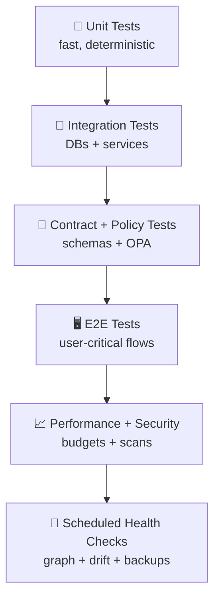

# 🧪 KFM Test Policy (Fail-Closed, Evidence-First)


> **KFM ships trust.** If we can’t prove it (tests, provenance, policy gates), we don’t ship it. ✅

---

## 📌 TL;DR (Non‑Negotiables)

- ✅ **Fail closed**: If a check can’t run or a rule can’t be proven → **block**.
- ✅ **Data is code**: Any dataset change must carry **STAC/DCAT/PROV** + pass the **Policy Pack**.
- ✅ **Provenance is mandatory**: No orphan lineage, no broken edges, no “mystery data”.
- ✅ **Focus Mode must cite**: If the AI can’t cite sources, it **refuses**.
- ✅ **Agents open PRs only**: Automation can propose changes, **never auto-merge**.
- ✅ **Signed artifacts**: Build outputs and large geospatial artifacts must be **verifiable** (digest + signature).
- ✅ **Graph is testable**: The knowledge graph gets **health checks like code** (scheduled).

---

## 🧭 Scope

This policy covers **all** quality gates and test expectations for:

- 🧱 **Pipelines & ingestion** (raw → processed → catalogs → graph → API/UI)
- 🗺️ **Geospatial artifacts** (vector/raster/tiles/3D)
- 🧠 **AI / Focus Mode** (retrieval, citations, safety, drift)
- 🧩 **API layer** (REST + GraphQL, schemas, authz)
- 🖥️ **Web UI** (React + MapLibre/Cesium, story nodes, timeline, accessibility)
- 🔐 **Governance** (OPA/Rego Policy Pack, FAIR/CARE enforcement)
- 🧬 **Knowledge graph** (Neo4j integrity and provenance completeness)
- 📦 **Supply chain** (SBOM/signatures, secrets prevention)

---

## 📖 Terminology (MUST / SHOULD / MAY)

We use RFC‑style keywords:

- **MUST** = required for merge/release
- **SHOULD** = strongly recommended; exceptions require rationale in PR
- **MAY** = optional/experimental; do not block merge unless explicitly promoted to MUST

---

## 🏗️ Test Pyramid (How KFM Stays Fast *and* Reliable)



**Rule of thumb**:  
- Bugs should be caught as low as possible (unit/contract)  
- Trust issues (data, provenance, policy) are caught as gates **before** users ever see them

---

## 🚦 Required Quality Gates (Merge Blocking)

A Pull Request is mergeable only when **all required gates pass**.

### ✅ Gate 0 — Hygiene (fast, always-on)
- **MUST** run: format + lint (Python + TS)
- **MUST** run: type checks (where applicable)
- **MUST** run: dependency + secrets scans
- **SHOULD** run: docs lint / link checks

### ✅ Gate 1 — Unit Tests
- **MUST**: backend unit tests (`pytest`)
- **MUST**: frontend unit tests (`jest`/`vitest` style runner)
- **SHOULD**: golden tests for deterministic transforms

### ✅ Gate 2 — Integration Tests
- **MUST** for touched components:
  - PostGIS integration
  - Neo4j integration
  - API ↔ DB adapters
- **SHOULD** use **docker compose** (or equivalent) for parity

### ✅ Gate 3 — Data Contracts + Catalog Validity
- **MUST** validate:
  - STAC Items/Collections
  - DCAT Dataset records
  - PROV bundles / lineage references
- **MUST** validate geospatial correctness:
  - projection expectations
  - geometry validity
  - bounding boxes / extents consistency

### ✅ Gate 4 — Policy Pack (OPA/Rego via Conftest)
- **MUST** pass all fail-closed policies for changed files:
  - license presence
  - required metadata fields
  - sensitivity classification
  - provenance completeness
  - secrets detection
  - (when applicable) AI output citation requirements

### ✅ Gate 5 — E2E (User-Critical Flows)
- **MUST** for UI/API changes that touch critical paths:
  - search & discovery
  - layer toggles + Layer Info/provenance
  - story node playback
  - Focus Mode Q&A response rendering (with citations)
- **SHOULD** be scoped: run a smaller smoke suite on PR; full suite nightly

---

## 🧠 Evidence‑First Testing Rules (Reproducibility + Determinism)

KFM tests MUST be:

- 🔁 **Deterministic**: reruns produce the same results
- 🌱 **Seeded**: any randomness MUST use explicit seeds
- 🧱 **Hermetic**: no hidden network calls (use fixtures / VCR recordings / mocks)
- 🧾 **Auditable**: test outputs should include enough metadata to reproduce failures

**If a test cannot be deterministic**, it MUST be:
- isolated to a nightly suite, and
- guarded by retry rules + flake tracking, and
- accompanied by a deterministic lower-level test that verifies core logic.

---

## 📦 Test Data & Fixtures Policy

### Golden Data Sets (MUST for key transforms)
- Keep **small, representative** datasets under version control.
- Store **checksums** for each golden input/output.
- Include at least:
  - a STAC Item + Collection pair
  - a DCAT Dataset record
  - a PROV bundle for the same dataset
  - a minimal GeoJSON/GeoParquet + sample tile artifact reference

### Sensitive Data Fixtures (MUST)
- Use **synthetic** sensitive data to test:
  - classification rules
  - obfuscation/fuzzing paths
  - role-based access enforcement
- Never store real PII/secrets in tests.

### External Feeds Fixtures (SHOULD)
For watcher-based ingestion (e.g., GTFS-RT, sensors):
- store a captured response fixture
- test ETag/Last-Modified behavior
- test idempotency (same input → same output IDs)

---

## 🧑‍⚖️ Policy-as-Code Testing (OPA/Rego)

### Policy Pack is a Test Suite
Policies are treated like tests:
- **MUST** be versioned in-repo
- **MUST** be run in CI on every PR that changes data, schemas, configs, or governance rules
- **MUST** be fail-closed by default

### Policy Development Rules
- Every new policy MUST include:
  - ✅ a passing fixture
  - ❌ a failing fixture
  - a short rationale (what harm it prevents)
  - an upgrade path (how contributors comply)

### Suggested Commands (examples)
```bash
# Run policy pack against changed files
conftest test . --policy tools/validation/policy

# Run specific policy set (example path)
conftest test data/ catalogs/ --policy tools/validation/policy
```

---

## 🧬 Knowledge Graph Testing (Neo4j as a “Living Unit Test”)

### Scheduled Graph Health Check (MUST weekly)
Treat the graph like code: run automated queries and validations on a schedule.

**Checks SHOULD include**:
- 📊 node/relationship count deltas (smoke test)
- 🧱 constraint + index integrity (must be online/valid)
- 🧵 orphan detection (unlinked STAC/DCAT/PROV nodes)
- ⏱️ ingestion lag per source (SLA monitoring)
- 🌐 hub detection (runaway top-degree nodes)
- 🧾 property schema drift sampling
- 💾 backup verification (test restore)

**Artifacts MUST be saved** (trendable):
- `docs/reports/qa/graph_health/<timestamp>/...`
- summary + CSV outputs (IDs, counts, failure lists)

---

## 🛰️ Pipelines & Data Intake Testing

### Pipeline Phases (Conceptual)
- `data/raw/` (immutable inputs)
- `data/work/` (staging/sandbox runs)
- `data/processed/` (promoted outputs)
- `catalogs/` (STAC/DCAT/PROV publication)
- `graph/` (Neo4j import snapshots)
- `api/` & `web/` (serving + UX)

### Intake Tests MUST Cover
- schema validation at each promotion step
- provenance completeness at each promotion step
- rollback capability (revert PR → revert state)
- “no UI points to workbench” (no experimental artifacts in production)

---

## 🎛️ Simulation & Modeling (kfm-sim-run) — V&V Policy

Simulations are **first-class datasets** and MUST meet a higher bar:

### MUST
- pin inputs by digest/hash
- capture parameters and environment
- record random seeds
- run a small CI scenario regression test
- provide verification tests (unit/regression)
- provide validation evidence (compare to observations where possible)
- provide uncertainty quantification (UQ) at least minimally

### SHOULD
- separate calibration vs validation data
- publish ensemble stats (mean/variance)
- document instability regions

---

## 🤖 AI / Focus Mode Test Requirements

### Required Behaviors (MUST)
- **Citation coverage**: answers include citations to source material
- **Policy compliance**: content rules applied (no disallowed/sensitive output)
- **Prompt security**: resist prompt injection attempts
- **Drift monitoring readiness**: evaluation harness exists and can run periodically

### AI Test Suites (Recommended Layout)
- ✅ `ai_eval/known_facts.jsonl` (golden Q/A with expected citations)
- ✅ `ai_eval/red_team_prompts.jsonl` (prompt injection attempts)
- ✅ `ai_eval/bias_checks.jsonl` (diverse query set)
- ✅ `ai_eval/retrieval_regression/` (RAG grounding tests)

### “Refuse if you can’t cite” Rule
If retrieval returns no eligible sources, Focus Mode MUST refuse or clearly say it cannot answer (no hallucinated certainty).

---

## 🕵️‍♂️ Automation Agents (Watcher → Planner → Executor)

Automation MUST be **safe, auditable, and reversible**.

### Invariants (MUST)
- Watcher emits immutable facts/alerts only
- Planner produces deterministic plans (replayable)
- Executor opens PRs only — **never merges**
- all actions have idempotency keys / reproducible seeds
- kill-switch disables all agent actions immediately

### Agent Tests MUST Include
- “no-merge” enforcement test
- deterministic plan generation test
- idempotency test (same input → same PR content)
- kill-switch test
- policy compliance test (agent PR must pass same gates)

---

## 🖥️ API Test Policy (FastAPI + Schemas)

### MUST
- request/response schema validation (Pydantic models)
- contract tests for OpenAPI (and GraphQL if exposed)
- authn/authz tests for protected endpoints
- input sanitization tests for user-provided text (especially AI endpoints)

### SHOULD
- rate limiting tests
- pagination + filtering correctness tests
- backward compatibility tests for published API versions

---

## 🗺️ UI Test Policy (React + MapLibre/Cesium)

### MUST
- accessibility checks on core screens:
  - keyboard navigation
  - semantic structure + ARIA roles for custom widgets
  - high-contrast mode (if implemented)
- provenance UX checks:
  - Layer Info shows source + license + preparation summary
  - AI responses render citations clearly
- smoke rendering tests for:
  - 2D map viewer (MapLibre)
  - 3D globe/terrain view (Cesium)
  - timeline navigation
  - story node playback controls

### SHOULD
- offline pack tests (cache behavior, degraded mode)
- performance budgets (map interactions remain responsive)
- cross-browser sanity (at least Chromium + one alt engine)

---

## 🔐 Security, Privacy & Supply Chain Testing

### MUST
- secrets scanning (code + JSON/YAML)
- SAST/CodeQL (where available)
- dependency vulnerability scanning
- signed artifact verification for released build outputs (where adopted)
- policy tests for sensitive data handling:
  - obfuscation/generalization rules
  - role-based access enforcement
  - no accidental exposure via export/share features

### SHOULD
- SBOM generation verification in release workflows
- container image signature verification (if deploying containers)
- threat-model regression tests for known attack paths (prompt injection, upload abuse)

---

## 📈 Performance & Reliability

### PR-level (SHOULD)
- prevent obvious regressions:
  - build time spikes
  - memory explosions
  - major query slowdowns for representative endpoints

### Nightly/Release (MUST for releases)
- load tests for key endpoints
- map render + interaction responsiveness checks
- large artifact download tests (digest pinned)

---

## 🧾 Evidence Manifests for Stories & Narratives

Story Nodes SHOULD attach:
- a human-readable citations block (3–7 lines)
- a machine-readable evidence manifest (YAML/JSON)
- a compact PROV snippet linking story to sources

When story nodes affect user trust (public narratives), these SHOULD be promoted to MUST.

---

## 🧰 Suggested Test Directory Layout

```text
🧪 tests/
├─ ✅ TEST_POLICY.md
├─ 🧩 unit/
│  ├─ api/
│  ├─ pipelines/
│  ├─ graph/
│  └─ web/
├─ 🔌 integration/
│  ├─ postgis/
│  ├─ neo4j/
│  └─ api_contracts/
├─ 🧭 policy/
│  ├─ fixtures_pass/
│  ├─ fixtures_fail/
│  └─ rego/
├─ 🤖 ai_eval/
│  ├─ known_facts.jsonl
│  ├─ red_team_prompts.jsonl
│  └─ bias_checks.jsonl
├─ 🖥️ e2e/
│  └─ cypress/ (or playwright/)
├─ 📦 fixtures/
│  ├─ stac/
│  ├─ dcat/
│  ├─ prov/
│  ├─ geo/
│  └─ feeds/
└─ 🧬 scheduled/
   ├─ graph_health/
   └─ drift_monitoring/
```

---

## 🗓️ CI/CD Test Schedule (Recommended)

| Suite | PR | Nightly | Weekly | Release |
|------|----|---------|--------|---------|
| Hygiene (lint/type/secrets) | ✅ | ✅ | ✅ | ✅ |
| Unit tests | ✅ | ✅ | ✅ | ✅ |
| Integration (DBs) | ✅ (touched) | ✅ | ✅ | ✅ |
| Policy Pack (OPA/Rego) | ✅ | ✅ | ✅ | ✅ |
| E2E (smoke) | ✅ (touched) | ✅ | ✅ | ✅ |
| E2E (full) | ➖ | ✅ | ✅ | ✅ |
| Graph health checks | ➖ | ➖ | ✅ | ✅ (pre-release) |
| AI eval + drift harness | ➖ | ✅ | ✅ | ✅ |
| Perf/load | ➖ | ✅ | ➖ | ✅ |
| Backup verify | ➖ | ➖ | ✅ | ✅ |

---

## 👥 Ownership & Review Expectations

- Any change to **policy gates** MUST be reviewed by governance maintainers.
- Any change to **data catalogs** MUST be reviewed by data maintainers.
- Any change to **AI evaluation rules** MUST be reviewed by AI maintainers.
- Any change to **security rules** MUST be reviewed by security maintainers.

**Rule:** Whoever merges a change owns the regression if it breaks production.

---

## ✅ Definition of Done (DoD) Checklist

Before requesting review:

- [ ] Unit tests added/updated for the change
- [ ] Integration tests added if crossing service boundaries
- [ ] Data changes include STAC/DCAT/PROV updates
- [ ] Policy fixtures added if changing governance rules
- [ ] UI changes include accessibility verification
- [ ] AI changes include evaluation/diff on known-facts suite
- [ ] Any new artifact output is digest-addressable and verifiable (when applicable)
- [ ] Rollback story documented (what to revert if it breaks)

---

## 📚 References (Project Docs)

These documents define KFM’s architecture and trust model; this test policy implements their quality intent:

- 📘 KFM – Comprehensive Technical Documentation
- 🧱 KFM – Comprehensive Architecture, Features, and Design
- 🤖 KFM – AI System Overview
- 🖥️ KFM – Comprehensive UI System Overview
- 📥 KFM Data Intake – Technical & Design Guide
- 💡 KFM – Latest Ideas & Future Proposals
- 🧠 Innovative Concepts to Evolve KFM
- 🧩 Additional Project Ideas (Pulse/Health Checks, Policy-as-tests)
- 📦 Reference Portfolios (open in Acrobat): AI Concepts & more, Data Management, Maps/WebGL, Programming Languages & Resources
