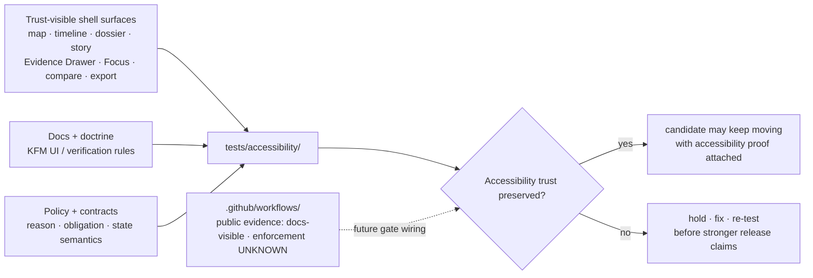

<!-- [KFM_META_BLOCK_V2]
doc_id: kfm://doc/NEEDS-VERIFICATION__tests_accessibility_readme
title: accessibility
type: standard
version: v1
status: published
owners: @bartytime4life
created: YYYY-MM-DD
updated: YYYY-MM-DD
policy_label: public
related: [../README.md, ../../README.md, ../../.github/README.md, ../../.github/workflows/README.md, ../../.github/CODEOWNERS]
tags: [kfm, tests, accessibility, verification, trust-visible-ui]
notes: [doc_id, created, and updated remain placeholders pending live-checkout metadata verification; status reflects surfaced public-main README presence, not executable suite maturity]
[/KFM_META_BLOCK_V2] -->

<a id="top"></a>

# accessibility

Governed accessibility verification family for KFM trust-visible shell behavior, keyboard-critical flows, reduced-motion handling, and calm failure.

| Field | Value |
|---|---|
| **Status** | experimental |
| **Owners** | `@bartytime4life` |
| **Path** | `tests/accessibility/README.md` |
| **Repo fit** | Focused accessibility verification family inside `tests/` for map-first trust surfaces, Evidence Drawer reachability, Focus outcomes, non-color-only cues, and same-page recovery. |
| **Truth posture** | CONFIRMED directory role from surfaced repo-facing docs · PROPOSED starter test burden · UNKNOWN executable suite depth and active enforcement |
| **Quick jumps** | [Scope](#scope) · [Repo fit](#repo-fit) · [Accepted inputs](#accepted-inputs) · [Exclusions](#exclusions) · [Current verified snapshot](#current-verified-snapshot) · [Directory tree](#directory-tree) · [Quickstart](#quickstart) · [Usage](#usage) · [Diagram](#diagram) · [Tables](#tables) · [Task list](#task-list--definition-of-done) · [FAQ](#faq) · [Appendix](#appendix) |


> [!IMPORTANT]
> Surfaced repo-facing documentation confirms `tests/accessibility/` as an explicit accessibility verification family, but the current public-main snapshot is README-only. Treat runner choice, executable case depth, screenshot baselines, active workflow gates, and merge-blocking enforcement as **NEEDS VERIFICATION** until a checked-out branch proves them directly.

> [!NOTE]
> In KFM, accessibility is not decorative polish. This family exists to prove that users can still inspect evidence, time scope, policy state, freshness, correction cues, and finite outcomes when pointer use, motion tolerance, color perception, screen-reader dependency, or device size varies.

---

## Scope

`tests/accessibility/` is the accessibility-critical verification family within KFM’s governed `tests/` surface.

Its job is narrower than “all UI testing” and more consequential than generic visual QA. This family should prove whether trust-visible surfaces remain operable when a user relies on keyboard navigation, assistive technology, reduced-motion settings, non-color-only signaling, narrow viewport layouts, or same-page recovery from guarded outcomes.

The main questions here are:

- Can a user reach and inspect consequential evidence without pointer-only affordances?
- Do map-first shell surfaces keep time, freshness, policy, and correction cues perceivable?
- Do `ABSTAIN`, `DENY`, and `ERROR` preserve shell context instead of ejecting the user into dead-end failure?
- Does motion remain optional without hiding meaning or changing trust state?
- Do compressed layouts preserve the evidence contract instead of hiding it behind decorative controls?

### Truth posture used in this README

| Label | Meaning here |
|---|---|
| **CONFIRMED** | Surfaced repo-facing docs or KFM doctrine directly support the claim. |
| **INFERRED** | Strongly suggested by adjacent docs or doctrine, but not re-proven from a mounted checkout. |
| **PROPOSED** | Buildable test structure or workflow expectation that fits KFM doctrine but is not asserted as current repo fact. |
| **UNKNOWN** | Not verified strongly enough to present as current branch reality. |
| **NEEDS VERIFICATION** | A concrete command, runner, folder depth, gate, or platform setting should be checked before stronger claims are made. |

[Back to top](#top)

---

## Repo fit

**Path:** `tests/accessibility/README.md`

**Role in repo:** family README for accessibility-critical verification of trust-visible product surfaces.

**Upstream anchors:**

| Surface | Why it matters | Status here |
|---|---|---|
| [`../README.md`](../README.md) | Defines the parent `tests/` family map and keeps accessibility explicit rather than burying it under generic regression language. | **CONFIRMED via surfaced repo-facing docs** |
| [`../../README.md`](../../README.md) | Project front door and contributor orientation. | **CONFIRMED as adjacent repo-facing surface** |
| [`../../.github/README.md`](../../.github/README.md) | Repository governance and contributor gatehouse. | **CONFIRMED as adjacent repo-facing surface** |
| [`../../.github/workflows/README.md`](../../.github/workflows/README.md) | Automation lane documentation; does not by itself prove active workflow YAML or branch protection. | **CONFIRMED docs / UNKNOWN enforcement** |
| [`../../.github/CODEOWNERS`](../../.github/CODEOWNERS) | Owner/review boundary; `/tests/` ownership is surfaced as `@bartytime4life`. | **CONFIRMED at `/tests/` scope** |

**Lateral handoffs:**

| Use this directory when… | Use a sibling when… |
|---|---|
| the main burden is access to trust: keyboard reachability, focus return, live outcome announcement, non-color-only trust cues, reduced motion, same-page recovery. | the main burden is contract shape, policy decision logic, cross-boundary integration, whole-path runtime proof, release assembly, deterministic local behavior, or reproducibility. |

Recommended sibling surfaces:

- [`../contracts/`](../contracts/) for contract shape, examples, schema drift, and valid/invalid payload proof.
- [`../policy/`](../policy/) for allow/deny/abstain/hold grammar and policy obligation behavior.
- [`../integration/`](../integration/) for governed cross-boundary slices.
- [`../e2e/`](../e2e/) for full runtime, release, rollback, and correction proof.
- [`../reproducibility/`](../reproducibility/) for rerun consistency, digest stability, and bounded drift.
- [`../unit/`](../unit/) for deterministic local helpers.

**Downstream:** no child files beyond this README are currently confirmed from the surfaced public-main snapshot.

[Back to top](#top)

---

## Accepted inputs

Content belongs in `tests/accessibility/` when the primary proof burden is whether a user can operate, perceive, inspect, or recover from trust-bearing KFM UI states.

Accepted inputs include:

- keyboard-only checks for map shell, layer panel, timeline, Evidence Drawer, Focus Mode, compare controls, and export triggers
- screen-reader and semantic-structure checks for headings, labels, selected-feature updates, drawer structure, outcome banners, and trust-chip changes
- reduced-motion checks for story/camera motion, timeline autoplay, drawer transitions, compare wipes, and other animation that could change meaning
- non-color-only checks for source role, rights, sensitivity, review state, freshness, release state, correction state, generalized geometry, and stale status
- focus-restoration checks after drawers, dialogs, popovers, Focus results, and guarded state banners close
- same-page recovery checks for `ANSWER`, `ABSTAIN`, `DENY`, and `ERROR`
- responsive trust-preservation checks for mobile and narrow viewport layouts
- small, public-safe fixtures or mock states used only to exercise accessibility behavior
- runner-neutral smoke cases that can later be wired to Playwright, Cypress, axe-like checks, Storybook, or repo-native tooling once the checked-out branch proves the runner

> [!TIP]
> Add work here when the hard question is: **“Can a user still access the trust surface?”**  
> Move it elsewhere when the hard question is contract validity, policy correctness, end-to-end release proof, or deterministic computation.

[Back to top](#top)

---

## Exclusions

The following do **not** belong here as authoritative sources of truth:

| Do not put this here | Put it here instead | Reason |
|---|---|---|
| UI component implementations, shell runtime code, or map adapters | `../../apps/`, `../../packages/`, or repo-native UI package paths | Tests should not become the product surface. |
| canonical schemas, OpenAPI files, vocabularies, or standards profiles | `../../contracts/`, `../../schemas/`, and `../../docs/standards/` | This directory can test accessibility consequences, not define contracts. |
| policy bundles, reviewer-role maps, or obligation registries | `../../policy/` | Policy law belongs in policy surfaces; this family checks whether policy state remains perceivable. |
| release manifests, receipts, proof packs, SBOMs, or promoted artifacts as primary records | governed `data/`, `release/`, or proof/receipt homes | Accessibility checks may consume these references but must not become their authority. |
| generic visual-regression screenshots with no trust-bearing assertion | a visual-regression family if the repo adds one, or `../reproducibility/` for bounded outputs | Screenshots without a declared accessibility burden are weak proof. |
| full runtime outcome proof for request envelopes | `../e2e/runtime_proof/` | Whole-path runtime proof is broader than accessibility reachability. |
| large raw datasets, secrets, branch-local dumps, or sensitive coordinates | governed data lifecycle zones or ignored local paths | `tests/` must stay public-safe and reviewable. |
| claims of WCAG A/AA/AAA conformance without a verified repo standard and runner | owning standards docs plus verified test artifacts | Conformance claims require stronger evidence than a README. |

[Back to top](#top)

---

## Current verified snapshot

**CONFIRMED from surfaced repo-facing documentation:**

- `tests/accessibility/` is a named top-level test family.
- `tests/accessibility/README.md` is the only currently confirmed file in this family.
- The parent `tests/` documentation keeps accessibility as an explicit family rather than folding it into generic UI or regression language.
- `/tests/` ownership is surfaced as `@bartytime4life`.

**UNKNOWN / NEEDS VERIFICATION until a checked-out branch proves it:**

- executable accessibility case inventory
- runner choice and command surface
- screenshots or baseline artifact structure
- active workflow YAML
- branch protection or required-check status
- exact project conformance target
- whether accessibility failures currently block release, docs, or promotion gates

> [!WARNING]
> Do not upgrade this directory from “README-only scaffold with a governed burden” to “active accessibility suite” until direct branch evidence proves executable cases and enforcement.

[Back to top](#top)

---

## Directory tree

### Current confirmed snapshot

```text
tests/
└── accessibility/
    └── README.md
```

### Reading rule

Use the tree above for current branch-facing truth. Do **not** silently convert a present directory into claims about active suites, configured runners, screenshot baselines, merge-blocking gates, or release enforcement.

[Back to top](#top)

---

## Quickstart

### Safe inspection commands

These commands inspect what is present without assuming a specific accessibility runner.

```bash
# inspect this family
find tests/accessibility -maxdepth 3 -type f 2>/dev/null | sort

# inspect the parent tests contract and repo gatehouse
sed -n '1,260p' tests/README.md 2>/dev/null || true
sed -n '1,240p' .github/README.md 2>/dev/null || true
sed -n '1,240p' .github/workflows/README.md 2>/dev/null || true
sed -n '1,200p' .github/CODEOWNERS 2>/dev/null || true

# inspect sibling family READMEs before moving cases across boundaries
sed -n '1,220p' tests/contracts/README.md 2>/dev/null || true
sed -n '1,220p' tests/policy/README.md 2>/dev/null || true
sed -n '1,220p' tests/e2e/README.md 2>/dev/null || true
sed -n '1,220p' tests/integration/README.md 2>/dev/null || true
sed -n '1,220p' tests/reproducibility/README.md 2>/dev/null || true
sed -n '1,220p' tests/unit/README.md 2>/dev/null || true

# look for accessibility-, shell-, and trust-surface vocabulary
grep -RIn "accessib\|a11y\|keyboard\|screen reader\|reduced motion\|Evidence Drawer\|Focus Mode\|ABSTAIN\|DENY\|ERROR" \
  tests docs apps packages policy contracts 2>/dev/null || true

# inventory likely UI-facing files without assuming a framework
find apps packages docs tests -maxdepth 4 -type f 2>/dev/null | \
  grep -E 'accessib|a11y|drawer|focus|story|dossier|map|timeline|compare|export' | sort
```

### First local review pass

1. Verify whether the checked-out branch still matches the surfaced public-main snapshot for this directory.
2. Verify whether any accessibility suite exists beyond README scaffolding.
3. Verify which surface states, keyboard paths, and reduced-motion cases are already covered.
4. Verify whether any workflow or branch rule currently treats accessibility as blocking.
5. Verify whether docs, contracts, policy, and accessibility cases move together when trust-bearing behavior changes.
6. Verify whether any case that starts here should actually live in a sibling family once the burden is better understood.

> [!TIP]
> Do not hard-code Playwright, Cypress, axe-core, Lighthouse, Storybook, or another tool as current repo fact unless the checked-out branch proves that choice. This family owns the burden; the repo chooses the runner.

[Back to top](#top)

---

## Usage

### What this family proves

`tests/accessibility/` should prove whether KFM’s trust-visible shell remains meaningfully usable when a user must inspect evidence under real constraints.

At minimum, this includes:

- reaching claim-adjacent evidence without pointer-only interaction
- preserving map and time context through success and failure
- keeping trust cues legible when motion is reduced or layout is compressed
- restoring focus predictably after transient trust surfaces close
- keeping restricted, stale, generalized, corrected, or policy-denied states understandable without relying on hue alone
- announcing guarded outcomes and live trust-state changes without severing shell context

### What this family must not become

This family must **not** become:

- a vague bucket for “UI regressions”
- a substitute for owning shell or component documentation
- a generic conformance claim surface that hides the actual cases
- a folder of orphaned screenshots with no testable burden
- a place to bury unresolved runner choices behind polished prose
- an end-to-end release gate that bypasses `../e2e/`, policy, or contract proof

### Working rule for new cases

Add work here when the main risk is **access to trust** rather than raw business logic.

Use this family when the hard question is:

> Can a user still operate, inspect, perceive, and recover safely?

Use sibling families when the hard question is about contracts, policy logic, deterministic transforms, reproducibility, or end-to-end release proof.

[Back to top](#top)

---

## Diagram

The diagram below shows this family’s responsibility without pretending current runner wiring is already in place.



[Back to top](#top)

---

## Tables

### Accessibility burden map

| Surface | Minimum accessibility burden | Why it matters in KFM |
|---|---|---|
| **Map shell** | keyboard alternatives for feature selection, pan/zoom-dependent selection, and layer inspection | the map is the entry point, not a pointer-only decoration |
| **Timeline / time controls** | focusable controls, clear current time/scope labels, reduced-motion or restrained playback | time is a coequal operating dimension in KFM |
| **Layer panel / legend** | readable labels, non-color-only symbols, source-role and policy state cues | layer visibility must not imply authority or publication approval |
| **Dossier / Story** | heading structure, readable trust chips, clear link order | durable claim surfaces must remain inspectable, not decorative |
| **Evidence Drawer** | open/close reachability, structure announcement, focus return, evidence sections in logical order | immediate provenance inspection sits closest to consequential claims |
| **Focus Mode** | live outcome semantics and same-page `ANSWER` / `ABSTAIN` / `DENY` / `ERROR` recovery | bounded synthesis must not sever shell context or evidence access |
| **Compare** | synchronized control reachability, non-color-only asymmetry cues, reduced-motion transitions | explicit comparison basis is part of meaning |
| **Export** | preview reachability and trust-cue legibility before outward emit | exported artifacts remain trust-bearing publication surfaces |
| **Mobile / narrow viewport** | stacked or collapsed layouts keep scope, freshness, policy, review, and evidence cues visible | compression cannot hide trust |

### Current repo wiring and standards baseline

| Surface | Working rule | Posture |
|---|---|---|
| **Current public family depth** | `tests/accessibility/` is currently README-only in surfaced public-main evidence. | **CONFIRMED** snapshot |
| **Parent family contract** | Keep accessibility explicit under `tests/accessibility/`, not buried under broad regression language. | **CONFIRMED** repo-facing docs |
| **Sibling family handoff** | Use sibling test families when the burden becomes contract, policy, integration, reproducibility, unit, or whole-flow proof. | **CONFIRMED** structure · case placement still requires review |
| **Workflow enforcement** | Accessibility can be described as gate-worthy, but checked-in workflow YAML and branch protection are not proven here. | **UNKNOWN** effective enforcement |
| **Release/docs gate consequence** | Accessibility failure can be trust-significant enough to block stronger release/docs claims. | **CONFIRMED doctrine · exact wiring UNKNOWN** |
| **External accessibility reference** | Use WCAG 2.2 as a review vocabulary unless repo standards docs declare a different baseline; treat WCAG 3.0 as a watchlist item, not a project conformance claim. | **NEEDS VERIFICATION in repo standards** |
| **Exact repo conformance target** | Do not invent a project-specific A/AA/AAA claim here. Verify it from the checked-out branch or owning standards docs before merge. | **NEEDS VERIFICATION** |

[Back to top](#top)

---

## Task list / Definition of done

Treat this README as healthy only when it stays both useful and truthful.

- [ ] The checked-out branch confirms the real runner(s), command surface, and artifact layout for this family.
- [ ] At least one case exists for each trust-critical burden that the current branch actually claims to support.
- [ ] Keyboard paths cover Evidence Drawer entry/exit, timeline movement, compare controls, Focus outcomes, and export triggers where those surfaces exist.
- [ ] Screen-reader checks cover headings, labels, outcome banners, selected-feature updates, and live trust-state updates.
- [ ] Reduced-motion behavior is explicit and testable rather than implied.
- [ ] Trust cues are not color-only.
- [ ] Closing transient trust surfaces restores focus predictably.
- [ ] `ABSTAIN`, `DENY`, and `ERROR` keep the map/time shell intact and provide safe next actions.
- [ ] Narrow viewport checks prove trust cues remain reachable where claims are shown.
- [ ] Cases that no longer belong here are moved into the correct sibling family instead of stretching this directory into a generic UX bucket.
- [ ] Any workflow, release-gate, or conformance claim is verified against the checked-out branch or GitHub settings before this README is updated to say it is active.
- [ ] Documentation changes stay synchronized with real suite depth instead of outrunning it.

[Back to top](#top)

---

## FAQ

### Why does `tests/accessibility/` need its own family instead of living under generic UI or regression tests?

Because accessibility in KFM is part of the evidence contract. If a user cannot reach the Evidence Drawer, understand stale or restricted state, operate Focus outcomes, or recover from denial and abstention without losing shell context, the trust model exists only on paper.

### Does this README prove the repo already has accessibility tests?

No. It proves the intended directory contract and the surfaced README-only snapshot. Executable tests, runner choice, active checks, and branch protection remain **NEEDS VERIFICATION**.

### Why not name Playwright, Cypress, axe-core, Lighthouse, or Storybook as the runner?

Because runner choice is implementation evidence, not doctrine. This README is runner-neutral until the checked-out branch proves a toolchain. Once the runner is verified, add the command, artifact path, and failure interpretation here.

### Where should an Evidence Drawer keyboard case live?

Start here if the burden is keyboard reachability, focus return, screen-reader structure, or same-page recovery. Move or duplicate a smaller assertion into `../contracts/`, `../policy/`, or `../e2e/` if the main burden is payload shape, policy decision, or whole-path runtime proof.

### Are `ABSTAIN`, `DENY`, and `ERROR` accessibility concerns?

Yes, when the question is whether those states remain perceivable, actionable, and shell-preserving. The semantic contract for those outcomes belongs in runtime/policy/contract surfaces; the operability and recovery proof belongs here.

### Can an accessibility failure block a release?

It can be trust-significant enough to block stronger release or publication claims, but this README does not prove active release-gate wiring. Verify workflow YAML, required checks, and release policy before saying accessibility currently blocks merges or releases.

### Should this README claim WCAG conformance?

Not by itself. It may reference WCAG as a review vocabulary, but A/AA/AAA conformance claims require verified standards docs, actual cases, representative coverage, and reproducible artifacts.

[Back to top](#top)

---

## Appendix

<details>
<summary><strong>Appendix A — Evidence basis and open verification</strong></summary>

### Evidence basis used for this README

This README is grounded in:

1. Surfaced repo-facing documentation that identifies `tests/accessibility/` as an explicit accessibility verification family and currently README-only.
2. Parent `tests/` documentation patterns: metadata block, impact block, quick jumps, repo fit, accepted inputs, exclusions, current snapshot, tree, quickstart, diagrams, tables, and definition of done.
3. KFM UI doctrine that treats MapLibre shell behavior, Evidence Drawer, Focus Mode, finite outcomes, visible trust cues, reduced motion, keyboard operation, and same-page recovery as trust-bearing requirements.
4. Documentation architecture guidance that requires README surfaces to state scope, repo fit, accepted inputs, exclusions, evidence boundary, current snapshot, directory tree, quickstart, diagrams, tables, and definition of done.
5. Current-session workspace evidence that no mounted checkout was available to verify executable suite depth, runner wiring, or platform settings.

### Open verification items

- `doc_id`, `created`, and `updated` values in the meta block
- whether a live branch has child test files under `tests/accessibility/`
- exact accessibility runner and command surface
- whether workflow YAML exists and calls this family
- whether GitHub branch protection requires the accessibility check
- exact standards/conformance target adopted by the repo
- whether accessibility proof is part of promotion or release gates
- whether screenshots, traces, or accessibility reports are stored as artifacts
- whether UI shell paths, Evidence Drawer components, and Focus surfaces are mounted under `apps/`, `packages/`, or another repo-native location

</details>

<details>
<summary><strong>Appendix B — Starter case backlog, still PROPOSED</strong></summary>

Use these as planning names only. Do not claim they exist until checked in.

| Candidate case | Main burden | Likely handoff |
|---|---|---|
| `keyboard_evidence_drawer_open_close` | drawer reachability and focus return | `../e2e/` if it becomes whole-path click-to-drawer proof |
| `focus_outcome_same_page_recovery` | `ABSTAIN`, `DENY`, and `ERROR` stay perceivable with safe next actions | `../e2e/runtime_proof/` for envelope-level assertions |
| `timeline_reduced_motion` | time-control motion can be reduced without hiding scope | `../integration/` if tied to backend time queries |
| `trust_chips_non_color_only` | source, rights, sensitivity, freshness, review, and correction cues do not rely on hue alone | `../contracts/` if payload shape is the failing burden |
| `narrow_viewport_trust_preservation` | mobile layout keeps trust cues attached to claims | UI shell docs if it becomes layout guidance rather than executable proof |
| `export_preview_trust_cues` | export preview remains reachable and shows provenance/correction cues | `../e2e/release_assembly/` for publish-path proof |

</details>

[Back to top](#top)
