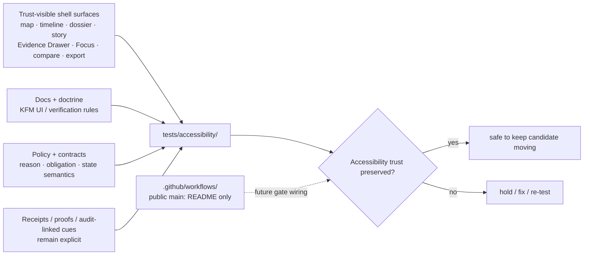

<!-- [KFM_META_BLOCK_V2]
doc_id: kfm://doc/NEEDS_VERIFICATION
title: accessibility
type: standard
version: v1
status: draft
owners: @bartytime4life
created: YYYY-MM-DD
updated: 2026-04-16
policy_label: public
related: [
  ../README.md,
  ../contracts/README.md,
  ../policy/README.md,
  ../validators/README.md,
  ../ci/README.md,
  ../catalog/README.md,
  ../integration/README.md,
  ../e2e/README.md,
  ../reproducibility/README.md,
  ../unit/README.md,
  ../../README.md,
  ../../contracts/README.md,
  ../../policy/README.md,
  ../../schemas/README.md,
  ../../docs/README.md,
  ../../data/receipts/README.md,
  ../../data/proofs/README.md,
  ../../tools/validators/README.md,
  ../../tools/attest/README.md,
  ../../tools/ci/README.md,
  ../../.github/README.md,
  ../../.github/workflows/README.md,
  ../../.github/watchers/README.md,
  ../../.github/CODEOWNERS
]
tags: [kfm, tests, accessibility, verification, trust-visible, keyboard, reduced-motion, receipts, proofs]
notes: [
  doc_id, created, and final merge-time updated stamp remain placeholders pending live-branch metadata verification.
  Updated to align the accessibility family with the fuller tests lattice, explicit receipt/proof separation, validator and attestation adjacency, and the newer workflow and watcher boundary documentation.
  Current public-main evidence still proves this family mainly as a visible README-bearing lane; executable suite depth, runner/toolchain, screenshot baselines, and merge-blocking automation remain bounded until checked directly on the working branch.
]
[/KFM_META_BLOCK_V2] -->

<a id="top"></a>

# `accessibility`

Governed accessibility verification family for KFM trust-visible shell behavior, keyboard-critical flows, reduced-motion handling, same-page recovery, and calm failure.

> **Status:** experimental  
> **Owners:** `@bartytime4life`  
> **Path:** `tests/accessibility/README.md`  
> **Repo fit:** focused accessibility verification family inside `tests/` for map-first trust surfaces, Evidence Drawer reachability, Focus outcomes, non-color-only cues, and same-page recovery  
> **Quick jump:** [Scope](#scope) · [Repo fit](#repo-fit) · [Accepted inputs](#accepted-inputs) · [Exclusions](#exclusions) · [Current verified snapshot](#current-verified-snapshot) · [Directory tree](#directory-tree) · [Quickstart](#quickstart) · [Usage](#usage) · [Diagram](#diagram) · [Tables](#tables) · [Task list](#task-list--definition-of-done) · [FAQ](#faq) · [Appendix](#appendix)
>
>        

> [!IMPORTANT]
> Current public `main` confirms `tests/accessibility/` exists, but it currently exposes `README.md` only. Treat deeper suite shape, runner choice, screenshot baselines, and merge-blocking enforcement as **NEEDS VERIFICATION** until a checked-out branch proves them directly.

> [!TIP]
> In KFM, accessibility is not decorative polish.
>
> This family exists to prove that users can still inspect evidence, time scope, policy state, freshness, correction cues, and trust-bearing outcomes when pointer use, motion tolerance, color perception, screen-reader dependency, or device size varies.

> [!TIP]
> Keep the KFM trust split visible here:
>
> **accessibility proof ≠ contract authority ≠ policy authority ≠ validator proof ≠ renderer proof ≠ receipt authority ≠ proof authority**
>
> - `tests/accessibility/` proves access to trust-visible surfaces
> - `tests/contracts/` proves shape and valid/invalid examples
> - `tests/policy/` proves decision behavior
> - `tests/validators/` proves gate behavior
> - `tests/ci/` proves renderer behavior
> - receipts remain process memory
> - proofs remain higher-order trust objects

---

## Scope

`tests/accessibility/` is the accessibility-critical verification family within KFM’s governed `tests/` surface.

Its job is narrower than “all UI testing” and more consequential than generic visual QA. This is the family that should prove whether trust-visible surfaces remain operable when the user must rely on keyboard navigation, assistive technology, reduced-motion settings, non-color-only signaling, or same-page recovery from guarded outcomes.

The main questions here are:

- can a user reach and inspect consequential evidence without pointer-only affordances?
- do map-first shell surfaces keep time, freshness, policy, and correction cues perceivable?
- do `ABSTAIN`, `DENY`, and `ERROR` preserve shell context instead of ejecting the user into dead-end failure?
- does motion remain optional without hiding meaning or changing truth state?
- do trust cues remain understandable when receipts, proofs, policy state, or correction state participate indirectly in the same surface?

### What this family should prove

- keyboard reachability to trust-bearing surfaces
- screen-reader legibility for outcomes, evidence, scope, and state changes
- reduced-motion operation without losing meaning
- non-color-only trust cues for freshness, restriction, correction, and knowledge character
- predictable focus return after transient trust surfaces close
- same-page recovery from guarded outcomes
- compressed/mobile layout preservation of trust cues
- explicit accessibility of surfaces that indirectly expose receipt/proof or audit-linked state without flattening those roles

### What this family should not absorb

- contract-shape validation by itself
- policy grammar by itself
- validator-only behavior
- renderer-only behavior
- catalog-helper-only behavior
- full end-to-end runtime, release, or correction proof
- receipt or proof storage semantics
- generic “UI regression” buckets with no trust-bearing burden

### Truth posture used in this README

| Label | Meaning here |
|---|---|
| **CONFIRMED** | Visible on the current public branch or directly grounded in current KFM doctrine |
| **INFERRED** | Strongly suggested by adjacent repo docs or doctrine, but not re-proven from a mounted checkout |
| **PROPOSED** | Buildable test structure or workflow expectation that fits KFM doctrine but is not asserted as current repo fact |
| **UNKNOWN** | Not verified strongly enough in this session to present as current branch reality |
| **NEEDS VERIFICATION** | A specific command, runner, folder depth, gate, or platform setting that should be checked before merge |

[Back to top](#top)

## Repo fit

**Path:** `tests/accessibility/README.md`

**Role in repo:** family README for accessibility-critical verification of trust-visible product surfaces.

**Upstream:** [../README.md](../README.md) · [../../README.md](../../README.md) · [../../.github/README.md](../../.github/README.md) · [../../.github/workflows/README.md](../../.github/workflows/README.md)

**Downstream:** no child files beyond this README are currently confirmed on public `main`

### Upstream anchors

| Surface | Why it matters | Status here |
|---|---|---|
| [../README.md](../README.md) | defines the `tests/` family map and explicitly reserves `./accessibility/` for trust-visible interaction, keyboard flow, reduced-friction inspection, and calm failure | **CONFIRMED** |
| [../../README.md](../../README.md) | sets repo-wide evidence-first, verification-first posture | **CONFIRMED** |
| [../../.github/README.md](../../.github/README.md) | explains the repo gatehouse and documentary-grounded / live-checkout-bounded posture | **CONFIRMED** |
| [../../.github/workflows/README.md](../../.github/workflows/README.md) | documents workflow intent and current public-main visibility of the automation lane | **CONFIRMED** |
| [../../.github/watchers/README.md](../../.github/watchers/README.md) | sharpens watcher/process-memory boundaries that may affect trust-visible freshness or state cues | **CONFIRMED** |
| [../../.github/CODEOWNERS](../../.github/CODEOWNERS) | provides current `/tests/` ownership boundary | **CONFIRMED** |
| [../../contracts/README.md](../../contracts/README.md) | keeps contracts canonical so accessibility cases exercise them instead of replacing them | **CONFIRMED** |
| [../../policy/README.md](../../policy/README.md) | keeps deny-by-default, cite-or-abstain, and correction posture close to the same test family | **CONFIRMED** |
| [../../docs/README.md](../../docs/README.md) | keeps long-form runbooks, standards notes, and operator procedures out of this family | **CONFIRMED** |
| [../../data/receipts/README.md](../../data/receipts/README.md) | keeps process-memory boundaries explicit when trust cues expose receipt-linked state | **CONFIRMED** |
| [../../data/proofs/README.md](../../data/proofs/README.md) | keeps higher-order proof boundaries explicit when trust cues expose proof-linked state | **CONFIRMED** |
| [../../tools/validators/README.md](../../tools/validators/README.md) | validator-only burdens should stay there when accessibility is not the main risk | **CONFIRMED** |
| [../../tools/attest/README.md](../../tools/attest/README.md) | attestation visibility may matter, but sign/verify ownership remains elsewhere | **CONFIRMED** |
| [../../tools/ci/README.md](../../tools/ci/README.md) | renderer-proof and summary formatting should stay explicit when that is the main burden | **CONFIRMED** |

### Confirmed sibling handoff map

| When the main burden is… | Route work to | Working rule |
|---|---|---|
| machine-readable object shape, valid/invalid fixture packs, contract drift | [../contracts/README.md](../contracts/README.md) | keep accessibility cases focused on access to trust, not contract-law shape checking |
| policy outcomes, deny/allow behavior, obligation codes, or runtime decision semantics | [../policy/README.md](../policy/README.md) | exercise policy from here only when the primary risk is perceivability or recovery |
| validator-only or gate-only behavior | [../validators/README.md](../validators/README.md) | accessibility may observe gate state, but should not become gate-proof by default |
| renderer-only or handoff formatting behavior | [../ci/README.md](../ci/README.md) | accessibility cases may consume rendered cues, but formatting proof remains separate |
| cross-boundary glue between components, shells, or services | [../integration/README.md](../integration/README.md) | integration belongs with the slice that proves the wiring |
| release proof, runtime proof, or correction drills across multiple surfaces | [../e2e/README.md](../e2e/README.md) | use e2e when the burden is the whole governed flow rather than shell operability alone |
| deterministic local behavior inside one unit of code | [../unit/README.md](../unit/README.md) | keep local logic out of this family unless the accessibility burden is the actual thing under test |
| rerun stability, bounded regression, or reproducible rebuild behavior | [../reproducibility/README.md](../reproducibility/README.md) | reproducibility is a sibling proof lane, not an implied outcome here |
| catalog closure helper behavior | [../catalog/README.md](../catalog/README.md) | metadata closure is distinct from trust-surface operability |

> [!TIP]
> Accessibility cases often touch contracts, policy, validators, receipts, proofs, and e2e behavior, but this directory should stay anchored to one question:
>
> **can the user still reach, inspect, understand, and recover safely?**

## Accepted inputs

Content that belongs in `tests/accessibility/` includes:

- keyboard-path cases for map-adjacent controls, timeline interactions, drawer toggles, compare controls, export actions, and other trust-bearing UI entry points
- screen-reader-oriented checks for headings, labels, announcements, live-region behavior, and trust cue legibility
- reduced-motion cases for fly-to behavior, autoplay, compare transitions, and any other shell choreography that can obscure meaning or destabilize context
- non-color-only cue checks for freshness, restriction, correction, policy, and knowledge-character signaling
- focus-restoration checks when Evidence Drawer, Focus Mode, dialogs, panels, or expandable trust surfaces close
- same-page recovery checks for `ABSTAIN`, `DENY`, and `ERROR`
- mobile or compressed-layout checks that verify trust cues stay visible when density changes
- accessibility-focused fixtures, baseline captures, and minimal helper docs that make this family reviewable
- trust-surface examples where receipt/proof-linked or audit-linked cues must stay perceivable without becoming the primary authority surface

### Input rules

1. Keep the burden accessibility-led.
2. Use the smallest surface that still proves access to trust.
3. Reuse authoritative contract/policy/trust objects from their owning lanes instead of cloning them locally.
4. If a case exposes receipt/proof or audit-linked cues, keep those roles explicit and secondary.
5. Do not rely on color alone to communicate trust state in fixtures, baselines, or acceptance criteria.

## Exclusions

The following do **not** belong here as canonical sources of truth:

- policy rule bodies, reason-code registries, or obligation vocabularies → keep them under [../../policy/](../../policy/)
- contract shapes, schema files, or OpenAPI definitions → keep them under [../../contracts/](../../contracts/) and adjacent schema surfaces
- runtime UI implementation, map adapter code, or shell components → keep them under code-owning surfaces such as `apps/` or `packages/`
- generic design-system prose, WCAG explainer material, or long-form operator guidance → keep them under [../../docs/](../../docs/)
- release manifests, proof packs, correction notices, receipts, or proofs as primary records → keep them in their governed artifact homes
- validator-only or renderer-only assertions where accessibility is not the main burden
- performance-only tests with no accessibility or trust-surface consequence
- generic “pixel diff” checks that cannot explain what accessibility burden they are protecting

> [!IMPORTANT]
> An accessibility case may **use** trust-bearing objects or cues.
> It should not become the lane that owns their canonical meaning.

## Current verified snapshot

The current public `main` branch proves the following:

- `tests/accessibility/` exists as a real test family beneath `tests/`
- public `main` currently shows `tests/accessibility/README.md` and no additional child files in this family
- the parent [../README.md](../README.md) keeps accessibility explicit instead of hiding it under generic regression language
- confirmed sibling family readmes exist under `tests/contracts/`, `tests/e2e/`, `tests/integration/`, `tests/policy/`, `tests/reproducibility/`, and `tests/unit/`
- `tests/validators/`, `tests/ci/`, and `tests/catalog/` are also now explicit neighboring family docs that help keep placement honest
- the current public `.github/workflows/` lane is documented, but public `main` shows `README.md` only there
- public `.github/watchers/README.md` exists and sharpens watcher/process-memory boundaries
- `/.github/CODEOWNERS` assigns `/tests/` to `@bartytime4life`; a narrower `tests/accessibility/` override is not separately listed
- explicit receipt/proof boundary docs now exist, which means accessibility cases can describe trust cues more cleanly without flattening process memory and higher-order proofs into one generic “status”

> [!WARNING]
> A visible directory is a **contract boundary**, not proof of mature coverage. This family should stay explicit about what is confirmed now versus what the checked-out branch still has to prove.

## Directory tree

### Current confirmed snapshot

```text
tests/
└── accessibility/
    └── README.md
```

### Reading rule

Use the tree above for **current branch truth**. Do **not** silently convert a present directory into claims about active suites, configured runners, screenshot baselines, merge-blocking gates, or release enforcement.

### Proposed maturity direction

```text
tests/
└── accessibility/
    ├── README.md
    ├── keyboard/
    ├── screen_reader/
    ├── reduced_motion/
    ├── trust_cues/
    └── recovery/
```

Treat that as **PROPOSED** structure, not current repo fact.

[Back to top](#top)

## Quickstart

### Safe inspection commands

These commands are branch-safe because they inspect what is present without assuming a specific accessibility runner.

```bash
# inspect the family itself
find tests/accessibility -maxdepth 3 -type f 2>/dev/null | sort

# inspect the parent tests contract and repo gatehouse
sed -n '1,260p' tests/README.md 2>/dev/null || true
sed -n '1,240p' .github/README.md 2>/dev/null || true
sed -n '1,240p' .github/workflows/README.md 2>/dev/null || true
sed -n '1,240p' .github/watchers/README.md 2>/dev/null || true
sed -n '1,200p' .github/CODEOWNERS 2>/dev/null || true

# inspect sibling family readmes before moving cases across boundaries
sed -n '1,220p' tests/contracts/README.md 2>/dev/null || true
sed -n '1,220p' tests/policy/README.md 2>/dev/null || true
sed -n '1,220p' tests/validators/README.md 2>/dev/null || true
sed -n '1,220p' tests/ci/README.md 2>/dev/null || true
sed -n '1,220p' tests/catalog/README.md 2>/dev/null || true
sed -n '1,220p' tests/e2e/README.md 2>/dev/null || true
sed -n '1,220p' tests/integration/README.md 2>/dev/null || true
sed -n '1,220p' tests/reproducibility/README.md 2>/dev/null || true
sed -n '1,220p' tests/unit/README.md 2>/dev/null || true

# inspect authority and trust surfaces before inventing local copies
sed -n '1,220p' contracts/README.md 2>/dev/null || true
sed -n '1,220p' policy/README.md 2>/dev/null || true
sed -n '1,220p' docs/README.md 2>/dev/null || true
sed -n '1,220p' data/receipts/README.md 2>/dev/null || true
sed -n '1,220p' data/proofs/README.md 2>/dev/null || true
sed -n '1,220p' tools/validators/README.md 2>/dev/null || true
sed -n '1,220p' tools/attest/README.md 2>/dev/null || true
sed -n '1,220p' tools/ci/README.md 2>/dev/null || true

# look for accessibility-, shell-, and trust-surface vocabulary
grep -RIn "accessib\|a11y\|keyboard\|screen reader\|reduced motion\|Evidence Drawer\|Focus Mode\|ABSTAIN\|DENY\|ERROR\|receipt_ref\|proof_ref" \
  tests docs apps packages policy contracts data tools 2>/dev/null || true

# inventory likely UI-facing files without assuming a framework
find apps packages docs tests -maxdepth 4 -type f 2>/dev/null | \
  grep -E 'accessib|a11y|drawer|focus|story|dossier|map|timeline|compare|export' | sort
```

### First local review pass

1. Verify whether the checked-out branch still matches the public `main` snapshot for this directory.
2. Verify whether any accessibility suite exists beyond README scaffolding.
3. Verify which surface states, keyboard paths, reduced-motion cases, and trust cues are already covered.
4. Verify whether any workflow or branch rule currently treats accessibility as blocking.
5. Verify whether docs, contracts, policy, accessibility cases, and trust-surface cues move together when behavior changes.
6. Verify whether any case that starts here should actually live in a sibling family once the burden is better understood.

> [!TIP]
> Do not hard-code Playwright, Cypress, axe-core, Lighthouse, Storybook, or any other tool into this README unless the checked-out branch proves that choice. This family owns the burden; the repo chooses the runner.

## Usage

### What this family proves

`tests/accessibility/` should prove whether KFM’s trust-visible shell remains meaningfully usable when the user must inspect evidence under real constraints.

That includes, at minimum:

- reaching claim-adjacent evidence without pointer-only interaction
- preserving map and time context through success and failure
- keeping trust cues legible when motion is reduced or layout is compressed
- restoring focus predictably after transient trust surfaces close
- keeping restricted, stale, generalized, corrected, or audit-linked states understandable without relying on hue alone

### What this family must not become

This family must **not** become:

- a vague bucket for “UI regressions”
- a substitute for the owning shell or component documentation
- a generic conformance claim surface that hides the actual cases
- a folder of orphaned screenshots with no testable burden
- a place to bury unresolved runner choices behind polished prose
- a back door for deciding policy, validator, or trust-object authority through surface behavior alone

### Working rule for new cases

Add work here when the main risk is **access to trust** rather than raw business logic.

Use this family when the hard question is: “Can a user still operate, inspect, perceive, and recover safely?”  
Use sibling families when the hard question is about contracts, policy logic, deterministic local behavior, reproducible rebuilds, validator semantics, renderer semantics, or whole-flow release proof.

### Trust-surface rule

Where a shell surface exposes receipt-linked, proof-linked, policy-linked, or correction-linked state:

- keep receipts as **process memory**
- keep proofs as **higher-order trust objects**
- keep decision or validator outputs as **machine state**
- keep rendered cues as **secondary outward aids**
- do not flatten all of them into one generic “status badge visible” success condition

[Back to top](#top)

## Diagram

The diagram below shows the intended responsibility of this family without pretending current runner wiring is already in place.



## Tables

### Accessibility burden map

| Burden | What this family should prove | Posture |
|---|---|---|
| **Keyboard operation** | map alternatives, timeline controls, drawer open/close, compare actions, and export actions work without pointer-only affordances | **CONFIRMED** burden · executable depth **NEEDS VERIFICATION** |
| **Screen-reader legibility** | Focus outcomes, time semantics, selection changes, and Evidence Drawer structure are labeled and announced clearly enough to inspect meaning | **CONFIRMED** burden · executable depth **NEEDS VERIFICATION** |
| **Reduced motion** | fly-to movement, autoplay, split-view wipes, and long transitions are disabled or simplified without hiding trust cues | **CONFIRMED** burden · executable depth **NEEDS VERIFICATION** |
| **Non-color-only encoding** | freshness, restriction, correction, and knowledge-character cues combine text, iconography, or patterning instead of hue alone | **CONFIRMED** burden · executable depth **NEEDS VERIFICATION** |
| **Focus restoration** | closing Evidence Drawer or Focus returns the user to the invoking control or selected object | **CONFIRMED** burden · executable depth **NEEDS VERIFICATION** |
| **Same-page recovery** | `ABSTAIN`, `DENY`, and `ERROR` preserve shell context and offer safe next actions instead of context-destroying full-page failures | **CONFIRMED** burden · executable depth **NEEDS VERIFICATION** |
| **Mobile trust preservation** | compressed layouts may stack or collapse panels, but scope, freshness, policy, correction, and trust cues stay visible where claims are shown | **CONFIRMED** burden · implementation depth **NEEDS VERIFICATION** |

### Trust-visible shell surfaces this family should pressure-test

| Surface | Primary accessibility burden here | Why it is trust-bearing |
|---|---|---|
| **Map Explorer** | keyboardable selection, evidence launch, and non-pointer reachability | map selection is often the first hop into claim inspection |
| **Timeline** | focusable controls, announced scope change, restrained playback | time is a coequal operating dimension in KFM |
| **Dossier / Story** | heading structure, readable trust chips, clear link order | durable claim surfaces must remain inspectable, not decorative |
| **Evidence Drawer** | open/close reachability, structure announcement, focus return | immediate provenance inspection sits closest to consequential claims |
| **Focus Mode** | live outcome semantics, same-page `ANSWER` / `ABSTAIN` / `DENY` / `ERROR` recovery | bounded synthesis must not sever shell context or evidence access |
| **Compare** | synchronized control reachability, non-color-only asymmetry cues, reduced-motion transitions | explicit comparison basis is part of meaning |
| **Export** | preview reachability and trust-cue legibility before outward emit | exported artifacts remain trust-bearing publication surfaces |

### Current repo wiring and external baseline

| Surface | Working rule | Posture |
|---|---|---|
| **Current public family depth** | `tests/accessibility/` is currently README-only on public `main` | **CONFIRMED** current snapshot |
| **Parent family contract** | keep accessibility explicit under `tests/accessibility/` instead of burying it inside generic regression language | **CONFIRMED** |
| **Sibling family handoff** | use sibling test families when the burden becomes contract, policy, validator, renderer, integration, reproducibility, unit, or whole-flow proof | **CONFIRMED** repo structure · case placement still requires review |
| **Workflow enforcement** | accessibility can be described as gate-worthy, but checked-in workflow YAML for this family is not visible on public `main` | **UNKNOWN** effective enforcement |
| **Release/docs gate consequence** | an accessibility failure can be trust-significant enough to participate in release/docs gate failure | **CONFIRMED** doctrine · exact repo wiring **UNKNOWN** |
| **Receipt/proof cue visibility** | accessibility can and should inspect trust-linked cues without claiming trust-object authority | **CONFIRMED** doctrine · exact local cases **NEEDS VERIFICATION** |
| **Current external accessibility reference** | use WCAG 2.2 as the current standards reference when naming review burdens or evaluating regressions | **CONFIRMED** external baseline |
| **Exact repo conformance target** | do not invent a project-specific A/AA/AAA claim here; verify it from the checked-out branch or owning standards docs before merge | **NEEDS VERIFICATION** |

[Back to top](#top)

## Task list / Definition of done

Treat this README as healthy only when it stays both useful and truthful.

- [ ] The checked-out branch confirms the real runner(s), command surface, and artifact layout for this family.
- [ ] At least one case exists for each trust-critical burden that the current branch actually claims to support.
- [ ] Keyboard paths cover Evidence Drawer entry and exit, timeline movement, compare controls, and export triggers where those surfaces exist.
- [ ] Screen-reader checks cover headings, labels, outcome banners, and any live updates tied to selection or scope change.
- [ ] Reduced-motion behavior is explicit and testable rather than implied.
- [ ] Trust cues are not color-only.
- [ ] Closing transient trust surfaces restores focus predictably.
- [ ] `ABSTAIN`, `DENY`, and `ERROR` keep the map/time shell intact and provide safe next actions.
- [ ] Any receipt/proof or audit-linked cues exposed in the UI remain understandable without flattening their roles.
- [ ] Cases that no longer belong here are moved into the correct sibling family instead of stretching this directory into a generic UX bucket.
- [ ] Any workflow or release gating claim is verified against the checked-out branch or GitHub settings before this README is updated to say it is active.
- [ ] Documentation changes stay synchronized with real suite depth instead of outrunning it.

## FAQ

### Why does `tests/accessibility/` need its own family instead of living under generic UI or regression tests?

Because KFM treats accessibility as part of trust, not polish. If a user cannot inspect evidence or recover safely from a guarded outcome, the system has failed in a public-facing way even if the data and contracts are otherwise correct.

### Does this README claim executable accessibility suites already exist here?

No. It records the current public-branch snapshot as README-only and treats deeper suite shape as **NEEDS VERIFICATION** until the checked-out branch proves it.

### Should automated checks be treated as sufficient?

No. Automation is useful, but some burdens in this family are semantic and interactional: heading structure, announcement quality, motion restraint, focus return, same-page recovery, and trust-cue legibility all benefit from human review alongside automation.

### Should this file set the repo’s exact accessibility conformance level?

No. This file can name the current standard family and the burdens KFM doctrine cares about, but the exact conformance target should be verified from the owning standards or release docs before it is presented as repo fact.

### When should an accessibility case move to another family?

When the decisive burden is no longer shell operability. If the core question becomes contract shape, policy logic, validator semantics, deterministic local behavior, reproducible rebuilds, or whole-flow release proof, hand the case to the sibling family that owns that seam.

### Why mention receipts and proofs here?

Because trust-visible cues sometimes expose process-memory or higher-order proof state. Mentioning them keeps those roles explicit; it does not move ownership into this family.

## Appendix

<details>
<summary>Illustrative starter case matrix (<strong>PROPOSED</strong>)</summary>

These are example burden shapes, not claims about current filenames or checked-in suites.

| Starter case idea | Main burden | Why it matters |
|---|---|---|
| shell selection → Evidence Drawer via keyboard | keyboard operation · focus restoration | proves a user can move from map-adjacent selection to evidence and back without pointer-only interaction |
| timeline scope change announcement | screen-reader legibility | proves time-basis and scope changes are perceivable, not silent |
| Focus outcome banner preserves shell context | same-page recovery | proves `ABSTAIN`, `DENY`, or `ERROR` does not eject the user from place/time context |
| trust cues survive reduced-motion mode | reduced motion | proves motion settings do not hide freshness, restriction, correction, or trust cues |
| stale / restricted / generalized state without color-only signaling | non-color-only encoding | proves trust states remain perceivable to more than one sensory channel |
| compressed/mobile layout keeps trust chips visible | mobile trust preservation | proves stacked layouts do not bury evidence, policy, freshness, or correction cues behind secondary affordances |
| receipt/proof-linked cue remains understandable | trust-surface legibility | proves visible trust state does not collapse into one ambiguous icon or badge |

</details>

[Back to top](#top)
