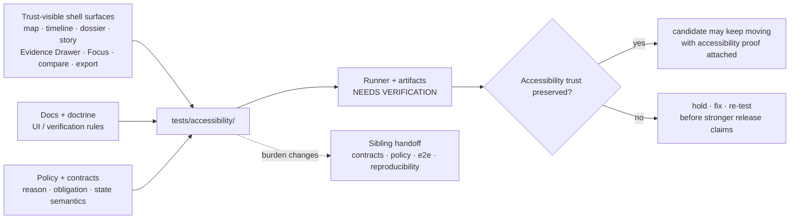

<!-- [KFM_META_BLOCK_V2]
doc_id: kfm://doc/NEEDS-VERIFICATION__tests_accessibility_readme
title: Accessibility Verification
type: standard
version: v1
status: published
owners: @bartytime4life
created: YYYY-MM-DD
updated: YYYY-MM-DD
policy_label: public
related: [../README.md, ../../README.md, ../../.github/README.md, ../../.github/workflows/README.md, ../../.github/CODEOWNERS]
tags: [kfm, tests, accessibility, verification, trust-visible-ui, evidence-drawer, focus-mode]
notes: [doc_id, created, and updated remain placeholders pending live-checkout metadata verification; status reflects the supplied repo-facing README posture, not executable suite maturity; runner, workflow enforcement, and branch protection remain NEEDS VERIFICATION]
[/KFM_META_BLOCK_V2] -->

<a id="top"></a>

# Accessibility Verification

<p align="center">
  <strong>Governed accessibility proof for KFM trust-visible shell behavior.</strong><br>
  Evidence-first · map-first · time-aware · shell-preserving · cite-or-abstain
</p>

<p align="center">
  
  
  
  
  
  
  
</p>

<p align="center">
  <a href="#scope">Scope</a> ·
  <a href="#repo-fit">Repo fit</a> ·
  <a href="#accepted-inputs">Inputs</a> ·
  <a href="#exclusions">Exclusions</a> ·
  <a href="#current-verified-snapshot">Snapshot</a> ·
  <a href="#quickstart">Quickstart</a> ·
  <a href="#validation-model">Validation model</a> ·
  <a href="#definition-of-done">Definition of done</a> ·
  <a href="#faq">FAQ</a>
</p>

> [!IMPORTANT]
> This README defines the accessibility verification burden for `tests/accessibility/`. It does **not** prove that executable accessibility tests, a runner, screenshot baselines, workflow YAML, required checks, or release gates are currently active. Treat those implementation details as `NEEDS VERIFICATION` until a checked-out branch proves them directly.

| Field | Value |
|---|---|
| **Family status** | `experimental` |
| **Document path** | `tests/accessibility/README.md` |
| **Owner** | `@bartytime4life` |
| **Policy label** | `public` |
| **Evidence posture** | `CONFIRMED` directory role from supplied repo-facing docs · `PROPOSED` starter test burden · `UNKNOWN` executable suite depth |
| **Primary burden** | Verify that trust-visible KFM UI surfaces remain operable, perceivable, and recoverable across keyboard, assistive technology, reduced motion, non-color-only cues, and narrow layouts. |
| **Current caution** | README-only snapshot; do not claim active enforcement without repo/workflow evidence. |

| What this README does | What it does not do |
|---|---|
| Defines what belongs in `tests/accessibility/`. | Does not define UI component implementation. |
| Keeps accessibility tied to KFM evidence, policy, time, and correction cues. | Does not replace contracts, policies, runtime proof, or release gates. |
| Provides runner-neutral inspection, case-placement, and validation guidance. | Does not claim Playwright, Cypress, axe, Lighthouse, Storybook, or any runner is active. |
| Lists a proposed starter backlog for trust-critical accessibility cases. | Does not assert those cases already exist. |

> [!NOTE]
> In KFM, accessibility is not decorative polish. If a user cannot reach evidence, understand policy state, perceive freshness or correction cues, operate bounded Focus outcomes, or recover from guarded states without losing map/time context, the trust model is incomplete.

---

## Scope

`tests/accessibility/` is the accessibility-critical verification family for KFM trust-visible product surfaces.

This family owns proof that users can still operate and inspect consequential UI states when pointer use, motion tolerance, color perception, screen-reader dependency, viewport size, or input method varies.

The main questions are:

- Can a user reach and inspect evidence without pointer-only affordances?
- Do map-first shell surfaces keep time, freshness, policy, review, release, and correction cues perceivable?
- Do `ANSWER`, `ABSTAIN`, `DENY`, and `ERROR` preserve same-page shell context?
- Does reduced motion remove unnecessary motion without hiding meaning or trust state?
- Do compressed layouts keep the evidence contract visible instead of hiding it behind decorative controls?

### Truth posture used here

| Label | Meaning in this README |
|---|---|
| **CONFIRMED** | Supplied repo-facing docs, visible workspace evidence, or KFM doctrine directly support the claim. |
| **INFERRED** | Strongly suggested by adjacent docs or doctrine, but not directly re-proven from a mounted checkout. |
| **PROPOSED** | Buildable test structure, workflow expectation, or starter case not asserted as current implementation. |
| **UNKNOWN** | Not verified strongly enough to present as current branch reality. |
| **NEEDS VERIFICATION** | A command, runner, path, owner, gate, conformance target, workflow, badge, or platform setting should be checked before stronger claims are made. |

<p align="right"><a href="#top">Back to top ↑</a></p>

---

## Repo fit

**Path:** `tests/accessibility/README.md`

**Role:** family README for accessibility-critical verification of trust-visible KFM shell behavior.

### Upstream anchors

| Surface | Why it matters | Status here |
|---|---|---|
| [`../README.md`](../README.md) | Defines the parent `tests/` family map and keeps accessibility explicit rather than burying it under broad regression language. | **CONFIRMED from supplied repo-facing docs** |
| [`../../README.md`](../../README.md) | Project front door and contributor orientation. | **CONFIRMED as adjacent repo-facing surface** |
| [`../../.github/README.md`](../../.github/README.md) | Repository governance and contributor gatehouse. | **CONFIRMED as adjacent repo-facing surface** |
| [`../../.github/workflows/README.md`](../../.github/workflows/README.md) | Automation-lane documentation; does not by itself prove active workflow YAML or branch protection. | **CONFIRMED docs / UNKNOWN enforcement** |
| [`../../.github/CODEOWNERS`](../../.github/CODEOWNERS) | Owner/review boundary; `/tests/` ownership is surfaced as `@bartytime4life`. | **CONFIRMED at `/tests/` scope** |

### Lateral handoffs

| Use `tests/accessibility/` when… | Use a sibling when… |
|---|---|
| the main burden is access to trust: keyboard reachability, focus return, live outcome announcement, non-color-only trust cues, reduced motion, or same-page recovery. | the main burden is contract shape, policy decision logic, cross-boundary integration, whole-path runtime proof, release assembly, deterministic local behavior, or reproducibility. |

Recommended sibling surfaces:

- [`../contracts/`](../contracts/) for contract shape, examples, schema drift, and valid/invalid payload proof.
- [`../policy/`](../policy/) for allow/deny/abstain/hold grammar and policy obligation behavior.
- [`../integration/`](../integration/) for governed cross-boundary slices.
- [`../e2e/`](../e2e/) for full runtime, release, rollback, and correction proof.
- [`../reproducibility/`](../reproducibility/) for rerun consistency, digest stability, and bounded drift.
- [`../unit/`](../unit/) for deterministic local helpers.

> [!TIP]
> Add work here when the hard question is: **Can a user still access the trust surface?** Move it elsewhere when the hard question is contract validity, policy correctness, end-to-end release proof, or deterministic computation.

<p align="right"><a href="#top">Back to top ↑</a></p>

---

## Accepted inputs

Content belongs in `tests/accessibility/` when the primary proof burden is whether a user can operate, perceive, inspect, or recover from trust-bearing KFM UI states.

Accepted inputs include:

- keyboard-only checks for map shell, layer panel, timeline, Evidence Drawer, Focus Mode, compare controls, and export triggers
- screen-reader and semantic-structure checks for headings, labels, selected-feature updates, drawer structure, outcome banners, and trust-chip changes
- reduced-motion checks for story/camera motion, timeline autoplay, drawer transitions, compare wipes, and any animation that could change meaning
- non-color-only checks for source role, rights, sensitivity, review state, freshness, release state, correction state, generalized geometry, and stale status
- focus-restoration checks after drawers, dialogs, popovers, Focus results, and guarded state banners close
- same-page recovery checks for `ANSWER`, `ABSTAIN`, `DENY`, and `ERROR`
- responsive trust-preservation checks for mobile and narrow viewport layouts
- public-safe fixtures or mock states used only to exercise accessibility behavior
- runner-neutral smoke cases that can later be wired to repo-native tooling once the checked-out branch proves the runner

### Fixture boundary

| Fixture type | Allowed here? | Rule |
|---|---:|---|
| Public-safe mock UI state | Yes | Must be clearly synthetic or fixture-bound. |
| Released public evidence references | Yes, if needed | Do not turn accessibility fixtures into canonical evidence. |
| Sensitive coordinates, private endpoints, secrets, or live credentials | No | Keep out of tests and docs; fail closed. |
| RAW / WORK / QUARANTINE data | No | Public and ordinary UI surfaces must not depend on unpublished lifecycle zones. |

<p align="right"><a href="#top">Back to top ↑</a></p>

---

## Exclusions

The following do **not** belong here as authoritative sources of truth.

| Do not put this here | Put it here instead | Reason |
|---|---|---|
| UI component implementations, shell runtime code, or map adapters | `../../apps/`, `../../packages/`, or repo-native UI package paths | Tests should not become the product surface. |
| canonical schemas, OpenAPI files, vocabularies, or standards profiles | `../../contracts/`, `../../schemas/`, and `../../docs/standards/` | This family can test accessibility consequences, not define contracts. |
| policy bundles, reviewer-role maps, or obligation registries | `../../policy/` | Policy law belongs in policy surfaces; this family checks whether policy state remains perceivable. |
| release manifests, receipts, proof packs, SBOMs, or promoted artifacts as primary records | governed `data/`, `release/`, or proof/receipt homes | Accessibility checks may consume these references but must not become their authority. |
| generic visual-regression screenshots with no trust-bearing assertion | visual regression family if added, or `../reproducibility/` for bounded outputs | Screenshots without a declared accessibility burden are weak proof. |
| full runtime outcome proof for request envelopes | `../e2e/runtime_proof/` | Whole-path runtime proof is broader than accessibility reachability. |
| large raw datasets, secrets, branch-local dumps, or sensitive coordinates | governed data lifecycle zones or ignored local paths | `tests/` must stay public-safe and reviewable. |
| claims of WCAG A/AA/AAA conformance without verified standards docs and representative artifacts | owning standards docs plus verified test artifacts | Conformance claims require stronger evidence than a README. |

> [!WARNING]
> Do not use this directory to make unsupported compliance, release, or enforcement claims. A polished README, badge, diagram, or screenshot is not proof of active accessibility coverage.

<p align="right"><a href="#top">Back to top ↑</a></p>

---

## Current verified snapshot

**CONFIRMED from supplied repo-facing documentation:**

- `tests/accessibility/` is a named top-level test family.
- `tests/accessibility/README.md` is the only currently confirmed file in this family from the supplied snapshot.
- The parent `tests/` documentation keeps accessibility explicit rather than folding it into generic UI or regression language.
- `/tests/` ownership is surfaced as `@bartytime4life`.

**UNKNOWN / NEEDS VERIFICATION until a checked-out branch proves it:**

- executable accessibility case inventory
- runner choice and command surface
- screenshots, traces, or baseline artifact structure
- active workflow YAML
- branch protection or required-check status
- exact project conformance target
- whether accessibility failures currently block release, docs, promotion gates, or merge

### Directory tree

Current confirmed snapshot:

```text
tests/
└── accessibility/
    └── README.md
```

> [!IMPORTANT]
> Use the tree above for current branch-facing truth. Do **not** silently convert a present directory into claims about active suites, configured runners, screenshot baselines, merge-blocking gates, or release enforcement.

<p align="right"><a href="#top">Back to top ↑</a></p>

---

## Quickstart

### Safe inspection commands

These commands inspect what is present without assuming a specific accessibility runner.

```bash
# Inspect this family.
find tests/accessibility -maxdepth 3 -type f 2>/dev/null | sort

# Inspect the parent tests contract and repo gatehouse.
sed -n '1,260p' tests/README.md 2>/dev/null || true
sed -n '1,240p' .github/README.md 2>/dev/null || true
sed -n '1,240p' .github/workflows/README.md 2>/dev/null || true
sed -n '1,200p' .github/CODEOWNERS 2>/dev/null || true

# Inspect sibling family READMEs before moving cases across boundaries.
sed -n '1,220p' tests/contracts/README.md 2>/dev/null || true
sed -n '1,220p' tests/policy/README.md 2>/dev/null || true
sed -n '1,220p' tests/e2e/README.md 2>/dev/null || true
sed -n '1,220p' tests/integration/README.md 2>/dev/null || true
sed -n '1,220p' tests/reproducibility/README.md 2>/dev/null || true
sed -n '1,220p' tests/unit/README.md 2>/dev/null || true

# Look for accessibility-, shell-, and trust-surface vocabulary.
grep -RIn "accessib\|a11y\|keyboard\|screen reader\|reduced motion\|Evidence Drawer\|Focus Mode\|ABSTAIN\|DENY\|ERROR" \
  tests docs apps packages policy contracts 2>/dev/null || true

# Inventory likely UI-facing files without assuming a framework.
find apps packages docs tests -maxdepth 4 -type f 2>/dev/null | \
  grep -E 'accessib|a11y|drawer|focus|story|dossier|map|timeline|compare|export' | sort
```

### First local review pass

1. Verify whether the checked-out branch still matches the supplied README-only snapshot for this directory.
2. Verify whether any executable accessibility suite exists beyond README scaffolding.
3. Verify which shell states, keyboard paths, and reduced-motion cases are already covered.
4. Verify whether any workflow or branch rule currently treats accessibility as blocking.
5. Verify whether docs, contracts, policy, and accessibility cases move together when trust-bearing behavior changes.
6. Verify whether a case that starts here should actually live in a sibling family once the burden is better understood.

> [!TIP]
> Do not hard-code Playwright, Cypress, axe-core, Lighthouse, Storybook, or another tool as current repo fact unless the checked-out branch proves that choice. This family owns the burden; the repo chooses the runner.

<p align="right"><a href="#top">Back to top ↑</a></p>

---

## Usage

### What this family proves

`tests/accessibility/` should prove whether KFM’s trust-visible shell remains meaningfully usable when a user must inspect evidence under real constraints.

At minimum, this includes:

- reaching claim-adjacent evidence without pointer-only interaction
- preserving map and time context through success and failure
- keeping trust cues legible when motion is reduced or layout is compressed
- restoring focus predictably after transient trust surfaces close
- keeping restricted, stale, generalized, corrected, or policy-denied states understandable without relying on hue alone
- announcing guarded outcomes and live trust-state changes without severing shell context

### What this family must not become

This family must **not** become:

- a vague bucket for “UI regressions”
- a substitute for owning shell or component documentation
- a generic conformance claim surface that hides the actual cases
- a folder of orphaned screenshots with no testable burden
- a place to bury unresolved runner choices behind polished prose
- an end-to-end release gate that bypasses `../e2e/`, policy, or contract proof

### Working rule for new cases

Add work here when the main risk is **access to trust** rather than raw business logic.

| Hard question | Primary home |
|---|---|
| Can a user still operate, inspect, perceive, and recover safely? | `tests/accessibility/` |
| Is the payload shape valid? | `tests/contracts/` |
| Is the policy decision correct? | `tests/policy/` |
| Does the whole runtime path work? | `tests/e2e/` |
| Is the transform deterministic or reproducible? | `tests/reproducibility/` or `tests/unit/` |

<p align="right"><a href="#top">Back to top ↑</a></p>

---

## Validation model

The diagram below shows this family’s responsibility without pretending current runner wiring is already in place.



### Accessibility burden map

| Surface | Minimum accessibility burden | Why it matters in KFM |
|---|---|---|
| **Map shell** | keyboard alternatives for feature selection, pan/zoom-dependent selection, and layer inspection | the map is the entry point, not a pointer-only decoration |
| **Timeline / time controls** | focusable controls, clear current time/scope labels, restrained playback or reduced-motion behavior | time is a coequal operating dimension in KFM |
| **Layer panel / legend** | readable labels, non-color-only symbols, source-role and policy state cues | layer visibility must not imply authority or publication approval |
| **Dossier / Story** | heading structure, readable trust chips, clear link order | durable claim surfaces must remain inspectable, not decorative |
| **Evidence Drawer** | open/close reachability, structure announcement, focus return, evidence sections in logical order | immediate provenance inspection sits closest to consequential claims |
| **Focus Mode** | live outcome semantics and same-page `ANSWER` / `ABSTAIN` / `DENY` / `ERROR` recovery | bounded synthesis must not sever shell context or evidence access |
| **Compare** | synchronized control reachability, non-color-only asymmetry cues, reduced-motion transitions | explicit comparison basis is part of meaning |
| **Export** | preview reachability and trust-cue legibility before outward emit | exported artifacts remain trust-bearing publication surfaces |
| **Mobile / narrow viewport** | stacked or collapsed layouts keep scope, freshness, policy, review, and evidence cues visible | compression cannot hide trust |

### Negative outcome accessibility

| Outcome | Accessibility burden | Handoff if failure is broader than accessibility |
|---|---|---|
| `ANSWER` | cited answer remains perceivable, keyboard reachable, and connected to source/evidence UI | `../contracts/` for envelope shape; `../e2e/` for runtime proof |
| `ABSTAIN` | insufficiency reason is announced and same-page next actions are reachable | `../policy/` or `../e2e/runtime_proof/` |
| `DENY` | denial reason and allowed alternatives remain visible without exposing restricted content | `../policy/` |
| `ERROR` | technical failure is announced calmly; shell context and recovery remain available | `../e2e/` for whole-path failure handling |

<p align="right"><a href="#top">Back to top ↑</a></p>

---

## Runner activation plan

The current README is intentionally runner-neutral. Once the real repo proves a runner, update this section with the verified command, fixture path, artifact path, and failure interpretation.

| Activation step | Required evidence before updating this README |
|---|---|
| Name runner | checked-in dependency/config/workflow proving the toolchain |
| Name command | package script, Make target, CI step, or documented command in current repo evidence |
| Name artifacts | generated report path, screenshots, traces, SARIF, HTML, JSON, or logs that actually exist |
| Name enforcement | workflow YAML and branch/release policy proving blocking behavior |
| Name conformance target | standards doc or policy surface proving exact A/AA/AAA target if any |

> [!CAUTION]
> Static badges are acceptable for honest status. Do not add “passing,” “verified,” “AA,” “production,” “required check,” or real workflow badges until supporting repo evidence proves them.

<p align="right"><a href="#top">Back to top ↑</a></p>

---

## Standards posture

Use external accessibility standards as review vocabulary, not as unsupported conformance claims.

| Standard surface | Safe README posture |
|---|---|
| **[WCAG 2.2](https://www.w3.org/TR/WCAG22/)** | Useful review vocabulary and likely baseline candidate. Do not claim project conformance until repo standards docs and representative artifacts prove the target. |
| **[WCAG 3.0](https://www.w3.org/TR/wcag-3.0/)** | Watchlist / draft-awareness item. Do not use as a KFM conformance target unless future repo policy explicitly adopts it. |
| **Automated checks** | Helpful but incomplete. Treat automated findings as one input alongside keyboard review, semantic review, reduced-motion review, and manual assistive-technology checks. |

<p align="right"><a href="#top">Back to top ↑</a></p>

---

## Definition of done

Treat this README as healthy only when it stays both useful and truthful.

- [ ] The checked-out branch confirms the real runner, command surface, artifact layout, and failure semantics for this family.
- [ ] At least one case exists for each trust-critical burden that the current branch actually claims to support.
- [ ] Keyboard paths cover Evidence Drawer entry/exit, timeline movement, compare controls, Focus outcomes, and export triggers where those surfaces exist.
- [ ] Screen-reader checks cover headings, labels, outcome banners, selected-feature updates, and live trust-state updates.
- [ ] Reduced-motion behavior is explicit and testable rather than implied.
- [ ] Trust cues are not color-only.
- [ ] Closing transient trust surfaces restores focus predictably.
- [ ] `ABSTAIN`, `DENY`, and `ERROR` keep the map/time shell intact and provide safe next actions.
- [ ] Narrow viewport checks prove trust cues remain reachable where claims are shown.
- [ ] Cases that no longer belong here are moved into the correct sibling family instead of stretching this directory into a generic UX bucket.
- [ ] Any workflow, release-gate, or conformance claim is verified against checked-out branch evidence or GitHub settings before this README says it is active.
- [ ] Documentation changes stay synchronized with real suite depth instead of outrunning it.
- [ ] Fixtures remain public-safe and do not contain sensitive coordinates, secrets, private endpoints, or live credentials.
- [ ] Rollback/correction guidance is followed when a trust-significant accessibility claim must be downgraded.

<p align="right"><a href="#top">Back to top ↑</a></p>

---

## Rollback and correction note

If this README overstates suite maturity, workflow enforcement, standards conformance, or release-blocking behavior:

1. Downgrade the claim to `NEEDS VERIFICATION` or `UNKNOWN`.
2. Remove or replace misleading badges.
3. Restore runner-neutral language until direct repo evidence exists.
4. Add a short note to the relevant changelog or documentation control surface if the repo has one.
5. Re-run local inspection and verify links, headings, badges, and affected sibling README references.

If an accessibility regression reaches a public or semi-public surface, treat it as a trust-significant correction candidate when it blocks evidence inspection, policy-state comprehension, recovery from `DENY`/`ABSTAIN`/`ERROR`, or public-safe publication review.

<p align="right"><a href="#top">Back to top ↑</a></p>

---

## FAQ

### Why does `tests/accessibility/` need its own family instead of living under generic UI or regression tests?

Because accessibility in KFM is part of the evidence contract. If a user cannot reach the Evidence Drawer, understand stale or restricted state, operate Focus outcomes, or recover from denial and abstention without losing shell context, the trust model exists only on paper.

### Does this README prove the repo already has accessibility tests?

No. It proves the intended directory contract and the supplied README-only snapshot. Executable tests, runner choice, active checks, and branch protection remain **NEEDS VERIFICATION**.

### Why not name Playwright, Cypress, axe-core, Lighthouse, or Storybook as the runner?

Because runner choice is implementation evidence, not doctrine. This README is runner-neutral until the checked-out branch proves a toolchain. Once the runner is verified, add the command, artifact path, and failure interpretation here.

### Where should an Evidence Drawer keyboard case live?

Start here if the burden is keyboard reachability, focus return, screen-reader structure, or same-page recovery. Move or duplicate a smaller assertion into `../contracts/`, `../policy/`, or `../e2e/` if the main burden is payload shape, policy decision, or whole-path runtime proof.

### Are `ABSTAIN`, `DENY`, and `ERROR` accessibility concerns?

Yes, when the question is whether those states remain perceivable, actionable, and shell-preserving. The semantic contract for those outcomes belongs in runtime/policy/contract surfaces; the operability and recovery proof belongs here.

### Can an accessibility failure block a release?

It can be trust-significant enough to block stronger release or publication claims, but this README does not prove active release-gate wiring. Verify workflow YAML, required checks, and release policy before saying accessibility currently blocks merges or releases.

### Should this README claim WCAG conformance?

Not by itself. It may reference WCAG as review vocabulary, but A/AA/AAA conformance claims require verified standards docs, actual cases, representative coverage, and reproducible artifacts.

<p align="right"><a href="#top">Back to top ↑</a></p>

---

## Appendix

<details>
<summary><strong>Appendix A — Evidence basis and open verification</strong></summary>

### Evidence basis used for this README

This README is grounded in:

1. Supplied repo-facing Markdown that identifies `tests/accessibility/` as an explicit accessibility verification family and currently README-only.
2. The supplied KFM Markdown/documentation guidance requiring GitHub-readable, evidence-bounded, badge-aware, callout-aware, diagram-aware, repository-ready writing.
3. KFM UI doctrine that treats MapLibre shell behavior, Evidence Drawer, Focus Mode, finite outcomes, visible trust cues, reduced motion, keyboard operation, and same-page recovery as trust-bearing requirements.
4. Documentation architecture guidance that requires README surfaces to state scope, repo fit, accepted inputs, exclusions, evidence boundary, current snapshot, directory tree, quickstart, diagrams, tables, and definition of done.
5. Current-session evidence limit: no mounted KFM checkout was inspected in this pass, so executable suite depth, runner wiring, workflow enforcement, and platform settings remain `UNKNOWN`.

### Open verification items

- `doc_id`, `created`, and `updated` values in the meta block
- whether a live branch has child test files under `tests/accessibility/`
- exact accessibility runner and command surface
- whether workflow YAML exists and calls this family
- whether GitHub branch protection requires the accessibility check
- exact standards/conformance target adopted by the repo
- whether accessibility proof is part of promotion or release gates
- whether screenshots, traces, or accessibility reports are stored as artifacts
- whether UI shell paths, Evidence Drawer components, and Focus surfaces are mounted under `apps/`, `packages/`, or another repo-native location

</details>

<details>
<summary><strong>Appendix B — Starter case backlog, still PROPOSED</strong></summary>

Use these as planning names only. Do not claim they exist until checked in.

| Candidate case | Main burden | Likely handoff |
|---|---|---|
| `keyboard_evidence_drawer_open_close` | drawer reachability and focus return | `../e2e/` if it becomes whole-path click-to-drawer proof |
| `focus_outcome_same_page_recovery` | `ABSTAIN`, `DENY`, and `ERROR` stay perceivable with safe next actions | `../e2e/runtime_proof/` for envelope-level assertions |
| `timeline_reduced_motion` | time-control motion can be reduced without hiding scope | `../integration/` if tied to backend time queries |
| `trust_chips_non_color_only` | source, rights, sensitivity, freshness, review, and correction cues do not rely on hue alone | `../contracts/` if payload shape is the failing burden |
| `narrow_viewport_trust_preservation` | mobile layout keeps trust cues attached to claims | UI shell docs if it becomes layout guidance rather than executable proof |
| `export_preview_trust_cues` | export preview remains reachable and shows provenance/correction cues | `../e2e/release_assembly/` for publish-path proof |
| `focus_live_region_outcomes` | Focus outcome changes announce without stealing context | `../contracts/` if the output envelope lacks state fields |
| `compare_non_color_asymmetry` | comparison meaning survives without hue and without forced motion | `../reproducibility/` if the failure is deterministic rendering drift |

</details>

<details>
<summary><strong>Appendix C — Contributor review checklist</strong></summary>

Before adding or moving an accessibility case, verify:

- [ ] The case names the trust-bearing surface under test.
- [ ] The case names the accessibility burden, not just the UI element.
- [ ] The fixture is public-safe.
- [ ] The case does not depend on RAW, WORK, QUARANTINE, unpublished candidate data, or direct model output.
- [ ] The case preserves map/time shell context through guarded outcomes.
- [ ] Failure interpretation is clear enough for maintainers to triage.
- [ ] Any runner-specific command is verified from the current branch.
- [ ] Any required workflow or release-gate claim is verified before documentation says it is active.
- [ ] Sibling handoff is recorded if the failure belongs in contracts, policy, e2e, reproducibility, or unit tests.

</details>

<details>
<summary><strong>Appendix D — Reviewer prompts</strong></summary>

Use these prompts during review when a proposed test or documentation change is hard to classify.

| Prompt | Use when |
|---|---|
| “Could a keyboard-only user reach the evidence behind this claim?” | map shell, drawer, timeline, compare, or export behavior changes |
| “Does a non-visual user receive the same trust-state change?” | selected feature, policy state, freshness, correction, or Focus outcome changes |
| “Does reduced motion remove movement without removing meaning?” | story, camera, timeline, drawer, compare, or transition behavior changes |
| “Is this a contract failure disguised as accessibility?” | missing fields or malformed envelopes drive the failure |
| “Is this a policy failure disguised as accessibility?” | denial, redaction, sensitivity, or source-role obligations drive the failure |
| “Would this claim be misleading if no runner is active?” | badges, enforcement language, or release-blocking language changes |

</details>

[Back to top](#top)
