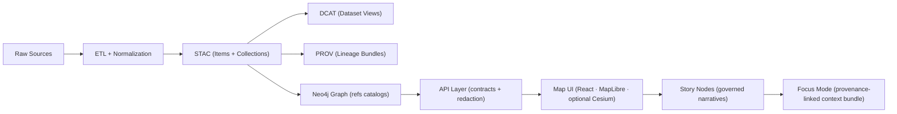
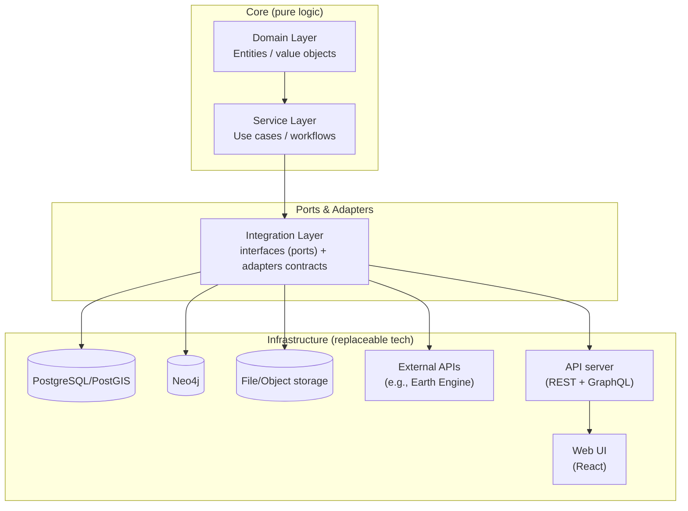

# 🏗️ Architecture Tests (KFM)

<p align="center">
  <em>Guardrails for the Kansas Frontier Matrix pipeline, contracts, and governance rules.</em><br/>
  <strong>Contract-first ✅ · Provenance-first ✅ · Evidence-first ✅</strong>
</p>

<p align="center">
  <!-- Replace <ORG>/<REPO> with your GitHub slug (or remove badges). -->
  /<REPO>/actions/workflows/ci.yml/badge.svg" />
  /<REPO>" />
  /<REPO>" />
</p>

> [!IMPORTANT]
> Architecture tests are **not** “more unit tests.”  
> They are **system invariants** that prevent KFM from drifting into:
> - untraceable data in the UI 🔍❌  
> - unsourced narratives in Story Nodes 🧾❌  
> - bypassed governance / sovereignty rules 🪶❌  
> - broken contracts between subsystems 🧱❌

---

<details>
<summary><strong>🧭 Table of contents</strong></summary>

- [What this folder is](#what-this-folder-is)
- [The non-negotiable invariants](#the-non-negotiable-invariants)
- [Architecture map](#architecture-map)
- [Canonical subsystem homes](#canonical-subsystem-homes)
- [What lives under `tests/architecture/`](#what-lives-under-testsarchitecture)
- [Test suites](#test-suites)
- [How to run](#how-to-run)
- [How to add/extend architecture tests](#how-to-addextend-architecture-tests)
- [CI gates & governance hooks](#ci-gates--governance-hooks)
- [Reference shelf](#reference-shelf)
- [Troubleshooting](#troubleshooting)

</details>

---

## What this folder is

This directory contains **architecture-level tests** that validate:

- **Subsystem boundaries** (who is allowed to depend on whom) 🧩  
- **Data “boundary artifacts” exist & validate** (STAC / DCAT / PROV) 📦  
- **No pipeline stage skips the stage before it** (ordering is absolute) 🔁  
- **No UI bypasses the API** (especially graph access) 🔒  
- **No narrative bypasses evidence** (Story Nodes + Focus Mode hard rules) 🧠  
- **No sovereignty/classification regression** (restrictions can’t loosen downstream) 🪶  

If these tests fail, it usually means **we broke an invariant**, not that a feature is “slightly off.”

---

## The non-negotiable invariants

These are the “you shall not pass” rules. If you change the architecture, you must either:
1) keep these invariants intact, or  
2) formally evolve them (with governance + versioning + updated tests).

### ✅ Invariants we enforce

1. **Pipeline ordering is absolute**  
   ETL → Catalogs (STAC/DCAT/PROV) → Graph → API → UI → Story Nodes → Focus Mode

2. **API boundary rule**  
   The UI must **never** query Neo4j directly. All access goes through the governed API layer.

3. **Provenance-first publishing**  
   Data must have **STAC/DCAT + PROV lineage** before it can appear in graph/UI/story.

4. **Deterministic, idempotent ETL**  
   Same inputs ⇒ same outputs. Re-runs do not produce side effects. Runs are logged and hashable.

5. **Evidence-first narrative**  
   No unsourced claims. No “freeform” Focus Mode outputs. AI outputs must be labeled + traceable.

6. **Sovereignty / classification propagation**  
   Outputs can’t be less restricted than inputs. Redaction/generalization must apply end-to-end.

7. **Validation gates on contributions**  
   CI rejects missing metadata, broken links, missing PROV, schema violations, secrets leaks, etc.

---

## Architecture map

### Canonical pipeline (high-level)



### Clean architecture boundaries (why dependency direction matters)



---

## Canonical subsystem homes

Architecture tests assume **one source of truth per subsystem** (no duplicate “API folders,” no scattered ETL logic).

- 📁 `src/pipelines/` → ETL + catalog writers (STAC/DCAT/PROV)
- 📁 `tools/` → validation utilities (metadata validators, link checks, etc.)
- 📁 `src/graph/` → ontology application, migrations, graph sync
- 📁 `src/server/` → API server code + contracts (OpenAPI, GraphQL SDL, etc.)
- 📁 `web/` → UI application (React / TS / mapping configs)
- 📁 `docs/reports/story_nodes/` → Story Nodes (draft/ vs published/)

> [!NOTE]
> If you add a new subsystem, it must have a **canonical home** and an **architecture test** that ensures it stays canonical.

---

## What lives under `tests/architecture/`

A suggested layout (adjust to match your repo conventions):

```text
📁 tests/
  📁 architecture/
    📄 README.md  ✅ you are here
    📄 test_invariants_pipeline_ordering.py
    📄 test_invariants_api_boundary.py
    📄 test_invariants_provenance_required.py
    📄 test_invariants_storynode_evidence.py
    📄 test_invariants_sovereignty_propagation.py
    📄 test_contracts_openapi_graphql.py
    📄 test_schemas_stac_dcat_prov.py
    📁 fixtures/
      📁 stac/
      📁 dcat/
      📁 prov/
      📁 story_nodes/
      📁 geo/
    📁 helpers/
      📄 paths.py
      📄 schema_validate.py
      📄 graph_validate.py
```

---

## Test suites

Below is the “architecture test menu.” Not every repo needs every suite on day 1—but **the invariants do**.

| Suite 🧪 | What it protects 🛡️ | Typical signal ✅ / ❌ |
|---|---|---|
| Boundary / dependency rules | Clean architecture directionality (domain/service cannot import infra) | “Domain imported DB client” |
| Pipeline ordering | No stage consumes artifacts that aren’t produced/validated yet | “Story references raw data path” |
| Schema validation | STAC/DCAT/PROV JSON validates against repo schemas/profiles | “Missing license / extent / links” |
| Provenance completeness | PROV exists + links raw → work → processed + params/run IDs | “No activity bundle for artifact” |
| Graph integrity | Neo4j constraints/migrations applied; no orphan types | “Node label introduced w/o migration” |
| API contracts | OpenAPI/GraphQL backwards compatibility + response shapes | “Breaking change without version bump” |
| UI boundary + leakage | UI fetches only via API; respects redaction/classification | “Direct Neo4j endpoint used” |
| Story Node + Focus Mode gates | Every claim cites evidence; AI outputs labeled + constrained | “Unsourced statement detected” |
| Sovereignty propagation | Restrictions do not loosen downstream; redaction documented | “Public output derived from restricted input” |
| Performance budgets | Query plans/index use, p95 latency budgets, tile budgets | “Spatial query regressed 10×” |
| Security gates (defensive) | No secrets, dependency issues, unsafe patterns | “Leaked token in docs” |

---

## How to run

> [!TIP]
> Keep architecture tests fast and deterministic. Heavy integration tests should be tagged and runnable on demand.

### Local (recommended)
```bash
# fast architecture tests only
pytest -m arch

# include schema + contract checks
pytest -m "arch or schema or contract"

# run everything (may require docker compose)
pytest
```

### With Docker (when tests touch PostGIS/Neo4j)
```bash
docker compose up -d postgis neo4j
pytest -m "arch or integration"
docker compose down -v
```

### Frontend / E2E (if enabled)
```bash
# UI unit/component tests (example)
npm test

# E2E tests (example)
npx cypress run
```

> [!WARNING]
> If an architecture test requires the network, a live API, or a public dataset download, it is likely **not an architecture test** (or needs strong local fixtures).

---

## How to add/extend architecture tests

### 1) Start from an invariant (not from a feature)
Write a test that answers:

> “What must **never** be allowed to happen again?”

Examples:
- UI uses a direct graph driver
- A processed dataset exists without STAC/DCAT/PROV
- Story Node claims exist with no citations
- Restricted dataset produces a public artifact without redaction

### 2) Prefer simple, mechanical checks
Architecture tests should be:
- ✅ deterministic  
- ✅ fast  
- ✅ readable  
- ✅ hard to game  
- ❌ not flaky  
- ❌ not dependent on external services  

### 3) Use “golden” fixtures
Add a minimal but representative fixture set:
- ✅ one STAC collection + item
- ✅ one DCAT dataset entry
- ✅ one PROV bundle
- ✅ one Story Node (draft and published)
- ✅ one “restricted” artifact scenario

### 4) Add a failure message that teaches
When the test fails, contributors should immediately understand:
- what invariant they broke
- where to fix it
- which docs to read

---

## CI gates & governance hooks

Architecture tests are meant to be **PR gates**.

A strong minimum set:
- ✅ markdown protocol checks (front-matter, templates)
- ✅ link validation (no broken evidence references)
- ✅ JSON schema validation for STAC/DCAT/PROV
- ✅ provenance completeness checks
- ✅ graph integrity checks (constraints + migrations)
- ✅ API contract tests (OpenAPI + GraphQL)
- ✅ secret scanning + dependency scanning
- ✅ architecture tests (this folder)

### Governance triggers (human review)
Certain diffs should trigger manual review even if tests pass:
- sensitive/CARE-relevant datasets 🪶
- new AI narrative features 🧠
- new external sources / license changes 📜
- new public API endpoints that could expose sensitive info 🔓
- classification changes (public ↔ confidential) 🏷️

---

## Reference shelf

These tests are designed using the project’s in-repo “reference library” 📚.  
The goal is to keep KFM **scientifically rigorous**, **scalable**, **secure**, and **human-centered**.

<details>
<summary><strong>🧭 Core KFM architecture, governance, and protocols</strong></summary>

- `Kansas Frontier Matrix (KFM) – Comprehensive Technical Documentation.pdf`
- `MARKDOWN_GUIDE_v13.md.gdoc`
- `Kansas-Frontier-Matrix_ Open-Source Geospatial Historical Mapping Hub Design.pdf`
- `Scientific Method _ Research _ Master Coder Protocol Documentation.pdf`
- `Flexible Software Design_ Systems Modeling Language and the Overture tool.pdf`

</details>

<details>
<summary><strong>🗺️ Geospatial, mapping, cartography, and 3D</strong></summary>

- `python-geospatial-analysis-cookbook.pdf`
- `making-maps-a-visual-guide-to-map-design-for-gis.pdf`
- `Mobile Mapping_ Space, Cartography and the Digital - 9789048535217.pdf`
- `Archaeological 3D GIS_26_01_12_17_53_09.pdf`
- `webgl-programming-guide-interactive-3d-graphics-programming-with-webgl.pdf`
- `responsive-web-design-with-html5-and-css3.pdf`
- `compressed-image-file-formats-jpeg-png-gif-xbm-bmp.pdf`

</details>

<details>
<summary><strong>🛰️ Remote sensing & Earth Engine workflows</strong></summary>

- `Cloud-Based Remote Sensing with Google Earth Engine-Fundamentals and Applications.pdf`

</details>

<details>
<summary><strong>📊 Statistics, modeling, ML, and numerical computing</strong></summary>

- `Scientific Modeling and Simulation_ A Comprehensive NASA-Grade Guide.pdf`
- `Understanding Statistics & Experimental Design.pdf`
- `regression-analysis-with-python.pdf`
- `Regression analysis using Python - slides-linear-regression.pdf`
- `think-bayes-bayesian-statistics-in-python.pdf`
- `graphical-data-analysis-with-r.pdf`
- `Data Mining - Concepts and Applications ...`
- `SciPy lecture notes.pdf`
- `Basics of Linear Algebra for Machine Learning_ Discover the Mathematical Language of Data in Python.pdf`
- `Understanding Machine Learning - From Theory to Algorithms.pdf`
- `Deep Learning for Coders with fastai and PyTorch - Deep.Learning.for.Coders.with.fastai.and.PyTorchpdf` *(library file; may be indexed separately)*

</details>

<details>
<summary><strong>🧠 Graphs, optimization, complex systems</strong></summary>

- `Spectral Geometry of Graphs.pdf`
- `Generalized Topology Optimization for Structural Design.pdf`
- `Principles of Biological Autonomy - book_9780262381833.pdf`

</details>

<details>
<summary><strong>🗄️ Data systems, Postgres, and performance at scale</strong></summary>

- `PostgreSQL Notes for Professionals - PostgreSQLNotesForProfessionals.pdf`
- `Database Performance at Scale.pdf`
- `Scalable Data Management for Future Hardware.pdf`
- `Data Spaces.pdf`

</details>

<details>
<summary><strong>🛡️ Security, concurrency, and defensive engineering</strong></summary>

- `ethical-hacking-and-countermeasures-secure-network-infrastructures.pdf` *(defensive reference)*
- `Gray Hat Python - Python Programming for Hackers and Reverse Engineers (2009).pdf` *(defensive reference)*
- `concurrent-real-time-and-distributed-programming-in-java-threads-rtsj-and-rmi.pdf`

</details>

<details>
<summary><strong>⚖️ Human-centered + legal/ethics guardrails</strong></summary>

- `Introduction to Digital Humanism.pdf`
- `On the path to AI Law’s prophecies and the conceptual foundations of the machine learning age.pdf`

</details>

<details>
<summary><strong>🧰 General programming reference shelf (compendiums)</strong></summary>

- `A programming Books.pdf`
- `B-C programming Books.pdf`
- `D-E programming Books.pdf`
- `F-H programming Books.pdf`
- `I-L programming Books.pdf`
- `M-N programming Books.pdf`
- `O-R programming Books.pdf`
- `S-T programming Books.pdf`
- `U-X programming Books.pdf`
- `Objective-C Notes for Professionals.pdf`
- `MATLAB Notes for Professionals.pdf`
- `Bash Notes for Professionals.pdf`

</details>

---

## Troubleshooting

### “Schema validation failed”
- Confirm you wrote STAC/DCAT/PROV to the canonical paths (`data/stac/...`, `data/catalog/dcat/...`, `data/prov/...`)
- Ensure required fields exist (license, spatial/temporal extent, links, provenance references)
- Run the schema validator locally (CI should show the exact missing field)

### “UI bypassed the API boundary”
- Replace any direct DB/graph calls with API endpoints
- Add/extend a contract test to ensure API continues serving required data for UI

### “Story Node evidence gate failed”
- Every claim must cite evidence that exists in the catalogs
- AI-generated narrative must be labeled and provenance-linked (no freeform assertions)

### “Sovereignty/classification propagation failed”
- Ensure classification tags propagate to derived artifacts
- Apply redaction/generalization at the earliest possible layer (processed data), then reflect it in metadata, API responses, and UI behavior

---

## PR checklist ✅

- [ ] Did I touch **ETL**? → I added/updated deterministic + idempotent checks
- [ ] Did I add/modify **datasets**? → STAC + DCAT + PROV exists and validates
- [ ] Did I touch **graph schema**? → migrations + integrity tests updated
- [ ] Did I touch **API contracts**? → OpenAPI/GraphQL tests updated (+ version bump if breaking)
- [ ] Did I touch **UI data access**? → no direct DB/graph calls, only API
- [ ] Did I touch **Story Nodes / Focus Mode**? → evidence gate passes, AI clearly labeled
- [ ] Did I touch **sensitive data**? → sovereignty propagation + redaction is covered and documented
- [ ] CI is green ✅

---

<p align="center">
  <strong>🧪 If it can’t be validated, it can’t be shipped.</strong><br/>
  <em>KFM treats data pipelines like production software — tested, versioned, and governed.</em> 🚀
</p>
