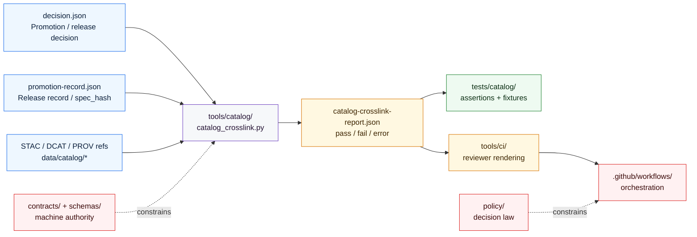

<!-- [KFM_META_BLOCK_V2]
doc_id: kfm://doc/NEEDS_VERIFICATION__tests_catalog_readme
title: tests/catalog
type: standard
version: v1
status: draft
owners: @bartytime4life
created: NEEDS_VERIFICATION__YYYY-MM-DD
updated: 2026-04-23
policy_label: public
related: [
  ../README.md,
  ../../README.md,
  ../../tools/catalog/README.md,
  ../../data/catalog/README.md,
  ../../data/catalog/stac/README.md,
  ../../data/catalog/dcat/README.md,
  ../../data/catalog/prov/README.md,
  ../../contracts/README.md,
  ../../schemas/README.md,
  ../../policy/README.md,
  ../../.github/workflows/README.md,
  ../../.github/CODEOWNERS,
  ../../tools/ci/README.md,
  ../../tools/validators/README.md,
  ../../tools/validators/promotion_gate/README.md
]
tags: [kfm, tests, catalog, stac, dcat, prov, crosslink, fixtures]
notes: [
  "README-like standard doc for the catalog helper-proof test lane.",
  "Owner follows surfaced /tests/ ownership signals; leaf ownership should still be verified against the active branch.",
  "Exact active-branch presence of tests/catalog/, test_catalog_crosslink.py, and local fixture files remains NEEDS VERIFICATION.",
  "This README is intentionally test-facing: it does not move STAC, DCAT, PROV, policy, schema, workflow, or release truth into tests."
]
[/KFM_META_BLOCK_V2] -->

<a id="top"></a>

# `tests/catalog/`

Catalog-oriented helper-proof tests for **closure**, **STAC/DCAT/PROV cross-link consistency**, and reviewable negative-path behavior in Kansas Frontier Matrix.

> [!NOTE]
> **Status:** `experimental`  
> **Document state:** `draft`  
> **Owners:** `@bartytime4life` *(verify exact leaf ownership before merge)*  
> **Path:** `tests/catalog/README.md`  
> **Repo fit:** child verification lane under [`../README.md`](../README.md); proves behavior for helpers documented in [`../../tools/catalog/README.md`](../../tools/catalog/README.md); pressure-tests release-bearing catalog records from [`../../data/catalog/README.md`](../../data/catalog/README.md) without owning them.  
> **Quick jumps:** [Scope](#scope) · [Repo fit](#repo-fit) · [Accepted inputs](#accepted-inputs) · [Exclusions](#exclusions) · [Current evidence snapshot](#current-evidence-snapshot) · [Directory tree](#directory-tree) · [Quickstart](#quickstart) · [Usage](#usage) · [Diagram](#diagram) · [Reference tables](#reference-tables) · [Task list](#task-list--definition-of-done) · [FAQ](#faq) · [Appendix](#appendix)


> [!IMPORTANT]
> `tests/catalog/` is **not** the home of STAC, DCAT, or PROV truth.
>
> This lane proves catalog-helper behavior over declared artifacts. Authoritative catalog records stay in [`../../data/catalog/`](../../data/catalog/); policy law stays in [`../../policy/`](../../policy/); machine-contract authority stays in [`../../contracts/`](../../contracts/) and [`../../schemas/`](../../schemas/).

---

## Scope

`tests/catalog/` is the verification lane for small, reviewable checks that prove whether catalog-oriented helper logic behaves correctly over declared inputs.

In practice, this means proving behavior around:

- STAC / DCAT / PROV cross-link consistency
- promotion-adjacent catalog closure checks
- stable JSON report shapes intended for CI or reviewer rendering
- negative-path handling for missing refs, subject drift, version drift, release drift, and malformed inputs

This lane is useful because it keeps catalog-proof behavior explicit without collapsing metadata law, policy law, and workflow orchestration into one hidden place.

### Evidence markers used in this README

| Marker | Meaning here |
|---|---|
| **CONFIRMED** | Directly supported by surfaced repo-facing docs, ownership files, visible branch documentation, or active-branch inspection |
| **INFERRED** | Conservative interpretation of adjacent repo evidence or repeated KFM doctrine |
| **PROPOSED** | Recommended landing shape or lane behavior consistent with current doctrine |
| **UNKNOWN** | Not established strongly enough from visible evidence |
| **NEEDS VERIFICATION** | Branch-specific detail that should be checked before merge |

[Back to top](#top)

---

## Repo fit

`tests/catalog/` sits between the helper lane that inspects catalog closure and the release-bearing metadata surfaces that remain authoritative.

| Relation | Surface | Why it matters |
|---|---|---|
| Parent verification lane | [`../README.md`](../README.md) | Defines `tests/` as a governed verification surface rather than a generic QA bucket |
| Root posture | [`../../README.md`](../../README.md) | Keeps evidence-first, trust-visible repo posture in scope |
| Helper under test | [`../../tools/catalog/README.md`](../../tools/catalog/README.md) | Defines the adjacent helper lane for catalog QA, cross-link, and reviewer-facing metadata support |
| Metadata seam | [`../../data/catalog/README.md`](../../data/catalog/README.md) | Catalog records live there; this lane proves behavior over them rather than owning them |
| Catalog child lanes | [`../../data/catalog/stac/README.md`](../../data/catalog/stac/README.md), [`../../data/catalog/dcat/README.md`](../../data/catalog/dcat/README.md), [`../../data/catalog/prov/README.md`](../../data/catalog/prov/README.md) | The triplet surfaces the helper reads and this lane pressure-tests |
| Contract authority | [`../../contracts/README.md`](../../contracts/README.md) | Canonical contract semantics should stay upstream from test assertions |
| Schema authority | [`../../schemas/README.md`](../../schemas/README.md) | Test fixtures should pressure declared shapes, not silently replace them |
| Policy authority | [`../../policy/README.md`](../../policy/README.md) | Tests may exercise policy consequences, but policy remains the source of truth |
| Workflow boundary | [`../../.github/workflows/README.md`](../../.github/workflows/README.md) | Merge-blocking invocation belongs at the workflow boundary, not hidden inside tests |
| Ownership | [`../../.github/CODEOWNERS`](../../.github/CODEOWNERS) | Current owner coverage for `/tests/` should resolve here |
| Reviewer rendering handoff | [`../../tools/ci/README.md`](../../tools/ci/README.md) | Stable machine-readable outputs from this lane can later feed reviewer-facing summaries |

### Repo-fit summary

| Question | Answer |
|---|---|
| What belongs here? | Small, deterministic proofs for catalog closure helpers and catalog-adjacent validation behavior |
| What does not belong here? | Authoritative catalog records, policy bundles, schema-home decisions, or workflow orchestration |
| Why keep it separate from `tools/catalog/`? | `tools/catalog/` owns reusable helper behavior; `tests/catalog/` owns fixtures, assertions, and failure-path proof |
| Why keep it separate from `data/catalog/`? | Catalog artifacts are release-bearing metadata, not disposable test fixtures |

[Back to top](#top)

---

## Accepted inputs

Only explicit, reviewable, public-safe artifacts belong here.

| Input class | Examples | Why it belongs here |
|---|---|---|
| Thin-slice helper inputs | `decision.json`, `promotion-record.json`, crosslink report JSON | Lets the lane prove concrete helper behavior over declared artifacts |
| Catalog reference fixtures | STAC / DCAT / PROV refs with aligned or misaligned subject/version shapes | Makes cross-link behavior legible and deterministic |
| Minimal negative-path cases | missing refs, wrong subject, version drift, release drift, malformed JSON | KFM negative states are first-class and should be proved directly |
| Stable helper outputs | compact JSON reports and exit codes | CI and reviewer helpers can consume these without scraping logs |
| Small synthetic metadata | public-safe catalog fragments and placeholder IDs | Keeps the lane clone-safe and understandable |

### Input rules

1. Prefer explicit files over implicit environment state.
2. Prefer tiny synthetic fixtures over copied production artifacts.
3. Keep identifiers and references legible enough for review.
4. Preserve upstream artifact shape when a helper depends on it.
5. Treat malformed-input cases as equally important proof surfaces.

[Back to top](#top)

---

## Exclusions

| Does **not** belong here | Better home | Why |
|---|---|---|
| Authoritative STAC / DCAT / PROV records | [`../../data/catalog/README.md`](../../data/catalog/README.md) | Tests should not become the metadata truth surface |
| Helper implementation code | [`../../tools/catalog/README.md`](../../tools/catalog/README.md) | This lane proves behavior; it does not become the helper lane |
| Promotion decision logic | [`../../tools/validators/README.md`](../../tools/validators/README.md) | Validation and release decisions deserve their own stronger surface |
| Reviewer-facing Markdown rendering | [`../../tools/ci/README.md`](../../tools/ci/README.md) | Catalog tests should emit stable output that CI helpers can render |
| Workflow sequencing or permissions | [`../../.github/workflows/README.md`](../../.github/workflows/README.md) | Orchestration belongs at the workflow boundary |
| Policy vocabularies, obligations, or reason-code law | [`../../policy/README.md`](../../policy/README.md) | Tests may assert consequences, but policy remains the authority |
| Schema-home arbitration | [`../../contracts/README.md`](../../contracts/README.md), [`../../schemas/README.md`](../../schemas/README.md) | Test code must not quietly settle canonical object law |
| Secret-bearing or rights-unclear fixtures | governed secure lanes | Public test surfaces must stay safe to clone and review |

> [!CAUTION]
> If deleting a test from `tests/catalog/` would erase the only understandable explanation of how catalog closure works, too much meaning has leaked into the test lane.

[Back to top](#top)

---

## Current evidence snapshot

| Evidence item | Status | How this README uses it |
|---|---|---|
| `tests/` is documented as a governed verification surface with README-first routing | **CONFIRMED in surfaced docs** | Grounds this file as a child test lane rather than a generic folder |
| `/tests/` ownership is surfaced as `@bartytime4life` | **CONFIRMED in surfaced docs / NEEDS ACTIVE-BRANCH CHECK** | Grounds the owners line while keeping leaf ownership reviewable |
| `tools/catalog/README.md` frames `tools/catalog/` as catalog QA, cross-link, and reviewer-facing metadata support | **CONFIRMED in surfaced docs** | Grounds the adjacent helper contract this README complements |
| A thin-slice direction centered on `tools/catalog/catalog_crosslink.py` with `tests/catalog/test_catalog_crosslink.py` as proof surface is documented | **DOCUMENTED / NEEDS ACTIVE-BRANCH CHECK** | Supports the lane shape below without upgrading branch reality into universal repo fact |
| Exact checked-in presence of `tests/catalog/`, `tests/catalog/test_catalog_crosslink.py`, and `tests/catalog/fixtures/` on the active branch | **NEEDS VERIFICATION** | Kept explicitly bounded until the target checkout confirms it |
| Branch-protection, CI-required status, runner selection, and fixture depth | **UNKNOWN** | This README gives inspection-first commands instead of claiming merge enforcement |

[Back to top](#top)

---

## Directory tree

### Parent lane snapshot to verify

```text
tests/
├── README.md
├── accessibility/
├── catalog/
├── ci/
├── contracts/
├── e2e/
├── fixtures/
├── integration/
├── policy/
├── reproducibility/
├── runtime_verification/
├── unit/
└── validators/
```

### Target landing shape for this lane

```text
tests/catalog/
├── README.md
├── test_catalog_crosslink.py
└── fixtures/
    ├── promotion-record-mismatch.json
    └── prov-mismatch.json
```

### Optional fixture shape to prefer as the lane matures

```text
tests/catalog/
├── README.md
├── test_catalog_crosslink.py
└── fixtures/
    ├── aligned/
    ├── misaligned/
    └── malformed/
```

> [!NOTE]
> Treat the parent tree as a checkout verification target, not a substitute for active-branch inspection.
>
> The latter shapes are the safest repo-native landing forms for this README, the thin-slice proof, and the first mismatch fixtures. Keep them branch-conditional until the target checkout confirms them.

[Back to top](#top)

---

## Quickstart

Use an inspection-first sequence so this lane stays truthful as the branch evolves.

### 1) Confirm what actually exists in your checkout

```bash
find tests -maxdepth 3 -print 2>/dev/null | sort
find tests/catalog -maxdepth 4 -print 2>/dev/null | sort
find tools/catalog -maxdepth 3 -print 2>/dev/null | sort
```

### 2) Re-read the parent and adjacent lane contracts

```bash
sed -n '1,260p' tests/README.md 2>/dev/null
sed -n '1,260p' tools/catalog/README.md 2>/dev/null
sed -n '1,260p' data/catalog/README.md 2>/dev/null
sed -n '1,260p' .github/workflows/README.md 2>/dev/null
```

### 3) Search for current callers before inventing names

```bash
rg -n "catalog|crosslink|stac|dcat|prov" tests tools scripts .github data contracts schemas policy -S 2>/dev/null \
  || grep -RInE "catalog|crosslink|stac|dcat|prov" tests tools scripts .github data contracts schemas policy 2>/dev/null
```

### 4) Run the documented thin-slice helper when present

```bash
python tools/catalog/catalog_crosslink.py \
  --decision data/proofs/releases/floodplain-kansas-v1/decision.json \
  --record data/proofs/releases/floodplain-kansas-v1/promotion-record.json \
  --output catalog-crosslink-report.json
```

### 5) Run the thin-slice test when present

```bash
pytest -q tests/catalog/test_catalog_crosslink.py
```

> [!TIP]
> Inventory first, then assert lane maturity.
>
> In KFM, a clear “not present yet” result is stronger than a confident fantasy subtree.

[Back to top](#top)

---

## Usage

### Add a focused catalog proof

Use `tests/catalog/` when the main job is to prove **catalog-oriented helper behavior** over declared inputs.

Typical fits:

- proving STAC / DCAT / PROV ref presence checks
- proving subject alignment across a catalog triplet
- proving version alignment across a catalog triplet
- proving release-ref alignment against the same promoted subject
- proving blocking vs non-blocking output shape for CI or reviewer handoff

### Keep this split clean

A healthy split looks like this:

| Concern | Home |
|---|---|
| Helper logic | `tools/catalog/` |
| Helper proof | `tests/catalog/` |
| Release-bearing metadata | `data/catalog/` |
| Policy law | `policy/` |
| Schema and contract authority | `schemas/` and `contracts/` |
| Workflow invocation | `.github/workflows/` |
| Reviewer rendering | `tools/ci/` |

### Exit-code expectations

Catalog-helper tests should make outcomes obvious enough for CI and reviewers.

| Helper outcome | Test expectation | Review meaning |
|---|---|---|
| `pass` | exit `0`, non-blocking report | closure shape is aligned for the tested fixture |
| `fail` | non-zero exit, blocking report | catalog closure is broken or incomplete |
| `error` | non-zero exit, diagnostic stderr or JSON report | runner/input hygiene failed before a meaningful catalog decision |

[Back to top](#top)

---

## Diagram



[Back to top](#top)

---

## Reference tables

### Proof matrix

| Proof case | Inputs | Expected result | Why it matters |
|---|---|---|---|
| Aligned triplet | STAC / DCAT / PROV refs for one subject and one version | `pass`, non-blocking | Proves the happy path without ambiguity |
| PROV subject drift | mismatched PROV subject ref | `fail`, blocking | Catches lineage misbinding |
| Version drift | STAC / DCAT / PROV versions diverge | `fail`, blocking | Catches closure drift across outward records |
| Release-ref drift | release ref version not aligned to catalog triplet | `fail`, blocking | Catches review-significant promotion mismatch |
| Missing ref | absent STAC, DCAT, or PROV ref | `fail`, blocking | Prevents incomplete outward catalog closure |
| Malformed input | missing file or invalid JSON | `error`, non-success exit | Proves fail-closed hygiene |

### Boundary matrix

| Surface | Owns truth? | Owns proof? | Owns orchestration? |
|---|---:|---:|---:|
| `data/catalog/` | ✅ | ❌ | ❌ |
| `tools/catalog/` | ❌ | helper behavior only | ❌ |
| `tests/catalog/` | ❌ | ✅ | ❌ |
| `.github/workflows/` | ❌ | ❌ | ✅ |
| `tools/ci/` | ❌ | rendered summaries only | ❌ |

### Current thin-slice fixture intent

| Fixture | Intent | Expected failure |
|---|---|---|
| `fixtures/promotion-record-mismatch.json` | Points to an intentionally wrong release or catalog version | Version / release mismatch |
| `fixtures/prov-mismatch.json` | Carries mismatched subject identity or lineage binding | Triplet closure failure |

[Back to top](#top)

---

## Task list / definition of done

### Lane tasks

- [ ] Verify whether `tests/catalog/` already exists on the target branch.
- [ ] Land or confirm `test_catalog_crosslink.py`.
- [ ] Land or confirm the first mismatch fixtures.
- [ ] Prove local and CI invocation parity with one documented command pair.
- [ ] Extend cross-link checks from ref-shape alignment toward mounted-record subject/property checks.
- [ ] Add an optional reviewer-facing handoff path into `tools/ci/` once the JSON report shape is stable.
- [ ] Reconcile this lane with the parent `tests/README.md` family map after subtree reality is confirmed.

### Definition of done

This lane is ready to move from `draft` toward `review` when all of the following are true:

- [ ] The target branch clearly contains the subtree.
- [ ] One thin-slice test is executable.
- [ ] One aligned and one misaligned case are both present.
- [ ] The helper under test has a documented local run path.
- [ ] Negative-path behavior is explicit.
- [ ] Parent and adjacent lane docs no longer disagree about whether the subtree exists.
- [ ] CI output is stable enough for reviewer handoff without scraping free-form logs.

[Back to top](#top)

---

## FAQ

### Why put this under `tests/` instead of `tools/catalog/`?

Because `tools/catalog/` should own reusable helper behavior. `tests/catalog/` should own fixtures, assertions, and negative-path proof.

### Why does this README keep saying `NEEDS VERIFICATION`?

Because branch-specific file presence, fixture depth, runner wiring, and merge-blocking status must be verified in the active checkout. This README preserves the lane contract without pretending to prove runtime or CI enforcement.

### Why not store real catalog records here as fixtures?

Because catalog records are release-bearing metadata. Small synthetic examples are fine; authoritative records should stay in the metadata lane and be referenced deliberately.

### Should this lane become a full end-to-end promotion suite?

No. It may support promotion-adjacent proof, but full release assembly and promotion-gate behavior belong in validator, release, workflow, and e2e lanes. Keep this lane focused on catalog-helper proof.

### Where should reviewer-facing Markdown summaries live?

In `tools/ci/`, after this lane emits a stable machine-readable report.

[Back to top](#top)

---

## Appendix

<details>
<summary><strong>Appendix A — Evidence basis to re-check before merge</strong></summary>

Before treating this README as settled local-checkout documentation, verify:

1. `tests/catalog/README.md` exists at this target path.
2. `tests/catalog/test_catalog_crosslink.py` exists or lands in the same change.
3. `tests/catalog/fixtures/` contains only public-safe, reviewable fixtures.
4. `tools/catalog/catalog_crosslink.py` exists and matches the documented CLI shape.
5. Parent `tests/README.md` lists or intentionally omits `catalog/`.
6. `tools/catalog/README.md` still describes catalog QA, cross-link, and reviewer-facing metadata support.
7. `data/catalog/README.md`, `data/catalog/stac/`, `data/catalog/dcat/`, and `data/catalog/prov/` remain the metadata authority surfaces.
8. `.github/workflows/README.md` reflects any merge-blocking invocation.
9. `tools/ci/README.md` reflects any reviewer-facing rendering handoff.
10. CODEOWNERS coverage is still correct for `/tests/` and this leaf path.

</details>

<details>
<summary><strong>Appendix B — Maintainer review prompts</strong></summary>

Use these prompts during review:

- Does the test prove catalog-helper behavior without becoming catalog truth?
- Does each fixture have an obvious purpose?
- Does every negative-path fixture fail for the intended reason?
- Are STAC, DCAT, and PROV refs aligned by subject and version where required?
- Does release-ref alignment match the promoted subject/version?
- Are policy and schema assumptions linked back to their proper homes?
- Could a reviewer understand the failure without reading the helper implementation?
- Would deleting this test remove doctrine that belongs in docs, contracts, policy, or validators?

</details>

[Back to top](#top)