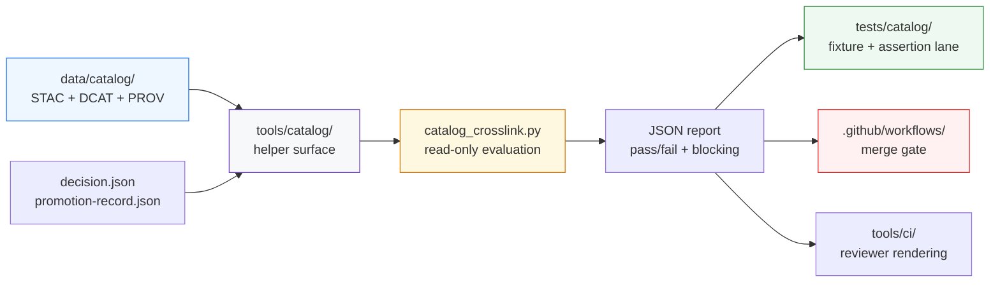

<!-- [KFM_META_BLOCK_V2]
doc_id: kfm://doc/NEEDS_VERIFICATION_UUID
title: catalog
type: standard
version: v1
status: draft
owners: @bartytime4life
created: NEEDS_VERIFICATION_DATE
updated: NEEDS_VERIFICATION_DATE
policy_label: public
related: [../README.md, ../../README.md, ../../tools/catalog/README.md, ../../data/catalog/README.md, ../../contracts/README.md, ../../schemas/README.md, ../../policy/README.md, ../../.github/workflows/README.md, ../../.github/CODEOWNERS, ../../tools/ci/README.md]
tags: [kfm, tests, catalog, stac, dcat, prov, crosslink]
notes: [Current public-main evidence confirms `tests/` as a governed verification surface and `tools/catalog/` as the adjacent helper lane, but exact checked-in `tests/catalog/` subtree reality remains NEEDS VERIFICATION because visible public-tree evidence and newer lane materials do not fully converge.]
[/KFM_META_BLOCK_V2] -->

<a id="top"></a>

# catalog

Governed verification surface for catalog closure, cross-link consistency, and catalog-adjacent helper proof in Kansas Frontier Matrix.

> **Status:** experimental  
> **Document state:** draft  
> **Owners:** `@bartytime4life`  
> **Path:** `tests/catalog/README.md`  
> **Repo fit:** child verification lane of [`../README.md`](../README.md) · proof surface for [`../../tools/catalog/README.md`](../../tools/catalog/README.md) · adjacent metadata seam [`../../data/catalog/README.md`](../../data/catalog/README.md) · shared authority in [`../../contracts/README.md`](../../contracts/README.md), [`../../schemas/README.md`](../../schemas/README.md), and [`../../policy/README.md`](../../policy/README.md) · workflow boundary in [`../../.github/workflows/README.md`](../../.github/workflows/README.md)  
>        
> **Quick jumps:** [Scope](#scope) · [Repo fit](#repo-fit) · [Accepted inputs](#accepted-inputs) · [Exclusions](#exclusions) · [Current evidence snapshot](#current-evidence-snapshot) · [Directory tree](#directory-tree) · [Quickstart](#quickstart) · [Usage](#usage) · [Diagram](#diagram) · [Tables](#tables) · [Task list](#task-list) · [FAQ](#faq) · [Appendix](#appendix)

> [!IMPORTANT]
> `tests/catalog/` is **not** the home of STAC, DCAT, or PROV truth.
>
> This lane proves catalog closure behavior over declared artifacts. The authoritative records stay in `data/catalog/`; policy law stays in `policy/`; machine contract authority stays in `contracts/` and `schemas/`.

> [!WARNING]
> This README is intentionally **evidence-bounded**.
>
> Current public documentation clearly supports `tests/` as a governed verification surface and `tools/catalog/` as an adjacent helper lane, but it does **not** cleanly prove that `tests/catalog/` is already a visible public subtree on `main`. This file therefore treats the lane as a branch-ready addition and marks exact subtree parity as **NEEDS VERIFICATION**.

---

## Scope

`tests/catalog/` is the verification lane for small, reviewable checks that prove whether catalog-oriented helper logic behaves correctly over declared inputs.

In practice, that means proving behavior around:

- STAC / DCAT / PROV cross-link consistency
- promotion-adjacent catalog closure checks
- stable JSON report shapes intended for CI or reviewer rendering
- negative-path handling for missing refs, subject drift, version drift, and malformed inputs

This lane is useful because it keeps catalog-proof behavior explicit without collapsing metadata law, policy law, and workflow orchestration into one hidden place.

### Evidence markers used in this README

| Marker | Meaning here |
|---|---|
| **CONFIRMED** | Directly supported by visible repo docs, ownership files, or public-tree inspection |
| **INFERRED** | Conservative interpretation of adjacent repo evidence or repeated doctrine |
| **PROPOSED** | Recommended landing shape or lane behavior consistent with current doctrine |
| **UNKNOWN** | Not established strongly enough from currently visible evidence |
| **NEEDS VERIFICATION** | Placeholder or branch-specific detail that should be checked before merge |

[Back to top](#top)

---

## Repo fit

`tests/catalog/` should sit between the helper lane that inspects catalog closure and the release-bearing metadata surfaces that must remain authoritative.

| Relation | Surface | Why it matters |
|---|---|---|
| Parent verification lane | [`../README.md`](../README.md) | Defines `tests/` as a governed verification surface rather than a generic QA bucket |
| Root posture | [`../../README.md`](../../README.md) | Keeps evidence-first, trust-visible repo posture in scope |
| Helper under test | [`../../tools/catalog/README.md`](../../tools/catalog/README.md) | Defines the adjacent helper lane for catalog QA, cross-link, and reviewer-facing metadata support |
| Metadata seam | [`../../data/catalog/README.md`](../../data/catalog/README.md) | Catalog records live there; this lane proves behavior over them rather than owning them |
| Contract authority | [`../../contracts/README.md`](../../contracts/README.md) | Canonical contract semantics should stay upstream from test assertions |
| Schema authority | [`../../schemas/README.md`](../../schemas/README.md) | Test fixtures should pressure declared shapes, not silently replace them |
| Policy authority | [`../../policy/README.md`](../../policy/README.md) | Tests may exercise policy consequences, but policy remains the source of truth |
| Workflow boundary | [`../../.github/workflows/README.md`](../../.github/workflows/README.md) | Merge-blocking invocation belongs at the workflow boundary, not hidden inside tests |
| Ownership | [`../../.github/CODEOWNERS`](../../.github/CODEOWNERS) | Current owner coverage for `/tests/` resolves here |
| Reviewer rendering handoff | [`../../tools/ci/README.md`](../../tools/ci/README.md) | Stable machine-readable outputs from this lane can later feed reviewer-facing summaries |

### Repo-fit summary

| Question | Answer |
|---|---|
| What belongs here? | Small, deterministic proofs for catalog closure helpers and catalog-adjacent validation behavior |
| What does not belong here? | Authoritative catalog records, policy bundles, schema-home decisions, or workflow orchestration |
| Why keep it separate from `tools/catalog/`? | `tools/catalog/` owns reusable helper behavior; `tests/catalog/` should own fixtures, assertions, and failure-path proof |
| Why keep it separate from `data/catalog/`? | Catalog artifacts are release-bearing metadata, not disposable test fixtures |

[Back to top](#top)

---

## Accepted inputs

Only explicit, reviewable, public-safe artifacts belong here.

| Input class | Examples | Why it belongs here |
|---|---|---|
| Thin-slice helper inputs | `decision.json`, `promotion-record.json`, crosslink report JSON | Lets the lane prove concrete helper behavior over declared artifacts |
| Catalog reference fixtures | STAC/DCAT/PROV refs with aligned or misaligned subject/version shapes | Makes cross-link behavior legible and deterministic |
| Minimal negative-path cases | missing refs, wrong subject, version drift, malformed JSON | KFM negative states are first-class and should be proved directly |
| Stable helper outputs | compact JSON reports and exit codes | CI and reviewer helpers can consume these without scraping logs |
| Small synthetic metadata | public-safe catalog fragments and placeholder IDs | Keeps the lane clone-safe and understandable |

### Input rules

1. Prefer explicit files over implicit environment state.
2. Prefer tiny synthetic fixtures over copied production artifacts.
3. Keep identifiers and references legible enough for review.
4. Preserve upstream artifact shape when a helper depends on it.
5. Treat malformed-input cases as equally important proof surfaces.

---

## Exclusions

| Does **not** belong here | Better home | Why |
|---|---|---|
| Authoritative STAC / DCAT / PROV records | [`../../data/catalog/README.md`](../../data/catalog/README.md) | Tests should not become the metadata truth surface |
| Helper implementation code | [`../../tools/catalog/README.md`](../../tools/catalog/README.md) | This lane proves behavior; it does not become the helper lane |
| Promotion decision logic | [`../../tools/validators/README.md`](../../tools/validators/README.md) | Validation and release decisions deserve their own stronger surface |
| Reviewer-facing Markdown rendering | [`../../tools/ci/README.md`](../../tools/ci/README.md) | Catalog tests should emit stable output that CI helpers can render |
| Workflow sequencing or permissions | [`../../.github/workflows/README.md`](../../.github/workflows/README.md) | Orchestration belongs at the workflow boundary |
| Policy vocabularies, obligations, or reason-code law | [`../../policy/README.md`](../../policy/README.md) | Tests may assert consequences, but policy remains the authority |
| Schema-home arbitration | [`../../contracts/README.md`](../../contracts/README.md), [`../../schemas/README.md`](../../schemas/README.md) | Test code must not quietly settle canonical object law |
| Secret-bearing or rights-unclear fixtures | governed secure lanes | Public test surfaces must stay safe to clone and review |

> [!CAUTION]
> If deleting a test from `tests/catalog/` would erase the only understandable explanation of how catalog closure works, too much meaning has leaked into the test lane.

[Back to top](#top)

---

## Current evidence snapshot

| Evidence item | Status | How this README uses it |
|---|---|---|
| `tests/` is a governed verification surface with public README-first routing | **CONFIRMED** | grounds this file as a child test lane rather than a generic folder |
| `/tests/` is owned by `@bartytime4life` in current visible `CODEOWNERS` | **CONFIRMED** | grounds the owners line |
| The current public `tests/README.md` names several downstream families but does **not** list `catalog/` among its confirmed downstream surfaces | **CONFIRMED** | prevents overclaiming current public subtree maturity |
| The current public `tests/` tree visibly includes `accessibility/`, `ci/`, `contracts/`, `e2e/`, `fixtures/`, `integration/`, `policy/`, `reproducibility/`, `runtime_verification/`, `unit/`, `validators/`, and `README.md` | **CONFIRMED** | grounds the parent-lane snapshot and makes the absence of visible `catalog/` meaningful |
| `tools/catalog/README.md` exists and clearly frames `tools/catalog/` as the helper lane for catalog QA, cross-link, and reviewer-facing metadata support | **CONFIRMED** | grounds the adjacent lane contract this README should complement |
| A thin-slice direction centered on `tools/catalog/catalog_crosslink.py` with `tests/catalog/test_catalog_crosslink.py` as its proof surface is documented in adjacent lane materials | **DOCUMENTED / NEEDS VERIFICATION ON TARGET BRANCH** | supports the lane shape below without upgrading branch reality into public-tree fact |
| Exact checked-in presence of `tests/catalog/` and `test_catalog_crosslink.py` on the current public `main` tree | **NEEDS VERIFICATION** | kept explicitly bounded until the target branch is inspected directly |

[Back to top](#top)

---

## Directory tree

### Current public parent snapshot

```text
tests/
├── README.md
├── accessibility/
├── ci/
├── contracts/
├── e2e/
├── fixtures/
├── integration/
├── policy/
├── reproducibility/
├── runtime_verification/
├── unit/
└── validators/
```

### Working-branch-aligned landing shape for this lane

```text
tests/catalog/
├── README.md
└── test_catalog_crosslink.py
```

### Optional fixture shape to prefer as the lane matures

```text
tests/catalog/
├── README.md
├── test_catalog_crosslink.py
└── fixtures/
    ├── aligned/
    ├── misaligned/
    └── malformed/
```

> [!NOTE]
> The first tree above is **current public-tree fact**.
>
> The latter shapes are the safest repo-native landing forms for this README and its thin-slice proof partner. Keep them marked as branch-conditional until the target checkout confirms them.

[Back to top](#top)

---

## Quickstart

Use an inspection-first sequence so this lane stays truthful as the branch evolves.

### 1) Confirm what actually exists in your checkout

```bash
find tests -maxdepth 3 -print 2>/dev/null | sort
find tools/catalog -maxdepth 3 -print 2>/dev/null | sort
```

### 2) Re-read the parent and adjacent lane contracts

```bash
sed -n '1,260p' tests/README.md 2>/dev/null
sed -n '1,260p' tools/catalog/README.md 2>/dev/null
sed -n '1,260p' data/catalog/README.md 2>/dev/null
sed -n '1,260p' .github/workflows/README.md 2>/dev/null
```

### 3) Search for current callers before inventing names

```bash
rg -n "catalog|crosslink|stac|dcat|prov" tests tools scripts .github data contracts schemas policy -S 2>/dev/null
```

### 4) Branch-conditional thin-slice local run

```bash
python tools/catalog/catalog_crosslink.py \
  --decision decision.json \
  --record promotion-record.json \
  --output catalog-crosslink-report.json
```

### 5) Branch-conditional thin-slice test run

```bash
pytest -q tests/catalog/test_catalog_crosslink.py
```

> [!TIP]
> Inventory first, then assert lane maturity.
> In KFM, a clear “not present yet” result is stronger than a confident fantasy subtree.

[Back to top](#top)

---

## Usage

### Add a focused catalog proof

Use `tests/catalog/` when the main job is to prove **catalog-oriented helper behavior** over declared inputs.

Typical fits:

- proving STAC / DCAT / PROV ref presence checks
- proving subject alignment across a catalog triplet
- proving version alignment across a catalog triplet
- proving release-ref alignment against the same promoted subject
- proving blocking vs non-blocking output shape for CI or reviewer handoff

### Keep this split clean

A healthy split looks like this:

- `data/catalog/` owns the outward metadata
- `tools/catalog/` owns reusable helper behavior
- `tests/catalog/` owns fixtures and assertions
- `.github/workflows/` decides when blocking checks run
- `tools/ci/` renders stable helper outputs for reviewers

### Thin-slice behavior this lane should prove

The smallest credible first proof is a pass/fail pair around cross-link closure:

1. **aligned triplet**  
   same subject, same version, release ref aligned  
   → helper returns pass and non-blocking output

2. **misaligned triplet**  
   mismatched subject or mismatched version  
   → helper returns fail and blocking output

### Tool behavior contract

| Concern | Required posture |
|---|---|
| Determinism | Same inputs should yield the same JSON shape and exit code |
| Failure semantics | Blocking checks fail non-zero and explain what broke |
| Output shape | Prefer stable JSON when CI or reviewer helpers consume the result |
| Boundary discipline | No hidden policy law, no silent schema arbitration, no publish shortcuts |
| Local / CI parity | A merge-blocking check should be runnable locally |
| Safety | No secret scraping, no rights-unclear fixtures, no unrestricted sensitive metadata |

[Back to top](#top)

---

## Diagram



---

## Tables

### Proof matrix

| Proof case | Inputs | Expected result | Why it matters |
|---|---|---|---|
| Aligned triplet | STAC / DCAT / PROV refs for one subject and one version | `pass`, non-blocking | proves the happy path without ambiguity |
| PROV subject drift | mismatched `prov` subject ref | `fail`, blocking | catches lineage misbinding |
| Version drift | STAC / DCAT / PROV versions diverge | `fail`, blocking | catches closure drift across outward records |
| Release-ref drift | release ref version not aligned to catalog triplet | `fail`, blocking | catches review-significant promotion mismatch |
| Malformed input | missing file or invalid JSON | `error`, non-success exit | proves fail-closed hygiene |

### Boundary matrix

| Surface | Owns truth? | Owns proof? | Owns orchestration? |
|---|---:|---:|---:|
| `data/catalog/` | ✅ | ❌ | ❌ |
| `tools/catalog/` | ❌ | helper behavior only | ❌ |
| `tests/catalog/` | ❌ | ✅ | ❌ |
| `.github/workflows/` | ❌ | ❌ | ✅ |
| `tools/ci/` | ❌ | rendered summaries only | ❌ |

[Back to top](#top)

---

## Task list

- [ ] Verify whether `tests/catalog/` already exists on the target branch
- [ ] Land or confirm `test_catalog_crosslink.py`
- [ ] Add tiny aligned and misaligned fixture pairs if the branch keeps them local to this lane
- [ ] Prove local and CI invocation parity with one documented command pair
- [ ] Extend cross-link checks from ref-shape alignment toward declared mounted-record subject/property checks
- [ ] Add an optional reviewer-facing handoff path into `tools/ci/` once the JSON report shape is stable
- [ ] Reconcile this lane with the parent `tests/README.md` family map after subtree reality is confirmed

### Definition of done

This lane is ready to move from draft toward review when all of the following are true:

- the target branch clearly contains the subtree
- one thin-slice test is executable
- the helper under test has a documented local run path
- negative-path behavior is explicit
- parent and adjacent lane docs no longer disagree about whether the subtree exists

[Back to top](#top)

---

## FAQ

### Why put this under `tests/` instead of `tools/catalog/`?

Because `tools/catalog/` should own reusable helper behavior. `tests/catalog/` should own fixtures, assertions, and negative-path proof.

### Why does this README keep saying “NEEDS VERIFICATION”?

Because the visible public repo evidence does not cleanly prove the subtree already exists, even though adjacent lane materials clearly point toward it. This file keeps that tension visible instead of smoothing it away.

### Why not store real catalog records here as fixtures?

Because catalog records are release-bearing metadata. Small synthetic examples are fine; authoritative records should stay in the metadata lane and be referenced deliberately.

### Should this lane become a full end-to-end promotion suite?

No. Once the proof burden becomes broader than catalog helper behavior, it should graduate to `tests/e2e/`, `tests/validators/`, or another stronger lifecycle surface.

[Back to top](#top)

---

## Appendix

<details>
<summary>Illustrative thin-slice fixture pair</summary>

These examples are illustrative only. Keep checked-in fixtures tiny and synthetic.

### `decision.json`

```json
{
  "candidate_id": "overlay:floodplain-kansas",
  "catalog_refs": {
    "stac": "kfm://catalog/stac/overlay/floodplain-kansas/v1",
    "dcat": "kfm://catalog/dcat/overlay/floodplain-kansas/v1",
    "prov": "kfm://catalog/prov/overlay/floodplain-kansas/v1"
  }
}
```

### `promotion-record.json`

```json
{
  "record_type": "kfm.promotion.record",
  "candidate_id": "overlay:floodplain-kansas",
  "spec_hash": "aaaaaaaaaaaaaaaaaaaaaaaaaaaaaaaaaaaaaaaaaaaaaaaaaaaaaaaaaaaaaaaa",
  "decision": "PROMOTE",
  "generated_at": "2026-04-13T00:00:00Z",
  "recorded_at": "2026-04-13T00:05:00Z",
  "reason_codes": [],
  "obligations": [],
  "release_ref": "kfm://release/overlay/floodplain-kansas/v1",
  "gate_statuses": {
    "A": "PASS",
    "B": "PASS",
    "C": "PASS",
    "D": "PASS",
    "E": "PASS",
    "F": "PASS",
    "G": "PASS"
  }
}
```

### Review prompt

Before treating the lane as live, check:

1. Does the active branch actually contain `tests/catalog/`?
2. Does the helper under test emit a stable JSON report?
3. Are aligned and misaligned cases both present?
4. Does the workflow lane call the same helper humans can run locally?

</details>

[Back to top](#top)
