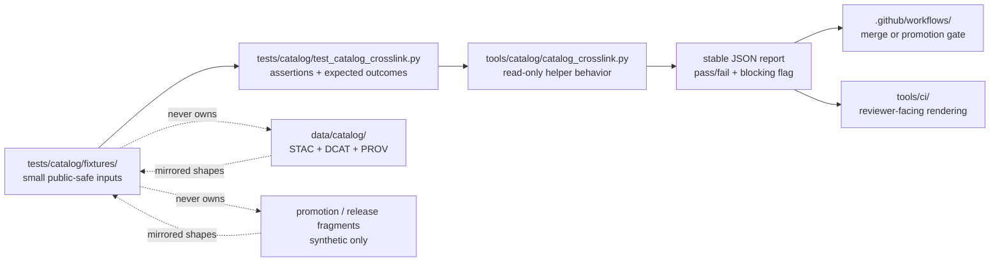

<!-- [KFM_META_BLOCK_V2]
doc_id: kfm://doc/NEEDS_VERIFICATION__tests_catalog_fixtures_readme
title: Catalog Crosslink Fixtures
type: standard
version: v1
status: draft
owners: @bartytime4life
created: NEEDS_VERIFICATION__YYYY-MM-DD
updated: 2026-04-27
policy_label: NEEDS_VERIFICATION__public_or_internal
related: [../README.md, ../test_catalog_crosslink.py, ../../README.md, ../../../README.md, ../../../tools/catalog/README.md, ../../../data/catalog/README.md, ../../../tools/ci/README.md, ../../../tools/validators/README.md, ../../../policy/README.md, ../../../contracts/README.md, ../../../schemas/README.md, ../../../.github/CODEOWNERS, ../../../.github/workflows/README.md]
tags: [kfm, tests, catalog, fixtures, crosslink, stac, dcat, prov]
notes: [Owner is inherited from surfaced tests-scope ownership and should be rechecked at leaf level before merge. This README is fixture-facing; it does not claim live catalog records, workflow enforcement, branch protection, or mature test depth. Fixture inventory remains active-branch verification work.]
[/KFM_META_BLOCK_V2] -->

<a id="top"></a>

# Catalog Crosslink Fixtures

Small, deterministic, public-safe fixtures for proving catalog crosslink behavior without turning tests into the catalog truth surface.

> [!IMPORTANT]
> **Status:** experimental  
> **Owners:** `@bartytime4life` *(inherited from surfaced `/tests/` ownership; leaf-level ownership still needs active-branch verification)*  
> **Path:** `tests/catalog/fixtures/README.md`  
> **Repo fit:** child fixture lane for [`../test_catalog_crosslink.py`](../test_catalog_crosslink.py), beneath the catalog helper-proof lane at [`../README.md`](../README.md). Helper code belongs in [`../../../tools/catalog/README.md`](../../../tools/catalog/README.md); release-bearing catalog metadata belongs in [`../../../data/catalog/README.md`](../../../data/catalog/README.md).  
> **Quick jumps:** [Scope](#scope) · [Repo fit](#repo-fit) · [Accepted inputs](#accepted-inputs) · [Exclusions](#exclusions) · [Directory tree](#directory-tree) · [Quickstart](#quickstart) · [Usage](#usage) · [Diagram](#diagram) · [Operating tables](#operating-tables) · [Task list](#task-list--definition-of-done) · [FAQ](#faq) · [Appendix](#appendix)


> [!WARNING]
> This directory should contain **fixtures**, not authority.  
> Do not store canonical STAC/DCAT/PROV records, source policy, release decisions, proof packs, receipts, or workflow law here.

---

## Scope

`tests/catalog/fixtures/` holds tiny fixture artifacts used to prove catalog crosslink behavior over declared inputs.

Use this lane to make catalog helper behavior reviewable:

- `CONFIRMED`/happy-path fixture shapes that show aligned subject, version, release, and catalog references.
- `DENY`/failure-path fixture shapes that show mismatched subject, version drift, release-ref drift, missing references, or malformed JSON.
- Expected output fragments when [`../test_catalog_crosslink.py`](../test_catalog_crosslink.py) needs stable JSON report assertions.
- Synthetic catalog-adjacent metadata that is safe to clone, safe to diff, and small enough to inspect by eye.

This fixture lane supports the KFM proof posture: **catalog closure should be tested with explicit positive and negative examples before a release can be trusted.**

[Back to top](#top)

---

## Repo fit

| Relation | Surface | Responsibility |
|---|---|---|
| Parent catalog test lane | [`../README.md`](../README.md) | Defines the catalog helper-proof boundary and points to the executable test surface. |
| Test that consumes these fixtures | [`../test_catalog_crosslink.py`](../test_catalog_crosslink.py) | Owns assertions, expected outcomes, and helper invocation. |
| Broader tests boundary | [`../../README.md`](../../README.md) | Keeps this fixture lane inside KFM’s governed verification surface. |
| Helper implementation | [`../../../tools/catalog/README.md`](../../../tools/catalog/README.md) | Owns reusable catalog QA/crosslink/helper behavior. |
| Catalog metadata seam | [`../../../data/catalog/README.md`](../../../data/catalog/README.md) | Owns outward STAC/DCAT/PROV catalog records and release-bearing metadata. |
| CI reviewer rendering | [`../../../tools/ci/README.md`](../../../tools/ci/README.md) | May render stable machine outputs from catalog checks for reviewers. |
| Workflow boundary | [`../../../.github/workflows/README.md`](../../../.github/workflows/README.md) | Decides when catalog checks block merges or promotion. |
| Policy authority | [`../../../policy/README.md`](../../../policy/README.md) | Owns policy vocabulary, obligations, denials, and reason-code law. |
| Contract/schema authority | [`../../../contracts/README.md`](../../../contracts/README.md), [`../../../schemas/README.md`](../../../schemas/README.md) | Own declared object semantics; fixtures should pressure those shapes, not replace them. |

### Repo-fit summary

| Question | Answer |
|---|---|
| What belongs here? | Small fixture files and expected outputs for catalog closure and catalog crosslink tests. |
| What does not belong here? | Authoritative catalog records, helper code, policy rules, schema authority, workflow sequencing, receipts, proofs, or release aliases. |
| Why not keep this under `data/catalog/`? | `data/catalog/` is release-bearing metadata; this folder is disposable test input. |
| Why not keep this under `tools/catalog/`? | `tools/catalog/` owns helper behavior; this folder owns examples that prove helper behavior. |

[Back to top](#top)

---

## Accepted inputs

Only explicit, reviewable, public-safe artifacts belong here.

| Input class | Examples | Why it belongs here |
|---|---|---|
| Catalog crosslink fixtures | STAC/DCAT/PROV reference fragments with shared or divergent subject/version IDs | Makes closure behavior visible and deterministic. |
| Promotion-adjacent fixture fragments | `promotion-record-mismatch.json`, release-ref snippets, decision-ref snippets | Lets tests prove that promotion records cannot silently disagree with catalog lineage. |
| Negative-path fixtures | missing refs, wrong subject, version drift, release drift, malformed JSON | KFM negative states are first-class and should be proved directly. |
| Expected helper outputs | compact expected JSON reports, expected blocking flags, expected reason-code fragments | Lets CI and reviewer helpers consume stable output without scraping logs. |
| Tiny synthetic metadata | placeholder IDs, synthetic digest strings, short timestamps, toy release refs | Keeps tests safe to clone and easy to review. |

### Input rules

1. Prefer tiny synthetic fixtures over copied production artifacts.
2. Preserve the upstream artifact shape when a helper depends on that shape.
3. Keep fixture names descriptive enough that reviewers can guess the failure being proved.
4. Include at least one negative fixture for every meaningful happy-path fixture family.
5. Do not hide expected outcomes in test code when a small golden output fixture would be clearer.
6. Use deterministic IDs, placeholder digests, and public-safe values only.

[Back to top](#top)

---

## Exclusions

| Does **not** belong here | Better home | Why |
|---|---|---|
| Authoritative STAC/DCAT/PROV records | [`../../../data/catalog/README.md`](../../../data/catalog/README.md) | Tests should not become the metadata truth surface. |
| Catalog helper implementation code | [`../../../tools/catalog/README.md`](../../../tools/catalog/README.md) | This folder proves behavior; it does not implement behavior. |
| Test functions and assertions | [`../test_catalog_crosslink.py`](../test_catalog_crosslink.py) | Fixtures should stay declarative and reusable. |
| Promotion gate logic | [`../../../tools/validators/README.md`](../../../tools/validators/README.md) | Release decisions deserve a stronger validator boundary. |
| Policy vocabularies or obligation law | [`../../../policy/README.md`](../../../policy/README.md) | Fixtures may exercise consequences, but policy remains authoritative elsewhere. |
| Schema-home arbitration | [`../../../contracts/README.md`](../../../contracts/README.md), [`../../../schemas/README.md`](../../../schemas/README.md) | Fixtures must not quietly decide contract authority. |
| Workflow permissions or branch protection | [`../../../.github/workflows/README.md`](../../../.github/workflows/README.md) | Orchestration belongs at the workflow boundary. |
| Receipts, proof packs, or release manifests as primary records | `../../../data/receipts/`, `../../../data/proofs/`, `../../../data/releases/` | This lane may mirror tiny shapes, but it must not own process memory or proof authority. |
| Raw, private, rights-unclear, or sensitive datasets | governed data zones or ignored local-only paths | Public test surfaces must remain safe to clone and review. |

[Back to top](#top)

---

## Current evidence snapshot

| Evidence item | Status | How this README uses it |
|---|---|---|
| `tests/catalog/` is documented as the helper-proof lane for catalog crosslink behavior | `DOCUMENTED` | Grounds this file as a child fixture README, not a generic fixture bucket. |
| `tests/catalog/test_catalog_crosslink.py` is the documented thin-slice proof surface | `DOCUMENTED` | Establishes the primary consumer for these fixtures. |
| `tests/catalog/fixtures/promotion-record-mismatch.json` and `tests/catalog/fixtures/prov-mismatch.json` are documented fixture examples | `DOCUMENTED / NEEDS VERIFICATION` | Included as the first flat fixture names to verify or preserve. |
| Mature fixture subfamilies such as `aligned/`, `misaligned/`, `malformed/`, and `expected/` | `PROPOSED` | Recommended only when fixture density outgrows a flat directory. |
| Exact active-branch file presence, branch protection, and merge-blocking runner depth | `UNKNOWN` | Kept out of claims until the target checkout is inspected directly. |
| KFM catalog closure doctrine across STAC/DCAT/PROV, proof, release, and rollback objects | `CORPUS-CONFIRMED` | Shapes the guardrails and task list below. |

[Back to top](#top)

---

## Directory tree

### Documented minimal fixture shape

```text
tests/catalog/
├── README.md
├── test_catalog_crosslink.py
└── fixtures/
    ├── README.md
    ├── promotion-record-mismatch.json
    └── prov-mismatch.json
```

### Preferred growth shape when fixture density increases

```text
tests/catalog/
├── README.md
├── test_catalog_crosslink.py
└── fixtures/
    ├── README.md
    ├── aligned/
    │   └── catalog-triplet-aligned.json
    ├── misaligned/
    │   ├── promotion-record-mismatch.json
    │   └── prov-mismatch.json
    ├── malformed/
    │   └── invalid-json-or-missing-ref.json
    └── expected/
        └── catalog-crosslink-report.blocking.json
```

> [!NOTE]
> Keep the flat fixture shape while there are only one or two cases. Move into `aligned/`, `misaligned/`, `malformed/`, and `expected/` only when the folder becomes hard to scan.

[Back to top](#top)

---

## Quickstart

Run commands from the repository root.

### 1) Confirm what actually exists

```bash
find tests/catalog -maxdepth 4 -type f 2>/dev/null | sort
find tools/catalog -maxdepth 3 -type f 2>/dev/null | sort
```

### 2) Re-read the parent and adjacent lane contracts

```bash
sed -n '1,260p' tests/catalog/README.md 2>/dev/null || true
sed -n '1,260p' tests/README.md 2>/dev/null || true
sed -n '1,260p' tools/catalog/README.md 2>/dev/null || true
sed -n '1,260p' data/catalog/README.md 2>/dev/null || true
sed -n '1,260p' tools/ci/README.md 2>/dev/null || true
sed -n '1,260p' .github/workflows/README.md 2>/dev/null || true
```

### 3) Search for current fixture callers before renaming files

```bash
rg -n "promotion-record-mismatch|prov-mismatch|catalog_crosslink|stac|dcat|prov|crosslink|CatalogMatrix" \
  tests tools data schemas contracts policy .github docs 2>/dev/null
```

### 4) Run the focused catalog test

```bash
pytest -q tests/catalog/test_catalog_crosslink.py
```

### 5) Run the helper manually when the branch provides it

```bash
python tools/catalog/catalog_crosslink.py \
  --decision decision.json \
  --record promotion-record.json \
  --output catalog-crosslink-report.json
```

> [!TIP]
> Prefer repo-native commands discovered from the checkout over README-invented runners.  
> Inspection-first is safer than guessing a toolchain.

[Back to top](#top)

---

## Usage

### Add a fixture

1. Choose the proof burden first: `aligned`, `misaligned`, `malformed`, or `expected`.
2. Keep the JSON small enough for a reviewer to understand without running the test.
3. Use placeholder IDs and synthetic digests rather than copied release records.
4. Add or update the assertion in [`../test_catalog_crosslink.py`](../test_catalog_crosslink.py).
5. Run the focused test locally.
6. Update this README if the fixture adds a new class of failure.

### Name fixtures by the failure they prove

Prefer names that read like review notes:

```text
promotion-record-mismatch.json
prov-mismatch.json
version-drift.json
release-ref-drift.json
missing-stac-ref.json
malformed-catalog-fragment.json
catalog-triplet-aligned.json
```

Avoid names that hide the proof burden:

```text
test1.json
sample.json
bad.json
fixture.json
tmp.json
```

### Keep fixture shape close to upstream shape

A catalog helper should be tested against declared artifact shapes, not invented mini-languages. When a fixture represents a STAC/DCAT/PROV, promotion, release, or proof object fragment, keep field names recognizable and document any intentional omissions in the test.

[Back to top](#top)

---

## Diagram



[Back to top](#top)

---

## Operating tables

### Fixture intent matrix

| Fixture or family | Intent | Expected posture |
|---|---|---|
| `catalog-triplet-aligned.json` | Same subject, same version, release ref aligned across catalog refs | `pass`, non-blocking |
| `promotion-record-mismatch.json` | Promotion or release reference intentionally disagrees with catalog lineage | `fail`, blocking |
| `prov-mismatch.json` | PROV lineage subject or release ref intentionally disagrees with expected catalog closure | `fail`, blocking |
| `version-drift.json` | STAC/DCAT/PROV versions diverge for the same subject | `fail`, blocking |
| `missing-ref.json` | Required catalog reference is absent | `fail` or `error`, depending on helper contract |
| `malformed-json.json` | Parser or required-shape failure | `error`, non-success exit |

### Boundary matrix

| Surface | Owns data truth? | Owns helper behavior? | Owns fixture proof? | Owns orchestration? |
|---|---:|---:|---:|---:|
| `data/catalog/` | ✅ | ❌ | ❌ | ❌ |
| `tools/catalog/` | ❌ | ✅ | ❌ | ❌ |
| `tests/catalog/fixtures/` | ❌ | ❌ | ✅ | ❌ |
| `tests/catalog/test_catalog_crosslink.py` | ❌ | ❌ | ✅ | ❌ |
| `.github/workflows/` | ❌ | ❌ | ❌ | ✅ |
| `tools/ci/` | ❌ | rendered summaries only | ❌ | ❌ |

### Change impact table

| If a PR changes… | Minimum expectation for this fixture lane |
|---|---|
| `tools/catalog/catalog_crosslink.py` | Update fixtures or expected outputs when helper inputs/outputs change. |
| STAC/DCAT/PROV catalog shapes | Add aligned and misaligned fixture cases that preserve recognizable upstream field names. |
| Promotion record shape | Update mismatch fixtures and ensure the failure remains legible. |
| Catalog closure policy | Keep policy law out of fixtures; update expected reason-code fragments only if the helper emits them. |
| Workflow blocking behavior | Update workflow docs, not just fixture names. |
| Parent `tests/catalog/README.md` | Keep this child README in sync with the parent lane contract. |

[Back to top](#top)

---

## Task list / Definition of done

- [ ] Verify that `tests/catalog/fixtures/` exists on the target branch.
- [ ] Verify whether `promotion-record-mismatch.json` and `prov-mismatch.json` are present, renamed, or superseded.
- [ ] Add or confirm one aligned fixture and one misaligned fixture.
- [ ] Add or confirm one malformed-input fixture if the helper parses JSON directly.
- [ ] Confirm `../test_catalog_crosslink.py` references fixture paths explicitly.
- [ ] Confirm fixture data is public-safe, synthetic, and free of secrets or rights-unclear source payloads.
- [ ] Confirm focused local invocation works with the repo-native runner.
- [ ] Confirm parent docs no longer disagree about fixture names or folder shape.
- [ ] Move flat fixtures into subfolders only when the directory becomes hard to scan.
- [ ] Keep fixture changes paired with helper/test changes in the same PR.

This README can move from draft toward review when the active branch contains the subtree, the focused catalog test consumes these fixtures, negative-path behavior is explicit, and no fixture is acting as an authoritative catalog record.

[Back to top](#top)

---

## FAQ

### Why does this folder need its own README?

Because catalog closure is trust-critical. A small child README keeps fixture intent visible without forcing reviewers to infer meaning from filenames alone.

### Why not put these fixtures under top-level `tests/fixtures/`?

`tests/catalog/fixtures/` keeps catalog crosslink proof close to the catalog test that consumes it. Top-level fixture lanes can still exist, but this child lane reduces ambiguity for a focused helper-proof surface.

### Can these fixtures copy real catalog records?

No. Use tiny synthetic fragments unless a maintainer explicitly approves a governed test copy. Even then, remove secrets, rights-unclear payloads, sensitive geometry, and unnecessary bulk.

### Can this folder contain expected JSON reports?

Yes, when the expected report shape is stable enough to support deterministic assertions. Keep expected outputs compact and reviewer-readable.

### What should happen when a fixture proves a policy denial?

Keep the policy rule in [`../../../policy/README.md`](../../../policy/README.md) or the relevant policy file. This folder may hold the input and expected consequence, but it must not become the policy authority.

[Back to top](#top)

---

## Appendix

<details>
<summary>Illustrative fixture patterns</summary>

The examples below are illustrative only. Adapt field names to the active branch’s actual helper contract before committing.

### Aligned catalog triplet fragment

```json
{
  "case_id": "catalog-triplet-aligned",
  "subject_id": "kfm:release:floodplain-kansas-v1",
  "release_ref": "kfm:release:floodplain-kansas-v1@2026-04-verified",
  "catalog_refs": {
    "stac": {
      "subject_id": "kfm:release:floodplain-kansas-v1",
      "version": "2026-04-verified"
    },
    "dcat": {
      "subject_id": "kfm:release:floodplain-kansas-v1",
      "version": "2026-04-verified"
    },
    "prov": {
      "subject_id": "kfm:release:floodplain-kansas-v1",
      "version": "2026-04-verified"
    }
  },
  "expected": {
    "blocking": false,
    "outcome": "pass"
  }
}
```

### Misaligned PROV fragment

```json
{
  "case_id": "prov-mismatch",
  "subject_id": "kfm:release:floodplain-kansas-v1",
  "release_ref": "kfm:release:floodplain-kansas-v1@2026-04-verified",
  "catalog_refs": {
    "stac": {
      "subject_id": "kfm:release:floodplain-kansas-v1",
      "version": "2026-04-verified"
    },
    "dcat": {
      "subject_id": "kfm:release:floodplain-kansas-v1",
      "version": "2026-04-verified"
    },
    "prov": {
      "subject_id": "kfm:release:wrong-subject",
      "version": "2026-04-verified"
    }
  },
  "expected": {
    "blocking": true,
    "outcome": "fail",
    "reason": "PROV_SUBJECT_MISMATCH"
  }
}
```

### Expected report fragment

```json
{
  "report_type": "kfm.catalog_crosslink.report",
  "case_id": "prov-mismatch",
  "outcome": "fail",
  "blocking": true,
  "failures": [
    {
      "field": "catalog_refs.prov.subject_id",
      "reason": "PROV_SUBJECT_MISMATCH"
    }
  ]
}
```

</details>

[Back to top](#top)
