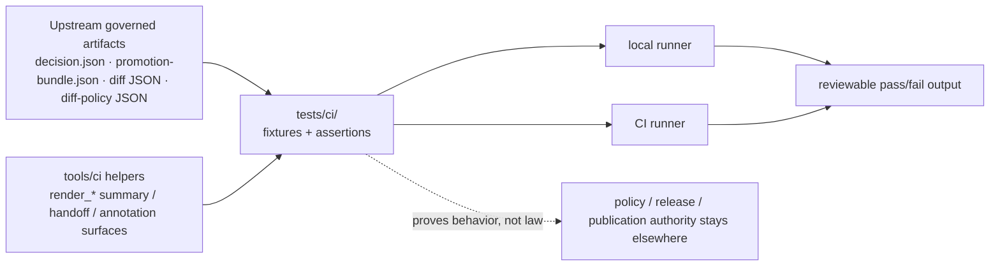

<!-- [KFM_META_BLOCK_V2]
doc_id: kfm://doc/NEEDS_VERIFICATION_UUID
title: tests/ci
type: standard
version: v1
status: draft
owners: @bartytime4life
created: YYYY-MM-DD
updated: 2026-04-14
policy_label: public
related: [
  ../README.md,
  ../../README.md,
  ../../.github/README.md,
  ../../.github/CODEOWNERS,
  ../../.github/workflows/README.md,
  ../../.github/actions/README.md,
  ../../scripts/README.md,
  ../../contracts/README.md,
  ../../schemas/README.md,
  ../../policy/README.md,
  ../../tools/ci/README.md,
  ../../tools/diff/README.md,
  ../../tools/attest/README.md,
  ../../tools/validators/promotion_gate/README.md,
  ./test_render_diff_summary.py,
  ./test_render_bundle_diff_policy_summary.py,
  ./test_render_promotion_review_handoff.py,
  ../validators/test_promotion_gate_e2e.py
]
tags: [kfm, tests, ci, fixtures, renderer-tests, promotion, diff, policy-summary, review-handoff]
notes: [
  "Updated to reflect the expanded CI renderer-proof thin slice, including test_render_bundle_diff_policy_summary.py and test_render_promotion_review_handoff.py.",
  "Owners are now grounded by current /tests/ CODEOWNERS coverage rather than a lane-specific rule.",
  "Exact commit dates, broader lane inventory, and any additional mounted test files still remain NEEDS VERIFICATION."
]
[/KFM_META_BLOCK_V2] -->

<a id="top"></a>

# `tests/ci/`

Deterministic, public-safe proof surface for **KFM CI-facing summary, renderer, and annotation helpers**.

> [!NOTE]
> **Status:** experimental  
> **Owners:** `@bartytime4life`  
> **Path:** `tests/ci/README.md`  
>        
> **Quick jumps:** [Scope](#scope) · [Repo fit](#repo-fit) · [Inputs](#inputs) · [Exclusions](#exclusions) · [Current evidence snapshot](#current-evidence-snapshot) · [Directory tree](#directory-tree) · [Quickstart](#quickstart) · [Usage](#usage) · [Diagram](#diagram) · [Coverage matrix](#coverage-matrix) · [Definition of done](#definition-of-done) · [FAQ](#faq) · [Appendix](#appendix)

> [!IMPORTANT]
> `tests/ci/` proves helper behavior for CI-facing renderers and summaries.
>
> It does **not** own workflow orchestration, promotion decisions, policy semantics, release state, or canonical schema law.

> [!TIP]
> Keep the KFM trust split visible here:
>
> **fixtures + assertions ≠ helper implementation ≠ workflow orchestration**
>
> - `tools/ci/` owns reusable helper behavior  
> - `tests/ci/` proves deterministic helper behavior  
> - `.github/workflows/` decides when those proofs run

> [!WARNING]
> Fixtures here should be tiny, deterministic, and safe to print in logs.
> Never commit tokens, unpublished evidence, internal-only trust objects, or sensitive location-bearing payloads as convenience test data.

---

## Scope

`tests/ci/` is the KFM test lane for proving that small **CI-facing helpers** behave deterministically over already-governed artifacts.

This lane is the right home for:

- tests for reviewer-facing Markdown summary renderers
- tests for compact annotation or gate-digest helpers
- tests for stable normalization of CI-facing helper input and output
- golden-fragment or structured-output assertions for helper behavior
- helper-focused negative-path cases such as malformed input, missing required fields, or unstable output shape
- tests for diff-summary rendering over stable diff reports
- tests for policy-summary rendering over checked-in bundle diff-policy reports
- tests for composed reviewer handoff rendering over promotion bundle, diff, and diff-policy artifacts

This lane is **not** the home for:

- policy authority
- promotion or release decisions
- long-running end-to-end orchestration
- helper implementation code
- hidden workflow logic
- broad runtime-proof scenario packs that belong in a more specific lane

This README serves two purposes at once:

1. a **normative lane contract** for CI-helper proof surfaces
2. an **implementation-facing directory README** for the current thin slice under `tests/ci/`

### Truth labels used in this README

| Label | Meaning here |
| --- | --- |
| **CONFIRMED** | Supported by attached KFM doctrine or by adjacent repo-facing documentation surfaced in this session |
| **INFERRED** | Conservative reading of neighboring surfaces that is useful but not proven as current checked-in lane inventory |
| **PROPOSED** | Recommended target shape or future coverage pattern consistent with KFM doctrine |
| **UNKNOWN** | Not surfaced strongly enough to describe as current repo fact |
| **NEEDS VERIFICATION** | Placeholder detail that should be rechecked against the working branch before merge |

[Back to top](#top)

---

## Repo fit

**Path:** `tests/ci/README.md`  
**Role:** directory README for helper-focused CI test surfaces inside the broader `tests/` proof boundary.

| Direction | Surface | Why it matters |
| --- | --- | --- |
| Parent | [`../README.md`](../README.md) | `tests/` is the shared proof surface for fixtures, assertions, and regression evidence |
| Root posture | [`../../README.md`](../../README.md) | Keeps this lane subordinate to the repo’s evidence-first and trust-visible posture |
| Governance | [`../../.github/README.md`](../../.github/README.md) | The gatehouse is the caller boundary, not the place where assertion logic should disappear |
| Ownership surface | [`../../.github/CODEOWNERS`](../../.github/CODEOWNERS) | Current `/tests/` ownership resolves here |
| Primary subject lane | [`../../tools/ci/README.md`](../../tools/ci/README.md) | Defines what the helpers do; `tests/ci/` proves how they behave |
| Adjacent subject lane | [`../../tools/diff/README.md`](../../tools/diff/README.md) | Diff computation stays there; render tests here should consume declared diff outputs rather than recompute comparison law |
| Adjacent subject lane | [`../../tools/attest/README.md`](../../tools/attest/README.md) | Verification state may later be rendered in CI, but signing and verification logic remain elsewhere |
| Adjacent validator lane | [`../../tools/validators/promotion_gate/README.md`](../../tools/validators/promotion_gate/README.md) | Promotion-gate and diff-policy validation live there; `tests/ci/` should stay helper-focused |
| Workflow boundary | [`../../.github/workflows/README.md`](../../.github/workflows/README.md) | Workflows orchestrate; they should call stable helpers and tests rather than embed large shell assertions |
| Step-wrapper seam | [`../../.github/actions/README.md`](../../.github/actions/README.md) | Repo-local actions may call these helpers, but assertion logic should still remain visible in shared tests |
| Thin orchestration | [`../../scripts/README.md`](../../scripts/README.md) | Local wrappers may run these tests, but reusable proof should not be buried in scripts |
| Canonical law | [`../../contracts/README.md`](../../contracts/README.md), [`../../schemas/README.md`](../../schemas/README.md), [`../../policy/README.md`](../../policy/README.md) | Tests may validate helper output against those surfaces, but must not quietly replace them |
| Neighboring test lane | [`../validators/test_promotion_gate_e2e.py`](../validators/test_promotion_gate_e2e.py) | Helps keep renderer tests separate from governed promotion-gate and bundle diff-policy behavior |

### Working interpretation

Use `tests/ci/` when the main job is **prove helper behavior over declared artifacts**. Move out of this lane when the main job becomes **decide policy**, **validate full promotion candidates**, **own canonical schemas**, or **exercise broad runtime-proof choreography**.

[Back to top](#top)

---

## Inputs

### Accepted inputs

| Input class | Examples | Why it belongs here |
| --- | --- | --- |
| Structured helper inputs | stable diff JSON, `decision.json`, `promotion-bundle.json`, normalized check result JSON, bundle diff-policy JSON | CI render helpers should be tested against declared, reviewable artifacts rather than scraped log blobs |
| Composed handoff inputs | promotion bundle + diff report + diff-policy report | Needed when one helper composes several already-governed artifacts into one review document |
| Expected human-facing outputs | Markdown summaries, compact text blocks, reviewer-facing fragments | These are the main visible outputs of `tools/ci/` helpers |
| Expected machine-facing outputs | compact JSON digests, normalized intermediate files, exit statuses | Some helpers may emit structured outputs that workflows or scripts consume |
| Failure-path fixtures | malformed JSON, missing required fields, empty bundles, unsupported states | Negative paths are first-class in KFM and should be proved here |
| Minimal invocation context | output paths, mode flags, deterministic input file locations | Keeps helper behavior testable without hiding assumptions in workflow YAML |
| Golden fragments | small reviewed excerpts of expected Markdown or JSON | Useful when output shape matters more than every byte |

### Input rules

1. Prefer declared file inputs over implicit environment scraping.
2. Prefer public-safe, tiny fixtures over large copied artifacts.
3. Prefer deterministic fixtures over live GitHub or platform state.
4. Keep helper-specific contracts narrow and explicit.
5. Make negative-path fixtures as legible as the passing ones.
6. When a helper consumes governed artifacts, preserve the upstream artifact shape instead of re-inventing it in test code.

[Back to top](#top)

---

## Exclusions

| Does **not** belong here | Put it here instead | Why |
| --- | --- | --- |
| Helper implementation code | [`../../tools/ci/README.md`](../../tools/ci/README.md) and the helper path itself | `tests/ci/` proves behavior; it does not become the helper lane |
| Workflow sequencing or permission logic | [`../../.github/workflows/README.md`](../../.github/workflows/README.md) | Orchestration belongs at the workflow boundary |
| Repo-local composite action metadata | [`../../.github/actions/README.md`](../../.github/actions/README.md) | Step-wrapper seams stay in the gatehouse, not in shared tests |
| Canonical policy decisions | [`../../policy/README.md`](../../policy/README.md) | Tests may assert rendered policy output, but policy remains the source of truth |
| Release or promotion decision logic | [`../../tools/validators/promotion_gate/README.md`](../../tools/validators/promotion_gate/README.md) and `../validators/` | Promotion validation is a different lane from CI summary rendering |
| Broad end-to-end runtime proof packs | `../e2e/` or `../validators/` | Keep this lane focused on helper proofs, not full workflow choreography |
| Secret-bearing, unpublished, or rights-unclear fixtures | secured data lanes or safer synthetic fixtures | Public test surfaces must remain safe to clone and review |
| Ad hoc scratch files used only once | governed fixture surfaces under `tests/` | Fixtures should stay legible, reusable, and reviewable |
| Auto-fix or mutation shortcuts | nowhere | KFM review and promotion stay governed and inspectable |
| Treating the composed handoff Markdown as the authoritative trust object | nowhere | The underlying bundle, diff, and diff-policy machine artifacts remain the authoritative records |

[Back to top](#top)

---

## Current evidence snapshot

| Evidence item | Status | How this README uses it |
| --- | --- | --- |
| The broader repo documentation repeatedly treats `tests/` as a shared proof surface for fixtures, assertions, and regression evidence | **CONFIRMED** | Grounds why helper tests belong here instead of being buried in workflows or scratch scripts |
| `tools/ci/` is defined as a reusable helper boundary for rendering governed artifacts, not for owning policy or publication law | **CONFIRMED** | Tests in this lane should prove renderer behavior, not re-decide governance |
| The documented `tools/ci/` thin slice includes `render_promotion_summary.py`, `render_promotion_bundle_summary.py`, `render_diff_summary.py`, `render_bundle_diff_policy_summary.py`, and `render_promotion_review_handoff.py` | **CONFIRMED** | Identifies the helper family this lane should serve |
| `tests/ci/test_render_diff_summary.py` is the current thin-slice proof surface for diff rendering | **CONFIRMED** | Grounds the lane around one concrete file instead of a generic scaffold |
| `tests/ci/test_render_bundle_diff_policy_summary.py` is part of the current thin-slice proof surface for policy-summary rendering | **CONFIRMED** | Grounds the lane around a second concrete renderer proof file |
| `tests/ci/test_render_promotion_review_handoff.py` is part of the current thin-slice proof surface for composed review-handoff rendering | **CONFIRMED** | Grounds the lane around a third concrete renderer proof file |
| Promotion-gate end-to-end coverage is documented under `tests/validators/test_promotion_gate_e2e.py` rather than `tests/ci/` | **CONFIRMED via adjacent documentation** | Keeps this lane helper-focused and prevents scope creep |
| Exact additional `tests/ci/` files, fixture inventory, local runner wiring, and platform-specific annotation tests | **UNKNOWN / NEEDS VERIFICATION** | Remains visibly bounded until the working branch is rechecked directly |

> [!NOTE]
> The key discipline here is proportionality: document the thin slice that is actually evidenced, then show the governed growth shape without pretending it is already mounted.

[Back to top](#top)

---

## Directory tree

### Current documented lane shape

```text
tests/ci/
├── README.md
├── test_render_diff_summary.py
├── test_render_bundle_diff_policy_summary.py
└── test_render_promotion_review_handoff.py
```

### Confirmed adjacent thin slice

```text
tools/ci/
├── README.md
├── render_promotion_summary.py
├── render_promotion_bundle_summary.py
├── render_diff_summary.py
├── render_bundle_diff_policy_summary.py
└── render_promotion_review_handoff.py

tests/validators/
└── test_promotion_gate_e2e.py
```

> [!WARNING]
> The shape below is a **PROPOSED** growth pattern, not a claim that the current branch already contains every file.

<details>
<summary><strong>Possible stable growth shape</strong> (<strong>PROPOSED</strong>)</summary>

```text
tests/ci/
├── README.md
├── test_render_diff_summary.py
├── test_render_bundle_diff_policy_summary.py
├── test_render_promotion_review_handoff.py
├── test_render_promotion_summary.py
├── test_render_promotion_bundle_summary.py
├── fixtures/
│   ├── diff/
│   ├── diff_policy/
│   ├── review_handoff/
│   ├── promotion/
│   └── promotion_bundle/
└── golden/
    ├── diff/
    ├── diff_policy/
    ├── review_handoff/
    ├── promotion/
    └── promotion_bundle/
```

Keep the directory small. Add only the fixtures needed to prove a helper contract clearly.

</details>

[Back to top](#top)

---

## Quickstart

Start by rechecking what is actually mounted before you extend this lane.

```bash
# Inspect the current lane and its primary subject surfaces
ls -la tests/ci
sed -n '1,260p' tests/README.md
sed -n '1,320p' tools/ci/README.md
sed -n '1,220p' tests/ci/test_render_diff_summary.py 2>/dev/null || true
sed -n '1,220p' tests/ci/test_render_bundle_diff_policy_summary.py 2>/dev/null || true
sed -n '1,220p' tests/ci/test_render_promotion_review_handoff.py 2>/dev/null || true
sed -n '1,260p' tools/diff/README.md
sed -n '1,260p' tools/validators/promotion_gate/README.md

# Reconfirm references before adding new tests
git grep -n "tests/ci\|render_diff_summary\|render_bundle_diff_policy_summary\|render_promotion_review_handoff\|render_promotion_summary\|render_promotion_bundle_summary" -- . || true
```

When the checked-out branch uses `pytest` for this lane, the current thin slice should remain runnable locally as well as in CI:

```bash
pytest -q tests/ci/test_render_diff_summary.py
pytest -q tests/ci/test_render_bundle_diff_policy_summary.py
pytest -q tests/ci/test_render_promotion_review_handoff.py
```

> [!NOTE]
> The current thin slice includes explicit proof for diff-summary rendering, bundle-diff-policy-summary rendering, and composed promotion-review handoff rendering.

[Back to top](#top)

---

## Usage

### Add a new helper-focused test

Land a test here when all of the following are true:

1. the subject under test is a helper in `tools/ci/`
2. the helper consumes declared artifacts rather than hidden platform state
3. the expected output can be asserted deterministically
4. the test can run locally without depending on GitHub-only behavior
5. the result helps reviewers trust a rendered summary, annotation block, compact digest, policy-summary surface, or composed review handoff

### Keep fixtures narrow and reviewable

Good `tests/ci/` fixtures usually look like:

- a small diff JSON with clear changed counts
- a minimal promotion decision object with one or two reasons
- a compact promotion bundle with obvious trust-object refs
- a small bundle diff-policy report with one or two classified keys
- a compact composed handoff input set with obvious artifact and conclusion behavior
- a broken fixture that fails for one well-named reason

Avoid:

- giant copied artifacts
- live workflow payload dumps
- internal-only bundle contents
- fixtures that silently mix policy law and renderer behavior

### Choose the right test lane

| Put the test here when… | Put it elsewhere when… |
| --- | --- |
| you are proving a `tools/ci/` helper’s deterministic output | you are validating promotion or release law |
| you are checking how a summary, handoff, or annotation renders | you are checking how a gate decides |
| you are asserting helper failure behavior on malformed input | you are exercising full workflow choreography |
| you are comparing expected versus actual helper output | you need a broader end-to-end runtime proof scenario |

### Assert the right things

Prefer assertions that prove contract value clearly:

- visible changed counts
- stable section ordering
- explicit blocking state
- explicit review-required state
- preservation of upstream reason codes or trust refs
- preservation of per-key classifications where relevant
- presence of composed review conclusions where relevant
- read-only behavior
- explicit failure on malformed or undeclared inputs

Be careful with assertions that overfit formatting noise. When full exact-match tests become brittle, switch to a stable golden fragment plus a few structure checks.

### Keep renderer tests separate from gate tests

A renderer test may consume `decision.json`, `promotion-bundle.json`, diff JSON, diff-policy JSON, or a combination of those, but it should not:

- recompute promotion law
- re-run policy bundles
- sign or verify artifacts
- publish summaries as proof that release actions occurred
- classify policy drift itself
- replace the underlying machine artifacts with the composed reviewer document

That separation is the whole point of this lane.

[Back to top](#top)

---

## Diagram



[Back to top](#top)

---

## Coverage matrix

| Subject under test | Typical input fixture | Typical assertion focus | Current status in this README |
| --- | --- | --- | --- |
| `render_diff_summary.py` | stable diff JSON report | blocking state, changed counts, reviewer-facing Markdown | **Thin-slice active** |
| `render_bundle_diff_policy_summary.py` | bundle diff-policy JSON report | policy status, review-required state, per-key classification rendering | **Thin-slice active** |
| `render_promotion_review_handoff.py` | promotion bundle + diff report + diff-policy report | composed reviewer handoff, artifact visibility, final conclusion block | **Thin-slice active** |
| `render_promotion_summary.py` | `decision.json` | outcome visibility, reasons, obligations, compact reviewer text | **PROPOSED / NEEDS VERIFICATION** |
| `render_promotion_bundle_summary.py` | `promotion-bundle.json` | bundle member visibility, trust refs, reviewer handoff clarity | **PROPOSED / NEEDS VERIFICATION** |
| annotation helper family | structured error list with file context | normalized annotation text or objects | **PROPOSED** |
| compact gate digest helper | multiple small status files | stable digest output, deterministic ordering | **PROPOSED** |

> [!TIP]
> Keep the coverage matrix synchronized with the mounted implementation. Do not silently promote a row from `PROPOSED` to active without directly rechecking the branch.

[Back to top](#top)

---

## Definition of done

Use this checklist when adding or revising a `tests/ci/` proof surface.

- [ ] the subject under test is clearly identified
- [ ] the helper’s input contract is documented in this README or the helper README
- [ ] the fixture is deterministic, tiny, and public-safe
- [ ] both a representative success path and a representative failure path exist
- [ ] the test proves helper behavior rather than re-owning policy or release logic
- [ ] the test can run locally with the same contract used in CI
- [ ] failure semantics are explicit: helper crash is different from gate meaning
- [ ] expected outputs are asserted in a stable way
- [ ] any golden output is small enough to review comfortably in Git
- [ ] the test does not depend on undeclared platform state
- [ ] `tools/ci/README.md` is updated when the helper contract changes materially
- [ ] this README is updated when the lane shape or documented coverage changes materially

### Current thin-slice checklist status

- [x] `test_render_diff_summary.py` thin-slice proof present
- [x] `test_render_bundle_diff_policy_summary.py` thin-slice proof present
- [x] `test_render_promotion_review_handoff.py` thin-slice proof present
- [x] thin-slice coverage stays helper-focused rather than policy-owning
- [x] current renderer-proof trio is explicitly named and documented
- [ ] exact mounted test inventory beyond the thin slice rechecked before widening lane claims

[Back to top](#top)

---

## FAQ

### Why is this not `tools/ci/`?

Because `tools/ci/` is the helper lane. `tests/ci/` is the shared proof surface that demonstrates those helpers behave correctly.

### Why is this not `.github/workflows/`?

Because workflow YAML orchestrates jobs and permissions. It should call stable helpers and tests, not become the only place where assertion logic lives.

### Why is this not `tests/validators/`?

Because `tests/validators/` is the better fit for promotion-gate or validator end-to-end behavior. `tests/ci/` should stay centered on CI helper rendering and formatting contracts.

### Does this lane prove that a helper changed repository state?

No. A passing test here proves helper behavior, not publication, promotion, correction, or runtime mutation.

### Can tests here depend on `GITHUB_STEP_SUMMARY` or other platform-only files?

Prefer not to. Test the normalized file output or helper return shape instead. Platform wrappers can stay thin and separately reviewable.

### Where should larger runtime-proof scenario packs live?

In a more specific `tests/e2e/` or validator-focused lane. Keep `tests/ci/` small enough that reviewers can understand the helper contract quickly.

### Can golden files live here?

Yes, when they stay tiny, deterministic, and safe to review. Use them sparingly and keep them subordinate to explicit assertions.

### Can this lane test policy-summary rendering without owning policy law?

Yes. That is exactly the intended pattern: feed the renderer a declared diff-policy report and prove the Markdown output, while leaving policy data and evaluation outside this lane.

### Can this lane test one composed reviewer handoff document without owning release authority?

Yes. That is also the intended pattern: feed the renderer declared bundle, diff, and diff-policy artifacts and prove the Markdown output, while keeping the underlying machine artifacts authoritative.

[Back to top](#top)

---

## Appendix

<details>
<summary><strong>Illustrative fixture shapes</strong> (<strong>PROPOSED</strong>)</summary>

### Example diff input

```json
{
  "status": "fail",
  "blocking": true,
  "counts": {
    "added": 1,
    "removed": 0,
    "changed": 3
  },
  "keys": {
    "changed": ["spec_hash", "reason_codes", "obligations"]
  }
}
```

### Example diff-policy input

```json
{
  "tool": "promotion-bundle-diff-policy",
  "status": "review",
  "blocking": false,
  "review_required": true,
  "changed_keys": ["attestation_verified"],
  "added_keys": [],
  "removed_keys": [],
  "policy_path": "policy/promotion_bundle_diff_policy.json",
  "policy_version": "v1",
  "assessments": [
    {
      "key": "attestation_verified",
      "classification": "review",
      "reason": "Key is trust-visible or otherwise review-significant."
    }
  ]
}
```

### Example review-handoff input sketch

```json
{
  "bundle": {
    "candidate_id": "overlay:floodplain-kansas",
    "decision": "PROMOTE",
    "attestation_verified": true
  },
  "diff": {
    "status": "changed"
  },
  "diff_policy": {
    "status": "block"
  }
}
```

### Example assertion sketch

```python
def test_render_promotion_review_handoff_reports_blocking_state(tmp_path):
    out = tmp_path / "handoff.md"
    text = out.read_text()
    assert "Promotion Review Handoff" in text
    assert "Policy status" in text
    assert "Release-significant bundle drift is present" in text
```

</details>

<details>
<summary><strong>Review rule for future additions</strong></summary>

When this lane grows, prefer this sequence:

1. add or revise the helper contract in `tools/ci/README.md`
2. add the smallest fixture needed here
3. add one passing and one failing test
4. update this README’s coverage matrix and directory tree
5. keep any workflow wrapper changes thin and separately reviewable

</details>

[Back to top](#top)
