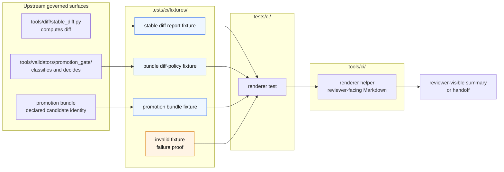

<!-- [KFM_META_BLOCK_V2]
doc_id: kfm://doc/NEEDS_VERIFICATION__tests_ci_fixtures_readme
title: tests/ci/fixtures
type: standard
version: v1
status: draft
owners: @bartytime4life
created: 2026-04-27
updated: 2026-04-27
policy_label: NEEDS_VERIFICATION__public_or_internal
related: [
  ../README.md,
  ../../README.md,
  ../../../README.md,
  ../../../tools/ci/README.md,
  ../../../tools/diff/README.md,
  ../../../tools/validators/promotion_gate/README.md,
  ../../../contracts/README.md,
  ../../../schemas/README.md,
  ../../../policy/README.md,
  ../test_render_diff_summary.py,
  ../test_render_bundle_diff_policy_summary.py,
  ../test_render_promotion_review_handoff.py,
  ./render_diff_summary/,
  ./render_bundle_diff_policy_summary/,
  ./render_promotion_review_handoff/
]
tags: [kfm, tests, ci, fixtures, renderer-tests, review-handoff, promotion, diff-policy]
notes: [
  Draft date is the current-session authoring date; verify file history before commit if the active branch already contains this README.
  Owner is grounded in surfaced repo-facing test-lane documentation patterns, but leaf-specific ownership still needs active-branch verification.
  Policy label remains unresolved because fixture contents are intended to be public-safe but active-branch fixture inventory was not mounted in this session.
  This README is fixture-facing only; it does not claim live CI wiring, merge-blocking enforcement, production workflow behavior, or helper implementation depth.
]
[/KFM_META_BLOCK_V2] -->

<a id="top"></a>

# `tests/ci/fixtures/`

Small, deterministic input fixtures for CI helper tests that render KFM review artifacts without recomputing governance.

> [!IMPORTANT]
> **Status:** experimental  
> **Owners:** `@bartytime4life` *(leaf-specific ownership: **NEEDS VERIFICATION**)*  
> **Path:** `tests/ci/fixtures/README.md`  
> **Repo fit:** child fixture lane under [`../README.md`](../README.md); broader test boundary in [`../../README.md`](../../README.md); renderer helpers in [`../../../tools/ci/README.md`](../../../tools/ci/README.md); diff computation in [`../../../tools/diff/README.md`](../../../tools/diff/README.md); promotion law in [`../../../tools/validators/promotion_gate/README.md`](../../../tools/validators/promotion_gate/README.md).  
> **Quick jumps:** [Scope](#scope) · [Repo fit](#repo-fit) · [Accepted inputs](#accepted-inputs) · [Exclusions](#exclusions) · [Current evidence snapshot](#current-evidence-snapshot) · [Directory tree](#directory-tree) · [Quickstart](#quickstart) · [Usage](#usage) · [Diagram](#diagram) · [Fixture registry](#fixture-registry) · [Definition of done](#definition-of-done) · [FAQ](#faq) · [Appendix](#appendix)


> [!NOTE]
> This directory is not a source of KFM truth. It holds compact input examples used by tests for `tools/ci/` renderers. The fixtures should help reviewers trust summaries and handoffs while preserving the boundary between fixture data, diff computation, policy classification, promotion evidence, receipts, proofs, and publication state.

---

## Scope

`tests/ci/fixtures/` stores small, reviewable files consumed by tests in the adjacent `tests/ci/` lane.

Use this directory to prove that CI-facing renderers can consume already-declared artifacts and produce deterministic reviewer-facing output.

The fixture lane supports three current renderer proof families:

1. `render_diff_summary`
2. `render_bundle_diff_policy_summary`
3. `render_promotion_review_handoff`

It should stay narrow. A fixture belongs here only when it makes one CI renderer test clearer, smaller, and easier to audit.

[Back to top](#top)

---

## Repo fit

| Surface | Role | Boundary rule |
| --- | --- | --- |
| [`../README.md`](../README.md) | parent `tests/ci/` lane | Defines which CI renderer tests belong beside these fixtures. |
| [`../../../tools/ci/README.md`](../../../tools/ci/README.md) | renderer-helper lane | Helpers render already-produced reports; they do not own policy or canonical truth. |
| [`../../../tools/diff/README.md`](../../../tools/diff/README.md) | diff/comparison lane | Diff computation belongs there, not in these fixtures or renderer tests. |
| [`../../../tools/validators/promotion_gate/README.md`](../../../tools/validators/promotion_gate/README.md) | promotion-gate lane | Gate law and promotion decisions remain upstream of renderer tests. |
| [`../../../contracts/README.md`](../../../contracts/README.md), [`../../../schemas/README.md`](../../../schemas/README.md), [`../../../policy/README.md`](../../../policy/README.md) | contract, schema, and policy authority | Fixture examples should follow these surfaces when verified; they must not redefine them. |

> [!WARNING]
> Do not use this folder as a dumping ground for workflow payloads, generated artifacts, source data, receipt bundles, proof packs, or production records. Fixtures are input examples, not evidence authority.

[Back to top](#top)

---

## Accepted inputs

Place files here when they are compact, deterministic, public-safe, and intentionally shaped for a `tests/ci/` renderer test.

| Fixture family | Accepted shape | Typical consumer |
| --- | --- | --- |
| Stable diff report | `tool`, `status`, `blocking`, `left`, `right`, `summary.added`, `summary.removed`, `summary.changed` | `test_render_diff_summary.py` |
| Bundle diff-policy report | `kind`, `policy_status`, `blocking`, `review_required`, `policy_path`, `policy_version`, `counts`, `classifications` | `test_render_bundle_diff_policy_summary.py` |
| Promotion review handoff inputs | promotion bundle + prior/current diff report + diff-policy report | `test_render_promotion_review_handoff.py` |
| Invalid fixture | one deliberately malformed object with a clear missing field or invalid shape | failure-path tests |

Good fixtures are tiny enough to inspect in a pull request. They should make expected renderer behavior obvious without requiring a maintainer to read a full release bundle.

[Back to top](#top)

---

## Exclusions

| Do not put this here | Put it here instead |
| --- | --- |
| Generated Markdown summaries, `_tmp.*`, snapshots, or CI output cache | ignored local temp output or a dedicated golden-output lane if the parent README explicitly supports it |
| Actual production receipts or proof packs | `data/receipts/` or `data/proofs/` after the real repo convention is verified |
| Policy law, gate rules, or validator implementations | `policy/` or `tools/validators/` |
| Raw source payloads, provider mirrors, secrets, tokens, workflow dumps, or restricted data | never in test fixtures; use sanitized synthetic examples only |
| Huge copied artifacts | shrink to a minimal declared object or move to a purpose-built fixture lane with explicit review |
| Fixtures that mix renderer behavior with policy authority | split the fixture into renderer input and upstream policy/validator test data |

[Back to top](#top)

---

## Current evidence snapshot

| Claim | Status | Notes |
| --- | --- | --- |
| `tests/ci/fixtures/README.md` is the target file for this doc | **CONFIRMED** | Target path was supplied by the authoring request. |
| Current mounted workspace contains the active KFM repo | **UNKNOWN / not confirmed in this session** | Recheck in the real checkout before commit. |
| Fixture subfamilies for diff summary, bundle diff-policy summary, and promotion review handoff are documented as useful thin-slice proof inputs | **CONFIRMED from surfaced repo-facing docs** | Active-branch inventory still needs direct verification. |
| Exact file list under `tests/ci/fixtures/` | **NEEDS VERIFICATION** | This README gives the expected disciplined shape, not a mounted tree claim. |
| Runnable commands and helper paths | **NEEDS VERIFICATION** | Use the active branch’s actual runner and helper names if they differ. |

[Back to top](#top)

---

## Directory tree

### Expected narrow fixture shape

```text
tests/ci/fixtures/
├── README.md
├── render_diff_summary/
│   ├── same.diff-report.json
│   ├── changed.diff-report.json
│   ├── blocking.diff-report.json
│   └── invalid.diff-report.json
├── render_bundle_diff_policy_summary/
│   ├── pass.bundle-diff-policy.json
│   ├── block.bundle-diff-policy.json
│   ├── review.bundle-diff-policy.json
│   └── invalid.bundle-diff-policy.json
└── render_promotion_review_handoff/
    ├── promote.promotion-bundle.json
    ├── promote.promotion-bundle-diff.json
    ├── promote.promotion-bundle-diff-policy.json
    ├── block.promotion-bundle.json
    ├── block.promotion-bundle-diff.json
    ├── block.promotion-bundle-diff-policy.json
    └── invalid.promotion-bundle.json
```

<details>
<summary><strong>Possible future growth shape</strong> (<strong>PROPOSED</strong>)</summary>

```text
tests/ci/fixtures/
├── README.md
├── render_diff_summary/
├── render_bundle_diff_policy_summary/
├── render_promotion_review_handoff/
├── render_promotion_summary/
├── render_promotion_bundle_summary/
└── _README_FOR_GOLDENS.md
```

Keep growth proportional. Add a folder only when a checked-in `tests/ci/test_*.py` file needs fixtures that cannot be clearer inline.

</details>

[Back to top](#top)

---

## Quickstart

Start by verifying the active branch before changing fixtures.

```bash
# Inspect this fixture lane and adjacent CI test surfaces.
ls -la tests/ci/fixtures
find tests/ci/fixtures -maxdepth 2 -type f | sort

# Inspect parent and helper docs before adding new fixture families.
sed -n '1,260p' tests/ci/README.md
sed -n '1,320p' tools/ci/README.md
sed -n '1,260p' tools/diff/README.md
sed -n '1,320p' tools/validators/promotion_gate/README.md

# Reconfirm active references.
git grep -n "tests/ci/fixtures\|render_diff_summary\|render_bundle_diff_policy_summary\|render_promotion_review_handoff" -- . || true
```

Validate JSON fixtures before relying on them in tests:

```bash
python -m json.tool tests/ci/fixtures/render_diff_summary/changed.diff-report.json >/dev/null
python -m json.tool tests/ci/fixtures/render_bundle_diff_policy_summary/block.bundle-diff-policy.json >/dev/null
python -m json.tool tests/ci/fixtures/render_promotion_review_handoff/promote.promotion-bundle.json >/dev/null
```

When the active branch uses `pytest` for this lane, the fixture-backed tests should remain runnable locally:

```bash
pytest -q tests/ci/test_render_diff_summary.py
pytest -q tests/ci/test_render_bundle_diff_policy_summary.py
pytest -q tests/ci/test_render_promotion_review_handoff.py
```

> [!TIP]
> If the active branch uses a wrapper, `make` target, or different runner, replace these commands with the real repo-native command instead of preserving a stale test convention.

[Back to top](#top)

---

## Usage

### Add a fixture

1. Pick the smallest fixture family that matches the renderer under test.
2. Name the file by outcome first: `same`, `changed`, `blocking`, `pass`, `review`, `block`, `promote`, or `invalid`.
3. Keep the JSON object small enough to review without scrolling through unrelated fields.
4. Include one invalid fixture for the failure mode the test must prove.
5. Run the local JSON and test commands.
6. Confirm no `_tmp.*`, generated Markdown, workflow payloads, secrets, or production objects were added.

### Keep renderer tests separate from gate tests

Renderer fixtures should help prove visible output, not the correctness of upstream law.

| Renderer test may assert | Renderer test should not assert |
| --- | --- |
| status text is visible | whether the policy rule is correct |
| blocking state is preserved | whether promotion should actually proceed |
| review-required state is visible | whether review is legally sufficient |
| classifications are displayed | whether classifications were derived correctly |
| malformed input fails clearly | hidden recovery or invented fallback output |

### Prefer stable, meaningful assertions

Good assertions usually check:

- candidate identity
- visible status
- visible blocking state
- visible review-required state
- artifact inventory
- upstream reason text
- explicit changed-key lists
- clear failure for malformed input

Avoid overfitting exact Markdown spacing unless the test is intentionally a golden-output test.

[Back to top](#top)

---

## Diagram



[Back to top](#top)

---

## Fixture registry

| Folder | Purpose | Minimum valid cases | Required invalid case |
| --- | --- | --- | --- |
| `render_diff_summary/` | Prove stable diff report rendering | `same`, `changed`, `blocking` | missing `blocking` or missing `summary` |
| `render_bundle_diff_policy_summary/` | Prove bundle diff-policy report rendering | `pass`, `review`, `block` | missing `counts` or `classifications` |
| `render_promotion_review_handoff/` | Prove composed steward-facing handoff rendering | `promote`, `block` | malformed bundle identity or missing required handoff input |

### Naming pattern

| Pattern | Use |
| --- | --- |
| `same.diff-report.json` | no changed keys |
| `changed.diff-report.json` | non-blocking changed keys |
| `blocking.diff-report.json` | changed keys with visible blocking state |
| `pass.bundle-diff-policy.json` | non-blocking, no review required |
| `review.bundle-diff-policy.json` | non-blocking, review required |
| `block.bundle-diff-policy.json` | blocking policy classification |
| `promote.promotion-bundle.json` | promotion-shaped bundle example |
| `invalid.*.json` | one intentionally malformed object |

[Back to top](#top)

---

## Definition of done

Before a fixture change is ready for review:

- [ ] Active branch inventory was checked with `find tests/ci/fixtures -maxdepth 2 -type f | sort`.
- [ ] Each valid JSON fixture passes `python -m json.tool`.
- [ ] Each invalid fixture fails for the intended reason and does not require hidden context to understand.
- [ ] The fixture is compact, synthetic, and public-safe.
- [ ] No generated `_tmp.*`, Markdown output, cache file, workflow dump, secret, or production artifact was committed.
- [ ] The adjacent renderer test proves rendering behavior only.
- [ ] The parent `tests/ci/README.md` still describes the fixture family accurately.
- [ ] Any new fixture family has a matching `tests/ci/test_*.py` consumer.
- [ ] Any unresolved ownership, policy label, schema, or runner assumption is marked **NEEDS VERIFICATION** instead of implied as fact.

[Back to top](#top)

---

## FAQ

### Why are fixtures this small?

Small fixtures make review possible. KFM’s trust model depends on visible source role, evidence posture, policy posture, and review state. A giant fixture hides the thing the test is meant to prove.

### Can a fixture contain a real source record?

No, not in this lane. Use sanitized synthetic examples. Real source records, restricted records, and production artifacts require their own lifecycle path and policy review.

### Can renderer fixtures encode policy expectations?

Only as already-produced input fields. Renderer tests can verify that `blocking: true` or `policy_status: "block"` remains visible, but they should not prove policy law. Policy law belongs upstream in policy and validator tests.

### Should generated Markdown outputs live here?

Not by default. This directory is input-focused. Use a golden-output lane only if the parent `tests/ci/README.md` and active test pattern support it.

### What should happen when helper names change?

Update the parent `tests/ci/README.md`, the relevant `tools/ci/README.md` section, this fixture README, and the consuming tests together. Do not leave stale fixture folders that imply a helper still exists.

[Back to top](#top)

---

## Appendix

<details>
<summary><strong>Reviewer checklist for new fixture families</strong></summary>

Use this when a PR adds a new folder under `tests/ci/fixtures/`.

| Question | Required answer |
| --- | --- |
| Is there a matching `tests/ci/test_*.py` consumer? | yes |
| Is the fixture synthetic and public-safe? | yes |
| Does the fixture prove renderer behavior only? | yes |
| Is upstream policy or diff logic tested elsewhere? | yes or **NEEDS VERIFICATION** |
| Is the invalid fixture clearly malformed for one reason? | yes |
| Are generated files excluded from the commit? | yes |
| Are links from this README still valid from `tests/ci/fixtures/`? | yes |

</details>

<details>
<summary><strong>Boundary mnemonic</strong></summary>

```text
diff computes
policy classifies
promotion records
CI renders
fixtures feed tests
reviewers inspect
```

A fixture can show what an upstream artifact looks like. It must not become the upstream artifact.

</details>

[Back to top](#top)
