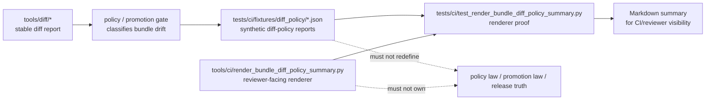

<!-- [KFM_META_BLOCK_V2]
doc_id: kfm://doc/<NEEDS_VERIFICATION_UUID>
title: tests/ci/fixtures/diff_policy
type: standard
version: v1
status: draft
owners: @bartytime4life
created: <NEEDS_VERIFICATION_CREATED_DATE>
updated: 2026-04-27
policy_label: public
related: [
  ../../README.md,
  ../../../README.md,
  ../../test_render_bundle_diff_policy_summary.py,
  ../../test_render_promotion_review_handoff.py,
  ../../../../tools/ci/README.md,
  ../../../../tools/diff/README.md,
  ../../../../tools/validators/promotion_gate/README.md,
  ../../../../policy/README.md,
  ../../../../schemas/README.md
]
tags: [kfm, tests, ci, fixtures, diff-policy, renderer-proof, promotion-review, governed-verification]
notes: [
  "doc_id and created date remain NEEDS_VERIFICATION until document registry or git-history evidence is checked.",
  "Owner follows adjacent KFM tests/tooling README evidence and should be rechecked against CODEOWNERS before publication.",
  "This README documents the requested tests/ci/fixtures/diff_policy/ lane without claiming that the current branch already contains every listed fixture.",
  "Fixture inventory and test wiring remain NEEDS_VERIFICATION in the mounted repository."
]
[/KFM_META_BLOCK_V2] -->

<a id="top"></a>

# `tests/ci/fixtures/diff_policy/`

Small, public-safe fixture lane for already-produced bundle diff-policy reports used by CI renderer/helper tests.

> [!IMPORTANT]
> **Status:** experimental  
> **Document status:** draft  
> **Owners:** `@bartytime4life`  
> **Path:** `tests/ci/fixtures/diff_policy/README.md`  
> **Repo fit:** child fixture lane under `tests/ci/fixtures/`; upstream from [`../../README.md`](../../README.md) and [`../../../README.md`](../../../README.md); subject to renderer boundaries in [`../../../../tools/ci/README.md`](../../../../tools/ci/README.md), diff boundaries in [`../../../../tools/diff/README.md`](../../../../tools/diff/README.md), promotion-gate boundaries in [`../../../../tools/validators/promotion_gate/README.md`](../../../../tools/validators/promotion_gate/README.md), and policy authority in [`../../../../policy/README.md`](../../../../policy/README.md).  
> **Quick jumps:** [Scope](#scope) · [Repo fit](#repo-fit) · [Accepted inputs](#accepted-inputs) · [Exclusions](#exclusions) · [Current evidence snapshot](#current-evidence-snapshot) · [Directory tree](#directory-tree) · [Quickstart](#quickstart) · [Usage](#usage) · [Diagram](#diagram) · [Fixture matrix](#fixture-matrix) · [Task list](#task-list--definition-of-done) · [FAQ](#faq) · [Appendix](#appendix)


---

## Scope

`tests/ci/fixtures/diff_policy/` holds **deterministic JSON fixtures** for CI tests that render bundle diff-policy reports into reviewer-facing Markdown.

This lane is intentionally narrow. It helps prove that CI renderer helpers can display already-governed drift-policy results without silently becoming the source of policy, diff, promotion, or release truth.

Use this fixture lane to model:

- `pass` diff-policy reports where drift is non-blocking and no steward review is required
- `block` diff-policy reports where drift is blocking and must remain visible
- `review` diff-policy reports where drift is non-blocking but review is still required
- intentionally malformed diff-policy payloads used to prove clear failure behavior

> [!NOTE]
> These fixtures represent **inputs to renderer tests**, not authoritative policy decisions. The authoritative machine objects remain upstream in policy, validator, diff, promotion, receipt, proof, and release surfaces.

[Back to top](#top)

---

## Repo fit

| Relationship | Path | Role |
| --- | --- | --- |
| Parent CI test lane | [`../../README.md`](../../README.md) | Defines CI helper-proof boundaries and keeps this fixture family subordinate to tests. |
| Broader test index | [`../../../README.md`](../../../README.md) | Places this lane inside KFM governed verification. |
| Primary renderer proof | [`../../test_render_bundle_diff_policy_summary.py`](../../test_render_bundle_diff_policy_summary.py) | Expected consumer for these fixtures when the branch uses the bundle diff-policy renderer test. |
| Composed handoff proof | [`../../test_render_promotion_review_handoff.py`](../../test_render_promotion_review_handoff.py) | Possible downstream consumer when bundle, diff, and diff-policy fixtures are composed into a steward-facing handoff. |
| Renderer helper lane | [`../../../../tools/ci/README.md`](../../../../tools/ci/README.md) | Renderer helpers display governed artifacts; they do not own policy or promotion law. |
| Diff lane | [`../../../../tools/diff/README.md`](../../../../tools/diff/README.md) | Computes or normalizes stable diff reports before policy interpretation. |
| Promotion gate lane | [`../../../../tools/validators/promotion_gate/README.md`](../../../../tools/validators/promotion_gate/README.md) | Evaluates promotion-significant behavior and should remain separate from CI summary rendering. |
| Policy authority | [`../../../../policy/README.md`](../../../../policy/README.md) | Holds policy rules or policy-package references; this fixture lane does not redefine them. |
| Schema authority | [`../../../../schemas/README.md`](../../../../schemas/README.md) | Candidate home for machine-readable schemas; exact diff-policy schema home is NEEDS VERIFICATION. |

[Back to top](#top)

---

## Accepted inputs

This directory accepts **small, synthetic, public-safe JSON fixtures** shaped like already-produced bundle diff-policy reports.

### Input rules

1. Prefer declared file inputs over implicit environment scraping.
2. Prefer tiny fixtures over copied production artifacts.
3. Keep every fixture deterministic and safe to publish.
4. Preserve upstream object shape instead of re-inventing it in test code.
5. Include negative-path fixtures that are as legible as the passing fixtures.
6. Keep fixture names stable enough for tests, CI summaries, and reviewer notes.

### Expected fixture shape

The exact schema location is **NEEDS VERIFICATION**, but renderer-facing fixtures should normally expose these fields:

| Field | Expected role | Example |
| --- | --- | --- |
| `kind` | Identifies the report family. | `bundle_diff_policy_report` |
| `policy_status` | Compact policy status for renderer display. | `pass`, `review`, `block` |
| `blocking` | Whether the interpreted drift is blocking. | `true` / `false` |
| `review_required` | Whether steward review remains required. | `true` / `false` |
| `policy_path` | Path or reference to the policy package used upstream. | `policy/promotion_bundle_diff_policy.json` |
| `policy_version` | Policy package version used upstream. | `v1` |
| `counts` | Added, removed, and changed key counts. | `{ "added": 0, "removed": 0, "changed": 1 }` |
| `classifications` | Per-key policy classifications and reasons. | `[{ "path": "summary.changed", "classification": "allow", "reason": "..." }]` |

> [!WARNING]
> Do not add real unpublished promotion bundles, source data, sensitive review material, secrets, token-bearing URLs, or rights-unclear artifacts to this directory.

[Back to top](#top)

---

## Exclusions

| Does **not** belong here | Put it here instead | Why |
| --- | --- | --- |
| Diff computation fixtures that prove comparator law | `tests/diff/` or the appropriate diff-test lane | This lane starts after diff computation has already produced stable output. |
| Policy source files or policy-package law | [`../../../../policy/README.md`](../../../../policy/README.md) | Fixtures may model policy output; they must not become policy authority. |
| Promotion-gate end-to-end decision tests | `tests/validators/` or `tests/e2e/` | Promotion validation and full workflow choreography are outside this helper-proof fixture lane. |
| Helper implementation code | [`../../../../tools/ci/README.md`](../../../../tools/ci/README.md) and helper files | `tests/ci/fixtures/` provides inputs; it does not implement renderers. |
| CI workflow permissions, triggers, or required-check wiring | `.github/workflows/` | Workflow orchestration belongs at the GitHub Actions boundary. |
| Generated Markdown summaries | temporary output paths or CI artifacts | Fixture lanes should hold reusable inputs, not generated review output. |
| Real sensitive, unpublished, or rights-unclear artifacts | quarantine, secured data lanes, or synthetic replacements | Public test fixtures must be safe to clone, review, and cite. |
| Auto-fix shortcuts that mutate governed state | nowhere | KFM promotion and correction remain explicit, reviewable, and auditable. |

[Back to top](#top)

---

## Current evidence snapshot

| Evidence item | Status | How this README uses it |
| --- | --- | --- |
| The current task targets `tests/ci/fixtures/diff_policy/README.md`. | **CONFIRMED** | This file is drafted for the requested path. |
| Adjacent KFM docs define `tools/ci/` as a renderer/helper lane for already-produced artifacts. | **CONFIRMED via project corpus** | This README keeps the fixtures renderer-facing and read-only. |
| Adjacent KFM docs distinguish diff computation, policy classification, and CI rendering. | **CONFIRMED via project corpus** | This README excludes diff law and policy law from the fixture lane. |
| Bundle diff-policy renderer expectations include policy status, blocking state, review-required state, counts, and per-key classification visibility. | **CONFIRMED via project corpus** | The fixture matrix and task list preserve those visible states. |
| Exact checked-in fixture files under this specific path. | **NEEDS VERIFICATION** | The directory tree below is contract guidance unless the mounted repo confirms the files. |
| Whether the branch also uses a helper-specific sibling path such as `fixtures/render_bundle_diff_policy_summary/`. | **NEEDS VERIFICATION** | This README does not remove or supersede adjacent fixture paths without a migration note. |

[Back to top](#top)

---

## Directory tree

### Target lane shape

```text
tests/ci/fixtures/diff_policy/
├── README.md
├── pass.bundle-diff-policy.json
├── block.bundle-diff-policy.json
├── review.bundle-diff-policy.json
└── invalid.bundle-diff-policy.json
```

### Optional generated outputs

Generated outputs may be useful during local debugging, but they should not become stable fixtures unless explicitly promoted.

```text
tests/ci/fixtures/diff_policy/
└── _tmp.bundle-diff-policy-summary.md  # local/debug output; do not commit by default
```

> [!IMPORTANT]
> Keep this directory small. Add only the fixtures needed to prove a helper contract clearly.

[Back to top](#top)

---

## Quickstart

Recheck the mounted branch before extending this fixture lane.

```bash
# Inspect the target lane and adjacent proof surfaces.
ls -la tests/ci/fixtures/diff_policy 2>/dev/null || true
sed -n '1,260p' tests/ci/README.md
sed -n '1,260p' tools/ci/README.md
sed -n '1,220p' tests/ci/test_render_bundle_diff_policy_summary.py 2>/dev/null || true
sed -n '1,220p' tools/ci/render_bundle_diff_policy_summary.py 2>/dev/null || true
```

Validate fixture JSON before running renderer tests.

```bash
python -m json.tool tests/ci/fixtures/diff_policy/pass.bundle-diff-policy.json > /dev/null
python -m json.tool tests/ci/fixtures/diff_policy/block.bundle-diff-policy.json > /dev/null
python -m json.tool tests/ci/fixtures/diff_policy/review.bundle-diff-policy.json > /dev/null
```

Run the renderer proof when the checked-out branch wires the test to this fixture lane.

```bash
pytest -q tests/ci/test_render_bundle_diff_policy_summary.py
```

Render one fixture manually for review.

```bash
python tools/ci/render_bundle_diff_policy_summary.py \
  tests/ci/fixtures/diff_policy/block.bundle-diff-policy.json \
  --output /tmp/kfm-bundle-diff-policy-summary.md
```

[Back to top](#top)

---

## Usage

### Fixture naming

Use names that preserve the policy posture at a glance:

| Fixture | Purpose |
| --- | --- |
| `pass.bundle-diff-policy.json` | Non-blocking drift; review not required. |
| `block.bundle-diff-policy.json` | Blocking drift; review required. |
| `review.bundle-diff-policy.json` | Non-blocking drift; review still required. |
| `invalid.bundle-diff-policy.json` | Malformed payload used to prove clear failure behavior. |

### Review posture

Fixture updates should be treated as contract changes when they alter any of the following:

- `policy_status` values
- `blocking` semantics
- `review_required` semantics
- count field names
- classification object shape
- expected malformed-input behavior
- renderer-visible language that reviewers rely on

### Practical rules

- Keep fixtures synthetic.
- Keep reasons short and reviewable.
- Model both positive and negative paths.
- Do not encode policy rules here.
- Do not make generated Markdown the source of truth.
- Do not silently update fixtures just to make a failing renderer test pass.

[Back to top](#top)

---

## Diagram



[Back to top](#top)

---

## Fixture matrix

| Fixture | `policy_status` | `blocking` | `review_required` | Minimum visible classifications | Expected renderer proof |
| --- | --- | ---: | ---: | --- | --- |
| `pass.bundle-diff-policy.json` | `pass` | `false` | `false` | one `allow` classification | Renders status, non-blocking state, review-not-required state, counts, and classification visibility. |
| `block.bundle-diff-policy.json` | `block` | `true` | `true` | at least one `block`; may include `review` and `allow` | Preserves blocking state and makes reviewer attention unavoidable. |
| `review.bundle-diff-policy.json` | `review` | `false` | `true` | one `review` classification | Preserves non-blocking review-required posture. |
| `invalid.bundle-diff-policy.json` | intentionally incomplete | n/a | n/a | n/a | Fails clearly instead of inventing a reviewer summary. |

[Back to top](#top)

---

## Task list / definition of done

Use this checklist when adding or revising fixtures in this lane.

- [ ] Fixture is synthetic, deterministic, and safe for a public repository.
- [ ] Fixture preserves the upstream diff-policy report shape rather than inventing a test-only shape.
- [ ] Fixture includes only the minimum fields needed to prove renderer behavior.
- [ ] `pass`, `block`, `review`, and malformed input paths are either present or explicitly explained.
- [ ] Renderer tests assert visible behavior, not exact cosmetic Markdown unless the heading or wording is part of the contract.
- [ ] Renderer tests do not recompute diff, reinterpret policy, or decide promotion eligibility.
- [ ] Temporary rendered outputs are excluded from commits unless deliberately promoted as golden files.
- [ ] Parent `tests/ci/README.md` is updated if this fixture lane becomes a stable checked-in input path.
- [ ] Any path migration from a sibling fixture directory is documented before deleting old fixtures.
- [ ] Local validation runs with the branch’s active test runner.

[Back to top](#top)

---

## FAQ

### Why does this directory use policy-looking data if it is not policy authority?

Renderer tests need realistic policy-output shapes so reviewers can trust the CI summary surface. The policy meaning still belongs upstream in checked-in policy and validator surfaces.

### Why keep an invalid fixture?

Malformed input proves the renderer fails clearly rather than fabricating a plausible-looking review artifact. That is part of KFM’s fail-safe posture.

### Should fixtures include full promotion bundles?

No. Full promotion bundles belong in promotion or handoff fixture lanes. This directory should hold only the diff-policy report fixtures needed for renderer behavior.

### Can this directory contain generated Markdown?

Only if a future golden-output test deliberately promotes it. Default generated summaries should go to `/tmp`, CI artifacts, or an ignored `_tmp.*` path.

[Back to top](#top)

---

## Appendix

<details>
<summary><strong>Illustrative minimal fixture examples</strong></summary>

### `pass.bundle-diff-policy.json`

```json
{
  "kind": "bundle_diff_policy_report",
  "policy_status": "pass",
  "blocking": false,
  "review_required": false,
  "policy_path": "policy/promotion_bundle_diff_policy.json",
  "policy_version": "v1",
  "counts": {
    "added": 0,
    "removed": 0,
    "changed": 1
  },
  "classifications": [
    {
      "path": "summary.changed",
      "classification": "allow",
      "reason": "Non-sensitive summary drift."
    }
  ]
}
```

### `block.bundle-diff-policy.json`

```json
{
  "kind": "bundle_diff_policy_report",
  "policy_status": "block",
  "blocking": true,
  "review_required": true,
  "policy_path": "policy/promotion_bundle_diff_policy.json",
  "policy_version": "v1",
  "counts": {
    "added": 1,
    "removed": 1,
    "changed": 1
  },
  "classifications": [
    {
      "path": "artifacts.added",
      "classification": "review",
      "reason": "New artifact membership requires steward review."
    },
    {
      "path": "artifacts.removed",
      "classification": "block",
      "reason": "Artifact removal is disallowed without explicit correction or supersession context."
    },
    {
      "path": "summary.changed",
      "classification": "allow",
      "reason": "Summary drift alone is non-blocking."
    }
  ]
}
```

### `review.bundle-diff-policy.json`

```json
{
  "kind": "bundle_diff_policy_report",
  "policy_status": "review",
  "blocking": false,
  "review_required": true,
  "policy_path": "policy/promotion_bundle_diff_policy.json",
  "policy_version": "v1",
  "counts": {
    "added": 0,
    "removed": 0,
    "changed": 1
  },
  "classifications": [
    {
      "path": "metadata.changed",
      "classification": "review",
      "reason": "Metadata drift is reviewable but not automatically blocking."
    }
  ]
}
```

### `invalid.bundle-diff-policy.json`

```json
{
  "kind": "bundle_diff_policy_report",
  "policy_status": "block"
}
```

</details>

<details>
<summary><strong>Classification vocabulary</strong></summary>

| Classification | Renderer posture | Authority note |
| --- | --- | --- |
| `allow` | Display as non-blocking. | Does not mean the renderer approved promotion. |
| `review` | Display as steward-review significant. | Review posture remains upstream policy output. |
| `block` | Display as blocking. | Blocking meaning remains upstream policy output. |

</details>

[Back to top](#top)
