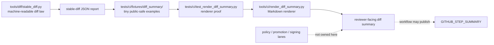

<!-- [KFM_META_BLOCK_V2]
doc_id: kfm://doc/NEEDS_VERIFICATION__tests_ci_fixtures_diff_summary_readme
title: Diff Summary Fixtures
type: standard
version: v1
status: draft
owners: @bartytime4life
created: NEEDS_VERIFICATION__YYYY-MM-DD
updated: 2026-04-27
policy_label: NEEDS_VERIFICATION__public_or_internal
related: [../../README.md, ../../../README.md, ../../../../README.md, ../../../../tools/ci/README.md, ../../../../tools/ci/render_diff_summary.py, ../../../../tools/diff/README.md, ../../../../tools/diff/stable_diff.py, ../../test_render_diff_summary.py, ../../../diff/README.md, ../../../fixtures/README.md, ../../../../schemas/promotion/promotion-bundle-diff.schema.json, ../../../../.github/CODEOWNERS, ../../../../.github/workflows/README.md]
tags: [kfm, tests, ci, fixtures, diff-summary, renderer-tests, stable-diff, promotion]
notes: [Leaf ownership, created date, policy label, exact checked-in fixture inventory, and the active branch convention for diff_summary versus render_diff_summary remain NEEDS VERIFICATION. This README is fixture-facing and does not claim workflow wiring, policy authority, diff computation, or promotion readiness.]
[/KFM_META_BLOCK_V2] -->

<a id="top"></a>

# Diff Summary Fixtures

Deterministic, public-safe fixtures for proving that KFM diff-summary renderers turn already-produced stable-diff reports into reviewer-facing Markdown without recomputing comparison, policy, or promotion law.

> [!NOTE]
> **Status:** `experimental`  
> **Owners:** `@bartytime4life` *(confirmed only at broader surfaced test/documentation scope; leaf-specific ownership remains **NEEDS VERIFICATION**)*  
> **Path:** `tests/ci/fixtures/diff_summary/README.md`  
> **Repo fit:** fixture lane under [`tests/ci/`](../../README.md), supporting [`test_render_diff_summary.py`](../../test_render_diff_summary.py) and the renderer in [`tools/ci/render_diff_summary.py`](../../../../tools/ci/render_diff_summary.py).  
> **Accepted inputs:** tiny `stable-diff` JSON reports, expected Markdown fragments, and malformed public-safe negative-path examples.  
> **Exclusions:** raw diff computation, policy interpretation, workflow publication, promotion decisions, signing, attestation verification, and secret-bearing or unpublished fixtures.  
> **Quick jumps:** [Scope](#scope) · [Repo fit](#repo-fit) · [Accepted inputs](#accepted-inputs) · [Exclusions](#exclusions) · [Current evidence posture](#current-evidence-posture) · [Directory tree](#directory-tree) · [Quickstart](#quickstart) · [Usage](#usage) · [Fixture matrix](#fixture-matrix) · [Diagram](#diagram) · [Definition of done](#task-list--definition-of-done) · [FAQ](#faq) · [Appendix](#appendix)


> [!IMPORTANT]
> This directory is a **fixture boundary**, not a trust authority.
>
> It may provide sample reports and expected renderer fragments. It must not decide whether a diff is material, whether a promotion may proceed, whether a policy has passed, or whether a signature is valid.

> [!WARNING]
> Keep fixtures small enough to review by eye and safe enough to print in CI logs. Do not commit secrets, internal-only evidence, unpublished candidate payloads, exact sensitive locations, provider mirrors, or rights-unclear artifacts as convenience test data.

<p align="right"><a href="#top">Back to top ⤴</a></p>

## Scope

`tests/ci/fixtures/diff_summary/` is the fixture home for the narrow renderer proof around **diff-summary Markdown**.

This directory belongs in the renderer proof lane when the test needs to show that:

- a `same` diff report renders a stable, reviewer-friendly “no changes” summary
- a non-blocking `changed` report renders change counts and explicit key lists
- a `blocking: true` report keeps blocking state visible without deciding promotion
- malformed or incomplete input fails clearly instead of inventing plausible output
- expected Markdown stays deterministic across repeated test runs

It is intentionally small. The strongest fixture here is one that makes a single renderer behavior obvious without pulling in a whole release bundle.

<p align="right"><a href="#top">Back to top ⤴</a></p>

## Repo fit

| Direction | Surface | Relationship |
| --- | --- | --- |
| Parent CI lane | [`../../README.md`](../../README.md) | `tests/ci/` proves CI-facing helper behavior. |
| Local fixture index | [`../README.md`](../README.md) | **NEEDS VERIFICATION:** use if the branch has a local `tests/ci/fixtures/` index. |
| Broader tests boundary | [`../../../README.md`](../../../README.md) | Keeps this subtree inside governed verification, not release authority. |
| Root posture | [`../../../../README.md`](../../../../README.md) | Keeps fixture language aligned with KFM’s evidence-first posture. |
| Renderer under test | [`../../../../tools/ci/render_diff_summary.py`](../../../../tools/ci/render_diff_summary.py) | Consumes stable-diff reports and emits reviewer-facing Markdown. |
| Renderer proof | [`../../test_render_diff_summary.py`](../../test_render_diff_summary.py) | Should load these fixtures and assert deterministic rendering. |
| Diff law | [`../../../../tools/diff/stable_diff.py`](../../../../tools/diff/stable_diff.py) | Computes the machine-readable comparison report; this fixture lane does not recompute it. |
| Diff tests | [`../../../diff/README.md`](../../../diff/README.md) | Correct home for comparison behavior and stable-diff contract proof. |
| Promotion schema | [`../../../../schemas/promotion/promotion-bundle-diff.schema.json`](../../../../schemas/promotion/promotion-bundle-diff.schema.json) | **NEEDS VERIFICATION:** expected upstream schema for promotion bundle diff reports if present. |
| Workflow publication | [`../../../../.github/workflows/README.md`](../../../../.github/workflows/README.md) | Publishes summaries to GitHub surfaces; fixture tests should not own orchestration. |
| Ownership | [`../../../../.github/CODEOWNERS`](../../../../.github/CODEOWNERS) | Resolve exact leaf ownership before merge. |

### Boundary rule

```text
tools/diff/        -> computes stable machine-readable diff
tests/diff/        -> proves comparison behavior
tools/ci/          -> renders already-produced artifacts
tests/ci/          -> proves renderer behavior
this fixture lane  -> supplies tiny public-safe renderer inputs
```

<p align="right"><a href="#top">Back to top ⤴</a></p>

## Accepted inputs

Content in this directory should be fixture-shaped, deterministic, and renderer-facing.

### Stable-diff report shape

The core renderer input is a stable-diff JSON report with this field family:

| Field | Expected role | Fixture rule |
| --- | --- | --- |
| `tool` | Identifies the upstream diff producer, usually `stable-diff` | Required in positive fixtures. |
| `status` | Declares upstream comparison status such as `same`, `changed`, or `error` | Required in positive fixtures. |
| `blocking` | Preserves upstream blocking state | Required in positive fixtures; renderer must display it, not reinterpret it. |
| `left` | Names the left/prior input reference | Keep as a path or label; do not embed large payloads here. |
| `right` | Names the right/current input reference | Keep as a path or label; do not embed large payloads here. |
| `summary.added` | Added top-level keys or documented paths | Keep short and sorted where possible. |
| `summary.removed` | Removed top-level keys or documented paths | Keep short and sorted where possible. |
| `summary.changed` | Changed top-level keys or documented paths | Keep short and sorted where possible. |

### Typical fixture families

| Family | Example filename | Purpose |
| --- | --- | --- |
| Same report | `same.diff-report.json` | Proves zero-count and no-diff wording. |
| Changed report | `changed.diff-report.json` | Proves count rendering and key-list rendering. |
| Blocking report | `blocking.diff-report.json` | Proves blocking state remains visible in the rendered Markdown. |
| Invalid report | `invalid.diff-report.json` | Proves malformed input does not produce authoritative-looking output. |
| Expected fragments | `expected/*.md` | Optional golden fragments for stable Markdown checks. |

> [!TIP]
> Prefer small examples whose entire meaning can be reviewed in one screen. A fixture that requires a maintainer to reverse-engineer a promotion bundle is probably in the wrong directory.

<p align="right"><a href="#top">Back to top ⤴</a></p>

## Exclusions

| Does **not** belong here | Put it here instead | Why |
| --- | --- | --- |
| Raw left/right object comparison fixtures | [`../../../diff/README.md`](../../../diff/README.md) or a dedicated diff fixture lane | Comparison behavior belongs to `tools/diff/` and `tests/diff/`. |
| Renderer implementation code | [`../../../../tools/ci/README.md`](../../../../tools/ci/README.md) and the helper file itself | Fixtures prove behavior; they do not become the helper lane. |
| Promotion-gate policy logic | [`../../../../tools/validators/promotion_gate/README.md`](../../../../tools/validators/promotion_gate/README.md) | Policy and gate interpretation remain upstream. |
| Canonical schemas or contract meaning | [`../../../../schemas/README.md`](../../../../schemas/README.md) and [`../../../../contracts/README.md`](../../../../contracts/README.md) | Fixture examples may mirror contract shape, but must not quietly define it. |
| Checked-in policy files | [`../../../../policy/README.md`](../../../../policy/README.md) | Renderer fixtures can display a result; they do not own policy truth. |
| GitHub Actions publication order | [`../../../../.github/workflows/README.md`](../../../../.github/workflows/README.md) | Workflows decide when summaries are emitted. |
| Attestation or signature verification payloads | [`../../../../tools/attest/README.md`](../../../../tools/attest/README.md) | Verification state may be displayed later, but proof logic lives elsewhere. |
| Secret-bearing or unpublished artifacts | Secured data lanes or synthetic fixtures | CI fixtures must remain clone-safe and log-safe. |
| Generated scratch output | Temporary directories such as `/tmp` or ignored work paths | Avoid accidental golden-file churn. |

<p align="right"><a href="#top">Back to top ⤴</a></p>

## Current evidence posture

| Claim | Label | Handling |
| --- | --- | --- |
| `tests/ci/` is the renderer-proof lane for CI-facing helper behavior | **CONFIRMED from surfaced repo-facing docs** | This README preserves that split. |
| `render_diff_summary.py` consumes stable-diff JSON and renders Markdown | **CONFIRMED from surfaced docs / NEEDS VERIFICATION on active branch** | The fixture contract mirrors the documented thin slice. |
| The target path is `tests/ci/fixtures/diff_summary/` | **CONFIRMED by current task** | The README uses the requested path exactly. |
| Some adjacent packets use `tests/ci/fixtures/render_diff_summary/` | **CONFIRMED from source corpus** | Do not maintain both names long-term without an alias or migration note. |
| Exact fixture files are already checked in | **UNKNOWN** | Treat the directory tree below as proposed unless branch inventory confirms it. |
| Leaf owner and policy label are final | **NEEDS VERIFICATION** | Resolve against `CODEOWNERS` and repository doc policy before merge. |

<p align="right"><a href="#top">Back to top ⤴</a></p>

## Directory tree

### Recommended minimal landing shape

```text
tests/ci/fixtures/diff_summary/
├── README.md
├── same.diff-report.json
├── changed.diff-report.json
├── blocking.diff-report.json
├── invalid.diff-report.json
└── expected/
    ├── same.diff-summary.md
    ├── changed.diff-summary.md
    └── blocking.diff-summary.md
```

### Compatibility note

> [!IMPORTANT]
> If the active branch already uses `tests/ci/fixtures/render_diff_summary/`, do not silently duplicate the fixture set.
>
> Pick one branch-local convention, update references in [`../../test_render_diff_summary.py`](../../test_render_diff_summary.py), and leave a short migration note if a rename is needed.

<p align="right"><a href="#top">Back to top ⤴</a></p>

## Quickstart

Start by proving the renderer with fixtures, not by invoking live workflow state.

```bash
# Run the focused renderer test
pytest -q tests/ci/test_render_diff_summary.py
```

Render one fixture manually:

```bash
python tools/ci/render_diff_summary.py \
  tests/ci/fixtures/diff_summary/changed.diff-report.json \
  --output /tmp/kfm-diff-summary.md

sed -n '1,220p' /tmp/kfm-diff-summary.md
```

> [!WARNING]
> Do not write scratch renderer output back into this fixture directory unless you are intentionally updating a reviewed golden file.

<p align="right"><a href="#top">Back to top ⤴</a></p>

## Usage

### Contract-shaped example

```json
{
  "tool": "stable-diff",
  "status": "changed",
  "blocking": false,
  "left": "tests/diff/fixtures/changed/left.json",
  "right": "tests/diff/fixtures/changed/right.json",
  "summary": {
    "added": ["delta"],
    "removed": ["beta"],
    "changed": ["gamma"]
  }
}
```

### Renderer expectation

A passing renderer test should verify the output includes:

- the upstream tool name
- status and blocking state
- left and right references
- added / removed / changed counts
- explicit changed-key lists
- a clear warning or note when `blocking` is true
- no invented policy decision, release state, signature truth, or promotion conclusion

### Negative-path expectation

`invalid.diff-report.json` should be legible and intentionally incomplete. The test should assert a clear failure mode rather than accepting partial input as authoritative.

<p align="right"><a href="#top">Back to top ⤴</a></p>

## Fixture matrix

| Fixture | Required signal | Renderer should prove | Must not imply |
| --- | --- | --- | --- |
| `same.diff-report.json` | `status: same`, empty summary lists, `blocking: false` | Stable no-diff wording and zero counts | That the release is approved |
| `changed.diff-report.json` | `status: changed`, one or more keys in summary lists | Counts and key lists are visible | That the changes are material or safe |
| `blocking.diff-report.json` | `blocking: true` | Blocking state is visibly preserved | That the renderer decided to block |
| `invalid.diff-report.json` | Missing or malformed required fields | Clear failure or explicit invalid handling | That partial data can be promoted |
| `expected/*.md` | Golden Markdown fragments | Deterministic Markdown structure | That Markdown is the source of truth |

<p align="right"><a href="#top">Back to top ⤴</a></p>

## Diagram



Reading rule: this fixture lane helps the renderer tell reviewers what the upstream diff report says. It does not decide what that diff means.

<p align="right"><a href="#top">Back to top ⤴</a></p>

## Task list / Definition of done

- [ ] Leaf ownership verified against [`CODEOWNERS`](../../../../.github/CODEOWNERS).
- [ ] Active branch convention resolved for `diff_summary` versus `render_diff_summary`.
- [ ] Positive fixtures cover `same`, `changed`, and `blocking` reports.
- [ ] Negative fixture proves malformed input cannot render as a confident summary.
- [ ] `pytest -q tests/ci/test_render_diff_summary.py` passes.
- [ ] Renderer test reads fixtures from this directory or records the chosen alternate path.
- [ ] No fixture contains secrets, unpublished evidence, exact sensitive locations, provider mirrors, or rights-unclear payloads.
- [ ] Scratch output is written outside the checked-in fixture directory.
- [ ] README links are checked from `tests/ci/fixtures/diff_summary/`.
- [ ] Any schema references remain subordinate to the repository’s canonical contract/schema decision.

<p align="right"><a href="#top">Back to top ⤴</a></p>

## FAQ

### Why not place these fixtures under `tests/diff/`?

Because `tests/diff/` proves comparison behavior. This directory proves renderer behavior over an already-produced diff report.

### Why not use full promotion bundles here?

Full bundles are useful upstream, but this fixture lane should stay narrow. When a test needs a whole promotion bundle chain, use the promotion fixture and e2e lanes, then feed the generated diff report into the renderer.

### Can the renderer mark a diff as safe?

No. It can display upstream `blocking` state and change counts. Policy materiality and promotion readiness stay outside this directory.

### Can expected Markdown live here?

Yes, if it is small and stable. Prefer fragments over long brittle snapshots unless the whole Markdown layout is the behavior under test.

### What should happen if the active branch already has `tests/ci/fixtures/render_diff_summary/`?

Keep one canonical location. Either move the README to the existing path, rename the fixture directory deliberately, or add a short compatibility note. Do not maintain duplicate fixture homes without a review reason.

<p align="right"><a href="#top">Back to top ⤴</a></p>

## Appendix

<details>
<summary>Truth labels used in this README</summary>

| Label | Meaning |
| --- | --- |
| **CONFIRMED** | Supported by the current task, surfaced repo-facing docs, or attached KFM doctrine. |
| **INFERRED** | Conservative reading of adjacent KFM documentation patterns. |
| **PROPOSED** | Recommended shape for fixtures, tests, or future branch work not verified as currently checked in. |
| **UNKNOWN** | Not visible from the available workspace evidence. |
| **NEEDS VERIFICATION** | Must be checked against the active branch before merge. |

</details>

<details>
<summary>Pre-publish checklist</summary>

- Badges present.
- Owner present with verification caveat.
- Status present.
- Quick jumps present.
- Required README-like minimums included.
- Directory tree included.
- Quickstart commands included.
- Mermaid diagram included.
- Tables used for repo fit, fixture matrix, and exclusions.
- Task list includes gates and definition-of-done checks.
- Code fences are language-tagged.
- Long reference material wrapped in `<details>`.
- Relative links are written from `tests/ci/fixtures/diff_summary/`.
- No claim that policy, promotion, signing, or workflow publication is owned by this fixture lane.

</details>

<p align="right"><a href="#top">Back to top ⤴</a></p>
