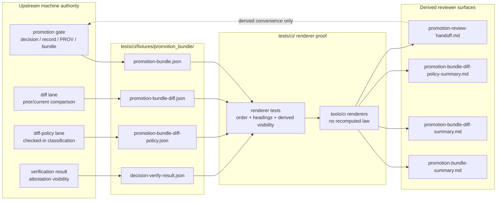

<!-- [KFM_META_BLOCK_V2]
doc_id: kfm://doc/TODO-NEEDS-UUID
title: Promotion Bundle CI Fixture
type: standard
version: v1
status: draft
owners: TODO-NEEDS-OWNER
created: 2026-04-27
updated: 2026-04-27
policy_label: TODO-NEEDS-POLICY-LABEL
related: [tests/ci/README.md, tools/ci/README.md, tools/validators/promotion_gate/README.md, tests/validators/README.md, tests/fixtures/promotion/render/, schemas/promotion/, policy/promotion_bundle_diff_policy.json]
tags: [kfm, ci, tests, fixtures, promotion, promotion-bundle, review-handoff]
notes: [Generated as repo-ready draft for tests/ci/fixtures/promotion_bundle/README.md; owner, policy label, doc UUID, and related-link validity need branch verification; current source packets also mention tests/fixtures/promotion/render/ as a promotion-render fixture home, so fixture-home authority must be checked before publication.]
[/KFM_META_BLOCK_V2] -->

# Promotion Bundle CI Fixture

Tiny synthetic fixture home for CI renderer tests that display promotion-bundle review artifacts without replacing the underlying machine objects.

> [!IMPORTANT]
> **Status:** experimental · **Owners:** `TODO-NEEDS-OWNER` · **Path:** `tests/ci/fixtures/promotion_bundle/`
>
> [](#scope)
> [](#fixture-contract)
> [](#authority-boundaries)
> [](#verification-gates)
>
> **Quick jumps:** [Scope](#scope) · [Repo fit](#repo-fit) · [Inputs](#inputs) · [Exclusions](#exclusions) · [Directory tree](#directory-tree) · [Quickstart](#quickstart) · [Diagram](#diagram) · [Fixture contract](#fixture-contract) · [Verification gates](#verification-gates) · [FAQ](#faq)

---

## Scope

This directory is for **small, deterministic, synthetic fixtures** used by `tests/ci/` to prove that promotion-bundle review renderers produce stable reviewer-facing Markdown.

The fixture set supports the CI rendering path:

1. consume declared machine artifacts,
2. render reviewer-facing summaries,
3. preserve the visible distinction between **machine authority** and **derived Markdown**, and
4. keep the review handoff subordinate to the bundle, diff, diff-policy, and verification inputs.

### Current evidence snapshot

| Claim | Label | Reason |
|---|---:|---|
| This README targets `tests/ci/fixtures/promotion_bundle/`. | CONFIRMED | The path is the requested target file location. |
| The fixture role is CI renderer support, not validator authority. | INFERRED | The path sits under `tests/ci/fixtures/`, and KFM promotion-review source material separates `tests/ci/` renderer checks from validator/diff/policy proof lanes. |
| Fixture filenames and sibling links below are branch-ready but not branch-verified. | NEEDS VERIFICATION | The active repository tree was not visible during authoring. |
| Source packets also reference `tests/fixtures/promotion/render/`. | NEEDS VERIFICATION | Treat that as a possible canonical fixture home or prior-path alias until the mounted branch confirms the convention. |

---

## Repo fit

| Direction | Surface | Link from this README | Role |
|---|---|---|---|
| This directory | `tests/ci/fixtures/promotion_bundle/` | `.` | Static synthetic inputs for CI renderer tests. |
| Upstream machine fixture variant | `tests/fixtures/promotion/render/` | [promotion render fixtures](../../../fixtures/promotion/render/) | **NEEDS VERIFICATION:** source packets name this as a promotion-render fixture home. |
| Upstream validators | `tools/validators/promotion_gate/` | [promotion gate validators](../../../../tools/validators/promotion_gate/) | Generates or validates machine promotion artifacts; this fixture directory must not duplicate that law. |
| Upstream diff / policy proof | `tests/validators/` | [validator tests](../../../validators/) | Proves finite machine outputs, bundle diff compatibility, and checked-in diff-policy behavior. |
| Renderer helpers | `tools/ci/` | [CI renderer helpers](../../../../tools/ci/) | Renders already-produced artifacts into human-readable summaries and handoffs. |
| CI proof lane | `tests/ci/` | [CI tests](../../README.md) | Proves renderer order, structure, and derived visibility. |
| Promotion schemas | `schemas/promotion/` | [promotion schemas](../../../../schemas/promotion/) | Defines machine artifact shapes. |
| Diff-policy data | `policy/promotion_bundle_diff_policy.json` | [bundle diff policy](../../../../policy/promotion_bundle_diff_policy.json) | Checked-in policy data; this directory may mirror output fixtures, not policy authority. |
| Generated review output | `data/work/promotion_render_test/` | `../../../../data/work/promotion_render_test/` | Runtime/test output target; normally not committed unless the repo explicitly tracks generated proofs. |

> [!WARNING]
> Do not let this directory become a second source of promotion truth. If fixtures here diverge from generated validator artifacts or the canonical fixture home, update the fixture authority decision instead of normalizing drift by convenience.

---

## Inputs

Accepted inputs are **declared, synthetic, machine-shaped JSON artifacts** that renderer tests can consume without recomputing promotion law.

| Fixture | Expected use | Authority level |
|---|---|---:|
| `promotion-bundle.json` | Bundle identity, candidate metadata, artifact inventory, run receipt references, verification visibility. | fixture copy of machine object |
| `promotion-bundle-diff.json` | Prior/current drift summary already computed by the diff lane. | fixture copy of machine object |
| `promotion-bundle-diff-policy.json` | Checked-in drift classification already produced by the policy/evaluator lane. | fixture copy of machine object |
| `decision-verify-result.json` | Verification or attestation result used for trust-visibility rendering. | fixture copy of machine object |
| `expected/*.txt` or `expected/*.md` | Optional tiny golden fragments for headings or ordering checks. | derived assertion helper |

Fixture content should be:

- deterministic,
- small enough to review in a pull request,
- safe for public repository visibility unless the repo marks this area restricted,
- free of credentials, tokens, signatures, exact sensitive locations, or live source dumps,
- traceable to the current promotion schema version or explicitly marked as an old-version regression case.

---

## Exclusions

This directory should **not** contain the surfaces below.

| Do not put here | Put it here instead | Reason |
|---|---|---|
| Promotion-gate implementation code | [promotion gate validators](../../../../tools/validators/promotion_gate/) | Validator logic owns promotion outcomes. |
| Diff computation logic | `tools/diff/` or the repo-confirmed diff lane | Diff law is upstream of renderer tests. |
| Diff-policy rules or policy data | [bundle diff policy](../../../../policy/promotion_bundle_diff_policy.json) | Checked-in policy authority should not live in CI fixture data. |
| JSON Schemas | [promotion schemas](../../../../schemas/promotion/) | Machine contracts belong in schema/contract homes. |
| Generated Markdown summaries | `data/work/promotion_render_test/` during tests | Markdown output is derived; commit only intentional golden fragments. |
| Real promotion receipts or proof packs | `data/receipts/`, `data/proofs/`, or release-scoped artifact homes | Fixtures are synthetic and should not masquerade as audit records. |
| RAW / WORK / QUARANTINE / PROCESSED source data | governed data lifecycle homes | CI renderer fixtures must not bypass the KFM truth path. |
| Secrets, API keys, private signatures, exact sensitive geometries | nowhere in committed fixtures | Fail closed; use synthetic placeholders. |

---

## Directory tree

Expected shape for this directory after fixture-home verification:

```text
tests/ci/fixtures/promotion_bundle/
├── README.md
├── promotion-bundle.json
├── promotion-bundle-diff.json
├── promotion-bundle-diff-policy.json
├── decision-verify-result.json
└── expected/
    ├── promotion-bundle-summary.fragments.txt
    ├── promotion-bundle-diff-summary.fragments.txt
    ├── promotion-bundle-diff-policy-summary.fragments.txt
    └── promotion-review-handoff.fragments.txt
```

> [!NOTE]
> The `expected/` folder is optional. Prefer explicit assertions in `tests/ci/` when the expected output is short. Use golden fragments only when they make reviewer intent clearer.

---

## Quickstart

Run renderer-focused CI tests from the repository root.

```bash
pytest -q \
  tests/ci/test_render_promotion_bundle_summary.py \
  tests/ci/test_render_diff_summary.py \
  tests/ci/test_render_bundle_diff_policy_summary.py \
  tests/ci/test_render_promotion_review_handoff.py
```

Render the review artifact sequence from declared fixture inputs, when the branch includes the matching e2e script.

```bash
bash tests/e2e/promotion_gate/test_render_review_artifacts.sh
```

Expected generated outputs, when the script is present:

```text
data/work/promotion_render_test/promotion-bundle-summary.md
data/work/promotion_render_test/promotion-bundle-diff-summary.md
data/work/promotion_render_test/promotion-bundle-diff-policy-summary.md
data/work/promotion_render_test/promotion-review-handoff.md
```

### Quick local sanity check

Use this before opening a PR when fixture files exist locally.

```bash
python -m json.tool tests/ci/fixtures/promotion_bundle/promotion-bundle.json >/dev/null
python -m json.tool tests/ci/fixtures/promotion_bundle/promotion-bundle-diff.json >/dev/null
python -m json.tool tests/ci/fixtures/promotion_bundle/promotion-bundle-diff-policy.json >/dev/null
python -m json.tool tests/ci/fixtures/promotion_bundle/decision-verify-result.json >/dev/null
```

---

## Diagram



---

## Fixture contract

### Authority boundaries

| Surface | This directory may provide | This directory must not decide |
|---|---|---|
| Bundle summary | representative bundle fixture fields for rendering | whether a bundle is complete, authentic, or releasable |
| Diff summary | representative drift counts and key lists | whether the diff was computed correctly |
| Diff-policy summary | representative classification result | whether classification rules are correct |
| Review handoff | declared inputs for composed Markdown | whether steward approval happened |
| Verification visibility | representative attestation result | whether a signature is valid in production |

### Publication order

Renderer tests should preserve this review order when all four artifacts exist:

1. `promotion-bundle-summary.md`
2. `promotion-bundle-diff-summary.md`
3. `promotion-bundle-diff-policy-summary.md`
4. `promotion-review-handoff.md`

That order keeps reviewer navigation aligned to the trust path: **bundle → drift → classification → composed handoff**.

### Non-substitution rule

`promotion-review-handoff.md` is a convenience artifact. It must never substitute for:

- `promotion-bundle.json`,
- `promotion-bundle-diff.json`,
- `promotion-bundle-diff-policy.json`,
- verification results,
- release manifests,
- proof packs,
- receipts,
- steward approval records.

---

## Verification gates

Use this checklist before changing fixture content.

- [ ] Fixture home confirmed against the mounted branch: `tests/ci/fixtures/promotion_bundle/` versus `tests/fixtures/promotion/render/`.
- [ ] Fixture files validate against the current schema or are clearly marked as regression fixtures.
- [ ] Fixture content is synthetic, deterministic, and safe to commit.
- [ ] No RAW, WORK, QUARANTINE, or unpublished source data appears in fixture files.
- [ ] No credential, token, private key, or live attestation secret appears in fixture files.
- [ ] No exact sensitive geometry, living-person data, DNA data, archaeological site location, or protected-species location appears in fixture files.
- [ ] Renderer tests assert formatting, section order, stable headings, and derived visibility only.
- [ ] Renderer tests do not recompute diff, policy, signature verification, promotion eligibility, or steward approval.
- [ ] Any changed fixture field is explained in the PR and mapped to the renderer behavior it is meant to exercise.
- [ ] This README and adjacent README files are updated if fixture naming or directory authority changes.
- [ ] Meta block placeholders are resolved before moving this document from `draft` to `review` or `published`.

---

## FAQ

### Why are these fixtures under `tests/ci/`?

Because this lane is about CI renderer behavior. The renderer should consume declared upstream artifacts and prove stable Markdown output. Validator behavior belongs in `tests/validators/`; workflow orchestration belongs in `.github/workflows/`.

### Why not test live promotion output here?

Static fixtures make renderer tests deterministic and reviewable. Live promotion output belongs in validator or e2e lanes, then feeds this renderer path as declared inputs.

### Can a fixture include a blocking diff-policy result?

Yes. Blocking, review-required, and non-blocking cases are all useful renderer scenarios. The fixture may represent a classification outcome; it must not define the classification law.

### Can this directory include golden Markdown files?

Only when small fragments improve review clarity. Prefer direct assertions on rendered output structure. Full generated Markdown files can become brittle and may blur the distinction between fixture input and derived output.

### What should happen when fixture schema changes?

Update the fixture, update the renderer test, and record why the schema movement matters. Breaking changes should use the repo’s schema-version and compatibility discipline rather than silently editing historical fixtures.

---

## Appendix

<details>
<summary><strong>Illustrative fixture-field checklist</strong></summary>

A promotion-bundle fixture should normally include enough fields for renderer tests to display:

- candidate or subject reference,
- bundle identity,
- creation timestamp,
- run receipt reference,
- artifact inventory,
- verification or attestation visibility,
- release or audit references when relevant,
- media type and hash fields for artifact table rendering.

A bundle-diff fixture should normally include enough fields for renderer tests to display:

- changed / unchanged / error status,
- blocking boolean,
- added count,
- removed count,
- changed count,
- changed key names,
- optional changed-path details.

A diff-policy fixture should normally include enough fields for renderer tests to display:

- policy status,
- blocking or review-required state,
- changed-key classification rows,
- human-readable classification reasons,
- reviewer-facing next action.

A verification-result fixture should normally include enough fields for renderer tests to display:

- verified / not verified / unavailable state,
- verification reference,
- verifier or attestation surface label,
- failure reason when negative.

</details>

<details>
<summary><strong>Review language for PRs touching this directory</strong></summary>

Use a PR note like this when fixture content changes:

```text
This PR changes promotion-bundle CI renderer fixtures only.

Authority boundary:
- Does not change promotion-gate decision logic.
- Does not change stable diff logic.
- Does not change diff-policy classification logic.
- Does not change release or steward approval state.

Renderer behavior exercised:
- <describe headings, inventory rows, trust-visibility line, drift row, or handoff section>
```

</details>

[Back to top](#promotion-bundle-ci-fixture)
