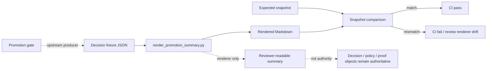

<!-- [KFM_META_BLOCK_V2]
doc_id: kfm://doc/TODO-NEEDS-VERIFICATION
title: Promotion Summary CI Fixtures
type: standard
version: v1
status: draft
owners: TODO-NEEDS-VERIFICATION
created: TODO-NEEDS-VERIFICATION
updated: 2026-04-27
policy_label: TODO-NEEDS-VERIFICATION
related: [../README.md, ../../README.md, ../../../README.md, ../../../../tools/ci/render_promotion_summary.py, ../../../../tools/validators/promotion_gate/README.md, ../../../../schemas/promotion/decision-envelope.schema.json]
tags: [kfm, tests, ci, fixtures, promotion, summary]
notes: [README-like directory document for promotion-summary renderer fixtures. Exact fixture filenames, owner, created date, policy label, downstream test path, and adjacent links still need verification against the mounted repository.]
[/KFM_META_BLOCK_V2] -->

<a id="top"></a>

# Promotion Summary CI Fixtures

Fixture lane for deterministic CI tests that render promotion decisions into reviewer-readable Markdown summaries.


> [!IMPORTANT]
> **Status:** experimental  
> **Owners:** `TODO-NEEDS-VERIFICATION`  
> **Path:** `tests/ci/fixtures/promotion_summary/README.md`  
> **Quick jumps:** [Scope](#scope) · [Repo fit](#repo-fit) · [Inputs](#inputs) · [Exclusions](#exclusions) · [Directory tree](#directory-tree) · [Quickstart](#quickstart) · [Usage](#usage) · [Diagram](#diagram) · [Fixture matrix](#fixture-matrix) · [Review gates](#review-gates) · [FAQ](#faq) · [Appendix](#appendix)

> [!NOTE]
> A promotion summary is a **reviewer-readable rendering surface**, not promotion law. Authority stays with the machine-readable promotion decision, schemas, policy, provenance, receipts, proof objects, and review state.

---

## Scope

This directory holds compact fixtures for validating the CI renderer that turns a promotion decision into a stable Markdown summary.

Use this fixture lane to prove that `render_promotion_summary.py` remains:

- **deterministic** — the same input renders the same Markdown
- **reviewable** — reviewers can see candidate identity, decision outcome, gate posture, and trust visibility
- **subordinate** — rendered Markdown never replaces `decision.json`, policy output, receipts, proofs, provenance, or release artifacts
- **fail-closed** — malformed, incomplete, or policy-blocked inputs render as visible negative states instead of silent success

The fixture scope is intentionally narrow. It tests the summary renderer’s behavior, not the full promotion gate, bundle writer, diff engine, policy engine, or release system.

[Back to top](#top)

---

## Repo fit

| Direction | Path | Status | Role |
|---|---|---:|---|
| Current directory | `tests/ci/fixtures/promotion_summary/` | **NEEDS VERIFICATION** | Fixture cases for promotion-summary rendering tests. |
| Parent fixture lane | [`../README.md`](../README.md) | **NEEDS VERIFICATION** | Expected local fixture-home guidance for CI fixtures. |
| CI test lane | [`../../README.md`](../../README.md) | **NEEDS VERIFICATION** | Expected CI test documentation boundary. |
| Test root | [`../../../README.md`](../../../README.md) | **NEEDS VERIFICATION** | Expected top-level test strategy and fixture taxonomy. |
| Renderer under test | [`../../../../tools/ci/render_promotion_summary.py`](../../../../tools/ci/render_promotion_summary.py) | **NEEDS VERIFICATION** | Converts a promotion decision into reviewer-readable Markdown. |
| Upstream validator lane | [`../../../../tools/validators/promotion_gate/README.md`](../../../../tools/validators/promotion_gate/README.md) | **NEEDS VERIFICATION** | Documents the promotion gate, finite outcomes, trust chain, and handoff surfaces. |
| Input schema | [`../../../../schemas/promotion/decision-envelope.schema.json`](../../../../schemas/promotion/decision-envelope.schema.json) | **NEEDS VERIFICATION** | Expected machine-checkable decision shape for input fixtures. |
| Policy boundary | [`../../../../policy/README.md`](../../../../policy/README.md) | **NEEDS VERIFICATION** | Policy ownership stays outside this fixture directory. |
| Workflow boundary | [`../../../../.github/workflows/README.md`](../../../../.github/workflows/README.md) | **NEEDS VERIFICATION** | CI orchestration belongs in workflows, not fixture docs. |

> [!WARNING]
> The links above are repo-relative from this README’s target location. Verify them in the actual checkout before publishing or treating this file as link-clean.

[Back to top](#top)

---

## Inputs

Accepted inputs are the smallest stable artifacts needed to test summary rendering.

| Accepted input | What belongs here | Fixture posture |
|---|---|---|
| Promotion decision fixture | A compact `DecisionEnvelope`-like JSON object with candidate identity, finite decision outcome, `spec_hash`, gate states, reason codes, and trust visibility. | **CONFIRMED doctrine / NEEDS VERIFICATION local inventory** |
| Expected Markdown snapshot | The exact reviewer-readable output expected from the renderer for the matching input. | **PROPOSED** |
| Negative-path fixture | `ABSTAIN`, `DENY`, or `ERROR` examples proving the summary does not hide missing evidence, blocked policy, invalid schema, or integrity failure. | **PROPOSED** |
| Fixture metadata | Optional notes explaining why a fixture exists, which branch behavior it guards, and which upstream object family it represents. | **PROPOSED** |
| Stable digest examples | Fixed `spec_hash` / artifact digest values used only for renderer tests. | **PROPOSED** |

Fixture values should be synthetic, public-safe, and deterministic. Do not use live secrets, real unpublished release records, private source payloads, or current timestamps.

---

## Exclusions

| Does **not** belong here | Put it here instead | Why |
|---|---|---|
| RAW, WORK, QUARANTINE, or unpublished candidate data | `data/raw/`, `data/work/`, `data/quarantine/` | Fixture Markdown should not normalize bypassing the governed lifecycle. |
| Production receipts or proof packs | `data/receipts/`, `data/proofs/` | This directory tests rendering; receipts and proofs keep their own authority boundaries. |
| Promotion bundles, bundle diffs, and diff-policy reports | A bundle/diff-specific fixture lane | Bundle and diff rendering are adjacent but separate renderer concerns. |
| Policy rulepacks or policy fixtures | `policy/` and policy test fixtures | Policy decides; this directory renders. |
| Workflow YAML | `.github/workflows/` | Workflows orchestrate; fixtures only supply stable test inputs and expected outputs. |
| Generated CI output not intended as a snapshot | CI artifact storage / job summary | Avoid committing one-off job output as fixture truth. |
| Renderer implementation code | `tools/ci/` | Keep fixture data separate from executable behavior. |

[Back to top](#top)

---

## Directory tree

The exact branch inventory is **NEEDS VERIFICATION**. This is the intended fixture shape to use when adding or reviewing cases:

```text
tests/ci/fixtures/promotion_summary/
├── README.md
├── promote.decision.json          # PROPOSED: positive-path input
├── promote.expected.md            # PROPOSED: expected Markdown snapshot
├── abstain.decision.json          # PROPOSED: insufficient-proof / incomplete-support input
├── abstain.expected.md            # PROPOSED: visible abstention output
├── deny.decision.json             # PROPOSED: policy / integrity denial input
├── deny.expected.md               # PROPOSED: visible denial output
├── error.decision.json            # PROPOSED: malformed or renderer-error boundary input
└── error.expected.md              # PROPOSED: visible error output
```

Naming guidance:

- use lowercase case names
- pair each input with one expected snapshot
- keep file names outcome-oriented and stable
- avoid embedding dates unless the date itself is the fixture condition
- update snapshots only when the renderer contract intentionally changes

---

## Quickstart

Verify the local inventory first:

```bash
find tests/ci/fixtures/promotion_summary -maxdepth 2 -type f | sort
```

Render one fixture case:

```bash
python tools/ci/render_promotion_summary.py \
  tests/ci/fixtures/promotion_summary/promote.decision.json \
  --output /tmp/kfm-promotion-summary.md
```

Compare against the expected snapshot:

```bash
diff -u \
  tests/ci/fixtures/promotion_summary/promote.expected.md \
  /tmp/kfm-promotion-summary.md
```

Run the focused CI test if the branch exposes it:

```bash
pytest -q tests/ci/test_render_promotion_summary.py
```

> [!NOTE]
> The exact test module name is **NEEDS VERIFICATION**. Keep this README synchronized with the checked-in test path once the target branch is inspected.

[Back to top](#top)

---

## Usage

### What the renderer should make visible

A promotion summary fixture should preserve the review signal that matters:

| Summary element | Why it matters |
|---|---|
| Candidate identity | Reviewers must know what release candidate is being summarized. |
| Finite outcome | The rendered document must expose `PROMOTE`, `ABSTAIN`, `DENY`, or `ERROR` clearly. |
| `spec_hash` / identity root | Reviewers need a stable identifier for the candidate specification. |
| Gate posture | Gate failures, abstentions, obligations, and review-needed states should not be hidden. |
| Trust visibility | Attestation, provenance, catalog closure, and policy visibility should be readable when present. |
| Reviewer conclusion | The summary should end with a short conclusion that helps handoff without creating new authority. |

### What the renderer must not do

The renderer must not:

- invent a decision
- reinterpret policy
- silently upgrade `ABSTAIN`, `DENY`, or `ERROR`
- hide missing evidence, missing catalog closure, or missing proof references
- claim release authority from Markdown alone
- use non-deterministic timestamps unless the fixture explicitly fixes them
- mutate input JSON while rendering

### Snapshot update rule

Update an expected Markdown snapshot only when at least one of these is true:

1. the renderer contract changed intentionally
2. the input fixture changed intentionally
3. the summary shape was corrected to expose more trust state
4. a prior snapshot hid a review-significant fact

Do not update snapshots just to make a failing test pass.

---

## Diagram



[Back to top](#top)

---

## Fixture matrix

| Case | Input outcome | Expected renderer behavior | Review risk guarded |
|---|---:|---|---|
| `promote` | `PROMOTE` | Shows candidate, green/pass decision, gate health, identity hash, and concise reviewer handoff. | Positive path hides no trust-critical state. |
| `abstain` | `ABSTAIN` | Shows incomplete support, unresolved evidence, or review obligations without implying approval. | Incomplete evidence is not converted into approval language. |
| `deny` | `DENY` | Shows blocking condition, reason codes, and no-publication posture. | Policy or integrity failure is not softened into a warning. |
| `error` | `ERROR` | Shows malformed input, schema failure, or renderer boundary issue as a visible failure. | System failure is not treated as a decision. |

Outcome labels above reflect promotion-summary fixture expectations. If the active repo uses a different enum or shape, update this matrix and the renderer tests together.

---

## Review gates

Use this checklist before adding or modifying fixtures.

- [ ] Input fixture is synthetic and public-safe.
- [ ] Input fixture validates against the active decision-envelope schema, or the test intentionally covers invalid input.
- [ ] Expected Markdown snapshot is deterministic.
- [ ] Negative-path cases are represented, not only the happy path.
- [ ] Snapshot exposes candidate identity, finite outcome, and reason codes where present.
- [ ] Snapshot does not create new promotion authority.
- [ ] Snapshot does not contain RAW, WORK, QUARANTINE, secret, private, or live unpublished references.
- [ ] Snapshot does not use wall-clock time unless fixed in fixture input.
- [ ] Any changed summary shape is reflected in renderer docs and tests.
- [ ] Relative links in this README were checked from `tests/ci/fixtures/promotion_summary/`.

Definition of done: a fixture update is complete only when renderer output, expected snapshot, schema posture, and reviewer-facing explanation agree.

[Back to top](#top)

---

## FAQ

### Is `promotion-summary.md` authoritative?

No. It is a reviewer-readable rendering of upstream machine objects. The decision, policy output, provenance, catalog closure, receipts, proofs, and release manifests remain the authority surfaces.

### Can this directory include bundle summaries?

Not by default. Bundle summaries, diff summaries, diff-policy summaries, and review handoff documents are adjacent rendering concerns. Keep this directory focused on promotion-summary rendering unless the local test suite proves a broader fixture convention.

### Why include negative fixtures?

KFM’s trust posture depends on visible negative states. `ABSTAIN`, `DENY`, and `ERROR` cases guard against renderer drift that makes blocked or incomplete releases look acceptable.

### Should snapshots be polished?

They should be readable and stable, not clever. Reviewer trust is helped more by consistent structure than by decorative Markdown.

---

## Appendix

<details>
<summary>Truth labels used in this README</summary>

| Label | Meaning |
|---|---|
| **CONFIRMED** | Verified from current workspace evidence or supplied KFM doctrine. |
| **INFERRED** | Reasonable conclusion from target path, adjacent KFM terminology, or documented pattern; not independently verified in the mounted repo. |
| **PROPOSED** | Recommended fixture shape, path, or practice not yet verified as active branch behavior. |
| **UNKNOWN** | Not verifiable without the mounted repository, tests, workflows, or runtime artifacts. |
| **NEEDS VERIFICATION** | Specific check required before claiming implementation presence or link validity. |

</details>

<details>
<summary>Open verification items</summary>

- Confirm exact files currently present in `tests/ci/fixtures/promotion_summary/`.
- Confirm whether this directory already uses paired `.decision.json` / `.expected.md` naming.
- Confirm the active renderer path for promotion summaries.
- Confirm the focused CI test path.
- Confirm owner and CODEOWNERS coverage.
- Confirm whether decision input fixtures use `PROMOTE`, `ABSTAIN`, `DENY`, and `ERROR`, or another branch-specific enum.
- Confirm whether fixture output is Markdown snapshot, JSON report, GitHub Step Summary text, or a combination.
- Confirm whether this directory should link to a broader `tests/ci/fixtures/README.md`.

</details>

[Back to top](#top)
