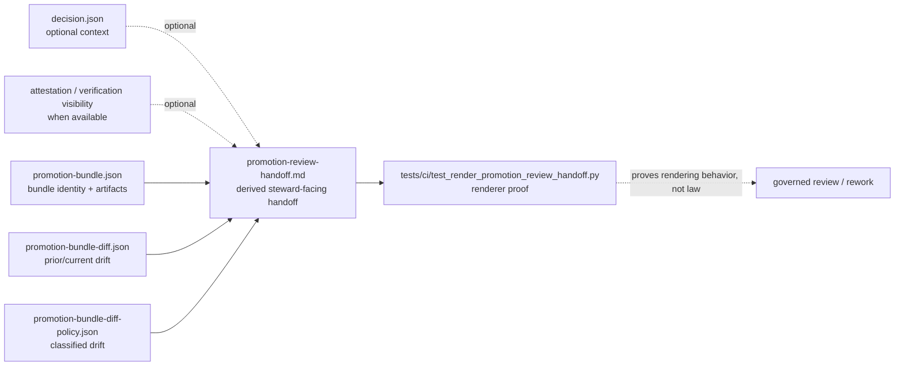

<!-- [KFM_META_BLOCK_V2]
doc_id: kfm://doc/TODO-uuid-review-handoff-fixtures
title: Review Handoff Fixtures
type: standard
version: v1
status: draft
owners: TODO: assign CI/release steward
created: 2026-04-27
updated: 2026-04-27
policy_label: TODO-policy-label
related: [tests/ci/README.md, tools/ci/README.md, tools/diff/README.md, tools/validators/promotion_gate/README.md, contracts/promotion_review_handoff.md]
tags: [kfm, ci, fixtures, review-handoff, promotion]
notes: [doc_id owners policy_label and related paths need mounted-repo verification before publication]
[/KFM_META_BLOCK_V2] -->

<div id="top"></div>

# Review Handoff Fixtures

Small, deterministic fixture packs for proving promotion-review handoff rendering without re-owning promotion, diff, policy, release, or attestation authority.


> [!IMPORTANT]
> **Impact block**
>
> - **Status:** `experimental`
> - **Owners:** `TODO: assign CI/release steward`
> - **Path:** `tests/ci/fixtures/review_handoff/`
> - **Quick jumps:** [Scope](#scope) · [Repo fit](#repo-fit) · [Inputs](#inputs) · [Exclusions](#exclusions) · [Fixture map](#fixture-map) · [Review contract](#review-contract) · [Quickstart](#quickstart) · [Validation gates](#validation-gates) · [Appendix](#appendix)

> [!NOTE]
> This README documents a fixture directory. It should remain boring, small, public-safe, and easy to review in Git. The handoff renderer may summarize governed artifacts, but it must not become the authority for promotion, policy, diff, signing, publication, or evidence truth.

---

## Scope

`tests/ci/fixtures/review_handoff/` is for fixture inputs used by CI tests that prove a review-handoff renderer can compose one steward-facing Markdown document from already-governed upstream artifacts.

This fixture lane is appropriate when the test subject is a `tools/ci/` helper that consumes declared files such as:

- `promotion-bundle.json`
- `promotion-bundle-diff.json`
- `promotion-bundle-diff-policy.json`
- optional attestation or verification visibility
- optional decision or record context, when branch-proven and review-relevant

It is not a promotion gate, policy engine, signing tool, release writer, or proof store.

[Back to top](#top)

---

## Repo fit

| Role | Path | Status | Why it matters |
| --- | --- | --- | --- |
| This fixture home | `tests/ci/fixtures/review_handoff/` | **PROPOSED / NEEDS VERIFICATION** | Keeps composed-handoff inputs close to CI renderer tests. |
| CI lane README | [`../../README.md`](../../README.md) | **NEEDS VERIFICATION** | Should describe helper-focused CI proof surfaces and local runner expectations. |
| Handoff renderer test | [`../../test_render_promotion_review_handoff.py`](../../test_render_promotion_review_handoff.py) | **NEEDS VERIFICATION** | Should consume these fixtures without recomputing upstream law. |
| CI renderer helper | [`../../../../tools/ci/render_promotion_review_handoff.py`](../../../../tools/ci/render_promotion_review_handoff.py) | **NEEDS VERIFICATION** | Should compose reviewer-facing Markdown from declared inputs. |
| Renderer helper docs | [`../../../../tools/ci/README.md`](../../../../tools/ci/README.md) | **NEEDS VERIFICATION** | Should keep rendering responsibilities separate from decision authority. |
| Stable diff lane | [`../../../../tools/diff/README.md`](../../../../tools/diff/README.md) | **NEEDS VERIFICATION** | Owns prior/current comparison semantics. |
| Promotion gate lane | [`../../../../tools/validators/promotion_gate/README.md`](../../../../tools/validators/promotion_gate/README.md) | **NEEDS VERIFICATION** | Owns gate decision semantics and upstream validator outputs. |
| Handoff contract note | [`../../../../contracts/promotion_review_handoff.md`](../../../../contracts/promotion_review_handoff.md) | **NEEDS VERIFICATION** | Should define handoff role, required sections, ordering, and non-authority limits. |

### Upstream / downstream flow

| Direction | Surface | Fixture relationship |
| --- | --- | --- |
| Upstream | promotion gate / `DecisionEnvelope` outputs | May provide optional decision context; this fixture directory does not decide. |
| Upstream | `promotion-bundle.json` | Required direct handoff input in normal cases. |
| Upstream | stable diff output | Required direct handoff input as `promotion-bundle-diff.json`. |
| Upstream | checked-in bundle diff-policy output | Required direct handoff input as `promotion-bundle-diff-policy.json`. |
| Downstream | `render_promotion_review_handoff.py` | Uses fixtures to render one derived reviewer handoff. |
| Downstream | `tests/ci/test_render_promotion_review_handoff.py` | Asserts deterministic renderer behavior and failure behavior. |
| Downstream | `$GITHUB_STEP_SUMMARY` or PR comment mode | May display rendered output; must not replace machine artifacts. |

[Back to top](#top)

---

## Inputs

Accepted inputs are deliberately narrow.

| Input | Required | Expected role | Fixture rule |
| --- | --- | --- | --- |
| `promotion-bundle.json` | Yes | Bundle identity and artifact inventory. | Keep tiny, synthetic, and reviewable. |
| `promotion-bundle-diff.json` | Yes | Prior/current drift surface. | Use stable, deterministic diff-like shape; do not recompute in renderer tests. |
| `promotion-bundle-diff-policy.json` | Yes | Checked-in interpretation of changed keys. | Preserve `blocking` and `review_required` visibility. |
| `decision-verify-result.json` or equivalent attestation visibility | Conditional | Trust visibility when available. | Never pretend to sign or verify inside this fixture lane. |
| `decision.json` | Conditional | Optional reviewer context. | Include only when the active renderer contract consumes it. |
| `promotion-record.json` / `promotion-prov.json` | Conditional | Deeper audit or provenance context. | Prefer small references over copied proof bodies. |

> [!TIP]
> Prefer one obvious fixture triplet over a large “realistic” dump. Reviewer trust improves when the fixture explains the behavior under test at a glance.

[Back to top](#top)

---

## Exclusions

| Do not put this here | Put it here instead | Reason |
| --- | --- | --- |
| diff computation logic | `tools/diff/` | Comparison law should stay upstream and machine-checkable. |
| policy classification logic | `policy/` or validator/evaluator lanes | Governance must not hide inside prose rendering. |
| promotion decision authority | promotion gate contracts, schemas, and validators | The handoff is downstream of decision authority. |
| signing or verification implementation | `tools/attest/` or branch-proven attestation lane | Trust operations are distinct from reviewer presentation. |
| live workflow orchestration | `.github/workflows/` or `scripts/` | Fixtures should not depend on GitHub-only state. |
| runtime publish or mutate actions | release/runtime lanes | Review handoff fixtures must remain read-only. |
| unpublished evidence or sensitive payloads | governed lifecycle stores or restricted fixtures | CI fixtures should be public-safe by default. |
| large golden Markdown snapshots | `tests/ci/golden/review_handoff/` | Keep this directory focused on input fixtures unless local convention says otherwise. |

[Back to top](#top)

---

## Fixture map

### Recommended shape

```text
tests/ci/fixtures/review_handoff/
├── README.md
├── promote/
│   ├── promotion-bundle.json
│   ├── promotion-bundle-diff.json
│   └── promotion-bundle-diff-policy.json
├── review-required/
│   ├── promotion-bundle.json
│   ├── promotion-bundle-diff.json
│   └── promotion-bundle-diff-policy.json
├── blocking-drift/
│   ├── promotion-bundle.json
│   ├── promotion-bundle-diff.json
│   └── promotion-bundle-diff-policy.json
└── invalid/
    ├── missing-diff-policy.promotion-bundle.json
    └── malformed-bundle.json
```

### Case families

| Case | Purpose | Minimum assertion focus |
| --- | --- | --- |
| `promote/` | Non-blocking handoff with visible candidate, artifacts, diff, policy, and conclusion. | Candidate identity, artifact inventory, non-blocking state, conclusion block. |
| `review-required/` | Non-blocking drift that still requires steward review. | `review_required` visibility and clear reviewer action language. |
| `blocking-drift/` | Release-significant drift that should remain impossible to miss. | `blocking` visibility, affected keys, warning-level reviewer conclusion. |
| `invalid/` | Malformed or incomplete fixture input. | Renderer fails clearly instead of inventing a handoff. |

> [!WARNING]
> If the active branch still uses a proof-specific flat directory such as `tests/ci/fixtures/render_promotion_review_handoff/`, treat this README as the proposed normalized fixture home until the branch convention is verified or migrated. Do not duplicate fixture packs without a compatibility note.

[Back to top](#top)

---

## Review contract

A promotion review handoff should contain these sections in substance, even if local wording evolves.

| Section | What it should show | Why it matters |
| --- | --- | --- |
| Candidate / bundle identity | promoted subject, bundle identity, key refs | Keeps review anchored to one governed subject. |
| Trust visibility | attestation or verification visibility where available | Makes trust state visible at review time. |
| Artifact inventory | concise list or summary of bundle contents | Prevents “review in the abstract.” |
| Prior / current drift | compact summary of what changed | Lets stewards assess scope without opening raw diff first. |
| Drift-policy interpretation | blocking / review-required / assessed key classes | Keeps policy interpretation visible but separate. |
| Reviewer conclusion block | one concise steward-facing synthesis | Helps review without replacing machine truth. |

### Conclusion block rule

The conclusion block should be:

- short
- legible
- obviously derived
- consistent with upstream machine artifacts

It must not introduce new gate outcomes, hidden exceptions, policy overrides, signature claims, or promotion eligibility claims.

### Preferred review artifact order

When current thin-slice promotion review artifacts are published together, prefer this order:

1. `promotion-bundle-summary.md`
2. `promotion-bundle-diff-summary.md`
3. `promotion-bundle-diff-policy-summary.md`
4. `promotion-review-handoff.md`

This keeps the reviewer path legible: bundle first, then drift, then classified drift, then composed steward-facing conclusion.

[Back to top](#top)

---

## Diagram



[Back to top](#top)

---

## Quickstart

Recheck the branch before extending this fixture family.

```bash
# Inspect fixture and adjacent CI surfaces.
ls -la tests/ci/fixtures/review_handoff
sed -n '1,260p' tests/ci/README.md
sed -n '1,320p' tools/ci/README.md
sed -n '1,260p' contracts/promotion_review_handoff.md 2>/dev/null || true

# Inspect renderer proof and implementation if present.
sed -n '1,260p' tests/ci/test_render_promotion_review_handoff.py 2>/dev/null || true
sed -n '1,260p' tools/ci/render_promotion_review_handoff.py 2>/dev/null || true

# Reconfirm references before adding or moving fixtures.
git grep -n "review_handoff\|render_promotion_review_handoff\|promotion-review-handoff" -- . || true
```

Run the local proof surface when the branch uses `pytest` for this lane.

```bash
pytest -q tests/ci/test_render_promotion_review_handoff.py
```

Render a single fixture set when the helper and normalized fixture home exist.

```bash
python tools/ci/render_promotion_review_handoff.py \
  --bundle tests/ci/fixtures/review_handoff/promote/promotion-bundle.json \
  --diff tests/ci/fixtures/review_handoff/promote/promotion-bundle-diff.json \
  --diff-policy tests/ci/fixtures/review_handoff/promote/promotion-bundle-diff-policy.json \
  --output tests/ci/fixtures/review_handoff/_tmp.promotion-review-handoff.md
```

> [!NOTE]
> `_tmp.*` files are local inspection outputs. Do not commit them unless the repo has a branch-proven convention for checked-in generated examples.

[Back to top](#top)

---

## Usage

### Add a new fixture case

Add a case here only when all of the following are true:

1. the case proves handoff rendering behavior
2. the inputs are declared and deterministic
3. the fixture is small enough to audit in Git
4. the fixture is synthetic or public-safe
5. the expected renderer behavior is not already covered by an existing case
6. the test does not depend on hidden environment variables, GitHub-only state, network access, or live promotion state

### Keep renderer tests separate from gate tests

A renderer test may consume bundle, diff, diff-policy, decision, or attestation-visibility artifacts. It must not:

- recompute promotion law
- re-run policy bundles
- sign or verify artifacts
- publish summaries as proof that release actions occurred
- classify policy drift itself
- replace machine artifacts with the composed Markdown document

### Fixture naming rules

Use names that describe the review condition, not the implementation technique.

| Prefer | Avoid |
| --- | --- |
| `promote/` | `case1/` |
| `review-required/` | `maybe/` |
| `blocking-drift/` | `bad/` |
| `invalid/malformed-bundle.json` | `broken.json` |

[Back to top](#top)

---

## Validation gates

Use this checklist before committing fixture changes.

- [ ] The fixture directory documents the behavior under test.
- [ ] Required inputs are present or the case is explicitly invalid.
- [ ] JSON fixtures are formatted consistently and are easy to diff.
- [ ] Fixture contents are synthetic or public-safe.
- [ ] No fixture contains tokens, secrets, unpublished evidence, steward-only notes, or live source payloads.
- [ ] `blocking` and `review_required` states are visible where relevant.
- [ ] The renderer preserves upstream reason codes or key classifications where relevant.
- [ ] The test proves renderer behavior rather than policy, diff, signing, or release law.
- [ ] Failure semantics are explicit: renderer crash is not promotion denial.
- [ ] Any golden output is small, stable, and stored in the branch-proven golden-output home.
- [ ] `tests/ci/README.md` and `tools/ci/README.md` remain synchronized with this fixture family.
- [ ] Local test command is documented and runnable in the checked-out branch.

[Back to top](#top)

---

## FAQ

### Is `promotion-review-handoff.md` authoritative?

No. It is a derived reviewer convenience surface. The underlying bundle, diff report, diff-policy report, decision, attestation visibility, receipts, proofs, and release-significant objects remain separately identifiable.

### Can this fixture directory contain expected Markdown?

Only if the active branch already keeps small golden fragments beside fixtures. Otherwise, prefer `tests/ci/golden/review_handoff/` for expected rendered output and keep this directory focused on declared inputs.

### Can a fixture use `attestation_verified: true`?

Yes, for synthetic trust-visibility behavior, but the fixture must not imply actual signing or verification occurred. Signing and verification belong to their own trust-operation lane.

### Why keep invalid fixtures here?

Malformed and incomplete cases prove that the renderer fails clearly instead of fabricating review text from missing or invalid upstream machine artifacts.

[Back to top](#top)

---

## Appendix

<details>
<summary><strong>Minimal illustrative fixture triplet</strong> (<strong>PROPOSED</strong>)</summary>

### `promote/promotion-bundle.json`

```json
{
  "bundle_type": "kfm.promotion.bundle",
  "candidate_id": "overlay:floodplain-kansas",
  "decision": "PROMOTE",
  "spec_hash": "111111111111",
  "attestation_verified": true,
  "artifacts": [
    "decision.json",
    "promotion-record.json",
    "promotion-bundle.json"
  ]
}
```

### `promote/promotion-bundle-diff.json`

```json
{
  "tool": "stable-diff",
  "status": "changed",
  "blocking": false,
  "left": "prior/promotion-bundle.json",
  "right": "current/promotion-bundle.json",
  "summary": {
    "added": ["artifacts"],
    "removed": [],
    "changed": ["summary"]
  }
}
```

### `promote/promotion-bundle-diff-policy.json`

```json
{
  "kind": "bundle_diff_policy_report",
  "policy_status": "pass",
  "blocking": false,
  "review_required": false,
  "policy_path": "policy/promotion_bundle_diff_policy.json",
  "policy_version": "v1",
  "counts": {
    "added": 1,
    "removed": 0,
    "changed": 1
  },
  "classifications": [
    {
      "path": "summary",
      "classification": "allow",
      "reason": "Summary drift is non-blocking."
    }
  ]
}
```

</details>

<details>
<summary><strong>Compatibility note for flat proof-specific fixtures</strong> (<strong>NEEDS VERIFICATION</strong>)</summary>

Some prior proof slices used flat filenames under a proof-specific directory such as:

```text
tests/ci/fixtures/render_promotion_review_handoff/
├── promote.promotion-bundle.json
├── promote.promotion-bundle-diff.json
├── promote.promotion-bundle-diff-policy.json
├── block.promotion-bundle.json
├── block.promotion-bundle-diff.json
├── block.promotion-bundle-diff-policy.json
└── invalid.promotion-bundle.json
```

If that shape exists in the active branch, choose one of these paths during implementation review:

1. keep the flat shape and move this README to that branch-proven directory
2. migrate to `review_handoff/` with a compatibility note
3. keep both only temporarily, with clear deprecation and test coverage

Do not leave two silent fixture homes for the same renderer contract.

</details>

[Back to top](#top)
