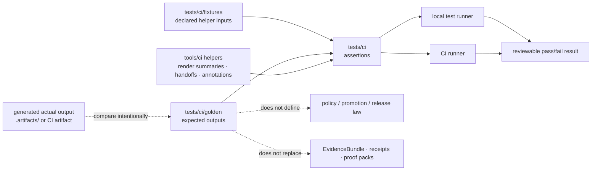

<!-- [KFM_META_BLOCK_V2]
doc_id: kfm://doc/NEEDS_VERIFICATION_UUID
title: CI Golden Outputs
type: standard
version: v1
status: draft
owners: NEEDS_VERIFICATION_OWNER
created: NEEDS_VERIFICATION_DATE
updated: NEEDS_VERIFICATION_DATE
policy_label: NEEDS_VERIFICATION_public_or_internal
related: [../README.md, ../../README.md, ../../../README.md, ../../../tools/ci/README.md, ../../../tools/diff/README.md, ../../../tools/validators/promotion_gate/README.md, ../../validators/README.md, ../../../.github/README.md, ../../../.github/workflows/README.md, ../../../.github/CODEOWNERS]
tags: [kfm, tests, ci, golden, expected-output, fixtures, renderer-proof, reviewer-output, deterministic]
notes: [Directory README for tests/ci/golden. Metadata owner, dates, policy label, and exact active-branch file inventory remain NEEDS VERIFICATION before merge.]
[/KFM_META_BLOCK_V2] -->

<a id="top"></a>

# CI Golden Outputs

Small, deterministic expected-output artifacts for `tests/ci/` helper tests that compare renderer behavior without owning policy, promotion, or release authority.

> [!NOTE]
> **Status:** `experimental`  
> **Owners:** `NEEDS VERIFICATION`  
> **Path:** `tests/ci/golden/README.md`  
> **Repo fit:** child expected-output lane under [`../README.md`](../README.md), aligned to CI helper behavior in [`../../../tools/ci/README.md`](../../../tools/ci/README.md) and broader proof boundaries in [`../../README.md`](../../README.md)  
> **Quick jumps:** [Scope](#scope) · [Repo fit](#repo-fit) · [Accepted inputs](#accepted-inputs) · [Exclusions](#exclusions) · [Directory tree](#directory-tree) · [Quickstart](#quickstart) · [Usage](#usage) · [Diagram](#diagram) · [Operating tables](#operating-tables) · [Task list](#task-list--definition-of-done) · [FAQ](#faq) · [Appendix](#appendix)


> [!IMPORTANT]
> Goldens in this directory are **expected outputs for helper tests**. They are not source fixtures, policy decisions, promotion records, release proofs, runtime evidence, or canonical KFM truth objects.

> [!WARNING]
> Never store tokens, private payloads, unpublished evidence, rights-unclear artifacts, sensitive locations, full workflow dumps, or internal-only trust objects here. A golden file should be safe to clone, print in CI, and review in a pull request.

---

## Scope

`tests/ci/golden/` is the expected-output companion to the helper-focused proof lane in [`tests/ci/`](../README.md).

Use this directory when a CI helper test needs a stable, reviewer-readable baseline such as:

- a Markdown fragment produced by a `tools/ci/render_*` helper
- a compact JSON digest emitted by a CI helper
- a normalized text block used for annotation or step summary checks
- a small failure-path expected output that proves malformed input fails clearly
- a golden fragment used with structural assertions when exact full-output matching would be too brittle

The golden files here help answer one narrow question:

> Given a declared input artifact and a CI helper, did the helper render the same reviewable output shape?

They do **not** answer whether the upstream artifact is true, promotable, policy-allowed, signed, released, or safe for publication.

### Evidence posture used in this README

| Label | Meaning here |
| --- | --- |
| **CONFIRMED** | Supported by attached KFM doctrine or surfaced repo-facing documentation patterns. |
| **INFERRED** | Conservative placement or relationship implied by the parent `tests/ci/` lane. |
| **PROPOSED** | Recommended child-lane structure or naming pattern for future golden coverage. |
| **UNKNOWN** | Not directly verified in the active branch or current mounted repo. |
| **NEEDS VERIFICATION** | Must be checked against the real checkout before merge, especially ownership, exact files, and runner wiring. |

[Back to top](#top)

---

## Repo fit

**Path:** `tests/ci/golden/README.md`  
**Role:** expected-output documentation for helper-focused CI proof surfaces.

| Direction | Surface | Relationship |
| --- | --- | --- |
| Parent | [`../README.md`](../README.md) | Defines the `tests/ci/` helper-proof lane and keeps CI tests separate from policy, release, and workflow authority. |
| Sibling | `../fixtures/` | Holds helper input fixtures when the branch has a dedicated fixture subtree. Goldens should not replace input fixtures. |
| Helper lane | [`../../../tools/ci/README.md`](../../../tools/ci/README.md) | Owns the helper implementations and their contracts. This directory only stores expected outputs used to test those helpers. |
| Validator lane | [`../../validators/README.md`](../../validators/README.md) | Better home for promotion-gate, policy, and validator behavior. |
| Promotion gate | [`../../../tools/validators/promotion_gate/README.md`](../../../tools/validators/promotion_gate/README.md) | Owns promotion validation semantics; goldens may render results but must not define promotion law. |
| Workflow boundary | [`../../../.github/workflows/README.md`](../../../.github/workflows/README.md) | Orchestrates jobs and permissions; should call stable helpers and tests rather than hide assertion logic. |
| Ownership | [`../../../.github/CODEOWNERS`](../../../.github/CODEOWNERS) | Leaf ownership is **NEEDS VERIFICATION** before merge. |

### Current branch reading rule

This README is written for the target path requested by maintainers. The exact active-branch inventory of `tests/ci/golden/` is **NEEDS VERIFICATION** until the real repository checkout is inspected.

Do not convert this README into a claim that every proposed golden family below already exists.

[Back to top](#top)

---

## Accepted inputs

Goldens are expected outputs, but each golden belongs to a declared test input and helper contract. Use this directory only for small, reviewable artifacts that make helper behavior easier to verify.

| Accepted file class | Examples | Rule |
| --- | --- | --- |
| Markdown expected output | `diff/block.md`, `diff_policy/review-required.md`, `review_handoff/hold.md` | Keep stable section order and meaningful text; avoid giant copied reports. |
| Markdown fragments | `fragments/blocking-state.md`, `fragments/review-required-table.md` | Prefer fragments when full-output exact matching would be too brittle. |
| Compact JSON expected output | `digest/pass.json`, `annotation/error.json` | Keep keys deterministic and sorted by the helper or test harness where practical. |
| Normalized text expected output | `stdout/malformed-input.txt`, `stderr/missing-field.txt` | Use only when CLI text is part of the helper contract. |
| Failure-path expected output | `malformed/missing-status.md`, `malformed/empty-bundle.txt` | Negative paths are first-class; one broken invariant per golden keeps failure attribution clear. |
| Metadata sidecar | `*.golden.meta.json` | Optional; use when a golden needs a clear source helper, fixture ref, update reason, or review note. |

### Input rules

1. Every golden must name or imply the helper it supports.
2. Every golden must be deterministic for the same input fixture.
3. Every golden must be small enough to review comfortably in Git.
4. Every golden must be public-safe and safe to print in logs.
5. Every golden update must be paired with a clear reason in the test, commit message, or sidecar.
6. A generated actual output must not overwrite a golden by default.

[Back to top](#top)

---

## Exclusions

| Does **not** belong here | Put it here instead | Why |
| --- | --- | --- |
| Helper implementation code | [`../../../tools/ci/README.md`](../../../tools/ci/README.md) and the helper file | `tests/ci/golden/` stores expectations, not implementation. |
| Primary input fixtures | `../fixtures/` or another declared fixture lane | Inputs and expected outputs should remain distinguishable. |
| Generated actual outputs from a run | `.artifacts/`, `artifacts/`, or a CI artifact store | Actuals are review artifacts until deliberately accepted as new goldens. |
| Promotion or release law | [`../../../tools/validators/promotion_gate/README.md`](../../../tools/validators/promotion_gate/README.md) and `../../validators/` | Goldens may render promotion results; they do not define promotion meaning. |
| Policy rules or policy packages | [`../../../policy/README.md`](../../../policy/README.md) | Policy authority stays in policy surfaces. |
| Workflow sequencing, permissions, or runner setup | [`../../../.github/workflows/README.md`](../../../.github/workflows/README.md) | Workflows orchestrate; tests assert. |
| Full logs, downloaded CI artifacts, or platform dumps | CI artifact storage or a purpose-built debug lane | This directory should stay small and reviewable. |
| Secret-bearing or sensitive artifacts | nowhere in public test goldens | KFM test surfaces must not leak secrets, restricted evidence, or sensitive location detail. |
| Broad runtime-proof scenario packs | `../../e2e/` or a domain-specific runtime-proof lane | Keep `tests/ci/golden/` focused on helper expected outputs. |

[Back to top](#top)

---

## Directory tree

### Target minimal shape

```text
tests/ci/golden/
└── README.md
```

### Stable growth shape

The following structure is **PROPOSED** and should be created only as corresponding tests and helper contracts land.

```text
tests/ci/golden/
├── README.md
├── diff/
│   ├── pass.md
│   ├── block.md
│   └── malformed-input.txt
├── diff_policy/
│   ├── pass.md
│   ├── block.md
│   └── review-required.md
├── review_handoff/
│   ├── promote.md
│   ├── hold.md
│   └── missing-artifact.txt
├── promotion/
│   ├── allow.md
│   ├── deny.md
│   ├── abstain.md
│   └── error.md
└── promotion_bundle/
    ├── compact.md
    └── missing-member.txt
```

> [!TIP]
> Create a family directory only when a test uses it. Empty golden families are documentation noise.

### Adjacent lane shape to recheck

Before adding files here, recheck the parent proof lane and helper lane:

```text
tests/ci/
├── README.md
├── test_render_diff_summary.py
├── test_render_bundle_diff_policy_summary.py
└── test_render_promotion_review_handoff.py

tools/ci/
├── README.md
├── render_diff_summary.py
├── render_bundle_diff_policy_summary.py
├── render_promotion_review_handoff.py
├── render_promotion_summary.py
└── render_promotion_bundle_summary.py
```

The exact active-branch file list remains **NEEDS VERIFICATION**.

[Back to top](#top)

---

## Quickstart

Start with inspection. Do not assume the active branch has every proposed golden family.

```bash
# From the repository root: inspect the target lane and its parent surfaces.
find tests/ci -maxdepth 3 -type f 2>/dev/null | sort
find tests/ci/golden -maxdepth 3 -type f 2>/dev/null | sort

sed -n '1,260p' tests/ci/README.md 2>/dev/null || true
sed -n '1,260p' tools/ci/README.md 2>/dev/null || true

# Recheck helper/test references before adding or renaming goldens.
grep -RIn "tests/ci/golden\|golden\|expected\|render_diff_summary\|render_bundle_diff_policy_summary\|render_promotion_review_handoff" \
  tests/ci tools/ci 2>/dev/null || true
```

When the checked-out branch uses `pytest`, keep helper tests runnable locally as well as in CI:

```bash
pytest -q tests/ci
```

For a focused review of one helper family, run the relevant test rather than relying on a whole-suite pass:

```bash
pytest -q tests/ci/test_render_diff_summary.py
pytest -q tests/ci/test_render_bundle_diff_policy_summary.py
pytest -q tests/ci/test_render_promotion_review_handoff.py
```

> [!NOTE]
> Runner names and exact test files are **NEEDS VERIFICATION** against the active branch. Keep the commands inspection-friendly and adapt them to the repo-native runner when needed.

[Back to top](#top)

---

## Usage

### Add a new golden

1. Confirm the helper contract in [`../../../tools/ci/README.md`](../../../tools/ci/README.md) or the helper source.
2. Confirm the input fixture is declared and public-safe.
3. Generate the actual helper output into a temporary artifact path.
4. Review the output manually.
5. Copy only the stable expected portion into `tests/ci/golden/<family>/`.
6. Add or update the test assertion so it compares against the golden intentionally.
7. Update this README when a new family, naming rule, or coverage row becomes real.

### Update an existing golden

Update a golden only when at least one of these is true:

- the helper contract intentionally changed
- the output became more stable, clearer, or safer
- the test now asserts a better fragment rather than brittle formatting noise
- a negative-path expectation now fails at a clearer seam
- the parent README or helper README documents a changed family boundary

Avoid “blind bless” workflows. A golden update is a review event, not a convenience overwrite.

### Prefer fragments when exact output is brittle

Full-file exact matching is useful for tiny outputs. For richer Markdown, prefer one reviewed fragment plus a few structural assertions.

```python
# illustrative pytest pattern, not a repo-verified test
from pathlib import Path

def test_summary_contains_blocking_state(rendered_summary: str) -> None:
    expected = Path("tests/ci/golden/diff/block.md").read_text(encoding="utf-8")

    assert expected in rendered_summary
    assert "Blocking" in rendered_summary
    assert "changed" in rendered_summary
```

### Keep renderer goldens separate from gate law

A renderer golden may show `ALLOW`, `DENY`, `ABSTAIN`, `ERROR`, `PROMOTED`, `ON_HOLD`, or similar upstream outcomes. It must not define when those outcomes are correct.

That authority stays with policy, validators, evidence resolution, receipts, proof objects, and promotion gates.

[Back to top](#top)

---

## Diagram



[Back to top](#top)

---

## Operating tables

### Golden family matrix

| Family | Helper subject | Expected output focus | Status |
| --- | --- | --- | --- |
| `diff/` | `render_diff_summary.py` | changed counts, blocking state, reviewer-facing diff summary | **PROPOSED / NEEDS VERIFICATION** for this child directory |
| `diff_policy/` | `render_bundle_diff_policy_summary.py` | policy status, review-required state, per-key classification visibility | **PROPOSED / NEEDS VERIFICATION** for this child directory |
| `review_handoff/` | `render_promotion_review_handoff.py` | composed reviewer handoff, artifact visibility, final conclusion block | **PROPOSED / NEEDS VERIFICATION** for this child directory |
| `promotion/` | `render_promotion_summary.py` | policy outcome, reasons, obligations, compact decision text | **PROPOSED** |
| `promotion_bundle/` | `render_promotion_bundle_summary.py` | bundle members, trust refs, reviewer handoff clarity | **PROPOSED** |
| `annotation/` | annotation helper family | normalized annotation text or object shape | **PROPOSED** |
| `digest/` | compact gate digest helper | deterministic ordering and compact gate summary | **PROPOSED** |

### Assertion strategy matrix

| Output shape | Prefer | Avoid |
| --- | --- | --- |
| Tiny Markdown | full golden match | unreviewed generated actuals |
| Larger Markdown | stable fragment + heading/order assertions | brittle whitespace-only exact matches |
| JSON digest | parsed object comparison | string comparison that depends on formatting only |
| CLI error text | key-line comparison | snapshots of whole traceback noise |
| Negative-path output | one broken invariant per golden | fixtures that fail for many reasons at once |

### Authority boundary matrix

| This directory may prove | This directory must not prove |
| --- | --- |
| deterministic helper output | whether a dataset may be published |
| stable reviewer-facing wording | whether policy law is correct |
| malformed input failure text | whether a source is admissible |
| helper output shape over declared inputs | whether a release was signed or promoted |
| small golden fragments for CI helpers | whether EvidenceRefs resolve end to end |

[Back to top](#top)

---

## Task list / definition of done

Use this checklist before adding or revising any golden file.

- [ ] The helper under test is named.
- [ ] The input fixture path is declared and public-safe.
- [ ] The expected output is deterministic for the same input.
- [ ] The golden is small enough to review comfortably in Git.
- [ ] The golden contains no secrets, private source details, restricted evidence, or sensitive locations.
- [ ] The test compares the golden intentionally rather than auto-blessing actual output.
- [ ] The test distinguishes helper failure from gate or policy meaning.
- [ ] A representative success path and failure path exist where the helper contract warrants both.
- [ ] Full exact-match assertions are used only when stable; otherwise fragment and structure checks are preferred.
- [ ] The relevant helper README or parent test README is updated when the contract changes materially.
- [ ] The active branch inventory is rechecked before claiming a family is active.
- [ ] Any sidecar metadata or update reason is clear enough for a future maintainer to audit.

[Back to top](#top)

---

## FAQ

### Why have a `golden/` child directory at all?

It keeps expected outputs separate from helper input fixtures and generated actual outputs. That separation makes tests easier to review and prevents accidental promotion of generated output into expected truth.

### Are golden files authoritative?

No. They are expected-output baselines for helper tests. The authoritative objects remain upstream: policy decisions, receipts, evidence bundles, promotion records, release manifests, and proof packs.

### Can a golden file include `DENY`, `ABSTAIN`, or `ERROR`?

Yes, when the helper output is supposed to render those upstream states visibly. The golden may show the state; it must not define the policy conditions that produce it.

### Can a generated actual output be copied into this directory?

Only after review. Generated actuals should first land in `.artifacts/`, `artifacts/`, or a CI artifact store. Copying an actual into `golden/` is an intentional update, not the default behavior.

### Should tests compare full Markdown files?

Only for small, stable output. For long summaries, compare a stable golden fragment and assert key structural properties such as headings, counts, blocking state, review-required state, reason codes, and conclusion text.

### Where do malformed input examples belong?

The malformed input fixture belongs in `../fixtures/` or another declared fixture lane. The expected failure output may live here when that output is part of the helper contract.

### What makes a good golden name?

A good name identifies the helper family and scenario without requiring the reader to open the file first, such as `diff/block.md`, `diff_policy/review-required.md`, or `review_handoff/missing-artifact.txt`.

[Back to top](#top)

---

## Appendix

<details>
<summary><strong>Illustrative golden sidecar</strong> (<strong>PROPOSED</strong>)</summary>

Use a sidecar only when the golden needs more context than its path and test name provide.

```json
{
  "version": "v1",
  "golden_id": "tests-ci-golden-diff-block",
  "helper": "tools/ci/render_diff_summary.py",
  "input_fixture": "tests/ci/fixtures/diff/block.json",
  "expected_output": "tests/ci/golden/diff/block.md",
  "assertion_style": "fragment_plus_structure",
  "public_safe": true,
  "update_reason": "NEEDS_VERIFICATION",
  "review_notes": "Expected output should preserve blocking state, changed count, and reviewer-facing conclusion."
}
```

</details>

<details>
<summary><strong>Golden update review prompts</strong></summary>

Before accepting a golden update, ask:

1. Did the helper contract change, or did the test simply generate different text?
2. Does the new output preserve upstream reason codes, trust refs, counts, or review states?
3. Is the output safer, clearer, or more deterministic than the prior golden?
4. Does the update accidentally hide a policy, evidence, or promotion regression?
5. Would a reviewer understand the change without reading CI logs?
6. Could this be a fragment assertion instead of a full-file snapshot?
7. Does the output remain public-safe?

</details>

[Back to top](#top)
