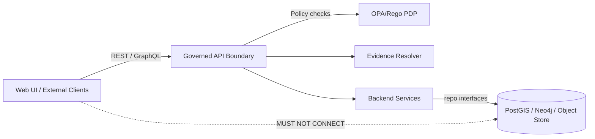

# Contract Tests (KFM)


Contract tests are KFM’s **boundary guards**. They prove that:

- Clients (UI, notebooks, partner apps) can rely on the **governed API contract**.
- The **trust membrane** is intact (external clients can’t reach storage directly).
- Every citation/evidence reference returned by the API is **resolvable** and **bounded**.
- **Backward compatibility** is preserved for `/api/v1/*`.

> [!IMPORTANT]
> Contract tests are **merge-blocking**.
>
> If a change breaks a published contract, the change must either:
> 1) be made backward compatible, or  
> 2) be released as a new major contract version (e.g., `/api/v2/*`) with migration notes.

---

## What “contract tests” mean in KFM

Contract tests validate **agreements at trust boundaries**, not internal behavior. The system’s *clean architecture + trust membrane* requires that callers never bypass governed interfaces.

### Included contract categories

| Category | What we verify | Why it matters |
|---|---|---|
| REST contract | OpenAPI is valid and **compatible with the baseline** | Prevent breaking changes to `/api/v1/*` |
| GraphQL contract (optional) | Schema is compatible with baseline; breaking changes blocked | Prevent client breakage from schema drift |
| Consumer-driven contracts | Consumer expectations (UI, SDK, notebooks) hold against provider | Align product evolution with real consumers |
| Evidence resolver | Citations resolve to evidence in bounded calls | “Cite” must remain auditable |
| Trust membrane | UI/clients cannot connect to DB/object store directly | Enforces architecture invariants |

### Not included here

- Pure unit tests for domain logic (`tests/unit/`)
- Pipeline regression/golden datasets (`tests/regression/`, `tests/pipeline/`)
- Full end-to-end UI flows (`tests/e2e/`)
- Policy unit tests (`tests/policy/`) — *OPA/Rego unit tests belong there*

---

## Directory layout

> [!NOTE]
> This is the **intended** contract test layout. Keep it stable to preserve CI + developer muscle memory.

```text
tests/
  contract/
    README.md

    openapi/
      baseline/              # checked-in "golden" OpenAPI snapshots (e.g., openapi.v1.json)
      diff/                  # diff configs + CI reports/artifacts
      cases/                 # request/response fixtures for behavior-level contracts

    graphql/                 # (optional) GraphQL contracts
      baseline/              # schema SDL snapshots
      operations/            # persisted operations + expected shapes

    consumers/               # consumer-driven contracts
      ui/                    # UI contract suite (routes, required fields, errors)
      notebooks/             # analysis notebooks / SDK contracts

    evidence_resolver/
      fixtures/              # sample citation refs (safe + non-sensitive)
      cases/                 # resolution expectations + hop constraints

    trust_membrane/
      cases/                 # network isolation checks / negative tests

    scripts/
      fetch_openapi.sh
      fetch_graphql_schema.sh
      update_baselines.sh
      run_contracts.sh

    config/
      contract.env.example
```

---

## Running locally

### Prerequisites

- A running KFM API endpoint (local compose, dev cluster, or remote env)
- A test runner (pytest / node / etc — depends on repo implementation)
- **Read-only** test credentials if endpoints require auth

### Configure target endpoints

Contract tests treat the API as a black box. Point them at a base URL via env vars:

| Variable | Meaning | Example |
|---|---|---|
| `KFM_CONTRACT_BASE_URL` | REST base | `http://localhost:8000` |
| `KFM_CONTRACT_GRAPHQL_URL` | GraphQL endpoint (if enabled) | `http://localhost:8000/graphql` |
| `KFM_CONTRACT_EVIDENCE_URL` | Evidence resolver root | `http://localhost:8000/evidence` |
| `KFM_CONTRACT_AUTH_TOKEN` | Optional bearer token | `…` |

> [!WARNING]
> Contract test credentials must be **read-only**. Never use admin/service-owner keys in CI.

### Run the suite

<details>
<summary>Option A — Makefile (recommended if present)</summary>

```bash
make test-contract
```
</details>

<details>
<summary>Option B — Python/pytest</summary>

```bash
pytest -m contract
```
</details>

<details>
<summary>Option C — Node (Jest/Mocha)</summary>

```bash
npm run test:contract
```
</details>

---

## OpenAPI / GraphQL baseline strategy

Baselines detect **breaking changes**.

- **REST:** check in an OpenAPI snapshot for `/api/v1/*`
- **GraphQL (optional):** check in an SDL snapshot

### What counts as “breaking” (examples)

- Removing a field
- Changing a field type
- Making an optional field required
- Changing enum values in a way that breaks consumers
- Changing error semantics (status codes / error schema) that consumers rely on

### Updating baselines

> [!IMPORTANT]
> Only update baselines for changes that are backward compatible **within the same major contract**.
> Breaking changes must go to `/api/v2/*` (or a major GraphQL schema bump).

<details>
<summary>Baseline update workflow</summary>

1. Generate the new spec(s) from a running API.
2. Run a compatibility diff against the previous baseline.
3. If the diff is **backward compatible**, commit the baseline update and keep `/api/v1/*`.
4. If the diff is **breaking**, introduce `/api/v2/*` and add migration notes.

```bash
# Example script entrypoint (adjust to your repo)
./tests/contract/scripts/update_baselines.sh
```
</details>

---

## Adding a new contract test

Checklist:

- [ ] Identify the boundary you are protecting (REST, GraphQL, evidence, trust membrane).
- [ ] Add/extend fixtures under the relevant folder.
- [ ] Write the test case with a failure message that names the violated **contract clause**.
- [ ] If a contract changed, update the baseline *only if backward compatible*.
- [ ] Ensure fixtures are safe (no restricted site coordinates; no private PII).
- [ ] Ensure it runs in CI and remains merge-blocking.

---

## Required contract clauses

These are KFM **platform invariants**.

### 1) API versioning compatibility

- `/api/v1/*` is frozen (breaking changes require `/api/v2/*`).
- Deprecations require documentation and timelines.

### 2) Trust membrane

- Frontend and external clients must not be able to connect to:
  - PostGIS / Neo4j
  - object store internal endpoints
- All access must traverse the governed API boundary.

### 3) Evidence resolver (bounded + auditable)

- Every citation reference returned by the API must resolve to evidence that is:
  - human-readable, and
  - reachable in a bounded number of calls (**≤ 2 hops is the target**)
- Resolvability regressions fail the build.

### 4) Policy obligations are explicit

When policy modifies or denies an output (redaction/generalization/deny), the API must return:

- an explicit policy outcome, and
- enough metadata to explain “why” **without leaking restricted info**

---

## CI integration

Recommended CI behavior:

- Contract suite runs on every PR.
- Contract failures are **required status checks**.
- Baseline updates require code-owner review (governance).

Example job matrix (illustrative):

| Job | When | Purpose |
|---|---|---|
| `contract-openapi-diff` | PR | Block breaking API changes |
| `contract-consumer-ui` | PR | Ensure UI expectations remain valid |
| `contract-evidence-resolver` | PR | Ensure citations always resolve |
| `contract-trust-membrane` | PR | Enforce network isolation |

---

## Architecture picture (what contracts protect)



---

## Troubleshooting

- **OpenAPI diff fails:** likely a breaking change (removed field, changed type, tightened requirement).
- **Evidence resolver fails:** citation schemes drifted or artifacts were not published/promoted.
- **Trust membrane fails:** networking config exposes DB ports to the wrong network(s).

---

## Governance notes

> [!WARNING]
> Contract fixtures must never include sensitive locations or restricted cultural knowledge.
>
> Prefer:
> - synthetic geometries, or
> - generalized bounding boxes, or
> - “redaction works” fixtures that prove masking/generalization is enforced.

---

## Ownership

- **Platform engineering** owns the harness + CI wiring.
- **Governance/stewardship** owns the invariants and reviews baseline-breaking changes.