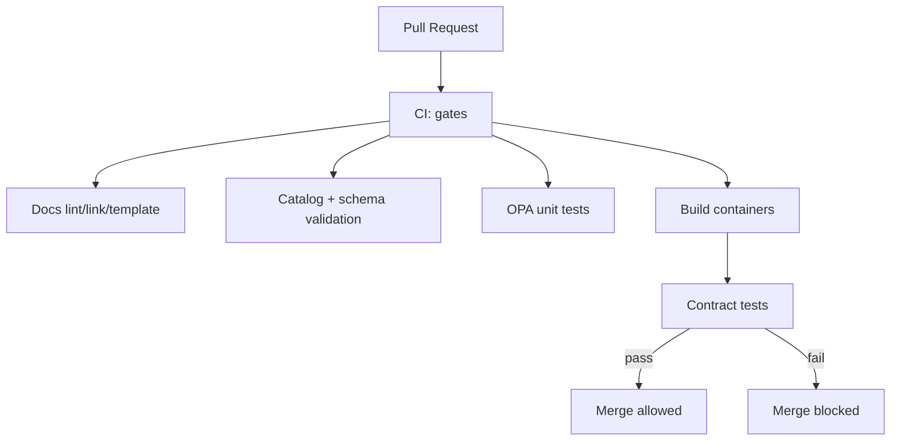

# KFM Contract Tests (`tests/contract/`)


Contract tests are **merge-blocking** verification that KFM’s **governed contracts** remain true as code changes. In KFM, “contracts” are not just API shapes—they include **policy behavior**, **evidence resolution**, and **cite-or-abstain** rules that sit at the trust membrane.

---

## Table of Contents

- [What These Tests Guarantee](#what-these-tests-guarantee)
- [What Counts as a Contract](#what-counts-as-a-contract)
- [Directory Layout](#directory-layout)
- [Prerequisites](#prerequisites)
- [Quickstart](#quickstart)
- [Running Contract Tests](#running-contract-tests)
  - [Against a Running Stack](#against-a-running-stack)
  - [Hermetic Mode](#hermetic-mode)
- [Adding or Updating Contract Tests](#adding-or-updating-contract-tests)
- [CI Integration](#ci-integration)
- [Troubleshooting](#troubleshooting)
- [Definition of Done](#definition-of-done)
- [Governance and Safety Notes](#governance-and-safety-notes)
- [Glossary](#glossary)

---

## What These Tests Guarantee

These tests exist to enforce the platform invariants:

1. **Contract-first API stability**
   - `/api/v1` is treated as a **compatibility boundary**.
   - Any change to request/response shapes must be reflected in the **OpenAPI contract** and must not introduce breaking changes unless explicitly versioned.

2. **Trust membrane behavior**
   - The API enforces authorization and governance **centrally** (policy is not “advisory”).
   - Clients (including the web UI) are expected to access data only through the governed API boundary.

3. **Policy is fail-closed**
   - “Default deny” is non-negotiable.
   - If required evidence, entitlements, or governance fields are missing, behavior must be denial/abstention—not partial success.

4. **Evidence is resolvable**
   - Citations produced by Focus Mode and Story Nodes must be resolvable through an evidence resolver endpoint or evidence view (no “dead” citations).

5. **Focus Mode cite-or-abstain**
   - If the system cannot produce evidence-backed citations, it must return an abstention (or an explicitly empty-evidence response that is treated as non-assertive).

---

## What Counts as a Contract

| Contract Type | What It Protects | Examples of Assertions |
|---|---|---|
| **OpenAPI contract** | Endpoint shapes, status codes, schemas | `/api/v1/*` responses match schema; no undocumented breaking changes |
| **Schema contracts** | Structured artifacts used in the system | JSON Schemas for receipts/manifests; Story Node metadata; citation objects |
| **Policy contracts (OPA/Rego)** | Authorization + output governance | Default deny; role-based access; “cite-or-abstain” enforcement |
| **Evidence resolution contract** | Citation resolvability | Every `citation.ref` resolves; locators are valid and stable |
| **Compatibility contract** | Versioning rules | `/api/v1` stability; `/api/v2` for breaking changes |

---

## Directory Layout

> This directory is intentionally split by contract surface (API, policy, schemas, evidence), not by implementation language. Contract tests should remain readable and auditable by governance reviewers.

Recommended structure:

```text
tests/contract/                                     # Contract tests: compatibility + schemas + policy + Focus/Evidence guarantees
├─ README.md                                        # How to run, required services, and what breaks builds (fail-closed)
│
├─ openapi/                                         # OpenAPI spec quality + compatibility guarantees
│  ├─ test_openapi_lint.py                           # Lint/spec hygiene (naming, required fields, descriptions, tags)
│  ├─ test_openapi_compat.py                         # Backward-compat checks (breaking change detection)
│  └─ test_endpoints_conformance.py                  # Endpoint behavior matches OpenAPI (status codes, shapes, headers)
│
├─ policy/                                          # Policy-as-contract (roles/scopes/default-deny at the API boundary)
│  ├─ test_policy_default_deny.py                    # Unknown/insufficient context must deny (no implicit allows)
│  ├─ test_policy_roles_scopes.py                    # Claims → roles/scopes mapping + enforcement expectations
│  └─ fixtures/                                     # Claims fixtures (synthetic; no secrets)
│     ├─ claims_public.json                          # Public/anonymous-ish claims (least privilege)
│     ├─ claims_reviewer.json                        # Reviewer claims (elevated but bounded)
│     └─ claims_denied.json                          # Explicitly denied claims (blocked paths)
│
├─ focus_mode/                                      # Focus Mode response contract (shape + governance fields)
│  ├─ test_cite_or_abstain.py                        # Must cite sources or abstain with reasons (no “free answers”)
│  ├─ test_audit_ref_present.py                      # Audit reference required (traceability for every answer)
│  └─ gold/                                         # Gold-set questions + expected outcomes (regression baseline)
│     ├─ questions.json                              # Canonical prompts/queries for contract runs
│     └─ expected_outcomes.json                      # Expected behavior class (cite/abstain/deny) + key fields
│
├─ evidence/                                        # Evidence resolution contract (citations → resolvable artifacts)
│  ├─ test_citation_resolves.py                      # Every citation must resolve (or fail with governed error shape)
│  └─ fixtures/
│     └─ citations.json                              # Canonical citation objects (formats + edge cases)
│
├─ schemas/                                         # Schema contracts (JSONSchema/YAML validation for governed artifacts)
│  ├─ test_jsonschema_validation.py                  # Valid/invalid fixture validation (and error message quality)
│  └─ fixtures/
│     ├─ run_manifest.valid.json                     # Passes schema
│     ├─ run_manifest.invalid.json                   # Fails schema (known error cases)
│     └─ story_node_meta.valid.yml                   # Valid story node metadata (YAML frontmatter contract)
│
└─ utils/                                           # Shared contract-test utilities (keep deterministic; no hidden retries)
   ├─ http_client.py                                 # Minimal client w/ normalized headers, timeouts, trace IDs
   ├─ openapi_loader.py                               # Loads/normalizes OpenAPI spec for tests (stable ordering)
   └─ assertions.py                                   # Contract assertions (shape checks, diff-friendly failures)
```

If the repo already has a different layout, keep the **same conceptual partitioning** even if filenames differ.

---

## Prerequisites

Contract tests are easiest when run against the **local compose stack**.

### Required
- Docker + Docker Compose
- A working local KFM stack that exposes:
  - API at `http://localhost:8000`
  - API docs at `http://localhost:8000/docs`

### Optional (used by some contract suites)
- `opa` (for policy unit tests)
- `conftest` (OPA/Rego test runner)
- A JSON Schema validator toolchain (language-specific)

---

## Quickstart

1. Start the local stack:
   ```bash
   cp .env.example .env
   docker compose up --build
   ```

2. Confirm the API is reachable:
   ```bash
   curl -sSf http://localhost:8000/health || true
   # If no /health exists, use:
   curl -sSf http://localhost:8000/docs >/dev/null
   ```

3. Run contract tests:
   - If your repo uses **pytest**:
     ```bash
     python -m pytest tests/contract -q
     ```
   - If your repo uses a **Makefile**:
     ```bash
     make test-contract
     ```

---

## Running Contract Tests

### Against a Running Stack

Set these environment variables as needed:

| Variable | Default | Meaning |
|---|---:|---|
| `KFM_API_BASE_URL` | `http://localhost:8000` | Base URL for the governed API |
| `KFM_OPENAPI_SPEC` | *(repo-defined)* | Path/URL to OpenAPI spec (local file or endpoint) |
| `KFM_POLICY_BASE_URL` | *(repo-defined)* | Optional: policy decision endpoint if tested via API |
| `KFM_TEST_ROLE` | `public` | Convenience selector for claim fixtures |

Example:
```bash
export KFM_API_BASE_URL="http://localhost:8000"
python -m pytest tests/contract -q
```

### Hermetic Mode

Hermetic mode is recommended for CI when possible:
- Do not depend on external network access.
- Use fixed fixtures and deterministic clocks.
- Prefer spinning up services locally (containers) or running handlers in-process.

If you cannot run fully hermetic, do **bounded integration**:
- Local containers only (PostGIS/Neo4j/OPA if required).
- Known fixtures.
- No calls to real upstream providers.

---

## Adding or Updating Contract Tests

### When to add a contract test

Add a contract test whenever you:
- Introduce a new `/api/v1` endpoint or change its schema.
- Change policy logic (authorization, dataset/story access, cite-or-abstain rules).
- Change citation formats, evidence locators, or evidence resolver behavior.
- Add/modify schemas for receipts/manifests/catalog outputs relied upon for promotion.

### How to write a good contract test

A contract test should:
- Be **small** and **deterministic**
- Assert on **observable behavior** (HTTP codes, schema conformance, policy decisions)
- Produce actionable failure messages:
  - “Expected 403 (default deny) but got 200”
  - “Response missing `audit_ref`”
  - “Citation ref failed to resolve via evidence endpoint”

### Golden-set tests (Focus Mode)

Focus Mode tests should use a “gold set”:
- Inputs: question + view context
- Expected: either
  - (a) citations present and resolvable, **or**
  - (b) explicit abstention behavior

Golden sets must not depend on changing external data.

---

## CI Integration

Contract tests should run in CI as **merge-blocking gates**, typically after:
- docs validation
- catalog/schema validation
- policy unit tests
- build

A typical flow:



Minimum CI expectation:
- Contract tests must run on every PR that changes:
  - `src/server/**` (API surface)
  - `policy/**` (OPA/Rego)
  - `schemas/**` (schema contracts)
  - `docs/**` if citations/evidence resolver is impacted

---

## Troubleshooting

### “API not reachable”
- Ensure the compose stack is running:
  ```bash
  docker compose ps
  ```
- Check API docs:
  ```bash
  curl -sSf http://localhost:8000/docs >/dev/null
  ```

### “OpenAPI mismatch”
- You changed implementation behavior without updating the OpenAPI contract.
- Or you updated OpenAPI but broke compatibility on `/api/v1`.

Fix by:
- Updating the OpenAPI spec, or
- Reverting breaking behavior, or
- Introducing `/api/v2` for breaking changes and keeping `/api/v1` stable.

### “Policy denies unexpectedly”
- Confirm you’re using the intended claim fixture.
- Ensure policy defaults remain deny-by-default.
- Check that the request includes required evidence/citations when the endpoint demands it.

### “Citation does not resolve”
- Verify the evidence resolver endpoint exists and is wired.
- Verify citation object fields match the resolver’s accepted format.
- Ensure fixtures point to known evidence bundles in test data.

---

## Definition of Done

A change affecting contracts is “done” only when:

- [ ] OpenAPI is updated (if API surface changed)
- [ ] Contract tests cover the change (new test or updated expected behavior)
- [ ] `/api/v1` compatibility is preserved (or `/api/v2` is used for breaking changes)
- [ ] Policy behavior is verified (default deny remains true)
- [ ] Focus Mode behavior is verified (cite-or-abstain; `audit_ref` present)
- [ ] Evidence references are resolvable in tests
- [ ] Tests run locally and in CI

---

## Governance and Safety Notes

- **Do not run contract tests against production.**
- Keep fixtures free of secrets and sensitive data.
- If a test requires sensitive geometry (e.g., protected sites), use generalized/redacted fixtures.
- Treat contract changes as governed changes: they require review and must remain auditable.

---

## Glossary

- **Contract test**: A test that verifies an external-facing interface/behavior (API/schema/policy) remains stable and correct.
- **Trust membrane**: The enforced boundary where governance is applied (API gateway + policy checks).
- **Fail-closed**: If evidence/policy/metadata is missing, the system denies or abstains (never “best-effort publish”).
- **Cite-or-abstain**: Focus Mode must provide evidence-backed citations or explicitly abstain from factual claims.
- **Evidence resolver**: A mechanism to turn a citation reference into a retrievable evidence view/snippet and provenance context.

