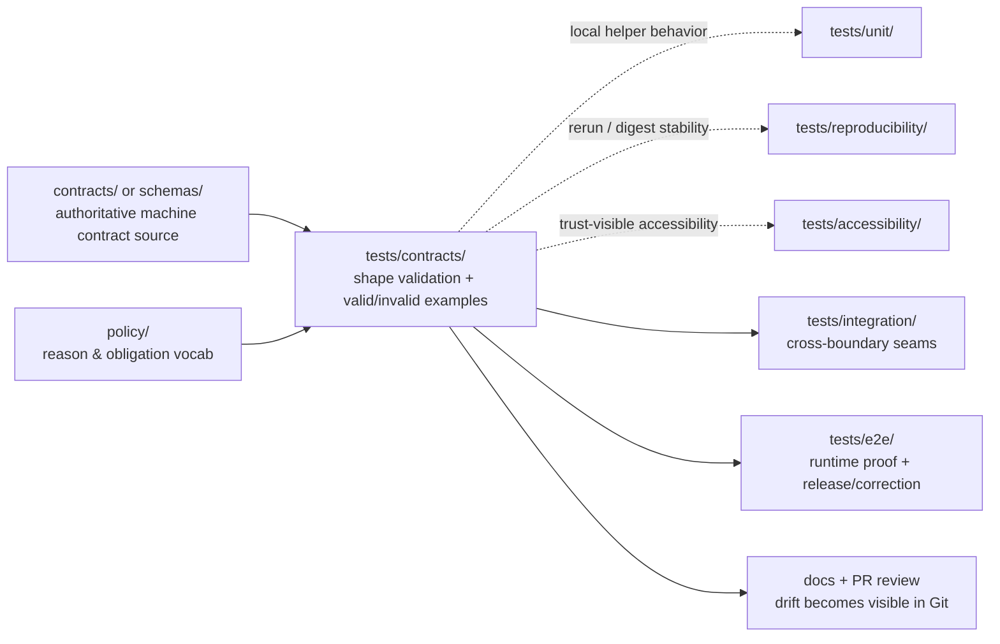

<!-- [KFM_META_BLOCK_V2]
doc_id: kfm://doc/<TODO-uuid>
title: contracts
type: standard
version: v1
status: draft
owners: @bartytime4life
created: <TODO: verify YYYY-MM-DD>
updated: 2026-04-04
policy_label: public
related: [tests/README.md, tests/accessibility/README.md, tests/e2e/README.md, tests/integration/README.md, tests/policy/README.md, tests/reproducibility/README.md, tests/unit/README.md, contracts/README.md, schemas/README.md, policy/README.md, .github/workflows/README.md, .github/PULL_REQUEST_TEMPLATE.md, .github/CODEOWNERS]
tags: [kfm, tests, contracts, verification, schema-drift, fail-closed]
notes: [doc_id and created date need verification; updated date reflects this draft revision; current public main shows README-only inventory for this directory]
[/KFM_META_BLOCK_V2] -->

# contracts

Contract-facing verification family for KFM schema drift, valid/invalid example packs, and fail-closed object validation.

> **Status:** experimental  
> **Owners:** `@bartytime4life`  
> **Path:** `tests/contracts/README.md`  
> **Repo fit:** downstream of [`../README.md`](../README.md), [`../../contracts/README.md`](../../contracts/README.md), [`../../schemas/README.md`](../../schemas/README.md), [`../../policy/README.md`](../../policy/README.md), [`../../.github/workflows/README.md`](../../.github/workflows/README.md), [`../../.github/PULL_REQUEST_TEMPLATE.md`](../../.github/PULL_REQUEST_TEMPLATE.md), and [`../../.github/CODEOWNERS`](../../.github/CODEOWNERS); lateral to [`../policy/`](../policy/), [`../integration/`](../integration/), [`../reproducibility/`](../reproducibility/), [`../accessibility/`](../accessibility/), and [`../e2e/`](../e2e/); upstream of future executable cases under `tests/contracts/**` and any escalation into [`../integration/`](../integration/) or [`../e2e/`](../e2e/).  
> **Quick jump:** [Scope](#scope) · [Repo fit](#repo-fit) · [Current verified snapshot](#current-verified-snapshot) · [Accepted inputs](#accepted-inputs) · [Exclusions](#exclusions) · [Directory tree](#directory-tree) · [Quickstart](#quickstart) · [Usage](#usage) · [Diagram](#diagram) · [Tables](#tables) · [Task list / definition of done](#task-list--definition-of-done) · [FAQ](#faq) · [Appendix](#appendix)  
>
> 
> 
> 
> 
> 
> 
> 

> [!IMPORTANT]
> The parent [`tests/README.md`](../README.md) keeps `contracts/` as a first-class repo family in the public `tests/` tree. This README follows that repo-visible plural path and keeps the directory narrow on purpose: verify machine-readable contract truth here, and escalate broader seams elsewhere.

> [!CAUTION]
> Current public evidence confirms a **directory boundary and README surface**, not a mounted executable contract harness. Treat validator entrypoints, fixture packs, shared helpers, and merge-blocking workflow claims below as **PROPOSED** or **NEEDS VERIFICATION** unless the checked-out branch proves them directly.

---

## Scope

`tests/contracts/` is the contract-facing verification family inside KFM’s governed `tests/` surface.

In KFM terms, this is one of the smallest places where the inspectable-claim doctrine becomes executable. If a trust-bearing object cannot survive contract validation here, later integration, runtime, release, and UI surfaces should not be allowed to smooth over that failure.

Its job is specific: prove that trust-bearing objects are shaped correctly, reject invalid states deterministically, and fail closed when required evidence, policy, or correction fields are missing. This family should help the repo answer a harder question than “did the test pass?”:

- did the contract fail loudly instead of drifting silently?
- did an invalid object stay invalid instead of being normalized into something plausible?
- did negative states remain explicit instead of being flattened into “success”?
- did downstream lanes inherit stable assumptions instead of wishful ones?

### Working role

`tests/contracts/` is the natural home for shape validation and example-pack truth for contract families such as:

- `SourceDescriptor`
- `IngestReceipt`
- `ValidationReport`
- `DatasetVersion`
- `CatalogClosure`
- `DecisionEnvelope`
- `ReviewRecord`
- `ReleaseManifest` / `ReleaseProofPack`
- `ProjectionBuildReceipt`
- `EvidenceBundle`
- `RuntimeResponseEnvelope`
- `CorrectionNotice`

### Status vocabulary used here

| Label | Meaning here |
| --- | --- |
| **CONFIRMED** | Directly visible in the current public repo tree or in adjacent repo documentation |
| **INFERRED** | Conservative interpretation that bridges confirmed repo evidence and repeated KFM doctrine without asserting mounted implementation |
| **PROPOSED** | Strong repo- and doctrine-aligned starter shape not yet verified as mounted implementation |
| **UNKNOWN** | Not proven from current public repo evidence |
| **NEEDS VERIFICATION** | A detail that should be checked against the active checkout, runner, or platform settings before merge |

### What this family should prove

- required fields exist
- invalid shapes are rejected
- contract examples stay synchronized with canonical docs
- negative outcomes remain first-class rather than being silently normalized away
- contract drift is caught before integration, UI, runtime, or release layers build on it

### What this family should **not** try to prove alone

- cross-service wiring
- end-to-end publication or release assembly
- UI trust-state rendering
- policy bundle semantics beyond contract-facing fixtures
- digest stability or rerun reproducibility as a primary burden
- accessibility behavior such as keyboard, motion, or non-color-only trust cues
- geospatial correctness beyond object-shape expectations

For those, escalate into [`../integration/`](../integration/), [`../policy/`](../policy/), [`../reproducibility/`](../reproducibility/), [`../accessibility/`](../accessibility/), or [`../e2e/`](../e2e/).

[Back to top](#contracts)

---

## Repo fit

### Upstream authorities this family should stay aligned with

| Upstream surface | Why it matters here | Current visible posture |
| --- | --- | --- |
| [`../README.md`](../README.md) | Defines `tests/` as a governed verification surface and keeps `contracts/` visible as its own family | Experimental directory index for verification families |
| [`../../contracts/README.md`](../../contracts/README.md) | Current contract doctrine, trust-object list, and first-wave starter pressure | Draft doc surface; schema authority still marked unresolved |
| [`../../schemas/README.md`](../../schemas/README.md) | Prevents parallel schema universes and keeps schema-home ambiguity visible | README-only lane; schema home pending |
| [`../../policy/README.md`](../../policy/README.md) | Keeps deny-by-default posture, reasons/obligations, and finite outcomes close to contract verification | Experimental; OPA/Rego described as a starter direction |
| [`../../.github/workflows/README.md`](../../.github/workflows/README.md) | Documents the automation lane and warns against treating historical workflow activity as current checked-in inventory | Experimental; public `main` inventory is README-only |
| [`../../.github/PULL_REQUEST_TEMPLATE.md`](../../.github/PULL_REQUEST_TEMPLATE.md) | Pull requests already require honest truth labels and evidence / proof links | Review template expects visible proof, not polished overclaiming |
| [`../../.github/CODEOWNERS`](../../.github/CODEOWNERS) | Keeps current owner and review boundary explicit | `/tests/` currently falls under `@bartytime4life` |

### Lateral family boundaries

Use sibling test families rather than stretching this README beyond its burden:

- [`../unit/`](../unit/) for deterministic local helpers and pure local behavior
- [`../policy/`](../policy/) for policy grammar and deny-by-default behavior checks
- [`../integration/`](../integration/) for cross-boundary governed slices
- [`../reproducibility/`](../reproducibility/) for rerun consistency, digest stability, and receipt-backed rebuild checks
- [`../accessibility/`](../accessibility/) for trust-visible shell operability
- [`../e2e/`](../e2e/) for full runtime, release, and correction proof

### Downstream consequences

If this directory stays weak, later lanes become easier to bluff:

- integration tests inherit unstable payload assumptions
- policy tests drift into free text because example packs are missing
- e2e cases can “pass” on objects that should have failed earlier
- docs imply a contract system that the repo does not yet enforce
- runtime or UI surfaces risk sounding confident on unverified payload shapes

### Path reconciliation note

The repo currently exposes both [`../../contracts/`](../../contracts/) and [`../../schemas/`](../../schemas/). This README should not try to settle that authority dispute on its own. Until the repo makes one schema home singular, `tests/contracts/` should consume whichever contract source is declared canonical and avoid becoming a second authority surface.

[Back to top](#contracts)

---

## Current verified snapshot

| Item | Status | Why it matters |
| --- | --- | --- |
| `tests/contracts/` exists as its own repo-visible family | **CONFIRMED** | Keep the family visible instead of folding it into generic tests prose |
| The current public directory listing shows `README.md` only inside `tests/contracts/` | **CONFIRMED** | README presence is not proof of executable suite depth |
| The parent `tests/` tree currently exposes `accessibility/`, `contracts/`, `e2e/`, `integration/`, `policy/`, `reproducibility/`, and `unit/` | **CONFIRMED** | Use the actual sibling-family boundaries already visible on `main` |
| `.github/workflows/` is documentation-visible but README-only on current public `main` | **CONFIRMED** | Do not assume merge-blocking contract automation from current tree alone |
| `contracts/` and `schemas/` both exist as top-level documentation surfaces | **CONFIRMED** | Schema-home authority still needs a single explicit owner |
| Exact validator command, fixture inventory, local runner, required checks, branch protections, and rulesets | **NEEDS VERIFICATION** | These cannot be derived from public directory listings alone |

> [!NOTE]
> Public Actions history can be useful reconstruction signal, but it is not the same thing as current checked-in workflow inventory. Use present directory listings for current-tree truth.

[Back to top](#contracts)

---

## Accepted inputs

This directory should accept only materials that help verify contract truth.

### Belongs here

- valid JSON examples for trust-bearing object families
- invalid JSON examples that prove fail-closed behavior
- contract-specific validator entrypoints
- schema-to-example conformance tests
- fixture manifests or discovery manifests for contract waves
- regression cases for negative states such as `deny`, `abstain`, `stale-visible`, `generalized`, `superseded`, or `withdrawn`
- minimal helper utilities used only to load, normalize, or validate contract fixtures
- local documentation that makes a contract case reviewable without inventing new authority

### Usually belongs nearby, not here

- policy bundle rule tests → [`../policy/`](../policy/)
- cross-component orchestration → [`../integration/`](../integration/)
- runtime proof traces and correction drills → [`../e2e/`](../e2e/)
- rerun consistency, `spec_hash` stability, and receipt comparison → [`../reproducibility/`](../reproducibility/)
- accessibility-critical trust-surface cases → [`../accessibility/`](../accessibility/)
- canonical schema definitions → likely [`../../contracts/`](../../contracts/) or [`../../schemas/`](../../schemas/), depending on future repo decision
- runbooks, ADRs, and long-form guidance → `docs/**`

---

## Exclusions

This directory should stay strict but small.

| Excluded from `tests/contracts/` | Put it here instead |
| --- | --- |
| Pure helper or local-function checks | [`../unit/`](../unit/) |
| Policy allow/deny reasoning beyond fixture compatibility | [`../policy/`](../policy/) |
| Reproducibility or digest-stability checks | [`../reproducibility/`](../reproducibility/) |
| Keyboard, screen-reader, reduced-motion, or non-color-only trust cues | [`../accessibility/`](../accessibility/) |
| Cross-service or cross-adapter seams | [`../integration/`](../integration/) |
| Full runtime/public-route, release-proof, or correction-visible sweeps | [`../e2e/`](../e2e/) |
| Database migration tests | package- or service-local test lanes |
| Geospatial CRS / topology / raster QA | geospatial validation suites or broader integration/e2e lanes |
| Canonical schema files, policy bundles, or route contracts as primary records | Their owning repo surfaces |
| Narrative examples that are only documentation | [`../../contracts/README.md`](../../contracts/README.md) or `docs/**` |

> [!IMPORTANT]
> A contract-facing test family should be **strict but small**. The goal is to catch structural dishonesty early, not to absorb every other verification concern in the repo.

[Back to top](#contracts)

---

## Directory tree

### Current public `main` snapshot

```text
tests/
├── README.md
├── accessibility/
├── contracts/
│   └── README.md
├── e2e/
│   ├── README.md
│   ├── correction/
│   ├── release_assembly/
│   └── runtime_proof/
├── integration/
├── policy/
├── reproducibility/
└── unit/
```

### PROPOSED maturity shape for this directory

```text
tests/contracts/
├── README.md
├── cases/
│   ├── wave-01-core/
│   │   ├── source-descriptor/
│   │   ├── dataset-version/
│   │   ├── decision-envelope/
│   │   ├── release-manifest/
│   │   ├── evidence-bundle/
│   │   ├── runtime-response-envelope/
│   │   └── correction-notice/
│   └── wave-02-intake-and-review/
│       ├── ingest-receipt/
│       ├── validation-report/
│       ├── catalog-closure/
│       └── review-record/
├── helpers/
│   ├── __init__.py
│   ├── load_case.py
│   └── normalize_json.py
├── validators/
│   ├── jsonschema_runner.py
│   └── manifest.py
└── reports/
    └── .gitkeep
```

### PROPOSED companion fixture shape elsewhere

```text
tests/fixtures/contracts/
└── v1/
    ├── valid/
    └── invalid/
```

That split keeps `tests/contracts/` focused on **tests and runners**, while a larger shared fixture corpus can later serve policy, integration, reproducibility, and e2e lanes without duplicating contract authority.

[Back to top](#contracts)

---

## Quickstart

### Safe inspection commands

```bash
# inspect the family exactly as the checked-out branch exposes it
find tests/contracts -maxdepth 4 -type f | sort

# inspect sibling test-family docs to keep placement honest
sed -n '1,220p' tests/README.md
sed -n '1,220p' tests/accessibility/README.md
sed -n '1,220p' tests/e2e/README.md
sed -n '1,220p' tests/integration/README.md
sed -n '1,220p' tests/policy/README.md
sed -n '1,220p' tests/reproducibility/README.md
sed -n '1,220p' tests/unit/README.md

# inspect adjacent contract / policy / workflow doctrine
sed -n '1,260p' contracts/README.md
sed -n '1,220p' schemas/README.md
sed -n '1,220p' policy/README.md
sed -n '1,220p' .github/workflows/README.md
sed -n '1,220p' .github/PULL_REQUEST_TEMPLATE.md
```

### Fast drift check

Use this before inventing new names or object families:

```bash
grep -RIn \
  -e 'SourceDescriptor' \
  -e 'IngestReceipt' \
  -e 'ValidationReport' \
  -e 'DatasetVersion' \
  -e 'CatalogClosure' \
  -e 'DecisionEnvelope' \
  -e 'EvidenceBundle' \
  -e 'RuntimeResponseEnvelope' \
  -e 'CorrectionNotice' \
  -e 'ABSTAIN' \
  -e 'DENY' \
  -e 'ERROR' \
  tests contracts schemas policy docs .github 2>/dev/null || true
```

### PROPOSED future validator shape

The command below is illustrative only. It should **not** be treated as current repo behavior until a real validator entrypoint is checked in and referenced by the checked-out branch.

```bash
python -m jsonschema \
  --instance tests/fixtures/contracts/v1/valid/runtime_response_envelope.answer.valid.json \
  contracts/runtime_response_envelope.schema.json
```

### Workflow caution

> [!CAUTION]
> Do **not** assume that adding files under `tests/contracts/` automatically makes them merge-blocking. Current public evidence proves a workflow documentation lane, not a visible checked-in workflow YAML gate on `main`.

[Back to top](#contracts)

---

## Usage

### Placement rules

1. Put **shape validation** here.
2. Put **semantic policy decisions** in [`../policy/`](../policy/).
3. Put **service wiring** in [`../integration/`](../integration/).
4. Put **rerun / digest / receipt stability** in [`../reproducibility/`](../reproducibility/).
5. Put **trust-visible accessibility behavior** in [`../accessibility/`](../accessibility/).
6. Put **public-surface behavior**, **release proof**, and **correction flows** in [`../e2e/`](../e2e/).
7. Keep any helper code here **small, deterministic, and non-authoritative**.

### Naming guidance

Use case names that preserve family, polarity, and intent.

| Good example | Why it helps |
| --- | --- |
| `runtime_response_envelope.answer.valid.json` | family + outcome + polarity |
| `decision_envelope.missing_reason.invalid.json` | failure reason is obvious |
| `correction_notice.supersession.valid.json` | correction lineage remains visible |
| `evidence_bundle.partial_scope.invalid.json` | contract drift is reviewable in Git |

Avoid vague buckets such as `misc/`, `contract_v2/`, or `helpers_everything/`.

### First executable wave

Start with the families that show up repeatedly across the current contract-facing docs:

1. `DecisionEnvelope`
2. `EvidenceBundle`
3. `RuntimeResponseEnvelope`
4. `CorrectionNotice`
5. `ReleaseManifest`

Then expand into:

6. `SourceDescriptor`
7. `DatasetVersion`

Then, once schema-home authority is explicit:

8. `IngestReceipt`
9. `ValidationReport`
10. `CatalogClosure`
11. `ReviewRecord`
12. `ProjectionBuildReceipt`

### Failure philosophy

A KFM contract case should prefer:

- explicit rejection over permissive coercion
- named invalid examples over hidden assumptions
- visible negative states over flattened “success”
- one real wave over pseudo-complete scaffolding
- stable, reviewable examples over clever test magic

---

## Diagram



The key point is directional: `tests/contracts/` should **consume and verify** contract truth, not quietly become a second contract authority.

[Back to top](#contracts)

---

## Tables

### Family placement matrix

| If the work mainly tests… | Primary home | Why |
| --- | --- | --- |
| object shape and required fields | `tests/contracts/` | Keep machine-contract truth explicit and reviewable |
| policy result logic, reason codes, or obligation vocab | `tests/policy/` | Decision grammar should stay isolated when possible |
| pure local helper behavior | `tests/unit/` | Cheapest convincing proof wins |
| rerun consistency, `spec_hash` stability, or receipt comparison | `tests/reproducibility/` | Determinism is its own verification burden |
| keyboard / motion / screen-reader / non-color-only trust cues | `tests/accessibility/` | Accessibility is a first-class trust burden |
| route behavior across real boundaries | `tests/integration/` | This family exists for cross-boundary proof |
| full runtime/public behavior, release proof, or correction lineage | `tests/e2e/` | That burden is broader than one contract or integration slice |

### Candidate first cases

| Family | Why it belongs early | Minimum negative case |
| --- | --- | --- |
| `RuntimeResponseEnvelope` | Trust-bearing runtime object for `ANSWER` / `ABSTAIN` / `DENY` / `ERROR` | missing `result`, missing `audit_ref`, unsupported surface state |
| `EvidenceBundle` | Keeps evidence inspectable at point of use | missing lineage or rights/sensitivity state |
| `DecisionEnvelope` | Bridges policy posture into machine-readable outcomes | missing reason/obligation shape |
| `CorrectionNotice` | Preserves correction lineage | missing affected release or replacement linkage |
| `ReleaseManifest` | Binds outward release to proof and rollback posture | missing release refs or correction posture |

### Contract-family design rules

| Rule | Why it matters |
| --- | --- |
| One valid and one invalid example is the minimum unit of seriousness | prose-only doctrine drifts too easily |
| Invalid cases should be named by failure reason | Git review becomes faster and less ambiguous |
| Keep fixtures deterministic | contract tests should not depend on network or clock jitter |
| Prefer explicit schema-version fields | later migration is easier to audit |
| Preserve negative-state vocabulary | KFM trust posture depends on visible failure classes |
| Do not duplicate canonical schemas here | this family proves behavior; it does not own singular authority |

---

## Task list / definition of done

### First executable suite bootstrap

- [ ] Confirm whether an existing repo-wide runner, validator, or shared fixture convention already governs this family
- [ ] Confirm authoritative schema home between `contracts/` and `schemas/`
- [ ] Add one real wave before adding broad subtrees
- [ ] Create first-wave contract cases for the highest-leverage families
- [ ] Add paired valid / invalid examples
- [ ] Add one deterministic validator entrypoint
- [ ] Add one family-level manifest or discovery mechanism
- [ ] Wire the family into a real merge-blocking workflow
- [ ] Document how failures surface in PR review
- [ ] Cross-link fixture locations from [`../../contracts/README.md`](../../contracts/README.md)

### Definition of done

This family is meaningfully established when all of the following are true:

1. there is no schema-home ambiguity for executable contract files
2. at least one real wave of contract artifacts exists
3. each first-wave family has valid and invalid examples
4. validators run deterministically in local and CI contexts
5. failure output is readable enough for code review
6. adjacent docs stop describing the family as README-only intention
7. the PR can point to fixtures, proof of behavior, and proof of failure behavior
8. public `main` shows more than a scaffold README in this directory

### Review gates

Before accepting changes here, check:

- does this add verification, or just more wording?
- does it create duplicate authority with `contracts/` or `schemas/`?
- does it preserve fail-closed semantics?
- does it keep negative states explicit?
- does it stay narrow enough to remain reviewable?
- can the PR link validation evidence, proof packs, screenshots, or follow-up issues where they exist?

[Back to top](#contracts)

---

## FAQ

### Why is this directory named `contracts/`, not `contract/`?

Because the current repo-visible path is `tests/contracts/`, and nearby repo docs already reference that family. This README stays faithful to the mounted public tree instead of normalizing it to a different shorthand.

### Why not store canonical schemas directly under `tests/contracts/`?

Because this family should verify contract truth, not quietly replace it. Until the repo explicitly chooses the authoritative schema home, duplicating schemas here increases drift risk.

### Why are valid/invalid fixtures emphasized so heavily?

Because fail-closed behavior and visible negative outcomes are treated throughout the current contract-facing docs as trust requirements, not edge cases. Contract examples are the smallest executable proof of that posture.

### Should reproducibility cases live here?

Not as a primary burden. A contract case may participate in a broader rerun proof, but digest stability, receipt comparison, and bounded-drift reruns belong first in [`../reproducibility/`](../reproducibility/).

### Why is so much marked PROPOSED or NEEDS VERIFICATION?

Because the current public branch shows a strong documentation pattern, but it still does not prove a publicly confirmed executable contract harness in this directory.

### Should API endpoint tests live here?

Not usually. Keep object-shape checks here; move route wiring and full runtime behavior into integration or e2e lanes.

---

## Appendix

<details>
<summary><strong>Evidence notes, contract lattice, and open checks</strong></summary>

### Evidence notes

This revision is grounded first in the current public repo surfaces that define this family and its neighbors:

- `tests/contracts/README.md`
- `tests/README.md`
- `tests/accessibility/README.md`
- `tests/e2e/README.md`
- `tests/integration/README.md`
- `tests/policy/README.md`
- `tests/reproducibility/README.md`
- `tests/unit/README.md`
- `contracts/README.md`
- `schemas/README.md`
- `policy/README.md`
- `.github/workflows/README.md`
- `.github/PULL_REQUEST_TEMPLATE.md`
- `.github/CODEOWNERS`

The file keeps current public-tree facts separate from doctrine-aligned starter shape. It does **not** imply runnable CI, live schema inventory, or real fixture inventory unless the current public tree proves those artifacts directly.

### Doctrinal contract lattice echoed here

The current contract-facing docs repeatedly center the following trust-bearing families:

- `SourceDescriptor`
- `IngestReceipt`
- `ValidationReport`
- `DatasetVersion`
- `CatalogClosure`
- `DecisionEnvelope`
- `ReviewRecord`
- `ReleaseManifest`
- `ReleaseProofPack`
- `ProjectionBuildReceipt`
- `EvidenceBundle`
- `RuntimeResponseEnvelope`
- `CorrectionNotice`

This directory should not attempt to implement all of them at once. It should grow in reversible waves.

### Open verification items

- Is `contracts/` or `schemas/` the singular authoritative machine-contract home?
- Are any `.schema.json` files already mounted elsewhere in the repo?
- Are valid/invalid fixture packs already present under another path?
- Is there a real validator script or package entrypoint not yet surfaced in docs?
- Are there checked-in workflow YAML files on the active working branch that do not appear on current public `main`?
- Does any existing thin slice already exercise contract validation indirectly?
- How should this family coordinate with `tests/reproducibility/` once receipt-backed rebuild checks become real?

</details>
