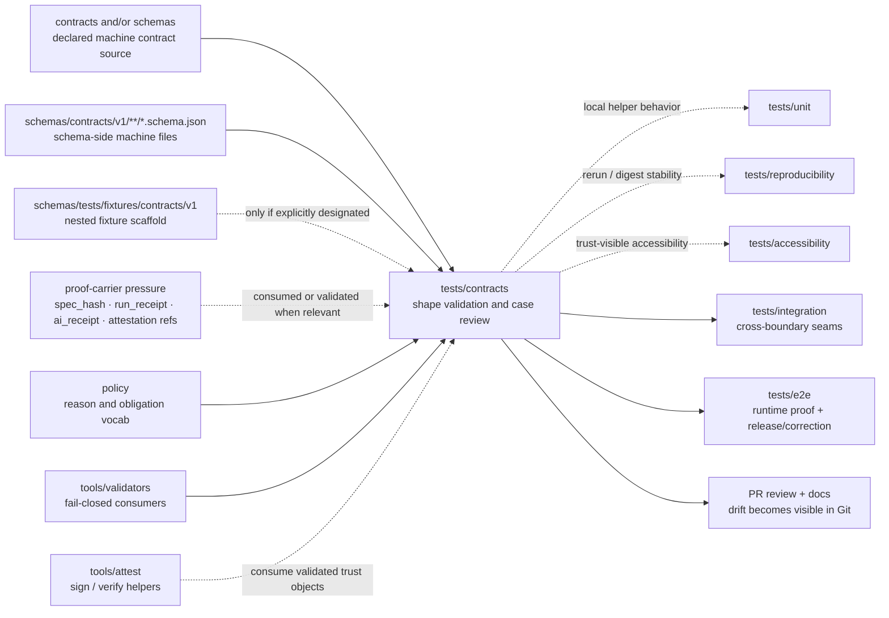

<!-- [KFM_META_BLOCK_V2]
doc_id: kfm://doc/<TODO-uuid>
title: tests/contracts
type: standard
version: v1
status: draft
owners: @bartytime4life
created: <TODO: verify YYYY-MM-DD>
updated: 2026-04-16
policy_label: public
related: [../README.md, ../accessibility/README.md, ../e2e/README.md, ../integration/README.md, ../policy/README.md, ../reproducibility/README.md, ../unit/README.md, ../../contracts/README.md, ../../schemas/README.md, ../../schemas/contracts/README.md, ../../schemas/contracts/v1/README.md, ../../schemas/tests/README.md, ../../policy/README.md, ../../data/receipts/README.md, ../../data/proofs/README.md, ../../tools/validators/README.md, ../../tools/validators/promotion_gate/README.md, ../../tools/attest/README.md, ../../docs/standards/README.md, ../../.github/workflows/README.md, ../../.github/watchers/README.md, ../../.github/PULL_REQUEST_TEMPLATE.md, ../../.github/CODEOWNERS]
tags: [kfm, tests, contracts, verification, schema-drift, fail-closed, receipts, proofs]
notes: [
  "doc_id and created date still need verification.",
  "This revision preserves the stronger contract-family draft while aligning it with newer workflow, watcher, receipt, validator, attestation, and promotion-gate lane doctrine.",
  "Current-session evidence remained document-rich rather than mounted-repo-rich, so executable depth, fixture inventory, and workflow claims still need direct branch verification before merge."
]
[/KFM_META_BLOCK_V2] -->

<a id="top"></a>

# `tests/contracts/`

Contract-facing verification family for KFM schema drift, valid/invalid example packs, and fail-closed object validation.

> [!NOTE]
> **Status:** `experimental`  
> **Owners:** `@bartytime4life`  
> **Path:** `tests/contracts/README.md`  
> 
> 
> 
> 
> 
> 
> 
>   
> **Quick jumps:** [Scope](#scope) · [Repo fit](#repo-fit) · [Current verified snapshot](#current-verified-snapshot) · [Accepted inputs](#accepted-inputs) · [Exclusions](#exclusions) · [Directory tree](#directory-tree) · [Quickstart](#quickstart) · [Usage](#usage) · [Diagram](#diagram) · [Reference tables](#reference-tables) · [Task list](#task-list--definition-of-done) · [FAQ](#faq) · [Appendix](#appendix)

> [!IMPORTANT]
> The parent [`tests/README.md`](../README.md) keeps `contracts/` as a first-class verification family.  
> This lane should stay narrow on purpose: verify machine-readable contract truth here, escalate broader seams elsewhere, and do not let this directory quietly become a second contract authority.

> [!TIP]
> Keep the KFM trust split visible here:
>
> **contract verification ≠ contract authority ≠ policy authority ≠ proof authority**
>
> - `tests/contracts/` proves shape and failure behavior  
> - `contracts/` and `schemas/contracts/` remain the authority-facing sources  
> - `policy/` remains the home for decision grammar and deny-by-default logic  
> - `data/receipts/` remains process memory  
> - `data/proofs/` and attestation flows remain higher-order trust surfaces

> [!CAUTION]
> Current-session evidence for this revision was document-rich, not mounted-repo-rich.  
> Keep validator entrypoints, fixture inventory, attestation helper usage, workflow gates, and merge-blocking claims at **PROPOSED**, **UNKNOWN**, or **NEEDS VERIFICATION** unless the checked-out branch proves them directly.

| Field | Value |
|---|---|
| Path | `tests/contracts/` |
| Role | Contract-facing verification for machine-readable object shape, invalid-state rejection, and fail-closed drift detection |
| Primary burden | Valid/invalid examples, schema conformance, and negative-state proof |
| Adjacent authority surfaces | `contracts/`, `schemas/contracts/`, `policy/` |
| Adjacent consumers | `tools/validators/`, `tools/attest/`, `tests/e2e/`, `tests/integration/` |
| Trust reminder | `verification ≠ authority ≠ policy ≠ proof` |

---

## Scope

`tests/contracts/` is the contract-facing verification family inside KFM’s governed `tests/` surface.

In KFM terms, this is one of the smallest places where the **inspectable-claim doctrine becomes executable**. If a trust-bearing object cannot survive contract validation here, later integration, runtime, release, validator, attestation, and UI surfaces should not be allowed to smooth over that failure.

Its job is specific:

- prove that trust-bearing objects are shaped correctly
- reject invalid states deterministically
- fail closed when required evidence, policy, receipt, or correction fields are missing

This family should help the repo answer a harder question than “did the test pass?”:

- did the contract fail loudly instead of drifting silently?
- did an invalid object stay invalid instead of being normalized into something plausible?
- did negative outcomes remain first-class rather than being flattened into “success”?
- did downstream lanes inherit stable assumptions instead of wishful ones?
- did receipt, proof, and envelope objects keep their distinct roles under test?

### Working role

`tests/contracts/` is the natural home for shape validation and example-pack truth for contract families such as:

- `SourceDescriptor`
- `IngestReceipt`
- `ValidationReport`
- `DatasetVersion`
- `CatalogClosure`
- `DecisionEnvelope`
- `ReviewRecord`
- `ReleaseManifest` / `ReleaseProofPack`
- `ProjectionBuildReceipt`
- `EvidenceBundle`
- `RuntimeResponseEnvelope`
- `CorrectionNotice`

Later adjacent docs also increase pressure on this family to account for cross-cutting proof carriers when they are contract-relevant:

- `run_receipt`
- `ai_receipt`
- attestation references
- bundle or proof linkage refs

### Status vocabulary used here

| Label | Meaning here |
|---|---|
| **CONFIRMED** | Directly visible in the current session’s attached docs or explicit repo-facing draft evidence |
| **INFERRED** | Conservative interpretation of visible structure or adjacent docs, but not a settled implementation fact |
| **PROPOSED** | Strong repo- and doctrine-aligned starter shape not yet verified as mounted implementation |
| **UNKNOWN** | Not proven strongly enough from current evidence |
| **NEEDS VERIFICATION** | Detail that should be checked against the active checkout, runner, or platform settings before merge |

### What this family should prove

- required fields exist
- invalid shapes are rejected
- contract examples stay synchronized with canonical docs
- negative outcomes remain first-class rather than being silently normalized away
- contract drift is caught before integration, validator, attestation, runtime, or release layers build on it
- receipt-, proof-, and envelope-carrying objects stay inspectable when they become relevant to validation or promotion-significant checks

### What this family should not try to prove alone

- cross-service wiring
- end-to-end publication or release assembly
- UI trust-state rendering
- policy bundle semantics beyond contract-facing fixtures
- digest stability or rerun reproducibility as a primary burden
- accessibility behavior such as keyboard, motion, or non-color-only trust cues
- geospatial correctness beyond object-shape expectations
- signing mechanics or attestation transport as a primary burden

For those, escalate into [`../integration/`](../integration/), [`../policy/`](../policy/), [`../reproducibility/`](../reproducibility/), [`../accessibility/`](../accessibility/), [`../e2e/`](../e2e/), [`../../tools/validators/README.md`](../../tools/validators/README.md), or [`../../tools/attest/README.md`](../../tools/attest/README.md).

[Back to top](#top)

---

## Repo fit

### Upstream authorities this family should stay aligned with

| Upstream surface | Why it matters here | Current visible posture |
|---|---|---|
| [`../README.md`](../README.md) | Defines `tests/` as a governed verification surface and keeps `contracts/` visible as its own family | Experimental directory index for verification families |
| [`../../contracts/README.md`](../../contracts/README.md) | Human-readable contract doctrine, trust-object list, and first-wave starter pressure | Draft doctrine surface; machine-home law still needs direct repo confirmation |
| [`../../schemas/README.md`](../../schemas/README.md) | Documents the wider `schemas/` boundary and warns against parallel schema authority | Authority-sensitive boundary, not a license to duplicate schemas |
| [`../../schemas/contracts/README.md`](../../schemas/contracts/README.md) | Makes the schema-side machine-file subtree explicit | Current working evidence points to a live scaffold lane |
| [`../../schemas/contracts/v1/README.md`](../../schemas/contracts/v1/README.md) | Shows the first-wave machine-contract family split | `common/`, `correction/`, `data/`, `evidence/`, `policy/`, `release/`, `runtime/`, and `source/` are the relevant family names in the attached evidence |
| [`../../schemas/tests/README.md`](../../schemas/tests/README.md) | Documents schema-side fixture scaffolds and their non-canonical posture | Illustrative or scaffold pressure, not settled authority by itself |
| [`../../policy/README.md`](../../policy/README.md) | Keeps deny-by-default posture, reason/obligation grammar, and finite outcomes close to contract verification | The right sibling lane for policy grammar rather than shape-only checks |
| [`../../data/receipts/README.md`](../../data/receipts/README.md) | Clarifies that receipts are governed process memory rather than proofs | Receipt-shaped objects can be tested here without moving receipt authority into tests |
| [`../../data/proofs/README.md`](../../data/proofs/README.md) | Keeps higher-order proof objects separate from process memory | Proof objects may be tested here without making tests their storage home |
| [`../../tools/validators/README.md`](../../tools/validators/README.md) | Validators consume contract fixtures and fail-closed expectations | Validators should rely on tests here rather than replacing them |
| [`../../tools/validators/promotion_gate/README.md`](../../tools/validators/promotion_gate/README.md) | Promotion now depends on explicit receipt/proof separation and `DecisionEnvelope` rigor | This family is a natural home for valid/invalid bundle, envelope, and receipt-style cases |
| [`../../tools/attest/README.md`](../../tools/attest/README.md) | Attestation helpers consume validated trust objects, not vice versa | Tests may exercise helper-facing object shapes without moving proof authority here |
| [`../../docs/standards/README.md`](../../docs/standards/README.md) | Keeps standards/profile routing separate from executable proof | Standards should guide tests, not silently become them |
| [`../../.github/workflows/README.md`](../../.github/workflows/README.md) | Documents the automation lane and warns against treating doc visibility as active gate proof | Workflow inventory and merge-blocking depth still need direct verification |
| [`../../.github/watchers/README.md`](../../.github/watchers/README.md) | Watcher doctrine now makes receipt emission and validation more explicit | This family may need watcher-facing receipt fixtures without owning watcher logic |
| [`../../.github/PULL_REQUEST_TEMPLATE.md`](../../.github/PULL_REQUEST_TEMPLATE.md) | Pull requests already expect honest truth labels and evidence/proof links | Review should point to proof, not polished overclaiming |
| [`../../.github/CODEOWNERS`](../../.github/CODEOWNERS) | Keeps current owner and review boundary explicit | `/tests/` remains within the same governance boundary in the supplied working baseline |

### Lateral family boundaries

Use sibling test families rather than stretching this README beyond its burden:

- [`../unit/`](../unit/) for deterministic local helpers and pure local behavior
- [`../policy/`](../policy/) for policy grammar and deny-by-default behavior checks
- [`../integration/`](../integration/) for cross-boundary governed slices
- [`../reproducibility/`](../reproducibility/) for rerun consistency, digest stability, and receipt-backed rebuild checks
- [`../accessibility/`](../accessibility/) for trust-visible shell operability
- [`../e2e/`](../e2e/) for full runtime, release, promotion, and correction proof

### Downstream consequences

If this directory stays weak, later lanes become easier to bluff:

- integration tests inherit unstable payload assumptions
- policy tests drift into free text because example packs are missing
- validators can claim linkage rigor without stable valid/invalid cases
- attestation helpers can appear stronger than the validated subjects they consume
- e2e cases can pass on objects that should have failed earlier
- docs imply a contract system that the repo does not yet enforce
- runtime or UI surfaces risk sounding confident on unverified payload shapes

### Path reconciliation note

The repo-facing material now points to several adjacent but non-identical surfaces:

- [`../../contracts/`](../../contracts/README.md) for human-readable contract law and authority-facing guidance
- [`../../schemas/contracts/`](../../schemas/contracts/README.md) for schema-side machine files and vocab registries
- [`../../schemas/tests/`](../../schemas/tests/README.md) for nested schema-side fixture scaffolds
- `tests/contracts/` for the root contract-facing verification family
- [`../../data/receipts/`](../../data/receipts/README.md) for process memory
- [`../../tools/validators/`](../../tools/validators/README.md) for fail-closed consumers of those contracts
- [`../../tools/attest/`](../../tools/attest/README.md) for higher-order proof support

This README should keep those roles legible instead of flattening them into one implied authority.

> [!NOTE]
> This README should not try to settle `contracts/` versus `schemas/` authority by prose alone. Until the repo explicitly proves one machine-contract home as canonical, `tests/contracts/` should consume the declared source of truth and avoid becoming a second authority surface.

[Back to top](#top)

---

## Current verified snapshot

> [!NOTE]
> The table below preserves the current working-baseline snapshot carried by the supplied drafts and adjacent corpus. In this session, the mounted repository tree was **not** directly surfaced, so inventory-sensitive rows should still be rechecked before merge.

| Item | Status | Why it matters |
|---|---|---|
| `tests/contracts/` exists as its own repo-visible family in the working baseline | **CONFIRMED** | Keep the family visible instead of folding it into generic tests prose |
| The working baseline shows `README.md` plus contract-facing proof under `tests/contracts/` | **CONFIRMED** | This lane is no longer treated as purely README-only in the top-level family map |
| The parent `tests/` tree exposes `accessibility/`, `catalog/`, `ci/`, `contracts/`, `e2e/`, `integration/`, `policy/`, `reproducibility/`, and `unit/` in the working baseline | **CONFIRMED** | Use the actual sibling-family boundaries already established in the current docs |
| `tests/e2e/` already exposes `correction/`, `release_assembly/`, and `runtime_proof/` in the working baseline | **CONFIRMED** | Escalation targets are not hypothetical anymore |
| `.github/workflows/` is documentation-visible, but active gate coverage is still unproven from the current session | **NEEDS VERIFICATION** | Do not assume merge-blocking contract automation from docs alone |
| `contracts/` and `schemas/` both exist as authority-relevant surfaces in the working baseline | **CONFIRMED** | Schema-home authority still needs a single explicit owner |
| `schemas/contracts/` is treated in the corpus as a live schema-side lane rather than a blank placeholder | **CONFIRMED** | This README must reflect nearby schema-side reality, not an older README-only story |
| `schemas/contracts/v1/` exposes `common/`, `correction/`, `data/`, `evidence/`, `policy/`, `release/`, `runtime/`, and `source/` as the first-wave family split in the attached evidence | **CONFIRMED** | These names are the best current machine-family anchors for contract placement |
| `schemas/tests/fixtures/contracts/v1/{valid,invalid}` exists as a schema-side scaffold in the working baseline | **CONFIRMED** | A fixture lane is visible nearby, but it does not settle canonical fixture-home law |
| Updated adjacent docs now make receipt/proof separation more explicit across workflows, watchers, validators, attestation, and promotion | **CONFIRMED in-session doctrine alignment** | This family should now talk more clearly about contract cases for receipt- and proof-carrying objects |
| Exact validator command, fixture inventory used by runners, local runner, required checks, branch protections, and rulesets | **NEEDS VERIFICATION** | These cannot be derived from the attached docs alone |
| Exact mounted location, naming, and coverage of `run_receipt` / `ai_receipt` schema files or receipt fixtures | **NEEDS VERIFICATION** | Later materials make them important, but their checked-in home is still not directly surfaced |

> [!NOTE]
> Public Actions history can be useful reconstruction signal, but it is not the same thing as current checked-in workflow inventory. Use present working evidence for current-tree truth.

[Back to top](#top)

---

## Accepted inputs

This directory should accept only materials that help verify contract truth.

### Belongs here

- valid JSON examples for trust-bearing object families
- invalid JSON examples that prove fail-closed behavior
- contract-specific validator entrypoints
- schema-to-example conformance tests
- fixture manifests or discovery manifests for contract waves
- regression cases for negative states such as `deny`, `abstain`, `stale-visible`, `generalized`, `superseded`, or `withdrawn`
- minimal helper utilities used only to load, normalize, or validate contract fixtures
- local documentation that makes a contract case reviewable without inventing new authority
- runner-facing glue that points at the checked-out machine contract lane without copying those schemas into a second home
- golden packs for finite runtime outcomes when those packs are truly contract-facing and not broader runtime or system proof
- receipt- or proof-carrier fixtures when the contract under test explicitly depends on them
- valid/invalid `DecisionEnvelope`, `ReleaseManifest`, bundle, or receipt-linkage cases that later validators or attestation helpers consume

### Usually belongs nearby, not here

- policy bundle rule tests → [`../policy/`](../policy/)
- cross-component orchestration → [`../integration/`](../integration/)
- runtime proof traces and correction drills → [`../e2e/`](../e2e/)
- rerun consistency, `spec_hash` stability, receipt comparison, and rebuild drift → [`../reproducibility/`](../reproducibility/)
- accessibility-critical trust-surface cases → [`../accessibility/`](../accessibility/)
- canonical schema definitions → currently visible under [`../../schemas/contracts/`](../../schemas/contracts/README.md), while authority still needs direct repo confirmation
- schema-side illustrative or mirrored fixture scaffolds → [`../../schemas/tests/`](../../schemas/tests/README.md)
- run receipts as storage → [`../../data/receipts/`](../../data/receipts/README.md)
- release proofs or proof packs as storage → [`../../data/proofs/`](../../data/proofs/README.md)
- signing helper implementations → [`../../tools/attest/README.md`](../../tools/attest/README.md)
- runbooks, ADRs, and long-form guidance → `docs/**`

[Back to top](#top)

---

## Exclusions

This directory should stay strict but small.

| Excluded from `tests/contracts/` | Put it here instead |
|---|---|
| Pure helper or local-function checks | [`../unit/`](../unit/) |
| Policy allow/deny reasoning beyond fixture compatibility | [`../policy/`](../policy/) |
| Reproducibility or digest-stability checks | [`../reproducibility/`](../reproducibility/) |
| Keyboard, screen-reader, reduced-motion, or non-color-only trust cues | [`../accessibility/`](../accessibility/) |
| Cross-service or cross-adapter seams | [`../integration/`](../integration/) |
| Full runtime/public-route, release-proof, or correction-visible sweeps | [`../e2e/`](../e2e/) |
| Database migration tests | Package- or service-local test lanes |
| Geospatial CRS / topology / raster QA | Geospatial validation suites or broader integration / e2e lanes |
| Canonical schema files, policy bundles, or route contracts as primary records | Their owning repo surfaces |
| Nested schema-side fixture scaffolds treated as singular truth by inertia | [`../../schemas/tests/`](../../schemas/tests/README.md) only if explicitly marked non-authoritative |
| Narrative examples that are only documentation | [`../../contracts/README.md`](../../contracts/README.md) or `docs/**` |
| Promotion-only supply-chain verification such as attestation transport or OCI release referrer checks | Promotion / attest lanes or broader policy / reproducibility families |
| Receipt archives or proof-pack archives | [`../../data/receipts/`](../../data/receipts/README.md), [`../../data/proofs/`](../../data/proofs/README.md) |

> [!IMPORTANT]
> A contract-facing test family should be **strict but small**. The goal is to catch structural dishonesty early, not to absorb every other verification concern in the repo.

[Back to top](#top)

---

## Directory tree

### Working baseline — test-family view

```text
tests/
├── README.md
├── accessibility/
├── catalog/
├── ci/
├── contracts/
│   ├── README.md
│   └── test_correction_notice_contract.py
├── e2e/
│   ├── README.md
│   ├── correction/
│   ├── release_assembly/
│   └── runtime_proof/
├── integration/
├── policy/
├── reproducibility/
└── unit/
```

### Working baseline — adjacent schema-side reality

```text
schemas/
├── README.md
├── contracts/
│   ├── README.md
│   ├── v1/
│   │   ├── README.md
│   │   ├── common/
│   │   │   └── header_profile.schema.json
│   │   ├── correction/
│   │   │   └── correction_notice.schema.json
│   │   ├── data/
│   │   │   └── dataset_version.schema.json
│   │   ├── evidence/
│   │   │   └── evidence_bundle.schema.json
│   │   ├── policy/
│   │   │   └── decision_envelope.schema.json
│   │   ├── release/
│   │   │   └── release_manifest.schema.json
│   │   ├── runtime/
│   │   │   └── runtime_response_envelope.schema.json
│   │   └── source/
│   │       └── source_descriptor.schema.json
│   └── vocab/
│       ├── obligation_codes.json
│       ├── reason_codes.json
│       └── reviewer_roles.json
└── tests/
    └── fixtures/
        └── contracts/
            └── v1/
                ├── README.md
                ├── invalid/
                │   └── README.md
                └── valid/
                    └── README.md
```

### `PROPOSED` maturity shape for this directory

```text
tests/contracts/
├── README.md
├── cases/
│   ├── wave-01-core/
│   │   ├── decision-envelope/
│   │   ├── evidence-bundle/
│   │   ├── runtime-response-envelope/
│   │   ├── correction-notice/
│   │   ├── release-manifest/
│   │   ├── source-descriptor/
│   │   └── dataset-version/
│   └── wave-02-intake-and-review/
│       ├── ingest-receipt/
│       ├── validation-report/
│       ├── catalog-closure/
│       ├── review-record/
│       └── projection-build-receipt/
├── manifests/
│   └── contract_cases.v1.json
├── helpers/
│   ├── __init__.py
│   ├── load_case.py
│   └── normalize_json.py
├── validators/
│   ├── jsonschema_runner.py
│   └── manifest.py
└── reports/
    └── .gitkeep
```

### Alternative shared-fixture shape — `PROPOSED` if fixture-home law later moves root-side

```text
tests/fixtures/contracts/
└── v1/
    ├── valid/
    └── invalid/
```

### Coordination pattern to prefer

```text
schemas/contracts/v1/**/*.schema.json                   # schema-side machine contract lane
schemas/tests/fixtures/contracts/v1/{valid,invalid}/    # visible shared fixture scaffold
tests/contracts/**                                      # root verification family, runners, reports
policy/**                                               # reason / obligation grammar
data/receipts/**                                        # process-memory surfaces
data/proofs/**                                          # higher-order proof surfaces
tools/validators/**                                     # fail-closed consumers
tools/attest/**                                         # signing / verification helpers
```

That split keeps `tests/contracts/` focused on **tests and runners**, while broader shared fixtures or proof packs can later serve policy, integration, reproducibility, validator, and e2e lanes without duplicating contract authority.

[Back to top](#top)

---

## Quickstart

### Safe inspection commands

```bash
# inspect the family exactly as the checked-out branch exposes it
find tests/contracts -maxdepth 4 -type f | sort

# inspect sibling test-family docs to keep placement honest
sed -n '1,220p' tests/README.md
sed -n '1,220p' tests/accessibility/README.md
sed -n '1,220p' tests/catalog/README.md
sed -n '1,220p' tests/ci/README.md
sed -n '1,220p' tests/e2e/README.md
sed -n '1,220p' tests/integration/README.md
sed -n '1,220p' tests/policy/README.md
sed -n '1,220p' tests/reproducibility/README.md
sed -n '1,220p' tests/unit/README.md

# inspect adjacent contract / schema / fixture / workflow doctrine
sed -n '1,260p' contracts/README.md
sed -n '1,220p' schemas/README.md
sed -n '1,260p' schemas/contracts/README.md
sed -n '1,260p' schemas/contracts/v1/README.md
sed -n '1,220p' schemas/tests/README.md
sed -n '1,220p' schemas/tests/fixtures/contracts/v1/README.md
sed -n '1,220p' policy/README.md
sed -n '1,220p' data/receipts/README.md
sed -n '1,220p' data/proofs/README.md
sed -n '1,220p' tools/validators/README.md
sed -n '1,220p' tools/validators/promotion_gate/README.md
sed -n '1,220p' tools/attest/README.md
sed -n '1,220p' docs/standards/README.md
sed -n '1,220p' .github/workflows/README.md
sed -n '1,220p' .github/watchers/README.md
sed -n '1,220p' .github/PULL_REQUEST_TEMPLATE.md
sed -n '1,220p' .github/CODEOWNERS
```

### Candidate fixture-home inspection

Use this before assuming where valid/invalid packs truly live:

```bash
find schemas/tests/fixtures/contracts -maxdepth 4 -type f 2>/dev/null | sort
find tests/fixtures/contracts -maxdepth 4 -type f 2>/dev/null | sort
```

### Fast drift check

Use this before inventing new names or object families:

```bash
grep -RIn \
  -e 'SourceDescriptor' \
  -e 'IngestReceipt' \
  -e 'ValidationReport' \
  -e 'DatasetVersion' \
  -e 'CatalogClosure' \
  -e 'DecisionEnvelope' \
  -e 'ReviewRecord' \
  -e 'ReleaseManifest' \
  -e 'EvidenceBundle' \
  -e 'RuntimeResponseEnvelope' \
  -e 'CorrectionNotice' \
  -e 'ABSTAIN' \
  -e 'DENY' \
  -e 'ERROR' \
  -e 'schemas/contracts/v1' \
  -e 'schemas/tests/fixtures/contracts/v1' \
  tests contracts schemas policy data tools docs .github 2>/dev/null || true
```

### Fast proof-carrier scan

Use this before claiming that receipt- or proof-carrying objects are already wired here:

```bash
grep -RIn \
  -e 'spec_hash' \
  -e 'run_receipt' \
  -e 'ai_receipt' \
  -e 'attestation' \
  -e 'proof_ref' \
  -e 'receipt_ref' \
  tests contracts schemas policy data tools docs .github 2>/dev/null || true
```

### `PROPOSED` future validator shape

The command below is illustrative only. It uses a **real schema-side family path** and a **PROPOSED** root-test case path. Do **not** treat it as current repo behavior until a real validator entrypoint is checked in and referenced by the branch under review.

```bash
python -m jsonschema \
  --instance tests/contracts/cases/wave-01-core/runtime-response-envelope.answer.valid.json \
  schemas/contracts/v1/runtime/runtime_response_envelope.schema.json
```

If the repo later chooses a broader shared fixture corpus outside `tests/contracts/cases/`, point the validator there rather than forking schemas or inventing a third contract authority.

### Workflow caution

> [!CAUTION]
> Do **not** assume that adding files under `tests/contracts/` automatically makes them merge-blocking.  
> The current working evidence proves documentation and design pressure, not a directly surfaced workflow YAML gate for this family.

[Back to top](#top)

---

## Usage

### Placement rules

1. Put **shape validation** here, but read schemas from the checked-out contract lane instead of cloning them.
2. Put **semantic policy decisions** in [`../policy/`](../policy/).
3. Put **service wiring** in [`../integration/`](../integration/).
4. Put **rerun / digest / receipt stability** in [`../reproducibility/`](../reproducibility/).
5. Put **trust-visible accessibility behavior** in [`../accessibility/`](../accessibility/).
6. Put **public-surface behavior**, **release proof**, and **correction flows** in [`../e2e/`](../e2e/).
7. Keep any helper code here **small, deterministic, and non-authoritative**.
8. When schema-side reality and contract-side doctrine diverge, document the divergence and stop the PR rather than smoothing it away.
9. When schema-home and fixture-home law remain unsettled, grow one real wave and leave the tension visible rather than masking it with broad scaffolding.
10. When receipt-, proof-, or attestation-carrying objects are under test, keep their roles distinct instead of flattening them into one generic artifact case.

### Naming guidance

Use case names that preserve family, polarity, and intent.

| Good example | Why it helps |
|---|---|
| `runtime_response_envelope.answer.valid.json` | family + outcome + polarity |
| `decision_envelope.missing_reason.invalid.json` | failure reason is obvious |
| `correction_notice.supersession.valid.json` | correction lineage remains visible |
| `evidence_bundle.partial_scope.invalid.json` | contract drift is reviewable in Git |
| `run_receipt.missing_spec_hash.invalid.json` | proof-carrier failure is legible at review time |
| `ai_receipt.unapproved_model_context.invalid.json` | model-mediated edge case stays explicit |
| `release_manifest.missing_receipt_ref.invalid.json` | receipt/proof linkage stays explicit |
| `decision_envelope.unverified_attestation_ref.invalid.json` | higher-order trust linkage remains visible |

Avoid vague buckets such as `misc/`, `contract_v2/`, or `helpers_everything/`.

### First executable wave

Start with the families that both show up repeatedly across the current contract-facing docs and are best anchored in the visible schema-side lane:

1. `DecisionEnvelope`
2. `EvidenceBundle`
3. `RuntimeResponseEnvelope`
4. `CorrectionNotice`
5. `ReleaseManifest`

Then expand the same first wave with the substrate objects that keep identity and source-edge rigor intact:

6. `SourceDescriptor`
7. `DatasetVersion`

Then add the intake / review wave once schema-home and fixture-home law are explicit enough to keep growth reversible:

8. `IngestReceipt`
9. `ValidationReport`
10. `CatalogClosure`
11. `ReviewRecord`
12. `ProjectionBuildReceipt`

Then add the cross-cutting proof carriers that later materials make hard to ignore, but whose exact checked-in homes are still **NEEDS VERIFICATION**:

13. `run_receipt`
14. `ai_receipt`
15. attestation-linked golden packs where the contract under test truly depends on them

### Failure philosophy

A KFM contract case should prefer:

- explicit rejection over permissive coercion
- named invalid examples over hidden assumptions
- visible negative states over flattened success
- one real wave over pseudo-complete scaffolding
- stable, reviewable examples over clever test magic
- contract-carried proof over free-text claims that a check “must have happened”

### Relationship to validators and attestation helpers

This family should make the burden split obvious:

| Surface | Role relative to `tests/contracts/` |
|---|---|
| `tests/contracts/` | proves valid / invalid object behavior |
| `tools/validators/` | consumes those objects and fails closed on linkage, shape, and readiness |
| `tools/attest/` | may sign or verify already-validated higher-order trust objects |
| `data/receipts/` | stores process memory rather than test authority |
| `data/proofs/` | stores proof objects rather than test authority |

Tests here should exercise what those later lanes depend on, not quietly replace them.

[Back to top](#top)

---

## Diagram



The directional point stays the same: `tests/contracts/` should **consume and verify** contract truth, not quietly become a second or third contract authority.

[Back to top](#top)

---

## Reference tables

### Family placement matrix

| If the work mainly tests… | Primary home | Why |
|---|---|---|
| object shape and required fields | `tests/contracts/` | Keep machine-contract truth explicit and reviewable |
| policy result logic, reason codes, or obligation vocab | `tests/policy/` | Decision grammar should stay isolated when possible |
| pure local helper behavior | `tests/unit/` | Cheapest convincing proof wins |
| rerun consistency, `spec_hash` stability, or receipt comparison | `tests/reproducibility/` | Determinism is its own verification burden |
| keyboard / motion / screen-reader / non-color-only trust cues | `tests/accessibility/` | Accessibility is a first-class trust burden |
| route behavior across real boundaries | `tests/integration/` | This family exists for cross-boundary proof |
| full runtime / public behavior, release proof, promotion proof, or correction lineage | `tests/e2e/` | That burden is broader than one contract or integration slice |
| signing mechanics or attestation transport | `tools/attest/` plus adjacent tests | Those helpers should stay reusable outside one test lane |

### Candidate first cases

| Family | Why it belongs early | Best current schema-side signal | Minimum negative case |
|---|---|---|---|
| `RuntimeResponseEnvelope` | Trust-bearing runtime object for `ANSWER` / `ABSTAIN` / `DENY` / `ERROR` | [`../../schemas/contracts/v1/runtime/runtime_response_envelope.schema.json`](../../schemas/contracts/v1/runtime/runtime_response_envelope.schema.json) | missing `outcome`, missing `audit_ref`, unsupported surface state |
| `EvidenceBundle` | Keeps evidence inspectable at point of use | [`../../schemas/contracts/v1/evidence/evidence_bundle.schema.json`](../../schemas/contracts/v1/evidence/evidence_bundle.schema.json) | missing lineage or rights / sensitivity state |
| `DecisionEnvelope` | Bridges policy posture into machine-readable outcomes | [`../../schemas/contracts/v1/policy/decision_envelope.schema.json`](../../schemas/contracts/v1/policy/decision_envelope.schema.json) | missing reason / obligation shape |
| `CorrectionNotice` | Preserves correction lineage | [`../../schemas/contracts/v1/correction/correction_notice.schema.json`](../../schemas/contracts/v1/correction/correction_notice.schema.json) | missing affected release or replacement linkage |
| `ReleaseManifest` | Binds outward release to proof and rollback posture | [`../../schemas/contracts/v1/release/release_manifest.schema.json`](../../schemas/contracts/v1/release/release_manifest.schema.json) | missing release refs or correction posture |
| `SourceDescriptor` | Keeps source-edge identity explicit before downstream derivation | [`../../schemas/contracts/v1/source/source_descriptor.schema.json`](../../schemas/contracts/v1/source/source_descriptor.schema.json) | missing source kind, rights, or freshness basis |
| `DatasetVersion` | Preserves versioned identity and lineage before promotion | [`../../schemas/contracts/v1/data/dataset_version.schema.json`](../../schemas/contracts/v1/data/dataset_version.schema.json) | missing version lineage, temporal basis, or status field |

### Starter wave strategy

| Wave | Families | Why this order helps |
|---|---|---|
| Wave 01 — core trust surfaces | `DecisionEnvelope`, `EvidenceBundle`, `RuntimeResponseEnvelope`, `CorrectionNotice`, `ReleaseManifest` | Gives policy, evidence, runtime outcome, correction, and outward release objects a real executable backbone |
| Wave 01 — substrate / identity | `SourceDescriptor`, `DatasetVersion` | Keeps source-edge identity and promoted version identity explicit before later drift accumulates |
| Wave 02 — intake / review | `IngestReceipt`, `ValidationReport`, `CatalogClosure`, `ReviewRecord`, `ProjectionBuildReceipt` | Adds acquisition, validation, review, and derived-build rigor after the first trust-bearing core exists |
| Cross-cutting proof carriers | `spec_hash`, `run_receipt`, `ai_receipt`, attestation refs | Prevents proof language from floating above actual contract checks |

### Contract-family design rules

| Rule | Why it matters |
|---|---|
| One valid and one invalid example is the minimum unit of seriousness | Prose-only doctrine drifts too easily |
| Invalid cases should be named by failure reason | Git review becomes faster and less ambiguous |
| Keep fixtures deterministic | Contract tests should not depend on network or clock jitter |
| Prefer explicit schema-version fields | Later migration is easier to audit |
| Preserve negative-state vocabulary | KFM trust posture depends on visible failure classes |
| Do not duplicate canonical schemas here | This family proves behavior; it does not own singular authority |
| Keep schema-side scaffolds and root-test runners synchronized | Current repo reality is split enough already |
| Treat malformed proof carriers as first-class invalid cases where applicable | Proof language should not float above executable checks |
| Keep receipt and proof roles explicit in case names and manifests | Later validator and attestation lanes depend on that distinction |

[Back to top](#top)

---

## Task list -- definition of done

### First executable suite bootstrap

- [ ] Confirm whether an existing repo-wide runner, validator, or shared fixture convention already governs this family
- [ ] Reconcile `tests/contracts/` with the schema-side `schemas/contracts/v1/` subtree and `schemas/tests/fixtures/contracts/v1/` scaffold
- [ ] Confirm authoritative schema home between `contracts/` and `schemas/`
- [ ] Decide whether any schema-side fixture leaf is mirror-only, illustrative-only, or runnable input
- [ ] Decide whether a root-side shared fixture corpus such as `tests/fixtures/contracts/v1/` is needed or would just create another authority surface
- [ ] Add one real wave before adding broad subtrees
- [ ] Create first-wave contract cases for the highest-leverage families already visible under `schemas/contracts/v1/`
- [ ] Add paired valid / invalid examples
- [ ] Add one deterministic validator entrypoint
- [ ] Add one family-level manifest or discovery mechanism
- [ ] Wire the family into a real merge-blocking workflow
- [ ] Document how failures surface in PR review
- [ ] Cross-link runner inputs and fixture locations from [`../../contracts/README.md`](../../contracts/README.md), [`../../schemas/contracts/README.md`](../../schemas/contracts/README.md), and [`../../schemas/tests/README.md`](../../schemas/tests/README.md)

### Cross-cutting proof upgrades

- [ ] Decide whether `run_receipt` and `ai_receipt` belong in this family, an adjacent schema pack, or both as contract + golden-pack pairs
- [ ] Add at least one invalid receipt-style case if proof-carrying objects are part of the family’s real burden
- [ ] Define which malformed quartet members are deterministic deny reasons in policy or validation lanes
- [ ] Add one golden `RuntimeResponseEnvelope` pack that keeps `ANSWER`, `ABSTAIN`, `DENY`, and `ERROR` outcomes visibly distinct
- [ ] Add one readable failure-report shape so contract breakage is reviewable without opening raw validator internals
- [ ] Add at least one receipt / proof linkage case used by promotion-oriented validation
- [ ] Confirm how attestation refs are represented in valid and invalid cases where relevant

### Definition of done

This family is meaningfully established when all of the following are true:

1. there is no silent conflict between `tests/contracts/`, `contracts/`, `schemas/contracts/`, and `schemas/tests/fixtures/contracts/`
2. there is no unresolved schema-home ambiguity for executable contract files that the suite silently papers over
3. at least one real wave of contract artifacts exists
4. each first-wave family has valid and invalid examples
5. validators run deterministically in local and CI contexts
6. failure output is readable enough for code review
7. adjacent docs stop describing this family as README-only intention
8. the PR can point to fixtures, proof of behavior, and proof of failure behavior
9. public `main` shows more than a scaffold README in this directory
10. any proof-carrier claims used by this family are validated rather than assumed
11. negative outcomes remain explicit all the way through example packs and review output

### Review gates

Before accepting changes here, check:

- does this add verification, or just more wording?
- does it create duplicate authority with `contracts/`, `schemas/contracts/`, `schemas/tests/`, or an unnecessary extra fixture home?
- does it preserve fail-closed semantics?
- does it keep negative states explicit?
- does it stay narrow enough to remain reviewable?
- can the PR link validation evidence, proof packs, screenshots, or follow-up issues where they exist?

[Back to top](#top)

---

## FAQ

### Why is this directory named `contracts/`, not `contract/`?

Because the repo-visible path carried by the working baseline is `tests/contracts/`, and nearby repo docs already reference that family. This README stays faithful to the established path instead of normalizing it to different shorthand.

### Why does this README mention `schemas/contracts/` and `schemas/tests/` so often?

Because nearby evidence now points to both a schema-side machine-file lane and a nested schema-side fixture scaffold. Ignoring them would make this file less accurate than the contract environment it is supposed to describe.

### Why not store canonical schemas directly under `tests/contracts/`?

Because this family should verify contract truth, not quietly replace it. Until the repo directly proves a singular authoritative machine-contract home, duplicating schemas here increases drift risk.

### Why are valid / invalid fixtures emphasized so heavily?

Because fail-closed behavior and visible negative outcomes are treated throughout the current contract-facing docs as trust requirements, not edge cases. Contract examples are the smallest executable proof of that posture.

### Should reproducibility cases live here?

Not as a primary burden. A contract case may participate in a broader rerun proof, but digest stability, receipt comparison, and bounded-drift reruns belong first in [`../reproducibility/`](../reproducibility/).

### Why are `run_receipt` and `ai_receipt` mentioned if their exact repo home is not settled here?

Because later materials make them part of KFM’s proof pressure even when the mounted repo home is still unresolved. Mentioning them prevents drift; claiming they already exist here would be overclaiming.

### Should API endpoint tests live here?

Not usually. Keep object-shape checks here; move route wiring and full runtime behavior into integration or e2e lanes.

### Do attestation helpers belong here?

Not as primary ownership. This family may validate the object shapes those helpers consume, but helper implementations and signing logic still belong in the attestation lane.

[Back to top](#top)

---

## Appendix

<details>
<summary><strong>Evidence notes, contract lattice, and open checks</strong></summary>

### Evidence notes

This merged revision is grounded first in the stronger newer `contracts` draft, then tightened with the latest older README wording where it improved authority restraint, staging clarity, or reviewability, and finally kept aligned with the attached KFM manuals that sharpen the contract lattice, proof objects, receipt/proof separation, and first schema wave.

This file still does **not** imply runnable CI, live validator enforcement, real fixture inventory in `tests/contracts/`, or active attestation coupling unless the checked-out branch proves those artifacts directly.

### Doctrinal contract lattice echoed here

The current contract-facing materials repeatedly center the following trust-bearing families:

- `SourceDescriptor`
- `IngestReceipt`
- `ValidationReport`
- `DatasetVersion`
- `CatalogClosure`
- `DecisionEnvelope`
- `ReviewRecord`
- `ReleaseManifest`
- `ReleaseProofPack`
- `ProjectionBuildReceipt`
- `EvidenceBundle`
- `RuntimeResponseEnvelope`
- `CorrectionNotice`

Later adjacent materials also add stronger cross-cutting pressure around:

- `spec_hash`
- `run_receipt`
- `ai_receipt`
- attestation references

### Open verification items

- Is `contracts/` or `schemas/` the singular authoritative machine-contract home?
- Are schema-side `valid/invalid` leaves intended to stay illustrative, mirrored, generated, or eventually runnable?
- Is there a real validator script or package entrypoint not yet surfaced in docs?
- Are there checked-in workflow YAML files on the active branch that do not appear in the current working evidence?
- Does any existing thin slice already exercise contract validation indirectly?
- Which visible `schemas/contracts/v1/**/*.schema.json` files are still placeholder bodies on the working branch under review?
- Where do `run_receipt` and `ai_receipt` live canonically, and which lane owns their fixtures?
- How should this family coordinate with `tests/reproducibility/` once receipt-backed rebuild checks become real?
- Which promotion-facing or attestation-facing shapes should have first-wave valid and invalid cases here versus nearby lanes?

</details>

[Back to top](#top)