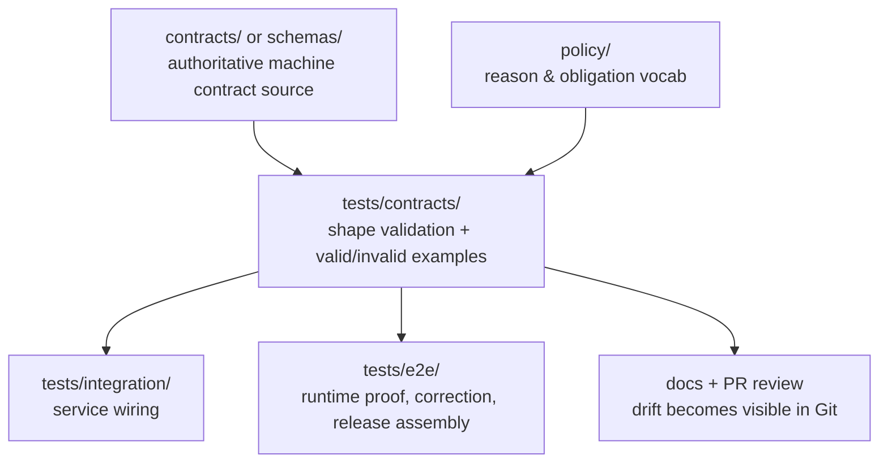

# contracts

Contract-facing verification family for KFM schema drift, valid/invalid example packs, and fail-closed object validation.

> **Status:** experimental  
> **Owners:** `@bartytime4life`  
> **Path:** `tests/contracts/README.md`  
> **Repo fit:** downstream of [`../README.md`](../README.md), [`../../contracts/README.md`](../../contracts/README.md), [`../../schemas/README.md`](../../schemas/README.md), [`../../policy/README.md`](../../policy/README.md), [`../../.github/workflows/README.md`](../../.github/workflows/README.md), and [`../../.github/PULL_REQUEST_TEMPLATE.md`](../../.github/PULL_REQUEST_TEMPLATE.md); upstream of future executable cases under `tests/contracts/**` and any escalation into [`../integration/`](../integration/) or [`../e2e/`](../e2e/).  
> **Quick jump:** [Scope](#scope) · [Repo fit](#repo-fit) · [Accepted inputs](#accepted-inputs) · [Exclusions](#exclusions) · [Directory tree](#directory-tree) · [Quickstart](#quickstart) · [Usage](#usage) · [Diagram](#diagram) · [Tables](#tables) · [Task list](#task-list) · [FAQ](#faq) · [Appendix](#appendix)
>
>     

> [!IMPORTANT]
> The parent [`tests/README.md`](../README.md) keeps `contracts/` as a first-class repo family in the public tests tree. This document follows that **repo-visible plural path** (`tests/contracts/`) even though some doctrinal PDFs also discuss a **PROPOSED** singular shorthand (`tests/contract/`) in illustrative skeletons. Until the mounted repo changes, this README treats `tests/contracts/` as the operative path.

> [!CAUTION]
> Current public evidence confirms **documentation scaffolding**, not a mounted executable contract harness. Treat all runnable layout, fixture packs, validator entrypoints, and merge-blocking workflow expectations below as **PROPOSED** or **NEEDS VERIFICATION** unless and until matching repo artifacts exist.

---

## Scope

This directory defines the **contract-facing test family** for Kansas Frontier Matrix (KFM): the place where machine-checkable contract verification should prove that trust-bearing objects are shaped correctly, reject invalid states deterministically, and fail closed when evidence, policy, or correction requirements are missing.

### Working role

`tests/contracts/` is where KFM should verify object-shape and example-pack truth for contract families such as:

- `SourceDescriptor`
- `IngestReceipt`
- `ValidationReport`
- `DatasetVersion`
- `CatalogClosure`
- `DecisionEnvelope`
- `ReviewRecord`
- `ReleaseManifest` / `ReleaseProofPack`
- `ProjectionBuildReceipt`
- `EvidenceBundle`
- `RuntimeResponseEnvelope`
- `CorrectionNotice`

### Trust posture used in this README

| Label | Meaning here |
|---|---|
| **CONFIRMED** | Directly visible in the current public repo or stated in nearby repo docs |
| **PROPOSED** | Strong repo/doctrine-aligned target shape not yet verified as mounted here |
| **UNKNOWN** | Not proven from current public repo evidence |
| **NEEDS VERIFICATION** | Likely next check before treating a statement as implementation reality |

### What this family should prove

- required fields exist
- invalid shapes are rejected
- contract examples stay synchronized with canonical docs
- negative outcomes remain first-class rather than being silently normalized away
- contract drift is caught before downstream integration, UI, or runtime layers build on it

### What this family should **not** try to prove alone

- cross-service wiring
- end-to-end publication
- UI trust-state rendering
- policy bundle semantics beyond contract-facing fixtures
- geospatial correctness beyond object-shape expectations

For those, escalate into [`../integration/`](../integration/), [`../policy/`](../policy/), or [`../e2e/`](../e2e/).

[Back to top](#contracts)

---

## Repo fit

### Upstream authorities this family should stay aligned with

| Upstream surface | Why it matters here |
|---|---|
| [`../README.md`](../README.md) | Defines `tests/contracts/` as a public test family and establishes current tree expectations |
| [`../../contracts/README.md`](../../contracts/README.md) | Current contract doctrine, wave ordering, fixture intent, and schema-home ambiguity |
| [`../../schemas/README.md`](../../schemas/README.md) | Warns against parallel schema universes and unresolved authority split |
| [`../../policy/README.md`](../../policy/README.md) | Contract fixtures must remain compatible with deny-by-default policy posture |
| [`../../.github/workflows/README.md`](../../.github/workflows/README.md) | Workflow lane exists as documentation, but active merge-gate YAML is not yet public-main confirmed |
| [`../../.github/PULL_REQUEST_TEMPLATE.md`](../../.github/PULL_REQUEST_TEMPLATE.md) | Pull requests already ask for truthfulness, validation evidence, and trust-impact review |

### Downstream consequences

If this directory stays weak, every later lane gets less trustworthy:

- integration tests inherit unstable payload assumptions
- e2e tests can “pass” on payloads that should have failed early
- policy fixtures drift into free text
- docs imply a contract system that the repo does not yet enforce
- UI and Focus surfaces risk bluffing with unverified response shapes

### Current verified snapshot

| Item | Current state |
|---|---|
| `tests/contracts/README.md` | **CONFIRMED:** currently exists |
| `tests/contracts/**` runnable cases | **UNKNOWN:** not publicly confirmed here |
| workflow YAML enforcing this family | **UNKNOWN:** no public-main workflow YAML confirmed |
| canonical `.schema.json` inventory | **UNKNOWN:** contract docs describe it, but public repo evidence does not confirm real files in place |
| valid/invalid fixture packs for this family | **UNKNOWN** |
| authoritative schema home between `contracts/` and `schemas/` | **NEEDS VERIFICATION** |

### Path reconciliation note

The repo currently exposes both [`../../contracts/`](../../contracts/) and [`../../schemas/`](../../schemas/). This README does **not** resolve that authority dispute by itself. Until the repo makes one schema home explicitly authoritative, `tests/contracts/` should validate **whichever contract source is declared canonical**, and should avoid creating a second competing truth surface.

---

## Accepted inputs

This directory should accept only materials that help verify contract truth.

### Belongs here

- valid JSON examples for trust-bearing object families
- invalid JSON examples that prove fail-closed behavior
- contract-specific validator entrypoints
- schema-to-example conformance tests
- fixture manifests for contract waves
- regression cases for negative states such as denied, abstained, stale-visible, generalized, superseded, or withdrawn outcomes
- minimal helper utilities used only to load, normalize, or validate contract fixtures

### Usually belongs nearby, not here

- policy bundle rule tests → [`../policy/`](../policy/)
- cross-component orchestration → [`../integration/`](../integration/)
- runtime proof traces and correction drills → [`../e2e/`](../e2e/)
- canonical schema definitions → likely [`../../contracts/`](../../contracts/) or [`../../schemas/`](../../schemas/), depending on future repo decision
- runbooks and ADRs → `docs/**`

---

## Exclusions

This directory should stay narrow on purpose.

| Excluded from `tests/contracts/` | Put it here instead |
|---|---|
| API smoke tests against live services | [`../integration/`](../integration/) or [`../e2e/`](../e2e/) |
| visual assertions, screenshots, trust chips | broader UI/e2e surfaces |
| database migration tests | package/service-local test lanes |
| geospatial CRS/topology/raster QA | geospatial validation suites or integration/e2e lanes |
| policy allow/deny reasoning beyond fixture compatibility | [`../policy/`](../policy/) |
| release-assembly proof-pack checks | [`../e2e/release_assembly/`](../e2e/release_assembly/) |
| narrative examples that are only documentation | [`../../contracts/README.md`](../../contracts/README.md) or `docs/**` |

> [!NOTE]
> A contract-facing test family should be **strict but small**. The goal is to catch structural dishonesty early, not to absorb every other verification concern in the repo.

[Back to top](#contracts)

---

## Directory tree

### Current public-main snapshot

```text
tests/
├── README.md
├── accessibility/
├── contracts/
│   └── README.md
├── e2e/
│   ├── README.md
│   ├── correction/
│   ├── release_assembly/
│   └── runtime_proof/
├── integration/
├── policy/
├── reproducibility/
└── unit/
```

### PROPOSED maturity shape for this directory

```text
tests/contracts/
├── README.md
├── cases/
│   ├── wave-01-core/
│   │   ├── source-descriptor/
│   │   ├── dataset-version/
│   │   ├── decision-envelope/
│   │   ├── release-manifest/
│   │   ├── evidence-bundle/
│   │   ├── runtime-response-envelope/
│   │   └── correction-notice/
│   └── wave-02-intake-and-review/
│       ├── ingest-receipt/
│       ├── validation-report/
│       ├── catalog-closure/
│       └── review-record/
├── helpers/
│   ├── __init__.py
│   ├── load_case.py
│   └── normalize_json.py
├── validators/
│   ├── jsonschema_runner.py
│   └── manifest.py
└── reports/
    └── .gitkeep
```

### PROPOSED companion fixture shape elsewhere

```text
tests/fixtures/contracts/
└── v1/
    ├── valid/
    └── invalid/
```

That split keeps this directory focused on **tests and runners**, while the larger fixture corpus can be shared across policy, integration, and e2e lanes when needed.

---

## Quickstart

### Safe inspection commands

```bash
# See what currently exists in the family
find tests/contracts -maxdepth 3 -print | sort

# Compare nearby test-family READMEs for local conventions
sed -n '1,220p' tests/README.md
sed -n '1,220p' tests/integration/README.md
sed -n '1,220p' tests/unit/README.md

# Inspect adjacent contract doctrine
sed -n '1,260p' contracts/README.md
sed -n '1,220p' schemas/README.md
```

### PROPOSED future validator shape

The command below is **illustrative only**. It should not be treated as confirmed repo behavior until a real validator entrypoint is checked in.

```bash
python -m jsonschema \
  --instance tests/fixtures/contracts/v1/valid/runtime_response_envelope.valid.json \
  contracts/runtime_response_envelope.schema.json
```

### Fast drift check

Use this when contract examples start to multiply:

```bash
grep -R "RuntimeResponseEnvelope\|EvidenceBundle\|CorrectionNotice" \
  contracts schemas tests/contracts tests/fixtures 2>/dev/null
```

### Workflow caution

Do **not** assume that adding cases here automatically makes them merge-blocking. Public-main evidence currently confirms a workflow documentation lane, not an active checked-in workflow YAML gate.

[Back to top](#contracts)

---

## Usage

### Placement rules

1. Put **shape validation** here.
2. Put **semantic policy decisions** in [`../policy/`](../policy/).
3. Put **service wiring** in [`../integration/`](../integration/).
4. Put **public-surface behavior** and correction flows in [`../e2e/`](../e2e/).
5. Keep any helper code here **small, deterministic, and non-authoritative**.

### Naming guidance

Use explicit case names that preserve family, polarity, and intent.

| Good example | Why it helps |
|---|---|
| `runtime_response_envelope.answer.valid.json` | family + outcome + polarity |
| `decision_envelope.missing_reason.invalid.json` | failure reason is obvious |
| `correction_notice.supersession.valid.json` | correction lineage remains visible |
| `evidence_bundle.partial_scope.invalid.json` | contract drift is reviewable in Git |

### First executable wave

Start with the families that show up repeatedly across doctrine and current contract docs:

1. `DecisionEnvelope`
2. `EvidenceBundle`
3. `RuntimeResponseEnvelope`
4. `CorrectionNotice`
5. `ReleaseManifest`

Then expand into:

6. `SourceDescriptor`
7. `DatasetVersion`

Then, once schema-home authority is explicit:

8. `IngestReceipt`
9. `ValidationReport`
10. `CatalogClosure`
11. `ReviewRecord`
12. `ProjectionBuildReceipt`

### Failure philosophy

A KFM contract test should prefer:

- explicit rejection over permissive coercion
- named invalid examples over hidden assumptions
- visible negative states over flattened “success”
- small wave completion over pseudo-complete scaffolding

---

## Diagram



The key point is directional: `tests/contracts/` should **consume and verify** contract truth, not quietly become a second contract authority.

[Back to top](#contracts)

---

## Tables

### Placement matrix

| If the work mainly tests… | Primary home |
|---|---|
| object shape and required fields | `tests/contracts/` |
| policy result logic and vocab consistency | `tests/policy/` |
| route behavior across components | `tests/integration/` |
| public-safe runtime outcomes and correction behavior | `tests/e2e/` |
| package-local pure logic | `tests/unit/` |

### Candidate first cases

| Family | Why it belongs early | Minimum negative case |
|---|---|---|
| `RuntimeResponseEnvelope` | Trust-bearing runtime object for `ANSWER` / `ABSTAIN` / `DENY` / `ERROR` | missing `result`, missing `audit_ref`, unsupported surface state |
| `EvidenceBundle` | Keeps evidence inspectable at point of use | missing lineage or rights/sensitivity state |
| `DecisionEnvelope` | Bridges policy posture into machine-readable outcomes | missing reason/obligation shape |
| `CorrectionNotice` | Preserves correction lineage | missing affected release or replacement linkage |
| `ReleaseManifest` | Binds outward release to proof and rollback posture | missing release refs or correction posture |

### Contract-family design rules

| Rule | Why it matters |
|---|---|
| One valid and one invalid example is the minimum unit of seriousness | prose-only contract doctrine drifts too easily |
| Invalid cases should be named by failure reason | Git review becomes faster and less ambiguous |
| Keep fixtures deterministic | contract tests should not depend on network or clock jitter |
| Prefer explicit schema-version fields | later migration is easier to audit |
| Preserve negative-state vocabulary | KFM trust posture depends on visible failure classes |

---

## Task list

### Bootstrap checklist

- [ ] Confirm authoritative schema home between `contracts/` and `schemas/`
- [ ] Create first wave contract cases for the five highest-leverage families
- [ ] Add paired valid/invalid examples
- [ ] Add one deterministic validator entrypoint
- [ ] Add one family-level manifest or discovery mechanism
- [ ] Wire the family into a real merge-blocking workflow
- [ ] Document how failures surface in PR review
- [ ] Cross-link fixture locations from [`../../contracts/README.md`](../../contracts/README.md)

### Definition of done

This family is meaningfully established when all of the following are true:

- there is no schema-home ambiguity for executable contract files
- at least one wave of real contract artifacts exists
- each first-wave family has valid and invalid examples
- validators run deterministically in local and CI contexts
- failure output is readable enough for code review
- adjacent docs stop describing the family as intention-only
- public-main shows more than a scaffold README in this directory

### Review gates

Before accepting changes here, check:

- does this add verification, or just more wording?
- does it create duplicate authority with `contracts/` or `schemas/`?
- does it preserve fail-closed semantics?
- does it keep negative states explicit?
- does it stay narrow enough to remain reviewable?

[Back to top](#contracts)

---

## FAQ

### Why is this directory named `contracts/`, not `contract/`?

Because the **current repo-visible path** is `tests/contracts/`, and nearby repo docs already reference that family. This README stays faithful to the mounted public tree instead of normalizing it to a doctrinal shorthand.

### Why not store canonical schemas directly under `tests/contracts/`?

Because this family should verify contract truth, not quietly replace it. Until the repo explicitly chooses the authoritative schema home, duplicating schemas here would increase drift risk.

### Why are valid/invalid fixtures emphasized so heavily?

Because KFM doctrine repeatedly treats fail-closed behavior and visible negative outcomes as trust requirements, not edge cases. Contract examples are the smallest executable proof of that posture.

### Why is so much marked PROPOSED?

Because current public evidence shows a strong documentation pattern, but not yet a publicly confirmed executable contract harness in this directory.

### Should API endpoint tests live here?

Not usually. Keep object-shape checks here; move route wiring and end-to-end surface behavior into integration or e2e lanes.

---

## Appendix

<details>
<summary><strong>Evidence notes, doctrinal alignment, and open checks</strong></summary>

### Evidence notes

This README is built from three kinds of evidence:

1. **Current repo-visible Markdown**
   - `tests/README.md`
   - `tests/integration/README.md`
   - `tests/unit/README.md`
   - `contracts/README.md`
   - `schemas/README.md`
   - `.github/workflows/README.md`
   - `.github/PULL_REQUEST_TEMPLATE.md`
   - `.github/CODEOWNERS`

2. **Doctrinal KFM PDFs**
   - canonical contract-family and verification guidance
   - trust-surface / route-family / negative-state doctrine
   - repo-grounded contract-gate priority recommendations

3. **Strict uncertainty handling**
   - no claim here should imply runnable CI, schema inventory, or fixture inventory unless the repo itself visibly proves it

### Doctrinal contract lattice echoed here

The broader KFM corpus treats the following as trust-bearing contract families:

- `SourceDescriptor`
- `IngestReceipt`
- `ValidationReport`
- `DatasetVersion`
- `CatalogClosure`
- `DecisionEnvelope`
- `ReviewRecord`
- `ReleaseManifest`
- `ReleaseProofPack`
- `ProjectionBuildReceipt`
- `EvidenceBundle`
- `RuntimeResponseEnvelope`
- `CorrectionNotice`

This directory should not attempt to implement all of them at once. It should grow in reversible waves.

### Open verification items

- Is `contracts/` or `schemas/` the authoritative machine-contract home?
- Are any `.schema.json` files already mounted elsewhere in the repo?
- Are valid/invalid fixtures already present under another path?
- Is there a real validator script or package entrypoint not yet surfaced in docs?
- Has any workflow YAML already been authored on a branch or in a non-public surface?
- Are there existing contract cases tied to the hydrology-first thin slice?

</details>
