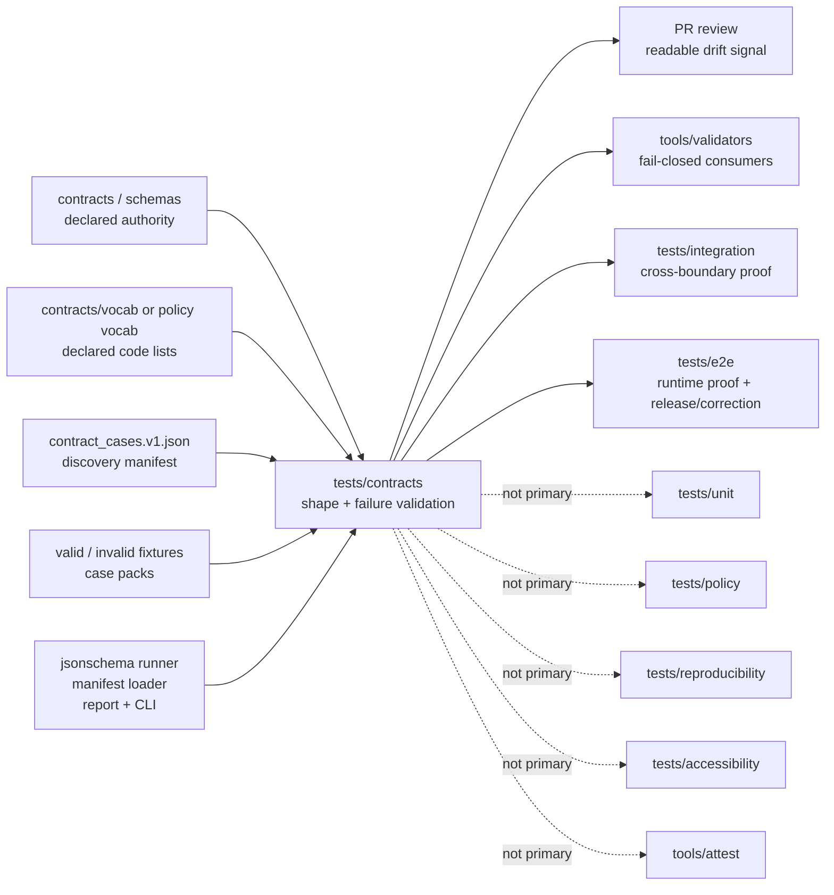

<!-- [KFM_META_BLOCK_V2]
doc_id: kfm://doc/<TODO-uuid>
title: tests/contracts
type: standard
version: v1
status: draft
owners: @bartytime4life
created: <TODO: verify YYYY-MM-DD>
updated: 2026-04-19
policy_label: public
related: [../README.md, ../accessibility/README.md, ../e2e/README.md, ../integration/README.md, ../policy/README.md, ../reproducibility/README.md, ../unit/README.md, ../../contracts/README.md, ../../contracts/vocab/README.md, ../../schemas/README.md, ../../schemas/contracts/README.md, ../../schemas/contracts/v1/README.md, ../../schemas/tests/README.md, ../../policy/README.md, ../../data/receipts/README.md, ../../data/proofs/README.md, ../../tools/validators/README.md, ../../tools/validators/promotion_gate/README.md, ../../tools/attest/README.md, ../../docs/standards/README.md, ../../.github/workflows/README.md, ../../.github/watchers/README.md, ../../.github/PULL_REQUEST_TEMPLATE.md, ../../.github/CODEOWNERS]
tags: [kfm, tests, contracts, verification, schema-drift, fail-closed, receipts, proofs, runtime-proof]
notes: [doc_id and created date still need verification., This revision combines the stronger executable-wave draft with the stricter authority-consumption rules., tests/contracts consumes declared contract and schema authority; it must not create or fork authority., Workflow enforcement depth and fixture-home law still require active-branch verification before merge.]
[/KFM_META_BLOCK_V2] -->

<a id="top"></a>

# `tests/contracts/`

Contract-facing verification for KFM schema drift, valid/invalid example packs, manifest-driven validation, and fail-closed object checks.

<div align="left">


</div>

**Quick jumps:** [Scope](#scope) · [Authority rules](#authority-rules) · [Repo fit](#repo-fit) · [Current working snapshot](#current-working-snapshot) · [Accepted inputs](#accepted-inputs) · [Exclusions](#exclusions) · [Directory tree](#directory-tree) · [Quickstart](#quickstart) · [Usage](#usage) · [Runner](#runner) · [CLI](#cli) · [Diagram](#diagram) · [Reference tables](#reference-tables) · [Task list](#task-list--definition-of-done) · [FAQ](#faq) · [Appendix](#appendix)

---

> [!IMPORTANT]
> **tests consume authority — they do not create it.**
>
> This directory validates trust-bearing object shape and failure behavior. It must not become a second contract registry, a duplicate schema home, a policy vocabulary source, or a runtime-proof substitute.

> [!CAUTION]
> This README records the supplied working baseline and the intended lane discipline. Before merging changes, verify the active branch directly for file presence, workflow gates, fixture-home law, branch protection, and runner behavior. Documentation evidence is not the same as mounted implementation proof.

| Field | Value |
|---|---|
| Path | `tests/contracts/` |
| Role | Contract-facing verification for machine-readable object shape, invalid-state rejection, and fail-closed drift detection |
| Primary burden | Valid/invalid examples, schema conformance, negative-state proof, and manifest-driven execution |
| Not this lane | Contract authority, schema ownership, policy logic, runtime orchestration, proof storage |
| Adjacent authority surfaces | `contracts/`, `schemas/contracts/`, `contracts/vocab/`, `policy/` |
| Adjacent consumers | `tools/validators/`, `tools/attest/`, `tests/integration/`, `tests/e2e/` |
| Reported executable thin slice | Wave 01 core fixtures + manifest + JSON Schema runner + CLI + readable failure summary |
| Trust reminder | `verification ≠ authority ≠ policy ≠ proof` |

---

## Scope

`tests/contracts/` is the contract-consumption and validation boundary inside KFM’s governed test system.

In KFM terms, this is one of the smallest places where the inspectable-claim doctrine becomes executable. If a trust-bearing object cannot survive validation here, downstream integration, validator, attestation, runtime, release, and UI surfaces should not be allowed to smooth over that failure.

This family exists to prove that:

- object shapes match declared contracts and schemas
- invalid states fail deterministically
- required evidence, policy, receipt, proof, release, or correction fields are not silently optional
- negative states remain first-class instead of being flattened into success
- downstream lanes inherit stable assumptions rather than wishful ones
- schema drift becomes visible in PR review

### Working role

`tests/contracts/` is the natural home for shape validation and example-pack truth for trust-bearing families such as:

- `DecisionEnvelope`
- `EvidenceBundle`
- `RuntimeResponseEnvelope`
- `CorrectionNotice`
- `ReleaseManifest`
- `SourceDescriptor`
- `DatasetVersion`
- `IngestReceipt`
- `ValidationReport`
- `CatalogClosure`
- `ReviewRecord`
- `ProjectionBuildReceipt`

Later proof-oriented materials also increase pressure to validate cross-cutting carriers when they are part of a contract under test:

- `spec_hash`
- `run_receipt`
- `ai_receipt`
- attestation refs
- receipt/proof linkage refs

### Status labels used here

| Label | Meaning in this README |
|---|---|
| **CONFIRMED** | Grounded in supplied docs or explicit working-baseline evidence from the provided drafts |
| **PROPOSED** | Recommended lane shape not yet proven from the active checkout in this session |
| **UNKNOWN** | Not established strongly enough from the available evidence |
| **NEEDS VERIFICATION** | Must be checked against the active branch, runner, workflow, or repo settings before merge |

[Back to top](#top)

---

## Authority rules

This is the non-negotiable part of the lane.

### Rule 1 — consume one declared machine source

Each contract family should validate against one declared machine source for that family.

| Situation | Required action |
|---|---|
| `contracts/` and `schemas/contracts/` both appear relevant | Verify the active branch’s declared authority before adding or changing tests |
| a test references two competing schema homes for the same family | Reject the change until authority is resolved upstream |
| schema-home authority is unclear | Mark **NEEDS VERIFICATION** and stop rather than normalizing ambiguity |
| a runner must locate schemas dynamically | Use an explicit manifest or declared resolver; do not silently guess |

### Rule 2 — no schema duplication

Tests must import or resolve schemas from their authoritative location. They must not inline schema fragments, copy schema bodies into fixtures, or create local “temporary” schemas that become durable by accident.

### Rule 3 — fixtures do not define structure

Fixtures must conform to schema. They must not introduce fields that are absent from schema, smuggle new envelope shapes into tests, or become a backdoor contract draft.

### Rule 4 — runtime proof is downstream

`tests/e2e/runtime_proof/` consumes validated contract outputs. It must not redefine contract shape, outcome vocabulary, or proof-carrier semantics. If upstream contract tests fail, runtime-proof work should fail or stop rather than adapt around the invalid shape.

### Rule 5 — vocabulary is external

Contract tests must not define outcome enums, reason codes, obligation codes, reviewer roles, or policy-owned vocab locally.

Use the owning surfaces instead:

| Vocabulary kind | Owning surface |
|---|---|
| contract-shared vocab | `contracts/vocab/` or the verified schema-side vocab lane |
| policy reason / obligation grammar | `policy/` |
| runtime outcome semantics | declared contract/schema + runtime proof consumers |
| reviewer roles or release obligations | owning contract, policy, or release lane |

### Rule 6 — receipts and proofs stay distinct

Receipt-shaped objects can be validated here when they are contract subjects, but storage and authority remain elsewhere.

| Trust object | This lane may validate… | This lane must not become… |
|---|---|---|
| `run_receipt` / `ai_receipt` | shape, required refs, invalid missing fields | the receipt archive |
| `EvidenceBundle` / proof pack | linkage, integrity fields, required refs | the proof store |
| attestation ref | required field shape and invalid absence | the signing implementation |

[Back to top](#top)

---

## Repo fit

### Upstream surfaces this family should stay aligned with

| Surface | Why it matters here | Posture to preserve |
|---|---|---|
| [`../README.md`](../README.md) | Defines `tests/` as the governed verification surface | Keep `contracts/` visible as its own family |
| [`../../contracts/README.md`](../../contracts/README.md) | Human-readable contract doctrine and trust-object framing | Do not override contract meaning from tests |
| [`../../schemas/README.md`](../../schemas/README.md) | Wider schema boundary | Do not create parallel schema authority |
| [`../../schemas/contracts/README.md`](../../schemas/contracts/README.md) | Schema-side machine-contract lane | Resolve schemas; do not clone them |
| [`../../schemas/contracts/v1/README.md`](../../schemas/contracts/v1/README.md) | First-wave schema family split | Use as a placement signal, not proof of complete coverage |
| [`../../schemas/tests/README.md`](../../schemas/tests/README.md) | Schema-side fixture scaffold | Do not let fixture-home ambiguity become silent authority |
| [`../../policy/README.md`](../../policy/README.md) | Deny-by-default policy grammar | Keep policy decisions out of shape-only tests |
| [`../../data/receipts/README.md`](../../data/receipts/README.md) | Process memory | Validate receipt shape without storing receipts here |
| [`../../data/proofs/README.md`](../../data/proofs/README.md) | Release-grade proofs | Validate proof-carrier shape without storing proofs here |
| [`../../tools/validators/README.md`](../../tools/validators/README.md) | Fail-closed consumers | Give validators stable fixtures to consume |
| [`../../tools/validators/promotion_gate/README.md`](../../tools/validators/promotion_gate/README.md) | Promotion gate pressure | Keep `DecisionEnvelope`, `EvidenceBundle`, and release fixtures precise |
| [`../../tools/attest/README.md`](../../tools/attest/README.md) | Signing and verification helpers | Validate helper-facing objects; do not own signing logic |
| [`../../.github/workflows/README.md`](../../.github/workflows/README.md) | Automation lane | Do not claim merge-blocking gates without workflow proof |
| [`../../.github/PULL_REQUEST_TEMPLATE.md`](../../.github/PULL_REQUEST_TEMPLATE.md) | Review evidence expectations | Make validation evidence easy to cite in PRs |
| [`../../.github/CODEOWNERS`](../../.github/CODEOWNERS) | Review boundary | Keep ownership explicit until finer splits are verified |

### Lateral test-family boundaries

| Need | Prefer |
|---|---|
| pure helper behavior | [`../unit/`](../unit/) |
| policy allow/deny reasoning | [`../policy/`](../policy/) |
| cross-boundary service or adapter seams | [`../integration/`](../integration/) |
| rerun consistency, `spec_hash`, digest stability, rebuild drift | [`../reproducibility/`](../reproducibility/) |
| keyboard, motion, screen-reader, non-color-only trust cues | [`../accessibility/`](../accessibility/) |
| public runtime, release assembly, correction flow, runtime proof | [`../e2e/`](../e2e/) |

### Downstream consequences

If this directory drifts or stays weak:

- integration tests inherit unstable payload assumptions
- policy tests drift into free text because example packs are missing
- validators can claim linkage rigor without stable valid/invalid cases
- attestation helpers can appear stronger than the validated subjects they consume
- e2e checks can pass on objects that should have failed earlier
- docs imply a contract system that the active repo may not yet enforce

[Back to top](#top)

---

## Current working snapshot

> [!NOTE]
> The table below is grounded in the supplied drafts and should be treated as a working-baseline snapshot. Recheck inventory-sensitive rows against the active branch before merge.

| Item | Status | Why it matters |
|---|---|---|
| `tests/contracts/` is documented as its own verification family | **CONFIRMED** | Keep this lane visible instead of folding it into generic tests prose |
| `contracts/` and `schemas/contracts/` both appear as authority-relevant surfaces | **CONFIRMED** | Schema-home authority must be explicit; tests must not choose by inertia |
| `schemas/contracts/v1/` is described with first-wave families under `common/`, `correction/`, `data/`, `evidence/`, `policy/`, `release/`, `runtime`, and `source/` | **CONFIRMED** | These names are the best current placement anchors for first-wave contract cases |
| `schemas/tests/fixtures/contracts/v1/{valid,invalid}` is described as a schema-side scaffold | **CONFIRMED** | It is visible pressure, but it does not settle fixture-home law by itself |
| `tests/contracts/manifests/contract_cases.v1.json` is the reported first-wave discovery manifest | **CONFIRMED in supplied thin slice** | Contract inventory can be executable rather than implied |
| `tests/contracts/validators/jsonschema_runner.py` is the reported schema-validation helper | **CONFIRMED in supplied thin slice** | Case validation can be deterministic |
| `tests/contracts/validators/manifest.py` and `manifest_cli.py` are reported manifest execution helpers | **CONFIRMED in supplied thin slice** | The family has a runner surface beyond prose |
| `tests/contracts/validators/report.py` is the reported readable failure-summary helper | **CONFIRMED in supplied thin slice** | Failures can be reviewer-readable |
| Wave 01 core fixtures are reported for `RuntimeResponseEnvelope`, `DecisionEnvelope`, `EvidenceBundle`, `ReleaseManifest`, and `CorrectionNotice` | **CONFIRMED in supplied thin slice** | The first executable wave has concrete subjects |
| `.github/workflows/` is documentation-visible | **NEEDS VERIFICATION** | Do not assume active merge-blocking contract automation |
| Exact branch protections, required checks, rulesets, and workflow coverage | **NEEDS VERIFICATION** | These cannot be established from README text alone |
| Exact canonical home for `run_receipt` and `ai_receipt` schemas or fixtures | **NEEDS VERIFICATION** | Later proof pressure is real; checked-in ownership remains unsettled here |

[Back to top](#top)

---

## Accepted inputs

This directory accepts only materials that verify contract truth.

### Belongs here

- valid JSON examples for trust-bearing contract families
- invalid JSON examples proving fail-closed behavior
- contract-specific validator entrypoints
- schema-to-example conformance tests
- fixture manifests or discovery manifests for contract waves
- deterministic runner glue that resolves schemas from the declared authority lane
- readable failure-report helpers
- CLI surfaces that run contract waves without redefining schema ownership
- regression cases for negative states such as `ABSTAIN`, `DENY`, `ERROR`, `stale-visible`, `generalized`, `superseded`, or `withdrawn`
- proof-carrier fixtures when the contract under test explicitly requires them
- valid/invalid cases for `DecisionEnvelope`, `RuntimeResponseEnvelope`, `EvidenceBundle`, `ReleaseManifest`, `CorrectionNotice`, `SourceDescriptor`, and `DatasetVersion`

### Allowed only with care

| Material | Condition |
|---|---|
| receipt-like fixtures | Only when testing a receipt contract; do not store run history here |
| attestation refs | Only field shape and required-linkage checks; no signing mechanics |
| schema-side fixture mirrors | Only if explicitly marked as mirrors or generated copies |
| policy-facing fields | Only shape and required presence; policy meaning belongs in `tests/policy/` |
| generated reports | Keep lightweight and reproducible; avoid committing noisy runtime output |

[Back to top](#top)

---

## Exclusions

| Excluded from `tests/contracts/` | Put it here instead |
|---|---|
| canonical contract definitions | [`../../contracts/`](../../contracts/README.md) |
| canonical schema files | [`../../schemas/contracts/`](../../schemas/contracts/README.md) |
| policy logic, reason-code semantics, obligation evaluation | [`../policy/`](../policy/) or [`../../policy/`](../../policy/README.md) |
| pure helper or local-function checks | [`../unit/`](../unit/) |
| integration flows and adapter seams | [`../integration/`](../integration/) |
| runtime/public-route proof, release assembly, correction drills | [`../e2e/`](../e2e/) |
| digest stability, rebuild drift, receipt comparison as a primary burden | [`../reproducibility/`](../reproducibility/) |
| trust-visible accessibility behavior | [`../accessibility/`](../accessibility/) |
| receipt archives | [`../../data/receipts/`](../../data/receipts/README.md) |
| release proof packs or proof archives | [`../../data/proofs/`](../../data/proofs/README.md) |
| signing helpers and attestation transport | [`../../tools/attest/`](../../tools/attest/README.md) |
| promotion-only supply-chain verification | [`../../tools/validators/promotion_gate/`](../../tools/validators/promotion_gate/README.md) plus policy/reproducibility lanes |
| long-form runbooks and ADRs | `docs/**` |

> [!IMPORTANT]
> Keep this family strict but small. Its job is to catch structural dishonesty early, not to absorb every verification concern in the repository.

[Back to top](#top)

---

## Directory tree

### Reported current thin slice — verify against active branch

```text
tests/contracts/
├── README.md
├── manifests/
│   └── contract_cases.v1.json
├── validators/
│   ├── jsonschema_runner.py
│   ├── manifest.py
│   ├── manifest_cli.py
│   └── report.py
└── test_contract_manifest_wave_01.py
```

### Nearby schema-side reality described by the supplied drafts

```text
schemas/
├── contracts/
│   ├── README.md
│   ├── v1/
│   │   ├── common/
│   │   ├── correction/
│   │   ├── data/
│   │   ├── evidence/
│   │   ├── policy/
│   │   ├── release/
│   │   ├── runtime/
│   │   └── source/
│   └── vocab/
└── tests/
    └── fixtures/
        └── contracts/
            └── v1/
                ├── invalid/
                └── valid/
```

### `PROPOSED` maturity shape

```text
tests/contracts/
├── README.md
├── cases/
│   ├── wave-01-core/
│   │   ├── decision-envelope/
│   │   ├── evidence-bundle/
│   │   ├── runtime-response-envelope/
│   │   ├── correction-notice/
│   │   ├── release-manifest/
│   │   ├── source-descriptor/
│   │   └── dataset-version/
│   └── wave-02-intake-and-review/
│       ├── ingest-receipt/
│       ├── validation-report/
│       ├── catalog-closure/
│       ├── review-record/
│       └── projection-build-receipt/
├── manifests/
│   ├── contract_cases.v1.json
│   └── contract_cases.v2.json
├── validators/
│   ├── jsonschema_runner.py
│   ├── manifest.py
│   ├── manifest_cli.py
│   ├── report.py
│   └── manifest_ci_summary.py
└── reports/
    └── .gitkeep
```

### Coordination pattern to prefer

```text
schemas/contracts/v1/**/*.schema.json                   # schema-side machine contract lane
schemas/tests/fixtures/contracts/v1/{valid,invalid}/    # visible fixture scaffold, if designated
tests/contracts/**                                      # root verification family, runners, reports
contracts/vocab/**                                      # shared contract vocabulary, if designated
policy/**                                               # reason / obligation grammar
data/receipts/**                                        # process-memory surfaces
data/proofs/**                                          # higher-order proof surfaces
tools/validators/**                                     # fail-closed consumers
tools/attest/**                                         # signing / verification helpers
```

[Back to top](#top)

---

## Quickstart

### Run the full family

```bash
pytest tests/contracts -q
```

### Run the reported Wave 01 manifest test

```bash
pytest tests/contracts/test_contract_manifest_wave_01.py -q
```

### Run the manifest CLI directly

```bash
python -m tests.contracts.validators.manifest_cli \
  tests/contracts/manifests/contract_cases.v1.json
```

### Inspect the authority and fixture surfaces before expanding

```bash
sed -n '1,220p' contracts/README.md
sed -n '1,260p' schemas/contracts/README.md
sed -n '1,260p' schemas/contracts/v1/README.md
sed -n '1,220p' schemas/tests/README.md
find schemas/tests/fixtures/contracts -maxdepth 4 -type f 2>/dev/null | sort
find tests/contracts -maxdepth 5 -type f 2>/dev/null | sort
```

> [!WARNING]
> Do not treat the quickstart commands as proof of active CI enforcement. Local runner success proves validation behavior; merge-blocking status still requires workflow and branch-rule evidence.

[Back to top](#top)

---

## Usage

### Correct flow

```python
schema = load_schema_from_declared_authority(family.schema_ref)
case = load_contract_case(family.case_dir / case_name)
result = validate(case, schema)
assert result.actual_valid == result.expected_valid
```

### Incorrect flow

```python
# ❌ The test has invented structure by example.
payload = {
    "outcome": "ANSWER",
    "new_field_not_in_schema": "quietly accepted by a permissive helper",
}
```

### Placement rules

1. Put shape validation here, but read schemas from the checked-out declared authority lane.
2. Put semantic policy decisions in [`../policy/`](../policy/).
3. Put service wiring in [`../integration/`](../integration/).
4. Put rerun, digest, and receipt-stability checks in [`../reproducibility/`](../reproducibility/).
5. Put trust-visible accessibility behavior in [`../accessibility/`](../accessibility/).
6. Put public-surface behavior, release proof, correction flow, and runtime proof in [`../e2e/`](../e2e/).
7. Keep helper code here small, deterministic, and non-authoritative.
8. When schema-side reality and contract-side doctrine diverge, document the divergence and stop the PR rather than smoothing it away.

### Naming guidance

Use names that preserve family, polarity, and failure intent.

| Good example | Why it helps |
|---|---|
| `runtime_response_envelope.answer.valid.json` | family + outcome + polarity |
| `decision_envelope.missing_reason.invalid.json` | failure reason is obvious |
| `correction_notice.supersession.valid.json` | correction lineage remains visible |
| `evidence_bundle.partial_scope.invalid.json` | contract drift is reviewable in Git |
| `release_manifest.missing_receipt_ref.invalid.json` | receipt/proof linkage stays explicit |
| `decision_envelope.unverified_attestation_ref.invalid.json` | higher-order trust linkage remains visible |

Avoid vague buckets such as `misc/`, `contract_v2/`, `draft_cases/`, or `helpers_everything/`.

### Failure philosophy

A KFM contract case should prefer:

- explicit rejection over permissive coercion
- named invalid examples over hidden assumptions
- visible negative states over flattened success
- one real wave over pseudo-complete scaffolding
- stable, reviewable examples over clever test magic
- contract-carried proof over free-text claims that a check “must have happened”

[Back to top](#top)

---

## Runner

### Manifest-driven execution

The reported first-wave contract cases are discovered via:

```text
tests/contracts/manifests/contract_cases.v1.json
```

Each family entry should declare:

- `schema_ref`
- `case_dir`
- `valid_cases`
- `invalid_cases`

The reported first-wave manifest covers:

- `runtime-response-envelope`
- `decision-envelope`
- `evidence-bundle`
- `release-manifest`
- `correction-notice`

### Helper surfaces

| File | Purpose |
|---|---|
| `tests/contracts/validators/jsonschema_runner.py` | Validate one instance against one schema and return structured pass/fail plus error text |
| `tests/contracts/validators/manifest.py` | Load and resolve the manifest |
| `tests/contracts/validators/report.py` | Render readable failure summaries |
| `tests/contracts/validators/manifest_cli.py` | Run manifest-driven validation outside pytest |
| `tests/contracts/test_contract_manifest_wave_01.py` | Assert all valid cases pass and all invalid cases fail |

### Result model

Failure summaries should show enough for review without requiring maintainers to open validator internals:

- total cases
- passed cases
- failed cases
- family name
- case name
- expected validity
- actual validity
- validation error text when present

[Back to top](#top)

---

## CLI

Run the reported first executable wave directly:

```bash
python -m tests.contracts.validators.manifest_cli \
  tests/contracts/manifests/contract_cases.v1.json
```

Expected output shape:

```text
Contract validation summary
total=...
passed=...
failed=...
```

Failures should include:

- family
- case name
- expected validity
- actual validity
- validation error

The CLI is a convenience surface, not a second source of truth. The manifest and fixtures stay central; pytest and CLI execution should run the same wave.

[Back to top](#top)

---

## Diagram



The directional point is deliberate: `tests/contracts/` consumes and verifies contract truth. It must not quietly become a second or third contract authority.

[Back to top](#top)

---

## Reference tables

### Family placement matrix

| If the work mainly tests… | Primary home | Why |
|---|---|---|
| object shape and required fields | `tests/contracts/` | Keep machine-contract truth explicit and reviewable |
| policy result logic, reason codes, or obligation vocab | `tests/policy/` | Decision grammar should stay isolated |
| pure local helper behavior | `tests/unit/` | Cheapest convincing proof wins |
| rerun consistency, `spec_hash` stability, or receipt comparison | `tests/reproducibility/` | Determinism is its own burden |
| keyboard / motion / screen-reader / non-color-only trust cues | `tests/accessibility/` | Accessibility is a first-class trust burden |
| route behavior across real boundaries | `tests/integration/` | Cross-boundary proof belongs there |
| full runtime, release proof, promotion proof, or correction lineage | `tests/e2e/` | That burden is broader than one contract slice |
| signing mechanics or attestation transport | `tools/attest/` plus adjacent tests | Those helpers should stay reusable outside one test lane |

### Starter wave strategy

| Wave | Families | Why this order helps |
|---|---|---|
| Wave 01 — core trust surfaces | `DecisionEnvelope`, `EvidenceBundle`, `RuntimeResponseEnvelope`, `CorrectionNotice`, `ReleaseManifest` | Gives policy, evidence, runtime outcome, correction, and outward release objects a real executable backbone |
| Wave 01 — substrate / identity | `SourceDescriptor`, `DatasetVersion` | Keeps source-edge identity and promoted version identity explicit before later drift accumulates |
| Wave 02 — intake / review | `IngestReceipt`, `ValidationReport`, `CatalogClosure`, `ReviewRecord`, `ProjectionBuildReceipt` | Adds acquisition, validation, review, and derived-build rigor after the first trust-bearing core exists |
| Cross-cutting proof carriers | `spec_hash`, `run_receipt`, `ai_receipt`, attestation refs | Prevents proof language from floating above actual contract checks |

### Candidate early cases

| Family | Why it belongs early | Current schema-side signal to verify | Minimum negative case |
|---|---|---|---|
| `RuntimeResponseEnvelope` | Trust-bearing runtime object for finite outcomes | `schemas/contracts/v1/runtime/runtime_response_envelope.schema.json` | missing `outcome`, missing `audit_ref`, unsupported state |
| `DecisionEnvelope` | Bridges policy posture into machine-readable outcomes | `schemas/contracts/v1/policy/decision_envelope.schema.json` | missing reason, invalid outcome |
| `EvidenceBundle` | Keeps evidence inspectable at point of use | `schemas/contracts/v1/evidence/evidence_bundle.schema.json` | missing refs, empty evidence list |
| `CorrectionNotice` | Preserves correction lineage | `schemas/contracts/v1/correction/correction_notice.schema.json` | missing affected release, invalid status |
| `ReleaseManifest` | Binds outward release to proof and rollback posture | `schemas/contracts/v1/release/release_manifest.schema.json` | missing proof ref or audit ref |
| `SourceDescriptor` | Keeps source-edge identity explicit before derivation | `schemas/contracts/v1/source/source_descriptor.schema.json` | missing source kind, rights, freshness basis |
| `DatasetVersion` | Preserves versioned identity and lineage before promotion | `schemas/contracts/v1/data/dataset_version.schema.json` | missing lineage, temporal basis, or status |

### Contract-family design rules

| Rule | Why it matters |
|---|---|
| One valid and one invalid example is the minimum unit of seriousness | Prose-only doctrine drifts too easily |
| Invalid cases should be named by failure reason | Git review becomes faster and less ambiguous |
| Fixtures must be deterministic | Contract tests should not depend on network, clock jitter, or source volatility |
| Prefer explicit schema-version fields | Later migration is easier to audit |
| Preserve negative-state vocabulary | KFM trust posture depends on visible failure classes |
| Do not duplicate canonical schemas here | This family proves behavior; it does not own authority |
| Treat malformed proof carriers as first-class invalid cases where applicable | Proof language should not float above executable checks |
| Keep receipt and proof roles explicit in names and manifests | Validator and attestation lanes depend on that distinction |
| Keep manifest inventory synchronized with actual case directories | Drift should fail in the runner, not be discovered by accident |

[Back to top](#top)

---

## Task list -- definition of done

### First executable suite bootstrap

- [ ] Confirm whether an existing repo-wide runner, validator, or shared fixture convention already governs this family
- [ ] Reconcile `tests/contracts/` with `schemas/contracts/v1/` and `schemas/tests/fixtures/contracts/v1/`
- [ ] Confirm authoritative machine-contract home between `contracts/` and `schemas/contracts/`
- [ ] Decide whether schema-side fixture leaves are mirror-only, illustrative-only, generated, or runnable
- [ ] Decide whether root-side shared fixtures such as `tests/fixtures/contracts/v1/` are needed or would create another authority surface
- [x] Add one real wave before adding broad subtrees
- [x] Create first-wave contract cases for the highest-leverage visible families
- [x] Add paired valid / invalid examples
- [x] Add one deterministic validator entrypoint
- [x] Add one family-level manifest / discovery mechanism
- [ ] Wire the family into a branch-verified merge-blocking workflow
- [ ] Document how failures surface in PR review using active workflow evidence
- [ ] Cross-link runner inputs and fixture locations from `contracts/`, `schemas/contracts/`, and `schemas/tests/`

### Cross-cutting proof upgrades

- [ ] Decide whether `run_receipt` and `ai_receipt` belong here, in an adjacent schema pack, or both as contract + golden-pack pairs
- [ ] Add at least one invalid receipt-style case if proof-carrying objects become part of this family’s burden
- [ ] Define which malformed proof-carrier members are deterministic deny reasons in policy or validation lanes
- [x] Add a golden `RuntimeResponseEnvelope` pack that keeps `ANSWER`, `ABSTAIN`, `DENY`, and `ERROR` distinct
- [x] Add readable failure-report output so contract breakage is reviewable without raw validator internals
- [ ] Add at least one receipt/proof linkage case used by promotion-oriented validation
- [ ] Confirm how attestation refs are represented in valid and invalid cases where relevant

### Definition of done

This family is meaningfully established when:

1. there is no silent conflict between `tests/contracts/`, `contracts/`, `schemas/contracts/`, and `schemas/tests/fixtures/contracts/`
2. executable contract files have no unresolved schema-home ambiguity that the suite silently papers over
3. at least one real wave of contract artifacts exists
4. each first-wave family has valid and invalid examples
5. validators run deterministically in local and CI contexts
6. failure output is readable enough for code review
7. adjacent docs stop describing this family as README-only intention
8. the PR can point to fixtures, passing behavior, and failing behavior
9. proof-carrier claims used by this family are validated rather than assumed
10. negative outcomes remain explicit through example packs, runner output, and review evidence

### Review gates

Before accepting changes here, ask:

- does this add executable verification, or just more wording?
- does it create duplicate authority with `contracts/`, `schemas/contracts/`, `schemas/tests/`, or an unnecessary extra fixture home?
- does it preserve fail-closed semantics?
- does it keep negative states explicit?
- does it stay narrow enough to remain reviewable?
- can the PR link validation evidence and failure evidence?

[Back to top](#top)

---

## FAQ

### Do tests define contracts?

No. Tests verify contract shape and invalid-state behavior against declared authority. They do not create meaning, own schema structure, or define policy vocabulary.

### Can tests choose the schema location?

No. If a test must choose between `contracts/` and `schemas/contracts/`, the authority boundary is not clear enough. Stop and resolve it upstream.

### Why mention `schemas/contracts/` and `schemas/tests/` so often?

Because the supplied working baseline points to both a schema-side machine-file lane and a nested fixture scaffold. This README keeps those surfaces visible so root contract tests do not accidentally turn a scaffold into authority.

### Why not store canonical schemas directly under `tests/contracts/`?

Because duplicating schemas here increases drift risk. This family should prove behavior against schema authority, not replace it.

### Why emphasize valid and invalid fixtures?

Because fail-closed behavior and visible negative outcomes are trust requirements in KFM. Contract examples are the smallest executable proof of that posture.

### Why add a manifest and CLI?

A discovery manifest turns fixture inventory into something executable and reviewable. The CLI lets the same wave run outside pytest without creating a second source of truth.

### Should reproducibility cases live here?

Not as a primary burden. A contract case may participate in broader rerun proof, but digest stability, receipt comparison, and bounded-drift reruns belong first in [`../reproducibility/`](../reproducibility/).

### Why mention `run_receipt` and `ai_receipt` if their exact home is unsettled?

Because later proof-oriented materials make them part of KFM’s contract pressure. Mentioning them prevents drift; claiming they already live here would overstate the evidence.

### Do attestation helpers belong here?

No. This family may validate object shapes those helpers consume. Helper implementations and signing logic belong in the attestation lane.

[Back to top](#top)

---

## Appendix

<details>
<summary><strong>Evidence notes, contract lattice, and open checks</strong></summary>

### Evidence notes

This revision combines two supplied drafts:

- the shorter authority-focused draft, which makes the consume-don’t-create rule explicit
- the longer executable-wave draft, which documents the reported manifest, runner, CLI, readable failure summary, and Wave 01 core shape

This README still does not imply branch-verified merge gates, exhaustive family coverage, final fixture-home law, or active ruleset enforcement unless the checked-out branch proves those artifacts directly.

### Doctrinal contract lattice echoed here

The current contract-facing materials repeatedly center these trust-bearing families:

- `SourceDescriptor`
- `IngestReceipt`
- `ValidationReport`
- `DatasetVersion`
- `CatalogClosure`
- `DecisionEnvelope`
- `ReviewRecord`
- `ReleaseManifest`
- `ReleaseProofPack`
- `ProjectionBuildReceipt`
- `EvidenceBundle`
- `RuntimeResponseEnvelope`
- `CorrectionNotice`

Adjacent proof materials add pressure around:

- `spec_hash`
- `run_receipt`
- `ai_receipt`
- attestation refs

### Open verification items

- Is `contracts/` or `schemas/contracts/` the singular authoritative machine-contract home for each family?
- Are schema-side valid/invalid leaves illustrative, mirrored, generated, or runnable?
- Is there a broader validator entrypoint not yet surfaced in the supplied drafts?
- Are there active workflow YAML files that make this family merge-blocking?
- Which `schemas/contracts/v1/**/*.schema.json` files are complete versus placeholders?
- Where do `run_receipt` and `ai_receipt` live canonically?
- Which promotion-facing or attestation-facing shapes should receive first-wave valid/invalid cases here versus adjacent lanes?

</details>

[Back to top](#top)
