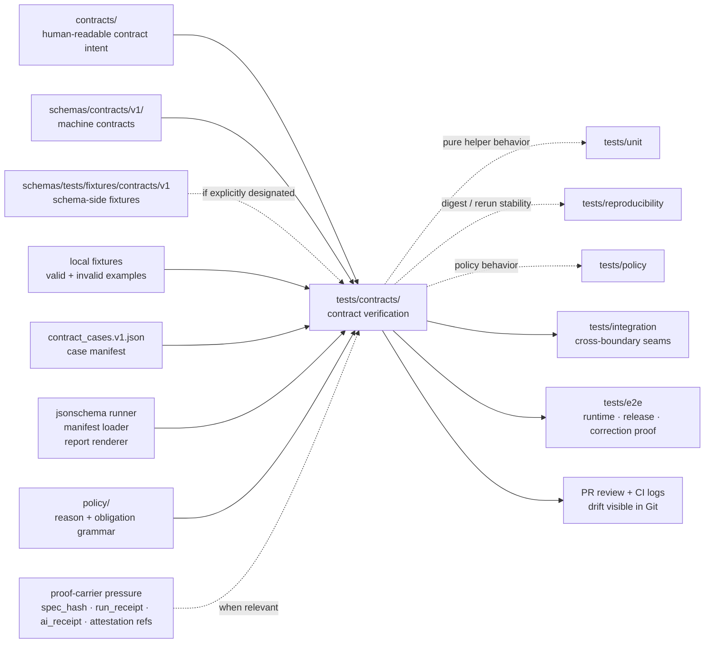

<!-- [KFM_META_BLOCK_V2]
doc_id: kfm://doc/NEEDS-VERIFICATION-tests-contracts-readme
title: tests/contracts
type: standard
version: v1
status: draft
owners: @bartytime4life (NEEDS VERIFICATION on active branch)
created: NEEDS-VERIFICATION-YYYY-MM-DD
updated: 2026-04-23
policy_label: NEEDS-VERIFICATION-public-or-internal
related: [../README.md, ../accessibility/README.md, ../catalog/README.md, ../ci/README.md, ../e2e/README.md, ../integration/README.md, ../policy/README.md, ../reproducibility/README.md, ../unit/README.md, ../../contracts/README.md, ../../schemas/README.md, ../../schemas/contracts/README.md, ../../schemas/contracts/v1/README.md, ../../schemas/tests/README.md, ../../policy/README.md, ../../tools/validators/README.md, ../../tools/attest/README.md, ../../docs/standards/README.md, ../../.github/workflows/README.md, ../../.github/PULL_REQUEST_TEMPLATE.md, ../../.github/CODEOWNERS]
tags: [kfm, tests, contracts, verification, schema-drift, fail-closed]
notes: [doc_id, created date, policy label, executable inventory, fixture inventory, and merge-blocking workflow status require active-branch verification; this README is README-like and standard-doc formatted; tests/contracts consumes contract truth and must not become a second schema, contract, or policy authority]
[/KFM_META_BLOCK_V2] -->

<a id="top"></a>

# `tests/contracts/`

Contract-facing verification family for KFM schema drift, valid/invalid example packs, and fail-closed object validation.

<div align="left">


</div>

| Field | Value |
|---|---|
| **Status** | `experimental` |
| **Owners** | `@bartytime4life` — NEEDS VERIFICATION against active-branch `CODEOWNERS` |
| **Path** | `tests/contracts/README.md` |
| **Repo fit** | downstream of contract/schema/policy authority; upstream of broader integration, runtime proof, release, correction, and review confidence |
| **Quick jumps** | [Scope](#scope) · [Repo fit](#repo-fit) · [Accepted inputs](#accepted-inputs) · [Exclusions](#exclusions) · [Current evidence posture](#current-evidence-posture) · [Directory tree](#directory-tree) · [Quickstart](#quickstart) · [Usage](#usage) · [Diagram](#diagram) · [Reference tables](#reference-tables) · [Task list / definition of done](#task-list--definition-of-done) · [FAQ](#faq) · [Appendix](#appendix) |

> [!IMPORTANT]
> `tests/contracts/` verifies machine-readable contract behavior. It does **not** own contract meaning, schema authority, policy logic, release approval, or publication state.

> [!TIP]
> Keep the split visible in every change:
>
> - `contracts/` and `schemas/contracts/` declare authority-facing contract shape and intent.
> - `policy/` owns decision grammar, obligations, denial logic, and fail-safe posture.
> - `tests/contracts/` proves that declared contract objects accept known-good examples and reject known-bad examples.

> [!CAUTION]
> Do not claim executable depth, fixture coverage, workflow enforcement, or merge-blocking status from this README alone. Those are **NEEDS VERIFICATION** until the checked-out branch proves files, runners, and workflow settings directly.

---

## Scope

`tests/contracts/` is the contract-facing verification family inside KFM’s governed `tests/` surface.

It exists to answer one narrow question well:

> Do KFM’s declared contract objects behave as reviewable, machine-checkable boundaries under both valid and invalid examples?

This directory is the right place for shape validation, fixture polarity, contract-drift detection, and first-wave negative cases. It is not the right place for broad runtime behavior, policy decision ownership, source ingestion, release signing, or UI implementation.

### Primary responsibilities

- Validate contract objects against their declared schema or contract source.
- Keep valid and invalid examples small, readable, and reviewable.
- Make failure mode intent visible in filenames, manifests, and test reports.
- Catch contract drift before integration, e2e, Focus Mode, Evidence Drawer, or publication layers can build confidence on unstable payloads.
- Escalate broader seams to the correct sibling family instead of stretching this directory beyond its burden.

### Success posture

A good contract test proves more than “the happy path parses.” It proves that the contract boundary can say **no** clearly, early, and with enough detail for review.

[Back to top](#top)

---

## Repo fit

| Surface | Relationship | Why it matters |
|---|---|---|
| [`../README.md`](../README.md) | parent `tests/` index | Keeps contract tests inside the governed verification lattice. |
| [`../../contracts/README.md`](../../contracts/README.md) | upstream contract intent | Human-readable contract law belongs there, not here. |
| [`../../schemas/README.md`](../../schemas/README.md) | upstream schema boundary | Schema-home authority remains branch-sensitive and must not be duplicated here. |
| [`../../schemas/contracts/README.md`](../../schemas/contracts/README.md) | upstream machine-contract family | Contract tests consume these shapes when designated. |
| [`../../schemas/contracts/v1/README.md`](../../schemas/contracts/v1/README.md) | upstream versioned schema lane | First-wave object families should align with versioned machine contracts. |
| [`../../schemas/tests/README.md`](../../schemas/tests/README.md) | adjacent fixture scaffold | Nested schema-side fixtures may support this lane but do not automatically replace repo-wide tests. |
| [`../../policy/README.md`](../../policy/README.md) | upstream policy authority | Reason codes, obligations, and deny-by-default logic belong there. |
| [`../policy/README.md`](../policy/README.md) | sibling policy tests | Use this when the main burden is decision grammar rather than object shape. |
| [`../unit/`](../unit/) | sibling local tests | Use this for pure helper behavior. |
| [`../integration/`](../integration/) | sibling seam tests | Use this when route, resolver, validator, or service boundaries interact. |
| [`../reproducibility/`](../reproducibility/) | sibling determinism tests | Use this for rerun stability, digest stability, and receipt comparison. |
| [`../accessibility/`](../accessibility/) | sibling trust-surface tests | Use this when non-color-only, keyboard, screen-reader, or reduced-motion trust cues are the burden. |
| [`../e2e/`](../e2e/) | sibling whole-path tests | Use this for runtime proof, release assembly, correction lineage, and public behavior. |
| [`../../tools/validators/README.md`](../../tools/validators/README.md) | validator helper lane | Reusable validation logic belongs there unless it is narrowly test-local. |
| [`../../tools/attest/README.md`](../../tools/attest/README.md) | attestation helper lane | Signing, verification helpers, and proof-pack mechanics are adjacent, not owned here. |
| [`../../.github/workflows/README.md`](../../.github/workflows/README.md) | workflow lane | Workflow docs may describe orchestration, but branch settings prove enforcement. |

### Boundary rule

`tests/contracts/` should **consume and verify** contract truth, not quietly become a second or third contract authority.

[Back to top](#top)

---

## Accepted inputs

The following belong here when they are small, explicit, and tied to declared contract families:

- contract-validation test files such as `test_*_schema.py`;
- manifest-driven contract cases such as `manifests/contract_cases.v1.json`;
- tiny valid and invalid fixtures when this directory is the designated fixture home;
- local test helpers that are too small and contract-specific to promote into `tools/validators/`;
- readable reports produced by contract test helpers;
- README updates that explain contract-test placement, drift risk, and negative-case expectations.

### Good fixture candidates

Use names that preserve family, polarity, and intent:

| Good example | Why it helps |
|---|---|
| `runtime_response_envelope.answer.valid.json` | family + outcome + polarity |
| `runtime_response_envelope.missing_audit_ref.invalid.json` | failure reason is visible in review |
| `decision_envelope.missing_reason.invalid.json` | policy-posture failure is explicit |
| `evidence_bundle.empty_refs.invalid.json` | evidence support failure is unambiguous |
| `correction_notice.supersession.valid.json` | correction lineage remains visible |
| `run_receipt.missing_spec_hash.invalid.json` | proof-carrier failure is reviewable |
| `ai_receipt.unapproved_model_context.invalid.json` | model-mediated edge case is named rather than hidden |

Avoid vague buckets such as `misc/`, `contract_v2/`, `examples_new/`, or `helpers_everything/`.

[Back to top](#top)

---

## Exclusions

The following do **not** belong here as authoritative sources of truth:

| Do not put this here | Put it here instead | Reason |
|---|---|---|
| canonical schemas, OpenAPI files, vocabularies, or standards profiles | `../../schemas/`, `../../schemas/contracts/`, `../../contracts/` | Tests consume authority; they do not define it. |
| policy bundles, reviewer-role maps, obligation registries, or reason-code ownership | `../../policy/` and `../policy/` | Decision grammar must stay isolated from shape-only checks. |
| runtime application code, ingestion workers, evidence resolvers, UI components, or catalog services | `../../apps/`, `../../packages/`, `../../tools/`, or repo-native equivalents | Runtime behavior belongs outside the contract-test lane. |
| release manifests, receipts, proof packs, SBOMs, or promoted artifacts as primary records | governed release, receipt, proof, and publication paths | Contract tests may validate examples; they do not store release truth. |
| signing keys, attestation transport, or secret custody | `../../tools/attest/` plus secured platform controls | Trust-root handling must stay outside test fixtures. |
| large raw datasets, provider mirrors, branch-local dumps, or scrape caches | governed data lifecycle zones or ignored local paths | Contract tests should stay tiny and reviewable. |
| long-form architecture rationale or incident playbooks | `../../docs/` | This README should route, not replace, doctrine and runbooks. |

[Back to top](#top)

---

## Current evidence posture

| Claim | Label | Evidence posture |
|---|---:|---|
| `tests/contracts/` is intended as a contract-facing verification family. | CONFIRMED | Repeated repo-facing docs describe this role. |
| Contract tests should consume, not own, contract truth. | CONFIRMED | KFM documentation repeatedly separates contract/schema authority from test execution. |
| First-wave families include `RuntimeResponseEnvelope`, `EvidenceBundle`, `DecisionEnvelope`, `CorrectionNotice`, `ReleaseManifest`, `SourceDescriptor`, and `DatasetVersion`. | CONFIRMED / PROPOSED | Confirmed as documented contract backlog and test priority; exact branch inventory still needs verification. |
| Manifest-driven contract validation is the preferred first executable wave. | PROPOSED | Strongly supported by prior README drafts and implementation planning, but active-branch files must be checked. |
| This directory is merge-blocking in CI. | UNKNOWN | Workflow enforcement requires direct branch and platform verification. |
| Exact fixture home is settled. | NEEDS VERIFICATION | KFM materials distinguish `tests/contracts/`, `schemas/tests/fixtures/contracts/v1/`, and possible shared fixture homes. |

[Back to top](#top)

---

## Directory tree

Documented target shape for a first executable wave. Treat files marked `NEEDS VERIFICATION` as branch-sensitive until the real checkout is inspected.

```text
tests/contracts/
├── README.md
├── manifests/
│   └── contract_cases.v1.json                 # NEEDS VERIFICATION
├── validators/
│   ├── jsonschema_runner.py                    # NEEDS VERIFICATION
│   ├── manifest.py                             # NEEDS VERIFICATION
│   ├── manifest_cli.py                         # NEEDS VERIFICATION
│   └── report.py                               # NEEDS VERIFICATION
├── fixtures/                                   # only if this is the designated local fixture home
│   ├── correction/
│   ├── data/
│   ├── evidence/
│   ├── policy/
│   ├── release/
│   ├── runtime/
│   └── source/
└── test_contract_manifest_wave_01.py           # NEEDS VERIFICATION
```

Adjacent schema-side fixture shape that may be consumed by this lane when explicitly designated:

```text
schemas/tests/fixtures/contracts/v1/
├── valid/
└── invalid/
```

> [!WARNING]
> Do not duplicate fixture sets across both locations unless an ADR or README-level placement rule explains which copy is canonical, which copy is illustrative, and how drift is detected.

[Back to top](#top)

---

## Quickstart

### 1. Inspect before changing

```bash
# inspect this family exactly as the checked-out branch exposes it
find tests/contracts -maxdepth 4 -type f | sort

# inspect sibling test-family docs to keep placement honest
sed -n '1,220p' tests/README.md
sed -n '1,220p' tests/accessibility/README.md
sed -n '1,220p' tests/catalog/README.md
sed -n '1,220p' tests/ci/README.md
sed -n '1,220p' tests/e2e/README.md
sed -n '1,220p' tests/integration/README.md
sed -n '1,220p' tests/policy/README.md
sed -n '1,220p' tests/reproducibility/README.md
sed -n '1,220p' tests/unit/README.md
```

### 2. Inspect authority and fixture neighbors

```bash
# inspect contract, schema, policy, validator, and workflow neighbors
sed -n '1,260p' contracts/README.md
sed -n '1,220p' schemas/README.md
sed -n '1,260p' schemas/contracts/README.md
sed -n '1,260p' schemas/contracts/v1/README.md
sed -n '1,220p' schemas/tests/README.md
sed -n '1,220p' schemas/tests/fixtures/contracts/v1/README.md
sed -n '1,220p' policy/README.md
sed -n '1,220p' tools/validators/README.md
sed -n '1,220p' tools/attest/README.md
sed -n '1,220p' .github/workflows/README.md
sed -n '1,220p' .github/PULL_REQUEST_TEMPLATE.md
sed -n '1,220p' .github/CODEOWNERS
```

### 3. Locate valid/invalid fixtures before assuming a home

```bash
find tests/contracts/fixtures -maxdepth 4 -type f 2>/dev/null | sort
find schemas/tests/fixtures/contracts -maxdepth 5 -type f 2>/dev/null | sort
find tests/fixtures/contracts -maxdepth 5 -type f 2>/dev/null | sort
```

### 4. Search for contract vocabulary before inventing names

```bash
grep -RIn \
  -e 'SourceDescriptor' \
  -e 'IngestReceipt' \
  -e 'ValidationReport' \
  -e 'DatasetVersion' \
  -e 'CatalogClosure' \
  -e 'DecisionEnvelope' \
  -e 'ReviewRecord' \
  -e 'ReleaseManifest' \
  -e 'EvidenceBundle' \
  -e 'RuntimeResponseEnvelope' \
  -e 'CorrectionNotice' \
  -e 'ABSTAIN' \
  -e 'DENY' \
  -e 'ERROR' \
  -e 'spec_hash' \
  -e 'run_receipt' \
  -e 'ai_receipt' \
  tests contracts schemas policy data tools docs .github 2>/dev/null || true
```

### 5. Run the documented first wave only after files exist

```bash
# full family — run only after the repo proves pytest is the active runner
pytest tests/contracts -q

# manifest-only first wave — run only if the file exists
pytest tests/contracts/test_contract_manifest_wave_01.py -q

# direct CLI execution — run only if manifest_cli.py exists
python -m tests.contracts.validators.manifest_cli \
  tests/contracts/manifests/contract_cases.v1.json
```

> [!CAUTION]
> Do not assume that adding files under `tests/contracts/` automatically makes them merge-blocking. The workflow lane and branch protection settings must prove that separately.

[Back to top](#top)

---

## Usage

### Placement rules

Use `tests/contracts/` when the main burden is:

- required field presence;
- allowed enum or finite outcome shape;
- valid/invalid example polarity;
- schema drift detection;
- contract-family manifest execution;
- reviewer-readable contract failure summaries;
- explicit rejection of malformed trust-bearing objects.

Escalate elsewhere when the burden changes:

| Burden | Better home |
|---|---|
| reason codes, obligations, reviewer roles, allow/deny/abstain semantics | `../policy/` and `../../policy/` |
| route behavior, resolver behavior, or service wiring | `../integration/` |
| request-time governed outcomes | `../e2e/runtime_proof/` |
| release assembly or promotion completeness | `../e2e/release_assembly/` |
| correction, supersession, stale-visible behavior | `../e2e/correction/` |
| deterministic helper behavior | `../unit/` |
| digest stability or rerun comparison | `../reproducibility/` |
| trust-visible UI operability | `../accessibility/` |

### Failure philosophy

A KFM contract case should prefer:

- explicit rejection over permissive coercion;
- named invalid examples over hidden assumptions;
- visible negative states over flattened “success”;
- one real wave over pseudo-complete scaffolding;
- stable, reviewable examples over clever test magic;
- contract-carried proof over free-text claims that a check “must have happened.”

[Back to top](#top)

---

## Diagram



[Back to top](#top)

---

## Reference tables

### Candidate first cases

| Family | Why it belongs early | Minimum negative case |
|---|---|---|
| `RuntimeResponseEnvelope` | Trust-bearing runtime object for `ANSWER`, `ABSTAIN`, `DENY`, and `ERROR`. | missing outcome/result, missing audit reference, unsupported state |
| `EvidenceBundle` | Keeps evidence inspectable at point of use. | empty evidence refs, missing lineage, missing rights/sensitivity posture |
| `DecisionEnvelope` | Bridges policy posture into machine-readable outcomes. | missing reason, invalid outcome, missing obligation structure |
| `CorrectionNotice` | Preserves correction lineage and replacement-safe trust cues. | missing affected release, missing replacement or withdrawal linkage |
| `ReleaseManifest` | Binds outward release to proof and rollback posture. | missing release refs, missing proof refs, missing correction posture |
| `SourceDescriptor` | Keeps source-edge identity explicit before downstream derivation. | missing source kind, missing rights basis, missing freshness basis |
| `DatasetVersion` | Preserves versioned identity and lineage before promotion. | missing version lineage, missing temporal basis, missing status |

### Starter wave strategy

| Wave | Families | Why this order helps |
|---|---|---|
| Wave 01 — core trust surfaces | `DecisionEnvelope`, `EvidenceBundle`, `RuntimeResponseEnvelope`, `CorrectionNotice`, `ReleaseManifest` | Gives policy, evidence, runtime outcome, correction, and release review a shared base. |
| Wave 02 — substrate identity | `SourceDescriptor`, `DatasetVersion` | Keeps source-edge and versioned data identity stable before broader source intake. |
| Wave 03 — intake and review | `IngestReceipt`, `ValidationReport`, `CatalogClosure`, `ReviewRecord`, `ProjectionBuildReceipt` | Adds pipeline and review pressure once fixture-home and schema-home rules are explicit. |
| Wave 04 — proof carriers | `run_receipt`, `ai_receipt`, attestation-linked examples | Adds higher-order proof pressure only where the contract under test truly depends on it. |

### Family placement matrix

| If the work mainly tests… | Primary home | Why |
|---|---|---|
| object shape and required fields | `tests/contracts/` | Keep machine-contract truth explicit and reviewable. |
| policy result logic, reason codes, or obligation vocab | `tests/policy/` | Decision grammar should stay isolated when possible. |
| pure local helper behavior | `tests/unit/` | Cheapest convincing proof wins. |
| rerun consistency, `spec_hash` stability, or receipt comparison | `tests/reproducibility/` | Determinism is its own verification burden. |
| keyboard, motion, screen-reader, or non-color-only trust cues | `tests/accessibility/` | Accessibility is a first-class trust burden. |
| route behavior across real boundaries | `tests/integration/` | This family exists for cross-boundary proof. |
| full runtime/public behavior, release proof, promotion proof, or correction lineage | `tests/e2e/` | That burden is broader than one contract or integration slice. |
| signing mechanics or attestation transport | `tools/attest/` plus adjacent tests | Signing helpers should stay reusable and separate from contract tests. |

[Back to top](#top)

---

## Task list / definition of done

A contract-test change is review-ready when:

- [ ] the contract family is named using current KFM vocabulary, not a new synonym;
- [ ] every valid fixture has a matching contract/schema reference;
- [ ] every invalid fixture names the intended failure;
- [ ] the test verifies both acceptance and rejection;
- [ ] failures produce reviewer-readable output;
- [ ] fixture location is explicit and does not duplicate another canonical fixture home;
- [ ] policy logic is linked but not redefined here;
- [ ] receipt/proof references are tested only when the contract under test requires them;
- [ ] sibling-family escalation is documented for integration, e2e, policy, reproducibility, accessibility, or unit burdens;
- [ ] README links remain relative from `tests/contracts/README.md`;
- [ ] no claim is made that the check is merge-blocking unless workflow and branch-protection evidence proves it.

### Pre-merge review questions

1. Does this test consume contract truth from the right authority surface?
2. Does the negative case fail for the intended reason?
3. Would a reviewer understand the contract drift from the filename and failure text?
4. Is any schema, policy, proof, receipt, or release object being stored in the wrong place?
5. Did the change update adjacent docs when it changed placement rules or object-family expectations?

[Back to top](#top)

---

## FAQ

### Why not keep all valid/invalid examples directly under `tests/contracts/`?

Because KFM has adjacent schema-side fixture scaffolds and broader proof lanes. Keep examples here only when this is the designated contract-test fixture home. Otherwise consume fixtures from their declared home and make that relationship explicit.

### Should this README define final JSON keys?

Only when the mounted schema body, fixture, or test proves them. This file can describe doctrinal minimums and starter wave expectations, but it should not smuggle placeholder keys into implemented fact.

### Is a passing contract test enough for publication?

No. Contract validation is an early gate. Publication still depends on evidence resolution, policy checks, rights/sensitivity posture, catalog/proof closure, review state, promotion decision, release manifest, and rollback/correction readiness.

### What should happen when a contract shape changes?

Add or update the schema/contract authority first, update valid and invalid fixtures, add a migration note or compatibility window when needed, then update contract tests. Breaking changes should not be hidden inside test helper behavior.

[Back to top](#top)

---

## Appendix

<details>
<summary><strong>Inspection checklist for maintainers</strong></summary>

Use this before revising executable content:

```bash
# prove the repo and branch
git rev-parse --show-toplevel
git branch --show-current
git status --short

# prove this directory
find tests/contracts -maxdepth 5 -type f | sort

# prove schema authority and fixture homes
find schemas/contracts/v1 -maxdepth 4 -type f | sort
find schemas/tests/fixtures/contracts -maxdepth 6 -type f 2>/dev/null | sort
find tests/contracts/fixtures -maxdepth 6 -type f 2>/dev/null | sort

# prove workflow callers
find .github/workflows -maxdepth 2 -type f | sort
grep -RIn "tests/contracts\|contract_cases\|test_contract_manifest" .github/workflows 2>/dev/null || true

# prove owner routing
sed -n '1,240p' .github/CODEOWNERS
```

</details>

<details>
<summary><strong>Anti-patterns to reject</strong></summary>

- Adding only happy-path examples.
- Renaming project concepts into generic industry terms.
- Treating `tests/contracts/` as the schema home.
- Treating policy result logic as object-shape validation.
- Storing large source payloads as contract fixtures.
- Claiming CI enforcement because a command exists locally.
- Letting a helper auto-coerce invalid payloads into validity.
- Hiding invalid cases under vague names such as `bad.json`.
- Publishing or promoting from this directory.
- Updating tests without updating the contract/schema authority they consume.

</details>

[Back to top](#top)
