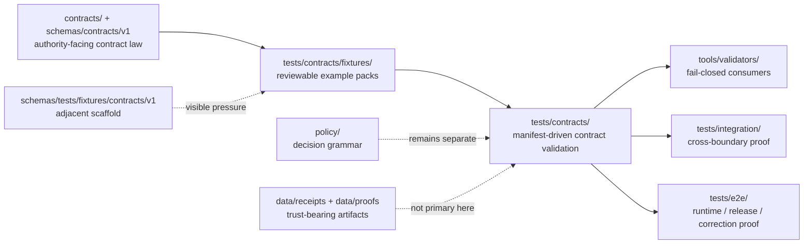

<!-- [KFM_META_BLOCK_V2]
doc_id: kfm://doc/NEEDS_VERIFICATION__tests_contracts_fixtures_readme
title: tests/contracts/fixtures
type: standard
version: v1
status: draft
owners: @bartytime4life
created: NEEDS_VERIFICATION__YYYY-MM-DD
updated: NEEDS_VERIFICATION__YYYY-MM-DD
policy_label: NEEDS_VERIFICATION__public_or_internal
related: [../README.md, ../../README.md, ../../../README.md, ../../../contracts/README.md, ../../../schemas/README.md, ../../../schemas/contracts/README.md, ../../../schemas/contracts/v1/README.md, ../../../schemas/tests/README.md, ../../../schemas/tests/fixtures/contracts/v1/README.md, ../../../policy/README.md, ../../../docs/standards/README.md, ../../../data/receipts/README.md, ../../../data/proofs/README.md, ../../../tools/validators/README.md, ../../../tools/attest/README.md, ../../../.github/CODEOWNERS, ../../../.github/workflows/README.md]
tags: [kfm, tests, contracts, fixtures, valid-invalid, schema-drift, fail-closed]
notes: [Owners are grounded at the broader /tests/ scope in surfaced repo-facing docs; exact leaf subtree, created/updated dates, policy label, and authoritative fixture-home decision remain branch-level verification items. This README is intentionally fixture-facing and does not claim mounted-repo parity, merge-blocking workflow enforcement, or a fully populated subtree.]
[/KFM_META_BLOCK_V2] -->

<a id="top"></a>

# `tests/contracts/fixtures/`

Deterministic, reviewable fixture lane for contract-facing examples consumed by `tests/contracts/` without turning fixtures into a second contract authority.

> [!NOTE]
> **Status:** `experimental`  
> **Owners:** `@bartytime4life` *(confirmed at the broader `/tests/` scope in surfaced repo-facing docs; leaf-specific assignment should still be rechecked before merge)*  
> **Path:** `tests/contracts/fixtures/README.md`  
> **Repo fit:** child fixture index beneath [`../README.md`](../README.md) inside the broader governed verification surface at [`../../README.md`](../../README.md)  
> **Quick jumps:** [Scope](#scope) · [Repo fit](#repo-fit) · [Current verified snapshot](#current-verified-snapshot) · [Accepted inputs](#accepted-inputs) · [Exclusions](#exclusions) · [Directory tree](#directory-tree) · [Quickstart](#quickstart) · [Usage](#usage) · [Diagram](#diagram) · [Operating tables](#operating-tables) · [Task list](#task-list--definition-of-done) · [FAQ](#faq) · [Appendix](#appendix)


> [!IMPORTANT]
> This README is **fixture-bounded** and **authority-bounded**. It documents how contract-facing fixtures should behave and where they fit. It does **not** prove that the active checkout already contains a populated `tests/contracts/fixtures/` subtree, runnable leaf-specific validators, or merge-blocking workflow coverage.

> [!WARNING]
> **Do not settle fixture-home law here by prose alone.** Current surfaced material shows three adjacent pressures that must stay visible until the branch proves one canonical pattern:
>
> - this target lane: `tests/contracts/fixtures/`
> - the visible schema-side scaffold: `schemas/tests/fixtures/contracts/v1/`
> - an alternative root-side shared-fixture shape sometimes discussed as `tests/fixtures/contracts/v1/`
>
> This file should explain the tension, not hide it.

## Scope

`tests/contracts/fixtures/` exists for **contract-facing example material** whose main burden is:

- proving valid and invalid object shape;
- making failure reasons reviewable;
- keeping fixture naming deterministic;
- giving `tests/contracts/` stable inputs for manifest-driven validation;
- preserving negative-state vocabulary such as `ABSTAIN`, `DENY`, and `ERROR` when a contract family depends on it.

This lane is the right home when the main question is:

> “Does this example object conform to, or fail against, a declared contract family in a legible, reviewable, fail-closed way?”

It is **not** the right home when the real burden is:

- policy authorship,
- live runtime behavior,
- route or UI handoff,
- release attestation,
- receipt/proof persistence,
- or end-to-end publication choreography.

## Repo fit

### Path + upstream/downstream surfaces

| Direction | Surface | Why it matters |
| --- | --- | --- |
| Parent contract family | [`../README.md`](../README.md) | Defines `tests/contracts/` as the contract-facing verification family and sets the runner, CLI, and authority posture for this child lane. |
| Broader tests boundary | [`../../README.md`](../../README.md) | Keeps this leaf subordinate to the repo-wide governed verification model. |
| Root posture | [`../../../README.md`](../../../README.md) | Anchors this lane in the repo’s broader evidence-first, governed documentation posture. |
| Contract meaning | [`../../../contracts/README.md`](../../../contracts/README.md) | Human-readable contract law belongs upstream from fixtures. |
| Schema authority | [`../../../schemas/README.md`](../../../schemas/README.md), [`../../../schemas/contracts/README.md`](../../../schemas/contracts/README.md), [`../../../schemas/contracts/v1/README.md`](../../../schemas/contracts/v1/README.md) | Fixtures should pressure-test machine authority, not replace it. |
| Schema-side fixture scaffold | [`../../../schemas/tests/README.md`](../../../schemas/tests/README.md), [`../../../schemas/tests/fixtures/contracts/v1/README.md`](../../../schemas/tests/fixtures/contracts/v1/README.md) | Nearby scaffold pressure must remain visible while fixture-home authority is unresolved. |
| Policy authority | [`../../../policy/README.md`](../../../policy/README.md) | Decision grammar and deny-by-default behavior remain policy-owned. |
| Receipt / proof boundaries | [`../../../data/receipts/README.md`](../../../data/receipts/README.md), [`../../../data/proofs/README.md`](../../../data/proofs/README.md) | Fixtures may reference these object families, but they are not the storage home for primary trust objects. |
| Validator consumers | [`../../../tools/validators/README.md`](../../../tools/validators/README.md), [`../../../tools/attest/README.md`](../../../tools/attest/README.md) | This lane feeds consumers; it does not become the helper implementation lane. |
| Workflow boundary | [`../../../.github/workflows/README.md`](../../../.github/workflows/README.md) | Workflow orchestration may call contract checks, but merge-gate depth still needs branch/platform verification. |
| Ownership boundary | [`../../../.github/CODEOWNERS`](../../../.github/CODEOWNERS) | Broader `/tests/` ownership is surfaced there and should not be overstated here. |

### Repo-fit summary

| Question | Answer |
| --- | --- |
| What belongs here? | Small, deterministic, contract-facing fixtures used by `tests/contracts/` to prove valid/invalid object behavior. |
| What does not belong here? | Canonical schemas, policy bundles, release proofs, route/runtime behavior, or live provider mirrors. |
| Why is this not a second contract home? | `contracts/` and `schemas/contracts/` remain authority-facing; this leaf only supplies reviewable examples. |
| Why is this not `tests/e2e/`? | Runtime, release, and correction proof exceed this lane’s burden. |
| Why keep schema-side scaffold references visible? | Because fixture-home ambiguity is a real design pressure and hiding it would create drift. |

## Current verified snapshot

> [!NOTE]
> The table below captures the strongest bounded claims this README can make from surfaced repo-facing material and adjacent doctrine. Anything inventory-sensitive beyond that still needs direct branch verification.

| Item | Status | Why it matters here |
| --- | --- | --- |
| `tests/contracts/` is a first-class verification family | **CONFIRMED** | This child lane should read as a narrow extension of a real parent family, not as a generic data bucket. |
| The parent family is manifest-driven and CLI-addressable | **CONFIRMED** | Fixture guidance here should support the parent runner and discovery model. |
| `schemas/contracts/v1/` exposes visible first-wave families: `common/`, `correction/`, `data/`, `evidence/`, `policy/`, `release/`, `runtime/`, and `source/` | **CONFIRMED** | Fixture organization can refer to real adjacent family names without inventing new ones. |
| `schemas/tests/fixtures/contracts/v1/{valid,invalid}` exists as a visible schema-side scaffold | **CONFIRMED** | This lane must not pretend fixture-home law is already settled. |
| Thin-slice material already points to contract fixtures under `tests/contracts/fixtures/evidence/` and `tests/contracts/fixtures/runtime/` | **CONFIRMED in surfaced thin slices** | This target README can safely describe those as example subpaths without upgrading them to mounted-branch proof. |
| `/tests/` ownership is assigned to `@bartytime4life` in surfaced repo-facing docs | **CONFIRMED at family scope** | Safe enough for the owners line here, but not proof of leaf-specific override rules. |
| Exact `tests/contracts/fixtures/` subtree contents | **NEEDS VERIFICATION** | Do not claim more than the target README path and surfaced example subpaths. |
| Authoritative fixture-home decision between root-side vs schema-side patterns | **CONFLICTED / NEEDS VERIFICATION** | This is the main ambiguity the README must keep visible. |
| Exact required checks, branch protection, and merge-blocking depth | **UNKNOWN / NEEDS VERIFICATION** | This leaf should not overstate CI enforcement. |

## Accepted inputs

Only inputs whose main burden is **contract-facing example proof** belong here.

| Input class | Examples | Why it belongs here |
| --- | --- | --- |
| Valid fixtures | minimal `*.json`, `*.yaml`, `*.ndjson` payloads that should pass a declared contract | Gives reviewers a stable “known-good” object to inspect. |
| Invalid fixtures | payloads named by failure reason such as `missing_integrity`, `missing_evidence_refs`, `bad_enum_member` | Keeps negative-path behavior first-class and reviewable. |
| Family-level manifests or discovery references | `tests/contracts/manifests/contract_cases.v1.json` or equivalent case indexes | Keeps fixture discovery explicit rather than hidden in test code. |
| Small golden outputs | compact expected error summaries or normalized case metadata | Useful only when they make contract failures easier to review. |
| Versioned example packs | fixtures with explicit schema-version or family-version fields | Makes later migration and compatibility work auditable. |
| Deterministic contract examples | no-network, no-clock-jitter, public-safe payloads | Contract tests should be repeatable and clone-safe. |

### Input rules

1. Prefer one valid and one invalid example before broad subtree growth.
2. Name invalid fixtures by **failure reason**, not by vague adjectives.
3. Keep fixtures deterministic; no live fetches, timestamps, or hidden environment dependence.
4. Preserve explicit schema-version fields when the family supports them.
5. Keep examples small enough to review in Git without scrolling through provider dumps.
6. When a proof-carrying object is involved, treat malformed proof carriers as first-class invalid cases.
7. Do not invent new object-family names here when adjacent contract families already exist.

## Exclusions

| Does **not** belong here | Better home | Why |
| --- | --- | --- |
| Canonical schema files | [`../../../schemas/README.md`](../../../schemas/README.md), [`../../../schemas/contracts/README.md`](../../../schemas/contracts/README.md) | Fixtures pressure-test schema authority; they do not replace it. |
| Human-readable contract law | [`../../../contracts/README.md`](../../../contracts/README.md) | Meaning and scope remain upstream from examples. |
| Policy bundles, reason-code law, or allow/deny ownership | [`../../../policy/README.md`](../../../policy/README.md) and [`../../policy/README.md`](../../policy/README.md) | This lane may support policy tests, but policy remains the source of truth. |
| Release manifests, proofs, or receipt stores as primary records | [`../../../data/receipts/README.md`](../../../data/receipts/README.md), [`../../../data/proofs/README.md`](../../../data/proofs/README.md) | A fixture example is not the authoritative trust object. |
| Route/runtime behavior, outward trust responses, or review actions | [`../../integration/README.md`](../../integration/README.md), [`../../e2e/README.md`](../../e2e/README.md) | Broader seams belong outside this narrow contract-facing lane. |
| Workflow YAML, branch rules, or gate sequencing | [`../../../.github/workflows/README.md`](../../../.github/workflows/README.md) | Orchestration belongs at the workflow boundary. |
| Live provider snapshots or scrape caches | governed data lanes or ignored local paths | Public fixture surfaces should stay tiny, rights-conscious, and clone-safe. |
| Attestation helper implementation | [`../../../tools/attest/README.md`](../../../tools/attest/README.md) | This lane proves examples; it does not own helper code. |

> [!CAUTION]
> Do not dump provider responses here just because they are easy to fetch.  
> The goal is the **smallest meaningful proof slice**, not the largest convenient archive.

## Directory tree

### Target path for this README

```text
tests/contracts/
└── fixtures/
    └── README.md
```

That is the only path this document treats as its direct home.

<details>
<summary><strong>Surfaced example subpaths</strong> (<strong>CONFIRMED in thin slices, not mounted-branch proof</strong>)</summary>

```text
tests/contracts/fixtures/
├── evidence/
│   └── kfm_geo_manifest.valid.json
└── runtime/
    ├── geospatial_review_action_request.promote.json
    ├── geospatial_review_action_response.promote.ok.json
    └── geospatial_review_action_response.expected_mismatch.json
```

Working rule: treat these as **example-bearing signals** from surfaced thin slices, not as a claim that the current checkout necessarily contains a complete subtree at those exact paths.

</details>

<details>
<summary><strong>Adjacent scaffold pressure</strong> (<strong>CONFIRMED</strong>)</summary>

```text
schemas/tests/
└── fixtures/
    └── contracts/
        └── v1/
            ├── valid/
            └── invalid/
```

Working rule: keep this nearby scaffold visible in prose until the branch proves whether it is mirror-only, illustrative-only, or runnable input.

</details>

## Quickstart

### Safe inspection commands

These commands are safe because they inspect surfaced boundaries without claiming hidden automation:

```bash
# inspect this target lane if it exists on the checked-out branch
find tests/contracts/fixtures -maxdepth 4 -type f 2>/dev/null | sort

# inspect the parent family and broader tests surface
sed -n '1,260p' tests/contracts/README.md 2>/dev/null || true
sed -n '1,220p' tests/README.md 2>/dev/null || true
sed -n '1,220p' tests/integration/README.md 2>/dev/null || true
sed -n '1,220p' tests/e2e/README.md 2>/dev/null || true
sed -n '1,220p' tests/policy/README.md 2>/dev/null || true
sed -n '1,220p' tests/reproducibility/README.md 2>/dev/null || true

# inspect adjacent contract / schema / fixture / workflow doctrine
sed -n '1,260p' contracts/README.md 2>/dev/null || true
sed -n '1,260p' schemas/README.md 2>/dev/null || true
sed -n '1,260p' schemas/contracts/README.md 2>/dev/null || true
sed -n '1,260p' schemas/contracts/v1/README.md 2>/dev/null || true
sed -n '1,220p' schemas/tests/README.md 2>/dev/null || true
sed -n '1,220p' schemas/tests/fixtures/contracts/v1/README.md 2>/dev/null || true
sed -n '1,220p' policy/README.md 2>/dev/null || true
sed -n '1,220p' .github/workflows/README.md 2>/dev/null || true
sed -n '1,220p' .github/CODEOWNERS 2>/dev/null || true
```

### Candidate fixture-home inspection

Use this before assuming where valid/invalid packs truly live:

```bash
find tests/contracts/fixtures -maxdepth 4 -type f 2>/dev/null | sort
find schemas/tests/fixtures/contracts -maxdepth 4 -type f 2>/dev/null | sort
find tests/fixtures/contracts -maxdepth 4 -type f 2>/dev/null | sort
```

### Run the parent family

This child lane feeds the parent family; it does not replace it:

```bash
# full parent family
pytest tests/contracts -q

# manifest-first wave
pytest tests/contracts/test_contract_manifest_wave_01.py -q

# direct manifest CLI execution
python -m tests.contracts.validators.manifest_cli \
  tests/contracts/manifests/contract_cases.v1.json
```

> [!CAUTION]
> Do **not** assume that adding files under `tests/contracts/fixtures/` automatically makes them merge-blocking.  
> The strongest surfaced evidence supports documentation, a runner shape, and a CLI shape — not a directly verified merge-protected workflow gate for this child lane.

## Usage

### Placement rules

Use `tests/contracts/fixtures/` when the main job is:

- prove **object shape**,
- prove **named invalid cases**,
- feed the **parent contract runner**,
- or keep **family examples** reviewable.

Move out of this lane when the main job becomes:

- decide policy,
- validate a cross-boundary flow,
- prove outward runtime behavior,
- verify publication or correction choreography,
- or store trust-bearing emitted artifacts.

### Naming rules

| Pattern | Example | Why it helps |
| --- | --- | --- |
| Valid case names should describe the smallest success slice | `kfm_geo_manifest.valid.json` | Reviewers can infer intent quickly. |
| Invalid case names should name the failure reason | `missing_integrity.json`, `missing_evidence_refs.json`, `bad_enum_member.json` | Failure semantics stay legible in Git review. |
| Family subfolders should follow visible machine-family splits where possible | `evidence/`, `runtime/`, `policy/`, `release/`, `source/` | Keeps fixture organization aligned with adjacent contract families. |
| Avoid generic “misc” or “temp” folders | `misc/`, `scratch/` | They blur burden and grow silent authority. |

### Working rule for fixture-home ambiguity

Until the branch proves otherwise:

- treat `tests/contracts/fixtures/` as the **contract-facing example lane** for the parent family;
- treat `schemas/tests/fixtures/contracts/v1/` as a **visible adjacent scaffold**;
- do **not** copy fixtures across both homes unless the branch explicitly chooses a mirrored pattern and documents it.

## Diagram



## Operating tables

### Which lane owns what?

| Burden | Best home | Why |
| --- | --- | --- |
| Human-readable contract meaning | `contracts/` | Semantic authority belongs there. |
| Machine-readable schema shape | `schemas/contracts/` | Executable machine authority belongs there. |
| Schema-side nested scaffold | `schemas/tests/` | Adjacent scaffold pressure stays visible there. |
| Contract-facing examples and fail cases | `tests/contracts/fixtures/` | Reviewable inputs for the parent family belong here. |
| Contract runners and reports | `tests/contracts/` | The parent family owns execution and discovery. |
| Policy decision behavior | `tests/policy/` + `policy/` | Policy remains separate from contract examples. |
| Request-time outward trust behavior | `tests/e2e/runtime_proof/` | Runtime proof exceeds this lane’s burden. |
| Receipt / proof persistence | `data/receipts/`, `data/proofs/` | Fixtures should not become primary trust storage. |

### Minimal serious addition

| Add this | Before adding this |
| --- | --- |
| 1 valid fixture | dozens of convenience examples |
| 1 invalid fixture named by failure reason | ambiguous negative-path folders |
| 1 manifest entry or discovery reference | hidden fixture usage in test code |
| 1 link back to the owning schema family | isolated example files with no contract context |

## Task list / definition of done

### First useful wave

- [ ] Verify whether `tests/contracts/fixtures/` already exists on the checked-out branch
- [ ] Reconcile this lane with `schemas/tests/fixtures/contracts/v1/`
- [ ] Keep fixture-home ambiguity explicit until the branch proves a canonical pattern
- [ ] Add one real wave before inventing broad subtree depth
- [ ] Add one valid and one invalid example for the highest-leverage visible family
- [ ] Name invalid examples by failure reason
- [ ] Link each example back to its schema family
- [ ] Make fixture discovery visible through the parent manifest or equivalent
- [ ] Keep all examples deterministic and no-network
- [ ] Confirm whether any root-side shared fixture corpus would clarify or worsen authority drift
- [ ] Document how contract failures surface in PR review
- [ ] Recheck workflow posture before claiming merge-blocking enforcement

### Cross-cutting proof hygiene

- [ ] Keep `run_receipt` and `ai_receipt` examples separate from primary receipt/proof storage
- [ ] Add at least one invalid proof-carrier-shaped example if a contract family needs it
- [ ] Keep `ANSWER`, `ABSTAIN`, `DENY`, and `ERROR` visibly distinct when runtime-facing examples appear here
- [ ] Ensure malformed examples fail for the intended reason, not incidentally for some other field

### Definition of done

This lane is meaningfully established when all of the following are true:

1. there is no silent conflict between `tests/contracts/fixtures/`, `tests/contracts/`, `contracts/`, `schemas/contracts/`, and `schemas/tests/fixtures/contracts/`;
2. at least one real valid/invalid pair exists for a visible first-wave family;
3. fixture names reveal purpose and failure reason;
4. parent-family discovery or manifest wiring is documented;
5. no example here pretends to be schema authority, policy authority, or release-proof storage;
6. the README states the uncertainty boundary clearly enough that branch-level verification can upgrade it later without contradiction.

## FAQ

### Is `tests/contracts/fixtures/` already the canonical fixture home?

**No claim is made here.** Current surfaced material is strong enough to justify this child README as a useful target and to document the burden cleanly, but **fixture-home authority is still NEEDS VERIFICATION**.

### Why not put everything under `schemas/tests/fixtures/contracts/v1/`?

Because the parent `tests/contracts/` family owns the stronger contract-facing verification burden. The schema-side scaffold is real and nearby, but the surfaced material does not prove that it should replace the root contract-facing example lane.

### Should runtime envelopes appear here?

Only when the burden is still **contract shape**. If the real question is outward runtime behavior, move to `tests/e2e/runtime_proof/`.

### Should receipts, proofs, or release bundles live here?

No. You may include minimal contract examples when needed for validation, but primary receipt/proof storage belongs in governed data surfaces.

## Appendix

<details>
<summary><strong>Observed adjacent machine-family inventory</strong></summary>

```text
schemas/contracts/v1/
├── common/
├── correction/
├── data/
├── evidence/
├── policy/
├── release/
├── runtime/
└── source/
```

</details>

<details>
<summary><strong>Surfaced example-bearing signals worth checking before editing this lane</strong></summary>

- `tests/contracts/manifests/contract_cases.v1.json`
- `tests/contracts/test_contract_manifest_wave_01.py`
- `tests/contracts/fixtures/evidence/kfm_geo_manifest.valid.json`
- `tests/contracts/fixtures/runtime/geospatial_review_action_request.promote.json`
- `tests/contracts/fixtures/runtime/geospatial_review_action_response.promote.ok.json`
- `tests/contracts/fixtures/runtime/geospatial_review_action_response.expected_mismatch.json`
- `schemas/tests/fixtures/contracts/v1/README.md`

Use them as **review targets**, not as excuses to overclaim the mounted tree.

</details>

<details>
<summary><strong>Change discipline reminder</strong></summary>

Small, truth-preserving updates are better than decorative rewrites here. If branch reality changes, update:

1. the current verified snapshot,
2. the directory tree,
3. the placement rules,
4. the task list / definition of done,
5. and any links that would otherwise drift.

</details>

[Back to top](#top)
