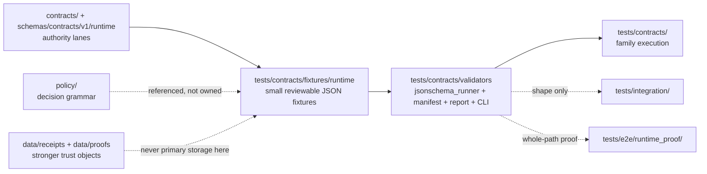

<!-- [KFM_META_BLOCK_V2]
doc_id: kfm://doc/NEEDS_VERIFICATION__tests_contracts_fixtures_runtime_readme
title: Runtime Contract Fixtures
type: standard
version: v1
status: draft
owners: @bartytime4life / NEEDS_VERIFICATION__leaf_scope
created: NEEDS_VERIFICATION__YYYY-MM-DD
updated: NEEDS_VERIFICATION__YYYY-MM-DD
policy_label: NEEDS_VERIFICATION__public_or_internal
related: [../../README.md, ../../../README.md, ../../../e2e/runtime_proof/README.md, ../../../../contracts/README.md, ../../../../schemas/README.md, ../../../../schemas/contracts/README.md, ../../../../schemas/contracts/v1/README.md, ../../../../schemas/contracts/v1/runtime/README.md, ../../../../policy/README.md, ../../../../data/receipts/README.md, ../../../../data/proofs/README.md, ../../../../tools/validators/README.md, ../../../../tools/attest/README.md, ../../../../.github/CODEOWNERS, ../../../../.github/workflows/README.md]
tags: [kfm, tests, contracts, fixtures, runtime]
notes: [Owners are only confirmed at the broader /tests/ scope in surfaced repo-facing docs, Exact leaf inventory and merge-gate wiring remain branch-level verification items, This README is fixture-bounded and must not become a second contract authority]
[/KFM_META_BLOCK_V2] -->

<a id="top"></a>

# Runtime Contract Fixtures

Deterministic, reviewable JSON fixtures for runtime-adjacent contract objects inside KFM’s `tests/contracts/` verification family.

> **Status:** `experimental`  
> **Owners:** `@bartytime4life` *(confirmed at `/tests/` scope in surfaced repo-facing docs; leaf-specific routing still needs direct branch verification)*  
> **Path:** `tests/contracts/fixtures/runtime/README.md`  
> **Repo fit:** child fixture lane under [`../../README.md`](../../README.md) for runtime-adjacent contract examples; downstream of contract/schema authority, upstream of manifest-driven contract validation, and distinct from whole-path proof under [`../../../e2e/runtime_proof/README.md`](../../../e2e/runtime_proof/README.md)  
> **Quick jumps:** [Scope](#scope) · [Current evidence posture](#current-evidence-posture) · [Repo fit](#repo-fit) · [Accepted inputs](#accepted-inputs) · [Exclusions](#exclusions) · [Directory tree](#directory-tree) · [Quickstart](#quickstart) · [Usage](#usage) · [Diagram](#diagram) · [Operating tables](#operating-tables) · [Task list / definition of done](#task-list--definition-of-done) · [FAQ](#faq) · [Appendix](#appendix)


> [!IMPORTANT]
> This directory is **fixture-bounded** and **contract-verification-bounded**. It should help prove runtime-facing object shape, named negative states, and fail-closed validation behavior without redefining schemas, owning policy, or pretending to be whole-path runtime proof.

> [!WARNING]
> Do **not** settle `contracts/` versus `schemas/` authority here by prose, and do **not** freeze guessed JSON keys into “implemented fact” unless the checked-out branch proves them through machine files, fixtures, or tests.

> [!NOTE]
> The strongest surfaced examples for this leaf are contract fixtures for geospatial review actions, but the mounted branch was not directly inspected for this run. Treat example filenames and runner depth as **branch-sensitive** until rechecked locally.

---

## Scope

`tests/contracts/fixtures/runtime/` exists to hold **small, reviewable fixture objects** for runtime-adjacent contracts that are exercised by contract-facing validation, not by full request-time runtime assembly.

In KFM terms, this leaf should help pressure-test objects such as:

- `RuntimeResponseEnvelope`
- `DecisionEnvelope`
- `EvidenceBundle` when used as a runtime-adjacent contract input or dependency
- review-action request/response contracts that sit close to runtime-facing governance
- other bounded runtime objects whose primary burden is still **shape and named failure behavior**

This leaf should stay narrow on purpose:

- it **does** help prove object shape, required fields, and explicit negative states
- it **does not** prove route integration, policy execution, emitted receipts, published proofs, or UI behavior
- it **must not** become a shadow schema registry or an ad hoc runtime-spec prose dump

[Back to top](#top)

---

## Current evidence posture

| Surface | Status | Why it matters here |
| --- | --- | --- |
| `tests/contracts/` as a first-class verification family | **CONFIRMED in surfaced repo-facing docs** | This leaf belongs inside a real contract-facing test family, not a generic “misc fixtures” bucket |
| `schemas/contracts/v1/` family split with `runtime/`, `policy/`, `evidence/`, `release/`, and related lanes | **CONFIRMED in surfaced repo-facing docs** | Runtime fixtures here should point back to visible machine-family names instead of inventing new ones |
| `schemas/tests/fixtures/contracts/v1/{valid,invalid}` nested scaffold | **CONFIRMED in surfaced repo-facing docs** | Nearby schema-side fixture scaffolds exist, but they do **not** settle canonical fixture-home law for this leaf |
| First executable `tests/contracts/` wave with manifest + validators | **CONFIRMED in surfaced repo-facing docs** | This leaf should fit a manifest-driven, no-network contract-validation story |
| Exact mounted contents of `tests/contracts/fixtures/runtime/` | **NEEDS VERIFICATION** | The checked-out branch was not mounted in this session |
| Exact workflow wiring, required checks, branch protections, and merge-blocking depth | **NEEDS VERIFICATION** | Docs visibility is not the same thing as active gate proof |
| Exact leaf-specific ownership, `doc_id`, `created`, `updated`, and `policy_label` | **NEEDS VERIFICATION** | Metadata must remain reviewable instead of guessed |

[Back to top](#top)

---

## Repo fit

This leaf is only useful when its boundaries stay legible.

| Direction | Surface | Why it matters |
| --- | --- | --- |
| Parent contract family | [`../../README.md`](../../README.md) | Keeps this directory subordinate to the repo’s contract-facing verification family |
| Broader test lattice | [`../../../README.md`](../../../README.md) | Preserves sibling-family boundaries such as `unit/`, `integration/`, `policy/`, and `e2e/` |
| Whole-path runtime proof escalation | [`../../../e2e/runtime_proof/README.md`](../../../e2e/runtime_proof/README.md) | Full request-time proof belongs there when the burden exceeds contract shape |
| Human-readable contract authority | [`../../../../contracts/README.md`](../../../../contracts/README.md) | Meaning and compatibility stay upstream from fixtures |
| Machine-readable schema authority | [`../../../../schemas/README.md`](../../../../schemas/README.md) | Schema-home authority stays outside this directory |
| Schema-side contract lane | [`../../../../schemas/contracts/README.md`](../../../../schemas/contracts/README.md) | Keeps machine-file-bearing lanes explicit |
| Versioned machine-contract family | [`../../../../schemas/contracts/v1/README.md`](../../../../schemas/contracts/v1/README.md) | The first-wave family split should anchor naming here |
| Runtime machine-contract lane | [`../../../../schemas/contracts/v1/runtime/README.md`](../../../../schemas/contracts/v1/runtime/README.md) | Runtime-adjacent fixtures should consume this lane, not replace it |
| Root policy authority | [`../../../../policy/README.md`](../../../../policy/README.md) | Decision grammar and deny-by-default logic remain sovereign elsewhere |
| Receipt process memory | [`../../../../data/receipts/README.md`](../../../../data/receipts/README.md) | Emitted receipts belong there, not in a contract fixture leaf |
| Stronger proof artifacts | [`../../../../data/proofs/README.md`](../../../../data/proofs/README.md) | Proofs are stronger than fixture examples |
| Fail-closed validator consumers | [`../../../../tools/validators/README.md`](../../../../tools/validators/README.md) | This leaf feeds validators; it does not replace them |
| Higher-order proof helpers | [`../../../../tools/attest/README.md`](../../../../tools/attest/README.md) | Attest/sign/verify helpers are downstream or adjacent, not owned here |
| Ownership surface | [`../../../../.github/CODEOWNERS`](../../../../.github/CODEOWNERS) | Owner claims should stay bounded by what the repo actually routes |
| Workflow documentation boundary | [`../../../../.github/workflows/README.md`](../../../../.github/workflows/README.md) | Workflow claims must remain subordinate to documented automation inventory |

[Back to top](#top)

---

## Accepted inputs

Only add materials here when the main job is to prove **contract-facing runtime object shape**.

### Belongs here

- tiny JSON request or response fixtures used by `tests/contracts/`
- positive and negative examples for runtime-adjacent contract objects
- examples that exercise required fields, enum states, nested `meta` objects, and visible error blocks
- reviewable object instances that a manifest-driven validator can run without network access
- fixture pairs that make named outcomes explicit instead of implied

### Strong-fit examples

| Fixture class | Why it fits this leaf |
| --- | --- |
| `RuntimeResponseEnvelope` examples | Trust-bearing runtime object shape belongs in contract-facing validation before broader proof |
| `DecisionEnvelope` examples | Policy posture can be carried as object shape here even though policy logic lives elsewhere |
| `EvidenceBundle` shape examples | Keeps runtime-adjacent evidence references inspectable at the contract boundary |
| geospatial review-action request/response examples | Surfaced attached material already places these under `tests/contracts/fixtures/runtime/` |
| named mismatch or negative-but-valid response examples | Helps prove visible negative states without collapsing into e2e |

### Surfaced example set from attached design material

| Surfaced fixture | Why it matters |
| --- | --- |
| `geospatial_review_action_request.promote.json` | request-shape example for steward review action initiation |
| `geospatial_review_action_response.promote.ok.json` | positive response example with `ok`, `data`, and `meta` structure |
| `geospatial_review_action_response.expected_mismatch.json` | explicit negative-state response example that still carries a clear contract shape |

[Back to top](#top)

---

## Exclusions

The following do **not** belong here as authoritative or primary records:

| Does **not** belong here | Put it in | Why |
| --- | --- | --- |
| canonical schema definitions | `../../../../schemas/contracts/v1/runtime/` and related schema lanes | This leaf consumes schema authority; it must not duplicate it |
| contract-law prose or compatibility decisions | `../../../../contracts/` | Fixtures are not the human-readable contract source of truth |
| deny-by-default rule bundles, reason codes, or obligation grammar | `../../../../policy/` or `../../../policy/` | Policy decides; this leaf only helps prove object shape |
| emitted receipts, run records, or proof packs | `../../../../data/receipts/` or `../../../../data/proofs/` | Process memory and proof objects are stronger than fixtures |
| full request-time runtime proof | `../../../e2e/runtime_proof/` | E2E runtime behavior is a broader burden than schema-facing examples |
| route handlers, adapters, app runtime code, or UI components | app/package/tool lanes | This is not an implementation directory |
| large provider mirrors, raw datasets, or scratch dumps | governed data zones or ignored local paths | Checked-in fixtures must stay tiny and reviewable |
| guessed final JSON keys not proven by machine files or tests | nowhere | KFM doctrine rejects decorative certainty |

[Back to top](#top)

---

## Directory tree

### Surfaced example filenames from attached design material

The attached contract-focused packet material surfaced this minimal example set for this leaf:

```text
tests/contracts/fixtures/runtime/
├── README.md
├── geospatial_review_action_request.promote.json
├── geospatial_review_action_response.expected_mismatch.json
└── geospatial_review_action_response.promote.ok.json
```

> [!NOTE]
> Treat the tree above as a **surfaced example set**, not as a mounted-branch inventory claim.

### Recommended growth rule

Prefer adding **named cases** before adding deep folder taxonomies. Only introduce family subdirectories when the mounted branch proves they improve discoverability rather than hiding a still-small leaf.

### If growth becomes necessary (`PROPOSED`)

```text
tests/contracts/fixtures/runtime/
├── README.md
├── geospatial_review_action_*.json
├── runtime_response_envelope/
│   ├── valid/
│   └── invalid/
├── decision_envelope/
│   ├── valid/
│   └── invalid/
└── evidence_bundle/
    ├── valid/
    └── invalid/
```

Use this only after local inspection confirms that the active branch wants family subtrees here.

[Back to top](#top)

---

## Quickstart

### Safe inspection commands

Use inspection-first commands before editing this leaf:

```bash
# inspect the leaf exactly as the checked-out branch exposes it
find tests/contracts/fixtures/runtime -maxdepth 3 -type f 2>/dev/null | sort

# inspect the parent contract family and nearby authority lanes
sed -n '1,260p' tests/contracts/README.md 2>/dev/null || true
sed -n '1,260p' tests/README.md 2>/dev/null || true
sed -n '1,260p' contracts/README.md 2>/dev/null || true
sed -n '1,260p' schemas/README.md 2>/dev/null || true
sed -n '1,260p' schemas/contracts/README.md 2>/dev/null || true
sed -n '1,260p' schemas/contracts/v1/README.md 2>/dev/null || true
sed -n '1,260p' schemas/contracts/v1/runtime/README.md 2>/dev/null || true
sed -n '1,220p' schemas/tests/README.md 2>/dev/null || true
sed -n '1,220p' policy/README.md 2>/dev/null || true
sed -n '1,220p' .github/CODEOWNERS 2>/dev/null || true
sed -n '1,220p' .github/workflows/README.md 2>/dev/null || true
```

### Run the visible contract-validation wave

If the checked-out branch exposes the documented helper surfaces, use:

```bash
pytest tests/contracts -q
```

And for the documented manifest-driven first wave:

```bash
python -m tests.contracts.validators.manifest_cli \
  tests/contracts/manifests/contract_cases.v1.json
```

> [!CAUTION]
> Do **not** assume these commands are merge-blocking on the active branch until workflow inventory and required checks are directly verified.

### Fast drift check

Use this before inventing new object names:

```bash
grep -RIn \
  -e 'RuntimeResponseEnvelope' \
  -e 'DecisionEnvelope' \
  -e 'EvidenceBundle' \
  -e 'ReleaseManifest' \
  -e 'CorrectionNotice' \
  -e 'ReviewRecord' \
  -e 'run_receipt' \
  -e 'ai_receipt' \
  -e 'ABSTAIN' \
  -e 'DENY' \
  -e 'ERROR' \
  tests contracts schemas policy data tools docs .github 2>/dev/null || true
```

[Back to top](#top)

---

## Usage

### Add a fixture here when…

Use this leaf when the main question is:

> **“Does this runtime-adjacent object conform to the declared contract, including named negative states?”**

Typical additions here include:

- one valid request example
- one valid response example
- one explicitly negative response example
- one invalid object that should fail schema validation
- one README update if the example expands the known family burden

### Escalate out of this leaf when…

Move the work into another family when the burden changes:

| If the real burden is… | Better home |
| --- | --- |
| request-time behavior across real boundaries | `tests/integration/` or `tests/e2e/runtime_proof/` |
| deny-by-default decision logic | `tests/policy/` |
| rerun consistency, digest stability, or receipt comparison | `tests/reproducibility/` |
| emitted process-memory objects | `data/receipts/` |
| release closure, correction, rollback, or publish-path proof | `tests/e2e/release_assembly/`, `tests/e2e/correction/`, or stronger proof surfaces |

### Naming guidance

Prefer filenames that make the case obvious in Git diffs:

- `<family>.<action>.<state>.json`
- `<family>.<scenario>.json`
- `<family>.<negative_reason>.json`

Good names are reviewable. Clever names are not.

### Surfaced example

The attached geospatial review-action material uses a compact negative-state response shape:

```json
{
  "ok": false,
  "data": null,
  "error": {
    "code": "EXPECTED_STATE_MISMATCH",
    "message": "Expected manifest_digest did not match current review payload."
  },
  "meta": {
    "route": "/v1/review/geospatial/promo-2026-04-19-streamflow/actions",
    "generated_at": "2026-04-19T20:15:00Z",
    "policy_label": "public",
    "receipt_ref": null,
    "decision_ref": null
  }
}
```

Use examples like this to keep negative states visible without pretending they already prove route execution or persistence.

[Back to top](#top)

---

## Diagram



This leaf sits in the middle of a governed chain: **close enough to schema truth to be precise, far enough from runtime proof to stay narrow**.

[Back to top](#top)

---

## Operating tables

### Fixture family matrix

| Fixture family | Best current schema-side signal | Why it belongs here first | Minimum negative pressure |
| --- | --- | --- | --- |
| `RuntimeResponseEnvelope` | `schemas/contracts/v1/runtime/runtime_response_envelope.schema.json` | Trust-bearing runtime object shape should be explicit before e2e prose grows | missing required result/audit linkage or unsupported outward state |
| `DecisionEnvelope` | runtime/policy machine-family split in `schemas/contracts/v1/` | Bridges runtime-facing decisions into machine-readable contract validation | missing disposition or malformed decision block |
| `EvidenceBundle` | `schemas/contracts/v1/evidence/...` family split | Keeps runtime-adjacent evidence references explicit at point of use | missing lineage, rights, or sensitivity-bearing members |
| geospatial review-action request | surfaced request schema path in attached packet material | Concrete, bounded example already points to this leaf | missing actor/expected digest block |
| geospatial review-action response | surfaced response schema path in attached packet material | Concrete positive and mismatch examples already point to this leaf | malformed `error` / `meta` structure |

### Placement matrix

| If the work mainly proves… | Primary home | Why |
| --- | --- | --- |
| object shape and required fields | `tests/contracts/fixtures/runtime/` + `tests/contracts/` | Keep contract truth explicit and reviewable |
| local contract-runner behavior | `tests/contracts/validators/` | Helpers should stay executable and separate |
| policy result logic | `tests/policy/` | Decision grammar should stay isolated |
| whole request-time runtime behavior | `tests/e2e/runtime_proof/` | Broader than one contract leaf |
| release, correction, or rollback consequences | `tests/e2e/release_assembly/` or `tests/e2e/correction/` | Stronger burden than contract shape |

[Back to top](#top)

---

## Task list / definition of done

A change in this leaf is ready for review when all relevant items below are satisfied:

- [ ] the matching contract or schema lane is identified and linked
- [ ] the fixture is tiny, reviewable, and no-network
- [ ] at least one named negative path exists when the object family carries trust impact
- [ ] valid examples pass the intended validator path
- [ ] invalid examples fail for the reason the reviewer can actually inspect
- [ ] the leaf does not become a second contract authority
- [ ] no RAW / WORK / QUARANTINE path is implied as outward-safe
- [ ] escalation to `tests/policy/`, `tests/integration/`, or `tests/e2e/runtime_proof/` has been considered
- [ ] README links and any manifest entries stay in sync with the real branch

[Back to top](#top)

---

## FAQ

### Why not place these under `tests/e2e/runtime_proof/`?

Because whole-path runtime proof is a broader burden. This leaf exists for runtime-adjacent **contract fixtures**, not for proving route execution, emitted receipts, UI visibility, or public runtime outcomes.

### Why not settle `contracts/` versus `schemas/` here?

Because this directory is downstream of that decision. It should consume the declared machine-contract source of truth, not replace or silently settle it.

### Why keep negative examples here?

Because KFM contract verification prefers explicit rejection, named invalid examples, and visible negative states over flattened success.

### Why not store emitted receipts or proofs beside examples?

Because receipts are process memory and proofs are stronger release-grade trust objects. This leaf is for reviewable contract examples, not emitted artifacts.

### Can this README define final JSON field names by itself?

No. It may document surfaced examples and bounded expectations, but final field names must remain tied to checked-in machine contracts, fixtures, or tests.

[Back to top](#top)

---

## Appendix

<details>
<summary><strong>Evidence basis used for this README</strong></summary>

This README is grounded in recent surfaced project materials that consistently point to the same contract-verification split:

1. repo-facing `tests/contracts/` draft material showing:
   - `tests/contracts/` as a first-class verification family,
   - a manifest-driven first executable wave,
   - validator helper surfaces,
   - separation between contract verification, contract authority, and policy authority;

2. documentation-architecture material showing:
   - the recommended authority split across `contracts/`, `schemas/`, `schemas/tests/fixtures/`, `tests/contracts/`, `policy/`, and `tools/validators/`,
   - first-wave runtime-adjacent object families such as `RuntimeResponseEnvelope`, `DecisionEnvelope`, `EvidenceBundle`, `ReleaseManifest`, and `CorrectionNotice`;

3. attached packet material that explicitly surfaces runtime-contract fixture filenames for geospatial review actions under this leaf.

The mounted repository tree was not directly available in this session, so inventory-sensitive claims remain intentionally bounded.

</details>

<details>
<summary><strong>Direct verification still needed before merge</strong></summary>

Before treating this README as branch-exact, verify:

1. the actual local contents of `tests/contracts/fixtures/runtime/`;
2. whether the geospatial review-action fixture filenames are already checked in exactly as surfaced;
3. the exact machine schema paths for any runtime-adjacent object family this leaf references;
4. validator entrypoints and runner commands on the active branch;
5. required checks, branch protections, and whether this leaf participates in merge-blocking CI;
6. leaf-specific ownership, metadata dates, and final `doc_id`.

</details>

[Back to top](#top)