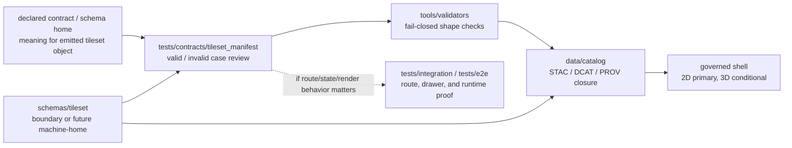

<!-- [KFM_META_BLOCK_V2]
doc_id: kfm://doc/NEEDS_VERIFICATION__tests_contracts_tileset_manifest_readme
title: tileset_manifest
type: standard
version: v1
status: draft
owners: @bartytime4life
created: NEEDS_VERIFICATION__YYYY-MM-DD
updated: 2026-04-16
policy_label: NEEDS_VERIFICATION__public_or_internal
related: [../README.md, ../../README.md, ../../../contracts/README.md, ../../../contracts/tiler/README.md, ../../../schemas/README.md, ../../../schemas/tileset/README.md, ../../../schemas/tiler/README.md, ../../../data/catalog/README.md, ../../../data/receipts/README.md, ../../../policy/README.md, ../../../tools/validators/README.md, ../../../tests/integration/README.md, ../../../tests/e2e/README.md, ../../../docs/standards/KFM_STAC_PROFILE.md, ../../../.github/CODEOWNERS, ../../../.github/workflows/README.md]
tags: [kfm, tests, contracts, tileset_manifest, 3d-tiles, scene-manifest, validation]
notes: [Target path was supplied directly by the request. Broader /tests/contracts posture and adjacent /schemas/tileset/ doctrine are evidenced, but active-branch leaf inventory, dates, policy label, and canonical machine-home authority for the tested object still need verification.]
[/KFM_META_BLOCK_V2] -->

<a id="top"></a>

# `tileset_manifest`

Contract-facing verification lane for **release-facing emitted tileset descriptors** in KFM’s conditional 3D delivery path.

> **Status:** `experimental`  
> **Doc state:** `draft`  
> **Owners:** `@bartytime4life` *(broader `/tests/` ownership is evidenced in surfaced repo-facing docs; leaf-specific assignment still needs verification)*  
> **Path target:** `tests/contracts/tileset_manifest/README.md`  
> **Repo fit:** child lane of [`../README.md`](../README.md) inside the contract-facing `tests/contracts/` family; adjacent schema/doctrine surfaces include [`../../../schemas/tileset/README.md`](../../../schemas/tileset/README.md), [`../../../schemas/tiler/README.md`](../../../schemas/tiler/README.md), [`../../../contracts/tiler/README.md`](../../../contracts/tiler/README.md), [`../../../data/catalog/README.md`](../../../data/catalog/README.md), [`../../../data/receipts/README.md`](../../../data/receipts/README.md), [`../../../tools/validators/README.md`](../../../tools/validators/README.md), and [`../../../.github/workflows/README.md`](../../../.github/workflows/README.md)  
> **Accepted here:** schema-backed valid/invalid examples, small scenario notes, and contract-visible checks for emitted tileset-descriptor fields and negative-path behavior  
> **Not here:** run receipts, tiling invocations, promotion outcomes, STAC/DCAT/PROV profiles, renderer code, or route-level 2D ↔ 3D behavior  
> **Quick jumps:** [Scope](#scope) · [Repo fit](#repo-fit) · [Accepted inputs](#accepted-inputs) · [Exclusions](#exclusions) · [Current verified snapshot](#current-verified-snapshot) · [Directory tree](#directory-tree) · [Quickstart](#quickstart) · [Usage](#usage) · [Diagram](#diagram) · [Operating tables](#operating-tables) · [Task list](#task-list--definition-of-done) · [FAQ](#faq) · [Appendix](#appendix)


> [!IMPORTANT]
> This README is **contract-facing** and **verification-facing**. It exists to keep `tileset_manifest` cases reviewable, negative-path-explicit, and subordinate to whichever schema or contract home the checked-out branch actually declares.

> [!WARNING]
> Current-session evidence is strong on doctrine and adjacent repo-facing documentation, but weak on direct mounted leaf inventory for `tests/contracts/tileset_manifest/`. Treat this file as a **truth-preserving landing README**, not as proof that fixtures, validators, or workflow gates already exist on the active branch.

## Scope

This lane exists for one narrow job:

**prove that an emitted `tileset_manifest` object is shaped, constrained, and rejected correctly before anyone treats it as trustworthy 3D-delivery metadata.**

The adjacent tileset boundary doctrine frames `tileset_manifest` as a **release-facing emitted tileset descriptor**: narrower than run control, broader than raw file inventory, and distinct from receipts, proofs, profiles, or renderer-specific behavior.

That puts this README under two simultaneous pressures:

1. `tests/contracts/` should **consume and verify** machine-contract truth rather than quietly becoming a second contract authority.
2. KFM’s 3D doctrine stays **2D-first and conditional**, so any emitted tileset or scene-handoff object must remain downstream of released assets, evidence links, and the same trust model that governs the persistent shell.

A practical reading of this leaf is:

- **narrower than** tiling run specs and process-memory receipts,
- **broader than** a raw asset list alone,
- and **still subordinate to** release, catalog, policy, proof, and shell-law surfaces.

### Truth labels used here

| Label | Meaning in this README |
|---|---|
| **CONFIRMED** | Supported by surfaced repo-facing docs or convergent attached KFM doctrine |
| **INFERRED** | Strongly implied by doctrine, but not directly surfaced as a checked-in leaf object here |
| **PROPOSED** | Recommended next shape for this lane, not yet verified as implemented |
| **NEEDS VERIFICATION** | Active-branch proof was not directly surfaced in this session |

[Back to top](#top)

## Repo fit

### Where this lane sits

| Neighbor | Role | Why it matters here |
|---|---|---|
| [`../README.md`](../README.md) | parent `tests/contracts/` boundary | defines the contract-facing verification family and its failure philosophy |
| [`../../README.md`](../../README.md) | broader `tests/` boundary | keeps family placement honest and prevents overclaiming suite depth |
| [`../../../schemas/tileset/README.md`](../../../schemas/tileset/README.md) | candidate tileset schema-home boundary | frames `tileset_manifest` as the strongest first-wave emitted-object candidate if the repo adopts it |
| [`../../../schemas/tiler/README.md`](../../../schemas/tiler/README.md) | run-control schema lane | separates emitted-object testing from run/invocation/receipt objects |
| [`../../../contracts/tiler/README.md`](../../../contracts/tiler/README.md) | tiler contract home | likely meaning/invariant neighbor if the branch keeps tileset semantics close to tiler doctrine |
| [`../../../data/catalog/README.md`](../../../data/catalog/README.md) | STAC / DCAT / PROV closure | catalog cross-links may be asserted here, but outward closure is not owned here |
| [`../../../data/receipts/README.md`](../../../data/receipts/README.md) | process-memory lane | keeps `tileset_manifest` distinct from `run_receipt` or tiling receipts |
| [`../../../policy/README.md`](../../../policy/README.md) | policy authority | reason codes, obligations, and promotion decisions stay policy-owned |
| [`../../../tools/validators/README.md`](../../../tools/validators/README.md) | fail-closed helper lane | natural downstream consumer once a real validator exists |
| [`../../../tests/integration/README.md`](../../../tests/integration/README.md) | cross-boundary proof family | route/state/render handoff belongs there, not purely here |
| [`../../../tests/e2e/README.md`](../../../tests/e2e/README.md) | runtime/release proof family | public behavior, promotion proof, and correction lineage exceed this lane’s burden |

### Placement rule

Use `tests/contracts/tileset_manifest/` only when the work mainly proves the **shape and case behavior of the emitted manifest object itself**.

This is the right home for questions like:

- “Is the object missing required identity or digest fields?”
- “Does the manifest illegally carry receipt- or proof-only semantics?”
- “Is a scene-handoff variant explicit enough to remain downstream of released assets?”
- “Do the valid and invalid examples express the same finite object grammar every consumer should see?”

It is **not** the right home for:

- route-level 2D ↔ 3D handoff behavior,
- renderer-specific Cesium / MapLibre / three.js code,
- policy allow/deny logic,
- release attestation verification,
- or whole-shell drawer behavior under real motion and live assets.

[Back to top](#top)

## Accepted inputs

### What belongs here

| Candidate input | Status | Belongs here? | Why |
|---|---|---:|---|
| `fixtures/valid/*.json` for minimal emitted `tileset_manifest` cases | **PROPOSED** | Yes | keeps reviewer-readable positive examples close to contract validation |
| `fixtures/invalid/*.json` for malformed or contradictory manifests | **PROPOSED** | Yes | fail-closed negative-path proof is a core burden of `tests/contracts/` |
| small scenario notes describing what each fixture proves | **INFERRED / PROPOSED** | Yes | helps review without hiding logic in clever test code |
| manifest-shape checks for identity, digests, bounds, release refs, and evidence refs | **INFERRED** | Yes | these field families are repeatedly implied by the adjacent boundary doc and conditional-3D doctrine |
| optional scene-handoff parity fixtures | **PROPOSED** | Maybe | only when the branch actually surfaces a renderer-neutral scene-manifest contract |

### Minimal burden families this lane should expect

A safe first wave for `tileset_manifest` verification likely needs some combination of:

- **identity** — object id, version, `spec_hash`, creation/update timestamps
- **artifact linkage** — emitted asset paths, digests, media types, byte sizes
- **spatial interpretation** — CRS, bounds, hierarchy or geometric-error summaries
- **release continuity** — release refs, promoted-subject ids, or catalog anchors
- **evidence continuity** — evidence refs or drawer-parity refs where a scene-handoff variant exists
- **bounded status grammar** — machine states only if the object genuinely owns them

> [!TIP]
> Keep exact final JSON keys conservative until a checked-in schema proves them. This README can name burden families and negative cases without smuggling placeholder field names into “implemented fact.”

## Exclusions

This lane should stay narrow.

| Does **not** belong here | Better home |
|---|---|
| `tiling_run_spec`, `tiling_invocation`, `tiling_receipt`, `tile_summary` | [`../../../schemas/tiler/README.md`](../../../schemas/tiler/README.md) and related tiler contract docs |
| `run_receipt`, `ai_receipt`, promotion outcomes, attestation bundles | receipt / proof / promotion lanes |
| OPA reason logic, obligation-code registries, policy allow/deny matrices | [`../../../tests/policy/README.md`](../../../tests/policy/README.md) and [`../../../policy/README.md`](../../../policy/README.md) |
| STAC / DCAT / PROV outward profiles | [`../../../data/catalog/README.md`](../../../data/catalog/README.md) and standards docs |
| Cesium / MapLibre / three.js implementation code | app/runtime or tool lanes |
| shell continuity, drawer rendering, route ownership, or motion-heavy parity behavior | integration or e2e verification |
| canonical datasets, terrain sources, imagery, or released tiles themselves | upstream data and published artifact lanes |

> [!WARNING]
> A `tileset_manifest` test lane must not quietly become a generic 3D bucket. KFM’s doctrine is explicit that 3D is conditional, 2D remains primary, and trust objects must not split across parallel regimes.

[Back to top](#top)

## Current verified snapshot

| Evidence item | Status | Why it matters |
|---|---|---|
| `tests/contracts/README.md` is a real family doc and defines this parent family as contract-facing verification | **CONFIRMED** | grounds the verification posture and failure philosophy for this leaf |
| `tests/contracts/` is expected to consume and verify contract truth, not become a second authority | **CONFIRMED** | keeps this README subordinate to schema and contract homes |
| `schemas/tileset/README.md` exists as a real boundary doc | **CONFIRMED** | gives this leaf its strongest adjacent object-definition signal |
| That boundary doc treats `tileset_manifest` as the strongest first-wave emitted-object candidate if adopted | **CONFIRMED** | justifies the target leaf name and its scope |
| That same boundary doc says `tileset_manifest` is release-facing and distinct from run specs, receipts, proofs, profiles, and renderer code | **CONFIRMED** | sharpens accepted inputs and exclusions |
| KFM Pass 14 / Pass 15 keep 3D conditional, 2D-first, and tie coherent 3D story modes to scene manifests plus drawer parity | **CONFIRMED doctrine** | explains why this lane may later need scene-handoff parity fixtures |
| Exact active-branch inventory under `tests/contracts/tileset_manifest/` | **NEEDS VERIFICATION** | not directly surfaced in this session |
| Exact checked-in schema filename and final canonical machine-home for `tileset_manifest` | **NEEDS VERIFICATION** | adjacent docs still show schema-home ambiguity |
| Any mounted validator command, fixtures, or merge-blocking workflow for this exact leaf | **NEEDS VERIFICATION** | current session evidence is documentation-led rather than runtime-led |

[Back to top](#top)

## Directory tree

### Current surfaced contract-side context

```text
tests/
└── contracts/
    └── README.md
```

### Requested landing shape for this leaf

```text
tests/
└── contracts/
    └── tileset_manifest/
        └── README.md
```

### Safe first expansion if this lane becomes executable

```text
tests/
└── contracts/
    └── tileset_manifest/
        ├── README.md
        └── fixtures/
            ├── valid/
            └── invalid/
```

> [!NOTE]
> The tree above is deliberately conservative. Add runners, reports, or helper wrappers only when the branch actually surfaces them. Do not invent a busy subtree just to make the lane look mature.

[Back to top](#top)

## Quickstart

### Safe inspection commands

Use these before changing this lane so the README stays aligned to the checked-out branch rather than to doctrine alone.

```bash
# inspect the parent family and any existing leaf files
find tests/contracts -maxdepth 4 -type f 2>/dev/null | sort
find tests/contracts/tileset_manifest -maxdepth 4 -type f 2>/dev/null | sort

# inspect adjacent doctrine and schema-side boundary docs
sed -n '1,260p' tests/contracts/README.md
sed -n '1,260p' schemas/tileset/README.md
sed -n '1,260p' schemas/README.md
sed -n '1,260p' contracts/README.md

# inspect likely downstream consumers / non-homes
sed -n '1,220p' data/catalog/README.md
sed -n '1,220p' data/receipts/README.md
sed -n '1,220p' policy/README.md
sed -n '1,220p' tools/validators/README.md

# search for the object family and its likely 3D-doctrine neighbors
grep -RIn \
  -e 'tileset_manifest' \
  -e 'scene_manifest' \
  -e 'drawer parity' \
  -e '3D Tiles' \
  tests schemas contracts docs data .github 2>/dev/null || true
```

### First branch-safety questions

Before claiming this leaf is executable, answer these five questions from the checkout itself:

1. Does a real `tileset_manifest` schema file exist?
2. If yes, is its canonical home `schemas/tileset/`, another schema family, or a contract-adjacent path?
3. Are there any valid / invalid fixtures already present?
4. Is there a validator entrypoint documented in-repo?
5. Does any integration or e2e surface already consume the same object?

If any answer is “no” or “not sure,” keep the README boundary-first.

[Back to top](#top)

## Usage

### Practical placement matrix

| Question | Put it in | Reason |
|---|---|---|
| “Is this emitted tileset descriptor structurally valid?” | `tests/contracts/tileset_manifest/` | this lane exists for shape and negative-case proof |
| “Which schema defines the object?” | declared schema home | tests should verify, not own, schema truth |
| “What happened during tiling?” | tiler run and receipt lanes | runtime and process memory are separate burdens |
| “Does the released asset close cleanly into STAC / DCAT / PROV?” | catalog and integration lanes | this lane may assert hooks, but closure is broader |
| “Can the object be promoted, signed, or published?” | policy / proof / validator lanes | trust decisions are not schema-placement decisions |
| “Does the 2D shell hand off to 3D without splitting trust state?” | contract lane **plus** integration / e2e when mounted | this lane can prove shape preconditions, not the whole runtime experience |

### Conditional 3D rule for this leaf

KFM’s doctrine makes one constraint unusually clear:

- **MapLibre** remains the disciplined 2D shell companion.
- **Cesium** and **3D Tiles** are conditional explanatory machinery.
- A coherent 3D story mode must stay downstream of the same released assets, evidence links, decision grammar, and Evidence Drawer logic as the 2D shell.

That means a `tileset_manifest` contract case is strongest when it helps answer one of two narrow questions:

1. does the emitted object stay a derived, release-facing descriptor rather than mutating into run memory or proof logic?  
2. if a future scene-handoff variant appears, does it carry enough release and evidence continuity to stay eligible for drawer-parity testing elsewhere?

## Diagram



[Back to top](#top)

## Operating tables

### Minimum burden matrix

| Burden | This lane should prove | This lane should not pretend |
|---|---|---|
| Identity | required id/version/`spec_hash` presence when schema says so | that the object is already emitted by live code |
| Artifact linkage | `tileset.json` / asset refs and digest formats | CDN reachability or renderer success without higher-layer tests |
| Spatial interpretation | CRS / bounds / hierarchy fields when contract requires them | analytical correctness of terrain or 3D rendering itself |
| Release continuity | release refs or catalog hooks exist if the object owns them | actual promotion, signing, or catalog closure |
| Evidence continuity | evidence refs or parity hooks where a scene-handoff variant exists | full Evidence Drawer behavior under live interaction |
| Negative-path discipline | malformed digests, missing anchors, forbidden receipt/proof contamination | protected-branch or workflow enforcement |

### Candidate first fixtures

| Fixture idea | Status | Why it is useful |
|---|---|---|
| minimal valid emitted `tileset_manifest` | **PROPOSED** | proves the smallest acceptable release-facing descriptor |
| invalid manifest missing `spec_hash` | **PROPOSED** | exercises deterministic identity failure |
| invalid manifest missing primary tileset asset ref | **PROPOSED** | blocks descriptor-without-asset drift |
| invalid manifest with bad digest format | **PROPOSED** | protects validator-visible integrity grammar |
| invalid manifest that illegally carries `run_receipt` or outcome semantics | **PROPOSED** | keeps receipt/proof separation visible |
| optional valid scene-handoff variant with release/evidence refs | **INFERRED / PROPOSED** | useful later if the branch adopts renderer-neutral scene manifests |

### Minimal field families worth watching

| Family | Why it matters near `tileset_manifest` |
|---|---|
| `spec_hash` | stable descriptor identity and diff anchor |
| asset digests | emitted-object integrity at review time |
| CRS / bounds / hierarchy summaries | enough spatial interpretation for validator-visible review |
| release refs / catalog refs | keeps the object downstream of promoted assets |
| evidence refs / drawer-parity hooks | needed if the object participates in conditional 3D story handoff |

[Back to top](#top)

## Task list / Definition of done

### Definition of done for a truthful first wave

- [ ] confirm whether the checked-out branch actually contains `tests/contracts/tileset_manifest/`
- [ ] confirm the canonical machine-home for the object under test
- [ ] add one schema-backed valid example
- [ ] add one deterministic invalid example
- [ ] document the validator command only after the branch proves it
- [ ] keep receipt / proof / policy logic out of this lane
- [ ] keep links to `schemas/tileset/`, `data/catalog/`, and `tools/validators/` current
- [ ] preserve explicit negative-path proof instead of vague “should validate” prose

### Gates before broader 3D fixture growth

- [ ] one declared `tileset_manifest` object meaning
- [ ] one visible schema path
- [ ] one valid and one invalid fixture
- [ ] one fail-closed validator or runner
- [ ] explicit rule for release / evidence linkage
- [ ] scene-manifest parity checklist if a 3D handoff variant is added

> [!TIP]
> A small, honest wave is better than a pseudo-complete 3D contract tree. This lane is healthy when reviewers can see exactly what is and is not proven.

[Back to top](#top)

## FAQ

### Is this leaf already verified as a populated directory?

No. The target path was supplied directly in the request, but the current session did not surface a mounted leaf inventory under `tests/contracts/tileset_manifest/`.

### Does this README make `schemas/tileset/` the settled canonical home?

No. It treats `schemas/tileset/README.md` as the strongest current adjacent boundary signal because that doc names `tileset_manifest` as the strongest first-wave emitted-object candidate. Canonical schema-home authority still needs direct branch verification.

### Should this lane test `run_receipt`, `ai_receipt`, or attestation bundles?

Not as primary objects. Those belong to receipt, proof, and promotion families. This lane may reject contamination by them, but it should not absorb their semantics.

### Should Cesium or MapLibre rendering tests live here?

No. Renderer behavior and live 2D ↔ 3D handoff belong in integration or e2e surfaces. This leaf is for contract-facing manifest verification.

### Why mention scene manifests if the file is named `tileset_manifest`?

Because KFM’s latest 3D doctrine repeatedly ties coherent 3D story modes to **scene manifests plus drawer parity**. A future branch may choose to test a scene-handoff variant next to tileset-manifest cases. That remains **INFERRED / PROPOSED**, not settled implementation fact.

### Can this lane prove 3D readiness by itself?

No. It can prove object-shape discipline and negative-path clarity. Full 3D readiness also needs catalog continuity, drawer parity, and higher-layer proof that the same governed shell remains intact.

### What is the safest first real case?

A tiny, release-facing manifest for one terrain-bearing story node with explicit asset refs, digest fields, and no receipt/proof leakage.

[Back to top](#top)

## Appendix

<details>
<summary><strong>Observed evidence anchors relevant to this lane</strong></summary>

### Adjacent repo-facing signals

- `tests/contracts/README.md` documents the parent family as contract-facing verification.
- `schemas/tileset/README.md` documents the tileset lane as boundary-first and names `tileset_manifest` as the strongest first-wave candidate.
- current surfaced repo-facing docs continue to treat schema-home authority as a live reconciliation problem rather than a settled law.

### Governing doctrine that shapes this leaf

- 3D is conditional, 2D remains primary.
- coherent 3D story modes require scene manifests and drawer parity.
- scene-handoff objects must stay downstream of released assets, evidence links, decision grammar, and correction paths.
- one terrain-bearing story node is the recommended first proof, not a broad 3D rewrite.

### Safe next inspections before merge

```bash
sed -n '1,260p' tests/contracts/README.md
sed -n '1,260p' schemas/tileset/README.md
grep -RIn 'tileset_manifest\|scene_manifest\|drawer parity' tests schemas contracts docs data .github 2>/dev/null || true
find tests/contracts/tileset_manifest -maxdepth 4 -type f 2>/dev/null | sort
```

</details>

<details>
<summary><strong>Illustrative starter shapes (<em>PROPOSED</em>)</strong></summary>

### Minimal valid case sketch

```json
{
  "id": "kfm://tileset/example",
  "spec_hash": "sha256:REVIEW_REQUIRED",
  "assets": [
    {
      "href": "tileset.json",
      "checksum": "sha256:REVIEW_REQUIRED"
    }
  ]
}
```

### Minimal invalid case sketch

```json
{
  "id": "kfm://tileset/example",
  "assets": []
}
```

These are shape sketches only. Replace them with branch-backed fixtures once the actual schema exists.

</details>

[Back to top](#top)
