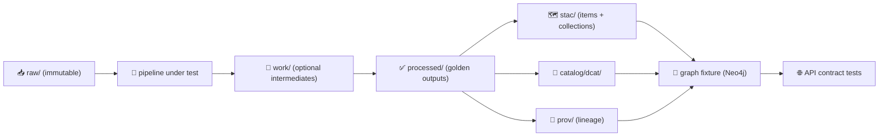

# 🧪 `tests/data/` — Fixture Datasets & Golden Files


This folder holds **tiny, deterministic, version-controlled datasets** used by automated tests to validate the KFM “truth path” end‑to‑end: **ETL → catalogs (STAC/DCAT/PROV) → graph → API contracts** (and, optionally, UI expectations).:contentReference[oaicite:0]{index=0}:contentReference[oaicite:1]{index=1}

> 🧭 Why this exists: KFM treats data like code—**nothing enters without metadata + provenance**—so our tests need fixture data that mirrors the same contracts, just at micro scale.:contentReference[oaicite:2]{index=2}:contentReference[oaicite:3]{index=3}

---

## 🧬 Core Rules (non‑negotiable)

### ✅ 1) Mirror the canonical staging layout
Even for tests, keep data in the same lifecycle “lanes”:
- `raw/` → `work/` → `processed/`:contentReference[oaicite:4]{index=4}
- Then publish **boundary artifacts** (metadata + provenance) before anything is treated as “ready”:  
  `stac/` + `catalog/dcat/` + `prov/`:contentReference[oaicite:5]{index=5}

### ✅ 2) Determinism over cleverness
Fixture generation must behave like real pipelines: **idempotent, reproducible, and stable given the same inputs** (fixed seeds, no prompts, no manual steps).:contentReference[oaicite:6]{index=6}:contentReference[oaicite:7]{index=7}

### ✅ 3) No sensitive/PII content — ever
Fixtures must be **sanitized**:
- No real people’s names, emails, phone numbers.
- No precise coordinates for protected/sensitive sites.
- No “confidential → public” classification downgrade without explicit, approved de‑identification steps (tests should help catch this).:contentReference[oaicite:8]{index=8}

### ✅ 4) Keep fixtures tiny (CI‑friendly)
- Prefer **micro‑slices** (10–200 rows, 1–5 features, small rasters).
- If a file grows large, move it to **LFS or external fetch** (keep identity tracked). The blueprint even calls out size thresholds as a practical approach.:contentReference[oaicite:9]{index=9}

---

## 🗂️ Recommended Layout

> This layout is designed to match KFM’s required staging + catalog boundaries while keeping fixture sets self‑contained.:contentReference[oaicite:10]{index=10}

```text
tests/data/
├── 📁 fixtures/
│   ├── 📁 kfm_minimal/                      # One self-contained fixture set ✅
│   │   ├── 📁 raw/                          # Immutable source inputs
│   │   │   └── 📁 <domain>/                 # e.g. historical/, hydrology/, air-quality/
│   │   ├── 📁 work/                         # Intermediate artifacts (optional but supported)
│   │   │   └── 📁 <domain>/
│   │   ├── 📁 processed/                    # Golden processed outputs (what pipelines should produce)
│   │   │   └── 📁 <domain>/
│   │   ├── 📁 stac/
│   │   │   ├── 📁 collections/              # STAC Collections
│   │   │   └── 📁 items/                    # STAC Items
│   │   ├── 📁 catalog/
│   │   │   └── 📁 dcat/                     # DCAT dataset entries (JSON-LD)
│   │   ├── 📁 prov/                         # PROV lineage bundles (JSON/JSON-LD)
│   │   ├── 📁 db/                           # Optional: PostGIS/Neo4j seed dumps for integration tests
│   │   └── 📄 README.md                     # Fixture runbook: “what this set proves”
│   └── 📁 <another_fixture_set>/
│
├── 📁 snapshots/
│   ├── 📁 api/                              # Golden HTTP responses (contract tests)
│   └── 📁 graphql/                          # Golden GraphQL responses (if used)
│
└── 📁 generated/                            # Optional: test outputs (should be gitignored)
```

### 🧩 Domain naming
Use domain folder names that mirror your real data domains (e.g., `historical/`, `hydrology/`, `air-quality/`). The v13 guidance emphasizes keeping each domain isolated and documented.:contentReference[oaicite:11]{index=11}

---

## 🗺️ The “Truth Path” for Fixtures



This mirrors the required KFM ordering (no bypassing catalogs/provenance) and keeps fixture data honest.:contentReference[oaicite:12]{index=12}:contentReference[oaicite:13]{index=13}

---

## 📦 What Goes in Each Folder

### 📥 `raw/`
Small, readable inputs that represent a real ingest scenario:
- CSV/TSV
- GeoJSON (few features)
- Tiny rasters (if needed), or metadata-only stubs

Pipelines should **read raw** and **never mutate it** (raw = snapshot).:contentReference[oaicite:14]{index=14}

### 🧰 `work/`
Intermediate artifacts (optional):
- Reprojected geometries
- Normalized tables
- Temporary joins/derivations

Use this when you want tests to assert intermediate correctness (helpful for tricky transforms).:contentReference[oaicite:15]{index=15}

### ✅ `processed/`
Golden outputs:
- Stable schemas
- Normalized units
- Consistent CRS expectations (if a fixture is spatial)

Processed outputs are the “authoritative” artifacts your downstream components should consume.:contentReference[oaicite:16]{index=16}

### 🗺️ `stac/` + 📇 `catalog/dcat/` + 🧾 `prov/`
These are **required boundary artifacts**:
- **STAC**: item/collection metadata (spatiotemporal index):contentReference[oaicite:17]{index=17}
- **DCAT**: dataset discovery entry (JSON-LD):contentReference[oaicite:18]{index=18}
- **PROV**: lineage bundle (inputs → activities → agents → outputs):contentReference[oaicite:19]{index=19}:contentReference[oaicite:20]{index=20}

KFM’s CI philosophy expects “processed data” to be paired with catalog + provenance, even in review workflows.:contentReference[oaicite:21]{index=21}

---

## 🧾 Naming & Versioning Conventions

### Suggested filenames
- Processed: `<dataset_slug>.<ext>`  
  Example: `census_1900_population.geojson`
- PROV: `<dataset_slug>.prov.json` (or `.prov.jsonld`)  
  The blueprint explicitly uses this naming pattern (example: `census_1900.prov.json`).:contentReference[oaicite:22]{index=22}

### Dataset IDs (recommended)
Use **stable IDs** in fixture datasets so snapshots don’t churn:
- Prefer deterministic IDs (hash of stable fields, or fixed UUIDs checked into fixtures)
- Avoid timestamp-based IDs unless that’s exactly what you’re testing

---

## 🧪 How Tests Should Use These Fixtures

### 1) Pipeline tests (ETL correctness)
Typical assertions:
- Running the pipeline on `raw/` produces byte-stable outputs in `processed/`:contentReference[oaicite:23]{index=23}
- `stac/`, `catalog/dcat/`, and `prov/` are generated/updated accordingly:contentReference[oaicite:24]{index=24}
- Metadata + provenance validates against schemas/profiles (when schemas exist in-repo):contentReference[oaicite:25]{index=25}

### 2) Graph tests (ontology/integrity)
- Load a small fixture graph (or build it from `processed/ + catalogs`)
- Run constraint checks to prevent ontology regressions:contentReference[oaicite:26]{index=26}

### 3) API contract tests (behavior)
- Boot API with mocked repositories or ephemeral DB seeded from `fixtures/*/db/`
- Compare endpoint responses to golden JSON in `snapshots/api/`:contentReference[oaicite:27]{index=27}

---

## ✅ “Add a Fixture Set” Checklist

When introducing a new fixture set under `tests/data/fixtures/<name>/`:

- [ ] `raw/` inputs are tiny and immutable  
- [ ] `processed/` outputs are committed (golden)  
- [ ] STAC + DCAT + PROV artifacts exist and cross-link correctly:contentReference[oaicite:28]{index=28}  
- [ ] No PII or sensitive coordinates (run any repo scanners locally if available):contentReference[oaicite:29]{index=29}  
- [ ] A fixture-level `README.md` explains:  
  - What scenario is represented  
  - What invariants the tests enforce  
  - Any edge cases being targeted  
- [ ] If a fixture file is large, move to LFS/external fetch pattern:contentReference[oaicite:30]{index=30}

---

## 🔗 References (design sources)

- KFM canonical staging + boundary artifacts: raw → work → processed; STAC/DCAT/PROV as required publication artifacts.:contentReference[oaicite:31]{index=31}
- Canonical pipeline ordering (no stage-skipping).:contentReference[oaicite:32]{index=32}:contentReference[oaicite:33]{index=33}
- CI expectation: processed data must have corresponding catalog + provenance entries.:contentReference[oaicite:34]{index=34}
- PROV contents (entities, activities, agents) and purpose (traceability).:contentReference[oaicite:35]{index=35}
- Contract tests + governance scans (PII/sensitive checks) as part of CI gates philosophy.:contentReference[oaicite:36]{index=36}:contentReference[oaicite:37]{index=37}

