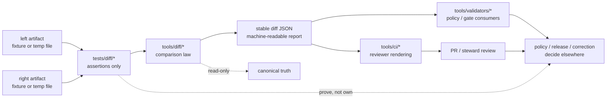

<!-- [KFM_META_BLOCK_V2]
doc_id: kfm://doc/NEEDS_VERIFICATION_UUID
title: diff
type: standard
version: v1
status: draft
owners: @bartytime4life
created: NEEDS_VERIFICATION_DATE
updated: 2026-04-16
policy_label: public
related: [
  ../README.md,
  ../ci/README.md,
  ../contracts/README.md,
  ../e2e/README.md,
  ../../README.md,
  ../../.github/README.md,
  ../../.github/CODEOWNERS,
  ../../.github/workflows/README.md,
  ../../.github/watchers/README.md,
  ../../scripts/README.md,
  ../../contracts/README.md,
  ../../schemas/README.md,
  ../../policy/README.md,
  ../../data/receipts/README.md,
  ../../data/proofs/README.md,
  ../../tools/diff/README.md,
  ../../tools/ci/README.md,
  ../../tools/attest/README.md,
  ../../tools/validators/README.md,
  ../../tools/validators/promotion_gate/README.md,
  ./test_stable_diff.py
]
tags: [kfm, tests, diff, verification, fixtures, stable-diff, review, receipts, proofs]
notes: [
  Current public-main evidence still shows tests/diff as a real leaf lane but README-only.
  Adjacent repo-facing docs point to tools/diff/stable_diff.py as the active thin slice and to tests/diff/test_stable_diff.py as the expected proof surface; both should be rechecked against the working branch before merge.
  This revision aligns the lane with newer receipt/proof, validator/attest, workflow, watcher, and CI-renderer documentation while keeping leaf-level inventory claims conservative.
]
[/KFM_META_BLOCK_V2] -->

<a id="top"></a>

# `tests/diff/`

Deterministic, public-safe proof surface for KFM diff helpers and the governed artifacts they compare.

> [!IMPORTANT]
> **Status:** experimental  
> **Owners:** `@bartytime4life` *(resolve against current `.github/CODEOWNERS` before merge; current visible coverage for `/tests/` routes here, but no leaf-specific `/tests/diff/` rule was directly surfaced in the evidence used for this revision)*  
> **Path:** `tests/diff/README.md`  
>         
> **Quick jumps:** [Scope](#scope) · [Repo fit](#repo-fit) · [Accepted inputs](#accepted-inputs) · [Exclusions](#exclusions) · [Current evidence snapshot](#current-evidence-snapshot) · [Directory tree](#directory-tree) · [Quickstart](#quickstart) · [Usage](#usage) · [Diff proof contract](#diff-proof-contract) · [Diagram](#diagram) · [Reference tables](#reference-tables) · [Task list / definition of done](#task-list--definition-of-done) · [FAQ](#faq) · [Appendix](#appendix)

> [!TIP]
> Keep the KFM trust split visible here:
>
> **fixtures + assertions ≠ helper implementation ≠ policy meaning ≠ reviewer rendering**
>
> - `../../tools/diff/` owns reusable comparison behavior  
> - `tests/diff/` proves deterministic helper behavior  
> - `../../tools/ci/` renders reviewer-facing summaries from diff output  
> - `../../tools/validators/` and `../../policy/` decide what happens next  
> - `../../data/receipts/` and `../../data/proofs/` remain distinct governed trust surfaces

> [!WARNING]
> Fixtures here should stay tiny, deterministic, and safe to print in CI logs.
>
> Never commit:
>
> - tokens
> - unpublished evidence
> - internal-only trust objects
> - secret-bearing state
> - sensitive location-bearing payloads
>
> as “convenient” diff fixtures.

---

## Scope

`tests/diff/` is the KFM verification lane for proving that diff helpers behave predictably over already-governed artifacts.

This lane is the right home for:

- tests for same / changed / blocking semantics on stable diff helpers
- tests for deterministic normalization behavior
- tests for machine-readable diff output shape
- helper-focused negative-path cases such as malformed JSON, missing files, invalid CLI combinations, or unstable output shape
- small fixture-based comparisons of manifests, receipts, catalogs, bundles, review records, or promotion artifacts **when** the artifact class is already declared elsewhere
- future geometry-summary proof **only after** a geometry-aware diff helper is actually landed

This lane is **not** the home for:

- policy authority
- promotion or release decisions
- helper implementation code
- hidden workflow logic
- long-running end-to-end orchestration
- renderer formatting contracts
- receipt or proof storage
- broad runtime-proof scenario packs that belong in a stronger lane

This README serves two roles at once:

1. a **normative lane contract** for diff-helper proof surfaces
2. an **implementation-facing landing README** for the current `tests/diff/` leaf

### Working question

> **Given two declared artifacts of the same class, does the comparator report their differences deterministically, fail clearly on malformed input, and stay separate from policy, rendering, and release authority?**

### Truth labels used in this README

| Label | Meaning here |
| --- | --- |
| **CONFIRMED** | Supported by directly surfaced repo-facing evidence or stable adjacent repo docs used in this revision |
| **INFERRED** | Conservative reading of neighboring surfaces that is useful but not proven as current checked-in lane fact |
| **PROPOSED** | Recommended target shape or future coverage pattern consistent with KFM doctrine |
| **UNKNOWN** | Not surfaced strongly enough to describe as current repo fact |
| **NEEDS VERIFICATION** | Placeholder or lane detail that should be rechecked against the working branch before merge |

[Back to top](#top)

---

## Repo fit

**Path:** `tests/diff/README.md`  
**Role:** directory README for helper-proof coverage around the `tools/diff/` family.

| Direction | Surface | Why it matters |
| --- | --- | --- |
| Parent | [`../README.md`](../README.md) | `tests/` is the broader governed verification boundary |
| Root posture | [`../../README.md`](../../README.md) | keeps this lane subordinate to the repo’s evidence-first and trust-visible posture |
| Governance | [`../../.github/README.md`](../../.github/README.md) | the gatehouse is the caller boundary, not the place where helper law should disappear |
| Ownership | [`../../.github/CODEOWNERS`](../../.github/CODEOWNERS) | resolve final owner coverage before merge if this lane gains new files |
| Workflow boundary | [`../../.github/workflows/README.md`](../../.github/workflows/README.md) | orchestration belongs at the caller seam, not in diff proofs |
| Watcher boundary | [`../../.github/watchers/README.md`](../../.github/watchers/README.md) | watcher lanes may emit receipts or bundle artifacts that later need deterministic comparison without moving watcher logic here |
| Primary subject lane | [`../../tools/diff/README.md`](../../tools/diff/README.md) | defines the comparison lane and the current adjacent thin-slice expectations |
| Adjacent reviewer lane | [`../ci/README.md`](../ci/README.md) and [`../../tools/ci/README.md`](../../tools/ci/README.md) | reviewer-facing rendering belongs there, not here |
| Adjacent contract lane | [`../contracts/README.md`](../contracts/README.md) | valid/invalid object-shape proof stays separate from comparison proof |
| Adjacent runtime lane | [`../e2e/README.md`](../e2e/README.md) | broad runtime- and release-path proof remains elsewhere |
| Adjacent trust lane | [`../../tools/attest/README.md`](../../tools/attest/README.md) | signed artifact verification stays there even when diff fixtures compare signed objects |
| Adjacent validator lane | [`../../tools/validators/README.md`](../../tools/validators/README.md) and [`../../tools/validators/promotion_gate/README.md`](../../tools/validators/promotion_gate/README.md) | policy and promotion gates may consume diff output, but they remain separate authority surfaces |
| Thin orchestration | [`../../scripts/README.md`](../../scripts/README.md) | callers may run diff helpers, but helper-proof burden should remain visible outside shell glue |
| Canonical law | [`../../contracts/README.md`](../../contracts/README.md), [`../../schemas/README.md`](../../schemas/README.md), [`../../policy/README.md`](../../policy/README.md) | this lane validates declared authority; it must not quietly replace it |
| Receipt boundary | [`../../data/receipts/README.md`](../../data/receipts/README.md) | receipts may appear as compared artifacts or refs, but remain process memory |
| Proof boundary | [`../../data/proofs/README.md`](../../data/proofs/README.md) | proofs may appear as compared artifacts or refs, but remain higher-order trust objects |

### Working interpretation

Use `tests/diff/` when the main job is **prove comparison-helper behavior over declared artifacts**.

Move out of this lane when the main job becomes:

- define diff law itself
- render reviewer Markdown
- decide policy or promotion
- own authoritative schemas
- orchestrate broad runtime-proof flows
- store receipts or proofs

[Back to top](#top)

---

## Accepted inputs

### Accepted inputs

| Input class | Examples | Why it belongs here |
| --- | --- | --- |
| Tiny governed fixture pairs | `left.json`, `right.json`, small manifest-like, receipt-like, proof-like, bundle-like, or catalog-like examples | keeps proof readable and deterministic |
| Machine-readable diff output | `diff-report.json`, stdout JSON emitted by a helper | lets tests validate stable output shape instead of scraping prose |
| Helper-focused negative paths | malformed JSON, missing file path, invalid CLI combinations | proves calm fail-closed behavior |
| Caller-adjacent examples | promotion-bundle fixture pairs, receipt snapshots, catalog closure snapshots, proof-state snapshots | useful when the helper stays comparator-only and the fixture remains public-safe |
| Trust-chain refs | `receipt_ref`, `proof_ref`, prior bundle refs, release refs | helpful when the comparison contract depends on visible linkage instead of raw embedded payloads |

### Expected fixture posture

- small enough to review in one screen
- deterministic under repeated local and CI runs
- explicit about normalization assumptions
- safe to print in logs
- joinable back to the compared artifact class by path or identifier
- explicit about whether the compared thing is a receipt, proof, bundle, catalog record, or generic JSON object

[Back to top](#top)

---

## Exclusions

`tests/diff/` should not absorb work that belongs elsewhere.

| Keep out of this lane | Put it here instead | Why |
| --- | --- | --- |
| Comparison-helper implementation code | [`../../tools/diff/README.md`](../../tools/diff/README.md) and `../../tools/diff/*` | implementation and proof are different burdens |
| Reviewer-facing Markdown rendering | [`../../tools/ci/README.md`](../../tools/ci/README.md) and [`../ci/README.md`](../ci/README.md) | rendering is adjacent, not primary, here |
| Promotion or release decisions | [`../../policy/README.md`](../../policy/README.md) and validator lanes | a passing diff test never equals publish approval |
| Signature generation or verification | [`../../tools/attest/README.md`](../../tools/attest/README.md) | comparing signed artifacts is fine; trust proof still belongs elsewhere |
| Workflow sequencing, permissions, or branch rules | [`../../.github/workflows/README.md`](../../.github/workflows/README.md) | orchestration belongs at the caller seam |
| Broad runtime-proof packs | stronger end-to-end proof lanes | keep this lane helper-focused |
| Secret-bearing or unpublished fixtures | secure data lanes | public test surfaces must remain safe to clone and review |
| Receipt archives or proof-pack archives | [`../../data/receipts/README.md`](../../data/receipts/README.md), [`../../data/proofs/README.md`](../../data/proofs/README.md) | this lane proves comparison behavior; it does not own trust-object storage |

[Back to top](#top)

---

## Current evidence snapshot

| Evidence item | Status | How this README uses it |
| --- | --- | --- |
| `tests/` is a governed verification surface rather than a generic QA bucket | **CONFIRMED** | grounds the lane’s trust-bearing tone |
| `tests/diff/` exists as a child lane under `tests/` | **CONFIRMED** | justifies a real lane README instead of a generic placeholder |
| the live `tests/diff/` leaf currently shows `README.md` only | **CONFIRMED** | prevents overclaiming mounted test inventory |
| the live `tests/diff/README.md` blob is currently empty | **CONFIRMED** | makes a landing README materially useful |
| `../../tools/diff/README.md` documents `stable_diff.py` as the current thin-slice comparator | **CONFIRMED via adjacent repo-facing documentation** | gives this lane a concrete subject under test |
| the same adjacent `tools/diff/README.md` names `tests/diff/test_stable_diff.py` as the expected proof surface | **CONFIRMED via adjacent repo-facing documentation** | provides the most likely first executable proof target |
| updated adjacent docs now explicitly distinguish receipts from proofs and validators from attestation helpers | **CONFIRMED in-session doctrine alignment** | keeps trust-chain comparison language explicit and bounded |
| the live `tests/diff/` leaf does not currently prove that `test_stable_diff.py` is present on public `main` | **NEEDS VERIFICATION** | keeps current-vs-adjacent evidence visibly separated |
| exact local fixture inventory, caller scripts, workflow wiring, and merge-blocking status for this lane | **UNKNOWN / NEEDS VERIFICATION** | prevents unsupported maturity claims |

> [!NOTE]
> The key discipline here is simple: keep **repo-visible truth** above cleaner theory.  
> This lane should describe the smallest real thing clearly, then show the landing path without upgrading adjacent documentation into settled leaf-level fact.

[Back to top](#top)

---

## Directory tree

### Current confirmed lane shape

```text
tests/diff/
└── README.md
```

### Adjacent documented first proof target (**NEEDS VERIFICATION** on the working branch)

```text
tools/diff/
├── README.md
└── stable_diff.py

tests/diff/
├── README.md
└── test_stable_diff.py
```

### `PROPOSED` slightly richer landing shape

```text
tests/diff/
├── README.md
├── test_stable_diff.py
└── fixtures/
    ├── same/
    ├── changed/
    ├── trust_chain/
    └── invalid/
```

### Reading rule for this tree

Use the split above intentionally:

- the first tree is **current lane fact**
- the second tree is **adjacent documented target shape**
- the third tree is **preferred future growth**
- anything beyond that remains **UNKNOWN** or **NEEDS VERIFICATION** until the active checkout is inspected directly

[Back to top](#top)

---

## Quickstart

Start with inventory, not invention.

### 1) Recheck what actually exists in the lane

```bash
test -d tests/diff && find tests/diff -maxdepth 3 \( -type f -o -type d \) | sort
sed -n '1,260p' ../README.md 2>/dev/null
sed -n '1,320p' ../../tools/diff/README.md 2>/dev/null
sed -n '1,320p' ../ci/README.md 2>/dev/null
sed -n '1,320p' ../../tools/ci/README.md 2>/dev/null
sed -n '1,260p' ../../data/receipts/README.md 2>/dev/null
sed -n '1,260p' ../../data/proofs/README.md 2>/dev/null
git grep -n "tests/diff\|stable_diff\|render_diff_summary\|receipt_ref\|proof_ref" -- . || true
```

### 2) If the adjacent thin slice is already landed on the checked-out branch, exercise it

```bash
pytest -q tests/diff/test_stable_diff.py

python tools/diff/stable_diff.py \
  --left left.json \
  --right right.json \
  --output diff-report.json
```

### 3) Syntax-check only what actually exists

```bash
find tests/diff -type f -name "*.py" -print0 2>/dev/null | xargs -0 -r -n1 python -m py_compile
find tests/diff -type f -name "*.sh" -print0 2>/dev/null | xargs -0 -r -n1 bash -n
```

> [!NOTE]
> If the checked-out branch still matches the current confirmed leaf shape, treat this README as the lane contract and landing plan for the first executable proof file, not as evidence that the proof file already exists locally.

[Back to top](#top)

---

## Usage

### Add the first concrete diff-proof test

When `tests/diff/` is still effectively README-led, land the first proof file with the same discipline KFM asks of the rest of the system:

1. identify the comparison subject first
2. keep the first fixture pair tiny and public-safe
3. prove machine-readable output before adding reviewer rendering
4. assert exit semantics explicitly
5. keep the test comparator-only
6. document any branch-visible caller the same day it becomes merge-relevant

### Good first assertions for the adjacent `stable_diff.py` thin slice

The adjacent comparison lane documents a narrow first helper. The first proof file here should stay equally narrow.

| Case | Good assertion here | Status in this README |
| --- | --- | --- |
| equivalent JSON under different key order | status is `same`; `blocking` is `false`; added / removed / changed lists are empty | **adjacent documented target** |
| one added, one removed, one changed top-level key | status is `changed`; key lists stay deterministic | **adjacent documented target** |
| `--fail-on-change` mode | non-zero exit when differences exist; payload still remains machine-readable | **adjacent documented target** |
| malformed or unreadable input | explicit helper failure without silent rewrite | **PROPOSED first negative path** |
| trust-chain-like drift | receipt/proof/bundle refs differ while output keeps the compared roles explicit | **PROPOSED once current caller need is verified** |

### Keep the boundary clean

A healthy split for this lane looks like this:

- `../../tools/diff/` owns comparison behavior
- `tests/diff/` proves deterministic behavior
- `../../tools/ci/` renders stable diff reports for reviewers
- `../../tools/attest/` handles signature and verification work
- `../../policy/` and validator lanes decide materiality, allow/deny, and promotion outcomes
- `../../scripts/` and `../../.github/workflows/` orchestrate callers
- `../../data/receipts/` and `../../data/proofs/` remain storage and trust-state lanes, not diff-proof lanes

[Back to top](#top)

---

## Diff proof contract

A diff test here should prove more than “the process exited.”

| Proof target | Minimum assertion |
| --- | --- |
| Deterministic equality | the same logical object under normalized ordering compares as `same` |
| Stable change reporting | added / removed / changed sets remain deterministic and machine-readable |
| Explicit blocking mode | `--fail-on-change` or equivalent blocking mode returns the documented non-zero exit while preserving machine-readable output |
| Calm negative-path behavior | malformed or unreadable input fails clearly without silent coercion |
| Output contract | emitted diff JSON remains stable enough for validators, CI renderers, and review tooling to consume |
| Trust-chain distinction | receipts, proofs, bundles, and catalog-like artifacts remain distinguishable in fixtures and assertions when compared |
| Non-authority boundary | a passing diff test proves comparison behavior only; it does not prove policy significance, validator correctness, or publication safety |

> [!IMPORTANT]
> “Fail closed” in this lane does **not** mean every diff is fatal.
> It means documented blocking modes, malformed-input cases, and output contracts fail consistently, visibly, and without quietly rewriting the evidence of what changed.

[Back to top](#top)

---

## Diagram



[Back to top](#top)

---

## Reference tables

### Proof focus matrix

| Subject | Good proof here | Not this lane | Current status |
| --- | --- | --- | --- |
| top-level JSON diff semantics | same / changed / blocking output shape | policy classification or publication approval | **adjacent documented target** |
| exit semantics | code `0` for non-blocking success, code `1` for fail-on-change, calm error on broken input | workflow retry policy or required-check enforcement | **adjacent documented target** |
| machine-readable output contract | deterministic keys, stable list ordering, no prose scraping required | reviewer Markdown formatting | **adjacent documented target** |
| promotion-bundle fixture comparisons | comparator-only prior/current checks | gate decisions or attestation verification | **PROPOSED once caller is verified** |
| receipt / proof / bundle-ref comparisons | explicit comparison of trust-chain carriers without flattening their roles | trust significance or validity of those carriers | **PROPOSED once helper contract requires it** |
| geometry-summary cases | read-only summary behavior | geometry repair or authoritative rewrite | **PROPOSED** |

### Fixture rules

| Prefer | Avoid | Why |
| --- | --- | --- |
| tiny left/right pairs | giant snapshot dumps | reviewers should understand the proof in one pass |
| temp-file tests where possible | helper-local hidden state | keeps the proof self-contained |
| explicit normalization assumptions | implicit mutation during setup | diff law must remain visible |
| machine-readable assertions | prose-only expectations | CI and humans both benefit from stable output |
| public-safe examples | unpublished evidence, tokens, precise sensitive data | `tests/` is cloneable review surface |
| caller-neutral fixtures | workflow-specific shell blobs | helper proof should survive outside one CI job |
| explicit receipt/proof/bundle labels | generic “artifact” blobs | trust-chain roles should remain visible under comparison |

[Back to top](#top)

---

## Task list / Definition of done

### Definition of done for this README revision

- [x] the lane contract is explicit
- [x] current direct repo evidence and adjacent documented target state are separated clearly
- [x] repo fit, accepted inputs, exclusions, and boundary rules are documented
- [x] quickstart starts with inventory before runner claims
- [x] receipt/proof boundary language is explicit where comparison may touch trust-chain artifacts
- [x] the doc does not imply merge-blocking coverage or hidden workflow wiring without proof
- [x] at least one meaningful Mermaid diagram is present

### Next sensible expansions

- [ ] land `tests/diff/test_stable_diff.py` if it is not already present on the working branch
- [ ] add tiny same / changed / fail-on-change proof cases
- [ ] add malformed-input negative-path coverage
- [ ] add promotion-bundle or receipt/proof comparison fixtures once real callers are verified
- [ ] add geometry-summary proof only after a geometry-aware diff helper lands
- [ ] document specific workflow, script, or promotion callers once they are directly verified
- [ ] update this README immediately if branch-visible contents differ from the current confirmed leaf shape

[Back to top](#top)

---

## FAQ

### Why separate `tests/diff/` from `tools/diff/`?

Because KFM keeps helper implementation and helper proof separate. `tools/diff/` should stay reusable and reviewable; `tests/diff/` should prove that behavior without absorbing policy, release, or workflow logic.

### Why not just use `git diff`?

`git diff` is still useful. This lane exists for cases where reviewers or CI need deterministic normalization, stable machine-readable output, or artifact-aware comparison behavior that plain line diffs do not provide by themselves.

### Does this lane decide whether a change is safe to publish?

No. This lane can prove what a comparator reports. Policy, review, correction, validator, and release surfaces decide what happens next.

### Why is `test_stable_diff.py` not described as current fact here?

Because current leaf-level repo-facing evidence for `tests/diff/` is still README-only. Adjacent docs point to `test_stable_diff.py` as the expected proof surface, but this README does not upgrade that expectation into settled leaf fact without a branch-visible file.

### Can promotion bundles or signed artifacts appear here?

Yes, but only as fixture inputs for comparator proof. Signature generation and verification remain in `../../tools/attest/`; promotion decisions remain in `../../policy/` and validator lanes; reviewer rendering remains in `../../tools/ci/`.

### Why mention receipts and proofs here?

Because downstream promotion, review, and handoff flows increasingly depend on visible trust-chain drift. Mentioning them keeps the boundary explicit; it does not move their ownership or storage into this lane.

### Can this lane grow beyond one first test file?

Yes, but slowly. Small, truthful, reviewable additions are better than a decorative scaffold that implies broader mounted coverage than the branch actually proves.

[Back to top](#top)

---

## Appendix

<details>
<summary><strong>Appendix A — Current evidence this README is built to respect</strong></summary>

1. `tests/diff/` exists as a real leaf lane under `tests/`.
2. Direct public-main evidence currently shows that leaf as `README.md` only.
3. The current `tests/diff/README.md` blob is effectively empty.
4. The broader `tests/` lane is already framed as governed verification rather than generic QA.
5. The adjacent `tools/diff/README.md` now documents a thin-slice comparator named `stable_diff.py`.
6. The same adjacent diff lane names `tests/diff/test_stable_diff.py` as the expected proof surface.
7. That expected proof surface is useful guidance, but it still needs working-branch verification at this leaf.
8. Reviewer rendering, signature work, validator interpretation, receipt/process-memory storage, and proof storage all have distinct adjacent lanes and should stay distinct.

[Back to top](#top)

</details>

<details>
<summary><strong>Appendix B — Starter proof shape for the first landed test file</strong></summary>

A good first proof file here would stay very small:

```text
tests/diff/
├── README.md
└── test_stable_diff.py
```

A good first proof burden would cover:

1. equivalent JSON under reordered keys
2. added / removed / changed top-level keys
3. `--fail-on-change` blocking behavior
4. one calm negative path for malformed input

That is enough to activate the lane without pretending nested diff law, trust-chain materiality, geometry support, or reviewer rendering already belong here.

[Back to top](#top)

</details>

<details>
<summary><strong>Appendix C — Reconciliation rule if the checked-out branch differs</strong></summary>

If the checked-out branch later differs from the branch-visible shape used for this README:

1. keep the burden-first language
2. replace path claims with branch-visible paths immediately
3. preserve the split between current repo truth and adjacent doc guidance
4. downgrade unsupported detail to **UNKNOWN** or **NEEDS VERIFICATION**
5. resist the temptation to preserve a prettier tree over a truer one

The goal is not to preserve a guessed lane.  
The goal is to preserve truthful verification law.

[Back to top](#top)

</details>
