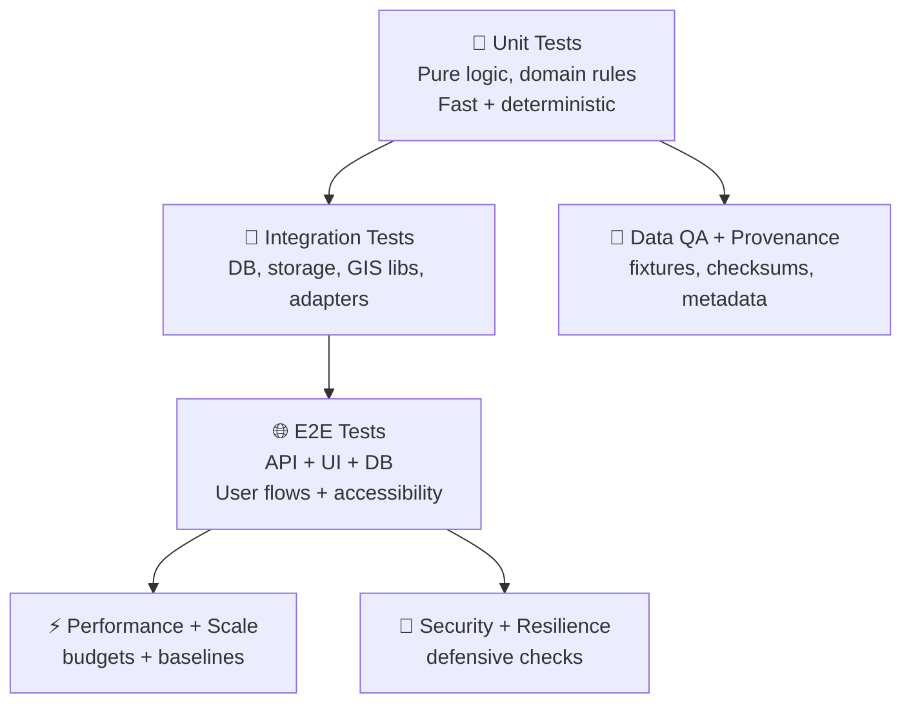

<!--
📄 File: tests/docs/README.md
🧭 Purpose: Single entry point for *how we test* the Kansas Frontier Matrix (KFM) / Kansas-Matrix-System.
-->

# 🧪 Tests Docs Hub — Kansas Frontier Matrix (KFM)


> [!IMPORTANT]
> **KFM is provenance-first.** Tests are not only “does it work?” checks — they are **auditable evidence** that:
> - the data pipelines are reproducible 🧬  
> - the geospatial layers are consistent 🗺️  
> - the models are validated (within declared limits) 🧮  
> - the UI is trustworthy + accessible 🧑‍🤝‍🧑  
> - the system remains maintainable as requirements evolve 🔁

---

## 🧭 What lives in `tests/docs/`

This folder is the **documentation spine** for testing in this repo.

- ✅ **Test philosophy** (what we optimize for)
- ✅ **Test pyramid** (what we run most often vs. least often)
- ✅ **Fixtures & provenance** (how we make data testable + auditable)
- ✅ **Geospatial QA** (CRS/topology/raster/vector sanity)
- ✅ **Model & simulation validation** (numerics, regression, uncertainty)
- ✅ **Performance & scale** (DB + pipeline budgets)
- ✅ **Security & resilience** (defensive posture + guardrails)
- ✅ **Reference library index** (project PDFs that shape our approach) 📚

---

## ⚡ Quick start (developer ergonomics)

> [!NOTE]
> Commands below are **intentionally tool-agnostic** (Python/Node/R/Java may coexist here).
> Replace `…` with your repo’s real scripts once they exist.

### 1) Smoke tests (fastest signal)
```bash
# recommended: <60s, runs on every PR
make test-smoke
```

### 2) Full local validation (slower, thorough)
```bash
make test
```

### 3) Narrow runs (when you’re iterating)
```bash
make test-unit
make test-integration
make test-e2e
make test-perf
make test-security
```

### 4) Test data / fixtures (rebuild deterministically)
```bash
make fixtures
make fixtures-verify
```

---

## 🏗️ Testing model (pyramid + provenance)



**Rule of thumb 🧠**
- Run **Unit + Data QA** constantly.
- Run **Integration** often.
- Run **E2E** when flows change.
- Run **Perf/Security** at least nightly + before releases.

---

## 🗂️ Suggested test directory layout

> [!TIP]
> Mirror **clean architecture boundaries**: Domain → Services → Adapters → UI.

```text
📁 tests/
├─📁 docs/                         📄 this file + testing playbooks
│  └─📄 README.md
├─📁 unit/                         🧩 pure logic + deterministic math
├─📁 integration/                  🔌 db, storage, external interfaces
├─📁 e2e/                          🌐 full-stack flows (API + UI)
├─📁 performance/                  ⚡ benchmarks, budgets, regressions
├─📁 security/                     🔐 static checks, threat-driven tests
├─📁 data/                         🧪 fixtures, manifests, goldens
│  ├─📁 fixtures/
│  ├─📁 goldens/
│  └─📁 schemas/
└─📁 tools/                        🧰 helper scripts (deterministic!)
```

---

## ✅ Test categories (what we verify)

### 🧩 Unit tests
Focus: correctness of **domain entities + business rules**.
- deterministic, no network, no DB
- property-based testing encouraged (where it increases confidence)
- numerical tests must declare tolerances explicitly

### 🔌 Integration tests
Focus: correctness of **interfaces & adapters**.
Examples:
- Postgres queries / migrations / indexing assumptions 🐘
- geospatial libraries producing expected output (GDAL/GeoPandas equivalents)
- storage adapters (local FS / object store)
- remote sensing fetch logic (mocked, cached, or replayable)

### 🌐 End-to-end tests
Focus: **user workflows** and trust signals.
Examples:
- “search → map → inspect provenance → export”
- accessibility checks (keyboard nav, ARIA, contrast)
- visual regressions (maps + WebGL layers) with tolerance thresholds

### 🗺️ Geospatial QA tests (vector + raster)
Focus: integrity of spatial truth.
- CRS correctness & explicit transforms (no silent CRS mixing)
- topology checks (self-intersections, invalid polygons, winding rules)
- bounding-box / tile sanity
- deterministic reprojection + rounding strategy

### 🛰️ Remote sensing & Earth observation tests
Focus: pipeline reproducibility and metadata integrity.
- stable dataset IDs and timestamps
- repeatable preprocessing (masking, clipping, compositing)
- compare **summary statistics** (not only pixel-perfect) when appropriate
- enforce metadata completeness (sensor, band, resolution, projection, QA flags)

### 🤖 ML/AI evaluation tests
Focus: *measurable* model quality + safety guardrails.
- fixed dataset snapshots + split manifests
- baseline comparisons (don’t regress silently)
- calibration & uncertainty checks (where relevant)
- “evidence-backed outputs” requirements (citations + traceability)

### 🧮 Modeling & simulation validation (V&V mindset)
Focus: numerical stability + real-world plausibility.
- sanity tests: units, bounds, conservation rules (if applicable)
- convergence tests: grid refinement / timestep checks
- regression tests: known inputs → expected outputs (within tolerance)
- uncertainty: document what the test *doesn’t* prove

### ⚡ Performance & scale tests
Focus: budgets + regression detection.
- query latency budgets and throughput targets
- ETL pipeline runtime budgets
- memory ceilings for large rasters/tiles
- avoid flaky perf tests: prefer “relative to baseline” + robust statistics

### 🔐 Security & resilience tests (defensive)
Focus: hardening, not exploitation.
- dependency / supply-chain scanning
- secrets detection
- config linting (CORS, CSP, headers)
- authz tests (deny-by-default)
- abuse cases: rate limits, payload size, invalid geometry bombs, etc.

---

## 🧬 Fixtures, provenance, and “test data that can testify”

> [!IMPORTANT]
> A fixture without provenance is a liability.  
> Every fixture must be attributable, reproducible, and minimally scoped.

### ✅ Fixture rules
- **Small**: minimal size that still catches the bug.
- **Stable**: checksum + versioned schema.
- **Explainable**: include `manifest.yml` (below).
- **Rebuildable**: include `build.py` / `build.sh` that deterministically recreates it.

### 📄 Fixture manifest template
```yaml
# tests/data/fixtures/<fixture_name>/manifest.yml
id: kfm.fixture.<name>.<version>
version: 1
description: "Short explanation of what this fixture is meant to test."
domain: [geospatial, remote_sensing, database, ui, ml, simulation]

sources:
  - name: "Source name (dataset, paper, archival map, etc.)"
    uri: "https://… OR internal path"
    license: "SPDX or human-readable"
    retrieved_at: "YYYY-MM-DD"
    checksum: "sha256:…"

processing:
  steps:
    - name: "clip"
      tool: "gdalwarp|geopandas|python|r|sql|…"
      params:
        bbox: [-101.2, 37.0, -101.0, 37.2]
    - name: "normalize"
      tool: "python"
      params:
        rounding: 6

expectations:
  - type: "golden"
    path: "expected.json"
    comparison: "exact|tolerant"
    tolerance:
      abs: 1e-6
      rel: 1e-4

provenance:
  owner: "@team-or-handle"
  reviewed_by: "@reviewer"
  notes: "Any caveats / known limitations."
```

### 🔍 Golden files & snapshot policy
Use goldens when:
- output is structured + stable (GeoJSON after canonicalization, JSON schemas, SQL plans)
- UI output can be snapshotted with controlled fonts/sizes
- model outputs have a clear baseline

Avoid goldens when:
- output is inherently noisy (perf metrics, nondeterministic GPU shading)
- output is huge (prefer summary metrics or hashing strategies)

---

## 🧷 Statistical tests (avoid “p-value cosplay”)

When tests use statistics (e.g., regression baselines, model metrics, performance):
- **pre-register** the metric + threshold in the test (don’t “eyeball pass”)
- track **effect size** and **variance**, not just pass/fail
- treat multiple comparisons carefully (don’t create false failures)
- prefer robust summaries (median, percentiles) for noisy signals

---

## 🎛️ Determinism & randomness policy

- Seed all RNGs (Python/JS/R) ✅  
- Log seeds on failure ✅  
- Keep tests hermetic (no live network) ✅  
- If a test *must* use nondeterminism (rare), isolate it under:
  - `performance/` or `chaos/` style suites
  - explicit rerun logic + statistical pass criteria

---

## 🧰 CI gates (recommended default)

> [!TIP]
> Optimize for fast feedback + high confidence.

**PR gates (fast):**
- format + lint
- unit tests
- fixture verification (checksums + schemas)
- a small integration slice (DB migrations + 1 representative query)
- a small e2e slice (one critical flow)

**Nightly gates (deep):**
- full integration suite
- e2e across key browsers/devices (if applicable)
- perf regression suite
- security scan suite

---

## 🧑‍🔧 Contributing tests (the “Definition of Done” checklist)

A PR is “done” when:
- [ ] new behavior includes tests
- [ ] fixtures include manifests + checksums
- [ ] tests explain **why** the check exists (not just how)
- [ ] tolerances are justified (numerics/geo)
- [ ] performance claims include budgets + measurement method
- [ ] security-sensitive changes include threat-driven tests
- [ ] docs updated (this folder) when behavior changes

---

## 📚 Project reference library index (all project files)

> [!NOTE]
> These PDFs are the **shared research backbone** used to shape testing strategy across:
> scientific computing, geospatial integrity, statistics, ML, performance, security, and UI.

<details>
<summary>📦 Click to expand the full library list (37 files)</summary>

### 🧠 Science, statistics, ML, and modeling
- **`Scientific Modeling and Simulation_ A Comprehensive NASA-Grade Guide.pdf`** — verification/validation mindset, numerical rigor 🧮  
- **`Understanding Statistics & Experimental Design.pdf`** — experiment design, error control, interpretation ✅  
- **`regression-analysis-with-python.pdf`** — regression workflows + diagnostics 📈  
- **`Regression analysis using Python - slides-linear-regression.pdf`** — quick linear-regression reference 📉  
- **`think-bayes-bayesian-statistics-in-python.pdf`** — Bayesian thinking for uncertainty + decision tests 🎲  
- **`Basics of Linear Algebra for Machine Learning.pdf`** — linear algebra foundations for numerical tests ➗  
- **`Understanding Machine Learning: From Theory to Algorithms.pdf`** — learning theory + evaluation principles 🤖  
- **`Deep Learning for Coders with fastai and PyTorch - Deep.Learning.for.Coders.with.fastai.and.PyTorchpdf`** — pragmatic ML training/eval patterns 🧠  
- **`Principles of Biological Autonomy - book_9780262381833.pdf`** — complex systems framing (useful for agent/eco models) 🌿  
- **`Spectral Geometry of Graphs.pdf`** — graph algorithms + spectral methods (test invariants + bounds) 🕸️  
- **`Generalized Topology Optimization for Structural Design.pdf`** — optimization + simulation validation patterns 🧱  

### 🗺️ GIS, cartography, remote sensing, 3D
- **`Kansas Frontier Matrix (KFM) – Comprehensive Technical Documentation.pdf`** — architecture + provenance-first principles 🧾  
- **`python-geospatial-analysis-cookbook.pdf`** — geospatial processing recipes (good fixture patterns) 🗺️  
- **`making-maps-a-visual-guide-to-map-design-for-gis.pdf`** — cartographic QA + visual validation 🎨  
- **`Mobile Mapping_ Space, Cartography and the Digital - 9789048535217.pdf`** — field/mobile mapping considerations 📍  
- **`Cloud-Based Remote Sensing with Google Earth Engine-Fundamentals and Applications.pdf`** — remote sensing pipelines + reproducibility 🛰️  
- **`Archaeological 3D GIS_26_01_12_17_53_09.pdf`** — 3D GIS concepts + volumetric thinking 🧊  
- **`compressed-image-file-formats-jpeg-png-gif-xbm-bmp.pdf`** — image formats & constraints (raster IO tests) 🖼️  
- **`webgl-programming-guide-interactive-3d-graphics-programming-with-webgl.pdf`** — WebGL rendering/precision considerations 🎮  

### 🗄️ Data management, performance, and architecture
- **`Database Performance at Scale.pdf`** — performance budgeting, workload thinking ⚡  
- **`PostgreSQL Notes for Professionals - PostgreSQLNotesForProfessionals.pdf`** — Postgres fundamentals for integration tests 🐘  
- **`Scalable Data Management for Future Hardware.pdf`** — scaling mindset, hardware-aware constraints 🧰  
- **`Data Spaces.pdf`** — data interoperability + architecture framing 🧩  
- **`Flexible Software Design.pdf`** — designing for change (tests as change insurance) 🔁  

### 🔐 Security, concurrency, and “sharp tools” (defensive use)
- **`ethical-hacking-and-countermeasures-secure-network-infrastructures.pdf`** — defensive security testing themes 🛡️  
- **`Gray Hat Python - Python Programming for Hackers and Reverse Engineers (2009).pdf`** — security awareness (use responsibly) 🧯  
- **`concurrent-real-time-and-distributed-programming-in-java-threads-rtsj-and-rmi.pdf`** — concurrency hazards + test strategies 🧵  

### 🌐 UI, web, and language reference collections
- **`responsive-web-design-with-html5-and-css3.pdf`** — responsive UI test coverage 📱  
- **`graphical-data-analysis-with-r.pdf`** — EDA patterns for QA + anomaly detection 🔍  
- **`A programming Books.pdf`** — language reference compendium (A–*) 🧰  
- **`B-C programming Books.pdf`** — language reference compendium (B–C) 🧰  
- **`D-E programming Books.pdf`** — language reference compendium (D–E) 🧰  
- **`F-H programming Books.pdf`** — language reference compendium (F–H) 🧰  
- **`I-L programming Books.pdf`** — language reference compendium (I–L) 🧰  
- **`M-N programming Books.pdf`** — language reference compendium (M–N) 🧰  
- **`O-R programming Books.pdf`** — language reference compendium (O–R) 🧰  
- **`S-T programming Books.pdf`** — language reference compendium (S–T) 🧰  
- **`U-X programming Books.pdf`** — language reference compendium (U–X) 🧰  
- **`On the path to AI Law’s prophecies and the conceptual foundations of the machine learning age.pdf`** — governance + accountability framing ⚖️  
- **`Introduction to Digital Humanism.pdf`** — human-centered safeguards + transparency 🧑‍🤝‍🧑  

</details>

---

## 🧾 Glossary (shared vocabulary)

- **Fixture**: a minimal dataset used to make a test meaningful and reproducible.
- **Golden**: an “expected output” artifact used for snapshot/regression comparisons.
- **Provenance**: the traceable chain from source → processing → output (including metadata).
- **V&V**: verification (correctly built) + validation (correctly represents reality within limits).
- **Budget**: explicit performance constraint (latency, memory, runtime) that tests enforce.

---

## 🗺️ Next docs to add (recommended)
- 📄 `tests/docs/fixtures.md` — fixture standards + manifest schema details
- 📄 `tests/docs/geospatial.md` — CRS/topology/raster/vector checklists
- 📄 `tests/docs/ml-eval.md` — dataset snapshotting, metrics, calibration, drift
- 📄 `tests/docs/performance.md` — budgets, baselines, how to avoid flaky perf tests
- 📄 `tests/docs/security.md` — defensive test suite + threat model mapping
