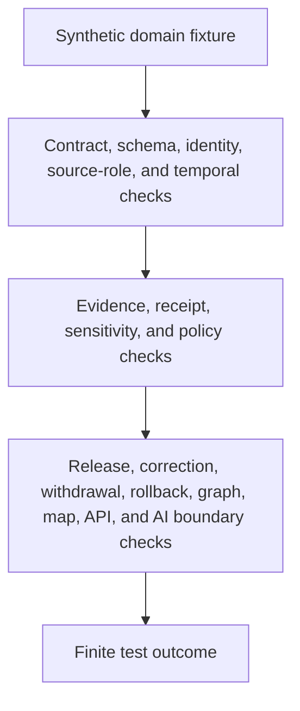

<!-- [KFM_META_BLOCK_V2]
doc_id: kfm://doc/tests-domains-readme
title: Domain Test Packages README
type: test-root-readme
version: v0.2
status: draft; greenfield-stub-replaced; cross-domain-test-parent-index; PROPOSED / NEEDS VERIFICATION before promotion
owners:
  - OWNER_TBD - QA steward
  - OWNER_TBD - Domain stewards
  - OWNER_TBD - Contracts steward
  - OWNER_TBD - Schema steward
  - OWNER_TBD - Evidence steward
  - OWNER_TBD - Policy steward
  - OWNER_TBD - Release steward
created: NEEDS VERIFICATION - greenfield stub existed before v0.2 expansion
updated: 2026-07-06
policy_label: public-doc; tests; domains; cross-domain-test-index; no-network; source-role-aware; temporal-scope-aware; evidence-bound; policy-gated; release-gated; rollback-aware
tags: [kfm, tests, domains, domain-tests, enforceability, no-network, fixtures, contracts, schemas, evidence, policy, release, rollback, SourceDescriptor, EvidenceBundle, EvidenceRef, PolicyDecision, ReviewRecord, ReleaseManifest, RollbackCard, CorrectionNotice, WithdrawalNotice, ABSTAIN, DENY, ERROR]
related:
  - ../README.md
  - ../../README.md
  - ../../docs/doctrine/directory-rules.md
  - ../../docs/architecture/domain-placement-law.md
  - ../../docs/domains/README.md
  - archaeology/README.md
  - agriculture/README.md
  - atmosphere/README.md
  - fauna/README.md
  - flora/README.md
  - geology/README.md
  - habitat/README.md
  - hydrology/README.md
  - people-dna-land/README.md
  - roads/README.md
  - roads-rail-trade/README.md
  - settlement/README.md
  - settlements-infrastructure/README.md
  - soil/README.md
notes:
  - "This README replaces the short parent stub at tests/domains/README.md."
  - "Directory Rules place enforceability proof under tests/. This directory is the parent index for per-domain test packages; it is not a domain authority, contract authority, schema authority, policy authority, evidence store, release root, public artifact root, map root, API root, or AI runtime root."
  - "Confirmed child domain README lanes are listed only where current-session GitHub readback or prior same-session GitHub evidence confirmed the file. Absence from this README does not prove absence from the repository."
  - "Executable tests, fixtures, validators, CI wiring, pass rates, release integration, and public-surface invalidation remain NEEDS VERIFICATION unless a child lane proves otherwise with current evidence."
  - "Compatibility or conflicted domain slices must stay subordinate to their canonical domain lanes until an ADR or governing README resolves placement."
[/KFM_META_BLOCK_V2] -->

<a id="top"></a>

# Domain test packages

> Parent index for KFM per-domain test packages under `tests/domains/`. Domain tests prove enforceability of contracts, schemas, evidence gates, policy gates, release gates, public-surface boundaries, correction paths, and rollback paths. They do not become domain truth.

<p>
  
  
  
  
  
</p>

**Path:** `tests/domains/README.md`  
**Status:** draft / greenfield stub replaced / cross-domain test parent index / PROPOSED until executable coverage is verified  
**Owning root:** `tests/`  
**Lane family:** `domains`  
**Default execution posture:** deterministic, synthetic, no-network, public-safe fixtures only  
**Truth posture:** CONFIRMED target file existed as a short parent stub before replacement; CONFIRMED multiple child domain README lanes were read from GitHub during authoring; NEEDS VERIFICATION for complete repository-wide child inventory, executable tests, fixture homes, validators, CI coverage, pass rates, and release integration.

---

## Purpose

`tests/domains/` is the parent index for domain-specific test packages.

A domain test package should prove that one domain's claims and derived carriers obey KFM guardrails: source-role discipline, deterministic identity, temporal separation, evidence resolution, policy gating, sensitivity handling, redaction/generalization receipts, release gating, correction, withdrawal, rollback, public-surface boundaries, and AI abstention where support is missing.

A passing test under this tree should **not** mean that the underlying claim is true, public, current, precise, legally authoritative, culturally cleared, operationally safe, or released. It should mean only that a scoped test expectation behaved as expected against bounded fixtures and local files.

[Back to top](#top)

---

## Placement Basis

Directory Rules classify `tests/` as the responsibility root for enforceability proof. Domain-specific tests belong under `tests/domains/<domain>/`. The domain segment is a responsibility-root segment, not a new top-level authority root.

| Responsibility | Correct home | This directory's relationship |
|---|---|---|
| Cross-domain test index | `tests/domains/README.md` | This file. |
| Domain test packages | `tests/domains/<domain>/` | Child packages indexed here. |
| Fixtures | `fixtures/domains/<domain>/` or accepted fixture homes | Referenced by tests; not duplicated here by default. |
| Semantic contracts | `contracts/domains/<domain>/` or ADR-selected equivalent | Tested here; not authored here. |
| Machine schemas | `schemas/contracts/v1/domains/<domain>/` or ADR-selected equivalent | Tested here; not authored here. |
| Source descriptors and registries | `data/registry/`, source catalog roots, or accepted homes | Referenced by tests; not authored here. |
| Evidence, proofs, receipts | `data/proofs/`, `data/receipts/`, and accepted trust roots | Referenced by tests; not stored here. |
| Binding policy | `policy/` roots | Tested here; not defined here. |
| Release decisions | `release/` roots | Tested here; not decided here. |
| Public artifacts and APIs | Governed artifact/API roots | Tested here only through safe envelopes and fixtures. |

> [!IMPORTANT]
> This directory may organize tests, fixture expectations, and proof-of-enforceability documentation. It must not collapse KFM's authority roots by storing contracts, schemas, policy, evidence, source payloads, release manifests, public artifacts, map layers, or AI runtime outputs.

---

## Parent Invariant

> **Domain tests prove guardrails; they do not become domain authority.**

All child domains should preserve these checks:

| Check | Required behavior | Failure outcome |
|---|---|---|
| Responsibility-root boundary | Test files stay under `tests/`; authority objects remain in their own roots. | validation failure / promotion block. |
| Source-role boundary | Source roles remain fixed and cannot be upcast by normalization, joining, graph projection, map display, generated wording, or release assembly. | `DENY` / `ABSTAIN`. |
| Identity boundary | Deterministic identity inputs remain explicit where material; display labels and geometry alone do not create identity. | validation failure. |
| Temporal boundary | Source, observed, valid, retrieval, release, and correction times remain distinct where material. | validation failure / `ABSTAIN`. |
| Evidence boundary | Consequential outputs require EvidenceRef-to-EvidenceBundle support or fail closed. | `ABSTAIN`. |
| Policy boundary | Rights, sensitivity, sovereignty, cultural review, living-person privacy, legal status, infrastructure exposure, land/ownership confusion, and release uncertainty fail closed. | `DENY` / `ABSTAIN`. |
| Receipt boundary | Redaction, aggregation, validation, correction, withdrawal, and rollback transforms remain auditable without exposing restricted payloads. | validation failure. |
| Public-surface boundary | Public API, map, tile, screenshot, Focus Mode, export, and AI carriers cannot bypass release state. | `DENY` / `ABSTAIN`. |
| Release boundary | Test success does not become ReleaseManifest approval, correction approval, withdrawal approval, rollback approval, or publication. | promotion block. |
| No-network boundary | Default domain tests do not call live feeds, source APIs, geocoders, graph databases, map services, public APIs, release services, or AI runtimes. | validation failure / `ERROR`. |

---

## Confirmed Domain Package Index

The table below lists domain package READMEs confirmed by GitHub readback during this session or by immediately prior same-session repo work. It is a navigation aid, not a full repository inventory.

| Domain package | Status observed | Notes |
|---|---|---|
| [`archaeology/`](archaeology/README.md) | CONFIRMED README / executable tests NEEDS VERIFICATION | Parent lane for archaeology fixture safety, source admission, policy behavior, evidence closure, review gating, release readiness, rollback, and public-safe transformation. |
| [`agriculture/`](agriculture/README.md) | CONFIRMED README / executable tests NEEDS VERIFICATION | Parent lane for agriculture schema, policy, aggregation, evidence/catalog closure, rollback, source-role, and public-safe context behavior. |
| [`atmosphere/`](atmosphere/README.md) | CONFIRMED README / scaffold | Parent lane for atmosphere records, source role, knowledge character, units, time facets, caveats, and finite outcomes. |
| [`fauna/`](fauna/README.md) | CONFIRMED README / scaffold | Parent lane for fauna evidence, sensitivity, policy, public UI, release, and rare/sensitive location boundaries. |
| [`flora/`](flora/README.md) | CONFIRMED README / coverage map PROPOSED | Parent lane for flora source descriptors, sensitivity, temporal behavior, release, evidence closure, and no-network posture. |
| [`geology/`](geology/README.md) | CONFIRMED README / executable tests NEEDS VERIFICATION | Parent lane for geology evidence, policy, source role, catalog closure, public-safe geometry, well rights, and Focus Mode boundaries. |
| [`habitat/`](habitat/README.md) | CONFIRMED README / executable tests NEEDS VERIFICATION | Parent lane for habitat, land cover, ecoregions, identity, policy, connectivity, corridor, restoration, and source descriptor tests. |
| [`hydrology/`](hydrology/README.md) | CONFIRMED README / executable tests NEEDS VERIFICATION | Parent lane for hydrology source role, identity, schema, policy, redaction, temporal behavior, evidence, release, and no-network tests. |
| [`people-dna-land/`](people-dna-land/README.md) | CONFIRMED greenfield stub | Parent still needs expansion. Sensitive child work must preserve consent, living-person, DNA, genealogy, land, graph, and release boundaries. |
| [`roads-rail-trade/`](roads-rail-trade/README.md) | CONFIRMED README / executable tests NEEDS VERIFICATION | Parent lane with confirmed `contracts/`, `evidence/`, `policy/`, and `release/` README families. |
| [`settlements-infrastructure/`](settlements-infrastructure/README.md) | CONFIRMED README / executable tests NEEDS VERIFICATION | Canonical domain parent with confirmed `identity/` child lane and singular `settlement/` compatibility slice. |
| [`soil/`](soil/README.md) | CONFIRMED README / executable tests NEEDS VERIFICATION | Parent lane for soil source role, support type, object family, temporal scope, evidence, policy, release, and rollback guardrails. |

---

## Compatibility and Variance Lanes

Some observed child lanes are compatibility slices rather than canonical domain authority. They may remain under `tests/domains/` only if they document their relationship to a canonical domain and avoid parallel authority.

| Compatibility lane | Status observed | Canonical / parent context | Boundary |
|---|---|---|---|
| [`roads/`](roads/README.md) | CONFIRMED README / compatibility slice | `roads-rail-trade/` | Road-mode tests must not split Roads/Rail/Trade authority. |
| [`settlement/`](settlement/README.md) | CONFIRMED README / CONFLICTED compatibility slice | `settlements-infrastructure/` | Singular settlement tests must not override canonical `settlements-infrastructure` slug posture. |

Compatibility lanes should carry explicit ADR or migration notes before executable tests are added at scale.

---

## Proposed Standard Child Families

Domain packages may vary, but mature domain test packages usually benefit from consistent child families.

| Family | Purpose | Boundary |
|---|---|---|
| `contracts/` | Tests semantic contract guardrails. | Does not define contract meaning. |
| `schemas/` or `schema/` | Tests machine shape, enums, required refs, and drift. | Does not author schemas. |
| `sources/` | Tests source admission, rights, cadence, source-role preservation, and no upcast behavior. | Does not store source payloads. |
| `identity/` | Tests deterministic identity and display/identity/release separation. | Does not create canonical truth. |
| `evidence/` | Tests EvidenceRef resolution, proof closure, receipts, and citation visibility. | Does not store evidence or proofs. |
| `policy/` | Tests deny/abstain/restrict behavior, sensitivity, rights, and review gates. | Does not define binding policy. |
| `release/` | Tests release gates, correction, withdrawal, rollback, and public-surface invalidation. | Does not approve release. |
| `graph/` | Tests graph projections as derived, evidence-subordinate, and rollbackable. | Does not make graph truth. |
| `map_api/` | Tests governed map/API/tile/export/Focus Mode public carriers. | Does not publish public carriers. |
| `ai_boundary/` | Tests generated-answer citation, abstention, and release boundaries. | Does not make AI sovereign truth. |
| `no_network/` | Tests deterministic default execution posture. | Does not replace integration tests. |

These names are **PROPOSED** defaults. Existing domain lanes may use different names; do not rename without an ADR, migration note, or parent README update.

---

## Cross-Domain Test Flow



The diagram describes intended test responsibility only. It does not prove that executable tests, validators, fixtures, policy runtime, release jobs, graph projections, public invalidation hooks, map behavior, AI behavior, or CI jobs currently exist.

---

## Accepted Inputs

Only bounded, synthetic, reviewable inputs belong in default domain tests:

- synthetic fixtures with fake source refs, object refs, evidence refs, policy refs, review refs, receipt refs, release refs, correction refs, withdrawal refs, and rollback refs
- local fixture envelopes that exercise expected behavior without calling live systems
- canary values that reveal source-role collapse, identity collapse, time collapse, legal-status overclaiming, precision laundering, sensitive-location exposure, graph-truth leakage, map-truth leakage, AI leakage, logging leakage, or public export leakage
- public-safe expected outcomes and reason codes
- local validation reports generated by test helpers

Safe outputs may include public-safe references and operational fields such as fixture ID, domain, object family, source role, time kind, validator name, finite outcome, reason code, evidence ref, policy decision ID, review record ID, receipt ref, release ref, correction ref, withdrawal ref, and rollback ref.

---

## Exclusions

Do not place these materials in `tests/domains/` or its default child lanes:

| Excluded material | Why it does not belong here |
|---|---|
| Real source exports, live feeds, geocoder responses, legal-status records, utility records, cadastral records, private datasets, or public payloads | Default tests must stay synthetic, deterministic, and no-network. |
| Secrets, credentials, private endpoint details, production logs, or production telemetry | Security and exposure risk. |
| Real EvidenceBundles, ProofPacks, production receipts, release manifests, rollback cards, correction notices, withdrawal notices, public artifacts, or audit ledgers | These are governed trust records or release artifacts. |
| Binding policy rules, schema definitions, contract prose, source descriptors, release procedures, graph implementation, map implementation, API implementation, or AI runtime implementation | Authority and implementation belong in their own responsibility roots. |
| Precise sensitive ecology, archaeology, sacred/burial site, living-person, DNA/genomic, critical infrastructure, property/title, owner/farm, or operational-security detail | Sensitive joins require governed policy, review, redaction, generalization, and release controls. |
| Public map layers, tiles, screenshots, exports, Focus Mode outputs, AI context packets, or public API payloads | Publication requires governed release. |

---

## Suggested Layout

```text
tests/domains/
|-- README.md
|-- archaeology/
|-- agriculture/
|-- atmosphere/
|-- fauna/
|-- flora/
|-- geology/
|-- habitat/
|-- hydrology/
|-- people-dna-land/
|-- roads-rail-trade/
|-- settlements-infrastructure/
|-- soil/
|-- roads/                    # compatibility slice; do not treat as canonical without ADR
`-- settlement/               # conflicted compatibility slice; do not treat as canonical without ADR
```

The layout above lists child README lanes confirmed during authoring. It is not a full absence/presence audit of every possible domain.

---

## Run Posture

No repository-wide executable test runner was verified while authoring this README. Once domain tests exist and are wired into CI, expected commands should be documented by the root test README and by each domain package.

```bash
: "PROPOSED / NEEDS VERIFICATION"
pytest tests/domains
```

Required run posture: no network access, no live service calls, no real secrets, no production logs, no production trust artifacts, no sensitive geometry, no public artifact writes, deterministic fixture inputs, and finite outcomes only: `PASS`, `DENY`, `ABSTAIN`, or `ERROR`.

---

## Minimal Cross-Domain Fixture

Synthetic parent fixtures should make cross-domain boundaries inspectable without carrying real source payloads or sensitive data.

```json
{
  "fixture_id": "tests-domains-parent-example",
  "domain": "example-domain",
  "test_family": "domain_guardrail",
  "object_family": "ExampleObject",
  "source_descriptor_id": "source-descriptor-fixture-domain-parent-001",
  "source_role": "candidate",
  "time_kind_under_test": "valid_time",
  "evidence_ref": "evidence-ref-fixture-domain-parent-001",
  "policy_decision_ref": "policy-decision-fixture-domain-parent-001",
  "review_record_ref": null,
  "release_manifest_ref": null,
  "rollback_card_ref": "rollback-card-fixture-domain-parent-001",
  "expected_outcome": "ABSTAIN",
  "safe_result_fields": {
    "validator_name": "tests_domains_parent_guardrail",
    "reason_code": "DOMAIN_TEST_DOES_NOT_AUTHORIZE_PUBLICATION"
  },
  "must_not_claim": [
    "SOURCE_TRUTH_CANARY",
    "LEGAL_STATUS_CANARY",
    "SENSITIVE_LOCATION_CANARY",
    "GRAPH_TRUTH_CANARY",
    "MAP_TRUTH_CANARY",
    "AI_TRUTH_CANARY",
    "RELEASE_APPROVAL_CANARY"
  ]
}
```

The JSON above is illustrative. Accepted schema, field names, fixture homes, vocabularies, reason codes, and CI wiring remain NEEDS VERIFICATION.

---

## Evidence Ledger

| Source | Status | Supports | Limits |
|---|---|---|---|
| `Directory Rules.pdf` and repo directory-rule docs | CONFIRMED doctrine | `tests/` is the enforceability root; domain tests belong under `tests/domains/<domain>/`; authority roots remain separate. | Does not prove executable tests, fixture coverage, CI, or pass rates. |
| GitHub target file before update | CONFIRMED repo evidence | `tests/domains/README.md` existed as a short parent stub before replacement. | Stub did not provide governance, lane index, run posture, validation, or rollback guidance. |
| Child domain README readbacks | CONFIRMED repo evidence | Confirmed several child domain packages and compatibility lanes listed in this README. | Readback does not prove all possible child domains or executable coverage. |
| Domain child README status fields | CONFIRMED repo evidence | Many child lanes explicitly mark executable tests, fixtures, validators, schemas, CI, and pass rates as NEEDS VERIFICATION, UNKNOWN, scaffold, or PROPOSED. | Status language varies by lane and should be normalized over time. |

---

## Validation Checklist

- [ ] Confirm full child-directory inventory for `tests/domains/` with a mounted repo or repository tree listing.
- [ ] Normalize stale or greenfield child README files, beginning with high-sensitivity lanes and lanes with confirmed child tests.
- [ ] Confirm accepted child family naming conventions where domains currently use variants such as `schema/` vs `schemas/`, `map_api/`, `ai_boundary/`, or object-specific test folders.
- [ ] Confirm fixture homes and naming conventions for each domain package.
- [ ] Confirm source-role, identity, time-kind, evidence, receipt, policy, review, release, correction, withdrawal, rollback, finite outcome, and reason-code vocabularies.
- [ ] Confirm no domain tests use real source feeds, live systems, secrets, production logs, production trust artifacts, sensitive geometry, or public artifact writes by default.
- [ ] Confirm public API, map, tile, screenshot, Focus Mode, export, and AI outputs cannot bypass EvidenceBundle resolution, source role, temporal scope, policy, review, release, correction, withdrawal, or rollback controls.
- [ ] Wire repository-wide domain tests into CI only after executable tests and safe fixtures exist.

---

## Rollback

Rollback is required if this parent index starts to store real source data, trust-bearing records, production release records, public artifacts, secrets, production logs, binding policy, contract/schema authority, graph implementation, map implementation, API implementation, or AI runtime behavior instead of documenting test boundaries.

Rollback is also required if this lane treats a test pass as source truth, legal status, public access, current-status proof, cultural clearance, critical-infrastructure exposure approval, graph truth, map truth, AI truth, release approval, correction approval, withdrawal approval, or rollback approval.

Rollback target: restore the previous safe README revision or remove this parent index until child lane inventory, fixtures, schemas, source-role handling, evidence expectations, policy expectations, release relationship, correction behavior, rollback behavior, and CI integration are reverified.

[Back to top](#top)