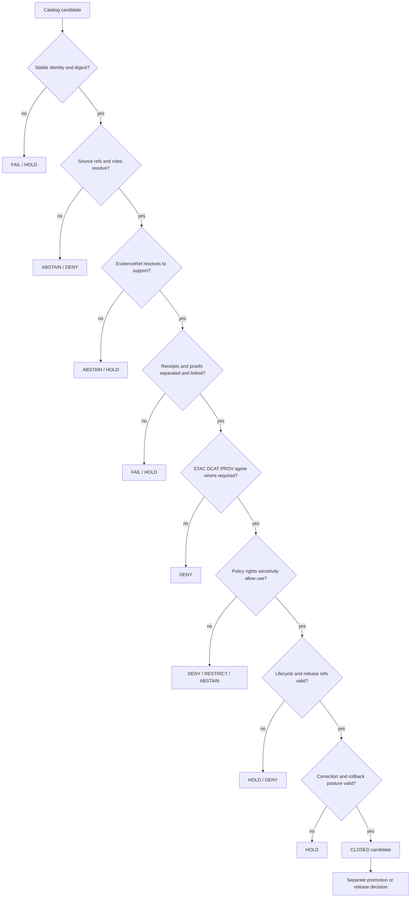

<!-- [KFM_META_BLOCK_V2]
doc_id: kfm://doc/tests-domains-agriculture-catalog-closure-readme
title: tests/domains/agriculture/catalog_closure/ — Agriculture Catalog-Closure Test Boundary
type: readme; directory-readme; domain-test-sublane; catalog-closure-enforceability-boundary
version: v0.2
status: draft; repository-grounded; README-only; implementation-unconfirmed; generic-catalog-schema-placeholder; validator-unconfirmed; ci-stub; non-authoritative
owners: OWNER_TBD — Agriculture test steward · Agriculture domain steward · Catalog steward · Evidence steward · Source steward · Receipt and proof steward · Policy steward · Release steward · Contract and schema steward · Validator steward · Docs steward
created: NEEDS VERIFICATION — empty placeholder was expanded before v0.2
updated: 2026-07-16
supersedes: v0.1 Agriculture catalog-closure test guide
policy_label: "public-review; tests; agriculture; catalog-closure; evidence-resolution; source-role-preservation; receipt-proof-catalog-release-separation; stac-dcat-prov; release-gated; correction-aware; rollback-aware; no-network; synthetic-fixtures; no-public-authority"
current_path: tests/domains/agriculture/catalog_closure/README.md
truth_posture: >
  CONFIRMED target v0.1 README and prior blob; canonical tests root; Agriculture parent
  test README; bounded repository search establishing no executable file under the
  catalog_closure child lane; Agriculture domain catalog README; Agriculture receipt and proof
  READMEs; draft CatalogMatrix semantic contract; placeholder CatalogMatrix schema requiring
  only id and allowing additional properties; missing declared CatalogMatrix validator at the
  checked path; proposed ADR-0022 STAC/DCAT/PROV agreement rule; Agriculture sensitivity and
  no-network doctrine; and domain-agriculture workflow with TODO-only jobs /
  PROPOSED catalog-closure case contract, closure-gate matrix, finite expected outcomes,
  synthetic fixture profile, cross-vocabulary agreement tests, public-surface anti-overclaim
  tests, correction and rollback cases, implementation sequence, definition of done, and
  migration plan /
  CONFLICTED current CatalogMatrix contract/schema homes under contracts/data and
  schemas/contracts/v1/data versus ADR-0022 proposed contracts/catalog and
  schemas/contracts/v1/catalog homes; current Agriculture domain catalog path under
  data/catalog/domain/agriculture versus ADR-0022 proposed matrix path under
  data/catalog/matrix/<domain>; catalog candidate, proof, receipt, and release object
  boundaries remain documented but not executable here /
  UNKNOWN collected Agriculture catalog-closure tests, fixture payloads, CatalogMatrix
  validator, STAC/DCAT/PROV resolvers, EvidenceRef resolver integration, policy evaluator,
  catalog builders, release resolver, correction propagation, public API/UI consumers,
  CI enforcement, pass results, coverage, owners, and production use /
  NEEDS VERIFICATION accepted CatalogMatrix contract/schema/path decision, Agriculture
  catalog profile, stable identity and digest conventions, fixture identity, reason-code
  vocabulary, CODEOWNERS, branch-protection significance, release-gate adoption, and
  rollback automation
evidence_snapshot:
  repository: bartytime4life/Kansas-Frontier-Matrix
  repository_id: "1059091169"
  visibility: public
  base_ref: main
  base_commit: 0c9df2b0ed87753ff482bdd2da87f35507517eed
  prior_blob: 3d6601bf55e2a6c636eb611ae108852c2eef5d01
  tests_root_blob: 5614de99433bca29d6a03d665fb4e00ec23eb5fb
  agriculture_tests_parent_blob: 35ebf2a578f2a39b4f4766cc4146aafde8124e67
  agriculture_catalog_readme_blob: 54c5793bdd194d2ccc71100f45f234a0b1f33458
  agriculture_receipts_readme_blob: 66c0ae417166717479fe77606706e8f5538c0a8b
  agriculture_proofs_readme_blob: cd1a847ff727969ca968b0963e1d48ad6b81454b
  catalog_matrix_contract_blob: c67923beb505aa39e7c0c768c16e75a00826ff31
  catalog_matrix_schema_blob: 75a927376066226d8a0f89a630d7bb3693143c41
  adr_0022_blob: b09c1d7aaa39f3030afdcec419c58236fd324f17
  agriculture_sensitivity_blob: 9d25f63d471af78899d8db2ad39a3921c4f11fac
  no_network_runbook_blob: 15a94c9f7a92f2f258a85200c7d49f01293fd10b
  agriculture_workflow_blob: a9f5f212ef61d72fdc209d9f8b173bbf87fb1803
  directory_rules_blob: 2affb080e6f0043867c64c7f06c1ca52030fbd55
related:
  - ../README.md
  - ../aggregate_only/README.md
  - ../../README.md
  - ../../../README.md
  - ../../../../data/catalog/domain/agriculture/README.md
  - ../../../../data/receipts/agriculture/README.md
  - ../../../../data/proofs/agriculture/README.md
  - ../../../../contracts/data/catalog_matrix.md
  - ../../../../schemas/contracts/v1/data/catalog_matrix.schema.json
  - ../../../../docs/adr/ADR-0011-receipts-vs-proofs-vs-manifests-vs-catalog-separation.md
  - ../../../../docs/adr/ADR-0022-catalog-matrix--stac-+-dcat-+-prov-must-agree.md
  - ../../../../docs/domains/agriculture/SENSITIVITY.md
  - ../../../../docs/runbooks/agriculture/NO_NETWORK_TEST_RUNBOOK.md
  - ../../../../docs/doctrine/directory-rules.md
  - ../../../../.github/workflows/domain-agriculture.yml
tags: [kfm, tests, agriculture, catalog-closure, catalog-matrix, stac, dcat, prov, evidence-ref, evidence-bundle, source-role, receipts, proofs, release, correction, rollback, no-network, fail-closed]
notes:
  - "This revision changes only tests/domains/agriculture/catalog_closure/README.md."
  - "The target lane remains README-only in bounded repository evidence; no executable test is created."
  - "The current CatalogMatrix schema is a permissive placeholder and its declared validator was not found at the checked path."
  - "The Agriculture workflow remains TODO-only; workflow success would not establish catalog closure until substantive commands replace the stubs."
  - "No catalog record, contract, schema, policy, fixture, validator, workflow, receipt, proof, release record, data object, or public route is changed."
[/KFM_META_BLOCK_V2] -->

<a id="top"></a>

# `tests/domains/agriculture/catalog_closure/` — Agriculture Catalog-Closure Test Boundary

> **One-line purpose.** Define the enforceability boundary for proving that an Agriculture catalog candidate is internally coherent, evidence-supported, source-role faithful, policy-aware, release-linked when public use is in scope, correctable, and reversible—without treating catalog existence, schema validity, receipts, proofs, or test success as publication authority.

<p>
  
  
  
  
  
  
  
</p>

> [!IMPORTANT]
> **Catalog closure is not publication.** A catalog record, STAC item, DCAT distribution, PROV entity, `CatalogMatrix`, validation report, receipt, proof, or passing test can support a promotion decision, but none independently authorizes release or public exposure.

> [!CAUTION]
> **Current implementation is not established.** Bounded repository evidence confirms this README but no executable test under `catalog_closure/`. The generic `CatalogMatrix` schema only requires `id`, allows arbitrary additional properties, and declares a validator path that was not found.

> [!WARNING]
> **Closure must fail safe.** Missing identity, digest, source role, evidence, receipt/proof separation, policy, release reference, correction path, rollback target, or cross-vocabulary agreement must produce a failing, held, denied, abstaining, or error test case—not an inferred success.

**Quick links:** [Purpose](#purpose) · [Authority](#authority-level) · [Status](#status) · [Belongs](#what-belongs-here) · [Does not](#what-does-not-belong-here) · [Inputs](#inputs) · [Outputs](#outputs) · [Closure model](#catalog-closure-model) · [Case matrix](#required-test-case-matrix) · [No network](#no-network-and-fixture-posture) · [Validation](#validation) · [Review](#review-burden) · [Related](#related-folders) · [ADRs](#adrs) · [Rollback](#migration-correction-and-rollback) · [Open](#open-verification-register) · [Done](#definition-of-done) · [Last reviewed](#last-reviewed)

---

## Purpose

`tests/domains/agriculture/catalog_closure/` is the Agriculture test sublane for **catalog-closure enforceability proof**.

A complete test family should answer:

1. Does the candidate have stable identity, version, and digest posture?
2. Do source references resolve and preserve source roles?
3. Do consequential `EvidenceRef` values resolve to adequate `EvidenceBundle` or proof support?
4. Are required aggregation, redaction, validation, model, or run receipts linked without being mistaken for proof?
5. Does the domain record agree with applicable STAC, DCAT, and PROV projections?
6. Is lifecycle state explicit and free of `RAW` or `WORK/QUARANTINE` publication shortcuts?
7. Is policy posture explicit for the requested audience, precision, and use?
8. Is release readiness distinct from release approval?
9. Are correction, supersession, withdrawal, and rollback references present where public state can change?
10. Do public API, UI, map, report, export, graph, search, and AI surfaces consume only governed released outputs?

The lane tests Agriculture-specific closure concerns such as:

- aggregate NASS or crop-statistics products retaining aggregate source role;
- field, operator, parcel, private-yield, pesticide, or restricted joins remaining denied or generalized;
- modeled or remotely sensed products retaining modeled/context roles;
- Soil, Hydrology, Atmosphere, Hazards, Habitat, and People/Land ownership boundaries remaining explicit;
- `AggregationReceipt` remaining process memory rather than proof or release approval;
- Agriculture catalog carriers not becoming public merely because they exist.

This README defines test expectations. It does not claim those tests, fixtures, validators, resolvers, catalog records, or release integrations currently exist.

[Back to top](#top)

---

## Authority level

**Canonical test responsibility / non-authoritative Agriculture sublane.**

`tests/` owns authored enforceability proof. Agriculture is a domain segment under that responsibility root. This child lane may test catalog closure, but it cannot define catalog semantics, schema shape, policy, evidence admissibility, receipt or proof authority, release decisions, or public routes.

| Concern | Authority home | This lane's role |
|---|---|---|
| Enforceability proof | `tests/` | Owns test modules and assertions. |
| Agriculture test organization | `tests/domains/agriculture/` | Owns domain test grouping. |
| CatalogMatrix meaning | `contracts/data/catalog_matrix.md` or an accepted successor | Tests semantics; does not redefine them. |
| CatalogMatrix shape | `schemas/contracts/v1/data/catalog_matrix.schema.json` or accepted successor | Tests machine behavior; does not author schemas. |
| Agriculture catalog records | `data/catalog/domain/agriculture/` and accepted catalog projections | Consumes synthetic or bounded examples only. |
| Source identity and source role | Source registry and SourceDescriptor authority | Tests reference resolution and anti-collapse. |
| EvidenceBundle and proof support | `data/proofs/` and evidence contracts | Tests closure; does not create proof authority. |
| Receipts | `data/receipts/` and receipt contracts | Tests linkage and separation; does not store receipts here. |
| Policy, rights, sensitivity, access | `policy/` and governed review | Tests decisions and obligations; cannot invent policy. |
| Release, correction, withdrawal, rollback | `release/` | Tests readiness and denial; cannot approve transitions. |
| STAC/DCAT/PROV projections | `data/catalog/` projection lanes and accepted standards | Tests agreement; does not become a catalog store. |
| Validators and resolvers | `tools/validators/`, `tools/resolvers/`, or accepted tooling | Tests behavior; does not implement durable tooling here. |
| CI workflow | `.github/workflows/` | Calls tests when substantive; workflow presence is not proof. |
| Public API/UI/map/AI behavior | Governed application and released-artifact surfaces | Tests boundaries; cannot expose a route. |

### Anti-collapse rules

This lane must not collapse:

- a catalog record into source truth;
- schema validity into evidence closure;
- evidence closure into policy permission;
- a receipt into proof;
- proof into release approval;
- catalog presence into publication;
- STAC, DCAT, or PROV internal validity into cross-vocabulary agreement;
- a `CatalogMatrix` candidate into an immutable release object;
- test success into steward approval;
- a green TODO workflow into substantive enforcement;
- public discoverability into public permission;
- aggregate Agriculture data into field, operator, farm, or parcel truth.

[Back to top](#top)

---

## Status

### Confirmed repository evidence

| Surface | Status | Safe conclusion |
|---|---:|---|
| `catalog_closure/README.md` | **CONFIRMED** | Documentation exists. |
| Executable files under `catalog_closure/` | **NOT ESTABLISHED** | Bounded search did not find an executable test in the child lane. |
| Agriculture parent test README | **CONFIRMED** | Lists catalog closure as a child test responsibility. |
| `data/catalog/domain/agriculture/README.md` | **CONFIRMED documentation** | Defines a draft Agriculture catalog lane and release-gated posture; concrete records remain unverified. |
| `data/receipts/agriculture/README.md` | **CONFIRMED documentation** | Defines receipt process memory and explicit separation from proof, catalog, and release. |
| `data/proofs/agriculture/README.md` | **CONFIRMED documentation** | Defines evidence/proof support and explicit separation from receipts, catalog, and release. |
| `contracts/data/catalog_matrix.md` | **CONFIRMED draft contract** | Defines semantic intent; validator and implementation remain unverified. |
| `schemas/contracts/v1/data/catalog_matrix.schema.json` | **CONFIRMED placeholder** | Requires only `id`; allows additional properties. |
| Declared CatalogMatrix validator | **NOT FOUND at checked path** | Do not claim validator execution. |
| ADR-0022 | **CONFIRMED text; status proposed** | Proposes STAC/DCAT/PROV agreement and promotion denial on mismatch. |
| Agriculture workflow | **CONFIRMED TODO scaffold** | Jobs echo TODO; no substantive Agriculture closure test is proven. |

### Current implementation boundary

| Capability | Status | Consequence |
|---|---:|---|
| Pytest catalog-closure modules | **UNKNOWN / NOT ESTABLISHED** | Do not claim collected cases. |
| Synthetic catalog fixtures | **UNKNOWN** | Fixture design below is proposed. |
| CatalogMatrix validator | **UNKNOWN / NOT FOUND** | Closure assertions cannot be delegated to an unverified validator. |
| STAC/DCAT/PROV agreement resolver | **UNKNOWN** | Cross-vocabulary closure is unproved. |
| EvidenceRef resolver integration | **UNKNOWN** | Cite-or-abstain execution is unproved. |
| SourceDescriptor/source-role checks | **UNKNOWN** | Source anti-collapse enforcement is unproved. |
| Policy evaluator integration | **UNKNOWN** | Allow/deny/restrict/abstain enforcement is unproved. |
| ReleaseManifest resolver | **UNKNOWN** | Release linkage and finite promotion outcomes are unproved. |
| Correction/rollback propagation | **UNKNOWN** | Public-state reversibility is unproved. |
| CI blocking behavior | **NOT ESTABLISHED** | TODO jobs must not be treated as a gate. |
| Owners/CODEOWNERS | **OWNER_TBD** | Review assignment remains unresolved. |

### Material path conflicts

| Conflict | Current evidence | Required disposition |
|---|---|---|
| CatalogMatrix semantic contract home | Current contract is `contracts/data/catalog_matrix.md`; ADR-0022 proposes `contracts/catalog/catalog_matrix.md`. | Accept one home or document compatibility/migration. |
| CatalogMatrix schema home | Current schema is `schemas/contracts/v1/data/catalog_matrix.schema.json`; ADR-0022 proposes `schemas/contracts/v1/catalog/catalog_matrix.schema.json`. | Resolve through ADR-0001 and migration review. |
| Agriculture matrix instance home | Agriculture domain catalog documentation uses `data/catalog/domain/agriculture/`; ADR-0022 proposes `data/catalog/matrix/<domain>/`. | Separate domain catalog records from release-level closure matrices or approve migration. |
| Closure implementation home | Contract metadata declares `tools/validators/data/validate_catalog_matrix.py`; ADR-0022 proposes catalog-specific validator and release-resolver paths. | Classify validator versus release resolver and choose accepted homes. |

No path move is performed by this README. Conflicts remain visible until accepted governance resolves them.

[Back to top](#top)

---

## What belongs here

- This README and test-family index notes.
- Agriculture catalog-closure pytest modules after placement is accepted.
- Positive, invalid, denied, restricted, held, abstain, error, correction, supersession, withdrawal, and rollback tests.
- Tests for stable identity, version, `spec_hash`, digest, source, evidence, policy, lifecycle, and release references.
- Tests for Agriculture source-role preservation.
- Tests that distinguish receipt, proof, catalog, and release object families.
- Tests for Agriculture domain catalog versus STAC/DCAT/PROV agreement.
- Tests for `CatalogMatrix` row, column, and consequential cell semantics after accepted schema/contract support exists.
- Tests that unresolved `EvidenceRef` values produce `ABSTAIN`, `HOLD`, `DENY`, or failure rather than unsupported output.
- Tests that release-facing candidates carry correction and rollback posture.
- Public-surface tests that prevent candidate or unreleased catalog records from reaching normal clients.
- Deterministic, synthetic, no-network test wiring.

[Back to top](#top)

---

## What does not belong here

| Do not place here | Correct authority home |
|---|---|
| Production catalog-builder, resolver, or validator code | `tools/`, `pipelines/`, `packages/`, or accepted implementation root |
| Agriculture catalog records or indexes | `data/catalog/` |
| STAC, DCAT, or PROV records | Their accepted `data/catalog/` projection lanes |
| EvidenceBundle, ProofPack, or proof indexes | `data/proofs/` |
| RunReceipt, AggregationReceipt, ValidationReceipt, or other receipt instances | `data/receipts/` |
| ReleaseManifest, PromotionDecision, CorrectionNotice, WithdrawalNotice, or RollbackCard | `release/` |
| SourceDescriptor or source registry records | Source registry roots |
| Contracts or JSON Schema | `contracts/`, `schemas/` |
| Policy bundles or decisions | `policy/` and governed review roots |
| General fixture libraries or source dumps | `fixtures/` and governed lifecycle roots |
| RAW, WORK, QUARANTINE, PROCESSED, TRIPLET, or PUBLISHED payloads | Governed `data/` lifecycle lanes |
| Public API/UI/map/AI implementation | Governed application and UI roots |
| Live source or network calls in the default suite | Connector/integration lanes with explicit isolation |
| Real private Agriculture data, exact protected locations, operator identifiers, proprietary yield, or restricted joins | Governed restricted storage; never public test fixtures |
| Generated language used as expected truth | Evidence-backed deterministic assertions only |

[Back to top](#top)

---

## Inputs

Permitted test inputs are synthetic, deterministic, public-safe representations of the following families.

| Input family | Minimum posture |
|---|---|
| Agriculture domain catalog candidate | Stable candidate ID, object/product scope, lifecycle state, source role, and references. |
| CatalogMatrix candidate | Explicit matrix purpose, scope, rows, columns, cells, identity, version, and digest posture. |
| STAC projection | Synthetic item/collection identifiers, assets, checksums, release reference, and KFM extensions where accepted. |
| DCAT projection | Synthetic dataset/distribution identifiers, checksums, release reference, and provenance links. |
| PROV projection | Synthetic entities, activities, agents, derivation links, identifiers, and release reference. |
| SourceDescriptor/source reference | Stable source identity, source role, rights, sensitivity, cadence/freshness, and citation posture. |
| EvidenceRef/EvidenceBundle | Resolvable positive case plus missing, stale, incomplete, denied, and mismatched cases. |
| Receipts | Synthetic run, aggregation, validation, redaction, or model receipts used only as process-memory references. |
| Proof support | Synthetic proof manifest or EvidenceBundle support distinct from receipt and catalog records. |
| Policy decision/context | Finite decision, obligations, sensitivity, rights, audience, and review posture. |
| Release context | Candidate/released/superseded/withdrawn state, immutable manifest reference, correction refs, rollback target. |
| Public-surface request | API/UI/map/report/export/AI request with audience, precision, geography, time, and source-role expectations. |

### Input admission rules

Every fixture must:

- carry an obvious synthetic/mock marker;
- use deterministic identifiers and timestamps where practical;
- avoid routable private identifiers and live source credentials;
- avoid exact protected Agriculture locations and private-party joins;
- state whether it is valid, invalid, denied, restricted, held, abstain, error, corrected, superseded, withdrawn, or rollback;
- identify the contract, schema, policy, or proposed rule being exercised;
- preserve object-family separation;
- preserve lifecycle phase;
- avoid relying on unordered filesystem or network behavior;
- make expected reason codes explicit after a vocabulary is accepted.

Unknown or unsupported fields must not silently upgrade closure.

[Back to top](#top)

---

## Outputs

Tests in this lane produce **assertion outcomes**, not governed catalog, proof, receipt, or release records.

### Two-layer outcome model

| Layer | Allowed outcomes | Meaning |
|---|---|---|
| System-under-test | `CLOSED`, `HOLD`, `ABSTAIN`, `DENY`, `ERROR` or accepted equivalents | Finite catalog-closure disposition. |
| Test runner | pass or fail | Whether actual behavior matched the expected disposition and obligations. |

A test must fail when:

- the system returns `CLOSED` for an unsupported candidate;
- the system silently converts `HOLD`, `ABSTAIN`, `DENY`, or `ERROR` into success;
- warnings replace required failures;
- test setup cannot prove no-network behavior;
- expected evidence, source, policy, release, correction, or rollback checks were skipped;
- a TODO, xfail, skip, mock success, or empty test body is represented as closure proof.

### Test reports

A future test report may include:

- collected test ID;
- fixture ID and digest;
- contract/schema/policy refs;
- expected and actual finite outcomes;
- reason codes;
- obligations;
- network-denial evidence;
- validator/resolver version;
- test-run identity;
- failing reference paths;
- correction and rollback expectations.

Generated reports belong in an accepted QA or receipt lane and must not be committed here as canonical proof without a governed artifact contract.

[Back to top](#top)

---

## Catalog-closure model

Catalog closure is a conjunction of independent gates.



### Closure gates

| Gate | Required assertion | Failure posture |
|---|---|---|
| Identity | Stable ID, version, and deterministic digest are present and internally consistent. | `FAIL` or `HOLD`. |
| Object scope | Domain, object family, geography, time, audience, and representation are explicit. | `FAIL`. |
| Source | Source refs resolve; roles, rights, and freshness remain explicit. | `ABSTAIN`, `HOLD`, or `DENY`. |
| Evidence | Consequential claims resolve through `EvidenceRef` to adequate `EvidenceBundle` or proof support. | `ABSTAIN` or `HOLD`. |
| Receipt separation | Process receipts are linked but never treated as proof or release approval. | `FAIL` or `HOLD`. |
| Proof separation | Proof support is distinct from catalog and release objects. | `FAIL`. |
| Catalog agreement | Applicable domain, STAC, DCAT, PROV, and matrix identities/digests/release refs agree. | `DENY`. |
| Lifecycle | Candidate does not skip `RAW -> WORK/QUARANTINE -> PROCESSED -> CATALOG/TRIPLET -> PUBLISHED`. | `DENY` or `FAIL`. |
| Policy | Rights, sensitivity, aggregation, disclosure, and audience decisions are explicit. | `DENY`, `RESTRICT`, `HOLD`, or `ABSTAIN`. |
| Release | Release readiness is separate from immutable release approval. | `HOLD` or `DENY`. |
| Correction | Superseded, stale, corrected, or withdrawn relationships are visible. | `HOLD` or `FAIL`. |
| Rollback | Public-impacting candidate has a resolvable prior known-good target or explicit no-prior-state posture. | `HOLD`. |
| Public boundary | Clients cannot read candidate/internal catalog stores directly. | `DENY` or test failure. |

### Agriculture-specific closure overlays

- NASS aggregate records must remain aggregate and must not imply field-level truth.
- Modeled CDL, HLS, SMAP, suitability, drought, or pest products must retain modeled/context roles.
- Field candidates remain candidates and do not become observed field boundaries.
- Soil semantics remain Soil-owned; Agriculture catalogs reference rather than redefine them.
- Hydrology and Atmosphere observations remain owned by their source domains.
- People/Land, operator, parcel, private-yield, pesticide, and restricted joins fail closed.
- Public aggregate products require resolvable aggregation support.
- Small-cell suppression, generalization, and redaction obligations remain visible when applicable.
- Catalog metadata cannot hide missing rights, source authority, freshness, or review.

[Back to top](#top)

---

## Required test-case matrix

### Positive and bounded-success cases

| Case | Expected system posture |
|---|---|
| Complete synthetic aggregate Agriculture catalog candidate with aligned source/evidence/receipt/proof/policy refs | `CLOSED` candidate, not released |
| Domain record and STAC/DCAT/PROV projections agree on identity, digest, and release reference | `CLOSED` when all other gates pass |
| Unreleased but otherwise coherent candidate | `HOLD` or candidate-only state |
| Released aggregate with immutable release ref, correction path, and rollback target | `CLOSED` for released-use inspection |
| Superseded record with successor and historical lineage | `CLOSED` for history; denied as current |
| Corrected record preserving prior digest and correction notice | `CLOSED` after correction checks |
| Restricted candidate with obligations preserved | `RESTRICT` or `HOLD`, never public `CLOSED` |
| No prior release exists and explicit first-release rollback posture is accepted | Accepted finite first-release outcome |

### Identity and digest negatives

| Case | Expected posture |
|---|---|
| Missing catalog ID | `FAIL` |
| Duplicate canonical ID with different content | `FAIL` or `DENY` |
| Missing version where required | `FAIL` |
| Missing or malformed digest | `FAIL` |
| Catalog digest differs from referenced artifact | `DENY` |
| STAC, DCAT, PROV, matrix, or release digest disagreement | `DENY` |
| Mutable alias is used instead of immutable release reference | `HOLD` or `DENY` |

### Source and evidence negatives

| Case | Expected posture |
|---|---|
| Source reference missing | `ABSTAIN` or `HOLD` |
| Source role missing or collapsed | `DENY` or `FAIL` |
| Aggregate source represented as field observation | `DENY` |
| Modeled source represented as observed truth | `DENY` |
| EvidenceRef missing for consequential claim | `ABSTAIN` |
| EvidenceRef does not resolve | `ABSTAIN` or `ERROR` |
| EvidenceBundle incomplete, stale, or mismatched | `HOLD` or `ABSTAIN` |
| Evidence belongs to a different object/version/geography/time | `DENY` or `FAIL` |
| Citation points to unsupported claim scope | `ABSTAIN` |

### Receipt, proof, and catalog-family negatives

| Case | Expected posture |
|---|---|
| Receipt is used as proof of truth | `FAIL` |
| Receipt is used as release approval | `FAIL` |
| Proof object is missing receipt lineage where process support is required | `HOLD` |
| Catalog record embeds protected proof payload instead of a reference | `DENY` or `FAIL` |
| Catalog record is treated as public because it exists | test failure |
| Proof, receipt, catalog, and release object IDs are conflated | `FAIL` |
| `AggregationReceipt` reference is missing for a public aggregate | `HOLD` or `ABSTAIN` |
| Aggregation support exists but source/evidence support is missing | `ABSTAIN` |

### Policy and sensitivity negatives

| Case | Expected posture |
|---|---|
| Policy decision missing for release-facing use | `HOLD` or `DENY` |
| Rights unknown | `ABSTAIN`, `HOLD`, or `DENY` |
| Sensitivity unresolved | `HOLD` or `DENY` |
| Field/operator/parcel/private-party join appears in a public candidate | `DENY` |
| Small-cell or re-identification risk unresolved | `RESTRICT`, `HOLD`, or `DENY` |
| Required generalization or redaction obligation is dropped | `DENY` |
| Most-restrictive cross-lane posture is ignored | `DENY` |
| Restricted threshold internals leak in public output | test failure |

### Lifecycle and release negatives

| Case | Expected posture |
|---|---|
| RAW or WORK record referenced as public-ready | `DENY` |
| QUARANTINE record appears in a release candidate | `DENY` |
| Catalog existence is interpreted as promotion | test failure |
| ReleaseManifest reference missing for released use | `HOLD` |
| Release reference does not resolve or digest differs | `DENY` or `ERROR` |
| Candidate status is represented as released | `FAIL` |
| Superseded or withdrawn record remains current | `FAIL` or `DENY` |
| Correction notice missing after known material correction | `HOLD` |
| Rollback target missing for public-impacting release | `HOLD` |
| Rollback target points to the same failed candidate | `FAIL` |

### Public-interface negatives

| Case | Expected posture |
|---|---|
| Public API reads `data/catalog/` candidate directly | `DENY` or test failure |
| UI omits unreleased/restricted/abstain status | test failure |
| Map layer exposes more precision than catalog/evidence supports | `DENY` |
| Export drops source-role or release references | test failure |
| AI response cites catalog metadata as source truth | `ABSTAIN` or `DENY` |
| Graph/vector/search projection hides correction or withdrawal | test failure |
| Client continues serving stale released record after rollback | test failure |

[Back to top](#top)

---

## No-network and fixture posture

The default test family must be deterministic and no-network.

### Required guards

- patch or deny sockets, DNS, HTTP clients, cloud SDKs, database clients, and model-provider clients;
- use only synthetic fixtures and local schemas/contracts/policies;
- forbid live source credentials and secret-bearing environment variables;
- forbid real operator, farm, parcel, private-yield, pesticide, or protected-location data;
- use non-routable identifiers and clearly synthetic geometries;
- pin time, locale, random seeds, ordering, and hashes where material;
- separate fixture construction from expected outcome assertions;
- fail when a dependency attempts undeclared network access.

### Suggested fixture families

```text
fixtures/domains/agriculture/catalog_closure/
├── valid/
├── invalid/
├── denied/
├── restricted/
├── abstain/
├── error/
├── corrected/
├── superseded/
├── withdrawn/
└── rollback/
```

This tree is **PROPOSED**. Do not create it until fixture ownership, naming, schemas, and consuming tests are accepted.

Each case should include:

```text
case/
├── README.md
├── catalog_candidate.json
├── source_descriptors/
├── evidence/
├── receipts/
├── proofs/
├── stac/
├── dcat/
├── prov/
├── policy/
├── release/
└── expected.json
```

A smaller shape is preferred when a case exercises only one boundary.

### Fixture invariants

- Fixtures are examples, not source truth.
- Expected outputs must be authored, not generated by the implementation under test.
- Valid cases must not rely on permissive placeholder schemas alone.
- Invalid cases must fail for one primary reason when practical.
- Denied/restricted cases must preserve obligations.
- Correction and rollback cases must retain prior identity and digest lineage.
- Fixture README files must state sensitivity and public-safety posture.

[Back to top](#top)

---

## Implementation sequence

The smallest sound implementation order is:

1. Resolve CatalogMatrix contract/schema/path ownership.
2. Expand the schema beyond the current placeholder or explicitly accept a bounded profile.
3. Define deterministic identity and digest rules.
4. Define finite closure outcomes and reason codes.
5. Create synthetic valid and negative fixtures.
6. Implement a validator for local shape and invariant checks.
7. Implement source and EvidenceRef resolution adapters for tests.
8. Implement STAC/DCAT/PROV agreement checking where release-level closure is in scope.
9. Implement policy and release resolver test doubles.
10. Add pytest modules under the accepted flat or child-lane convention.
11. Add no-network enforcement.
12. Add correction, supersession, withdrawal, and rollback cases.
13. Wire a substantive Agriculture workflow.
14. Require the test result in promotion only after repeatable green and negative-run evidence.
15. Update this README, parent indexes, runbooks, and drift/ADR records.

Do not wire promotion to an empty test suite, permissive placeholder schema, missing validator, or TODO workflow.

[Back to top](#top)

---

## Validation

### Documentation validation for this README

- One H1 outside fenced blocks.
- Balanced Markdown fences.
- No trailing whitespace or tabs.
- Required README sections present and ordered.
- Relative paths reviewed against repository evidence.
- No high-signal credentials or secrets.
- One-file diff scope.

### Current safe inspection commands

```bash
find tests/domains/agriculture/catalog_closure -maxdepth 5 -type f -print | sort
find data/catalog/domain/agriculture data/receipts/agriculture data/proofs/agriculture -maxdepth 5 -type f -print 2>/dev/null | sort
find contracts/data schemas/contracts/v1/data policy tools/validators fixtures -maxdepth 6 -type f -print 2>/dev/null | sort
grep -R "CatalogMatrix\|catalog_closure\|EvidenceRef\|EvidenceBundle" tests fixtures tools .github/workflows 2>/dev/null
```

These commands inspect paths. They do not prove correctness or test success.

### Future fail-closed test commands

After executable tests exist:

```bash
python -m pytest -q tests/domains/agriculture/catalog_closure
```

Collection must be checked explicitly:

```bash
python -m pytest --collect-only -q tests/domains/agriculture/catalog_closure
```

A no-tests-collected result is a failure for a required gate.

### Required proof before CI-gate claims

- collected test list;
- current command and environment;
- positive and negative case results;
- no-network assertion evidence;
- schema/contract/policy versions and digests;
- validator/resolver versions;
- fixture digests;
- CI workflow step invoking the real test command;
- branch-current workflow result;
- proof that downstream promotion depends on the substantive result;
- rollback or disable path for a faulty gate.

A workflow step that prints TODO is not catalog-closure proof.

[Back to top](#top)

---

## Review burden

| Change class | Minimum review |
|---|---|
| README wording with no semantic change | Agriculture test maintainer + docs reviewer |
| New positive or invalid fixture | Test maintainer + fixture steward + owning contract/schema reviewer |
| Source-role or EvidenceRef assertion | Agriculture steward + source/evidence steward |
| Receipt/proof/catalog separation assertion | Receipt steward + proof/catalog steward |
| Aggregation, redaction, rights, or sensitivity case | Agriculture + policy + rights/sensitivity reviewers |
| STAC/DCAT/PROV agreement case | Catalog steward + standards/catalog reviewer |
| Release, correction, withdrawal, or rollback case | Release steward + rollback/correction reviewer |
| Public API/UI/map/AI assertion | Governed API/UI owner + evidence/policy reviewer |
| Validator or resolver behavior change | Tool owner + tests + contract/schema/policy owners |
| CI or promotion-gate wiring | CI owner + release steward + domain steward |
| Path move or authority-home change | Directory Rules review and ADR/migration note |

Reviewers must reject:

- claims of implementation without executable evidence;
- closure based only on schema validity;
- public-safe claims based only on catalog existence;
- TODO or skipped tests represented as proof;
- broad fixtures containing protected or live data;
- test logic that redefines policy or contract meaning;
- release-gate wiring without negative cases and rollback.

[Back to top](#top)

---

## Related folders

| Path | Relationship |
|---|---|
| [`../README.md`](../README.md) | Agriculture parent test boundary. |
| [`../aggregate_only/README.md`](../aggregate_only/README.md) | Aggregate-preservation and precision anti-collapse tests. |
| [`../../README.md`](../../README.md) | Domain-test parent index when present. |
| [`../../../README.md`](../../../README.md) | Canonical tests root. |
| [`../../../../data/catalog/domain/agriculture/README.md`](../../../../data/catalog/domain/agriculture/README.md) | Agriculture domain catalog documentation. |
| [`../../../../data/receipts/agriculture/README.md`](../../../../data/receipts/agriculture/README.md) | Agriculture process-memory receipts. |
| [`../../../../data/proofs/agriculture/README.md`](../../../../data/proofs/agriculture/README.md) | Agriculture evidence/proof support. |
| [`../../../../contracts/data/catalog_matrix.md`](../../../../contracts/data/catalog_matrix.md) | Current draft CatalogMatrix semantic contract. |
| [`../../../../schemas/contracts/v1/data/catalog_matrix.schema.json`](../../../../schemas/contracts/v1/data/catalog_matrix.schema.json) | Current permissive CatalogMatrix schema placeholder. |
| [`../../../../docs/adr/ADR-0022-catalog-matrix--stac-+-dcat-+-prov-must-agree.md`](../../../../docs/adr/ADR-0022-catalog-matrix--stac-+-dcat-+-prov-must-agree.md) | Proposed release-level catalog agreement ADR. |
| [`../../../../docs/runbooks/agriculture/NO_NETWORK_TEST_RUNBOOK.md`](../../../../docs/runbooks/agriculture/NO_NETWORK_TEST_RUNBOOK.md) | Agriculture deterministic no-network test posture. |
| [`../../../../docs/domains/agriculture/SENSITIVITY.md`](../../../../docs/domains/agriculture/SENSITIVITY.md) | Agriculture rights, sensitivity, aggregation, and field-level denial posture. |
| [`../../../../.github/workflows/domain-agriculture.yml`](../../../../.github/workflows/domain-agriculture.yml) | Current TODO-only Agriculture workflow. |
| [`../../../../docs/doctrine/directory-rules.md`](../../../../docs/doctrine/directory-rules.md) | Placement authority. |

[Back to top](#top)

---

## ADRs

### Confirmed relevant decision records

| ADR | Current status | Relevance |
|---|---:|---|
| ADR-0011 — receipts vs proofs vs manifests vs catalog separation | Proposed text / status to verify | Defines artifact-family separation used by closure tests. |
| ADR-0022 — CatalogMatrix, STAC, DCAT, PROV must agree | Proposed | Defines release-level identity, digest, and release-reference agreement. |

### ADR or decision backlog

| Decision | Why it is required |
|---|---|
| CatalogMatrix semantic and schema home | Current contract/schema and ADR-0022 proposed paths disagree. |
| Agriculture domain catalog versus release-level matrix path | Clarify `data/catalog/domain/agriculture/` versus `data/catalog/matrix/agriculture/`. |
| Validator versus release-resolver ownership | Separate local object validation from promotion-time closure resolution. |
| Finite outcome and reason-code vocabulary | Required for stable assertions and API/CI parity. |
| Agriculture catalog profile | Define domain-required fields beyond the generic matrix contract. |
| STAC/DCAT/PROV conformance profile | Pin versions, extension fields, identifier and checksum conventions. |
| EvidenceRef resolution contract | Define missing, stale, restricted, denied, and error behavior. |
| Correction/supersession/withdrawal propagation | Define current-state and historical-state assertions. |
| First-release rollback posture | Define acceptable state when no prior release exists. |
| Test placement convention | Confirm child-lane modules versus flat Agriculture modules. |
| CI and promotion adoption | Define readiness, required checks, separation of duties, and rollback. |

This README does not accept, amend, or supersede an ADR.

[Back to top](#top)

---

## Migration, correction, and rollback

### Placement migration

When the CatalogMatrix home is resolved:

1. inventory current contracts, schemas, fixtures, validators, policies, data paths, and inbound links;
2. choose the accepted semantic contract and schema homes;
3. publish an ADR or migration note;
4. add compatibility pointers where required;
5. migrate fixtures and tests without losing history;
6. update `$id`, `contract_doc`, validator, policy, and fixture metadata;
7. validate all references;
8. remove duplicate authority only after consumers migrate;
9. record rollback targets.

Do not maintain two active schema or contract authorities indefinitely.

### Test correction

When a test expectation is wrong:

- identify the incorrect assertion and affected cases;
- determine whether doctrine, contract, schema, policy, validator, or test is wrong;
- preserve the failing evidence;
- correct the owning authority first;
- update fixtures and tests second;
- rerun positive and negative cases;
- record the correction and affected releases if material.

### CI rollback

A faulty catalog-closure gate must be reversible:

- disable only the defective new gate, not unrelated trust controls;
- restore the prior reviewed workflow;
- preserve failed run logs and test reports;
- file the defect and correction plan;
- keep affected release candidates held;
- rerun after correction;
- do not reinterpret a bypassed gate as a pass.

### Documentation rollback

For this revision, rollback is mechanical:

```text
revert the README update commit
or
restore prior blob 3d6601bf55e2a6c636eb611ae108852c2eef5d01
```

No runtime, catalog, receipt, proof, release, or public state changes with this documentation-only revision.

[Back to top](#top)

---

## Open verification register

| Item | Evidence needed |
|---|---|
| Exact child-lane inventory | Commit-pinned recursive tree for `catalog_closure/`. |
| Collected test cases | `pytest --collect-only` output showing substantive tests. |
| CatalogMatrix accepted contract/schema | Accepted ADR, full fields, fixtures, and validator. |
| CatalogMatrix validator | Executable file, tests, version, and current results. |
| Release-level closure resolver | Code, finite outcomes, reference resolution, tests, and workflow wiring. |
| Agriculture catalog profile | Contract/schema or documented profile for domain-required fields. |
| Concrete catalog records | Commit-pinned inventory and classifications. |
| STAC/DCAT/PROV Agriculture projections | Records, standards versions, links, and agreement tests. |
| SourceDescriptor/source-role support | Registry records, resolver behavior, and negative tests. |
| EvidenceRef/EvidenceBundle integration | Resolver code, fixtures, stale/restricted cases, and receipts. |
| Receipt/proof linkage | Accepted contracts, instance homes, immutability, and validation. |
| Policy integration | Executable Agriculture policy, obligations, and denied cases. |
| ReleaseManifest integration | Immutable refs, digest agreement, correction and rollback linkage. |
| Correction/withdrawal propagation | Current alias behavior, invalidation, cache/UI updates, and tests. |
| Public API/UI/map/AI boundary | Route and component tests denying candidate/internal catalog access. |
| No-network enforcement | Socket/DNS/HTTP/model-client denial test evidence. |
| CI enforcement | Real test command, current run, required-check configuration, and dependency graph. |
| Owners and CODEOWNERS | Accepted ownership and review rules. |
| Test placement | Accepted child-lane or flat-module convention and migration plan. |
| Current operational health | Recent run results, failures, incidents, and rollback drills. |

[Back to top](#top)

---

## Definition of done

This lane is implementation-ready only when all applicable items are complete:

- [ ] Accepted CatalogMatrix semantic and schema homes.
- [ ] Schema encodes required closure fields rather than a permissive placeholder.
- [ ] Agriculture catalog profile is defined.
- [ ] Validator and release resolver are implemented and tested.
- [ ] Synthetic fixture families cover positive, invalid, denied, restricted, held, abstain, error, corrected, superseded, withdrawn, and rollback cases.
- [ ] Tests are collected under an accepted placement convention.
- [ ] Source-role and EvidenceRef resolution are exercised.
- [ ] Receipt, proof, catalog, and release separation is asserted.
- [ ] STAC/DCAT/PROV agreement is tested where release-level closure applies.
- [ ] Agriculture aggregate, modeled, candidate, and restricted roles remain distinct.
- [ ] Field/operator/parcel/private-party exposure fails closed.
- [ ] Lifecycle shortcuts fail.
- [ ] Release readiness and release approval remain separate.
- [ ] Correction, supersession, withdrawal, and rollback cases pass.
- [ ] Public clients cannot read candidate or internal catalog stores directly.
- [ ] Default tests prove no-network behavior.
- [ ] CI invokes substantive tests and fails closed.
- [ ] Negative-run evidence proves the gate catches known failures.
- [ ] Owners, CODEOWNERS, docs, runbooks, ADRs, and rollback instructions are current.
- [ ] Current branch results and coverage are recorded without overclaiming.

Until then, the lane remains **draft, README-only, and implementation-unconfirmed**.

[Back to top](#top)

---

## Last reviewed

| Field | Value |
|---|---|
| Last reviewed | 2026-07-16 |
| Evidence base | `main@0c9df2b0ed87753ff482bdd2da87f35507517eed` |
| Target prior blob | `3d6601bf55e2a6c636eb611ae108852c2eef5d01` |
| Review mode | Repository-grounded one-file documentation revision |
| Implementation effect | None — documentation only |
| Rollback | Revert update commit or restore prior blob |
| Next trigger | Accepted CatalogMatrix path, schema expansion, validator/resolver implementation, fixture creation, substantive tests, CI wiring, catalog records, release integration, correction/rollback changes, or Directory Rules/ADR changes |

### v0.1 → v0.2 change summary

- Grounds the lane against current repository evidence and records it as README-only.
- Separates catalog, receipt, proof, policy, release, and public authority.
- Records the CatalogMatrix placeholder schema and missing declared validator.
- Surfaces current versus ADR-proposed contract, schema, and instance-path conflicts.
- Adds closure gates, Agriculture overlays, positive and negative case matrices, no-network fixture rules, public-boundary checks, implementation sequencing, review burdens, migration, correction, rollback, and definition of done.
- Removes `|| true`-style validation guidance and requires fail-closed adoption only after substantive tests exist.
- Preserves cite-or-abstain and honest implementation uncertainty.

<p align="right"><a href="#top">Back to top</a></p>
