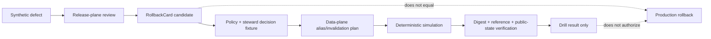

<!-- [KFM_META_BLOCK_V2]
doc_id: kfm://doc/tests-domains-agriculture-rollback-drill-readme
title: tests/domains/agriculture/rollback_drill/ — Agriculture Rollback-Drill and Reversibility Test Boundary
type: readme; directory-readme; domain-test-sublane; rollback-drill-enforceability-boundary
version: v0.2
status: draft; repository-grounded; README-only; dual-rollback-schema-scaffolds; contract-path-conflict; fixture-payloads-unconfirmed; validators-missing; workflows-todo-only; non-authoritative
owners: OWNER_TBD — Agriculture test steward · Agriculture domain steward · Release steward · Rollback steward · Correction steward · Evidence steward · Receipt and proof steward · Catalog steward · Policy steward · Sensitivity and rights steward · Validator steward · Runtime and UI steward · Security steward · Docs steward
created: NEEDS VERIFICATION — empty placeholder was expanded before v0.2
updated: 2026-07-16
supersedes: v0.1 Agriculture rollback-drill test guide
policy_label: "public-review; tests; agriculture; rollback-drill; reversibility; release-gated; correction-aware; withdrawal-aware; supersession-aware; evidence-aware; policy-aware; source-role-preserving; sensitivity-non-regression; no-network; synthetic-fixtures; no-silent-mutation; no-public-authority"
current_path: tests/domains/agriculture/rollback_drill/README.md
truth_posture: >
  CONFIRMED target v0.1 README and prior blob; current Agriculture rollback runbook;
  release-family RollbackCard semantic contract; parallel domain and release rollback-card schemas,
  each explicitly a permissive greenfield placeholder requiring only id and allowing additional
  properties; domain rollback-card schema pointing to a missing Agriculture contract and missing
  domain validator; release rollback-card schema pointing to a present release contract but a
  missing release validator and absent named fixture path; Agriculture release-fixture README with
  no confirmed payload inventory; release/rollback_cards as a compact review-card lane rather than
  execution proof; release/rollback as a separate rollback-review lane; data/rollback/agriculture
  as proposed data-plane alias-revert support; rollback-drill and domain-agriculture workflows
  containing TODO-only echo jobs; and no executable file surfaced under the rollback_drill child lane /
  PROPOSED rollback-drill scenario contract, release-plane versus data-plane test split, finite drill
  outcomes, safe reason codes, positive controls, negative cases, synthetic fixture profile,
  deterministic alias/replay verification, downstream invalidation proof, public-surface stale-state
  checks, audit-preservation checks, correction and withdrawal cases, workflow admission criteria,
  implementation sequence, definition of done, and migration plan /
  CONFLICTED domain-specific versus release-family RollbackCard schemas and homes; release/rollback_cards
  review-card semantics versus RollbackCard semantic-object naming; release/rollback versus
  release/correction/rollback and data/rollback responsibilities; Agriculture runbook field/cadence
  requirements versus thin schemas; and the existence of green workflows that currently prove only
  successful TODO commands /
  UNKNOWN collected Agriculture rollback tests, fixture payloads, accepted RollbackCard profile,
  canonical ReleaseManifest and CorrectionNotice profiles, validators, replay engine, alias resolver,
  cache/index/tile invalidators, policy evaluator, EvidenceRef resolver, release-state store, current
  alias implementation, public UI/API stale-state integration, CI enforcement, current drill results,
  coverage, owners, separation-of-duties enforcement, signing, branch-protection significance, and
  production use /
  NEEDS VERIFICATION canonical schema and contract home, release-plane/data-plane boundary, accepted
  rollback target identity, immutable-release and current-alias semantics, reason-code vocabulary,
  fixture identity, withdrawal-without-target handling, emergency hold behavior, correction propagation,
  drill receipt/proof family, CODEOWNERS, cadence ownership, release-gate adoption, and rollback automation
evidence_snapshot:
  repository: bartytime4life/Kansas-Frontier-Matrix
  repository_id: "1059091169"
  visibility: public
  base_ref: main
  base_commit: a0bbd85cd2a953654bd131f6d1ef7fbe3ef9a430
  prior_blob: 1e9a3d3cb095abaeaca993b16558c210ebc96464
  agriculture_rollback_runbook_blob: 720e0c768343af90ed35533e488dceaec86bdbf2
  domain_rollback_schema_blob: 3835d931517e21b6d75c578a11328aa7ca5a9a30
  release_rollback_schema_blob: 779ffcf282201ba4dba9689e622f92723db55b4e
  release_rollback_contract_blob: 72ab9e148491243cc8a374556350ab94c2557ab4
  release_manifest_schema_blob: 727db0a781900aa3816dcdce723fe355fec2e786
  agriculture_release_manifest_schema_blob: 5163f52bd20580f159a3ef52982c88d536b08412
  agriculture_release_fixture_readme_blob: b837eb62b1b6930d332611f7f3e3d7dcb7c26f4c
  release_rollback_cards_readme_blob: c1fc4d27bca8144faa16e1b888ca95c5d2f88eb5
  release_rollback_readme_blob: aa8b60f4d47e7b73ab3e862f1dcd498691ea4e0c
  data_rollback_agriculture_readme_blob: 0d40062b33a4f804cc3432efaf32947789d8fc79
  rollback_drill_workflow_blob: 9bedcf4aa4b9a1c8ae1c0c520542454afe934cd5
  agriculture_workflow_blob: a9f5f212ef61d72fdc209d9f8b173bbf87fb1803
  directory_rules_blob: 2affb080e6f0043867c64c7f06c1ca52030fbd55
related:
  - ../README.md
  - ../aggregate_only/README.md
  - ../catalog_closure/README.md
  - ../policy_deny/README.md
  - ../../README.md
  - ../../../README.md
  - ../../../../docs/runbooks/agriculture/ROLLBACK_RUNBOOK.md
  - ../../../../contracts/release/rollback_card.md
  - ../../../../schemas/contracts/v1/release/rollback_card.schema.json
  - ../../../../schemas/contracts/v1/domains/agriculture/rollback_card.schema.json
  - ../../../../schemas/contracts/v1/release/release_manifest.schema.json
  - ../../../../schemas/contracts/v1/domains/agriculture/release_manifest.schema.json
  - ../../../../fixtures/domains/agriculture/release/README.md
  - ../../../../release/rollback_cards/README.md
  - ../../../../release/rollback/README.md
  - ../../../../release/manifests/README.md
  - ../../../../release/correction_notices/README.md
  - ../../../../data/rollback/agriculture/README.md
  - ../../../../data/receipts/agriculture/README.md
  - ../../../../data/proofs/agriculture/README.md
  - ../../../../data/catalog/domain/agriculture/README.md
  - ../../../../policy/domains/agriculture/README.md
  - ../../../../docs/domains/agriculture/SENSITIVITY.md
  - ../../../../docs/doctrine/directory-rules.md
  - ../../../../.github/workflows/rollback-drill.yml
  - ../../../../.github/workflows/domain-agriculture.yml
tags: [kfm, tests, agriculture, rollback, rollback-drill, reversibility, rollback-card, release-manifest, correction-notice, withdrawal, supersession, invalidation, current-alias, evidence, receipts, proofs, catalog, policy, no-network, fail-closed]
notes:
  - "This revision changes only tests/domains/agriculture/rollback_drill/README.md."
  - "The target lane remains README-only in bounded repository evidence; no executable rollback test is created."
  - "Parallel Agriculture-domain and release-family rollback schemas are confirmed, but both are permissive id-only scaffolds."
  - "The validator and fixture paths declared by the rollback schemas are absent at the checked snapshot."
  - "The rollback-drill and Agriculture workflows run TODO echo commands and do not prove rollback execution."
  - "No release record, alias, published artifact, test, fixture, contract, schema, policy, validator, workflow, receipt, proof, catalog record, data object, or public route is modified."
[/KFM_META_BLOCK_V2] -->

<a id="top"></a>

# `tests/domains/agriculture/rollback_drill/` — Agriculture Rollback-Drill and Reversibility Test Boundary

> **One-line purpose.** Define the enforceability boundary for proving that an Agriculture release can be held, withdrawn, superseded, or restored to a verified prior safe state without silent mutation, evidence loss, sensitivity regression, orphaned derivatives, audit erasure, or direct public access to internal rollback stores.

<p>
  
  
  
  
  
  
  
</p>

> [!IMPORTANT]
> **A rollback drill proves readiness, not authority or execution.** A passing test may show that a synthetic release graph can be restored deterministically. It does not approve a production rollback, mutate a public alias, issue a correction, withdraw a release, or authorize publication.

> [!CAUTION]
> **Current implementation is not established.** The `rollback_drill/` directory is README-only in bounded repository evidence. Both rollback-card schemas are permissive scaffolds, the validator paths they declare are absent, release fixture payloads are unconfirmed, and the workflows execute TODO echo commands.

> [!WARNING]
> **Rollback must not create a second incident.** A target that is missing, unverifiable, less restrictive, evidence-broken, rights-stale, source-role-collapsed, or incompletely invalidated must produce a failing, held, withdrawn, abstaining, or error outcome—not a best-effort restoration.

**Quick links:** [Purpose](#purpose) · [Authority](#authority-level) · [Status](#status) · [Belongs](#what-belongs-here) · [Does not](#what-does-not-belong-here) · [Inputs](#inputs) · [Outputs](#outputs) · [Inventory](#confirmed-rollback-inventory) · [Model](#rollback-drill-model) · [Scenario](#drill-scenario-contract) · [Cases](#required-test-case-matrix) · [Invalidation](#downstream-invalidation-proof) · [Fixtures](#no-network-and-fixture-posture) · [Outcomes](#finite-drill-outcomes-and-reason-codes) · [CI](#workflow-and-ci-admission) · [Validation](#validation) · [Review](#review-burden) · [Related](#related-folders) · [ADRs](#adrs) · [Rollback](#migration-correction-and-rollback) · [Open](#open-verification-register) · [Done](#definition-of-done) · [Last reviewed](#last-reviewed)

---

## Purpose

`tests/domains/agriculture/rollback_drill/` is the Agriculture test sublane for **reversibility, withdrawal, supersession, alias restoration, and downstream invalidation proof**.

A complete rollback drill should answer:

1. Which released Agriculture state is being treated as defective?
2. Which prior state is the candidate rollback target, or is the correct action withdrawal with no replacement?
3. Do the affected and target release identities resolve deterministically?
4. Do manifest, artifact, evidence, receipt, proof, catalog, policy, review, correction, and rollback pointers resolve?
5. Is the target at least as restrictive as the failing release?
6. Does the target preserve Agriculture source roles and cross-domain ownership?
7. Are all dependent tiles, layers, caches, indexes, catalogs, graphs, reports, exports, UI payloads, and AI answers enumerated?
8. Can the drill invalidate or re-derive every dependent surface without touching unrelated releases?
9. Is the prior audit trail preserved without rewriting or deleting the failing release?
10. Does a second execution produce the same safe state rather than compounding side effects?
11. Can an interrupted drill resume or fail closed without leaving a falsely current alias?
12. Does the public-facing state become `stale`, `withdrawn`, `superseded`, or restored as the scenario requires?
13. Does the rollback target re-traverse evidence, policy, validation, review, and release gates?
14. Are correction, notice, and user-facing trust-state obligations visible?
15. Does the default suite remain deterministic, synthetic, bounded, and no-network?

This lane covers release-facing Agriculture products such as:

- county-year and crop-reporting-district aggregate products;
- generalized grid or HUC products approved for public use;
- crop-progress and agricultural-economy summaries;
- CDL-, HLS-, SMAP-, weather-, drought-, pest-, or vegetation-derived context layers;
- soil-suitability and irrigation-context products that preserve adjacent-domain ownership;
- public map layers, tiles, reports, downloads, catalog records, governed API responses, Evidence Drawer payloads, and Focus Mode answers that depend on Agriculture release state.

This README defines test expectations. It does not claim that rollback execution, aliases, validators, fixtures, invalidators, release records, or production routes currently exist.

[Back to top](#top)

---

## Authority level

**Canonical test responsibility / non-authoritative Agriculture sublane.**

`tests/` owns authored enforceability proof. Agriculture is a domain segment under that root. This lane tests rollback readiness and failure behavior; it cannot make release decisions, mutate release state, change aliases, publish artifacts, issue notices, or replace evidence and policy authority.

| Concern | Authority home | This lane's role |
|---|---|---|
| Enforceability proof | `tests/` | Owns test modules and assertions. |
| Agriculture test organization | `tests/domains/agriculture/` | Owns domain test grouping. |
| Rollback procedure | `docs/runbooks/agriculture/ROLLBACK_RUNBOOK.md` | Supplies operational doctrine; tests do not execute prose. |
| RollbackCard meaning | `contracts/release/rollback_card.md` or accepted successor | Tests semantics; does not redefine them. |
| RollbackCard machine shape | Accepted schema under `schemas/contracts/v1/` | Tests shape; does not choose between competing schema homes. |
| ReleaseManifest and release state | `release/` and accepted release contracts | Tests linkage/readiness; cannot approve or mutate. |
| Correction, supersession, withdrawal | `release/` and correction/release contracts | Tests required behavior; cannot issue authority records. |
| Data-plane alias-revert support | `data/rollback/agriculture/` if accepted | Tests bounded effects; does not make release decisions. |
| Evidence and proof | `data/proofs/` and evidence contracts | Tests resolution; does not create proof authority. |
| Receipts | `data/receipts/` and receipt contracts | Tests process-memory linkage; does not treat receipts as proof. |
| Catalog and triplets | `data/catalog/`, `data/triplets/` | Tests invalidation/re-derivation; does not store catalog truth. |
| Policy, rights, sensitivity | `policy/`, source registry, governed review | Tests non-regression and decisions; does not invent policy. |
| Synthetic fixtures | `fixtures/` | Consumes examples; does not duplicate fixture authority. |
| Validators and rollback tooling | `tools/`, `packages/`, `pipelines/`, or accepted runtime lane | Tests behavior; does not implement durable tooling here. |
| CI workflow | `.github/workflows/` | Calls tests when substantive; workflow presence is not proof. |
| Public API/UI/map/AI | Governed application and released-artifact surfaces | Tests stale/withdrawn/restored behavior; cannot expose a route. |

### Anti-collapse rules

This lane must not collapse:

- a rollback plan into rollback execution;
- a rollback review card into a semantic `RollbackCard`;
- a schema-valid object into rollback completeness;
- receipt presence into proof of restoration;
- proof support into release authority;
- a release manifest into a public alias mutation;
- file movement into a governed state transition;
- cache invalidation into complete rollback;
- withdrawal into deletion or erasure;
- a prior version into a verified safe target without re-validation;
- a passing drill into approval for a production rollback;
- a green TODO workflow into substantive rollback proof;
- an Agriculture aggregate into field, operator, farm, parcel, or private-party truth;
- a modeled or remotely sensed product into observed ground truth.

[Back to top](#top)

---

## Status

### Confirmed repository evidence

| Surface | Status | Safe conclusion |
|---|---|---|
| Target README | **CONFIRMED** | v0.1 existed at the pinned snapshot. |
| Executable files under `rollback_drill/` | **NOT FOUND in bounded search** | Treat the lane as README-only. |
| Agriculture rollback runbook | **CONFIRMED draft doctrine** | Defines governed rollback expectations but labels implementation details as proposed. |
| Release-family RollbackCard contract | **CONFIRMED draft semantic contract** | Explicitly says rollback card is not execution proof. |
| Release RollbackCard schema | **CONFIRMED scaffold** | Requires only `id`; permits additional properties. |
| Agriculture RollbackCard schema | **CONFIRMED scaffold** | Requires only `id`; permits additional properties. |
| Agriculture rollback contract named by domain schema | **NOT FOUND** | Domain schema points to a missing contract path. |
| Release rollback validator | **NOT FOUND** | Schema-declared validator path is absent. |
| Agriculture rollback validator | **NOT FOUND** | Domain schema-declared validator path is absent. |
| Release rollback fixture root | **NOT FOUND at named path** | Schema-declared fixture path is absent. |
| Agriculture release fixture lane | **README confirmed / payloads unconfirmed** | Documentation exists; no payload coverage is established. |
| `release/rollback_cards/` | **CONFIRMED review-card lane** | Documents compact Markdown review aids, not execution proof. |
| `release/rollback/` | **CONFIRMED rollback-review lane** | Separate review lane with unresolved relation to other rollback homes. |
| `data/rollback/agriculture/` | **CONFIRMED path / proposed role** | Documents data-plane alias-revert support, not release authority. |
| Rollback-drill workflow | **CONFIRMED TODO-only** | Runs `echo TODO simulate-rollback` and `echo TODO verify-published-aliases`. |
| Agriculture workflow | **CONFIRMED TODO-only** | Runs three Agriculture `echo TODO` jobs. |
| Current successful drill, production use, aliases, invalidators | **UNKNOWN** | No such claim is supported here. |

### Maturity posture

| Capability | Status |
|---|---|
| Rollback doctrine | CONFIRMED as draft documentation |
| Rollback drill test contract | PROPOSED by this README |
| Collected pytest tests | UNKNOWN / NOT FOUND |
| Accepted fixtures | UNKNOWN |
| Schema completeness | NOT ESTABLISHED |
| Validator implementation | NOT FOUND |
| Release-state mutation engine | UNKNOWN |
| Current-alias resolver | UNKNOWN |
| Downstream invalidation engine | UNKNOWN |
| Policy/evidence integration | UNKNOWN |
| Correction/withdrawal propagation | UNKNOWN |
| Public stale-state integration | UNKNOWN |
| CI gate that fails on drill regression | NOT ESTABLISHED |
| Last successful Agriculture drill | UNKNOWN |

### What this README does not prove

README presence does not prove:

- a release can actually be rolled back;
- any alias exists or changes atomically;
- any rollback target is retrievable;
- any schema is governance-complete;
- any fixture payload exists;
- any validator or resolver executes;
- any downstream derivative can be invalidated;
- any correction notice reaches a public surface;
- any workflow is branch-protection required;
- any production release has a tested rollback target;
- any drill has ever succeeded.

[Back to top](#top)

---

## What belongs here

This lane may contain:

- `README.md`;
- Agriculture rollback-drill test modules;
- deterministic unit, contract, integration, and scenario tests for rollback readiness;
- tests for RollbackCard and ReleaseManifest reference resolution;
- tests for prior-safe-target selection and withdrawal-with-no-target behavior;
- tests for alias comparison, planned alias change, and post-change verification using synthetic state;
- tests for immutable release directories and no silent mutation;
- tests for evidence, receipt, proof, catalog, policy, review, correction, withdrawal, and supersession linkage;
- tests for source-role and sensitivity non-regression;
- tests for downstream invalidation and re-derivation plans;
- tests for public stale/withdrawn/superseded/restored trust states;
- idempotence, interruption, partial-failure, and retry tests;
- negative tests that prove an incomplete rollback fails closed;
- test-only adapters and helpers when too small and local to justify durable tooling;
- test references to canonical fixtures, schemas, contracts, policies, release records, and data-plane support;
- expected reason codes and finite outcomes bound to accepted contracts.

[Back to top](#top)

---

## What does NOT belong here

Do not place these under `tests/domains/agriculture/rollback_drill/`:

- production rollback code;
- release manifests, rollback cards, correction notices, withdrawal notices, promotion decisions, signatures, or changelog records;
- canonical schemas, contracts, policies, source descriptors, catalog records, receipts, proofs, or lifecycle data;
- actual public aliases or scripts that mutate them;
- real released Agriculture artifacts or copied published payloads;
- live API keys, signing keys, credentials, private source data, or protected policy internals;
- real farm/operator/person/parcel joins, proprietary yield, pesticide details, or exact private field geometry;
- general-purpose fixtures that belong under `fixtures/`;
- validator or resolver implementations that belong under durable tooling roots;
- public UI, map, API, search, graph, export, or AI implementation;
- production incident records;
- destructive cleanup scripts;
- tests that depend on live network access by default;
- generated prose treated as rollback evidence;
- a second release, rollback, receipt, proof, or catalog authority.

[Back to top](#top)

---

## Inputs

A rollback drill consumes **synthetic or explicitly test-scoped representations**, never uncontrolled production state.

### Required scenario inputs

| Input family | Minimum content | Failure posture |
|---|---|---|
| Drill identity | stable `drill_id`, scenario version, test seed | `ERROR` if missing |
| Affected release | release ID, manifest ref, artifact refs, digests, lifecycle state | `HOLD` / fail |
| Candidate target | prior release ref and digests, or explicit withdraw-only marker | `ROLLBACK_TARGET_MISSING` |
| RollbackCard candidate | affected state, target, reason, invalidations, review/correction refs | governance fail if incomplete |
| Release manifests | affected and target synthetic manifests | fail on missing or mismatch |
| Evidence context | EvidenceRefs and resolvable synthetic EvidenceBundle support | `ABSTAIN` / fail |
| Receipt context | run, validation, aggregation, redaction, model, or release-support refs | fail when required |
| Catalog context | domain/STAC/DCAT/PROV/triplet refs where the product uses them | fail on unresolved drift |
| Policy context | rights, sensitivity, source role, review, release posture | `DENY`, `HOLD`, or `ABSTAIN` |
| Alias model | current pointer, planned target, compare-and-swap precondition | fail on race or mismatch |
| Derivative graph | tiles, COGs, PMTiles, layer manifests, caches, search, graph, reports, AI outputs | fail on orphan |
| Correction context | correction, supersession, withdrawal, or no-public-notice rationale | fail when public state changed |
| Audit context | immutable prior records and expected append-only additions | fail on rewrite/delete |
| Public state | expected trust state before, during, and after drill | fail on stale false-positive |

### Agriculture-specific inputs

Tests should model:

- aggregation unit and temporal bucket;
- field/operator/parcel exposure flags;
- source role (`aggregate`, `modeled`, `observed`, `administrative`, `candidate`, `synthetic`, or accepted vocabulary);
- rights and license posture;
- sensitivity tier and public precision;
- cross-domain ownership references;
- `AggregationReceipt`, `RedactionReceipt`, or `ModelRunReceipt` obligations;
- target release's policy version and evidence support;
- target release's public geometry and attribute precision;
- affected Agriculture map, report, API, or AI products.

### Forbidden inputs

Default drill tests must reject or avoid:

- production endpoints;
- live release stores;
- writable public buckets;
- live CDN purge credentials;
- live search or graph indexes;
- private signing keys;
- real operator or parcel data;
- exact private field geometry;
- network-dependent source refresh;
- uncontrolled timestamps or random identifiers;
- mutable shared fixtures;
- test data that can be confused with a real release.

[Back to top](#top)

---

## Outputs

A test run may emit **ephemeral test results**. It must not emit authoritative release records.

### Allowed test outputs

- pytest results;
- temporary synthetic rollback plans;
- expected-versus-actual manifest comparisons;
- digest comparison reports;
- alias transition simulations;
- invalidation coverage reports;
- public-state snapshots;
- reason-code assertions;
- coverage reports;
- temporary logs with no secrets or protected payloads;
- CI summaries;
- a test-run receipt only when an accepted test-receipt contract and destination are verified.

### Forbidden authoritative outputs

A test must not create or approve:

- production `RollbackCard`;
- production `ReleaseManifest`;
- production `CorrectionNotice`;
- production `WithdrawalNotice`;
- production `PromotionDecision`;
- production alias mutation;
- production cache or CDN purge;
- production catalog/triplet rewrite;
- production public-layer change;
- production EvidenceBundle or proof;
- production release signature;
- public correction messaging;
- actual incident closure.

### Required output assertions

Every substantive drill result should report:

| Field | Purpose |
|---|---|
| `drill_id` | Stable test-run identity |
| `scenario_id` | Identifies the bounded rollback scenario |
| `outcome` | Finite drill outcome |
| `reason_codes[]` | Stable machine-checkable reasons |
| `affected_release_ref` | Synthetic failing release |
| `target_release_ref` | Synthetic safe target or explicit null withdrawal |
| `pre_state_digest` | Digest of synthetic current state |
| `planned_state_digest` | Expected state after drill |
| `actual_state_digest` | Observed synthetic result |
| `invalidated_refs[]` | Dependents removed or marked stale |
| `rederived_refs[]` | Dependents rebuilt from target |
| `unresolved_refs[]` | Any closure gaps |
| `audit_preserved` | Confirms prior records were not rewritten |
| `policy_non_regression` | Confirms target is not less restrictive |
| `network_attempts` | Must be zero in default suite |
| `public_state` | stale, withdrawn, superseded, restored, or unchanged |
| `cleanup_status` | Temporary state removed or retained for failure inspection |

These fields are **PROPOSED** until an accepted drill-result contract exists.

[Back to top](#top)

---

## Confirmed rollback inventory

### Parallel RollbackCard schemas

Two rollback-card schemas are present:

```text
schemas/contracts/v1/release/rollback_card.schema.json
schemas/contracts/v1/domains/agriculture/rollback_card.schema.json
```

Both currently:

- identify themselves as greenfield placeholders;
- require only `id`;
- make `spec_hash` and `version` optional;
- allow arbitrary additional properties;
- declare `status: PROPOSED`.

Their declared relationships differ:

| Schema | Contract | Fixtures | Validator |
|---|---|---|---|
| release-family | `contracts/release/rollback_card.md` | `fixtures/release/rollback_card/` | `tools/validators/release/validate_rollback_card.py` |
| Agriculture-domain | `contracts/domains/agriculture/rollback_card.md` | `fixtures/domains/agriculture/rollback_card/` | `tools/validators/domains/agriculture/validate_rollback_card.py` |

At the pinned snapshot:

- the release contract exists;
- the Agriculture contract was not found;
- neither validator was found;
- the release fixture path was not found;
- no Agriculture rollback-card fixture payload inventory is established.

A test that validates only against either current schema can pass while lacking a rollback target, affected release, evidence, policy, invalidation plan, correction path, review, and execution proof.

### Parallel ReleaseManifest schemas

Two release-manifest scaffolds are also present:

```text
schemas/contracts/v1/release/release_manifest.schema.json
schemas/contracts/v1/domains/agriculture/release_manifest.schema.json
```

Both are `id`-only permissive placeholders with different contract, fixture, validator, and policy paths. Rollback tests must not silently choose one as canonical.

### Rollback lanes with different responsibilities

| Path | Confirmed documented role | Boundary |
|---|---|---|
| `release/rollback_cards/` | Compact release review cards | Not final approval or execution proof |
| `release/rollback/` | Rollback review records | Does not change release state by prose alone |
| `data/rollback/agriculture/` | Proposed Agriculture data-plane alias-revert support | Not release authority |
| `fixtures/domains/agriculture/release/` | Release-shaped synthetic examples | Not release decisions |
| `tests/domains/agriculture/rollback_drill/` | This enforceability lane | Not runtime or release authority |

The relationship among `release/rollback_cards/`, `release/rollback/`, `release/correction/rollback/`, and `data/rollback/` remains **NEEDS VERIFICATION**.

### Workflow posture

The current rollback workflow runs:

```yaml
- run: 'echo TODO simulate-rollback'
- run: 'echo TODO verify-published-aliases'
```

The Agriculture workflow runs:

```yaml
- run: 'echo TODO validate-agriculture'
- run: 'echo TODO build-proof-agriculture'
- run: 'echo TODO publish-dry-run-agriculture'
```

A green run of either workflow currently proves only that checkout and echo commands completed.

[Back to top](#top)

---

## Rollback-drill model

### Five distinct proof layers

A credible drill separates five layers.

| Layer | Question | Current status |
|---|---|---|
| Shape proof | Do candidate objects satisfy accepted schemas? | Schemas are thin placeholders |
| Governance proof | Are required semantic relationships present? | PROPOSED |
| State-transition proof | Can synthetic current state move to target state atomically and reversibly? | UNKNOWN |
| Derivative proof | Are every affected downstream surface invalidated or rebuilt? | UNKNOWN |
| Public-trust proof | Do governed clients show stale/withdrawn/superseded/restored state correctly? | UNKNOWN |

No single green check may substitute for all five.

### Release-plane and data-plane separation



Release-plane tests should cover:

- affected release identity;
- rollback target;
- decision/review;
- correction or withdrawal;
- release manifest supersession;
- separation of duties;
- public notice obligations.

Data-plane tests should cover:

- immutable versioned artifacts;
- current-alias preconditions;
- compare-and-swap behavior;
- target artifact resolution;
- downstream invalidation;
- target re-derivation;
- audit preservation;
- retry and interruption safety.

### Drill phases

1. **Arrange** a synthetic current release, prior safe release, governed support, and dependent surfaces.
2. **Inject** one bounded defect.
3. **Assess** whether rollback, withdrawal, correction-only, hold, or no action is appropriate.
4. **Build** a rollback plan without mutating production state.
5. **Validate** identity, digests, evidence, policy, review, target, and invalidations.
6. **Simulate** the transition in isolated temporary state.
7. **Verify** target and downstream state.
8. **Replay** the drill to prove idempotence.
9. **Interrupt and resume** at selected checkpoints.
10. **Clean up** temporary state while preserving test failure evidence.
11. **Report** finite outcome and unresolved gaps.

[Back to top](#top)

---

## Drill scenario contract

Each scenario should declare:

```yaml
scenario_id: ag-rollback-<case>
scenario_version: v1
seed: 1337
network: denied
clock: fixed
affected_release:
  id: kfm-test://release/agriculture/example/v2
  manifest_digest: sha256:<synthetic>
  lifecycle_state: PUBLISHED
target_release:
  id: kfm-test://release/agriculture/example/v1
  manifest_digest: sha256:<synthetic>
  lifecycle_state: PUBLISHED
defect:
  code: <safe_reason_code>
  affected_refs: []
expected:
  outcome: <finite_outcome>
  public_state: <stale|withdrawn|superseded|restored|unchanged>
  alias_target: <target-or-null>
  invalidated_refs: []
  rederived_refs: []
  audit_preserved: true
```

This shape is illustrative and **PROPOSED**. It must not become a parallel schema authority.

### Required determinism

Scenarios should pin:

- fixture versions;
- identifiers;
- content digests;
- clock;
- random seed;
- policy profile;
- schema profile;
- validator version;
- release graph;
- dependency graph;
- expected serialization;
- alias precondition;
- cleanup policy.

### Required isolation

A drill must use:

- temporary directories or in-memory stores;
- synthetic URI schemes such as `kfm-test://`;
- non-routable endpoints;
- fake credentials that cannot authenticate;
- isolated caches/indexes;
- fixture-only catalogs;
- mock policy/evidence/release adapters until governed implementations are accepted.

[Back to top](#top)

---

## Required test-case matrix

### Positive controls

Positive controls prevent a suite from “passing” because it denies everything.

| Case | Expected result |
|---|---|
| Verified prior safe aggregate release, complete support, all invalidations resolved | `DRILL_PASS` |
| Public defect with valid correction and safe target | `DRILL_PASS` |
| No safe target, explicit withdraw-only path, all public surfaces withdrawn | `WITHDRAW_ONLY_PASS` |
| Emergency hold without restoration, no public alias mutation | `HOLD_PASS` |
| Target equal to current safe release and no action required | `NO_ACTION_PASS` |
| Re-running completed drill produces identical state | `DRILL_PASS` |
| Restart after interruption resumes from safe checkpoint | `DRILL_PASS` |

### Identity, target, and manifest failures

| Case | Expected posture |
|---|---|
| Missing affected release ID | fail closed |
| Missing RollbackCard ID | schema and governance failure |
| Missing target with no withdraw-only marker | `ROLLBACK_TARGET_MISSING` |
| Target points to nonexistent release | fail closed |
| Target points to same defective release | fail closed |
| Target belongs to another artifact family | fail closed |
| Target lifecycle state is RAW, WORK, QUARANTINE, or unpromoted PROCESSED | fail closed |
| Target manifest digest mismatch | `RELEASE_MANIFEST_INVALID` |
| Affected manifest digest mismatch | fail closed |
| Target artifact digest mismatch | fail closed |
| Alias precondition differs from arranged current release | concurrency failure / no mutation |
| Domain and release schema profiles disagree | hold for schema resolution |
| `id`-only object passes schema but lacks governance fields | governance failure |

### Evidence, source-role, receipt, and proof failures

| Case | Expected posture |
|---|---|
| EvidenceRef does not resolve | `ABSTAIN` / fail |
| EvidenceBundle resolves but does not support target claim | fail closed |
| SourceDescriptor missing | hold |
| Source rights changed after target release | deny or hold |
| AggregationReceipt missing for public aggregate | fail closed |
| RedactionReceipt missing for generalized sensitive material | fail closed |
| ModelRunReceipt missing for modeled product | fail closed |
| Receipt exists but proof support is missing | fail closed |
| Proof exists but points to affected defective release | fail closed |
| Catalog points to stale proof | fail closed |
| CDL/model/context source role becomes observed truth after rollback | `ROLE_COLLAPSE` |
| Cross-domain ownership is reassigned during rollback | fail closed |

### Policy, sensitivity, and review failures

| Case | Expected posture |
|---|---|
| Target is less restrictive than failing release | deny |
| Target re-exposes field geometry | deny |
| Target re-exposes operator or parcel join | deny |
| Target contains proprietary yield or pesticide detail | deny |
| Rights posture unknown | hold or deny |
| Required sensitivity review missing | fail closed |
| Required rights review missing | fail closed |
| ReviewRecord exists but covers wrong defect class | fail closed |
| Policy bundle unavailable | error and no alias change |
| Policy result is ambiguous | abstain/hold |
| Policy version used for target differs without recorded re-evaluation | fail closed |
| Emergency override lacks post-facto review obligation | fail closed |

### Correction, withdrawal, supersession, and audit failures

| Case | Expected posture |
|---|---|
| Public claim changed but CorrectionNotice missing | fail closed |
| Withdrawal occurs but public state remains fresh | fail |
| Supersession link is one-way or broken | fail |
| Prior release record is mutated in place | fail |
| Failing receipts are deleted | fail |
| Audit entries are rewritten | fail |
| Rollback card is overwritten rather than superseded | fail |
| Changelog omits release-state change | fail when required |
| Withdraw-only scenario silently binds to an arbitrary target | fail closed |
| Correction notice leaks protected defect details | fail |

### Downstream invalidation failures

| Case | Expected posture |
|---|---|
| Tile or PMTiles ref still points to failing release | fail |
| Layer manifest remains fresh | fail |
| Catalog entry remains current | fail |
| STAC/DCAT/PROV projection retains failing digest | fail |
| Graph/triplet edge retains failing release | fail |
| Search index returns withdrawn artifact | fail |
| Vector index returns withdrawn evidence | fail |
| Report/download remains accessible as current | fail |
| Evidence Drawer omits stale/superseded state | fail |
| Focus Mode continues answering from withdrawn evidence | fail |
| AI cache retains answer derived from failing release | fail |
| Unrelated release is invalidated | fail due over-broad rollback |
| One dependent surface is missing from `invalidates[]` | fail closed |

### Operational robustness failures

| Case | Expected posture |
|---|---|
| Network call attempted in default suite | test failure |
| Production-looking URI used without explicit safe marker | fixture rejection |
| Drill mutates repository-tracked fixture | test failure |
| Drill writes outside temporary root | test failure |
| Interrupted alias update leaves no valid current target | fail |
| Partial invalidation is reported as success | fail |
| Retry duplicates correction or review records | fail |
| Concurrent drill loses compare-and-swap race | no mutation / explicit conflict |
| Cleanup deletes failure evidence before reporting | fail |
| Success result lacks digests or unresolved-ref count | fail |
| Workflow runs only TODO commands | not substantive proof |

[Back to top](#top)

---

## Downstream invalidation proof

A drill should build an explicit dependency graph.

| Surface | Minimum assertion |
|---|---|
| Versioned artifact | Prior and target bytes remain immutable |
| Current alias | Points to expected target or is withdrawn |
| ReleaseManifest | New/superseding reference is consistent |
| RollbackCard | Resolves affected and target release |
| CorrectionNotice | Public-safe notice resolves when required |
| Catalog record | Marked stale/superseded or re-derived |
| STAC item | Digest and release reference updated or withdrawn |
| DCAT distribution | Distribution/checksum no longer advertises defective release |
| PROV entity/activity | Supersession/derivation chain remains intact |
| Graph/triplet | Defective release edges invalidated |
| Search index | No current results from withdrawn release |
| Vector index | No unsupported embeddings from withdrawn evidence |
| Tiles/COGs/PMTiles | Defective digest unavailable as current |
| Layer manifest | Trust state and artifact refs match target |
| Report/export | Current link updated, stale item visibly superseded |
| Evidence Drawer | Correction and evidence state visible |
| Focus Mode / AI | `ABSTAIN` until evidence re-resolves |
| CDN/cache | Synthetic cache keys invalidated only within scope |
| Audit ledger | Failing release history remains inspectable |

### No-orphan invariant

The drill must fail if:

```text
affected dependent refs
  - invalidated refs
  - rederived refs
  - explicitly unaffected refs with justification
  != empty set
```

### No-overreach invariant

The drill must also fail if any invalidated or rewritten reference is outside the declared dependency closure.

[Back to top](#top)

---

## No-network and fixture posture

### Default rule

The default rollback-drill suite must be:

- synthetic;
- deterministic;
- no-network;
- credential-free;
- isolated from production release stores;
- isolated from public buckets and aliases;
- safe to run repeatedly;
- safe to interrupt;
- safe to run concurrently when supported.

### Fixture families

A mature fixture set should include:

```text
fixtures/domains/agriculture/release/
  rollback/
    valid/
    invalid/
    withdrawal/
    emergency_hold/
    sensitivity_regression/
    evidence_failure/
    derivative_invalidation/
    public_state/
```

This structure is **PROPOSED**. Do not create it as canon until fixture ownership and Directory Rules placement are reviewed.

### Minimum fixture examples

- valid aggregate rollback;
- valid correction plus rollback;
- valid withdraw-only release;
- valid emergency hold;
- missing target;
- wrong lifecycle target;
- digest mismatch;
- evidence closure failure;
- rights change;
- sensitivity regression;
- source-role collapse;
- missing review;
- incomplete invalidation graph;
- stale search result;
- stale AI answer;
- concurrent alias conflict;
- interrupted transition;
- audit mutation attempt;
- schema-valid but governance-invalid `id`-only RollbackCard.

### Fixture safety checks

Every fixture should:

- carry an obvious test marker;
- use synthetic IDs;
- avoid routable URLs;
- avoid exact private geometry;
- avoid real operator or parcel data;
- declare expected outcome and reason codes;
- identify the consuming test;
- pin serialization and digests;
- document whether it tests shape, governance, transition, derivatives, or public trust state.

[Back to top](#top)

---

## Finite drill outcomes and reason codes

### Proposed drill outcomes

| Outcome | Meaning |
|---|---|
| `DRILL_PASS` | Synthetic rollback restored a verified target and all required checks passed. |
| `WITHDRAW_ONLY_PASS` | No safe target existed; synthetic public state was withdrawn safely. |
| `HOLD_PASS` | Scenario correctly held without mutation because prerequisites were incomplete. |
| `NO_ACTION_PASS` | Scenario correctly concluded no rollback action was needed. |
| `DRILL_FAIL` | Expected rollback behavior was not achieved. |
| `ABSTAIN` | Evidence, rights, policy, or target support was insufficient to decide safely. |
| `DENY` | Proposed target or action violated policy or sensitivity constraints. |
| `ERROR` | Test machinery could not complete safely. |

These are test outcomes, not release decisions.

### Proposed reason codes

| Code | Condition |
|---|---|
| `AFFECTED_RELEASE_MISSING` | Failing release identity is absent |
| `ROLLBACK_TARGET_MISSING` | No target and no explicit withdrawal path |
| `ROLLBACK_TARGET_UNRESOLVED` | Target reference cannot resolve |
| `ROLLBACK_TARGET_UNSAFE` | Target fails evidence, policy, rights, or sensitivity |
| `ROLLBACK_TARGET_LESS_RESTRICTIVE` | Target exposes more detail |
| `RELEASE_MANIFEST_INVALID` | Manifest shape, digest, or reference fails |
| `ROLLBACK_CARD_INCOMPLETE` | Governance fields missing despite schema pass |
| `SCHEMA_PROFILE_CONFLICT` | Competing schema profiles disagree |
| `EVIDENCE_UNRESOLVED` | EvidenceRef closure fails |
| `RECEIPT_MISSING` | Required process receipt absent |
| `PROOF_MISSING` | Required proof support absent |
| `SOURCE_ROLE_COLLAPSE` | Role changes across rollback |
| `RIGHTS_UNKNOWN` | Rights posture unresolved |
| `SENSITIVITY_UNRESOLVED` | Sensitivity or private-join risk unresolved |
| `REVIEW_MISSING` | Required review absent |
| `CORRECTION_NOTICE_MISSING` | Public correction obligation not met |
| `INVALIDATION_INCOMPLETE` | One or more dependent refs remain |
| `INVALIDATION_OVERBROAD` | Unrelated refs were affected |
| `PUBLIC_STATE_STALE_FALSE` | UI/API still presents defective release as current |
| `AUDIT_MUTATION_DETECTED` | Prior audit material changed or disappeared |
| `ALIAS_PRECONDITION_FAILED` | Current pointer changed concurrently |
| `PARTIAL_TRANSITION` | Transition stopped in unsafe intermediate state |
| `NETWORK_ATTEMPTED` | Default no-network contract violated |
| `WORKFLOW_PLACEHOLDER_ONLY` | CI executed no substantive drill |
| `TEST_INFRASTRUCTURE_ERROR` | Harness failure prevents safe conclusion |

Reason codes remain **PROPOSED** until accepted in a contract or ADR.

[Back to top](#top)

---

## Workflow and CI admission

### Current workflow truth

A successful `rollback-drill` workflow currently means:

- checkout succeeded;
- `echo TODO simulate-rollback` succeeded;
- `echo TODO verify-published-aliases` succeeded.

It does **not** mean:

- a RollbackCard validated;
- a release target resolved;
- an alias changed;
- evidence closed;
- policy passed;
- derivatives invalidated;
- a public trust state changed;
- a replay succeeded.

### Required admission before enforcement claims

The workflow should not be described as substantive until it:

1. installs a pinned test runtime;
2. collects at least one real rollback-drill test;
3. fails when no tests are collected;
4. validates selected schemas;
5. runs governance assertions beyond schema validity;
6. exercises a synthetic release graph;
7. proves alias compare-and-swap or accepted equivalent;
8. verifies derivative invalidation closure;
9. tests withdrawal-with-no-target;
10. tests sensitivity non-regression;
11. tests audit preservation;
12. emits a bounded test report;
13. uploads only safe artifacts;
14. uses finite exit codes;
15. is wired to branch protection or promotion gates only after owners accept it.

### Suggested future command surface

```bash
pytest -q tests/domains/agriculture/rollback_drill
```

A future validator command might be:

```bash
python tools/validators/release/validate_rollback_card.py --fixtures --strict
```

A future simulation command might be:

```bash
python tools/release/simulate_rollback.py \
  --domain agriculture \
  --scenario fixtures/domains/agriculture/release/rollback/<case>.json \
  --no-network \
  --dry-run
```

The latter two commands are illustrative and **must not be treated as existing interfaces**.

### Required exit behavior

| Exit | Meaning |
|---:|---|
| `0` | Collected substantive tests passed |
| `1` | One or more rollback assertions failed |
| `2` | Fixture, schema, configuration, or harness error |
| `3` | Network, secret, or production-safety violation |
| `4` | No substantive tests collected |

[Back to top](#top)

---

## Security, rights, and sensitivity

Rollback drills must test that a restored target does not:

- increase spatial precision;
- expose operator identity;
- expose private parcel or ownership joins;
- expose proprietary yield or production records;
- expose pesticide or application details;
- expose restricted source terms or internal policy parameters;
- convert aggregate or modeled context into field truth;
- bypass the most-restrictive-row rule;
- re-enable a public surface before evidence and policy re-resolve;
- leak protected material in error messages, snapshots, diffs, logs, or CI artifacts.

A safe failure result should reveal:

- bounded reason code;
- affected public surface class;
- whether review is required;
- whether withdrawal is required;
- whether evidence or policy is unresolved;
- safe correlation ID.

It should not reveal:

- exact protected geometry;
- private person/operator identity;
- sensitive join keys;
- proprietary values;
- secret policy thresholds;
- credentials or signing material;
- restricted evidence payloads.

[Back to top](#top)

---

## Migration, correction, and rollback

### Documentation migration

This README does not move files or resolve authority conflicts. Future implementation should:

1. decide whether rollback-card semantics are release-family or domain-specialized;
2. select one canonical schema authority;
3. deprecate or adapt the competing schema through an ADR-backed migration;
4. align contract, schema, fixture, validator, policy, and test paths;
5. define the relation among `release/rollback_cards/`, `release/rollback/`, `release/correction/rollback/`, and `data/rollback/`;
6. preserve compatibility redirects or migration notes where needed;
7. add tests before wiring promotion enforcement.

### Correction triggers

Correct this README when:

- an executable test appears;
- accepted rollback fixtures appear;
- a validator is implemented;
- schema/contract path conflicts are resolved;
- rollback or Agriculture workflows become substantive;
- a current-alias mechanism is accepted;
- a release/data rollback lane is migrated;
- reason codes or outcomes are standardized;
- a drill result or incident reveals a missing case.

### Rollback of this documentation change

This README update is documentation-only. Revert the update or restore the prior blob if it:

- claims implementation not present;
- chooses a canonical schema/path without an ADR;
- misstates release authority;
- weakens fail-closed posture;
- exposes sensitive information;
- breaks repository navigation.

No executable rollback, release record, alias, data artifact, or public state is changed by this document.

[Back to top](#top)

---

## Validation

### Current documentation validation

For this README update, validate:

```bash
python - <<'PY'
from pathlib import Path

path = Path("tests/domains/agriculture/rollback_drill/README.md")
text = path.read_text(encoding="utf-8")

assert text.count("# `tests/domains/agriculture/rollback_drill/`") == 1
assert text.count("```") % 2 == 0
assert "\t" not in text
assert not any(line.endswith((" ", "\t")) for line in text.splitlines())

required = [
    "## Purpose",
    "## Authority level",
    "## Status",
    "## What belongs here",
    "## What does NOT belong here",
    "## Inputs",
    "## Outputs",
    "## Validation",
    "## Review burden",
    "## Related folders",
    "## ADRs",
    "## Last reviewed",
]

positions = [text.index(item) for item in required]
assert positions == sorted(positions)
print("PASS")
PY
```

### Repository inspection commands

```bash
find tests/domains/agriculture/rollback_drill -maxdepth 5 -type f | sort

find \
  contracts/release \
  schemas/contracts/v1/release \
  schemas/contracts/v1/domains/agriculture \
  fixtures/domains/agriculture/release \
  release/rollback_cards \
  release/rollback \
  data/rollback/agriculture \
  tools/validators \
  .github/workflows \
  -maxdepth 6 -type f 2>/dev/null | sort
```

### Future substantive test commands

```bash
pytest -q tests/domains/agriculture/rollback_drill
```

Do not append `|| true` to a promotion-relevant rollback test. No-test collection, missing dependencies, fixture errors, and failed assertions must remain visible.

### Validation layers

| Layer | Required check |
|---|---|
| Markdown | headings, fences, links, whitespace |
| Inventory | actual files and paths |
| Schema | chosen RollbackCard/ReleaseManifest profile |
| Governance | target, evidence, policy, review, correction, invalidation |
| Transition | isolated deterministic state change |
| Replay | idempotence and recovery |
| Derivatives | no orphan and no overreach |
| Public trust | stale/withdrawn/superseded/restored state |
| Security | no secrets, private data, or unsafe logs |
| CI | substantive commands and fail-closed exits |

[Back to top](#top)

---

## Review burden

### Required reviewers

At minimum:

- Agriculture domain steward;
- test/QA steward;
- release steward;
- rollback/correction steward;
- schema and contract steward;
- evidence/proof steward;
- policy, sensitivity, and rights steward;
- catalog/data steward;
- runtime/UI steward when public surfaces are covered;
- security steward when aliases, credentials, signing, or invalidation mechanisms are involved.

### Review checklist

- [ ] Current implementation claims are backed by repository evidence.
- [ ] Competing rollback schemas are not silently treated as equivalent.
- [ ] Release-plane and data-plane roles remain separate.
- [ ] Schema validity is not treated as rollback completeness.
- [ ] Fixtures are synthetic, deterministic, and no-network.
- [ ] Positive controls prevent deny-everything false confidence.
- [ ] Missing target and withdraw-only cases are distinct.
- [ ] Target sensitivity is not less restrictive.
- [ ] Source roles and cross-domain ownership are preserved.
- [ ] Evidence, receipt, proof, catalog, policy, review, correction, and release refs resolve.
- [ ] Dependency closure has no orphan and no overreach.
- [ ] Public stale/withdrawn/superseded/restored states are tested.
- [ ] Audit records remain immutable.
- [ ] Idempotence, interruption, concurrency, and partial failure are tested.
- [ ] CI runs substantive commands and fails on no-test collection.
- [ ] Rollback remains a governed state transition, not a file move.

### Change burden

| Change | Review burden |
|---|---|
| README clarification | Test + Agriculture + docs review |
| New fixture | Fixture + Agriculture + policy/release review |
| New reason code | Contract/policy/test review |
| New RollbackCard field | Contract + schema + fixture + validator + migration review |
| Schema-home decision | ADR + migration + compatibility review |
| Alias or release-store implementation | Release + data + security + operations review |
| Public trust-state behavior | API/UI + evidence + correction review |
| CI promotion gate | QA + release + branch-protection review |
| Production rollback automation | Highest burden; separation of duties and drill evidence required |

[Back to top](#top)

---

## Related folders

### Test neighbors

- [`../README.md`](../README.md) — Agriculture test parent.
- [`../aggregate_only/README.md`](../aggregate_only/README.md) — precision anti-collapse.
- [`../catalog_closure/README.md`](../catalog_closure/README.md) — catalog/evidence/release closure.
- [`../policy_deny/README.md`](../policy_deny/README.md) — negative policy behavior.
- [`../../README.md`](../../README.md) — domain test parent.
- [`../../../README.md`](../../../README.md) — canonical test-root boundary.

### Doctrine and runbooks

- [`../../../../docs/runbooks/agriculture/ROLLBACK_RUNBOOK.md`](../../../../docs/runbooks/agriculture/ROLLBACK_RUNBOOK.md)
- [`../../../../docs/runbooks/agriculture/NO_NETWORK_TEST_RUNBOOK.md`](../../../../docs/runbooks/agriculture/NO_NETWORK_TEST_RUNBOOK.md)
- [`../../../../docs/domains/agriculture/SENSITIVITY.md`](../../../../docs/domains/agriculture/SENSITIVITY.md)
- [`../../../../docs/doctrine/directory-rules.md`](../../../../docs/doctrine/directory-rules.md)

### Contracts and schemas

- [`../../../../contracts/release/rollback_card.md`](../../../../contracts/release/rollback_card.md)
- [`../../../../schemas/contracts/v1/release/rollback_card.schema.json`](../../../../schemas/contracts/v1/release/rollback_card.schema.json)
- [`../../../../schemas/contracts/v1/domains/agriculture/rollback_card.schema.json`](../../../../schemas/contracts/v1/domains/agriculture/rollback_card.schema.json)
- [`../../../../schemas/contracts/v1/release/release_manifest.schema.json`](../../../../schemas/contracts/v1/release/release_manifest.schema.json)
- [`../../../../schemas/contracts/v1/domains/agriculture/release_manifest.schema.json`](../../../../schemas/contracts/v1/domains/agriculture/release_manifest.schema.json)

### Fixtures, release, and data

- [`../../../../fixtures/domains/agriculture/release/README.md`](../../../../fixtures/domains/agriculture/release/README.md)
- [`../../../../release/rollback_cards/README.md`](../../../../release/rollback_cards/README.md)
- [`../../../../release/rollback/README.md`](../../../../release/rollback/README.md)
- [`../../../../release/manifests/README.md`](../../../../release/manifests/README.md)
- [`../../../../release/correction_notices/README.md`](../../../../release/correction_notices/README.md)
- [`../../../../data/rollback/agriculture/README.md`](../../../../data/rollback/agriculture/README.md)
- [`../../../../data/receipts/agriculture/README.md`](../../../../data/receipts/agriculture/README.md)
- [`../../../../data/proofs/agriculture/README.md`](../../../../data/proofs/agriculture/README.md)
- [`../../../../data/catalog/domain/agriculture/README.md`](../../../../data/catalog/domain/agriculture/README.md)

### Policy and workflows

- [`../../../../policy/domains/agriculture/README.md`](../../../../policy/domains/agriculture/README.md)
- [`../../../../.github/workflows/rollback-drill.yml`](../../../../.github/workflows/rollback-drill.yml)
- [`../../../../.github/workflows/domain-agriculture.yml`](../../../../.github/workflows/domain-agriculture.yml)

[Back to top](#top)

---

## ADRs

### Relevant current ADRs

| ADR | Relevance | Status posture |
|---|---|---|
| ADR-0001 schema home | Determines canonical machine-schema placement | Verify current acceptance and migration implications |
| ADR-0011 receipts vs proofs vs manifests vs catalog separation | Prevents artifact-family collapse | Proposed/documented; implementation needs verification |
| ADR-0015 current alias governed by RollbackCard | Defines proposed two-plane alias mechanism | Proposed; do not claim implementation |
| ADR-0018 promotion-gate sequence | Connects rollback readiness to promotion | Verify current acceptance and workflow binding |
| ADR-0024 separation of duties for release | Review/authorization boundary | Verify current acceptance and enforcement |

### ADR decisions still needed

1. **Canonical RollbackCard contract and schema home.**
2. **Whether Agriculture extends a release-family object or owns a separate domain profile.**
3. **Relationship among `release/rollback_cards/`, `release/rollback/`, `release/correction/rollback/`, and `data/rollback/`.**
4. **Current-alias representation and atomic update semantics.**
5. **Rollback drill result/receipt/proof family.**
6. **Canonical finite outcomes and reason codes.**
7. **Withdrawal-with-no-target and emergency-hold semantics.**
8. **Required public correction and trust-state behavior.**
9. **Drill cadence, ownership, evidence retention, and promotion-gate use.**
10. **Compatibility and migration plan for duplicate schemas and paths.**

No new path or authority should be treated as canonical until these decisions are verified or accepted.

[Back to top](#top)

---

## Open verification register

| ID | Verification item | Status |
|---|---|---|
| AG-RB-001 | Confirm executable files under `rollback_drill/` | OPEN |
| AG-RB-002 | Choose canonical RollbackCard contract/schema | OPEN |
| AG-RB-003 | Resolve missing Agriculture rollback contract path | OPEN |
| AG-RB-004 | Implement or locate release RollbackCard validator | OPEN |
| AG-RB-005 | Implement or locate Agriculture rollback validator | OPEN |
| AG-RB-006 | Confirm release rollback fixture inventory | OPEN |
| AG-RB-007 | Confirm Agriculture release fixture payload inventory | OPEN |
| AG-RB-008 | Confirm ReleaseManifest profile and validators | OPEN |
| AG-RB-009 | Confirm CorrectionNotice and WithdrawalNotice profiles | OPEN |
| AG-RB-010 | Resolve rollback_cards/ versus rollback/ semantics | OPEN |
| AG-RB-011 | Resolve release-plane versus data-plane rollback responsibilities | OPEN |
| AG-RB-012 | Confirm current-alias implementation | OPEN |
| AG-RB-013 | Confirm atomic compare-and-swap behavior | OPEN |
| AG-RB-014 | Confirm immutable versioned release storage | OPEN |
| AG-RB-015 | Confirm EvidenceRef resolver integration | OPEN |
| AG-RB-016 | Confirm policy/rights/sensitivity re-evaluation | OPEN |
| AG-RB-017 | Confirm downstream dependency graph source | OPEN |
| AG-RB-018 | Confirm tile, catalog, search, graph, and AI invalidators | OPEN |
| AG-RB-019 | Confirm public stale/withdrawn/superseded states | OPEN |
| AG-RB-020 | Confirm audit append-only enforcement | OPEN |
| AG-RB-021 | Confirm drill receipt/proof and retention | OPEN |
| AG-RB-022 | Replace TODO rollback workflow with substantive tests | OPEN |
| AG-RB-023 | Wire no-test collection failure | OPEN |
| AG-RB-024 | Confirm branch-protection or promotion-gate use | OPEN |
| AG-RB-025 | Confirm owners and CODEOWNERS | OPEN |
| AG-RB-026 | Record last successful Agriculture drill | OPEN |
| AG-RB-027 | Test interruption, retry, and concurrency | OPEN |
| AG-RB-028 | Test withdraw-only and emergency hold | OPEN |
| AG-RB-029 | Test sensitivity non-regression | OPEN |
| AG-RB-030 | Run correction and rollback propagation drill | OPEN |

[Back to top](#top)

---

## Definition of done

This lane becomes implementation-backed only when all applicable conditions are met:

- [ ] At least one executable rollback-drill test exists.
- [ ] Test collection fails when no tests are present.
- [ ] Canonical RollbackCard contract and schema are accepted.
- [ ] Duplicate schema paths are migrated or explicitly profiled.
- [ ] RollbackCard schema requires governance-critical fields or a strict validator enforces them.
- [ ] Accepted fixtures cover positive, negative, withdrawal, hold, sensitivity, evidence, invalidation, and interruption cases.
- [ ] Rollback and ReleaseManifest validators exist and are tested.
- [ ] Evidence, policy, review, receipt, proof, catalog, correction, and release references resolve.
- [ ] Current-alias or equivalent state transition is deterministic and isolated in tests.
- [ ] Immutable release history and audit preservation are tested.
- [ ] No-orphan and no-overreach derivative closure are tested.
- [ ] Public stale/withdrawn/superseded/restored behavior is tested.
- [ ] Focus Mode and AI surfaces abstain on withdrawn evidence.
- [ ] The default suite performs no live network calls.
- [ ] The workflow runs substantive commands rather than TODO echoes.
- [ ] CI artifacts are safe and bounded.
- [ ] A rollback drill has a recorded result, date, owner, scenario version, and unresolved gaps.
- [ ] Promotion enforcement is added only after owners accept the test contract.
- [ ] Documentation and rollback/correction procedures are updated with implementation changes.

Until then, the lane remains **README-only / implementation NEEDS VERIFICATION**.

[Back to top](#top)

---

## Last reviewed

| Field | Value |
|---|---|
| Last reviewed | 2026-07-16 |
| Review state | Repository-grounded v0.2 documentation update |
| Implementation state | README-only; rollback execution not established |
| Evidence snapshot | `main@a0bbd85cd2a953654bd131f6d1ef7fbe3ef9a430` |
| Prior blob | `1e9a3d3cb095abaeaca993b16558c210ebc96464` |
| Next smallest safe change | Resolve the canonical RollbackCard profile, then add one synthetic no-network missing-target test and one valid withdraw-only positive control before changing CI. |

[Back to top](#top)
