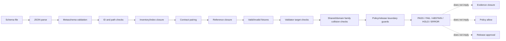

<!-- [KFM_META_BLOCK_V2]
doc_id: kfm://doc/tests-domains-agriculture-schema-readme
title: tests/domains/agriculture/schema/ — Agriculture Schema-Conformance Test Boundary
type: readme; directory-readme; domain-test-sublane; schema-conformance-enforceability-boundary
version: v0.2
status: draft; repository-grounded; README-only; inventory-drift-confirmed; mixed-schema-scaffolds; contract-fixture-validator-closure-unconfirmed; ci-partial; non-authoritative
owners: OWNER_TBD — Agriculture test steward · Agriculture domain steward · Schema steward · Contract steward · Fixture steward · Validation steward · Policy steward · Evidence steward · Release steward · Registry steward · Docs steward
created: NEEDS VERIFICATION — empty placeholder was expanded before v0.2
updated: 2026-07-16
supersedes: v0.1 Agriculture schema-conformance test guide
policy_label: "public-review; tests; agriculture; schema-conformance; json-schema-2020-12; contract-pairing; fixture-backed; validator-backed; schema-id-unique; ref-resolution; no-parallel-authority; no-network; synthetic-fixtures; policy-separate; release-separate; no-public-authority"
current_path: tests/domains/agriculture/schema/README.md
truth_posture: >
  CONFIRMED target v0.1 README and prior blob; canonical tests root; Agriculture parent
  test README; bounded repository search returning only this README under the schema child lane;
  schemas root responsibility; Agriculture domain schema index and shorter compatibility index;
  bounded search surfacing at least nineteen Agriculture schema files while the Agriculture schema
  index lists only aggregation_receipt.schema.json; representative empty-property generated
  scaffolds for CropObservation and AgricultureFeatureDTO; representative id-only greenfield
  scaffold for DomainObservation; missing AgricultureFeatureDTO contract; missing
  DomainObservation fixture path; Agriculture validator README with no confirmed executable;
  Makefile schemas target invoking tools/validators/_common/run_all.py; shared runner invoking five
  generic validators; inspected decision-envelope and run-receipt validators targeting shared
  runtime schemas rather than Agriculture schemas; and schema-validation workflow running make schemas /
  PROPOSED Agriculture schema inventory tests, syntax and metaschema tests, unique-id checks,
  contract/fixture/validator/policy path closure, schema-family collision checks, alias-lane
  anti-duplication checks, valid/invalid fixture matrices, semantic-minimum guardrails,
  strictness tests, finite outcomes, no-network posture, implementation sequence, definition of
  done, and migration plan /
  CONFLICTED Agriculture schema index versus actual schema inventory; shorter
  schemas/contracts/v1/agriculture compatibility lane versus domain schema lane; empty-property
  kfm:// scaffolds versus id-only https://schemas.kfm.local scaffolds; Agriculture-domain copies of
  decision, release, rollback, layer, evidence, catalog, correction, and receipt families versus
  shared family homes; schema metadata paths that do not resolve; and green schema-validation status
  versus lack of Agriculture-specific validator coverage /
  UNKNOWN collected Agriculture schema tests, complete schema inventory, authoritative schema
  registry, accepted canonical families, fixture payloads, contract closure, validator executables,
  $ref closure, format checking, policy bindings, release bindings, CI enforcement, current pass
  results, coverage, owners, branch-protection significance, and production use /
  NEEDS VERIFICATION canonical Agriculture schema set, duplicate-family disposition, schema-id
  namespace, migration strategy, required-field baselines, additionalProperties policy,
  unevaluatedProperties posture, error-code vocabulary, fixture identity, CODEOWNERS, schema
  registry adoption, deprecation process, and release-gate adoption
evidence_snapshot:
  repository: bartytime4life/Kansas-Frontier-Matrix
  repository_id: "1059091169"
  visibility: public
  base_ref: main
  base_commit: 7bf6f95e531300dd421a0e871fdba7a48f5485e6
  prior_blob: 6329ffef4bc6f425da95d9009d51e5443263304f
  schemas_root_readme_blob: 0021c5ee1e524e634930f7c6ec5f1df64b37c6ed
  agriculture_schema_index_blob: 35d28a2c767a2e932572656c0f93727ceb18a541
  agriculture_compatibility_index_blob: 716b3fd1e73feaeba678e6800606604e7d621d16
  crop_observation_schema_blob: 18417141a0e2d84a52d74dc6ef680300264e3e19
  agriculture_feature_dto_schema_blob: 69efa4c2eaa37c14a7d61333afd603efc7c336bb
  domain_observation_schema_blob: efa1e27083d491b686e237c718b436c3f19b516f
  domain_observation_contract_blob: 03eeb35ae8843fb351f8cfc64cf0ec25cdc0a4aa
  agriculture_validator_readme_blob: ba9009bdecb6e007423122c32c53fffc3559976d
  makefile_blob: 4dc8cf633581893d83fba53219c6ea847992e6be
  shared_schema_runner_blob: 3375cce172631dc3675cf2e46bb7788d273ff425
  decision_envelope_validator_blob: d2620867ec4138a08e653231e4ed12c22d389492
  run_receipt_validator_blob: 9b59481e90c021f0f92b74511c43fcefbbe3a057
  schema_validation_workflow_blob: 4656da9884ec7cccef453c06ae26e8eee90992da
  directory_rules_blob: 2affb080e6f0043867c64c7f06c1ca52030fbd55
related:
  - ../README.md
  - ../aggregate_only/README.md
  - ../catalog_closure/README.md
  - ../policy_deny/README.md
  - ../rollback_drill/README.md
  - ../../README.md
  - ../../../README.md
  - ../../../../schemas/README.md
  - ../../../../schemas/contracts/v1/domains/agriculture/README.md
  - ../../../../schemas/contracts/v1/agriculture/README.md
  - ../../../../contracts/domains/agriculture/
  - ../../../../fixtures/domains/agriculture/
  - ../../../../tools/validators/agriculture/README.md
  - ../../../../tools/validators/_common/run_all.py
  - ../../../../tests/schemas/README.md
  - ../../../../docs/domains/agriculture/OBJECT_FAMILIES.md
  - ../../../../docs/domains/agriculture/FILE_SYSTEM_PLAN.md
  - ../../../../docs/runbooks/agriculture/NO_NETWORK_TEST_RUNBOOK.md
  - ../../../../docs/doctrine/directory-rules.md
  - ../../../../.github/workflows/schema-validation.yml
  - ../../../../.github/workflows/domain-agriculture.yml
tags: [kfm, tests, agriculture, schemas, json-schema, conformance, schema-id, contract-pairing, fixtures, validators, inventory-drift, alias-drift, duplicate-family, no-network, fail-closed]
notes:
  - "This revision changes only tests/domains/agriculture/schema/README.md."
  - "The target lane remains README-only in bounded repository evidence; no executable test is created."
  - "Bounded search surfaced at least nineteen Agriculture schema files, while the Agriculture schema index lists one."
  - "Representative inspected schemas are explicitly PROPOSED scaffolds with either empty properties or only id required."
  - "The current schema-validation workflow does not establish Agriculture-specific schema coverage."
  - "No schema, contract, fixture, validator, workflow, registry record, policy, release record, data object, or public route is modified."
  - "Main advanced during authoring only in MapLibre and watcher documentation plus one generated receipt; no inspected Agriculture schema evidence changed."
[/KFM_META_BLOCK_V2] -->

<a id="top"></a>

# `tests/domains/agriculture/schema/` — Agriculture Schema-Conformance Test Boundary

> **One-line purpose.** Define the enforceability boundary for proving that Agriculture schemas are parseable, uniquely identified, correctly placed, paired with meaning, backed by fixtures and validators, resistant to duplicate authority, and incapable of laundering shape validity into evidence, policy, release, or public-truth claims.

<p>
  
  
  
  
  
  
  
</p>

> [!IMPORTANT]
> **Schema conformance proves machine shape only.** A schema-valid Agriculture object may still be semantically wrong, unsupported by evidence, rights-uncleared, source-role collapsed, policy-denied, unreleased, stale, sensitive, or unsafe for public display.

> [!CAUTION]
> **Current Agriculture schema coverage is not established.** The `schema/` test lane is README-only in bounded search. The Agriculture schema index is stale relative to the repository inventory, representative schemas are permissive scaffolds, fixture and validator paths are frequently absent or unverified, and the current schema CI path targets shared schemas rather than the Agriculture schema set.

> [!WARNING]
> **Do not mistake broad acceptance for maturity.** An empty-property schema with `additionalProperties: true`, or an `id`-only schema with `additionalProperties: true`, may accept almost any object. A passing validation result against such a scaffold must not be described as Agriculture contract conformance, governance closure, or release readiness.

**Quick links:** [Purpose](#purpose) · [Authority](#authority-level) · [Status](#status) · [Belongs](#what-belongs-here) · [Does not](#what-does-not-belong-here) · [Inputs](#inputs) · [Outputs](#outputs) · [Inventory](#confirmed-schema-inventory) · [Model](#schema-test-model) · [Cases](#required-test-case-matrix) · [Fixtures](#no-network-and-fixture-posture) · [Validation](#validation) · [Review](#review-burden) · [Related](#related-folders) · [ADRs](#adrs) · [Migration](#migration-correction-and-rollback) · [Open](#open-verification-register) · [Done](#definition-of-done) · [Last reviewed](#last-reviewed)

---

## Purpose

`tests/domains/agriculture/schema/` is the Agriculture test sublane for **machine-shape conformance, schema metadata closure, inventory integrity, and schema-authority drift detection**.

A complete Agriculture schema test family should answer:

1. Does every Agriculture schema file parse as JSON?
2. Does it declare the accepted JSON Schema dialect?
3. Is `$id` present, stable, unique, and consistent with the file path?
4. Is the schema located under the accepted Agriculture schema authority?
5. Does the paired semantic contract exist and describe the same object family?
6. Do declared fixture, validator, and policy paths exist where metadata names them?
7. Are valid and invalid fixtures actually discriminated?
8. Are required fields, enums, references, formats, and closed-world constraints meaningful rather than ceremonial?
9. Do all `$ref` values resolve inside accepted schema roots?
10. Are duplicate domain and shared-family schemas detected and dispositioned?
11. Does the shorter compatibility lane remain index-only?
12. Does schema validation remain separate from evidence, policy, rights, review, release, correction, and rollback?
13. Are sensitive Agriculture examples synthetic and non-identifying?
14. Does the default suite remain deterministic and no-network?
15. Does CI execute the Agriculture-specific tests rather than only shared validators?

This lane tests schema families used for Agriculture objects, DTOs, envelopes, receipts, proofs, catalogs, layers, release records, corrections, rollback support, and evidence-drawer payloads.

It does **not** choose canonical semantics, create schema authority, define policy, approve release, or prove current implementation maturity.

[Back to top](#top)

---

## Authority level

**Canonical test responsibility / non-authoritative Agriculture sublane.**

`tests/` owns authored enforceability proof. `schemas/` owns machine-checkable shape. Agriculture is a domain segment inside each responsibility root.

| Concern | Authority home | This lane's role |
|---|---|---|
| Executable schema tests | `tests/` | Owns test modules and assertions. |
| Agriculture test organization | `tests/domains/agriculture/` | Owns domain test grouping. |
| Agriculture schema definitions | `schemas/contracts/v1/domains/agriculture/` or accepted successor | Tests shape; does not author schemas. |
| Short Agriculture compatibility lane | `schemas/contracts/v1/agriculture/` | Tests index-only and anti-duplication posture. |
| Semantic object meaning | `contracts/domains/agriculture/` and accepted shared contract families | Tests pairing; does not redefine meaning. |
| Shared release/runtime/layer/evidence/catalog shapes | Their accepted schema families | Tests domain alias or specialization boundaries. |
| Fixtures | `fixtures/` and accepted Agriculture fixture lanes | Consumes synthetic examples; does not own shared fixtures. |
| Validator implementation | `tools/validators/` | Tests validator behavior; does not implement durable tooling here. |
| Schema registry | Accepted registry/package/data lane | Tests registration and uniqueness when authority is verified. |
| Policy, rights, sensitivity | `policy/` and governed review | Tests separation; schema pass cannot grant permission. |
| Evidence and provenance | Evidence contracts and governed proof roots | Tests references; cannot create evidence authority. |
| Release, correction, rollback | `release/` | Tests shape and guardrails; cannot approve transitions. |
| CI workflow | `.github/workflows/` and Makefile/task runner | Must invoke substantive tests; workflow presence is not coverage. |
| Public API/UI/map/AI behavior | Governed application and released-artifact surfaces | Tests boundary only; cannot expose a route. |

### Anti-collapse rules

This lane must not collapse:

- JSON parsing into metaschema validity;
- metaschema validity into object validity;
- object validity into semantic truth;
- schema validity into evidence closure;
- schema validity into policy permission;
- schema validity into rights clearance;
- schema validity into release approval;
- a schema `$id` into registry acceptance;
- a declared path into file existence;
- a file's existence into fixture or validator coverage;
- a generated scaffold into an active schema;
- a domain alias into a second canonical authority;
- a green workflow into Agriculture-specific test coverage;
- `additionalProperties: true` into extensibility approval;
- synthetic fixtures into source truth;
- README guidance into executable enforcement.

[Back to top](#top)

---

## Status

### Confirmed repository evidence

| Item | Status | Evidence boundary |
|---|---|---|
| Target README | `CONFIRMED` | Existing v0.1 file at this path. |
| Executable file under this child lane | `NOT FOUND in bounded search` | Search returned this README, not a test module. |
| Agriculture schema authority root | `CONFIRMED root responsibility / draft lane` | `schemas/README.md` and Agriculture schema index. |
| Short compatibility lane | `CONFIRMED` | `schemas/contracts/v1/agriculture/README.md` exists and says index-only by default. |
| Agriculture schema index | `CONFIRMED but stale` | It lists only `aggregation_receipt.schema.json`. |
| Agriculture schema files | `AT LEAST 19 surfaced` | Bounded search found nineteen direct Agriculture `.schema.json` paths. |
| Empty-property generated scaffold style | `CONFIRMED` | Representative CropObservation and AgricultureFeatureDTO schemas. |
| `id`-only greenfield scaffold style | `CONFIRMED` | Representative DomainObservation schema. |
| Contract pairing | `MIXED` | DomainObservation contract exists; AgricultureFeatureDTO contract path does not. |
| Fixture pairing | `MIXED / frequently absent` | DomainObservation declared fixture path was not found. |
| Agriculture validator lane | `README confirmed / executables unconfirmed` | Validator README explicitly avoids claiming scripts. |
| `make schemas` | `CONFIRMED executable target` | Runs the shared validator orchestrator. |
| Shared validator orchestrator | `CONFIRMED` | Invokes five generic validators. |
| Agriculture-specific validator invocation | `NOT CONFIRMED` | Inspected validators target shared runtime schemas. |
| Schema-validation workflow | `CONFIRMED` | Runs `make schemas`. |
| Agriculture-specific CI coverage | `UNKNOWN / not established` | Current command path does not enumerate Agriculture schemas. |

### Proposed test contract

The following are `PROPOSED` until executable tests, fixtures, validators, and CI wiring exist:

- Agriculture schema inventory generation;
- parse and metaschema validation;
- `$id` uniqueness and path consistency;
- contract, fixture, validator, and policy path closure;
- schema-registry membership checks;
- valid/invalid fixture discrimination;
- `$ref` closure and cycle checks;
- duplicate-family detection;
- alias-lane anti-duplication;
- minimum-semantic-field guardrails;
- strictness and unknown-field posture;
- schema-version and deprecation tests;
- policy/release separation guards;
- no-network enforcement;
- bounded error and outcome vocabulary.

### Conflicts

| Conflict | Current evidence | Required disposition |
|---|---|---|
| Agriculture schema index versus repository inventory | Index lists one schema; bounded search surfaces at least nineteen. | Generate or maintain an authoritative inventory. |
| Domain lane versus shorter alias lane | Both paths exist; shorter path claims index-only posture. | Keep alias empty of canonical schemas or adopt migration ADR. |
| Empty-property versus `id`-only scaffold styles | Both exist in the same domain lane. | Establish minimum maturity/status semantics. |
| `kfm://...` versus `https://schemas.kfm.local/...` IDs | Both namespace styles exist. | Pin accepted schema-ID policy. |
| Domain copies versus shared families | Decision, release, rollback, layer, evidence, catalog, correction, and receipt families appear in domain and shared lanes. | Choose alias, specialization, mirror, or deprecation model. |
| Schema metadata versus repository paths | Some declared contracts, fixtures, or validators are absent. | Fail metadata-closure tests until resolved. |
| Workflow name versus coverage | `schema-validation` runs shared validators. | Add Agriculture-specific inventory/test invocation. |
| Schema permissiveness versus contract richness | Draft contracts contain richer semantics than schemas enforce. | Harden schemas or label them explicitly non-enforcing. |

### Unknown or needs verification

- complete Agriculture schema inventory;
- canonical schema-registry implementation;
- accepted `$id` namespace;
- schema versioning rules;
- contract completeness;
- fixture payload inventory;
- validator executable inventory;
- validator-to-schema mapping;
- format checker policy;
- remote-reference policy;
- `$ref` cycle policy;
- `additionalProperties` and `unevaluatedProperties` policy;
- alias and specialization mechanism;
- CI branch-protection significance;
- current pass/fail results;
- code ownership and review enforcement;
- release-gate consumption.

[Back to top](#top)

---

## What belongs here

- This README.
- Agriculture schema-conformance test modules.
- Inventory and metadata-closure tests for Agriculture schemas.
- Tests for JSON parsing and JSON Schema 2020-12 conformance.
- `$id`, path, filename, title, version, and schema-status tests.
- Contract-pairing and path-resolution tests.
- Fixture and validator pairing tests.
- Valid/invalid fixture discrimination tests.
- `$ref` resolution, cycle, and boundary tests.
- Duplicate-family and alias-lane drift tests.
- Tests that schemas do not encode policy or release authority.
- Tests that schema pass is necessary but insufficient for governed use.
- Minimal inline synthetic values when a separate fixture file would add no value.
- Test-local snapshots of bounded diagnostics when the snapshot contract is explicit.

### Suggested implementation layout

```text
tests/domains/agriculture/schema/
├── README.md
├── test_inventory.py
├── test_schema_parse.py
├── test_schema_metaschema.py
├── test_schema_ids.py
├── test_contract_pairing.py
├── test_fixture_pairing.py
├── test_validator_pairing.py
├── test_ref_resolution.py
├── test_duplicate_families.py
├── test_alias_lane.py
├── test_valid_fixtures.py
├── test_invalid_fixtures.py
├── test_semantic_minimums.py
└── test_schema_not_policy_or_release.py
```

This layout is `PROPOSED`, not a claim that the files exist.

[Back to top](#top)

---

## What does NOT belong here

| Excluded material | Correct authority home |
|---|---|
| Canonical `.schema.json` definitions | `schemas/` |
| Semantic contract prose | `contracts/` |
| Shared fixture collections | `fixtures/` |
| Validator implementation | `tools/validators/` |
| Schema registry implementation | Accepted package, registry, or data lane |
| Policy rules and decisions | `policy/` |
| EvidenceBundle, SourceDescriptor, proof, receipt, catalog, or lifecycle records | Governed `data/` roots |
| ReleaseManifest, CorrectionNotice, RollbackCard, PromotionDecision, or release records | `release/` and paired contracts/schemas |
| Agriculture package or pipeline code | `packages/`, `pipelines/`, or accepted implementation roots |
| Live source data or source-system exports | Governed data lifecycle roots, never this test lane |
| Production logs or secrets | Governed runtime/logging/secret systems |
| Public API, UI, tile, map, export, dashboard, or AI payloads | Governed released application surfaces |
| Duplicate copies of canonical schemas | Never; use references, aliases, or migration notes |
| Generated prose treated as schema authority | Never |

[Back to top](#top)

---

## Inputs

### Required repository inputs

| Input family | Expected source | Test use |
|---|---|---|
| Agriculture schemas | `schemas/contracts/v1/domains/agriculture/*.schema.json` and accepted child lanes | Parse, validate, inventory, pair, and exercise. |
| Compatibility index | `schemas/contracts/v1/agriculture/` | Assert index-only/no duplicate canonical files. |
| Shared-family schemas | Runtime, release, layer, evidence, catalog, correction, source, and receipt schema lanes | Detect collisions and validate alias/specialization rules. |
| Semantic contracts | `contracts/domains/agriculture/` and shared contract families | Verify declared pairings and meaning alignment. |
| Fixtures | `fixtures/domains/agriculture/` and accepted shared fixture lanes | Positive, negative, edge, and migration cases. |
| Validators | `tools/validators/` | Confirm declared paths and actual schema targets. |
| Registry records | Accepted schema registry | Verify `$id`, version, status, and canonical home. |
| Policy references | `policy/domains/agriculture/` and cross-cutting policy | Ensure policy remains separate and references resolve. |
| Release references | `release/` and release contracts | Ensure schemas do not self-authorize publication. |
| CI configuration | Makefile and workflows | Confirm substantive Agriculture schema tests run. |

### Synthetic fixture contract

Every test fixture should record or imply:

- `case_id`;
- schema path and expected `$id`;
- schema version or status;
- paired contract path;
- fixture class: valid, invalid, edge, migration, or policy-boundary;
- expected validator outcome;
- expected bounded reason code;
- whether schema validation is expected to pass while governance still fails;
- sensitivity posture;
- source role, when material;
- no-network assertion;
- cleanup or immutability expectations.

### Disallowed inputs

- live NASS, NRCS, Mesonet, NASA, USDA, operator, farm, parcel, field, yield, or pesticide records;
- credentials, API keys, tokens, or private agreements;
- actual release manifests or production proof artifacts;
- remote `$ref` resolution over the network in the default suite;
- fixtures copied from sensitive production payloads;
- arbitrary generated examples without reviewable provenance and expected outcomes.

[Back to top](#top)

---

## Outputs

### Test result contract

A mature test should emit a bounded result such as:

```json
{
  "case_id": "ag-schema-domain-observation-missing-contract",
  "schema_path": "schemas/contracts/v1/domains/agriculture/domain_observation.schema.json",
  "check": "contract_pairing",
  "outcome": "PASS",
  "reason_code": "CONTRACT_PATH_RESOLVES",
  "details": [],
  "network_used": false
}
```

### Proposed finite outcomes

| Outcome | Meaning |
|---|---|
| `PASS` | The bounded schema test condition passed. |
| `FAIL` | The schema or pairing violated an asserted rule. |
| `ABSTAIN` | Required authority or migration decision is unresolved. |
| `HOLD` | Schema may parse but cannot be treated as active pending review or closure. |
| `ERROR` | Test infrastructure could not complete safely. |
| `SKIP_EXPLICIT` | Deliberate skip with a tracked reason; never silent. |

### Proposed reason-code families

| Reason code | Meaning |
|---|---|
| `SCHEMA_JSON_INVALID` | File is not valid JSON. |
| `SCHEMA_METASCHEMA_INVALID` | File violates the declared JSON Schema metaschema. |
| `SCHEMA_DIALECT_MISSING` | `$schema` is absent or unsupported. |
| `SCHEMA_ID_MISSING` | `$id` is absent. |
| `SCHEMA_ID_DUPLICATE` | `$id` collides with another schema. |
| `SCHEMA_ID_PATH_MISMATCH` | `$id` does not match accepted path/namespace rules. |
| `SCHEMA_INVENTORY_UNINDEXED` | Schema exists but is absent from the authoritative index. |
| `SCHEMA_INDEX_GHOST_ENTRY` | Index names a schema that does not exist. |
| `CONTRACT_PATH_MISSING` | Declared semantic contract does not resolve. |
| `FIXTURE_PATH_MISSING` | Declared fixture root does not resolve. |
| `VALIDATOR_PATH_MISSING` | Declared validator does not resolve. |
| `VALIDATOR_TARGET_MISMATCH` | Validator exists but targets another schema. |
| `POLICY_PATH_MISSING` | Declared policy path does not resolve where required. |
| `SCHEMA_REF_UNRESOLVED` | `$ref` target cannot be resolved. |
| `SCHEMA_REF_OUTSIDE_AUTHORITY` | `$ref` escapes accepted schema roots. |
| `SCHEMA_FAMILY_COLLISION` | Competing schema families claim the same object. |
| `COMPATIBILITY_LANE_DUPLICATE` | Short alias lane contains a duplicate canonical schema. |
| `SCHEMA_TOO_PERMISSIVE` | Scaffold accepts objects that governance expects to reject. |
| `VALID_FIXTURE_REJECTED` | Accepted valid fixture fails. |
| `INVALID_FIXTURE_ACCEPTED` | Invalid fixture passes. |
| `SCHEMA_POLICY_COLLAPSE` | Schema encodes or implies policy authority improperly. |
| `SCHEMA_RELEASE_COLLAPSE` | Schema pass is treated as release approval. |
| `NETWORK_ACCESS_ATTEMPTED` | Default test attempted network access. |
| `TEST_INFRASTRUCTURE_ERROR` | Runner failed independently of the object under test. |

### Output boundaries

Test outputs must not:

- mutate canonical schemas;
- rewrite indexes automatically;
- approve schema activation;
- alter registry state;
- change policy or release state;
- contain sensitive fixture payloads;
- claim evidence closure;
- claim public safety;
- publish artifacts.

[Back to top](#top)

---

## Confirmed schema inventory

### Bounded direct Agriculture schema inventory

The following direct schema paths surfaced in repository search. Presence is `CONFIRMED`; maturity, canonicality, and pairing remain mixed.

| Schema | Observed family | Detailed maturity |
|---|---|---|
| `agriculture_feature_dto.schema.json` | API/DTO | Representative empty-property PROPOSED scaffold. |
| `agriculture_decision_envelope.schema.json` | Decision envelope | PROPOSED scaffold; overlaps generic decision envelope. |
| `aggregation_receipt.schema.json` | Receipt | PROPOSED scaffold; contract filename conflict documented elsewhere. |
| `catalog_matrix.schema.json` | Catalog | Needs comparison with shared CatalogMatrix family. |
| `correction_notice.schema.json` | Correction | Needs comparison with shared correction family. |
| `crop_observation.schema.json` | Observation | Representative empty-property PROPOSED scaffold. |
| `decision_envelope.schema.json` | Decision envelope | Representative `id`-only greenfield scaffold. |
| `domain_feature_identity.schema.json` | Identity | Detailed pairing and fixture coverage need verification. |
| `domain_layer_descriptor.schema.json` | Layer descriptor | Detailed pairing and shared-layer relationship need verification. |
| `domain_observation.schema.json` | Observation wrapper | `id`-only greenfield scaffold; contract exists; fixture/validator absent. |
| `domain_validation_report.schema.json` | Validation report | Pairing and validator ownership need verification. |
| `evidence_bundle.schema.json` | Evidence | Needs comparison with shared evidence family. |
| `evidence_drawer_payload.schema.json` | UI/evidence projection | Public-boundary and shared payload relationship need verification. |
| `layer_manifest.schema.json` | Layer release | Needs comparison with shared layer-manifest family. |
| `promotion_decision.schema.json` | Release decision | Needs comparison with shared promotion family. |
| `release_manifest.schema.json` | Release manifest | Parallel domain/shared family conflict confirmed elsewhere. |
| `rollback_card.schema.json` | Rollback | Parallel domain/shared family conflict confirmed elsewhere. |
| `run_receipt.schema.json` | Runtime receipt | Needs comparison with shared runtime receipt family. |
| `source_state_hash.schema.json` | Source state/integrity | Pairing, fixtures, and validator need verification. |

This is a bounded search inventory, not a full recursive filesystem audit.

### Representative scaffold styles

#### Generated empty-property scaffold

```json
{
  "$schema": "https://json-schema.org/draft/2020-12/schema",
  "$id": "kfm://schemas/contracts/v1/domains/agriculture/<name>.schema.json",
  "type": "object",
  "additionalProperties": true,
  "properties": {},
  "x-kfm": {
    "status": "PROPOSED"
  }
}
```

Observed implications:

- validates almost any object;
- does not enforce required identity or domain fields;
- may declare a contract path without fixtures or validator metadata;
- must be tested as `STUB`, not active conformance.

#### `id`-only greenfield scaffold

```json
{
  "$schema": "https://json-schema.org/draft/2020-12/schema",
  "$id": "https://schemas.kfm.local/contracts/v1/domains/agriculture/<name>.schema.json",
  "type": "object",
  "properties": {
    "spec_hash": {"type": "string"},
    "id": {"type": "string"},
    "version": {"type": "string"}
  },
  "required": ["id"],
  "additionalProperties": true,
  "x-kfm": {
    "status": "PROPOSED"
  }
}
```

Observed implications:

- proves only minimal identity shape;
- does not enforce the richer paired contract;
- names fixture, validator, and policy paths that may not exist;
- must be paired with metadata-closure and governance-minimum tests.

### Inventory drift assertion

The Agriculture schema index currently names only `aggregation_receipt.schema.json`, while bounded search surfaces at least nineteen schema files.

A future executable test should fail when:

```text
actual schema files
!=
authoritative schema index entries
```

The test must support explicit exclusions for transitional, deprecated, generated, or compatibility-only files, but exclusions must be reviewable and versioned.

[Back to top](#top)

---

## Schema test model



### Proof layers

| Layer | Proves | Does not prove |
|---|---|---|
| JSON parse | File syntax is valid JSON. | Schema correctness. |
| Metaschema | Schema conforms to declared dialect. | Object semantics. |
| Identity | `$id` is present and unique. | Registry acceptance. |
| Inventory | Index and files agree. | Canonicality of each family. |
| Contract pairing | Declared meaning file resolves. | Schema enforces the meaning. |
| Reference closure | `$ref` graph resolves. | Referenced semantics are correct. |
| Fixture discrimination | Known examples are separated. | Production completeness. |
| Validator mapping | Validator targets intended schema. | Validator covers all governance. |
| Collision checks | Duplicate authority is surfaced. | ADR disposition. |
| Boundary guards | Schema pass is not policy/release. | Policy or release outcome. |

### Maturity gates

| Maturity | Minimum evidence |
|---|---|
| `STUB` | Parses; explicitly labeled; no active conformance claim. |
| `DRAFT_SCHEMA` | Meaningful fields; contract pairing; initial positive/negative fixtures. |
| `VALIDATED_SCHEMA` | Metaschema, fixtures, validator, `$ref`, ID, and inventory tests pass. |
| `ACTIVE_SCHEMA` | Registry entry, accepted canonical home, reviewed contract pairing, CI enforcement, migration/deprecation posture. |
| `DEPRECATED_SCHEMA` | Replacement and migration path documented; consumers tested. |
| `CONFLICTED_SCHEMA` | Competing homes or meanings surfaced; activation blocked. |

These statuses are `PROPOSED` test semantics until accepted by schema governance.

[Back to top](#top)

---

## Required test-case matrix

### Inventory and file integrity

| Case | Expected outcome |
|---|---|
| Every direct Agriculture schema is indexed | `PASS` |
| Schema exists but index omits it | `FAIL / SCHEMA_INVENTORY_UNINDEXED` |
| Index points to missing schema | `FAIL / SCHEMA_INDEX_GHOST_ENTRY` |
| Non-JSON file uses `.schema.json` suffix | `FAIL / SCHEMA_JSON_INVALID` |
| Schema file is byte-identical duplicate of another canonical file | `FAIL / SCHEMA_FAMILY_COLLISION` |
| Compatibility lane contains canonical duplicate | `FAIL / COMPATIBILITY_LANE_DUPLICATE` |
| Explicit transitional schema has migration record | `PASS or HOLD`, according to accepted status |

### Dialect and identity

| Case | Expected outcome |
|---|---|
| `$schema` is JSON Schema 2020-12 | `PASS` |
| `$schema` missing | `FAIL / SCHEMA_DIALECT_MISSING` |
| Unsupported dialect appears without migration | `FAIL or HOLD` |
| `$id` is unique | `PASS` |
| Duplicate `$id` across domain/shared schemas | `FAIL / SCHEMA_ID_DUPLICATE` |
| `$id` path disagrees with file path | `FAIL / SCHEMA_ID_PATH_MISMATCH` |
| `kfm://` and HTTPS namespace coexist without policy | `HOLD / NEEDS VERIFICATION` |
| Title or metadata names another object family | `FAIL` |

### Metadata closure

| Case | Expected outcome |
|---|---|
| `x-kfm.contract_doc` resolves | `PASS` |
| Contract path missing | `FAIL / CONTRACT_PATH_MISSING` |
| `fixtures_root` resolves | `PASS` |
| Fixture root missing | `FAIL / FIXTURE_PATH_MISSING` |
| Declared validator resolves | `PASS` |
| Validator missing | `FAIL / VALIDATOR_PATH_MISSING` |
| Validator targets another schema | `FAIL / VALIDATOR_TARGET_MISMATCH` |
| Policy path resolves where declared | `PASS` |
| Metadata path uses conflicting hyphen/snake convention | `HOLD` pending migration decision |

### Schema strictness

| Case | Expected outcome |
|---|---|
| Required fields reject incomplete object | `PASS` |
| Invalid type is rejected | `PASS` |
| Invalid enum is rejected | `PASS` |
| Unknown field is rejected when contract requires closed shape | `PASS` |
| Unknown field is accepted under explicitly extensible profile | `PASS` |
| Empty-property scaffold accepts arbitrary object | `HOLD / SCHEMA_TOO_PERMISSIVE`, unless explicitly tested as stub |
| `id`-only scaffold accepts semantically empty object | `HOLD / SCHEMA_TOO_PERMISSIVE`, unless explicitly tested as stub |
| Alias wrapper rejects inherited properties due to wrong strictness keyword | `FAIL` |
| Alias wrapper uses accepted `unevaluatedProperties` pattern | `PASS` |

### Reference closure

| Case | Expected outcome |
|---|---|
| Local `$ref` resolves | `PASS` |
| `$ref` missing | `FAIL / SCHEMA_REF_UNRESOLVED` |
| `$ref` escapes accepted schema authority | `FAIL / SCHEMA_REF_OUTSIDE_AUTHORITY` |
| Circular reference is supported and bounded | `PASS` |
| Unsupported cycle causes resolver failure | `ERROR` |
| Default suite attempts remote network retrieval | `FAIL / NETWORK_ACCESS_ATTEMPTED` |

### Fixtures

| Case | Expected outcome |
|---|---|
| Minimal valid fixture passes | `PASS` |
| Rich valid fixture passes | `PASS` |
| Missing required field fails | `PASS` test / validation failure |
| Invalid enum fails | `PASS` test / validation failure |
| Wrong reference family fails | `PASS` test / validation failure |
| Sensitive fixture contains real field/operator detail | `FAIL` and fixture replacement |
| Valid fixture passes schema but fails policy guard | `PASS` for separation test |
| Invalid fixture passes permissive scaffold | `FAIL / INVALID_FIXTURE_ACCEPTED` or explicit `HOLD` for stub maturity |

### Duplicate-family and authority drift

| Case | Expected outcome |
|---|---|
| Domain schema specializes shared schema through accepted mechanism | `PASS` |
| Domain schema duplicates shared family with no ADR | `FAIL / SCHEMA_FAMILY_COLLISION` |
| Shared release family and Agriculture release family use different required fields | `HOLD` pending disposition |
| Generic and Agriculture decision envelopes both claim canonical status | `FAIL` |
| Short alias lane gains canonical schema file | `FAIL` |
| Deprecated schema remains consumed without migration test | `FAIL` |

### Boundary guards

| Case | Expected outcome |
|---|---|
| Schema pass is treated as EvidenceBundle closure | `FAIL / SCHEMA_POLICY_COLLAPSE` or dedicated evidence-collapse code |
| Schema pass is treated as policy allow | `FAIL / SCHEMA_POLICY_COLLAPSE` |
| Schema pass is treated as release approval | `FAIL / SCHEMA_RELEASE_COLLAPSE` |
| Schema pass is treated as public-safe exact field exposure | `FAIL` |
| Schema test reads live source data | `FAIL` |
| Schema test modifies canonical schema | `FAIL` |
| Schema test automatically rewrites index | `FAIL` unless explicit reviewed generation mode |

### CI coverage

| Case | Expected outcome |
|---|---|
| CI invokes Agriculture schema test lane | `PASS` |
| CI invokes only shared validators | `HOLD / coverage incomplete` |
| Workflow passes because no Agriculture tests collected | `FAIL` |
| Test collection count drops unexpectedly | `FAIL` |
| Required schema family is excluded without tracked reason | `FAIL` |
| Workflow logs schema inventory and test count | `PASS` |
| Workflow success is used to claim release readiness | `FAIL` |

[Back to top](#top)

---

## No-network and fixture posture

The default Agriculture schema suite must be:

- synthetic;
- deterministic;
- local-only;
- no-network;
- side-effect free;
- non-mutating;
- safe for a public repository;
- repeatable across developer and CI environments.

### Network guard

Tests should fail if schema resolution attempts:

- HTTP or HTTPS retrieval;
- live source APIs;
- registry services;
- cloud object storage;
- database access;
- model/runtime calls;
- public tiles or web services.

Remote identifiers may appear as strings, but default validation must resolve against a checked-in local catalog or registry mirror.

### Fixture classes

```text
fixtures/domains/agriculture/schema/
├── inventory/
├── valid/
├── invalid/
├── edge/
├── collisions/
├── aliases/
├── migrations/
└── boundary/
```

This layout is `PROPOSED`.

### Fixture admission

Before a fixture enters the shared lane:

- confirm it is synthetic or safely minimized;
- record source/creation provenance;
- identify schema and version;
- identify expected outcome and reason code;
- verify no private field, operator, parcel, yield, pesticide, or agreement data;
- ensure deterministic ordering and timestamps;
- avoid secrets and environment-specific paths;
- link the consuming test;
- document whether the fixture proves shape only or a boundary guard.

[Back to top](#top)

---

## Validation

### Current confirmed commands

The repository currently defines:

```bash
make schemas
```

which invokes:

```bash
python tools/validators/_common/run_all.py
```

The inspected shared runner calls five generic validators. The inspected decision-envelope and run-receipt validators target shared runtime schema and fixture paths, not Agriculture schema paths.

The current schema workflow invokes:

```bash
pip install -e .
make schemas
```

This is real CI wiring, but it does not establish Agriculture-specific schema inventory, pairing, fixture, collision, or boundary coverage.

### Proposed local inspection

```bash
find tests/domains/agriculture/schema -maxdepth 5 -type f | sort
find schemas/contracts/v1/domains/agriculture -maxdepth 5 -type f | sort
find schemas/contracts/v1/agriculture -maxdepth 5 -type f | sort
find contracts/domains/agriculture fixtures/domains/agriculture tools/validators -maxdepth 6 -type f 2>/dev/null | sort
```

### Proposed executable command

```bash
pytest -q tests/domains/agriculture/schema
```

### Proposed fail-closed CI command

```bash
pytest -q \
  tests/domains/agriculture/schema \
  --maxfail=1 \
  --disable-warnings
```

### Minimum CI evidence

A meaningful CI run should report:

- number of Agriculture schema files discovered;
- number indexed;
- number of unique `$id` values;
- number of contract paths resolved;
- number of fixture roots resolved;
- number of validators resolved;
- number of valid fixtures tested;
- number of invalid fixtures tested;
- number of shared/domain collisions;
- number of explicit holds or abstentions;
- collected test count;
- final outcome.

### Validation checklist

- [ ] Target remains documentation-only until tests exist.
- [ ] Every direct Agriculture schema parses.
- [ ] Every schema validates against declared metaschema.
- [ ] Every `$id` is unique.
- [ ] Index equals discovered inventory after accepted exclusions.
- [ ] Compatibility lane has no duplicate canonical schemas.
- [ ] Contract paths resolve or fail explicitly.
- [ ] Fixture paths resolve or fail explicitly.
- [ ] Validator paths resolve and target the intended schema.
- [ ] `$ref` graph resolves locally.
- [ ] Valid fixtures pass.
- [ ] Invalid fixtures fail.
- [ ] Permissive scaffolds are labeled and held from active status.
- [ ] Domain/shared family conflicts are surfaced.
- [ ] Schema pass remains separate from policy, evidence, and release.
- [ ] Default tests use no network.
- [ ] CI invokes Agriculture-specific tests.
- [ ] No test mutates canonical schemas or indexes.
- [ ] Documentation is updated when behavior changes.

[Back to top](#top)

---

## Review burden

Schema tests protect a trust-bearing boundary. Review is heavier when a schema affects:

- public API or UI payloads;
- exact or generalized geometry;
- field/operator/parcel-adjacent data;
- EvidenceRef or EvidenceBundle references;
- source identity or source roles;
- policy decisions;
- release manifests;
- corrections or rollback;
- receipts and proofs;
- cross-domain joins;
- deterministic identity or `spec_hash`;
- compatibility aliases;
- schema registry state.

### Required review perspectives

| Reviewer | Focus |
|---|---|
| Schema steward | Dialect, `$id`, strictness, refs, versioning, registry. |
| Agriculture steward | Domain ownership and object-family alignment. |
| Contract steward | Semantic pairing and drift. |
| Fixture steward | Synthetic, deterministic, representative cases. |
| Validation steward | Runner behavior and diagnostic stability. |
| Policy/sensitivity reviewer | Shape does not bypass policy or expose protected detail. |
| Release steward | Schema validity is not release authority. |
| Adjacent domain steward | Cross-domain references preserve ownership. |
| Docs steward | Truth labels, paths, commands, and maturity remain accurate. |

### High-risk review triggers

- changing `$id`;
- moving a schema;
- adding an alias or mirror;
- changing required fields;
- closing or opening `additionalProperties`;
- changing `$ref` targets;
- merging domain and shared families;
- changing schema dialect;
- changing fixture expectations;
- changing validator target;
- changing CI inclusion;
- deprecating a schema used by release/public surfaces.

### Review questions

- Does the test assert repository evidence rather than memory?
- Does it distinguish parse, metaschema, fixture, semantic, policy, and release layers?
- Does it fail on duplicate authority?
- Does it preserve reversibility and migration evidence?
- Does it avoid live or sensitive inputs?
- Does it prevent a permissive scaffold from being called active?
- Does it expose path conflicts rather than silently choosing one?
- Does it keep public clients behind governed interfaces?

[Back to top](#top)

---

## Related folders

| Path | Relationship |
|---|---|
| `../README.md` | Agriculture test parent. |
| `../../../../schemas/README.md` | Machine-shape root boundary. |
| `../../../../schemas/contracts/v1/domains/agriculture/` | Primary observed Agriculture schema lane. |
| `../../../../schemas/contracts/v1/agriculture/` | Short compatibility/index lane. |
| `../../../../contracts/domains/agriculture/` | Agriculture semantic contracts. |
| `../../../../fixtures/domains/agriculture/` | Agriculture shared fixtures. |
| `../../../../tools/validators/agriculture/` | Proposed Agriculture validator lane. |
| `../../../../tools/validators/_common/` | Shared schema runner and plumbing. |
| `../../../schemas/` | Cross-cutting schema-test lane. |
| `../../../../policy/domains/agriculture/` | Agriculture policy authority. |
| `../../../../data/registry/` | Registry/source state where accepted. |
| `../../../../data/proofs/` | Evidence/proof authority. |
| `../../../../release/` | Release, correction, rollback authority. |
| `../../../../docs/domains/agriculture/` | Domain doctrine and object-family documentation. |
| `../../../../docs/doctrine/directory-rules.md` | Placement and README governance. |
| `../../../../.github/workflows/schema-validation.yml` | Current shared schema workflow. |
| `../../../../.github/workflows/domain-agriculture.yml` | Current Agriculture workflow scaffold. |

### Cross-lane relationships

- `aggregate_only/` tests whether schema-valid aggregate objects preserve aggregate meaning.
- `catalog_closure/` tests whether schema-valid catalog objects close against evidence and release support.
- `policy_deny/` tests whether schema-valid objects are still denied or held when policy requires.
- `rollback_drill/` tests whether schema-valid rollback/release objects are operationally reversible.
- `soil_moisture/`, `ssurgo_lineage/`, and vegetation-index lanes should consume schema results without redefining Soil, Hydrology, or Atmosphere authority.

[Back to top](#top)

---

## ADRs

### Governing ADR and doctrine topics

| Topic | Required decision or evidence |
|---|---|
| Schema home | Confirm `schemas/contracts/v1/domains/agriculture/` as canonical domain lane. |
| Short alias lane | Confirm index-only, deprecate, or formalize alias behavior. |
| Schema ID namespace | Choose `kfm://`, HTTPS, or a documented dual policy. |
| Domain/shared families | Define alias, specialization, extension, mirror, or deprecation semantics. |
| Schema registry | Identify authority for `$id`, version, status, and canonical path. |
| Strictness | Define `additionalProperties` and `unevaluatedProperties` defaults. |
| Scaffold maturity | Define when empty or `id`-only schemas may exist and how they are labeled. |
| Contract pairing | Define required metadata and failure posture. |
| Fixture/validator pairing | Define when paths are mandatory and how absence blocks activation. |
| CI admission | Define minimum Agriculture schema tests required for promotion. |
| Versioning/deprecation | Define compatibility, migration, supersession, and rollback. |

### Decisions this README does not make

This README does not:

- select canonical duplicate families;
- rename or move schemas;
- change `$id`;
- harden required fields;
- choose schema registry technology;
- activate or deprecate schemas;
- authorize a migration;
- approve release.

Those changes require their own governed implementation and, where authority changes, an ADR or migration record.

[Back to top](#top)

---

## Migration, correction, and rollback

### Smallest safe implementation sequence

1. Add an inventory-only test that discovers direct Agriculture schemas.
2. Reconcile the Agriculture schema index with discovered files.
3. Add parse and metaschema tests.
4. Add `$id` uniqueness and path tests.
5. Add contract-path closure tests.
6. Add fixture and validator path-closure tests.
7. Add `$ref` resolution tests.
8. Add duplicate shared/domain family detection.
9. Add explicit scaffold maturity tests.
10. Add valid/invalid fixtures for one thin slice.
11. Add Agriculture-specific CI invocation.
12. Expand family by family.

### Migration rule

A schema move or rename should preserve:

- old path and `$id` mapping;
- new path and `$id`;
- migration reason;
- compatibility window;
- consumer inventory;
- fixture and validator changes;
- release/public consumer impact;
- deprecation date;
- rollback target.

### Correction rule

When a schema test or index claim is wrong:

- correct the claim in place when unreleased;
- record a migration or correction note when consumers may depend on it;
- update the schema index;
- update fixtures and validators;
- rerun inventory and collision tests;
- preserve prior released schema artifacts and references.

### Rollback rule

Rollback this README change if it:

- claims executable coverage that does not exist;
- declares a canonical schema family without authority;
- hides duplicate schema homes;
- treats schema pass as policy or release approval;
- encourages live/sensitive fixture use;
- creates a parallel authority path.

Repository rollback for this documentation-only change is a commit revert or restoration of the prior blob.

[Back to top](#top)

---

## Open verification register

| Verification item | Status |
|---|---|
| Complete direct and child-lane Agriculture schema inventory | `NEEDS VERIFICATION` |
| Authoritative generated schema index | `NEEDS VERIFICATION` |
| Canonical `$id` namespace | `CONFLICTED / NEEDS VERIFICATION` |
| Short alias-lane disposition | `NEEDS VERIFICATION` |
| Domain/shared family mapping | `CONFLICTED / NEEDS VERIFICATION` |
| Contract closure for all schemas | `NEEDS VERIFICATION` |
| Fixture roots and payloads | `NEEDS VERIFICATION` |
| Validator executables and target mapping | `NEEDS VERIFICATION` |
| Agriculture-specific `$ref` closure | `NEEDS VERIFICATION` |
| Schema registry authority | `UNKNOWN` |
| Strictness defaults | `NEEDS VERIFICATION` |
| Required-field minimums | `NEEDS VERIFICATION` |
| Format-checker behavior | `UNKNOWN` |
| Remote-reference policy | `NEEDS VERIFICATION` |
| Schema test collection | `UNKNOWN` |
| Agriculture-specific CI invocation | `NOT CONFIRMED` |
| Current pass/fail results | `UNKNOWN` |
| Coverage and branch protection | `UNKNOWN` |
| CODEOWNERS and separation of duties | `NEEDS VERIFICATION` |
| Release-gate consumption | `UNKNOWN` |
| Deprecation and rollback automation | `UNKNOWN` |

[Back to top](#top)

---

## Definition of done

This lane is not complete until:

- [ ] executable tests exist under the accepted test path;
- [ ] complete Agriculture schema inventory is generated and reviewed;
- [ ] index and filesystem inventory agree;
- [ ] all schema files parse and validate against declared dialects;
- [ ] `$id` values are unique and policy-compliant;
- [ ] contract paths resolve;
- [ ] fixture roots resolve;
- [ ] validator paths resolve and target intended schemas;
- [ ] `$ref` graph resolves locally;
- [ ] positive and negative fixtures exist for material families;
- [ ] permissive scaffolds are explicitly held from active status;
- [ ] duplicate domain/shared families have accepted dispositions;
- [ ] compatibility lane contains no duplicate canonical schemas;
- [ ] schema pass remains separate from evidence, policy, rights, review, release, correction, and rollback;
- [ ] default suite is no-network and deterministic;
- [ ] CI invokes Agriculture-specific tests and reports collection counts;
- [ ] failures use bounded diagnostics;
- [ ] CODEOWNERS and review burden are accepted;
- [ ] documentation matches implementation;
- [ ] migration and rollback paths are tested.

Until those conditions are met, the lane remains `README-only / implementation unconfirmed`.

[Back to top](#top)

---

## Last reviewed

| Field | Value |
|---|---|
| Last reviewed | 2026-07-16 |
| Review basis | Current `main` repository evidence, bounded code search, direct file inspection, Directory Rules, schema root and Agriculture schema indexes, representative schema/contract/path checks, Makefile and workflow inspection |
| External research | None |
| Executable tests run | None |
| Current lane state | README-only |
| Schema inventory state | Drift confirmed; complete inventory needs verification |
| CI state | Shared schema validation exists; Agriculture-specific coverage not established |
| Next smallest safe change | Add a read-only Agriculture schema inventory test and reconcile the Agriculture schema index without changing schema authority |
