<!-- [KFM_META_BLOCK_V2]
doc_id: kfm://doc/tests-domains-archaeology-readme
title: tests/domains/archaeology/ — Archaeology Domain Test Boundary and Enforceability Index
type: readme; directory-readme; domain-test-parent; archaeology; sensitive-domain; enforceability-proof; non-authoritative
version: v0.2
status: draft; repository-grounded; thirteen-named-test-modules-present; sampled-modules-placeholder-only; fixture-parent-grounded; source-admission-child-grounded; executable-enforcement-not-established; policy-scaffold; validator-maturity-mixed; ci-todo-only; no-network-by-default; fail-closed
owners: OWNER_TBD — Archaeology steward · Test/QA steward · Fixture steward · Source steward · Object-identity steward · Temporal steward · Evidence steward · Catalog/proof steward · Sensitivity reviewer · Cultural-review steward · Sovereignty/CARE reviewer · Rights-holder representative · Schema steward · Contract steward · Policy steward · Validator steward · Release steward · Security reviewer · CI steward · Docs steward
created: NEEDS VERIFICATION — v0.1 states the greenfield stub was replaced on 2026-07-05
updated: 2026-07-16
supersedes: v0.1 short Archaeology domain-test parent README
policy_label: "public-review; tests; archaeology; domain-test-parent; sensitive-domain; synthetic-only; no-network; deny-by-default; candidate-not-site; source-role-fixed; evidence-required; exact-location-denied; rights-aware; cultural-review-aware; sovereignty-aware; release-gated; correction-aware; rollback-aware; no-truth-authority; no-policy-authority; no-release-authority"
current_path: tests/domains/archaeology/README.md
truth_posture: >
  CONFIRMED target v0.1 README and prior blob; tests responsibility root; thirteen named direct
  test_*.py files; grounded fixtures parent and source_admission child; tests/fixtures root and
  Archaeology test-local fixture parent; canonical reusable Archaeology fixture root; Directory
  Rules; Archaeology domain doctrine, object, pipeline, sensitivity, cultural-review, publication,
  source, validator, Makefile, pytest, and TODO-only workflow evidence; sampled direct test modules
  containing only one PROPOSED placeholder docstring; no matching open pull request or task branch /
  PROPOSED this parent own domain-level test organization, trust-spine coverage, collection and
  nonempty-suite requirements, cross-family invariants, finite outcomes, artifact expectations,
  maintenance rules, correction, rollback, and future child-lane admission criteria while child
  tests consume schemas, contracts, policy, validators, reusable fixtures, and test-local wrappers
  by reference / CONFLICTED or drift-prone rich test filenames versus placeholder contents;
  fixture-home split; broad versus child validator routing; archaeology contract and schema aliases;
  source-registry lane order; source schema singular/plural and hyphen/underscore naming; site,
  candidate, component, and public-safe fixture-home relationships / UNKNOWN exhaustive recursive
  inventory, ignored or generated tests, dynamic collection, actual collected case count, uninspected
  module contents, fixture payload inventory, accepted policy evaluator, production registry
  consumers, retained reports, branch-protection significance, current pass rates, coverage,
  mutation score, flake rate, release dependency, and production use / NEEDS VERIFICATION accepted
  owners, CODEOWNERS, executable test bodies, nonempty collection, fixture-to-test backlinks,
  contract/schema/policy/version bindings, no-network enforcement, stable reason codes, safe
  diagnostics, CI artifact retention, required-check status, correction cascade, and rollback drill
evidence_snapshot:
  repository: bartytime4life/Kansas-Frontier-Matrix
  repository_id: "1059091169"
  visibility: public
  base_ref: main
  base_commit: da40c9b4e55b2851556ec19ca57e40af41203a6a
  prior_blob: 2b739d5bdf322de4523faa09a2b788be910bf8b0
  fixtures_parent_blob: af53341811d0f7710a0b4e78651f62b8fbaf5b0d
  source_admission_child_blob: 3695fc65d60eb455b375b065d62c6749aac8af7c
  direct_named_test_modules: 13
  sampled_placeholder_modules:
    - tests/domains/archaeology/test_public_no_leak.py
    - tests/domains/archaeology/test_schema_validation.py
    - tests/domains/archaeology/test_no_network_fixtures.py
  bounded_inventory_note: >
    Repository search, direct reads, and named-path probes establish only the checked snapshot.
    They do not prove permanent absence from history, forks, ignored files, generated workspaces,
    dynamic test generation, Git LFS, external stores, differently named paths, or later commits.
related:
  - ../../README.md
  - fixtures/README.md
  - fixtures/source_admission/README.md
  - ../../fixtures/README.md
  - ../../fixtures/domains/archaeology/README.md
  - ../../../fixtures/domains/archaeology/README.md
  - ../../../docs/doctrine/directory-rules.md
  - ../../../docs/domains/archaeology/README.md
  - ../../../docs/domains/archaeology/OBJECT_FAMILIES.md
  - ../../../docs/domains/archaeology/PIPELINE.md
  - ../../../docs/domains/archaeology/SENSITIVITY.md
  - ../../../docs/domains/archaeology/CULTURAL_REVIEW.md
  - ../../../docs/domains/archaeology/PUBLICATION_AND_POLICY.md
  - ../../../docs/domains/archaeology/VALIDATORS.md
  - ../../../docs/domains/archaeology/CANONICAL_PATHS.md
  - ../../../contracts/domains/archaeology/
  - ../../../schemas/contracts/v1/domains/archaeology/
  - ../../../schemas/contracts/v1/source/README.md
  - ../../../policy/domains/archaeology/README.md
  - ../../../tools/validators/archaeology/README.md
  - ../../../tools/validators/domains/archaeology/README.md
  - ../../../.github/workflows/domain-archaeology.yml
  - ../../../Makefile
  - ../../../pyproject.toml
  - ../../../schemas/contracts/v1/receipts/generated_receipt.schema.json
tags: [kfm, tests, archaeology, domain-tests, candidate-not-site, evidence, sensitivity, cultural-review, source-admission, no-network, release, correction, rollback]
notes:
  - "This revision changes only this README; a generated provenance receipt is paired separately."
  - "The lane contains named test modules, but sampled modules are placeholder docstrings and do not establish executable enforcement."
  - "Fixtures, test-local wrappers, reusable payloads, contracts, schemas, policy, validators, source records, evidence, lifecycle state, and release authority remain in their owning roots."
  - "No test code, fixture payload, source record, schema, contract, policy, validator, workflow, lifecycle object, release object, or public artifact is created or modified."
[/KFM_META_BLOCK_V2] -->

<a id="top"></a>

# Archaeology Domain Test Boundary and Enforceability Index

`tests/domains/archaeology/`

> **One-line purpose.** Organize deterministic, fail-closed tests that prove Archaeology source, object, evidence, sensitivity, cultural-review, lifecycle, release, correction, rollback, map/API, and AI boundaries without allowing tests or fixtures to become archaeology truth, cultural authority, policy authority, release authority, or protected-data storage.

<p>
  
  
  
  
  
  
  
  
</p>

> [!IMPORTANT]
> **File presence is not test enforcement.** The direct lane contains 13 named `test_*.py` files, but sampled modules contain only a one-line `PROPOSED` placeholder docstring. A filename, README, TODO workflow, or green zero-case collection does not prove an Archaeology invariant is enforced.

> [!CAUTION]
> **Archaeology is a sensitive-domain lane.** Exact site coordinates, burial or human-remains context, sacred or culturally restricted locations, collection-security information, looting-risk detail, private-landowner geometry, restricted oral history, sovereignty-bearing knowledge, and reverse-engineerable derivatives must not appear in ordinary fixtures, parametrization IDs, assertion text, snapshots, logs, reports, CI artifacts, map output, API output, or AI responses.

> [!WARNING]
> **A test pass is not publication authority.** Passing shape, policy, evidence, review, release-manifest, or rollback simulations does not admit a source, confirm a site, prove a claim, clear rights, confer cultural approval, approve release, or publish an artifact.

**Quick links:** [Purpose](#purpose) · [Status](#current-evidence-and-maturity) · [Authority](#directory-rules-and-authority-split) · [Inventory](#confirmed-direct-inventory) · [Maturity](#placeholder-versus-executable-maturity) · [Trust spine](#archaeology-test-trust-spine) · [Responsibilities](#domain-test-responsibilities) · [Families](#named-test-family-contracts) · [Fixtures](#fixture-and-test-data-routing) · [Outcomes](#finite-outcomes-and-reason-code-posture) · [Security](#no-network-security-and-protected-output) · [Commands](#deterministic-inventory-collection-and-execution) · [Failures](#failure-interpretation) · [Passing](#what-a-passing-archaeology-suite-does-not-prove) · [CI](#ci-and-promotion-boundary) · [Maintenance](#maintenance-and-change-discipline) · [Implementation](#smallest-sound-implementation-sequence) · [Done](#definition-of-done) · [Open](#open-verification-register) · [Evidence](#evidence-ledger) · [Rollback](#changelog-correction-and-rollback)

---

## Purpose

This directory is the domain-owned test parent for Archaeology.

Its durable question is:

> Can the repository prove that Archaeology material moves through source admission, validation, evidence resolution, sensitivity and cultural review, catalog/proof closure, release, public-surface controls, correction, and rollback without exposing protected information or collapsing candidate, source, evidence, policy, review, and release roles?

A mature suite should establish all of the following:

1. source identity, source role, rights, sensitivity, access, consent, and steward authority are explicit;
2. candidate features, anomalies, and modeled detections remain candidates until governed confirmation;
3. exact or reverse-engineerable protected detail fails closed across data, diagnostics, maps, APIs, exports, search, graph, embeddings, screenshots, and AI;
4. time kinds and validity intervals remain explicit and stale state is not silently current;
5. `EvidenceRef` resolves to an admissible `EvidenceBundle` or the result narrows, abstains, holds, or denies;
6. object semantics, schemas, policy, and validators are referenced from their owning roots and not recreated in tests;
7. fixture inputs are synthetic, bounded, deterministic, and no-network by default;
8. public-facing simulations require review, policy, redaction, release, correction, withdrawal, and rollback posture appropriate to significance;
9. finite outcomes and safe reason codes are inspectable;
10. tests, fixtures, reports, maps, APIs, and generated prose remain subordinate to evidence and governance.

This directory does not define Archaeology truth. It proves expected behavior against separately governed authority.

[Back to top](#top)

---

## Current evidence and maturity

### Safe conclusion

The repository has a recognizable Archaeology test topology, but direct executable enforcement remains unestablished in the checked evidence.

| Surface | Inspected status | Safe conclusion |
|---|---|---|
| This README | **CONFIRMED short v0.1 parent** | Correct broad responsibility, incomplete maturity and inventory account. |
| Direct `test_*.py` filenames | **13 files CONFIRMED** | Named intended coverage exists. |
| Sampled direct module content | **Three one-line `PROPOSED` placeholder docstrings** | Sampled files do not contain executable tests. |
| [`fixtures/`](fixtures/README.md) | **CONFIRMED grounded parent README** | Organizes executable fixture-safety expectations; direct executable coverage remains unestablished. |
| [`fixtures/source_admission/`](fixtures/source_admission/README.md) | **CONFIRMED grounded child README** | Defines source-admission fixture-test expectations; direct executable coverage remains unestablished. |
| [`tests/fixtures/`](../../fixtures/README.md) | **CONFIRMED root README** | Owns small test-local wrappers; not executable-test authority. |
| [`tests/fixtures/domains/archaeology/`](../../fixtures/domains/archaeology/README.md) | **CONFIRMED test-local fixture parent** | Owns test-local wrapper and expectation-manifest lanes. |
| [`fixtures/domains/archaeology/`](../../../fixtures/domains/archaeology/README.md) | **CONFIRMED reusable fixture root** | Reusable payload home; payload and consumer depth remain verification-bound. |
| Archaeology policy | **README/scaffold evidence** | Deny-by-default intent exists; executable policy binding remains unestablished. |
| Archaeology validators | **README-rich, executable depth mixed** | Broad implementation and report maturity remain verification-bound. |
| `domain-archaeology` workflow | **TODO-only scaffold** | A green run does not prove domain invariants. |
| Root `make test` | **Excludes this lane** | Current default test target runs schema and contract tests only. |

### Truth labels

| Label | Meaning here |
|---|---|
| `CONFIRMED` | Verified from repository files or bounded current-session search/readback. |
| `PROPOSED` | Recommended test behavior, command, artifact, child lane, or implementation not established as current. |
| `UNKNOWN` | Not resolved by inspected evidence. |
| `NEEDS VERIFICATION` | Checkable, but not verified strongly enough to act as fact. |
| `CONFLICTED` | Repository names, paths, maturity claims, or responsibility descriptions overlap or disagree. |

### What placeholder-heavy means

A Python module containing only a module docstring normally contributes no pytest test functions, classes, or parametrized cases. That means a named `test_*.py` file can exist while collection still yields zero executable cases.

For this repository, the safe posture is:

- **CONFIRMED:** the named files exist;
- **CONFIRMED:** three sampled files contain only placeholder docstrings;
- **INFERENCE:** those sampled modules contribute no executable pytest cases;
- **NEEDS VERIFICATION:** the remaining module contents and the total collected case count;
- **UNKNOWN:** current pass rate, coverage, mutation score, flake rate, and branch-protection significance.

[Back to top](#top)

---

## Directory Rules and authority split

Directory Rules place enforceability proof under `tests/`. The Archaeology domain is a segment under that responsibility root, not a new authority root.

| Responsibility | Owning home | This lane's relationship |
|---|---|---|
| Archaeology domain test organization | `tests/domains/archaeology/` | This directory. |
| Fixture-behavior test organization | [`tests/domains/archaeology/fixtures/`](fixtures/README.md) | Confirmed child parent. |
| Source-admission fixture tests | [`tests/domains/archaeology/fixtures/source_admission/`](fixtures/source_admission/README.md) | Confirmed child. |
| Small test-local wrappers | [`tests/fixtures/domains/archaeology/`](../../fixtures/domains/archaeology/README.md) | Referenced by tests; not executable-test authority. |
| Reusable synthetic payloads | [`fixtures/domains/archaeology/`](../../../fixtures/domains/archaeology/README.md) | Reusable fixture authority; not copied here. |
| Archaeology object meaning | [`contracts/domains/archaeology/`](../../../contracts/domains/archaeology/) | Tested; not defined here. |
| Machine shape | [`schemas/contracts/v1/domains/archaeology/`](../../../schemas/contracts/v1/domains/archaeology/) | Tested; not authored here. |
| Source schema shape | [`schemas/contracts/v1/source/`](../../../schemas/contracts/v1/source/README.md) | Tested where relevant; naming/path drift remains visible. |
| Policy authority | [`policy/domains/archaeology/`](../../../policy/domains/archaeology/README.md) | Expected decisions tested; rules not defined here. |
| Validator implementation | [`tools/validators/archaeology/`](../../../tools/validators/archaeology/README.md) | Invoked or mocked by tests; not implemented here. |
| Source registry records | accepted `data/registry/` lane | Referenced; never stored here. |
| Lifecycle data | `data/raw`, `data/work`, `data/quarantine`, `data/processed`, catalog/triplet, published lanes | Simulated only; never mutated by default tests. |
| Evidence, receipts, and proof | accepted `data/proofs/` and `data/receipts/` lanes | Synthetic refs only; no production trust artifacts. |
| Release, correction, withdrawal, rollback | `release/` | Simulated and validated; not decided here. |
| Governed public API/UI | `apps/` and released artifact adapters | Boundary-tested; not implemented here. |

> [!IMPORTANT]
> Keep the authority membrane visible: contracts define meaning, schemas define shape, policy decides admissibility, validators check declared rules, evidence supports claims, reviews confer bounded human authority, release governs publication, and tests prove behavior. Tests do not replace any of them.

[Back to top](#top)

---

## Confirmed direct inventory

The direct filenames below surfaced in bounded repository search.

| File | Intended concern inferred from filename | Current evidence posture |
|---|---|---|
| [`test_ai_exact_location_denial.py`](test_ai_exact_location_denial.py) | AI/runtime exact-location denial and bounded-answer behavior. | **CONFIRMED file presence**; executable content and collected cases **NEEDS VERIFICATION**. |
| [`test_candidate_not_site.py`](test_candidate_not_site.py) | CandidateFeature must not become a confirmed ArchaeologicalSite. | **CONFIRMED file presence**; executable content and collected cases **NEEDS VERIFICATION**. |
| [`test_catalog_closure.py`](test_catalog_closure.py) | Catalog/proof closure before release-facing use. | **CONFIRMED file presence**; executable content and collected cases **NEEDS VERIFICATION**. |
| [`test_evidence_bundle_required.py`](test_evidence_bundle_required.py) | EvidenceRef/EvidenceBundle closure or abstention. | **CONFIRMED file presence**; executable content and collected cases **NEEDS VERIFICATION**. |
| [`test_exact_sensitive_geometry_denial.py`](test_exact_sensitive_geometry_denial.py) | Exact and reverse-engineerable sensitive geometry denial. | **CONFIRMED file presence**; executable content and collected cases **NEEDS VERIFICATION**. |
| [`test_no_network_fixtures.py`](test_no_network_fixtures.py) | No-network fixture loading and deterministic local execution. | **CONFIRMED file presence**; sampled content is a placeholder docstring. |
| [`test_public_no_leak.py`](test_public_no_leak.py) | Public API/UI/export/log no-leak boundary. | **CONFIRMED file presence**; sampled content is a placeholder docstring. |
| [`test_release_manifest_validation.py`](test_release_manifest_validation.py) | ReleaseManifest, review, correction, and rollback prerequisites. | **CONFIRMED file presence**; executable content and collected cases **NEEDS VERIFICATION**. |
| [`test_rights_and_cultural_review.py`](test_rights_and_cultural_review.py) | Rights, cultural authority, sovereignty, consent, and review gates. | **CONFIRMED file presence**; executable content and collected cases **NEEDS VERIFICATION**. |
| [`test_rollback_drill.py`](test_rollback_drill.py) | Correction, withdrawal, revocation, supersession, and rollback behavior. | **CONFIRMED file presence**; executable content and collected cases **NEEDS VERIFICATION**. |
| [`test_schema_validation.py`](test_schema_validation.py) | Archaeology and source-family schema behavior. | **CONFIRMED file presence**; sampled content is a placeholder docstring. |
| [`test_source_descriptor.py`](test_source_descriptor.py) | SourceDescriptor identity, role, rights, sensitivity, and activation posture. | **CONFIRMED file presence**; executable content and collected cases **NEEDS VERIFICATION**. |
| [`test_temporal_logic.py`](test_temporal_logic.py) | Time-kind, validity interval, provenance time, and stale-state behavior. | **CONFIRMED file presence**; executable content and collected cases **NEEDS VERIFICATION**. |

### Child directories

| Child | Current posture | Relationship |
|---|---|---|
| [`fixtures/`](fixtures/README.md) | **CONFIRMED grounded README** | Parent for fixture-behavior test organization. |
| [`fixtures/source_admission/`](fixtures/source_admission/README.md) | **CONFIRMED grounded README** | Source-admission-specific fixture-test contract. |

### Inventory limits

The inventory does not prove every file is collected, every module has executable cases, every intended case has fixtures, every import resolves to accepted implementation, CI runs this lane, or current pass rates exist.

[Back to top](#top)

---

## Placeholder versus executable maturity

| Level | Evidence | Status |
|---|---|---|
| L0 — Filename | Named `test_*.py` exists. | **CONFIRMED for 13 files** |
| L1 — Test object | At least one collected `test_*` function/class/case exists. | **NEEDS VERIFICATION** |
| L2 — Fixture binding | Test references an accepted synthetic fixture or clear inline case. | **NEEDS VERIFICATION** |
| L3 — Authority binding | Test pins contract, schema, policy, validator, or release version. | **NEEDS VERIFICATION** |
| L4 — Positive and negative polarity | Accepted and rejected cases both run. | **NEEDS VERIFICATION** |
| L5 — Fail-closed diagnostics | Stable finite outcome and safe reason code are asserted. | **NEEDS VERIFICATION** |
| L6 — No-network enforcement | Live access is actively blocked and tested. | **NEEDS VERIFICATION** |
| L7 — Retained report | CI retains a safe collection/result artifact. | **NEEDS VERIFICATION** |
| L8 — Promotion significance | Failure is required before relevant promotion/release. | **NEEDS VERIFICATION** |
| L9 — Operational proof | Current pass, coverage, flake, mutation, and rollback evidence exists. | **UNKNOWN** |

A placeholder module should not be called implemented until it has collected cases, explicit inputs, accepted and fail-closed polarity, finite outcomes, safe reason codes, no-network protection, authority links, deterministic replay, and CI collection evidence.

[Back to top](#top)

---

## Archaeology test trust spine

```mermaid
flowchart LR
    A["Synthetic source / candidate input"] --> B["Source admission simulation"]
    B --> C["Contract + schema validation"]
    C --> D["EvidenceRef → EvidenceBundle"]
    D --> E["Rights + sensitivity + cultural review"]
    E --> F["Policy decision"]
    F --> G["Catalog / proof closure"]
    G --> H["Release-manifest validation"]
    H --> I["Governed API / map / AI boundary"]
    I --> J["Correction / withdrawal / rollback"]
```



Each edge is a test boundary. No helper may silently skip a gate or infer approval from file presence.

Required branches include allow, restrict, quarantine, hold, abstain, deny, invalid, error, stale, superseded, withdrawn, and rolled back where material.

[Back to top](#top)

---

## Domain test responsibilities

### Source admission

Tests should preserve source identity and role; fail closed on unresolved rights, sensitivity, access, consent, revocation, steward, or cultural-review posture; keep watchers and connectors non-publishers; and keep admission distinct from promotion and release.

### Object identity

Tests should prove that candidates, anomalies, models, remote-sensing signals, and generated hypotheses do not become confirmed sites through labels, maps, APIs, graph edges, or prose.

### Evidence

Claim-like output should resolve an admissible `EvidenceBundle` or narrow, hold, deny, or abstain. Generated summaries are not evidence.

### Sensitivity and cultural review

Exact and reverse-engineerable protected detail must fail closed. Bounded release requires named transformations, receipts, review, policy, and release state appropriate to significance. Revocation and embargo must propagate.

### Lifecycle and release

Admission, promotion, release, correction, withdrawal, and rollback remain separate governed transitions. Tests simulate them without mutating production lifecycle paths or approving release.

### Public surfaces and AI

Maps, tiles, exports, search, graph, embeddings, screenshots, Focus Mode, APIs, and AI must preserve finite outcomes and deny protected detail. AI cites or abstains; fluent language never overrides evidence or governance.

[Back to top](#top)

---

## Named test family contracts

| Test family | Minimum intended proof | Fail-closed examples |
|---|---|---|
| `test_source_descriptor.py` | Stable identity, role, rights, sensitivity, activation posture | missing identity, ambiguous role, unknown rights, retired source |
| `test_schema_validation.py` | Accepted shape and version binding | missing identity, unsupported enum/version, alias conflict, permissive scaffold treated as mature |
| `test_candidate_not_site.py` | Candidate remains candidate | map/API/AI upcast, model probability treated as confirmation, missing steward confirmation |
| `test_evidence_bundle_required.py` | EvidenceRef resolves to admissible bundle | missing, stale, withdrawn, contradictory, unauthorized, generated-text evidence |
| `test_exact_sensitive_geometry_denial.py` | Exact and inferential location denial | raw geometry, reverse-geocodable hints, triangulation, missing redaction receipt, diagnostic leak |
| `test_rights_and_cultural_review.py` | Rights, consent, sovereignty, cultural and steward review | unknown license, missing review, revocation, embargo, synthetic approval treated as real |
| `test_public_no_leak.py` | No protected detail across outward surfaces | API, map, export, search, graph, log, screenshot, AI canary leak |
| `test_ai_exact_location_denial.py` | Stable DENY/ABSTAIN for direct and inferential requests | rephrasing, nearest-road/parcel inference, multi-turn reconstruction, prompt injection |
| `test_catalog_closure.py` | Catalog, evidence, proof, version, sensitivity closure | missing row, stale/superseded entry, catalog treated as truth |
| `test_release_manifest_validation.py` | Manifest pins object, evidence, policy, review, transform, correction, rollback | unresolved rights, missing review/receipt/rollback, test signing release |
| `test_temporal_logic.py` | Time kinds, intervals, stale state, supersession | current/stale collapse, uncertain chronology overclaim, nondeterministic timezone behavior |
| `test_rollback_drill.py` | Correction, withdrawal, revocation, cache invalidation, replay | missing rollback target, silent mutation, public availability after withdrawal |
| `test_no_network_fixtures.py` | Local deterministic loading and active network denial | DNS/socket/HTTP/geocoder/tile/model/AI call, credential use, live default CI |

[Back to top](#top)

---

## Fixture and test-data routing

| Surface | Use | Guardrail |
|---|---|---|
| [`fixtures/domains/archaeology/`](../../../fixtures/domains/archaeology/README.md) | Reusable synthetic payloads shared across tests or tooling. | One reusable authority; compact, deterministic, public-safe. |
| [`tests/fixtures/domains/archaeology/`](../../fixtures/domains/archaeology/README.md) | Small wrappers and expectation manifests local to test concerns. | Name the owning consumer; do not duplicate reusable payload authority. |
| [`tests/domains/archaeology/fixtures/`](fixtures/README.md) | Executable fixture-behavior tests. | Test organization only; not a payload library. |

```text
Is it executable test code?
├─ yes → tests/domains/archaeology/ or accepted child
└─ no
   Is it reusable across tests or tooling?
   ├─ yes → fixtures/domains/archaeology/
   └─ no
      Is it a small wrapper owned by a specific test concern?
      ├─ yes → tests/fixtures/domains/archaeology/
      └─ no → do not add until ownership is resolved
```

Each fixture or wrapper should carry a stable synthetic ID, consumer, object/source family, expected outcome, safe reason code, authority/version refs, sensitivity posture, no-network requirement, deterministic time/seed where relevant, correction lineage, and forbidden-output canaries where material.

Reject real source exports, exact protected coordinates, realistic credentials, hidden network dependencies, copied divergent payloads, orphan fixtures, production records, and generated prose used as expected truth.

[Back to top](#top)

---

## Finite outcomes and reason-code posture

| Layer | Suggested outcomes | Meaning |
|---|---|---|
| Pytest | pass, fail, skip, error | Framework status only. |
| Validation | `VALID`, `INVALID`, `ERROR` | Shape/rule result only. |
| Admission/policy simulation | `ALLOW`, `RESTRICT`, `QUARANTINE`, `HOLD`, `ABSTAIN`, `DENY`, `ERROR` | Synthetic expected decision. |
| Runtime envelope | `ANSWER`, `ABSTAIN`, `DENY`, `ERROR` | Governed public-answer posture. |
| Release simulation | `PROPOSED`, `NEEDS_REVIEW`, `BLOCKED`, `APPROVED`, `WITHDRAWN`, `ROLLED_BACK`, `ERROR` | Synthetic workflow state only. |

Proposed safe reason-code families:

```text
ARCH_TEST_ZERO_CASES
ARCH_TEST_PLACEHOLDER_ONLY
ARCH_TEST_FIXTURE_ORPHAN
ARCH_TEST_FIXTURE_DUPLICATE_ID
ARCH_TEST_FIXTURE_HOME_CONFLICT
ARCH_TEST_NETWORK_ATTEMPT
ARCH_TEST_SECRET_PATTERN
ARCH_TEST_PROTECTED_OUTPUT
ARCH_TEST_CANDIDATE_UPCAST
ARCH_TEST_SOURCE_ROLE_UPCAST
ARCH_TEST_EVIDENCE_MISSING
ARCH_TEST_RIGHTS_UNRESOLVED
ARCH_TEST_CULTURAL_REVIEW_MISSING
ARCH_TEST_POLICY_MISSING
ARCH_TEST_REDACTION_RECEIPT_MISSING
ARCH_TEST_RELEASE_PREREQ_MISSING
ARCH_TEST_ROLLBACK_TARGET_MISSING
ARCH_TEST_TEMPORAL_STATE_STALE
ARCH_TEST_DIAGNOSTIC_LEAK
ARCH_TEST_NONDETERMINISTIC
ARCH_TEST_AUTHORITY_COLLAPSE
```

These names are **PROPOSED**. Reason codes must never contain coordinates, private names, restricted identifiers, source secrets, or cultural detail.

[Back to top](#top)

---

## No-network, security, and protected output

Default tests must not contact live sources, restricted APIs, archives, geocoders, parcel or road services, tile/style/sprite/glyph/imagery/elevation services, analytics, registry or release services, cloud storage, model or AI runtimes, external citation resolvers, or secret managers.

Treat fixture strings, source metadata, Markdown, HTML, JSON, filenames, URLs, citations, and generated text as untrusted. Test path traversal, remote refs, script/formula injection, unsafe archives, oversized inputs, control characters, misleading Unicode, prompt injection, and diagnostic echo.

Use conspicuous synthetic canaries—not realistic protected data—in geometry, metadata, nested properties, source refs, attachments, review notes, citations, logs, exceptions, and AI context. Assert the canary is absent from every outward surface and retained artifact.

[Back to top](#top)

---

## Deterministic inventory, collection, and execution

### Inventory

```bash
find tests/domains/archaeology -maxdepth 5 -type f | sort
find tests/domains/archaeology -maxdepth 2 -name 'test_*.py' -type f | sort
find tests/domains/archaeology/fixtures -maxdepth 5 -type f | sort
```

### Placeholder detection

```bash
python - <<'PY'
from pathlib import Path
import ast

root = Path("tests/domains/archaeology")
for path in sorted(root.glob("test_*.py")):
    tree = ast.parse(path.read_text(encoding="utf-8"), filename=str(path))
    executable = [
        node for node in tree.body
        if isinstance(node, (ast.FunctionDef, ast.AsyncFunctionDef, ast.ClassDef))
        and getattr(node, "name", "").startswith("test")
    ]
    print(f"{path}: collected-object-candidates={len(executable)}")
PY
```

### Collection and execution

```bash
python -m pytest --collect-only -q tests/domains/archaeology
python -m pytest -q tests/domains/archaeology
python -m pytest -q tests/domains/archaeology/fixtures
```

A mature lane should fail CI when the expected case count is zero or falls below an accepted manifest.

### Safe diagnostics

```bash
python -m pytest -q tests/domains/archaeology \
  --junitxml=artifacts/qa/archaeology-tests.xml
```

The report path and retention policy are **PROPOSED**. Reports must contain no protected detail.

### Repository-wide context

```bash
make test
make schemas
```

Current evidence says `make test` does not include this lane. Do not report broad Archaeology coverage merely because those commands pass.

[Back to top](#top)

---

## Failure interpretation

| Signal | Safe interpretation | Do not claim |
|---|---|---|
| File exists | Planned test surface exists. | The invariant is enforced. |
| Module contains only docstring | Placeholder or planning artifact. | Executable coverage. |
| `--collect-only` returns zero | Coverage gap. | Green suite. |
| Schema case passes | Declared shape passed. | Object truth or release readiness. |
| Policy simulation allows | Supplied synthetic context allowed. | Real policy clearance. |
| Evidence test passes | Synthetic evidence closure behaved as expected. | Real claim proven. |
| Release-manifest test passes | Manifest-shaped example met tested rules. | Release approved. |
| TODO workflow passes | Scaffold executed. | Domain validation succeeded. |
| No-network test absent | Enforcement unproven. | Offline safety. |
| Test leaks canary in logs | Security failure. | Acceptable diagnostic detail. |

[Back to top](#top)

---

## What a passing Archaeology suite does not prove

Even a mature green suite would not by itself prove that a source is admitted, a site exists, a candidate is confirmed, chronology is historically true, exact location may be disclosed, cultural or rights-holder approval exists, rights are legally cleared, evidence is complete outside tested cases, policy permits a real release, a release was signed, public surfaces are deployed correctly, caches were invalidated, rollback was operationally executed, production matches the tested version, or all adversarial inputs are covered.

Tests are bounded evidence of behavior, not sovereign truth.

[Back to top](#top)

---

## CI and promotion boundary

Current evidence:

- `domain-archaeology` is a TODO-only workflow scaffold;
- root `make test` runs schema and contract lanes, not this directory;
- no retained Archaeology domain-test report or required-check significance was established;
- the broad promotion gate has a separate doctrine-artifact prerequisite.

A substantive Archaeology job should install pinned dependencies, assert a nonzero collection count, reject required placeholder-only modules, deny network, run fixture/schema/contract/policy/validator/evidence/release/rollback cases, emit safe JUnit and summary artifacts, canary-scan outputs, report finite outcomes, fail on skipped required families, and block relevant promotion when material.

A green job is necessary but not sufficient for release. Identity, rights, sensitivity, evidence, validation, catalog/proof closure, review, release state, correction, and rollback remain separate requirements.

[Back to top](#top)

---

## Maintenance and change discipline

### Adding or changing a test

1. Name the invariant.
2. Identify its owning contract, schema, policy, validator, evidence, review, lifecycle, or release authority.
3. Choose inline, test-local, or reusable fixture placement.
4. Add accepted and fail-closed cases.
5. Pin expected finite outcomes and safe reason codes.
6. Block live network.
7. Add protected-output canaries when relevant.
8. Run collection and focused tests.
9. Update this index if inventory or maturity changes.
10. Record correction and rollback implications.

### Adding a child lane

A child directory is justified only when multiple executable tests share one bounded responsibility, authority and consumers are known, fixture homes remain separate, ownership is explicit, and migration/rollback are documented.

### Removing a placeholder

Convert it to executable coverage or remove it with an inventory update, reason, replacement path, consumer check, CI check, migration note, and rollback path. Do not silently delete planning history.

[Back to top](#top)

---

## Smallest sound implementation sequence

1. Inventory all direct files and run `--collect-only`.
2. Record zero-case and placeholder modules.
3. Implement one proof slice: candidate-not-site plus exact-sensitive-geometry denial.
4. Bind accepted contracts, schemas, policy, validators, and fixture refs.
5. Add accepted and fail-closed synthetic cases.
6. Actively deny network.
7. Canary-scan diagnostics and reports.
8. Add evidence, cultural-review, release, and rollback cases.
9. Wire substantive CI with a nonzero collection assertion.
10. Promote maturity only from files, runs, logs, and retained artifacts.

[Back to top](#top)

---

## Definition of done

Documentation is complete when responsibility, inventory, maturity, child relationships, fixture routing, invariants, no-network, protected-output controls, finite outcomes, commands, passing limits, correction, and rollback are explicit.

The lane is not implementation-complete until:

- [ ] direct modules contain collected executable cases;
- [ ] expected collection count is nonzero and governed;
- [ ] accepted authority bindings are pinned;
- [ ] valid and fail-closed fixture polarity exists;
- [ ] no-network enforcement is active;
- [ ] safe diagnostics and canary scans pass;
- [ ] substantive CI runs this lane;
- [ ] safe reports are retained;
- [ ] failures block relevant promotion;
- [ ] correction and rollback drills execute;
- [ ] owners and CODEOWNERS are accepted;
- [ ] current pass, coverage, flake, and mutation evidence is available.

[Back to top](#top)

---

## Open verification register

| ID | Question | Status | Evidence needed |
|---|---|---|---|
| ARCH-TEST-01 | Do all 13 named modules remain in the current direct lane? | NEEDS VERIFICATION | Current tree listing at review. |
| ARCH-TEST-02 | Which modules contain executable test objects? | NEEDS VERIFICATION | Static inventory plus pytest collection. |
| ARCH-TEST-03 | What is the accepted collected case count? | NEEDS VERIFICATION | Collection manifest and CI artifact. |
| ARCH-TEST-04 | Which contracts and schemas are canonical for each family? | CONFLICTED / NEEDS VERIFICATION | ADRs, contract map, schema map. |
| ARCH-TEST-05 | Which source registry and source schema paths are canonical? | CONFLICTED | Registry/schema migration decision. |
| ARCH-TEST-06 | Which policy bundle and evaluator govern Archaeology? | NEEDS VERIFICATION | Executable policy entrypoint and tests. |
| ARCH-TEST-07 | Which validator command and report contract are accepted? | NEEDS VERIFICATION | Executable validator and report schema. |
| ARCH-TEST-08 | Which fixture IDs and consumers are canonical? | NEEDS VERIFICATION | Fixture manifest and backlink validator. |
| ARCH-TEST-09 | Is network actively denied? | NEEDS VERIFICATION | Socket/HTTP denial test and CI config. |
| ARCH-TEST-10 | Are reports scanned for protected canaries and secrets? | NEEDS VERIFICATION | Retained safe report and scanner log. |
| ARCH-TEST-11 | Does the workflow run substantive cases rather than TODO echoes? | NEEDS VERIFICATION | Workflow YAML and successful run logs. |
| ARCH-TEST-12 | Is the Archaeology job a required promotion check? | UNKNOWN | Branch protection and promotion config. |
| ARCH-TEST-13 | Are correction, revocation, withdrawal, and rollback operationally rehearsed? | NEEDS VERIFICATION | Drill artifacts and logs. |
| ARCH-TEST-14 | Who owns domain tests and sensitive review? | NEEDS VERIFICATION | CODEOWNERS and stewardship register. |
| ARCH-TEST-15 | What are current pass, coverage, mutation, and flake metrics? | UNKNOWN | Current reports and dashboards. |

[Back to top](#top)

---

## Evidence ledger

| Evidence | What it supports | Limits |
|---|---|---|
| Target README prior blob `2b739d5bdf322de4523faa09a2b788be910bf8b0` | Existing broad parent scope. | Short and maturity-incomplete. |
| Repository search | Thirteen named direct `test_*.py` files. | Bounded, not exhaustive. |
| Three sampled modules | Placeholder-only content. | Remaining modules not individually read in this pass. |
| [`fixtures/README.md`](fixtures/README.md) | Grounded executable fixture-test parent boundary. | Executable tests remain unestablished. |
| [`fixtures/source_admission/README.md`](fixtures/source_admission/README.md) | Grounded source-admission child expectations. | Executable tests remain unestablished. |
| [`tests/README.md`](../../README.md) | Tests are canonical enforceability proof. | Mixed maturity across lanes. |
| [`tests/fixtures/README.md`](../../fixtures/README.md) | Unit-test-scoped wrapper home. | Payload and consumer depth vary. |
| [`fixtures/domains/archaeology/README.md`](../../../fixtures/domains/archaeology/README.md) | Reusable fixture root. | Payload inventory remains verification-bound. |
| Archaeology doctrine docs | Object, pipeline, sensitivity, cultural-review, publication intent. | Docs do not prove runtime enforcement. |
| Archaeology policy/validator READMEs | Intended fail-closed policy and validation boundaries. | Implementation maturity remains mixed. |
| `Makefile` | Default test target excludes this domain lane. | Recheck after later changes. |
| `domain-archaeology.yml` | Workflow is TODO-only. | Green scaffold is not substantive validation. |

When implementation and documentation disagree, record the conflict. Do not upgrade a plan into implementation truth, and do not let a placeholder filename imply executable coverage.

[Back to top](#top)

---

## Changelog, correction, and rollback

### v0.2 — 2026-07-16

- replaces the short v0.1 parent README;
- inventories 13 named direct test modules;
- records sampled placeholder-only content;
- integrates the grounded fixture parent and source-admission child;
- separates reusable, test-local, and executable fixture responsibilities;
- defines the Archaeology test trust spine and named family contracts;
- adds no-network, protected-output, finite-outcome, CI, maintenance, correction, and rollback guidance;
- changes no executable behavior.

### Correction path

Identify the exact claim, capture current file/test/workflow/log/artifact evidence, correct the truth label, preserve prior text in Git history, update linked parent/child indexes when needed, update the generated-work receipt, and request materiality-appropriate review.

### Rollback

Restore prior README blob `2b739d5bdf322de4523faa09a2b788be910bf8b0`, remove the paired generated receipt, verify no child README or test path changed, rerun Markdown/link/secret checks, and preserve the rollback commit as the audit record.

Rollback of future executable tests must also restore fixture identity, authority bindings, CI commands, expected collection counts, reports, and consumer expectations.

---

## Maintainer summary

`tests/domains/archaeology/` is the test authority for proving Archaeology behavior—not the authority for Archaeology truth. The lane has meaningful names and grounded fixture documentation, but sampled modules remain placeholders. The next sound step is one small, executable, no-network, fail-closed proof slice with explicit authority bindings, safe diagnostics, substantive collection, CI evidence, correction, and rollback.

[Back to top](#top)
