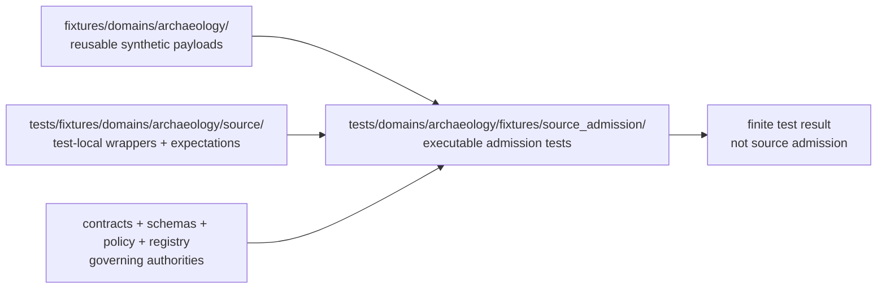

<!-- [KFM_META_BLOCK_V2]
doc_id: kfm://doc/tests-domains-archaeology-fixtures-source-admission-readme
title: tests/domains/archaeology/fixtures/source_admission/ — Archaeology Source-Admission Fixture Test Boundary
type: readme; directory-readme; domain-test-lane; fixture-safety; source-admission; sensitive-domain; non-authoritative
version: v0.2
status: draft; repository-grounded; direct-lane-readme-only; executable-tests-not-established; source-fixture-wrapper-lane-confirmed; reusable-fixture-root-confirmed; source-schema-drift-present; registry-path-drift-present; policy-scaffold; validator-readme-only; ci-todo-only; no-network-by-default; fail-closed
owners: OWNER_TBD — Archaeology steward · Source steward · Test/QA steward · Fixture steward · Rights steward · Sensitivity reviewer · Cultural-review steward · Sovereignty/CARE reviewer · Schema steward · Contract steward · Policy steward · Evidence steward · Registry steward · Validator steward · Release steward · Security reviewer · CI steward · Docs steward
created: NEEDS VERIFICATION — v0.1 states the placeholder was expanded on 2026-07-05
updated: 2026-07-16
supersedes: v0.1 short source-admission fixture-test README
policy_label: "public-review; tests; archaeology; fixtures; source-admission; synthetic-only; no-network; sensitive-domain; deny-by-default; source-role-fixed; rights-aware; cultural-review-aware; sovereignty-aware; evidence-aware; quarantine-aware; release-gated; correction-aware; rollback-aware; no-truth-authority; no-source-authority; no-publication-authority"
current_path: tests/domains/archaeology/fixtures/source_admission/README.md
truth_posture: >
  CONFIRMED target v0.1 README and prior blob; tests responsibility root; archaeology domain-test
  parent; archaeology fixture-test parent; newer test-local fixture parent and source wrapper lanes
  under tests/fixtures/domains/archaeology; canonical reusable fixture root under
  fixtures/domains/archaeology; draft source-admission standard and proposed ADR-0017; Archaeology
  source-registry and sensitivity doctrine; current source schema family with mixed maturity and
  naming/path drift; Archaeology policy scaffold; broad Archaeology validator README-only maturity;
  TODO-only domain workflow; Makefile default test target excluding domain lanes; root pytest
  configuration; bounded search surfacing only this README under the direct source_admission lane;
  no matching open pull request, task branch, duplicate document ID, or path-scoped AGENTS.md /
  PROPOSED this lane own executable tests that consume canonical reusable fixtures or clearly
  test-local wrappers and prove descriptor identity, role, rights, sensitivity, cultural review,
  activation, quarantine, no-network, evidence, correction, rollback, and non-publication behavior /
  CONFLICTED or drift-prone source registry lane order; singular/plural source schema paths;
  hyphen/underscore SourceDescriptor filenames; placeholder SourceActivationDecision shape;
  stale statements in older and newer parent READMEs about adjacent parent maturity; and duplicate
  test-fixture surfaces that require an explicit responsibility split rather than silent convergence /
  UNKNOWN exhaustive recursive lane inventory, dynamic test generation, ignored/generated files,
  actual collected cases, fixture payload inventory, active source descriptors, accepted admission
  contract, accepted activation vocabulary, runtime source resolver, policy evaluator, emitted
  SourceIntakeRecords, production registry consumers, branch-protection significance, release
  integration, and current pass rates / NEEDS VERIFICATION accepted owners, CODEOWNERS, canonical
  registry path, canonical schema/filename, executable tests, fixture IDs and consumers, policy bundle,
  validator command, no-network enforcement, CI artifact, required-check status, correction cascade,
  and rollback rehearsal
evidence_snapshot:
  repository: bartytime4life/Kansas-Frontier-Matrix
  repository_id: "1059091169"
  visibility: public
  base_ref: main
  base_commit: 0d0f8109486763c7b4099a7a7b8b4c9fbed7219d
  prior_blob: d5704547ed1601a1059ae0320c8d4efd567b1fa1
  direct_lane_indexed_files:
    - tests/domains/archaeology/fixtures/source_admission/README.md
  bounded_inventory_note: >
    Indexed search and named-path probes establish only the checked snapshot. They do not prove
    permanent absence from history, forks, ignored files, generated workspaces, dynamic test
    generation, Git LFS, external stores, or differently named paths.
  related_repository_blobs:
    archaeology_test_parent: 2b739d5bdf322de4523faa09a2b788be910bf8b0
    archaeology_fixture_test_parent: 9ef754a4b4111862ce4bfa1a435b69841df52c6a
    test_local_fixture_parent: 34b8aa536aa19c234f30f939ed1c06fa428b57dc
    test_local_source_wrapper: 2d871be1cf34b67312aa8c4cf121ab96a615655e
    canonical_fixture_root: ab348d4a5345d52cb0999072138e7c0feb63e8f1
    directory_rules: 2affb080e6f0043867c64c7f06c1ca52030fbd55
    source_admission_standard: ab27618a4b1b0e6775d18bedca37aa7d6c514e6e
    source_admission_adr: 0e8d03786bcc99b19f179680890df9e30a27633a
    archaeology_source_registry_doc: 7f905f43196eda6a063e65964f8054af0c12be10
    archaeology_registry_lane: 42032fdcee7670628320a2ba5a0951e27536f972
    archaeology_sensitivity_doc: ca7888f2d43f022faeef5e1a6e16ab00526cf7aa
    source_schema_index: 691e5f76ba800404fff26fabd120b7f42791e79a
    archaeology_policy_readme: 8d03cdb11361739e7ad33214f76a0cfe4836ff9b
    archaeology_validator_readme: bae2eabb5d29bf7099ed74a66a17c0071ae98557
    archaeology_workflow: b6a2869314efe2e34890baa5bbbe41d656629dd3
    makefile: 4dc8cf633581893d83fba53219c6ea847992e6be
    pyproject: e3bd40e8e6ce14dfcde78ff5c09608095c3eca76
related:
  - ../README.md
  - ../../README.md
  - ../../../README.md
  - ../../../../README.md
  - ../../../../fixtures/domains/archaeology/README.md
  - ../../../../fixtures/domains/archaeology/source/README.md
  - ../../../../../fixtures/domains/archaeology/README.md
  - ../../../../../docs/doctrine/directory-rules.md
  - ../../../../../docs/sources/ADMISSION_PROCESS.md
  - ../../../../../docs/adr/ADR-0017-source-descriptor-admission-process.md
  - ../../../../../docs/domains/archaeology/SOURCE_REGISTRY.md
  - ../../../../../docs/domains/archaeology/SENSITIVITY.md
  - ../../../../../data/registry/archaeology/sources/README.md
  - ../../../../../schemas/contracts/v1/source/README.md
  - ../../../../../policy/domains/archaeology/README.md
  - ../../../../../tools/validators/archaeology/README.md
  - ../../../../../.github/workflows/domain-archaeology.yml
  - ../../../../../Makefile
  - ../../../../../pyproject.toml
  - ../../../../../schemas/contracts/v1/receipts/generated_receipt.schema.json
tags: [kfm, tests, archaeology, fixtures, source-admission, SourceDescriptor, SourceActivationDecision, SourceIntakeRecord, source-role, rights, sensitivity, cultural-review, sovereignty, CARE, quarantine, no-network, evidence, release, correction, rollback]
notes:
  - "This revision changes only this README; a generated provenance receipt is paired separately."
  - "This lane tests source-admission fixture behavior. It does not own reusable fixture payloads, test-local fixture wrappers, source descriptors, registry records, schemas, policy, validator code, lifecycle data, or release decisions."
  - "No executable test, fixture payload, source descriptor, source activation, connector run, lifecycle transition, policy decision, release, or public artifact is created or modified."
[/KFM_META_BLOCK_V2] -->

<a id="top"></a>

# Archaeology Source-Admission Fixture Test Boundary

`tests/domains/archaeology/fixtures/source_admission/`

> **One-line purpose.** Define the executable, fail-closed test boundary that proves synthetic Archaeology source-admission fixtures cannot become source authority, protected-location disclosure, lifecycle admission, evidence closure, release approval, or public output merely because a fixture exists or a shape check passes.

<p>
  
  
  
  
  
  
  
  
</p>

> [!IMPORTANT]
> **This is an executable-test lane, not a fixture library.** Reusable payloads belong under [`fixtures/domains/archaeology/`](../../../../../fixtures/domains/archaeology/README.md). Test-local source wrappers and expectation manifests belong under [`tests/fixtures/domains/archaeology/source/`](../../../../fixtures/domains/archaeology/source/README.md) when their use is clearly bounded. This directory should contain the tests that consume those materials and prove source-admission behavior.

> [!CAUTION]
> **Executable coverage is not established in the checked lane.** Bounded repository search surfaced only this README under `tests/domains/archaeology/fixtures/source_admission/`. A README, proposed command, fixture path, TODO workflow, or green empty collection is not proof that source-admission rules are enforced.

> [!WARNING]
> **Archaeology is sensitive by default.** Exact site geometry, burial or human-remains context, sacred or culturally restricted locations, collection-security information, looting-risk detail, private-landowner geometry, restricted oral history, and sovereignty-bearing knowledge must not appear in fixture payloads, test IDs, assertion messages, snapshots, logs, reports, or CI artifacts. Use conspicuous synthetic canaries and fail closed.

**Quick links:** [Purpose](#purpose) · [Status](#current-evidence-and-maturity) · [Placement](#directory-rules-and-authority-split) · [Relationships](#three-fixture-and-test-surfaces) · [Admission](#source-admission-boundary) · [Scope](#test-scope) · [Fixtures](#fixture-contract) · [Cases](#required-case-matrix) · [Outcomes](#finite-outcomes-and-reason-codes) · [Validation](#validation-layers) · [Network](#no-network-security-and-sensitive-data) · [Commands](#deterministic-inventory-and-execution-commands) · [Failures](#failure-interpretation) · [Passing](#what-a-passing-suite-does-not-prove) · [CI](#ci-and-promotion-boundary) · [Maintenance](#maintenance-and-fixture-update-rules) · [Implementation](#smallest-sound-implementation-sequence) · [Done](#definition-of-done) · [Open](#open-verification-register) · [Evidence](#evidence-ledger) · [Rollback](#changelog-correction-and-rollback)

---

## Purpose

This lane should prove that Archaeology source-admission fixture behavior is deterministic, synthetic, reviewable, policy-aware, rights-aware, sensitivity-aware, and subordinate to governed source admission.

Its durable question is:

> Can a bounded test demonstrate that a source-shaped example is admitted, restricted, quarantined, denied, or held for review for the right reasons—without treating the example, validator, test result, or generated report as a real source decision?

The lane exists to test the membrane between an external source candidate and KFM's governed lifecycle. It does not perform source admission itself.

A mature suite should establish all of the following:

1. fixture identity is explicitly synthetic or test-scoped;
2. source identity and source role are stable and non-upgradable;
3. rights, redistribution, embargo, access, consent, revocation, steward, and cultural-review posture fail closed;
4. protected or reverse-engineerable detail never enters ordinary test data or output;
5. descriptor-level admission and record-level admission remain distinct;
6. source admission remains distinct from lifecycle promotion and public release;
7. unresolved cases route to finite deny, abstain, hold, quarantine, or error outcomes;
8. no default case needs a live source, connector, registry service, map, model, or AI runtime;
9. fixture success cannot emit or impersonate trust-bearing production artifacts;
10. correction, retirement, supersession, and rollback remain auditable.

[Back to top](#top)

---

## Current evidence and maturity

### Safe conclusion

The checked repository contains documentation for the source-admission test boundary and adjacent fixture surfaces, but it does not establish an executable source-admission fixture suite in this direct lane.

| Surface | Inspected status | Safe conclusion |
|---|---|---|
| This direct lane | **CONFIRMED README-only in bounded search** | No direct executable test surfaced. |
| [`tests/domains/archaeology/fixtures/`](../README.md) | **CONFIRMED parent README** | Defines domain fixture-test responsibility; executable maturity remains unverified. |
| [`tests/domains/archaeology/`](../../README.md) | **CONFIRMED parent README** | Defines Archaeology enforceability scope; current child inventory is incomplete. |
| [`tests/fixtures/domains/archaeology/`](../../../../fixtures/domains/archaeology/README.md) | **CONFIRMED test-local fixture parent** | Documents wrapper/expectation lanes; it is not the canonical fixture root. |
| [`tests/fixtures/domains/archaeology/source/`](../../../../fixtures/domains/archaeology/source/README.md) | **CONFIRMED source-wrapper README** | Owns test-local source-shaped wrappers and expectation manifests, not executable source admission. |
| [`fixtures/domains/archaeology/`](../../../../../fixtures/domains/archaeology/README.md) | **CONFIRMED reusable fixture root** | Payload inventory remains verification-bound. |
| [`docs/sources/ADMISSION_PROCESS.md`](../../../../../docs/sources/ADMISSION_PROCESS.md) | **CONFIRMED draft standard** | Distinguishes admission from promotion and specifies fail-closed intent. |
| [`ADR-0017`](../../../../../docs/adr/ADR-0017-source-descriptor-admission-process.md) | **CONFIRMED file / status `proposed`** | Its field sets, activation states, and implementation paths are not accepted authority. |
| [`schemas/contracts/v1/source/`](../../../../../schemas/contracts/v1/source/README.md) | **CONFIRMED mixed maturity** | Detailed schema, duplicate aliases, placeholders, and path drift coexist. |
| [`policy/domains/archaeology/`](../../../../../policy/domains/archaeology/README.md) | **CONFIRMED draft scaffold** | Deny-by-default intent exists; runtime enforcement remains unverified. |
| [`tools/validators/archaeology/`](../../../../../tools/validators/archaeology/README.md) | **CONFIRMED README-only broad lane** | No broad executable Archaeology validator surfaced in its bounded inspection. |
| `domain-archaeology` workflow | **CONFIRMED TODO-only** | Green completion is scaffold success, not source-admission proof. |
| `make test` | **CONFIRMED excludes domain lanes** | Runs `tests/schemas` and `tests/contracts`, not this lane. |

### Repository conflicts and drift that affect this lane

| Drift | Evidence-bounded posture | Test implication |
|---|---|---|
| Registry lane order | Both `data/registry/archaeology/sources/` and `data/registry/sources/archaeology/` are documented. | Fixtures must not silently choose a canonical registry path. |
| Source schema family | Singular `source/` and plural `sources/` references coexist. | Test bindings must pin the intended schema URI/path and reject accidental alias drift. |
| SourceDescriptor filename | Hyphenated and underscored names coexist with different maturity. | Fixtures must not pass under one alias while bypassing the other. |
| SourceActivationDecision shape | Current source schema index describes a placeholder rather than a mature accepted schema. | Tests may document expected behavior but must not claim contract-complete validation. |
| Test-fixture topology | Domain-side executable test lane and `tests/fixtures/.../source/` wrapper lane both exist. | Responsibility must remain explicit; payloads and tests must not be duplicated. |
| Parent-document freshness | Some adjacent READMEs preserve authoring-time statements that a parent was missing, while the parent now exists. | Current readback outranks stale statements; corrections require separate scoped updates. |

### Truth labels used here

| Label | Meaning |
|---|---|
| `CONFIRMED` | Verified from repository files, metadata, or bounded search at the pinned snapshot. |
| `PROPOSED` | A recommended test, fixture, outcome, command, or implementation step not established as current behavior. |
| `UNKNOWN` | Not resolved by inspected evidence. |
| `NEEDS VERIFICATION` | Checkable, but not sufficiently verified to act as fact. |
| `CONFLICTED` | Repository surfaces disagree or coexist without an accepted governing decision. |

[Back to top](#top)

---

## Directory Rules and authority split

Directory Rules place enforceability proof under `tests/`, reusable examples under `fixtures/`, object meaning under `contracts/`, machine shape under `schemas/`, decisions under `policy/`, source registry records under `data/registry/`, implementation under `tools/`, `connectors/`, and `pipelines/`, lifecycle artifacts under `data/`, and release decisions under `release/`.

The current path is therefore correct for executable source-admission fixture **tests**:

```text
tests/domains/archaeology/fixtures/source_admission/
```

It must not expand into a second fixture root, source registry, policy bundle, or admission service.

| Concern | Authority home | Relationship of this lane |
|---|---|---|
| Source-admission fixture tests | `tests/domains/archaeology/fixtures/source_admission/` | Primary responsibility of this lane. |
| Test-local source wrappers | `tests/fixtures/domains/archaeology/source/` | Inputs/expectations may be referenced; not duplicated here. |
| Reusable Archaeology fixtures | `fixtures/domains/archaeology/` | Canonical fixture payload home; referenced only. |
| Source admission doctrine | `docs/sources/ADMISSION_PROCESS.md` and accepted ADRs | Defines intent; tests do not amend it. |
| Archaeology source guidance | `docs/domains/archaeology/SOURCE_REGISTRY.md` and `SOURCES.md` | Human explanation; not machine truth. |
| Source descriptor instances | Accepted `data/registry/...` source lane | Registry authority; current lane order is conflicted. |
| Source meaning | `contracts/source/` and domain contracts | Tests consume; do not define. |
| Source shape | `schemas/contracts/v1/source/` or accepted successor | Tests bind explicitly; do not select silently. |
| Archaeology policy | `policy/domains/archaeology/` and accepted cross-cutting policy roots | Tests assert decisions; do not define them. |
| Validator implementation | `tools/validators/` | Tests invoke confirmed commands when available. |
| Connector behavior | `connectors/` | Dry-run behavior may be tested separately; no live fetch by default. |
| Lifecycle data | `data/raw/`, `data/quarantine/`, and downstream phases | Synthetic expectations only; no production writes. |
| Evidence, receipts, proof | Accepted `data/receipts/` and `data/proofs/` homes | Synthetic references only. |
| Release, correction, rollback | `release/` | Tests verify gates; never approve them. |
| Public API, map, tile, export, AI | Governed application and released-artifact paths | No direct consumption of this test lane. |

> [!IMPORTANT]
> A valid fixture and a passing test can support review. Neither is a SourceActivationDecision, SourceIntakeRecord, PolicyDecision, EvidenceBundle, ReleaseManifest, RedactionReceipt, review approval, cultural authority decision, or publication authorization.

[Back to top](#top)

---

## Three fixture and test surfaces

The repository currently exposes three related but non-equivalent surfaces.



### Responsibility contract

| Surface | May own | Must not own |
|---|---|---|
| `fixtures/domains/archaeology/` | Reusable, synthetic, compact fixture payloads with explicit expected posture. | Tests, source descriptors, real source exports, policy, release records. |
| `tests/fixtures/domains/archaeology/source/` | Test-local wrappers, expectation maps, parametrization manifests, safe canaries. | Canonical reusable payloads, executable admission authority, source registry records. |
| This lane | Executable tests, collection indexes, helper assertions tightly scoped to source-admission fixture behavior. | Reusable fixture library, source registry, schemas, policy, validators, lifecycle data, trust records. |

### Anti-duplication rules

- A reusable fixture ID has one accepted payload home.
- A test-local wrapper must point to, wrap, or intentionally differ from a canonical fixture; it must not become an unnoticed copy.
- An executable case has one collection identity.
- Snapshot keys, parametrization IDs, source IDs, decision IDs, evidence refs, and reason codes must not collide across fixture surfaces.
- Moving material between surfaces requires a migration note, consumer update, and rollback path.
- The same payload must not receive conflicting expectations solely because it is loaded from a different fixture surface.

[Back to top](#top)

---

## Source-admission boundary

### Admission is not promotion

The repository's draft source-admission standard distinguishes:

```text
external source candidate
        |
        v
descriptor / rights / sensitivity / authority review
        |
        +---- fail closed ----> DENY or QUARANTINE
        |
        v
admitted RAW capture + intake/receipt records
        |
        v
later promotion gates
RAW -> WORK/QUARANTINE -> PROCESSED -> CATALOG/TRIPLET -> PUBLISHED
```

This lane should test the pre-RAW admission boundary. It must not collapse admission into later lifecycle promotion.

### Descriptor-level and record-level admission

| Level | Question | Test concern |
|---|---|---|
| Descriptor-level | Is this source allowed in KFM, under which role, rights, sensitivity, steward, and activation posture? | SourceDescriptor identity, source role, rights, sensitivity, authority, activation decision. |
| Record-level | Does this source record meet the minimum bar, and is any fail-closed trigger active? | Per-record identifiers, provenance, required fields, sensitivity flags, quarantine reasons. |

A descriptor-level positive fixture does not make every record admissible. A record-level valid fixture does not activate its source.

### Proposed activation vocabulary boundary

`ADR-0017` records these activation states:

```text
denied | draft | active_internal | active_public_candidate | retired
```

The ADR status is `proposed`. Tests must therefore:

- pin the contract/schema version they are exercising;
- mark these states `PROPOSED` unless an accepted artifact confirms them;
- reject unknown or ambiguous states for a strict profile;
- avoid treating `active_public_candidate` as released or public;
- require a new governed decision for reactivation of a retired source;
- preserve decision history rather than overwrite it.

### Watcher and connector boundary

A watcher, ETag, Last-Modified value, checksum, successful HTTP response, connector dry run, or file presence may support admission review. None may:

- activate a source;
- change source role;
- clear rights or sensitivity;
- admit a protected record;
- bypass quarantine;
- promote to processed/catalog/published;
- approve release;
- publish to a public API, map, tile, export, or AI context.

[Back to top](#top)

---

## Test scope

### In scope

This lane may contain tests that prove:

- source-shaped fixture markers are explicitly synthetic or test-scoped;
- SourceDescriptor-like identity is stable and deterministic;
- SourceActivationDecision-like examples carry a bounded decision, reasons, version, reviewer posture, and rollback target where required;
- source role is explicit, fixed at admission, and not upgraded by helpers;
- rights, attribution, redistribution, access, embargo, consent, and revocation are present or fail closed;
- Archaeology sensitivity, cultural-review, sovereignty/CARE, landowner, and collection-security constraints fail closed;
- exact, protected, or reverse-engineerable location detail is rejected from fixture payloads and outputs;
- unresolved descriptor or record admission routes to quarantine, denial, abstention, hold, or error;
- SourceIntakeRecord-like and RunReceipt-like examples do not become production trust records;
- registry-path and schema-alias drift is detected;
- fixture loaders are deterministic and no-network;
- correction, retirement, supersession, withdrawal, and rollback references remain auditable;
- public and generated surfaces cannot consume unreleased fixture material.

### Out of scope

This lane must not contain or perform:

- real Archaeology source exports;
- real source descriptors, registry records, activation decisions, intake records, or receipts;
- live connector, watcher, API, archive, map, geocoder, model, database, or AI calls;
- canonical reusable fixture payload ownership;
- schema, contract, policy, or validator implementation;
- exact site coordinates or protected cultural details, even as negative examples;
- lifecycle writes to RAW, WORK, QUARANTINE, PROCESSED, CATALOG/TRIPLET, or PUBLISHED;
- release, correction, withdrawal, supersession, or rollback decisions;
- public API, map, tile, report, screenshot, search, graph, export, or AI output;
- generated prose presented as evidence, review, or cultural authority.

[Back to top](#top)

---

## Fixture contract

### Accepted input families

| Family | Typical test purpose | Required safety posture |
|---|---|---|
| Descriptor-shaped | Required identity, role, rights, cadence, steward, sensitivity, access, caveat fields. | Fake IDs; no real endpoints, secrets, or protected metadata. |
| Activation-decision-shaped | Finite admit/restrict/quarantine/deny/retire expectations. | Explicitly synthetic; decision is not real authority. |
| Intake-record-shaped | Binding between attempted material and source identity. | No source bytes; use digests/canaries only. |
| Rights and access | Missing terms, embargo, redistribution, consent, revocation, controlled access. | Invented licenses/terms labels; no legal claim. |
| Source-role | Observed, administrative, regulatory, modeled, aggregate, candidate, context, synthetic. | Role cannot be upgraded by fixture or helper. |
| Sensitivity | Protected-location, cultural restriction, sovereignty, CARE, private-landowner, collection-security flags. | No real sensitive detail; use obvious canaries. |
| Review | Missing/present synthetic steward, cultural, rights-holder, sensitivity review refs. | Refs are not approvals. |
| Watcher metadata | ETag, Last-Modified, checksum, content length, cadence, stale state. | Metadata only; no network and no publisher authority. |
| Quarantine | Missing identity, conflicting rights, invalid role, stale terms, sensitive content. | Expected finite reason and remediation posture. |
| Schema/registry drift | Singular/plural path, hyphen/underscore filename, duplicate ID, conflicting aliases. | Detect drift without choosing canon silently. |
| Evidence/receipt | Synthetic EvidenceRef, validation report, intake receipt, redaction receipt expectations. | No production EvidenceBundle or trust record. |
| Release boundary | Candidate/public-candidate, release missing, correction/rollback refs. | Fixture must remain unreleased. |

### Required fixture metadata

A mature fixture manifest should make these fields explicit, subject to accepted contracts:

```yaml
fixture_id: fixture://archaeology/source-admission/example-001
fixture_scope: synthetic
case_family: descriptor_identity
source_id: synthetic-source-001
source_role: synthetic
schema_ref: NEEDS_VERIFICATION
contract_ref: NEEDS_VERIFICATION
policy_profile_ref: NEEDS_VERIFICATION
rights_posture: synthetic-unresolved
sensitivity_posture: synthetic-deny
expected_test_outcome: PASS
expected_admission_behavior: QUARANTINE
expected_reason_codes:
  - ARCH_SOURCE_RIGHTS_UNRESOLVED
network_allowed: false
contains_real_source_data: false
contains_protected_location: false
```

This is a **PROPOSED fixture manifest**, not an accepted schema.

### Fixture identity and provenance

- Use deterministic fixture IDs.
- Record the consumer test or test family.
- Record the expected finite result and safe reason code.
- Record the fixture version or digest when mutation could change expectations.
- Keep invalid fixtures intentionally invalid in one inspectable way where practical.
- Use canaries to prove protected data and secrets do not pass through logs.
- Never copy a production record and merely replace its name.
- Never infer rights or cultural authority from a public URL or archive listing.

[Back to top](#top)

---

## Required case matrix

A mature suite should include positive, negative, denied, abstained, quarantined, error, correction, and rollback cases.

| Case | Input condition | Expected behavior | Why |
|---|---|---|---|
| Valid synthetic control | Complete, internally consistent synthetic descriptor and decision expectation. | Test `PASS`; bounded admission expectation only. | Positive control without real authority. |
| Missing synthetic marker | Fixture resembles a source record but lacks test scope. | `FAIL` / `QUARANTINE`. | Prevents accidental production-like data. |
| Real-source indicator | Endpoint, accession, coordinate, institution-private ID, or export marker appears. | `DENY` / `FAIL`. | Test lane must not ingest real sensitive material. |
| Missing source identity | No stable synthetic source ID or issuer context. | `QUARANTINE` / `ABSTAIN`. | Admission cannot resolve identity. |
| Duplicate source ID | Two fixtures claim the same ID with incompatible posture. | `FAIL` / `HOLD`. | Deterministic identity required. |
| Missing source role | Role absent or ambiguous. | `QUARANTINE` / `ABSTAIN`. | Role must be fixed at admission. |
| Source-role upcast | Candidate/context/modeled material becomes observed/regulatory/authoritative. | `DENY` / `FAIL`. | Anti-collapse invariant. |
| Missing rights | License, terms, attribution, redistribution, access, or embargo unresolved. | `DENY` / `ABSTAIN` / `QUARANTINE`. | Rights fail closed. |
| Stale rights snapshot | Fixture uses expired or superseded synthetic terms. | `HOLD` / `QUARANTINE`. | Re-review required. |
| Consent revoked | Synthetic consent token is revoked or embargoed. | `DENY` / `HOLD`. | Revocation must propagate. |
| Cultural review missing | Materiality requires review but no synthetic review ref exists. | `DENY` / `HOLD`. | Archaeology separation of duties. |
| Rights-holder review missing | Restricted or sovereignty-bearing fixture lacks required authority ref. | `DENY` / `HOLD`. | No inferred authority. |
| Exact geometry field | Fixture includes coordinates, precise footprint, reverse-geocodable hints, or collection-security detail. | `DENY` / `FAIL`. | Protected-location default deny. |
| Fake but realistic coordinate | Coordinate is invented but could normalize unsafe fixture patterns. | `DENY` / `FAIL`. | Negative tests use canaries, not plausible sites. |
| Sensitivity unknown | No audience tier/rank or accepted equivalent. | `DENY` / `ABSTAIN`. | Fail closed. |
| Watcher activates source | ETag/checksum success is treated as activation. | `FAIL`. | Watchers are non-publishers and non-approvers. |
| Connector before fixture | Live/dry-run connector is treated as acceptable before bounded fixture proof. | `HOLD`. | Fixture-before-connector discipline. |
| Live network attempt | DNS, HTTP, socket, database, map, archive, cloud, model, or AI call occurs. | `ERROR` / `FAIL`. | Default suite must be deterministic. |
| Registry path ambiguity | Fixture binds silently to one conflicted registry lane. | `HOLD` / `ERROR`. | Placement drift must be explicit. |
| Schema alias ambiguity | Fixture validates against only one conflicting SourceDescriptor alias without pinning. | `HOLD` / `ERROR`. | Prevents accidental bypass. |
| Placeholder activation schema | Test reports contract-complete activation validation against placeholder shape. | `FAIL`. | Presence is not maturity. |
| Descriptor positive, record invalid | Source descriptor passes; individual record lacks minimum admission fields. | Record `QUARANTINE`. | Two admission levels remain distinct. |
| Record positive, descriptor inactive | Record shape passes but descriptor is draft/denied/retired. | `DENY` / `HOLD`. | Record shape cannot activate source. |
| Active-internal to public | Internal activation is treated as public eligibility. | `DENY`. | Activation is not release. |
| Public-candidate to released | `active_public_candidate` is treated as published. | `DENY` / promotion block. | Later gates remain required. |
| Intake without decision | RAW-like write expectation lacks decision and receipt refs. | `FAIL` / `QUARANTINE`. | Admission must be auditable. |
| Fixture becomes EvidenceBundle | Synthetic evidence stub is treated as proof closure. | `ABSTAIN` / `FAIL`. | Fixture is not evidence. |
| Fixture becomes PolicyDecision | Expected policy result is stored or consumed as binding decision. | `FAIL`. | Tests do not make policy. |
| Fixture becomes release record | Expected ReleaseManifest/rollback ref is treated as real. | promotion block. | Test success is not release. |
| Log leakage | Assertion/report includes protected canary or secret marker. | `FAIL` / security review. | Outputs must be public-safe. |
| Correction propagation | Fixture expectation changes after rights/sensitivity correction. | `PASS` only when dependent assertions update. | Corrections must cascade. |
| Retired source reactivation | Retired fixture becomes active without new decision. | `DENY` / `HOLD`. | New decision required. |
| Rollback rehearsal | Fixture/test migration can restore prior IDs and expectations. | `PASS` or safe `ERROR`. | Reversibility required. |

### Minimal positive/negative pairing

Every important positive fixture should have at least one paired negative case:

| Positive claim | Paired negative |
|---|---|
| Source ID resolves | Missing or duplicate source ID. |
| Role is accepted | Missing or upcast role. |
| Rights posture is acceptable | Missing, stale, conflicting, embargoed, or revoked rights. |
| Sensitivity transform is permitted | Exact/protected detail or missing review. |
| Activation state is accepted | Unknown, retired, denied, or public-candidate misread as released. |
| Record enters RAW expectation | Missing intake decision, receipt, or source binding. |
| Fixture output is safe | Canary leaks to assertion/report. |
| No-network loader succeeds | Socket/DNS/HTTP attempt fails deterministically. |

[Back to top](#top)

---

## Finite outcomes and reason codes

### Layered outcomes

Do not collapse framework, admission, policy, and lifecycle outcomes into one vocabulary.

| Layer | Candidate outcomes | Boundary |
|---|---|---|
| Test runner | pass, fail, skip, error | Framework result only. |
| Fixture validator | `PASS`, `FAIL`, `ERROR` | Fixture/test validity only. |
| Proposed admission behavior | `ADMIT`, `RESTRICT`, `QUARANTINE`, `DENY`, `ABSTAIN`, `ERROR` | Must be reconciled with accepted admission contract. |
| Proposed activation status | `denied`, `draft`, `active_internal`, `active_public_candidate`, `retired` | From proposed ADR; not release state. |
| Policy | `ALLOW`, `RESTRICT`, `HOLD`, `ABSTAIN`, `DENY`, `ERROR` | Comes from policy runtime, not this README. |
| Lifecycle/release | accepted state-transition vocabulary | Must come from accepted lifecycle and release contracts. |

### Proposed safe reason codes

| Reason code | Meaning |
|---|---|
| `ARCH_SOURCE_FIXTURE_NOT_SYNTHETIC` | Fixture is not explicitly synthetic or test-scoped. |
| `ARCH_SOURCE_REAL_DATA_INDICATOR` | Fixture contains source-like or protected production indicators. |
| `ARCH_SOURCE_ID_MISSING` | Stable synthetic source identity is absent. |
| `ARCH_SOURCE_ID_CONFLICT` | Duplicate source identity has conflicting posture. |
| `ARCH_SOURCE_ROLE_MISSING` | Source role is absent or ambiguous. |
| `ARCH_SOURCE_ROLE_UPCAST` | Fixture/helper upgraded source authority. |
| `ARCH_SOURCE_RIGHTS_UNRESOLVED` | Rights, attribution, redistribution, access, or embargo is unresolved. |
| `ARCH_SOURCE_TERMS_STALE` | Rights/terms snapshot is stale or superseded. |
| `ARCH_SOURCE_CONSENT_REVOKED` | Consent or access grant is revoked. |
| `ARCH_SOURCE_CULTURAL_REVIEW_REQUIRED` | Required cultural/steward review is missing. |
| `ARCH_SOURCE_RIGHTS_HOLDER_REVIEW_REQUIRED` | Required rights-holder authority is missing. |
| `ARCH_SOURCE_PROTECTED_DETAIL_FORBIDDEN` | Exact or reverse-engineerable protected detail is present. |
| `ARCH_SOURCE_SENSITIVITY_UNRESOLVED` | Sensitivity/audience posture cannot be resolved. |
| `ARCH_SOURCE_WATCHER_AUTHORITY_COLLAPSE` | Watcher metadata was treated as admission or publication authority. |
| `ARCH_SOURCE_FIXTURE_BEFORE_CONNECTOR_REQUIRED` | Connector behavior was attempted before fixture proof. |
| `ARCH_SOURCE_NETWORK_FORBIDDEN` | Default test attempted live access. |
| `ARCH_SOURCE_REGISTRY_PATH_CONFLICT` | Registry lane order is unresolved. |
| `ARCH_SOURCE_SCHEMA_ALIAS_CONFLICT` | Source schema path or filename alias is unresolved. |
| `ARCH_SOURCE_ACTIVATION_SCHEMA_PLACEHOLDER` | Activation shape is not mature enough for claimed validation. |
| `ARCH_SOURCE_DESCRIPTOR_INACTIVE` | Record is otherwise valid but source is not active for the requested use. |
| `ARCH_SOURCE_INTAKE_DECISION_MISSING` | RAW/intake expectation lacks governed decision support. |
| `ARCH_SOURCE_EVIDENCE_UNRESOLVED` | Evidence support cannot be resolved. |
| `ARCH_SOURCE_RELEASE_GATE_MISSING` | Admission or public-candidate state was treated as release. |
| `ARCH_SOURCE_OUTPUT_LEAK` | Protected or secret canary escaped into output. |
| `ARCH_SOURCE_CORRECTION_NOT_PROPAGATED` | Dependent fixture/test expectations remain stale. |
| `ARCH_SOURCE_ROLLBACK_UNPROVEN` | Migration or correction cannot be reversed. |
| `ARCH_SOURCE_TEST_COLLECTION_EMPTY` | No meaningful cases were collected. |
| `ARCH_SOURCE_UNEXPECTED_ERROR` | Tooling or repository support failed safely. |

Reason codes must not embed real source names, private endpoints, protected locations, tokens, access terms, or culturally restricted details.

[Back to top](#top)

---

## Validation layers

A mature test lane should make each validation layer visible.

| Layer | What to verify | Failure posture |
|---|---|---|
| 1. Inventory | Intended test, wrapper, reusable fixture, schema, contract, policy, and registry paths exist and do not duplicate responsibility. | `FAIL` / `HOLD`. |
| 2. Syntax | JSON/YAML/text fixtures parse and carry explicit synthetic markers. | `FAIL`. |
| 3. Shape | Fixture binds to a pinned, accepted schema profile; alias drift is detected. | `FAIL` / `HOLD`. |
| 4. Semantics | Source ID, role, descriptor/record admission level, activation, stale/retired state are coherent. | `QUARANTINE` / `DENY`. |
| 5. Rights/access | Attribution, redistribution, access, embargo, consent, revocation, and terms posture resolve. | `DENY` / `ABSTAIN`. |
| 6. Sensitivity/cultural review | Protected detail, sovereignty, CARE, steward, rights-holder, audience, and transform posture resolve. | `DENY` / `HOLD`. |
| 7. Evidence/receipt | Expected evidence, decision, intake, validation, and transform refs are present without impersonating production records. | `ABSTAIN` / `FAIL`. |
| 8. Lifecycle | Admission routes only to bounded RAW/quarantine expectations; no promotion or publication shortcut. | `FAIL` / promotion block. |
| 9. No-network/security | Loader cannot access live services or leak canaries/secrets. | `ERROR` / `FAIL`. |
| 10. Correction/rollback | Supersession, retirement, correction, fixture migration, and rollback are deterministic. | `HOLD` / `ERROR`. |
| 11. Reporting | Structured output is finite, deterministic, public-safe, and does not claim authority. | `FAIL`. |
| 12. CI significance | Command collects meaningful tests; artifacts and required-check posture are known. | `NEEDS VERIFICATION` / promotion block. |

### Evidence closure rule

Evidence-bearing assertions should resolve a synthetic EvidenceRef to a deliberately bounded fixture stub or return an explicit abstention. A fixture path, source ID, checksum, test success, or generated explanation is not an EvidenceBundle.

### Policy rule

Tests may assert that policy returns a finite result. They must not hard-code a permissive outcome that bypasses the accepted policy bundle, or report a README table as runtime policy.

[Back to top](#top)

---

## No-network, security, and sensitive data

### Default no-network posture

Default tests must block or avoid:

- DNS resolution;
- HTTP/HTTPS;
- sockets;
- cloud object stores;
- source APIs and archive systems;
- databases and graph stores;
- geocoders and reverse geocoders;
- map/tile services;
- connector execution against live endpoints;
- release services;
- external model or AI runtimes.

A separately gated integration test may exist only when rights, credentials, environment, audience, retention, and artifact handling are explicitly governed. It must not run in the default suite.

### Prohibited fixture and output content

Do not place in fixtures, tests, snapshots, logs, reports, or CI artifacts:

- exact or plausible Archaeology site coordinates;
- sacred, burial, human-remains, looting-risk, or collection-security details;
- private landowner geometry or contact details;
- restricted oral history or culturally governed knowledge;
- real source exports or accession records;
- real credentials, tokens, cookies, API keys, private endpoints, or signed URLs;
- real SourceDescriptors, SourceActivationDecisions, SourceIntakeRecords, EvidenceBundles, ReviewRecords, receipts, release manifests, rollback cards, or audit logs;
- production hashes that could identify restricted material;
- operational protective-action or enforcement information.

### Safe canary practice

Use unmistakable markers:

```text
fixture://archaeology/source-admission/example-001
SYNTHETIC_PROTECTED_DETAIL_CANARY
example.invalid
00000000-0000-7000-8000-000000000001
sha256:0000000000000000000000000000000000000000000000000000000000000000
```

A canary should reveal leakage without resembling a real site, person, institution-private identifier, or source record.

### Untrusted content

Treat fixture text as untrusted data. Tests must ensure that embedded instructions, markup, prompt injection, executable snippets, URLs, or serialized objects cannot:

- alter test discovery;
- execute shell or code;
- activate network access;
- change policy context;
- expose environment variables;
- become AI instructions;
- write lifecycle or public artifacts.

[Back to top](#top)

---

## Deterministic inventory and execution commands

### Inventory

```bash
find tests/domains/archaeology/fixtures/source_admission -maxdepth 6 -type f 2>/dev/null | sort

find tests/fixtures/domains/archaeology/source \
     fixtures/domains/archaeology \
     -maxdepth 6 -type f 2>/dev/null | sort

find schemas/contracts/v1/source schemas/contracts/v1/sources \
     contracts/source policy/domains/archaeology tools/validators/archaeology \
     -maxdepth 6 -type f 2>/dev/null | sort

find data/registry/archaeology/sources data/registry/sources/archaeology \
     -maxdepth 6 -type f 2>/dev/null | sort
```

These commands inventory paths. They do not select canonical aliases or prove fixture/test validity.

### Collection diagnostics

```bash
python -m pytest --collect-only \
  tests/domains/archaeology/fixtures/source_admission -q
```

Interpretation:

- meaningful collected cases: inspect names, duplicates, markers, and dependencies;
- zero collected cases: coverage gap, not pass;
- import error: implementation gap, not policy denial;
- collection from both wrapper and executable lanes: inspect for duplicate responsibility.

### Diagnostic execution

```bash
python -m pytest \
  tests/domains/archaeology/fixtures/source_admission -q
```

This command is a diagnostic candidate. It is not an accepted repository gate until executable files, fixtures, dependency versions, no-network enforcement, expected outcomes, report retention, CI ownership, and pass significance are verified.

### Repository convenience commands

```bash
make test
make schemas
```

Current inspected behavior:

- `make test` runs `python -m pytest tests/schemas tests/contracts -q`; it does **not** execute this lane.
- `make schemas` runs the shared validator orchestrator; it does not establish source-admission fixture behavior.
- `pyproject.toml` configures Python 3.11+, pytest as a test extra, and repository-root `pythonpath`.

### Commands to avoid as proof

Do not report success merely because:

```bash
pytest tests/domains/archaeology/fixtures/source_admission || true
```

returns zero. `|| true` suppresses meaningful failure and is unsuitable for a promotion gate.

[Back to top](#top)

---

## Failure interpretation

| Observed result | Interpretation | Required action |
|---|---|---|
| Direct lane contains only README | Current bounded maturity. | Do not claim executable coverage. |
| Zero tests collected | Coverage gap. | Add scoped tests before reporting pass. |
| Tests collect from wrapper lane as independent authority | Topology drift. | Keep wrappers as inputs; move executable ownership here or accepted lane. |
| Fixture missing synthetic marker | Unsafe fixture. | Reject or quarantine. |
| Schema passes but policy denies | Expected layered behavior may be correct. | Preserve policy result; do not call schema pass overall success. |
| Policy allows but rights/sensitivity unresolved | Unsafe policy or context. | Fail closed and investigate. |
| Same fixture passes under one alias and fails under another | Schema/registry drift. | `HOLD`; pin and reconcile aliases. |
| Live network required | Default-suite violation. | Replace with deterministic fixture or separate governed integration lane. |
| TODO workflow succeeds | Scaffold success only. | Do not claim source-admission enforcement. |
| `make test` succeeds | Schema/contract subset success. | Does not cover this lane. |
| Protected canary appears in logs/report | Security/sensitivity failure. | Stop, minimize, redact, quarantine artifact, review. |
| Admission fixture writes RAW or release files | Authority and lifecycle violation. | Remove side effect; test through temporary/synthetic interfaces. |
| Public-candidate fixture appears publicly | Admission/release collapse. | Deny and block promotion. |
| Fixture update changes outcomes without review | Drift. | Review consumers, version fixture, update receipt/changelog. |
| Rollback cannot restore prior fixture IDs | Irreversible migration. | Block change until rollback works. |
| Workflow fails on unrelated doctrine prerequisite | Repository-level blocker. | Record accurately; do not broaden scope automatically. |

A source-admission test should prefer honest failure or abstention over optimistic normalization.

[Back to top](#top)

---

## What a passing suite does not prove

A passing suite does **not** prove that:

- a source is real, authoritative, current, complete, or suitable;
- a SourceDescriptor or SourceActivationDecision has been accepted;
- the source registry path conflict is resolved;
- SourceDescriptor schema aliases are reconciled;
- rights, license, attribution, redistribution, access, embargo, consent, revocation, or legal use are cleared;
- a cultural, sovereignty, steward, or rights-holder review occurred;
- exact or protected Archaeology detail is releasable;
- fixture payloads represent source truth;
- a connector may run;
- material may enter production RAW;
- a record may leave quarantine;
- EvidenceBundle closure exists;
- policy, validator, registry, connector, lifecycle, catalog, release, correction, withdrawal, or rollback works in production;
- CI runs this lane or branch protection requires it;
- public API, map, tile, export, report, search, graph, Focus Mode, screenshot, or AI behavior is safe;
- admission, promotion, release, or publication occurred.

Passing means only that the bounded assertions behaved as expected against the tested synthetic inputs and pinned dependencies.

[Back to top](#top)

---

## CI and promotion boundary

### Current workflow evidence

The inspected `domain-archaeology` workflow runs three checkout-plus-echo jobs:

- `validate-archaeology`;
- `build-proof-archaeology`;
- `publish-dry-run-archaeology`.

They are TODO scaffolds. A green workflow is not source-admission validation, proof, release readiness, or publication approval.

### Requirements before CI can enforce this lane

1. accepted test owner and CODEOWNERS coverage;
2. executable source-admission test modules;
3. accepted reusable fixture and wrapper responsibilities;
4. fixture manifest or consumer map;
5. pinned source contract/schema versions;
6. explicit handling of schema and registry path drift;
7. policy bundle and evaluator entrypoint;
8. deterministic no-network enforcement;
9. protected-data and secret canary checks;
10. meaningful positive and negative coverage;
11. structured public-safe test report;
12. correction, retirement, and rollback cases;
13. path filters and CI command;
14. required-check or promotion-gate significance verified;
15. retained artifacts with safe retention and no protected details.

### Promotion rule

A green source-admission fixture suite may support a source review. It cannot:

- accept an ADR;
- select a registry or schema alias;
- activate a source;
- admit real material;
- clear rights or cultural review;
- write lifecycle artifacts;
- approve promotion or release;
- publish a map/API/AI output.

[Back to top](#top)

---

## Maintenance and fixture update rules

### When a reusable fixture changes

Update or verify:

- canonical fixture payload and digest;
- all consumer tests;
- test-local wrappers/expectations;
- source/schema/contract/policy version refs;
- expected outcomes and reason codes;
- sensitivity and rights canaries;
- snapshots and reports;
- generated receipt where required;
- changelog and correction note for material expectation changes;
- rollback to the prior fixture version.

### When a source schema changes

- identify which SourceDescriptor alias/path changed;
- verify whether the change is accepted, proposed, or migration-only;
- run valid and invalid cases;
- verify `additionalProperties`, required fields, enums, and references;
- ensure placeholder schemas are not mistaken for strict validation;
- update fixture bindings and consumer maps;
- preserve backward compatibility or document migration and rollback.

### When rights, sensitivity, or review posture changes

- fail closed until affected fixtures and expectations are updated;
- invalidate permissive snapshots;
- update correction/withdrawal expectations;
- verify public-safe output tests;
- do not retain superseded protected detail in Git history through replacement fixtures;
- use synthetic data for all new tests.

### When paths move

A move among `fixtures/`, `tests/fixtures/`, and `tests/domains/` requires:

1. responsibility justification;
2. Directory Rules review;
3. consumer inventory;
4. history-preserving move;
5. duplicate-ID and duplicate-collection checks;
6. link and CI updates;
7. compatibility/deprecation note where needed;
8. generated receipt;
9. rollback path;
10. parent README updates in the same or coordinated changes.

[Back to top](#top)

---

## Smallest sound implementation sequence

This sequence is **PROPOSED**.

### Step 1 — Freeze the topology

- confirm this lane owns executable tests;
- confirm `tests/fixtures/.../source/` owns wrappers;
- confirm `fixtures/domains/archaeology/` owns reusable payloads;
- record any exception.

### Step 2 — Resolve minimum bindings

- select the exact SourceDescriptor contract/schema profile for the pilot;
- record singular/plural and hyphen/underscore alias posture;
- identify the activation-decision contract or explicitly mark it unavailable;
- select registry fixture representation without declaring a conflicted registry path canonical.

### Step 3 — Add safe pilot fixtures

At minimum:

- one valid synthetic descriptor;
- missing synthetic marker;
- missing source ID;
- missing and upcast source role;
- unresolved rights;
- stale terms;
- protected-detail canary;
- missing cultural review;
- inactive/retired source;
- descriptor-valid/record-invalid pair;
- watcher-authority collapse;
- live-network canary;
- release-gate missing;
- correction/rollback pair.

### Step 4 — Add executable tests

Prefer small deterministic modules grouped by concern:

```text
test_fixture_scope.py
test_descriptor_identity.py
test_source_role.py
test_rights_and_access.py
test_sensitivity_and_review.py
test_activation_and_quarantine.py
test_schema_and_registry_drift.py
test_no_network.py
test_release_boundary.py
test_correction_and_rollback.py
```

Filenames are proposed; do not create them without checking current repo inventory and ownership.

### Step 5 — Add no-network and leak controls

- block socket/DNS/HTTP;
- scan structured reports for canaries;
- use temporary directories;
- prohibit writes outside test temp roots;
- prevent fixture text from becoming executable or AI instructions.

### Step 6 — Add a stable command and report

- run only this intended suite;
- fail on zero collection;
- emit deterministic structured results;
- separate test result from admission/policy outcome;
- retain no protected detail.

### Step 7 — Admit to CI

- add path filters;
- document required dependencies;
- publish safe report artifact;
- verify least-privilege permissions;
- establish ownership and required-check significance;
- do not connect a green result directly to release approval.

### Step 8 — Rehearse correction and rollback

- change a synthetic rights/sensitivity posture;
- prove dependent cases update or invalidate;
- restore the prior fixture/test version;
- verify IDs, reports, links, and receipts return to the prior state.

[Back to top](#top)

---

## Definition of done

This lane is not implementation-complete until all applicable items are verified.

### Placement and authority

- [ ] Executable-test, test-local-wrapper, and reusable-fixture responsibilities are accepted.
- [ ] No duplicate fixture or test authority exists.
- [ ] Parent READMEs agree on current topology.
- [ ] Source registry path conflict has an accepted handling rule.
- [ ] Source schema path and filename aliases have accepted handling.

### Fixtures and contracts

- [ ] Fixture manifest/consumer map exists.
- [ ] All fixtures are synthetic, deterministic, public-safe, and reviewable.
- [ ] Valid, invalid, denied, abstained, quarantined, error, correction, and rollback cases exist.
- [ ] Contract/schema versions are pinned.
- [ ] Placeholder schemas cannot satisfy strict tests.
- [ ] SourceActivationDecision expectations use an accepted or explicitly proposed profile.

### Safety and policy

- [ ] Rights, sensitivity, cultural review, sovereignty/CARE, consent, revocation, embargo, and source-role cases fail closed.
- [ ] Exact/protected detail is absent from inputs and outputs.
- [ ] No-network enforcement is tested.
- [ ] Secret and protected-detail canary scans pass.
- [ ] Watcher and connector non-authority boundaries are tested.

### Lifecycle and evidence

- [ ] Descriptor-level and record-level admission remain distinct.
- [ ] Admission remains distinct from promotion and release.
- [ ] Evidence and receipt stubs cannot become trust records.
- [ ] Quarantine behavior is explicit and reversible.
- [ ] Retirement, correction, supersession, and rollback cases pass.

### Execution and CI

- [ ] Non-empty test collection is verified.
- [ ] Local command is stable and documented.
- [ ] CI runs the same command.
- [ ] Structured report is deterministic and public-safe.
- [ ] Owners and CODEOWNERS are accepted.
- [ ] Required-check and promotion-gate significance are verified.
- [ ] Current pass/fail evidence is retained and reviewable.

[Back to top](#top)

---

## Open verification register

| Item | Status | Evidence needed |
|---|---|---|
| Direct executable test inventory | `UNKNOWN` beyond bounded search | Recursive tree and pytest collection report. |
| Reusable fixture payload inventory | `NEEDS VERIFICATION` | Fixture manifest with IDs, digests, consumers, expected outcomes. |
| Test-local source wrapper inventory | `NEEDS VERIFICATION` | Wrapper/expectation manifest and consumer map. |
| Canonical SourceDescriptor contract | `NEEDS VERIFICATION` | Accepted contract/profile and version. |
| Canonical SourceDescriptor schema path | `CONFLICTED` | Accepted migration/ADR for singular/plural family. |
| Canonical SourceDescriptor filename | `CONFLICTED` | Accepted migration for hyphen/underscore aliases. |
| SourceActivationDecision shape | `NEEDS VERIFICATION` | Accepted schema/contract; current index reports placeholder. |
| Canonical Archaeology source registry lane | `CONFLICTED` | Accepted registry layout or migration record. |
| Activation-state vocabulary | `PROPOSED` | Accepted ADR/contract or policy profile. |
| Admission decision vocabulary | `NEEDS VERIFICATION` | Accepted runtime/contract outcomes. |
| Source-role enum | `NEEDS VERIFICATION` | Accepted cross-domain vocabulary and Archaeology profile. |
| Rights and sensitivity policy bundle | `UNKNOWN / scaffold` | Bundle manifest, policy files, evaluator tests. |
| Cultural/sovereignty review contract | `NEEDS VERIFICATION` | Accepted review object and policy integration. |
| Validator executable | `NOT ESTABLISHED` | Confirmed command/module and deterministic report. |
| No-network enforcement | `NOT ESTABLISHED` | Socket/DNS guard test and CI evidence. |
| Protected-output scan | `NOT ESTABLISHED` | Canary test and report/artifact scan. |
| Domain CI coverage | `TODO scaffold` | Workflow invoking meaningful command. |
| Branch-protection requirement | `UNKNOWN` | Ruleset/protection evidence. |
| Owners and CODEOWNERS | `NEEDS VERIFICATION` | Accepted ownership records. |
| Current pass rates and coverage | `UNKNOWN` | Test report and coverage artifact. |
| Correction cascade | `UNKNOWN` | Replayed rights/sensitivity correction test. |
| Rollback rehearsal | `UNKNOWN` | Tested rollback command and receipt. |

Open items are blockers or scoped follow-up work. They are not permission to guess.

[Back to top](#top)

---

## Evidence ledger

| Evidence | Status | Supports | Limits |
|---|---|---|---|
| Prior target README | `CONFIRMED` | Existing source-admission fixture-test purpose and basic negative cases. | Short, partly stale, and not executable proof. |
| [`tests/domains/archaeology/fixtures/README.md`](../README.md) | `CONFIRMED` | Parent domain fixture-test boundary. | Executable inventory remains unverified. |
| [`tests/domains/archaeology/README.md`](../../README.md) | `CONFIRMED` | Archaeology test authority and deny-by-default responsibilities. | Child inventory is incomplete. |
| [`tests/fixtures/domains/archaeology/README.md`](../../../../fixtures/domains/archaeology/README.md) | `CONFIRMED` | Test-local fixture expectation topology and child lanes. | Some authoring-time statements are stale. |
| [`tests/fixtures/domains/archaeology/source/README.md`](../../../../fixtures/domains/archaeology/source/README.md) | `CONFIRMED` | Source-shaped wrapper and expectation responsibility. | Executable tests and payloads remain unverified. |
| [`fixtures/domains/archaeology/README.md`](../../../../../fixtures/domains/archaeology/README.md) | `CONFIRMED` | Reusable fixture root and synthetic-only boundary. | Payload inventory and validity unverified. |
| [`Directory Rules`](../../../../../docs/doctrine/directory-rules.md) | `CONFIRMED doctrine` | Responsibility-root placement, lifecycle, drift, reversibility. | Does not settle current source schema/registry aliases. |
| [`KFM Source Admission Process`](../../../../../docs/sources/ADMISSION_PROCESS.md) | `CONFIRMED draft standard` | Admission/promotion split, SourceDescriptor, activation/intake intent, fail-closed posture. | Some paths and object details remain proposed. |
| [`ADR-0017`](../../../../../docs/adr/ADR-0017-source-descriptor-admission-process.md) | `CONFIRMED proposed ADR` | Descriptor/record admission split, proposed activation flow/states, fixture-before-connector. | Not accepted; cannot be treated as implemented authority. |
| [`Archaeology Source Registry`](../../../../../docs/domains/archaeology/SOURCE_REGISTRY.md) | `CONFIRMED draft guide` | Role fixed at admission, rights/sensitivity/cultural review, exact-location deny, watcher non-publisher. | Machine truth and implementation remain verification-bound. |
| [`Archaeology Sensitivity`](../../../../../docs/domains/archaeology/SENSITIVITY.md) | `CONFIRMED draft doctrine` | T4/rank-5 deny defaults and protected-detail handling. | Machine policy enforcement unverified. |
| [`data/registry/archaeology/sources/README.md`](../../../../../data/registry/archaeology/sources/README.md) | `CONFIRMED registry-lane README` | Source descriptor instance boundary and explicit registry path conflict. | Descriptor payload inventory and canonical path unverified. |
| [`source` schema index](../../../../../schemas/contracts/v1/source/README.md) | `CONFIRMED mixed maturity` | Alias/path drift, detailed schema, placeholders, promotion checklist. | Does not establish accepted strict schema. |
| [`Archaeology policy README`](../../../../../policy/domains/archaeology/README.md) | `CONFIRMED scaffold` | Deny-by-default decision intent and finite policy vocabulary. | Executable rules/runtime unverified. |
| [`Archaeology validator README`](../../../../../tools/validators/archaeology/README.md) | `CONFIRMED README-only lane` | Validator maturity, sensitive-output boundaries, test/CI gaps. | No executable validator proof. |
| [`domain-archaeology` workflow](../../../../../.github/workflows/domain-archaeology.yml) | `CONFIRMED TODO scaffold` | PR/push trigger and job names. | Echo steps provide no substantive validation. |
| [`Makefile`](../../../../../Makefile) | `CONFIRMED` | Default test target excludes domain lanes. | Does not enumerate every ad hoc or CI command. |
| [`pyproject.toml`](../../../../../pyproject.toml) | `CONFIRMED` | Python/pytest baseline and root pythonpath. | Does not prove dependencies are installed or tests collect. |
| Bounded repository search | `CONFIRMED performed` | Surfaced only this README in the direct lane and no competing PR/branch/doc ID. | Not exhaustive recursive/historical proof. |

[Back to top](#top)

---

## Changelog, correction, and rollback

### v0.2 — 2026-07-16

- replaced the short v0.1 README with a repository-grounded source-admission fixture-test boundary;
- separated executable tests, test-local wrappers, and reusable fixture responsibilities;
- documented direct-lane README-only maturity;
- incorporated current source-admission doctrine and proposed ADR limits;
- documented source registry, schema path, and filename drift;
- added descriptor-level versus record-level admission tests;
- added rights, sensitivity, cultural-review, sovereignty/CARE, no-network, quarantine, evidence, release, correction, and rollback cases;
- removed `|| true` from suggested proof commands;
- documented current Makefile and TODO-only workflow limitations;
- added implementation sequence, definition of done, verification register, and evidence ledger;
- created no executable test, fixture payload, source decision, lifecycle artifact, release, or public output.

### Correction path

If a repository claim in this README becomes inaccurate:

1. identify the exact claim and pinned snapshot;
2. inspect current authoritative files and executable evidence;
3. narrow or replace the claim;
4. update the evidence snapshot and ledger;
5. update affected links, topology, commands, and open items;
6. update the generated receipt;
7. record the correction in this changelog;
8. keep permissive admission or public use on hold until material corrections propagate.

### Rollback path

This documentation revision is reversible by restoring the prior blob:

```text
d5704547ed1601a1059ae0320c8d4efd567b1fa1
```

Rollback should also remove the paired generated receipt through reviewed Git history. Because this revision changes documentation only, rollback does not alter source admission, fixtures, tests, schemas, policy, registries, lifecycle data, releases, or public state.

### Human review

Human review remains pending. The generated receipt records provenance and validation; it is not source, cultural, policy, or release approval.

---

**Last reviewed:** 2026-07-16  
**Implementation posture:** README-only direct lane in bounded evidence  
**Default execution:** deterministic, synthetic, no-network, fail-closed  
**Sensitivity posture:** protected Archaeology detail denied by default  
**Authority:** tests only; no source admission, lifecycle, policy, cultural, release, or publication authority

[Back to top](#top)
